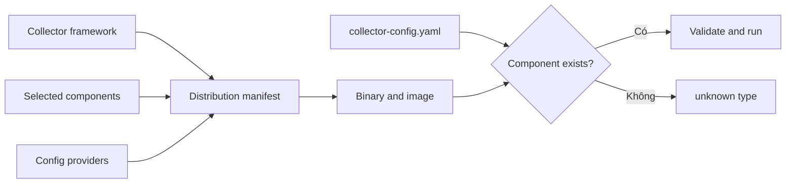

<Callout type="info" title="Distribution là API vận hành của binary">
  File cấu hình chỉ dùng được khi binary chứa đúng component và provider. Pin
  image bằng version hoặc digest, chạy `components` trên chính artifact đó và
  không suy luận từ tên distribution. Danh sách artifact, manifest và version
  OCB trong bài được kiểm chứng với upstream release `v0.157.0`.
</Callout>

## Mục lục

- [Distribution là gì](#distribution-là-gì)
- [Các distribution upstream hiện hành](#các-distribution-upstream-hiện-hành)
  - [Core và contrib](#core-và-contrib)
  - [Các distribution chuyên biệt](#các-distribution-chuyên-biệt)
- [Vendor distribution](#vendor-distribution)
- [Ma trận quyết định](#ma-trận-quyết-định)
- [Kiểm tra component có sẵn](#kiểm-tra-component-có-sẵn)
- [Custom distribution với ocb](#custom-distribution-với-ocb)
  - [Manifest đã pin](#manifest-đã-pin)
  - [Build và kiểm tra](#build-và-kiểm-tra)
- [Cấu hình Collector tối thiểu](#cấu-hình-collector-tối-thiểu)
- [Chuỗi cung ứng và nâng cấp](#chuỗi-cung-ứng-và-nâng-cấp)
  - [Dependency, SBOM và CVE](#dependency-sbom-và-cve)
  - [Chiến lược nâng cấp](#chiến-lược-nâng-cấp)
- [Lỗi phổ biến](#lỗi-phổ-biến)
- [Nguồn chính thức và bài liên quan](#nguồn-chính-thức-và-bài-liên-quan)

## Distribution là gì

Collector distribution là binary/container được build từ Collector framework,
một tập receiver, processor, exporter, connector, extension và configuration
provider cụ thể. Hai binary cùng phiên bản framework vẫn có thể chấp nhận hai
file YAML khác nhau vì tập component khác nhau.



Tên `otelcol` hoặc `otelcol-contrib` mô tả artifact upstream, không phải protocol.
Cả hai đều có thể nhận và gửi OTLP nếu manifest của release đó chứa component
cần thiết.

## Các distribution upstream hiện hành

Tại release `v0.157.0`, trang distributions chính thức liệt kê năm artifact do dự án cung cấp:
`otelcol`, `otelcol-contrib`, `otelcol-k8s`, `otelcol-otlp` và
`otelcol-ebpf-profiler`. Tập component chuẩn nằm trong `manifest.yaml` của từng
distribution và có thể thay đổi giữa các release.

### Core và contrib

| Distribution | Binary thường gặp | Phạm vi | Trade-off |
| --- | --- | --- | --- |
| OpenTelemetry Collector Core Distro | `otelcol` | Tập upstream được curate cho nhu cầu chung; không còn nên hiểu là “chỉ module trong core repo” | Ít component hơn contrib, bề mặt nhỏ hơn |
| OpenTelemetry Collector Contrib Distro | `otelcol-contrib` | Tập component rộng từ core và contrib | Tiện thử nghiệm/tích hợp, nhưng binary và bề mặt dependency lớn hơn |

Một thay đổi naming đáng chú ý: tài liệu chính thức gọi hai artifact là
**OpenTelemetry Collector Core Distro** và **OpenTelemetry Collector Contrib
Distro**. Manifest core hiện hành vẫn có một số module từ repository contrib,
chẳng hạn Prometheus receiver. Vì vậy, không dùng quy tắc cũ “core distro chỉ có
core components”; kiểm tra manifest hoặc lệnh `components`.

Core không đảm bảo có exporter/vendor integration bạn cần. Contrib cũng không
đảm bảo mọi component trong repository contrib đều được đóng gói, và component
alpha có thể đổi contract. “Có trong binary” không đồng nghĩa “phù hợp
production”.

### Các distribution chuyên biệt

- `otelcol-k8s`: tập component hướng đến use case Kubernetes.
- `otelcol-otlp`: distribution tập trung vào luồng OTLP.
- `otelcol-ebpf-profiler`: distribution cho eBPF profiling.

Chỉ chọn theo use case sau khi đọc README và manifest tại tag release. Không
thay thế `otelcol-contrib` bằng `otelcol-k8s` chỉ vì deployment chạy trên
Kubernetes; component thực sự cần mới là tiêu chí.

## Vendor distribution

Vendor distribution có thể tích hợp backend, authentication, packaging,
operator, support và default tuning riêng. OpenTelemetry liệt kê nhiều bên thứ
ba nhưng tuyên bố rõ rằng dự án **không xác thực hoặc endorsement** các distro
đó.

Trước khi chọn, yêu cầu vendor trả lời:

- fork bám upstream ở release nào và thời gian vá CVE là bao lâu;
- component nào được thêm, bỏ hoặc patch;
- config/upstream semantics có tương thích không;
- image có digest, signature, provenance và SBOM hay không;
- telemetry/credential nào được gửi mặc định;
- chính sách support, deprecation, export dữ liệu và lộ trình thoát vendor.

Vendor distro phù hợp khi integration và support giảm đáng kể chi phí vận hành.
Nếu portability là yêu cầu chính, giữ config gần upstream và kiểm thử đường
migrate bằng fixture.

## Ma trận quyết định

| Nhu cầu chính | Lựa chọn khởi đầu | Điều kiện chặn quyết định |
| --- | --- | --- |
| OTLP và tập integration phổ biến, muốn bề mặt vừa phải | `otelcol` | Mọi component phải có trong manifest |
| Cần nhiều receiver/exporter/extension cộng đồng | `otelcol-contrib` | Chấp nhận binary/dependency lớn hơn và stability từng component |
| Collector chuyên cho Kubernetes | `otelcol-k8s` | Manifest chứa đúng detector, receiver, exporter cần dùng |
| Chỉ cần topology OTLP gọn | `otelcol-otlp` | Không cần integration ngoài phạm vi distro |
| Cần eBPF profiling | `otelcol-ebpf-profiler` | Kernel, privilege và security model phù hợp |
| Cần support/integration backend riêng | Vendor distro | SLA vá lỗi, lock-in và data handling đạt yêu cầu |
| Cần allowlist tối thiểu hoặc component nội bộ | Custom bằng `ocb` | Đội ngũ sở hữu build, CVE, release và compatibility testing |

Quy trình chọn thực tế: liệt kê component từ config → kiểm tra stability → đối
chiếu manifest → đánh giá security/support → test artifact đã pin. Đừng chọn
contrib chỉ vì “có tất cả”, cũng đừng custom build nếu tổ chức chưa sẵn sàng sở
hữu chuỗi cung ứng.

## Kiểm tra component có sẵn

Collector CLI chính thức có subcommand `components`, liệt kê factories được
compile theo nhóm:

```bash
otelcol components
# Hoặc:
otelcol-contrib components
```

Với container, chạy trên đúng digest production:

```bash
docker run --rm --entrypoint /otelcol-contrib \
  otel/opentelemetry-collector-contrib@sha256:<digest> components
```

Đường dẫn entrypoint khác nhau giữa image; inspect image hoặc dùng entrypoint do
nhà phát hành tài liệu hóa. Lưu output `components` làm artifact CI và diff khi
nâng version. Sau đó validate config bằng cùng binary:

```bash
otelcol-contrib validate --config=file:/etc/otelcol/config.yaml
```

`components` chứng minh factory tồn tại, không chứng minh mọi signal pair ổn
định hoặc cấu hình semantic đúng. Đọc README component tại tag khớp release và
chạy smoke test có dữ liệu thật.

## Custom distribution với ocb

OpenTelemetry Collector Builder (`ocb`) sinh source Go và build một binary từ
manifest allowlist. Custom distro giảm component không dùng và cho phép module
nội bộ. Đổi lại, bạn trở thành maintainer của artifact, dependency graph và quy
trình nâng cấp.

### Manifest đã pin

Mẫu dưới đây pin theo ví dụ chính thức hiện hành của OCB `v0.157.0`. Các module
component dùng `v0.157.0`; configuration providers thuộc module line `v1.63.0`
trong manifest core cùng release. Đây là các version **có chủ đích khác nhau**,
không phải typo. Khi dùng release khác, lấy toàn bộ cặp version từ manifest/tag
tương ứng; không tự đồng nhất major version.

```yaml
# builder-config.yaml
dist:
  module: example.com/platform/otelcol-minimal
  name: otelcol-minimal
  description: Minimal pinned OpenTelemetry Collector
  version: 0.157.0
  output_path: ./_build

receivers:
  - gomod: go.opentelemetry.io/collector/receiver/otlpreceiver v0.157.0

processors:
  - gomod: go.opentelemetry.io/collector/processor/batchprocessor v0.157.0
  - gomod: go.opentelemetry.io/collector/processor/memorylimiterprocessor v0.157.0

exporters:
  - gomod: go.opentelemetry.io/collector/exporter/debugexporter v0.157.0
  - gomod: go.opentelemetry.io/collector/exporter/otlpexporter v0.157.0

extensions:
  - gomod: github.com/open-telemetry/opentelemetry-collector-contrib/extension/healthcheckextension v0.157.0

providers:
  - gomod: go.opentelemetry.io/collector/confmap/provider/envprovider v1.63.0
  - gomod: go.opentelemetry.io/collector/confmap/provider/fileprovider v1.63.0
  - gomod: go.opentelemetry.io/collector/confmap/provider/yamlprovider v1.63.0
```

Chỉ thêm `http`/`https` provider nếu thật sự đọc remote config. Bỏ provider
không dùng làm hành vi cấu hình chặt hơn. Với module private, pin immutable tag
hoặc commit theo policy nội bộ và cấu hình Go proxy/credential trong build
secret, không ghi token vào manifest.

<Callout type="warn" title="Manifest không phải lockfile hoàn chỉnh">
  `gomod` pin module trực tiếp, nhưng dependency bắc cầu được giải quyết vào
  `go.mod`/`go.sum` sinh ra. Commit hoặc lưu chúng cùng build artifact, review
  diff và build trong môi trường có kiểm soát.
</Callout>

### Build và kiểm tra

Tải `ocb` từ asset release `cmd/builder`, xác minh checksum/signature theo dữ
liệu release, rồi chạy đúng binary đã pin:

```bash
./ocb --config builder-config.yaml
./_build/otelcol-minimal components
./_build/otelcol-minimal validate --config=file:collector-config.yaml
./_build/otelcol-minimal --config=file:collector-config.yaml
```

Không dùng `go install ...@latest` trong pipeline release. Pin OCB, Go toolchain,
base image và target architecture. Build sạch phải tái tạo được binary từ
manifest và source được review.

## Cấu hình Collector tối thiểu

Cấu hình này chỉ dùng component trong manifest custom ở trên. `debug` tạo nhánh
quan sát để smoke test; production thường thay hoặc bỏ nhánh này vì payload có
thể chứa dữ liệu nhạy cảm.

```yaml
receivers:
  otlp:
    protocols:
      grpc:
        endpoint: 127.0.0.1:4317

processors:
  memory_limiter:
    check_interval: 1s
    limit_mib: 256
    spike_limit_mib: 64
  batch: {}

exporters:
  debug:
    verbosity: basic

extensions:
  health_check:
    endpoint: 127.0.0.1:13133

service:
  extensions: [health_check]
  pipelines:
    traces:
      receivers: [otlp]
      processors: [memory_limiter, batch]
      exporters: [debug]
```

Xác minh:

```bash
./_build/otelcol-minimal validate --config=file:collector-config.yaml
./_build/otelcol-minimal --config=file:collector-config.yaml &
pid=$!
trap 'kill "$pid" 2>/dev/null || true' EXIT
curl --fail --show-error http://127.0.0.1:13133/
```

Gửi một trace fixture qua OTLP/gRPC rồi kiểm tra log `debug`. Không expose
receiver loopback nếu workload nằm ở pod/host khác; đổi bind address kèm network
control theo [Receivers](/collector/receivers/).

## Chuỗi cung ứng và nâng cấp

### Dependency, SBOM và CVE

Một custom binary nhỏ hơn thường giảm dependency và bề mặt tấn công, nhưng không
tự động an toàn. Pipeline release nên:

1. Pin OCB, Go, module trực tiếp, base image và action/tool CI.
2. Giữ `builder-config.yaml`, generated `go.mod` và `go.sum` làm bằng chứng build.
3. Sinh SBOM cho binary **và** image, ví dụ CycloneDX hoặc SPDX.
4. Quét dependency Go và OS package bằng ít nhất một nguồn CVE; triage theo khả
   năng code path bị ảnh hưởng, không chỉ theo số lượng finding.
5. Ký image, phát provenance/attestation và deploy theo digest.
6. Chạy process non-root, filesystem read-only nếu có thể và chỉ mở cổng cần dùng.

Không sao chép một số version từ trang này vào production sau nhiều tháng. Chọn
release đã duyệt, đối chiếu release notes và manifest tại tag, rồi cập nhật tất
cả pin trong một pull request có SBOM diff.

### Chiến lược nâng cấp

- Nâng từng bước nhỏ; không gom thay distro, component và cấu hình vào một lần.
- Diff `components`, `go.mod`, `go.sum`, SBOM, image size và exposed ports.
- Đọc Collector, contrib và từng component release notes/stability.
- Chạy `validate`, golden telemetry fixtures, failure injection và load test.
- Canary một tỷ lệ nhỏ; theo dõi refused data, send failures, queue, memory, CPU
  và backend completeness.
- Giữ image digest và config cũ để rollback nguyên tử.

Với component alpha/beta, test migration riêng. Một config parse thành công vẫn
có thể đổi semantics hoặc default.

## Lỗi phổ biến

| Dấu hiệu | Nguyên nhân | Cách xử lý |
| --- | --- | --- |
| `unknown type` | Component không được compile | `components`; sửa manifest hoặc chọn distro khác |
| URI config không đọc được | Custom build thiếu provider | Thêm đúng provider và rebuild |
| Build OCB có version conflict | Trộn module lines không tương thích | Dùng version từ manifest cùng release; review `go.mod` |
| Binary custom thiếu command/use case | Allowlist quá mạnh | Smoke test CLI, config và signals trước release |
| Contrib image tăng CVE/noise | Nhiều dependency không dùng | Triage, patch; cân nhắc custom distro nếu có ownership |
| Vendor config không chạy upstream | Patch hoặc component riêng | Lập inventory khác biệt và test exit plan |
| Tag image trôi | Dùng `latest` hoặc mutable tag | Pin digest, ký và verify provenance |
| Upgrade parse được nhưng dữ liệu đổi | Default/semantics component đổi | Golden fixtures, canary và rollback |

## Nguồn chính thức và bài liên quan

- [OpenTelemetry Collector distributions](https://opentelemetry.io/docs/collector/distributions/)
- [Build a custom Collector with OCB](https://opentelemetry.io/docs/collector/custom-collector/)
- [Upstream distribution manifests](https://github.com/open-telemetry/opentelemetry-collector-releases/tree/main/distributions)
- [OpenTelemetry Collector Builder configuration](https://github.com/open-telemetry/opentelemetry-collector/tree/main/cmd/builder)
- [Collector releases and OCB assets](https://github.com/open-telemetry/opentelemetry-collector-releases/releases)
- [Component stability levels](https://github.com/open-telemetry/opentelemetry-collector/blob/main/docs/component-stability.md)
- [Collector security guidance](https://opentelemetry.io/docs/security/)

<Cards>
  <Card title="Cấu hình Collector" href="/collector/configuration/" description="Validate config trên đúng distribution." />
  <Card title="Extensions" href="/collector/extensions/" description="Bật và bảo vệ health, pprof, zPages và auth." />
  <Card title="Tổng quan Collector" href="/collector/overview/" description="Chọn vai trò agent, gateway và topology." />
</Cards>
