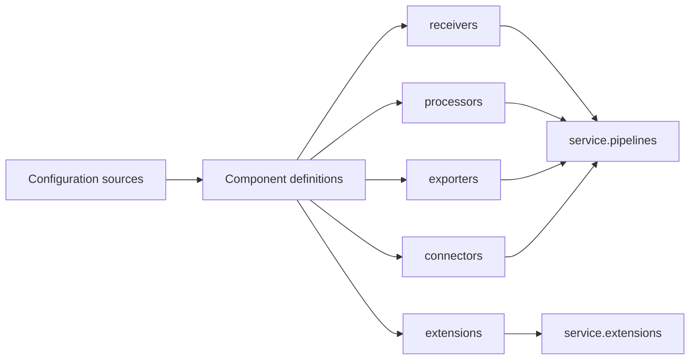

<Callout type="info" title="Phạm vi của trang">
  Trang này tập trung vào file cấu hình của Collector. Tên component và tùy chọn
  cụ thể phụ thuộc distribution — bản đóng gói gồm một tập component nhất định.
  Hãy kiểm tra tài liệu của distribution trước khi sao chép cấu hình vào production.
</Callout>

## Mục lục

- [Mô hình cấu hình](#mô-hình-cấu-hình)
  - [Sáu khối cấp cao](#sáu-khối-cấp-cao)
  - [Định danh component type/name](#định-danh-component-typename)
- [Từ component đến service](#từ-component-đến-service)
- [Biến môi trường và nguồn cấu hình](#biến-môi-trường-và-nguồn-cấu-hình)
  - [Thay thế biến môi trường](#thay-thế-biến-môi-trường)
  - [Nhiều file cấu hình](#nhiều-file-cấu-hình)
  - [Merge và override](#merge-và-override)
- [Cấu hình hoàn chỉnh](#cấu-hình-hoàn-chỉnh)
- [Kiểm tra trước khi chạy](#kiểm-tra-trước-khi-chạy)
  - [Validate cấu hình](#validate-cấu-hình)
  - [Kiểm tra đường dữ liệu](#kiểm-tra-đường-dữ-liệu)
- [Secret và dữ liệu nhạy cảm](#secret-và-dữ-liệu-nhạy-cảm)
- [Reload hay restart](#reload-hay-restart)
- [Failure modes thường gặp](#failure-modes-thường-gặp)
- [Best practices](#best-practices)
- [Nguồn chính thức và bước tiếp theo](#nguồn-chính-thức-và-bước-tiếp-theo)

## Mô hình cấu hình

Collector đọc cấu hình thành các **component** — đơn vị thực hiện một vai trò cụ
thể. Khai báo một component mới chỉ tạo cấu hình cho nó. Component chỉ hoạt động
khi được tham chiếu từ `service`.



### Sáu khối cấp cao

| Khối | Vai trò | Ví dụ |
| --- | --- | --- |
| `receivers` | Nhận telemetry từ ứng dụng, agent hoặc hệ thống khác. | `otlp`, `prometheus` |
| `processors` | Biến đổi, lọc, gom batch hoặc bảo vệ tài nguyên. | `batch`, `memory_limiter` |
| `exporters` | Gửi telemetry ra backend hoặc Collector kế tiếp. | `otlp_grpc`, `debug` |
| `connectors` | Nối hai pipeline; là exporter ở đầu vào và receiver ở đầu ra. | `forward`, `span_metrics` nếu distribution có |
| `extensions` | Cung cấp chức năng không nằm trên data path. | `health_check`, `pprof` |
| `service` | Kích hoạt extensions và ghép components thành pipelines. | `extensions`, `pipelines`, `telemetry` |

`service.telemetry` cấu hình telemetry nội bộ của chính Collector, ví dụ mức log
hoặc metrics nội bộ. Nó không phải pipeline xử lý telemetry của ứng dụng.

### Định danh component type/name

Mỗi instance có định danh `type[/name]`. Phần trước dấu `/` chọn loại component.
Phần sau tạo tên duy nhất và có ý nghĩa vận hành.

```yaml
exporters:
  otlp_grpc/primary:
    endpoint: tempo.monitoring.svc:4317
  otlp_grpc/archive:
    endpoint: archive.monitoring.svc:4317
```

Cả hai instance dùng type `otlp_grpc`, nhưng cấu hình và vòng đời độc lập. Tên
trong pipeline phải khớp chính xác, gồm cả suffix:

```yaml
service:
  pipelines:
    traces:
      exporters: [otlp_grpc/primary, otlp_grpc/archive]
```

Không dùng cùng một định danh hai lần trong một mapping YAML. YAML parser có thể
báo lỗi hoặc chỉ giữ một giá trị, tùy parser.

## Từ component đến service

Một pipeline thường có đường đi `receivers → processors → exporters`. Receiver
và exporter là ranh giới I/O. Processor chạy theo đúng thứ tự được liệt kê.

```yaml
receivers:
  otlp:
    protocols:
      grpc:
      http:

processors:
  memory_limiter:
    check_interval: 1s
    limit_mib: 512
  batch:

exporters:
  otlp_grpc/backend:
    endpoint: ${env:OTLP_BACKEND_ENDPOINT}

service:
  pipelines:
    traces:
      receivers: [otlp]
      processors: [memory_limiter, batch]
      exporters: [otlp_grpc/backend]
```

Nếu bỏ `otlp_grpc/backend` khỏi `service.pipelines`, instance vẫn parse được nhưng
không gửi dữ liệu. Tương tự, extension phải xuất hiện trong
`service.extensions` mới được khởi động.

<Callout type="warn" title="Khai báo không đồng nghĩa với kích hoạt">
  Khi thêm component, luôn kiểm tra cả định nghĩa cấp cao và tham chiếu trong
  `service`. Đây là nguyên nhân phổ biến khiến Collector chạy nhưng không mở
  cổng hoặc không export dữ liệu.
</Callout>

Cách nối pipeline chi tiết, fan-out và connectors được trình bày tại
[Service pipelines](/collector/pipelines/).

## Biến môi trường và nguồn cấu hình

Collector dùng configuration providers để đọc cấu hình từ URI. File local
thường dùng `file:`, còn biến môi trường dùng `env:`. Các provider khả dụng có
thể khác giữa distributions.

### Thay thế biến môi trường

Dùng cú pháp rõ ràng `${env:VARIABLE}` trong scalar YAML:

```yaml
exporters:
  otlp_grpc/backend:
    endpoint: ${env:OTLP_BACKEND_ENDPOINT}
    headers:
      authorization: ${env:OTLP_AUTH_HEADER}
```

Đặt dấu nháy khi giá trị có thể bị YAML hiểu thành boolean, số hoặc chứa ký tự
đặc biệt:

```yaml
service:
  telemetry:
    logs:
      level: "${env:COLLECTOR_LOG_LEVEL}"
```

Một biến chưa đặt có thể làm giá trị sau substitution rỗng và khiến validation
thất bại. Đừng dựa vào một fallback nếu chưa kiểm tra cú pháp fallback trên phiên
bản Collector đang chạy. Với trường bắt buộc, tốt hơn là để startup thất bại và
để orchestrator báo deployment lỗi.

<Callout type="error" title="Substitution không phải secret manager">
  `${env:...}` chỉ lấy giá trị từ environment của process Collector. Nó không mã
  hóa, không xoay vòng và không ngăn giá trị xuất hiện trong process inspection.
</Callout>

### Nhiều file cấu hình

Collector hỗ trợ truyền `--config` nhiều lần để hợp nhất nhiều nguồn cấu hình.
Cách này hữu ích khi tách cấu hình nền và phần theo môi trường:

```bash
otelcol \
  --config=file:/etc/otelcol/base.yaml \
  --config=file:/etc/otelcol/production.yaml
```

Chỉ dùng khả năng này sau khi xác nhận binary/distribution của bạn hỗ trợ nhiều
URI cấu hình. Giữ mỗi file là một tài liệu YAML hợp lệ. Không dùng YAML anchor
trải qua ranh giới file; anchor chỉ có phạm vi trong tài liệu YAML chứa nó.

### Merge và override

Nhiều file không hoạt động như template engine. Các mapping có thể được merge,
nhưng xung đột scalar và collection phụ thuộc quy tắc merge của phiên bản
configuration library. Đặc biệt, không giả định hai danh sách `processors` sẽ
được nối với nhau.

Ví dụ override toàn bộ danh sách sẽ dễ đọc hơn merge ngầm:

```yaml
# production.yaml
service:
  pipelines:
    traces:
      receivers: [otlp]
      processors: [memory_limiter, attributes/redact, batch]
      exporters: [otlp_grpc/backend]
```

Quy tắc vận hành an toàn:

1. Một field chỉ nên có một file sở hữu.
2. File môi trường nên override giá trị lá như endpoint và limit.
3. Nếu phải đổi danh sách, khai báo lại toàn bộ danh sách theo thứ tự mong muốn.
4. Chạy `validate` với đúng tập `--config` và đúng thứ tự như production.
5. Khi nâng Collector, kiểm thử lại kết quả merge; đừng suy luận từ phiên bản cũ.

## Cấu hình hoàn chỉnh

Mẫu sau nhận cả ba signal qua OTLP, bảo vệ memory, gom batch và gửi tới một OTLP
backend. `debug` exporter tạo nhánh quan sát tạm thời cho traces. Distribution
phải chứa các component `otlp`, `memory_limiter`, `batch`, `resource`,
`otlp_grpc`, `debug` và `health_check`.

<Callout type="warn" title="Listener mẫu chỉ bind loopback">
  Mẫu không cấu hình TLS hoặc authenticator ở phía nhận, nên chỉ bind
  `127.0.0.1`. Nếu ứng dụng ở host hoặc pod khác phải kết nối, hãy đổi địa chỉ
  bind và đồng thời thêm TLS, xác thực cùng network policy phù hợp.
</Callout>

```yaml
receivers:
  otlp:
    protocols:
      grpc:
        endpoint: 127.0.0.1:4317
      http:
        endpoint: 127.0.0.1:4318

processors:
  memory_limiter:
    check_interval: 1s
    limit_mib: 512
    spike_limit_mib: 128
  resource/common:
    attributes:
      - key: deployment.environment.name
        value: "${env:DEPLOYMENT_ENVIRONMENT}"
        action: upsert
  batch:
    send_batch_size: 1024
    timeout: 5s

exporters:
  otlp_grpc/backend:
    endpoint: "${env:OTLP_BACKEND_ENDPOINT}"
    headers:
      authorization: "${env:OTLP_AUTH_HEADER}"
    tls:
      ca_file: /var/run/secrets/otel/ca.pem
  debug/trace-check:
    verbosity: basic

extensions:
  health_check:
    endpoint: 127.0.0.1:13133

service:
  extensions: [health_check]
  pipelines:
    traces:
      receivers: [otlp]
      processors: [memory_limiter, resource/common, batch]
      exporters: [otlp_grpc/backend, debug/trace-check]
    metrics:
      receivers: [otlp]
      processors: [memory_limiter, resource/common, batch]
      exporters: [otlp_grpc/backend]
    logs:
      receivers: [otlp]
      processors: [memory_limiter, resource/common, batch]
      exporters: [otlp_grpc/backend]
```

`debug` có thể in nội dung telemetry. Chỉ bật trong môi trường kiểm soát và gỡ
sau khi xác minh. Đọc [Receivers](/collector/receivers/),
[Processors](/collector/processors/) và [Exporters](/collector/exporters/) trước
khi tuning từng component.

## Kiểm tra trước khi chạy

### Validate cấu hình

Dùng subcommand `validate` của binary Collector với chính file sẽ triển khai:

```bash
export DEPLOYMENT_ENVIRONMENT=staging
export OTLP_BACKEND_ENDPOINT=tempo.monitoring.svc:4317
export OTLP_AUTH_HEADER='Bearer redacted-for-validation'

otelcol validate --config=file:/etc/otelcol/config.yaml
```

Nếu distribution đổi tên binary, thay `otelcol` bằng binary thực tế, ví dụ
`otelcol-contrib`. Với nhiều file, truyền lại mọi cờ `--config` theo đúng thứ tự.
Kiểm tra `otelcol validate --help` trên binary đang dùng vì CLI có thể khác giữa
các phiên bản/distributions.

Validation kiểm tra parse, giải mã cấu hình, tham chiếu component và khả năng
tương thích signal tĩnh khi dựng service graph. Nó không chứng minh DNS, TLS,
credential, quyền backend, backend availability hoặc tính đúng đắn về ngữ nghĩa
của dữ liệu thực. Collector không có dry-run mạng tổng quát bảo đảm exporter kết
nối thành công mà không khởi động component.

### Kiểm tra đường dữ liệu

1. Khởi động Collector trong staging và kiểm tra không có lỗi startup.
2. Gửi một span, một metric và một log canary qua đúng protocol.
3. Kiểm tra health endpoint chỉ để biết process sẵn sàng theo extension; health
   không chứng minh backend nhận telemetry.
4. Xem internal telemetry và lỗi exporter của Collector.
5. Tìm canary tại backend theo `service.name`, trace ID hoặc tên metric.
6. Gỡ `debug` exporter sau khi hoàn tất.

## Secret và dữ liệu nhạy cảm

- Inject secret lúc runtime từ secret manager, file mount hoặc workload identity.
- Không commit token vào YAML, image, ConfigMap công khai hoặc repository.
- Mount CA, certificate và private key read-only với quyền tối thiểu.
- Không in effective config nếu nó chứa headers hoặc credential.
- Giới hạn token chỉ có quyền ingest vào tenant cần thiết.
- Khi rotate, xác minh component có đọc lại credential hay cần restart.

Environment provider phù hợp để nối secret đã được platform inject, nhưng không
phải lúc nào cũng phù hợp với threat model. Nếu environment có thể bị đọc qua
support bundle hoặc process inspection, ưu tiên file secret hoặc auth extension
được distribution hỗ trợ.

## Reload hay restart

Đừng giả định Collector theo dõi file và tự áp dụng thay đổi. Khả năng cập nhật
động phụ thuộc cách chạy, configuration provider và distribution. Nhiều thay đổi
component chỉ có hiệu lực khi process khởi động lại.

Ranh giới an toàn là **thay cấu hình → validate → rolling restart**. Rolling
restart giữ ít nhất một replica phục vụ, nhưng receiver dùng port hoặc state cục
bộ vẫn cần thiết kế rollout phù hợp. Với agent một replica trên mỗi node, đặt
termination grace period để batch đang chờ có cơ hội export.

Nếu một provider hỗ trợ watch/retrieve cập nhật, chỉ dựa vào nó khi tài liệu của
provider và distribution cam kết hành vi đó. Vẫn phải kiểm thử thay đổi endpoint,
TLS và extensions; không phải component nào cũng tái khởi tạo không gián đoạn.

## Failure modes thường gặp

| Triệu chứng | Nguyên nhân thường gặp | Cách xử lý |
| --- | --- | --- |
| `unknown type` khi startup | Distribution không chứa component | Kiểm tra danh sách component của binary; chọn distribution phù hợp. |
| `cannot unmarshal` hoặc lỗi key | Sai indentation, tên field hoặc type YAML | Validate file và đối chiếu README/schema của component. |
| Cổng receiver không mở | Receiver được khai báo nhưng không nằm trong pipeline | Thêm đúng instance vào `service.pipelines`. |
| Extension không chạy | Thiếu tham chiếu trong `service.extensions` | Kích hoạt extension rõ ràng. |
| Endpoint rỗng | Biến môi trường chưa được inject | Kiểm tra environment của process, không chỉ shell local. |
| `connection refused` | Sai host/port hoặc backend chưa listen | Kiểm tra DNS và listener từ cùng network namespace. |
| TLS handshake lỗi | Sai CA, hostname, scheme hoặc mTLS files | Kiểm tra chain và mount; không tắt TLS để chữa production. |
| `401` hoặc `403` | Header sai, token hết hạn hoặc thiếu quyền | Kiểm tra secret injection mà không log token. |
| Processor không có tác dụng | Sai thứ tự hoặc dùng nhầm instance suffix | Đọc pipeline thực tế và kiểm tra tên `type/name`. |
| Override làm mất processors | Giả định list được append khi merge file | Khai báo lại toàn bộ list và validate tổ hợp cuối. |
| Config đổi nhưng hành vi không đổi | Process chưa reload hoặc component không hỗ trợ update | Rolling restart sau validation. |
| Collector chạy nhưng backend trống | Validation không kiểm tra data path bên ngoài | Gửi canary và kiểm tra từng hop. |

## Best practices

- Pin version và distribution; kiểm thử upgrade cùng cấu hình production.
- Giữ tên instance mô tả đích hoặc policy, như `otlp_grpc/primary` và
  `attributes/redact`.
- Đặt `memory_limiter` sớm và `batch` gần cuối pipeline khi phù hợp với processor.
- Tách endpoint, credential và capacity tuning khỏi cấu trúc pipeline.
- Validate trong CI bằng đúng binary sẽ deploy, nhưng không đưa secret thật vào CI.
- Quan sát telemetry nội bộ của Collector, queue, refused data và export errors.
- Canary từng signal; thành công của traces không chứng minh metrics và logs.
- Review cấu hình như code, đặc biệt với processors có thể drop hoặc sửa dữ liệu.

## Nguồn chính thức và bước tiếp theo

- [Collector configuration](https://opentelemetry.io/docs/collector/configuration/)
- [Collector configuration data model](https://opentelemetry.io/docs/collector/configuration/)
- [Collector repository: configuration](https://github.com/open-telemetry/opentelemetry-collector/tree/main/confmap)
- [Collector troubleshooting](https://opentelemetry.io/docs/collector/troubleshooting/)
- [Collector distributions](https://opentelemetry.io/docs/collector/distributions/)

<Cards>
  <Card title="Service pipelines" href="/collector/pipelines/" description="Nối components theo signal, fan-out và connectors." />
  <Card title="Connectors" href="/collector/connectors/" description="Chuyển dữ liệu giữa hai pipeline một cách tường minh." />
  <Card title="Extensions" href="/collector/extensions/" description="Bật health check, authentication và chức năng ngoài data path." />
</Cards>
