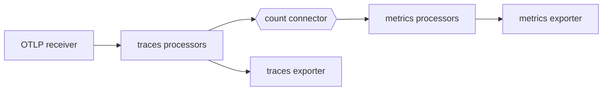
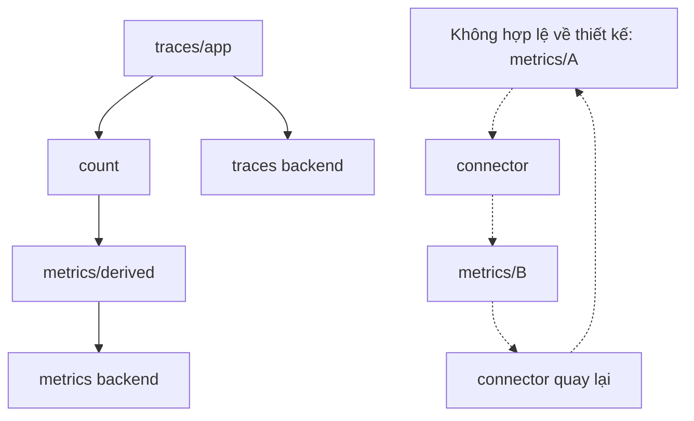

<Callout type="info" title="Ý chính">
  Cùng một connector xuất dữ liệu khỏi pipeline nguồn và nhận dữ liệu vào pipeline đích. Connector chỉ dùng được khi có trong distribution đang chạy; stability và signal pair được công bố riêng cho từng component. Các tên và mức stability dễ thay đổi trong bài được kiểm chứng với release `v0.157.0`.
</Callout>

## Mục lục

- [Mental model](#mental-model)
  - [Connector khác gì processor và exporter](#connector-khác-gì-processor-và-exporter)
- [Đồ thị pipeline và vòng lặp](#đồ-thị-pipeline-và-vòng-lặp)
- [Chuyển đổi và tổng hợp signal](#chuyển-đổi-và-tổng-hợp-signal)
- [Ví dụ count đã kiểm chứng](#ví-dụ-count-đã-kiểm-chứng)
- [Span Metrics và Routing](#span-metrics-và-routing)
- [Ranh giới lỗi và delivery semantics](#ranh-giới-lỗi-và-delivery-semantics)
- [Cách xác minh](#cách-xác-minh)
- [Failure modes và best practices](#failure-modes-và-best-practices)
- [Nguồn tham khảo](#nguồn-tham-khảo)

## Mental model

Connector là một node có hai vai trò trong service graph:

- Trong pipeline nguồn, tên connector nằm trong `exporters`.
- Trong pipeline đích, **chính tên đó** nằm trong `receivers`.



Trong sơ đồ, `count` nhận traces qua phía exporter, đếm span và phát metrics qua phía receiver. Nhánh traces gốc chỉ còn nếu pipeline nguồn cũng khai báo một exporter traces thật. Connector không tự chuyển tiếp dữ liệu gốc trừ khi contract của component nói như vậy.

### Connector khác gì processor và exporter

| Component | Phạm vi | Đầu ra điển hình | Khi nên dùng |
|---|---|---|---|
| Processor | Một pipeline | Cùng luồng/signal sau sửa hoặc lọc | Enrich, redact, batch, sample trong pipeline |
| Exporter | Biên ngoài Collector | Backend, broker hoặc endpoint khác | Đưa telemetry ra khỏi process |
| Connector | Giữa hai pipeline trong cùng service graph | Signal giữ nguyên hoặc signal mới | Fan-in/fan-out nội bộ, route, aggregate hoặc convert signal |

Connector không thay thế exporter bền vững. Nếu cần vượt process boundary, retry lâu hoặc lưu đệm bền, hãy dùng exporter và hạ tầng vận chuyển phù hợp. Xem [Processors](./processors), [Exporters](./exporters) và [Service pipelines](./pipelines).

## Đồ thị pipeline và vòng lặp

Hãy đọc cấu hình như đồ thị có hướng: pipeline nguồn → connector → pipeline đích. Một connector có thể nối nhiều pipeline theo contract của nó, nhưng graph nên là directed acyclic graph (DAG).



Cycle connector hoàn toàn nằm trong cùng service graph bị validation topo từ chối, nên Collector không khởi động. Validator không nhìn thấy vòng đi qua network, ví dụ OTLP exporter gửi tới receiver của Collector khác rồi cuối cùng quay về nguồn. Vì vậy, hãy kiểm tra cả DAG trong process lẫn topology giữa các process.

## Chuyển đổi và tổng hợp signal

Connector có thể:

- chuyển traces, logs hoặc metrics thành metrics đếm;
- tổng hợp span thành RED metrics (request rate, errors, duration);
- route telemetry sang pipeline đích dựa trên điều kiện;
- forward cùng signal để chia graph thành các pipeline có policy khác nhau.

Aggregation làm mất chi tiết. Metric đếm không thể tái tạo span gốc, và restart có thể ảnh hưởng state/temporality tùy connector. Dimension như `service.name`, operation hoặc status tạo series mới cho mỗi tổ hợp giá trị. Chỉ thêm dimension có cardinality hữu hạn và theo dõi số active series.

<Callout type="warn" title="Sampling ảnh hưởng metric dẫn xuất">
  Nếu connector tạo metric sau khi traces đã bị sample, metric phản ánh tập trace còn lại chứ không mặc nhiên phản ánh toàn bộ traffic. Đặt connector trước/ sau sampling có trade-off về độ chính xác, chi phí và dữ liệu được giữ; xác minh bằng một nguồn metric độc lập.
</Callout>

## Ví dụ count đã kiểm chứng

Trong release `v0.157.0`, `count` có trong distribution contrib và K8s; các cặp traces→metrics, metrics→metrics, logs→metrics và profiles→metrics được công bố ở mức **alpha**. Ví dụ dùng hành vi mặc định traces→metrics: tạo `trace.span.count` và `trace.span.event.count`.

```yaml
receivers:
  otlp:
    protocols:
      grpc:
        endpoint: 127.0.0.1:4317

connectors:
  count: {}

processors:
  memory_limiter:
    check_interval: 1s
    limit_percentage: 75
    spike_limit_percentage: 15
  batch: {}

exporters:
  debug/traces:
    verbosity: basic
  debug/metrics:
    verbosity: detailed

service:
  pipelines:
    traces/app:
      receivers: [otlp]
      processors: [memory_limiter, batch]
      exporters: [debug/traces, count]

    metrics/derived:
      receivers: [count]
      processors: [memory_limiter, batch]
      exporters: [debug/metrics]
```

`count` xuất hiện đúng hai lần trong `service.pipelines`: exporter của `traces/app`, receiver của `metrics/derived`. `debug/traces` giữ nhánh trace gốc; bỏ exporter này nếu chủ đích chỉ cần metrics dẫn xuất. Hai instance `memory_limiter` trong danh sách cùng tham chiếu một component; production cần sizing toàn process, không cộng các phần trăm như quota riêng từng pipeline.

## Span Metrics và Routing

`span_metrics` chuyển traces thành metrics về calls và duration. Trong release
`v0.157.0`, component thuộc distribution contrib và cặp traces→metrics được công
bố mức **alpha**. Alias cũ `spanmetrics` đã deprecated; cấu hình mới nên dùng
`span_metrics`. Component hữu ích cho RED dashboards nhưng giữ state và tạo
series theo dimension. Trước khi dùng, đọc README đúng tag release để chọn
histogram, temporality, dimensions và cache; không dựa vào default không được pin.

`routing` route telemetry tới pipeline dựa trên điều kiện OTTL. Ở `v0.157.0`,
component được liệt kê trong contrib/K8s, nhưng sự hiện diện đã khác giữa các
release cũ. Cú pháp bảng route và signal support cũng có thể thay đổi. Vì vậy
trang này không đưa snippet routing dùng chung cho mọi version: chạy
`otelcol components`, pin image, rồi dùng README tại tag release tương ứng.

<Callout type="warn" title="Alpha là contract có thể thay đổi">
  `count` và `span_metrics` chưa có stability guarantee như stable component.
  Pin phiên bản, đọc release notes, test migration và chuẩn bị rollback.
  Distribution tùy biến có thể loại component dù distribution chuẩn có nó.
</Callout>

## Ranh giới lỗi và delivery semantics

Connector nằm trong cùng Collector process, nhưng vẫn tạo ranh giới giữa hai pipeline:

- Pipeline nguồn có thể fan-out sang backend gốc và connector. Một nhánh lỗi không biến hai nhánh thành transaction nguyên tử.
- Backpressure từ pipeline đích có thể truyền ngược qua connector, tùy implementation. Queue hoặc batch ở đích vẫn tiêu thụ bộ nhớ chung.
- Restart làm mất dữ liệu/state chỉ nằm trong process. Connector không phải write-ahead log.
- Lỗi transform, aggregation hoặc route có thể làm mất nhánh dẫn xuất trong khi nhánh dữ liệu gốc vẫn thành công, hoặc ngược lại.
- Nhiều replica tạo nhiều state aggregation độc lập. Backend phải xử lý temporality, identity và duplicate/overlap đúng theo contract của connector.

Nếu metric dẫn xuất là SLO-critical, giữ metric ứng dụng gốc làm nguồn kiểm tra. Nếu cần durability, xuất qua queue/broker hoặc backend thay vì coi connector là ranh giới lưu trữ.

## Cách xác minh

1. Chạy `otelcol components` trong đúng image. Xác nhận connector và mọi receiver/processor/exporter có mặt.
2. Chạy Collector với cấu hình trong CI. Lỗi `unknown type`, signal pair không hợp lệ, cycle hoặc decode failure phải chặn deploy.
3. Gửi fixture có số span và span event biết trước. Với cấu hình `count` mặc định, kiểm tra metric names và giá trị trong `debug/metrics`.
4. Đồng thời kiểm tra `debug/traces` để chắc chắn nhánh gốc vẫn hoạt động. Tắt detailed debug sau thử nghiệm vì payload có thể chứa PII.
5. Restart Collector trong test để quan sát state/temporality, rồi gây chậm exporter đích để đo backpressure, memory và refused data.
6. Với nhiều replica, gửi cùng trace theo chiến lược routing production và so sánh tổng metric dẫn xuất với nguồn độc lập.

Kiểm tra graph tĩnh cũng quan trọng: liệt kê mỗi connector, pipeline nguồn, pipeline đích và signal pair trong review. Mỗi node phải có chủ đích, và không đường nào quay về tổ tiên.

## Failure modes và best practices

| Failure mode | Dấu hiệu | Giảm thiểu |
|---|---|---|
| Connector không có trong distribution | Startup báo `unknown type` | `otelcol components`; pin đúng core/contrib/K8s hoặc custom build |
| Chỉ khai báo một phía | Pipeline không nhận output hoặc validation fail | Connector phải là exporter nguồn và receiver đích |
| Signal pair không được hỗ trợ | Build/startup fail hoặc dữ liệu không đúng contract | Đọc bảng Supported Pipeline Types ở README đúng release |
| Vô tình bỏ exporter dữ liệu gốc | Chỉ còn metric dẫn xuất | Fan-out rõ ràng tới exporter gốc và connector |
| Graph connector trong process có cycle | Validation/startup thất bại | Vẽ DAG và review cạnh connector trong CI |
| Vòng lặp qua network | Tăng tải và duplicate mà validation cục bộ không thấy | Review topology exporter/receiver giữa mọi Collector |
| Dimension cardinality cao | Active series và memory tăng nhanh | Allowlist dimension hữu hạn; loại ID/raw URL |
| Backend metrics chậm | Backpressure, queue đầy, mất cả nhánh | Giới hạn queue/batch, memory limiter, alert và capacity test |
| Nâng version làm đổi alpha config | Decode fail hoặc semantic drift | Pin version, release notes, golden fixture, canary/rollback |
| Aggregation sau sampling | Count thấp hoặc bias | Chọn vị trí có chủ đích và đối chiếu metric độc lập |

Best practice là giữ graph nhỏ và đặt tên pipeline theo vai trò (`traces/app`, `metrics/derived`). Không dùng connector chỉ để làm cấu hình trông mô-đun nếu một processor trong cùng pipeline đã đủ.

## Nguồn tham khảo

- [Collector configuration — Connectors](https://opentelemetry.io/docs/collector/configuration/#connectors)
- [Danh sách connector theo distribution](https://opentelemetry.io/docs/collector/components/connector/)
- [Connector contract trong Collector core](https://github.com/open-telemetry/opentelemetry-collector/tree/main/connector)
- [Count Connector](https://github.com/open-telemetry/opentelemetry-collector-contrib/tree/main/connector/countconnector)
- [Span Metrics Connector](https://github.com/open-telemetry/opentelemetry-collector-contrib/tree/main/connector/spanmetricsconnector)
- [Routing Connector](https://github.com/open-telemetry/opentelemetry-collector-contrib/tree/main/connector/routingconnector)
- [Component stability levels](https://github.com/open-telemetry/opentelemetry-collector/blob/main/docs/component-stability.md)
