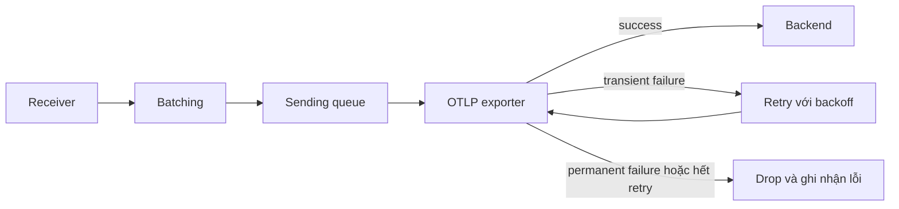
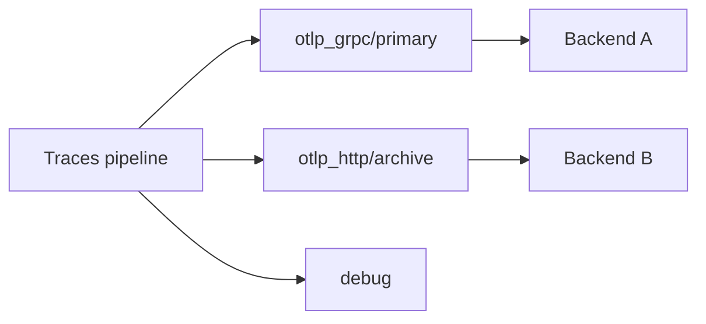

<Callout type="info" title="Exporter là ranh giới gửi, không phải kho dữ liệu">
  Exporter chuyển telemetry từ pipeline đến backend. Queue trong RAM, retry và batching giúp hấp thụ gián đoạn ngắn, nhưng chỉ persistent queue mới có thể tiếp tục sau khi Collector restart — và nó vẫn không thay thế một message broker hay backend bền vững.
</Callout>

## Mục lục

- [Mental model](#mental-model)
  - [Exporter, batching và backpressure](#exporter-batching-và-backpressure)
- [OTLP exporter hiện hành](#otlp-exporter-hiện-hành)
  - [OTLP gRPC](#otlp-grpc)
  - [OTLP HTTP](#otlp-http)
  - [TLS và xác thực phía client](#tls-và-xác-thực-phía-client)
- [Queue và retry](#queue-và-retry)
  - [Cấu hình có giới hạn rõ ràng](#cấu-hình-có-giới-hạn-rõ-ràng)
  - [Ranh giới durability](#ranh-giới-durability)
- [Debug exporter](#debug-exporter)
- [Fan-out và partial failure](#fan-out-và-partial-failure)
- [Xác minh egress](#xác-minh-egress)
- [Lỗi phổ biến](#lỗi-phổ-biến)
- [Nguồn chính thức và nội dung liên quan](#nguồn-chính-thức-và-nội-dung-liên-quan)

## Mental model

Exporter là component ở cuối pipeline. Nó mã hóa dữ liệu theo giao thức đích, thiết lập kết nối client và gửi request tới backend.



### Exporter, batching và backpressure

- **Batching** gom spans, data points hoặc log records để giảm số request. Batching có thể nằm trong `sending_queue.batch`; processor `batch` là một cơ chế khác ở pipeline.
- **Sending queue** tách tốc độ pipeline khỏi tốc độ backend trong một giới hạn dung lượng. Khi queue đầy, exporter mặc định từ chối dữ liệu mới; đó là backpressure tại ranh giới đầu ra.
- **Retry** thử gửi lại lỗi tạm thời với backoff. Lỗi vĩnh viễn không nên được retry vô hạn.
- **Backpressure** là việc downstream chậm buộc upstream phải chờ, từ chối hoặc drop. Queue trì hoãn tác động này; queue không loại bỏ nó.

## OTLP exporter hiện hành

Tên component hiện hành trong Collector là `otlp_grpc` cho OTLP/gRPC và `otlp_http` cho OTLP/HTTP. Alias cũ `otlphttp` đã deprecated; cấu hình mới nên dùng `otlp_http`. Luôn chạy `otelcol components` vì distribution tùy biến có thể không đóng gói cả hai exporter.

### OTLP gRPC

`otlp_grpc.endpoint` là địa chỉ `host:port`, không có signal path. Ví dụ gửi cả ba signal qua TLS tới cổng `4317`:

```yaml
receivers:
  otlp:
    protocols:
      grpc:
        endpoint: 127.0.0.1:4317

exporters:
  otlp_grpc/primary:
    endpoint: ingest.example.com:4317
    tls:
      ca_file: /etc/otel/tls/backend-ca.crt
    headers:
      authorization: ${env:OTLP_AUTH_HEADER}

service:
  pipelines:
    traces:
      receivers: [otlp]
      exporters: [otlp_grpc/primary]
    metrics:
      receivers: [otlp]
      exporters: [otlp_grpc/primary]
    logs:
      receivers: [otlp]
      exporters: [otlp_grpc/primary]
```

`headers` là metadata gửi cùng request. Ví dụ biến môi trường có thể chứa trọn giá trị `Bearer ...`; yêu cầu cụ thể phụ thuộc backend. Không thêm `https://.../v1/traces` vào endpoint gRPC.

### OTLP HTTP

`otlp_http.endpoint` là base URL. Exporter tự nối `/v1/traces`, `/v1/metrics` và `/v1/logs` theo signal. Nếu backend dùng URL riêng, cấu hình `traces_endpoint`, `metrics_endpoint` hoặc `logs_endpoint` bằng URL đầy đủ.

```yaml
receivers:
  otlp:
    protocols:
      http:
        endpoint: 127.0.0.1:4318

exporters:
  otlp_http/primary:
    endpoint: https://ingest.example.com:4318
    tls:
      ca_file: /etc/otel/tls/backend-ca.crt
    headers:
      authorization: ${env:OTLP_AUTH_HEADER}

service:
  pipelines:
    traces:
      receivers: [otlp]
      exporters: [otlp_http/primary]
```

Đừng vừa đặt base URL chứa `/v1/traces` trong `endpoint` vừa để exporter nối signal path. Nếu cần path đầy đủ, dùng `traces_endpoint`.

### TLS và xác thực phía client

TLS của exporter là client-side. `ca_file` dùng để tin cậy CA đã ký certificate của backend. Với mTLS, thêm `cert_file` và `key_file` để Collector trình certificate client:

```yaml
exporters:
  otlp_grpc/mtls:
    endpoint: ingest.example.com:4317
    tls:
      ca_file: /etc/otel/tls/backend-ca.crt
      cert_file: /etc/otel/tls/client.crt
      key_file: /etc/otel/tls/client.key
```

Auth có thể là static `headers` hoặc client authenticator extension được backend hỗ trợ. Với extension, cấu hình extension, bật nó trong `service.extensions`, rồi dùng `auth.authenticator` trong exporter. Tránh `tls.insecure` và `tls.insecure_skip_verify` ở production: lựa chọn đầu dùng kết nối không TLS trong ngữ cảnh phù hợp, lựa chọn sau bỏ xác minh certificate.

## Queue và retry

Các OTLP exporter dùng exporter helper, cung cấp `sending_queue`, `retry_on_failure` và timeout. Retry chỉ xử lý request đã đến exporter và được phân loại là lỗi có thể retry. Nếu queue đầy và từ chối trước khi enqueue, retry không cứu được dữ liệu đó.

### Cấu hình có giới hạn rõ ràng

Ví dụ sau dùng queue đo theo số telemetry item, batching trong queue và retry hữu hạn. Các con số là quyết định capacity của ví dụ, không phải default được ngầm khẳng định:

```yaml
exporters:
  otlp_grpc/primary:
    endpoint: ingest.example.com:4317
    tls:
      ca_file: /etc/otel/tls/backend-ca.crt
    timeout: 10s
    sending_queue:
      enabled: true
      sizer: items
      queue_size: 50000
      num_consumers: 10
      block_on_overflow: false
      batch:
        flush_timeout: 1s
        min_size: 1000
        max_size: 5000
    retry_on_failure:
      enabled: true
      initial_interval: 5s
      max_interval: 30s
      max_elapsed_time: 5m
```

`queue_size` dùng đơn vị của `sizer`; ở đây là tổng số spans, metric data points hoặc log records. `num_consumers` tăng mức gửi song song nhưng cũng có thể tăng tải lên backend. `max_elapsed_time` giới hạn thời gian retry của một batch. Chọn capacity từ lưu lượng đỉnh, thời gian gián đoạn cần chịu và memory budget; sau đó load test thay vì sao chép số mẫu.

### Ranh giới durability

Queue mặc định ở memory mất khi process dừng đột ngột. Để persist, đặt `sending_queue.storage` trỏ tới storage extension, ví dụ `file_storage/queue`, và bật đúng instance extension trong `service.extensions`:

```yaml
extensions:
  file_storage/queue:
    directory: /var/lib/otelcol/queue
    create_directory: true

exporters:
  otlp_grpc/primary:
    endpoint: ingest.example.com:4317
    tls:
      ca_file: /etc/otel/tls/backend-ca.crt
    sending_queue:
      enabled: true
      queue_size: 10000
      storage: file_storage/queue
    retry_on_failure:
      enabled: true
      max_elapsed_time: 10m

service:
  extensions: [file_storage/queue]
```

`file_storage` phải có trong distribution. Directory phải nằm trên volume bền
vững, có owner/quyền ghi tối thiểu và đủ dung lượng. `create_directory: true`
tạo thư mục nếu chưa tồn tại; nếu policy không cho phép, hãy provision nó trước
bằng image hoặc init container. Queue file có thể chứa nguyên telemetry nhạy cảm,
vì vậy hãy mã hóa volume theo threat model và không đưa file vào backup/support
bundle thiếu kiểm soát. Persistent queue có thể tiếp tục export sau restart,
nhưng vẫn có giới hạn: disk đầy hoặc I/O lỗi làm enqueue thất bại; dữ liệu đã hết
thời hạn retry hay gặp permanent error vẫn có thể bị drop. Với yêu cầu replay dài
hạn hoặc delivery contract chặt, đặt durable broker phù hợp trong kiến trúc.

## Debug exporter

Exporter `debug` ghi telemetry ra log Collector. Nó hữu ích để xác nhận pipeline và inspect dữ liệu trong development:

```yaml
exporters:
  debug:
    verbosity: detailed

service:
  pipelines:
    traces:
      receivers: [otlp]
      exporters: [debug]
```

`detailed` có thể tạo log rất lớn và làm lộ attributes nhạy cảm. Không dùng nó làm backend production hoặc bật kéo dài dưới tải cao. Tên `logging` cũ đã được thay bằng `debug`.

## Fan-out và partial failure

Liệt kê nhiều exporter trong một pipeline tạo **fan-out**: cùng một telemetry batch được gửi tới từng đích.



```yaml
exporters:
  otlp_grpc/primary:
    endpoint: primary.example.com:4317
    tls:
      ca_file: /etc/otel/tls/primary-ca.crt
  otlp_http/archive:
    endpoint: https://archive.example.com:4318
    tls:
      ca_file: /etc/otel/tls/archive-ca.crt

service:
  pipelines:
    traces:
      receivers: [otlp]
      exporters: [otlp_grpc/primary, otlp_http/archive]
```

Mỗi exporter có kết nối, queue, retry và trạng thái thành công riêng. Nếu backend A thành công còn B hết retry, A không rollback và Collector không cung cấp transaction xuyên hai backend. Đây là **partial failure**. Theo dõi từng exporter instance và cấp capacity riêng; đừng suy ra “pipeline thành công” chỉ từ một backend.

## Xác minh egress

1. Chạy `otelcol components` để xác nhận `otlp_grpc`, `otlp_http`, `debug` và extension cần dùng có trong binary.
2. Chạy `otelcol validate --config=config.yaml`.
3. Kiểm tra DNS và TCP/TLS từ chính pod hoặc host Collector. Xác nhận SAN của certificate khớp hostname endpoint.
4. Fan-out tạm thời sang `debug` để chứng minh dữ liệu đã tới cuối pipeline. Nếu debug có dữ liệu nhưng backend không có, tập trung vào exporter, auth, TLS và backend response.
5. Theo dõi internal metrics theo `exporter` instance: số send failed, enqueue failed, queue size/capacity và sent telemetry. Kết hợp log retry với metrics backend; không chỉ kiểm tra process “Running”.
6. Thực hiện bài test gián đoạn có kiểm soát: chặn backend, quan sát queue tăng, mở lại backend và xác nhận queue drain trong giới hạn retry đã cấu hình.

## Lỗi phổ biến

| Triệu chứng | Nguyên nhân thường gặp | Cách xử lý |
| --- | --- | --- |
| `unknown type: otlp...` | Dùng tên cũ/sai hoặc distribution thiếu component | Dùng `otlp_grpc`/`otlp_http`; kiểm tra `otelcol components` |
| HTTP 404 | Base endpoint đã chứa signal path hoặc backend dùng path riêng | Dùng base URL sạch, hoặc `traces_endpoint`/`metrics_endpoint`/`logs_endpoint` |
| TLS handshake/x509 failure | Sai CA, hostname không khớp SAN, hoặc backend yêu cầu mTLS | Kiểm tra chain, hostname và client certificate; không “sửa” bằng skip verify |
| 401/403 | Header thiếu/sai, token hết hạn hoặc authenticator chưa bật | Kiểm tra secret injection và `service.extensions` |
| Queue đầy, enqueue failed | Backend chậm lâu hơn buffer chịu được hoặc capacity quá nhỏ | Giảm tải, sửa backend, tune queue theo memory/disk budget; hiểu rằng dữ liệu bị từ chối không được retry |
| Collector restart làm mất backlog | Đang dùng memory queue | Cấu hình persistent queue và durable volume nếu yêu cầu |
| Một backend có dữ liệu, backend kia không | Fan-out gặp partial failure | Theo dõi và cấu hình queue/retry độc lập cho từng exporter |
| Duplicate data | Timeout xảy ra sau khi backend đã nhận nhưng trước khi client nhận ACK, rồi request được retry | Backend cần xử lý idempotency/dedup phù hợp; retry không tạo exactly-once |

## Nguồn chính thức và nội dung liên quan

- [Collector configuration — Exporters](https://opentelemetry.io/docs/collector/configuration/#exporters)
- [OTLP gRPC exporter README](https://github.com/open-telemetry/opentelemetry-collector/tree/main/exporter/otlpexporter)
- [OTLP HTTP exporter README](https://github.com/open-telemetry/opentelemetry-collector/tree/main/exporter/otlphttpexporter)
- [Exporter helper: queue, batching và retry](https://github.com/open-telemetry/opentelemetry-collector/tree/main/exporter/exporterhelper)
- [Collector resiliency](https://opentelemetry.io/docs/collector/resiliency/)

<Cards>
  <Card title="OTLP/gRPC và OTLP/HTTP" href="/protocols-backends/otlp-grpc-http/" description="Chọn transport và định dạng endpoint đúng cho backend." />
  <Card title="Pipelines" href="/collector/pipelines/" description="Hiểu cách bật exporter và fan-out trong service pipeline." />
</Cards>
