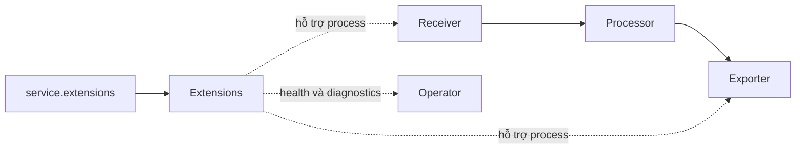

<Callout type="warn" title="Extension không tự hoạt động">
  Khai báo dưới `extensions` mới chỉ tạo cấu hình. Mỗi instance phải xuất hiện
  trong `service.extensions`; đồng thời binary đang chạy phải chứa extension đó.
  Các endpoint chẩn đoán không nên được công khai ra Internet.
</Callout>

## Mục lục

- [Extension nằm ở đâu](#extension-nằm-ở-đâu)
  - [Khác component trong data pipeline](#khác-component-trong-data-pipeline)
  - [Vòng đời](#vòng-đời)
- [Cấu hình tối thiểu](#cấu-hình-tối-thiểu)
- [Health check](#health-check)
- [pprof](#pprof)
- [zPages](#zpages)
- [Authenticator extension](#authenticator-extension)
- [Bảo vệ endpoint vận hành](#bảo-vệ-endpoint-vận-hành)
- [Cách xác minh](#cách-xác-minh)
- [Lỗi phổ biến](#lỗi-phổ-biến)
- [Nguồn chính thức và bài liên quan](#nguồn-chính-thức-và-bài-liên-quan)

## Extension nằm ở đâu

Extension bổ sung khả năng hỗ trợ cho process Collector: endpoint sức khỏe,
profiling, trang chẩn đoán, xác thực, lưu trữ hoặc service discovery. Extension
không mặc nhiên nhận, biến đổi hay xuất telemetry của ứng dụng.



### Khác component trong data pipeline

| Loại | Được kích hoạt tại | Có nằm trên data path? | Ví dụ |
| --- | --- | --- | --- |
| Receiver, processor, exporter | `service.pipelines` | Có | `otlp`, `batch`, `otlp_grpc` |
| Connector | Hai pipeline, dưới `receivers` và `exporters` | Có | `forward`, `span_metrics` |
| Extension | `service.extensions` | Thường không | `health_check`, `pprof`, `zpages`, `basicauth` |

Một authenticator là ví dụ quan trọng: extension cung cấp implementation xác
thực, còn receiver hoặc exporter tham chiếu nó bằng
`auth.authenticator`. Dù vậy, authenticator vẫn phải được bật trong
`service.extensions`.

### Vòng đời

Collector tạo extension từ cấu hình, khởi động nó cùng service và gọi shutdown
khi process dừng có kiểm soát. Listener của extension chỉ sẵn sàng sau khi bước
start thành công. Lỗi bind port, file credential không đọc được hoặc cấu hình
không hợp lệ có thể làm toàn bộ Collector không khởi động.

Khi nhận `SIGTERM`, orchestrator nên cho Collector đủ thời gian shutdown. Không
coi endpoint health là cam kết rằng backend đang nhận dữ liệu: health và trạng
thái từng pipeline phụ thuộc extension, feature gate và phiên bản. Đặc biệt,
README hiện hành của `health_check` cảnh báo không dùng
`check_collector_pipeline` vì hành vi chưa đúng như kỳ vọng.

## Cấu hình tối thiểu

Ba extension dưới đây có trong các distribution upstream `otelcol`,
`otelcol-contrib` và `otelcol-k8s` tại thời điểm tài liệu nguồn được kiểm tra.
Luôn xác nhận lại trên đúng artifact sẽ triển khai.

```yaml
extensions:
  health_check:
    endpoint: 127.0.0.1:13133
    path: /health
  pprof:
    endpoint: 127.0.0.1:1777
  zpages:
    endpoint: 127.0.0.1:55679

service:
  extensions: [health_check, pprof, zpages]
  pipelines: {}
```

`pipelines: {}` chỉ phù hợp để kiểm tra extension. Một Collector production cần
pipeline thực tế. Nếu chạy probe từ container hoặc pod khác, `127.0.0.1` không
truy cập được; khi đó bind interface cần thiết và bù lại bằng NetworkPolicy,
firewall hoặc proxy xác thực.

## Health check

`health_check` mở HTTP endpoint, mặc định ở `localhost:13133` và path `/`.
Component đang ở stability **alpha** trong release `v0.157.0`; hãy pin release và
test cả trạng thái healthy/unhealthy trước khi nâng cấp. Cấu hình rõ endpoint/path
giúp probe và policy dễ audit:

```yaml
extensions:
  health_check:
    endpoint: 0.0.0.0:13133
    path: /health

service:
  extensions: [health_check]
```

Ví dụ Kubernetes probe gọi cùng container:

```yaml
livenessProbe:
  httpGet:
    path: /health
    port: 13133
readinessProbe:
  httpGet:
    path: /health
    port: 13133
```

<Callout type="warn" title="Health không phải end-to-end check">
  HTTP 200 không chứng minh backend còn truy cập được hoặc mọi telemetry đã được
  giao. Alert thêm trên queue, refused data, send failures và tín hiệu từ
  backend. Đọc README đúng release trước khi bật feature gate liên quan component
  status.
</Callout>

Nếu bind `0.0.0.0`, cổng hiện diện trên mọi interface IPv4. Chỉ cho kubelet,
load balancer nội bộ hoặc hệ thống giám sát cần thiết truy cập. Không đặt dữ liệu
nhạy cảm trong `response_body` tùy chỉnh.

## pprof

`pprof` phục vụ các handler `net/http/pprof`, mặc định tại
`localhost:1777`. Nó giúp phân tích CPU, heap, goroutine, block và mutex của
process Go:

```yaml
extensions:
  pprof:
    endpoint: 127.0.0.1:1777
    block_profile_fraction: 0
    mutex_profile_fraction: 0

service:
  extensions: [pprof]
```

Thu profile CPU trong 30 giây sau khi tunnel tới host:

```bash
go tool pprof 'http://127.0.0.1:1777/debug/pprof/profile?seconds=30'
```

pprof có thể tiết lộ stack, đường dẫn, tham số runtime và hành vi tải. Profile
CPU cũng làm tăng overhead; block/mutex profiling tăng chi phí khi đặt sampling
rate khác `0`. Chỉ bật khi cần, bind loopback, truy cập qua `kubectl port-forward`
hoặc tunnel quản trị, rồi tắt sau điều tra. Không expose qua public ingress.

## zPages

`zpages` cung cấp chẩn đoán trong process mà không cần backend. Endpoint mặc
định là `localhost:55679`; các route hữu ích gồm:

- `/debug/servicez`: thông tin service và runtime;
- `/debug/pipelinez`: graph pipeline;
- `/debug/extensionz`: extension đang hoạt động;
- `/debug/featurez`: feature gate;
- `/debug/tracez`: mẫu internal spans và latency bucket.

```yaml
extensions:
  zpages:
    endpoint: 127.0.0.1:55679
    expvar:
      enabled: false

service:
  extensions: [zpages]
```

zPages có thể lộ topology, build/runtime và mẫu trace nội bộ. `expvar` còn có thể
lộ trạng thái runtime nên mặc định ở trên giữ tắt. Ngoài ra, zPages không tương
thích với `service.telemetry.traces.level: none`, vì chế độ đó dùng no-op tracer
provider và không thể đăng ký span processor mà zPages cần.

## Authenticator extension

Authenticator tách cơ chế credential khỏi receiver/exporter. Một số extension
làm phía server, phía client hoặc cả hai; khả năng này là contract riêng của từng
component. Ví dụ đã được upstream xác nhận, `basicauth` trong contrib hỗ trợ cả
hai vai trò. Cấu hình sau dùng **client authentication** cho OTLP exporter:

```yaml
extensions:
  basicauth/backend:
    client_auth:
      username_file: /var/run/secrets/otel/username
      password_file: /var/run/secrets/otel/password

exporters:
  otlp_http/backend:
    endpoint: https://telemetry.example.internal
    auth:
      authenticator: basicauth/backend

service:
  extensions: [basicauth/backend]
  pipelines:
    traces:
      receivers: [otlp]
      exporters: [otlp_http/backend]
```

Snippet giả định receiver `otlp` được định nghĩa ở phần khác của file. Theo
README hiện hành, `username_file` và `password_file` được theo dõi để rotation
không cần restart. Không cấu hình đồng thời client mode và server mode trên cùng
instance `basicauth`; dùng hai instance có suffix riêng nếu cần cả hai phía.

Basic Auth chỉ mã hóa Base64, không mã hóa đường truyền. Luôn dùng TLS, mount
secret read-only và giới hạn quyền file. Tên type, key `auth.authenticator` và
khả năng server/client phải được kiểm tra trong README của extension và
receiver/exporter ở đúng release.

## Bảo vệ endpoint vận hành

Ưu tiên theo thứ tự:

1. Không bật extension chẩn đoán nếu không có use case.
2. Bind `127.0.0.1` và truy cập qua port-forward/tunnel ngắn hạn.
3. Nếu phải bind non-loopback, dùng firewall, security group hoặc Kubernetes
   NetworkPolicy allowlist.
4. Đặt proxy có TLS và xác thực phía trước nếu người dùng từ mạng khác cần truy
   cập; không giả định `pprof` hoặc `zpages` tự có auth.
5. Tách cổng diagnostics khỏi Service/Ingress public, log truy cập và giới hạn
   thời gian thu profile.

## Cách xác minh

```bash
# Thay binary bằng otelcol-contrib hoặc tên custom thực tế.
otelcol components
otelcol validate --config=file:/etc/otelcol/config.yaml
otelcol --config=file:/etc/otelcol/config.yaml
```

Trong terminal khác:

```bash
curl --fail --show-error http://127.0.0.1:13133/health
curl --fail --show-error http://127.0.0.1:55679/debug/extensionz
curl --fail --show-error http://127.0.0.1:1777/debug/pprof/
```

Kiểm tra thêm từ một network namespace **không được phép** để chắc chắn policy
chặn truy cập. Với auth extension, thử cả credential đúng và sai; sau đó rotate
file secret và xác nhận hành vi theo contract của component. Không đưa credential
thật vào command history hoặc log CI.

## Lỗi phổ biến

| Dấu hiệu | Nguyên nhân thường gặp | Cách xử lý |
| --- | --- | --- |
| `unknown type` | Distribution không chứa extension | Chạy `components`; đổi distro hoặc custom build |
| Không có listener | Chỉ khai báo dưới `extensions` | Thêm đúng ID vào `service.extensions` |
| `address already in use` | Trùng port giữa instance/process | Đổi endpoint hoặc bỏ instance thừa |
| Probe từ pod khác timeout | Extension bind loopback | Bind interface cần thiết và thêm network policy |
| Diagnostics bị truy cập ngoài ý muốn | Bind `0.0.0.0` và publish port | Gỡ Service/Ingress, allowlist hoặc bind loopback |
| zPages không start | Internal trace level là `none` | Không dùng `none` khi bật zPages |
| Auth vẫn không áp dụng | Receiver/exporter chưa tham chiếu authenticator | Thêm `auth.authenticator` đúng ID |
| Health xanh nhưng mất dữ liệu | Health không kiểm tra delivery end-to-end | Alert internal telemetry và backend |

## Nguồn chính thức và bài liên quan

- [Collector configuration — Extensions](https://opentelemetry.io/docs/collector/configuration/#extensions)
- [Health Check Extension](https://github.com/open-telemetry/opentelemetry-collector-contrib/tree/main/extension/healthcheckextension)
- [Performance Profiler Extension](https://github.com/open-telemetry/opentelemetry-collector-contrib/tree/main/extension/pprofextension)
- [zPages Extension](https://github.com/open-telemetry/opentelemetry-collector/tree/main/extension/zpagesextension)
- [Basic Auth Authenticator Extension](https://github.com/open-telemetry/opentelemetry-collector-contrib/tree/main/extension/basicauthextension)
- [Security configuration best practices](https://opentelemetry.io/docs/security/config-best-practices/)

<Cards>
  <Card title="Cấu hình Collector" href="/collector/configuration/" description="Khai báo component, service và validate cấu hình." />
  <Card title="Collector distributions" href="/collector/collector-distributions/" description="Kiểm tra component có trong core, contrib hoặc custom build." />
  <Card title="Service pipelines" href="/collector/pipelines/" description="Hiểu data path độc lập với extension." />
</Cards>
