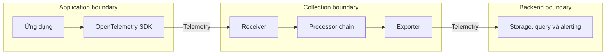
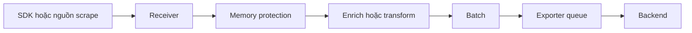
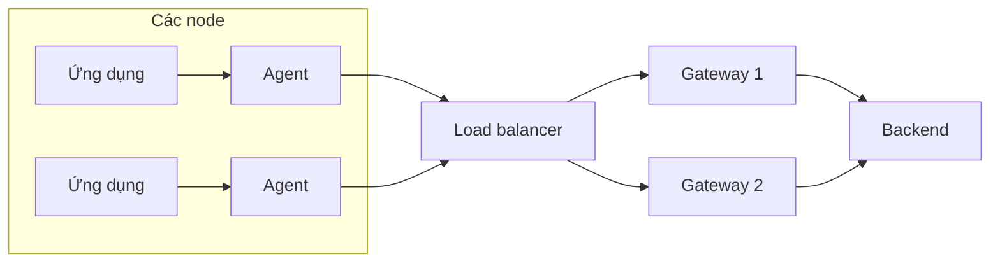

<Callout type="info" title="Mental model ngắn gọn">
  Xem Collector như một **đường ống telemetry có thể lập trình bằng cấu hình**.
  Nó nhận dữ liệu, xử lý theo thứ tự rồi xuất dữ liệu. Nó không phải backend lưu
  trữ và cũng không thay thế instrumentation trong ứng dụng.
</Callout>

## Mục lục

- [Collector nằm ở đâu](#collector-nằm-ở-đâu)
- [Mental model của một pipeline](#mental-model-của-một-pipeline)
  - [Receivers](#receivers)
  - [Processors](#processors)
  - [Exporters](#exporters)
  - [Connectors và extensions](#connectors-và-extensions)
- [Data path và control boundaries](#data-path-và-control-boundaries)
  - [Data path](#data-path)
  - [Control boundaries](#control-boundaries)
- [Agent và gateway](#agent-và-gateway)
  - [Agent](#agent)
  - [Gateway](#gateway)
  - [Agent kết hợp gateway](#agent-kết-hợp-gateway)
- [Push và pull](#push-và-pull)
  - [Push](#push)
  - [Pull](#pull)
- [Khi nào cần Collector](#khi-nào-cần-collector)
- [Khi nào chưa cần Collector](#khi-nào-chưa-cần-collector)
- [Trade-off cần quyết định](#trade-off-cần-quyết-định)
- [Failure modes và cách giảm tác động](#failure-modes-và-cách-giảm-tác-động)
- [Cách xác minh data path](#cách-xác-minh-data-path)
- [Best practices](#best-practices)
- [Học tiếp](#học-tiếp)
- [Nguồn chính thức](#nguồn-chính-thức)

## Collector nằm ở đâu

Collector chạy ngoài application process. Nó đứng giữa nguồn telemetry và một hoặc nhiều đích.

Nguồn có thể là OpenTelemetry SDK, host, Kubernetes, message broker hoặc endpoint metrics. Đích thường là observability backend, một hệ thống tương thích hoặc Collector tầng tiếp theo.



Ba boundary có vòng đời khác nhau. Nhóm ứng dụng sở hữu instrumentation và SDK. Nhóm platform thường sở hữu Collector. Nhà cung cấp hoặc nhóm observability sở hữu backend. Phân chia này không bắt buộc, nhưng trách nhiệm phải rõ.

## Mental model của một pipeline

Một **pipeline** là chuỗi component dành cho một signal, ví dụ `traces`, `metrics` hoặc `logs`. Luồng thông thường là:

```text
receiver ─► processor 1 ─► processor 2 ─► exporter
```

Một Collector có thể chạy nhiều pipeline. Component cũng có thể được tái sử dụng bởi nhiều pipeline nếu cấu hình và loại signal của nó hỗ trợ.

### Receivers

Receiver nhận dữ liệu từ bên ngoài Collector. Một số receiver lắng nghe dữ liệu được đẩy tới, ví dụ OTLP receiver. Một số khác chủ động lấy dữ liệu, ví dụ Prometheus receiver scrape endpoint metrics.

Khai báo receiver chỉ tạo cấu hình. Receiver chỉ được khởi động khi được tham chiếu bởi pipeline đang bật.

### Processors

Processor thay đổi hoặc quản lý telemetry trước khi xuất. Ví dụ, `batch` gom nhiều record để giảm số lần gửi. Filter processor có thể loại dữ liệu theo policy.

Processor chạy theo thứ tự được liệt kê. Nếu cần thêm thuộc tính môi trường rồi mới lọc theo thuộc tính đó, processor enrich phải đứng trước filter.

### Exporters

Exporter gửi telemetry ra khỏi Collector. Đích có thể là backend hoặc Collector khác.

Exporter không đồng nghĩa với lưu trữ bền vững. Retry và sending queue có thể giúp chịu lỗi tạm thời, nhưng giới hạn queue vẫn có thể bị vượt qua. Khi process hoặc node mất cùng dữ liệu chỉ nằm trong bộ nhớ, dữ liệu đó có thể mất.

### Connectors và extensions

Connector nối hai pipeline. Nó xuất dữ liệu từ pipeline thứ nhất và đồng thời nhận dữ liệu vào pipeline thứ hai. Ví dụ, một connector có thể tạo metrics từ spans.

Extension bổ sung năng lực vận hành không nằm trực tiếp trong luồng `receiver → processor → exporter`. Health check và cơ chế xác thực là các ví dụ. Extension phải được bật trong `service.extensions`.

Đọc sâu hơn tại [Receivers](/collector/receivers/), [Processors](/collector/processors/), [Exporters](/collector/exporters/), [Connectors](/collector/connectors/) và [Extensions](/collector/extensions/).

## Data path và control boundaries

### Data path

**Data path** là đường telemetry thực sự đi qua. Nó bắt đầu ở receiver, qua processor theo thứ tự và kết thúc ở exporter.



Mỗi chặng có thể làm thay đổi, trì hoãn hoặc drop dữ liệu. Vì vậy, việc “Collector đang chạy” chưa chứng minh pipeline đang giao dữ liệu thành công.

### Control boundaries

**Control boundary** là nơi một nhóm hoặc hệ thống có quyền thay đổi policy, credential và lifecycle. Ví dụ:

- application boundary kiểm soát sampling trong SDK và thuộc tính do code tạo;
- agent boundary kiểm soát metadata cục bộ và giới hạn tài nguyên trên node;
- gateway boundary kiểm soát routing, redaction và credential backend;
- backend boundary kiểm soát retention, index, query và alert.

Đặt policy ở boundary gần dữ liệu giúp giảm lưu lượng sớm. Đặt policy ở gateway giúp quản trị tập trung. Ví dụ, lọc log dung lượng lớn tại agent tiết kiệm băng thông; redaction tập trung tại gateway dễ áp dụng nhất quán hơn. Nói ngắn gọn: chọn vị trí theo nơi có đủ context và nơi policy có thể được quản trị an toàn.

<Callout type="warn" title="Sampling không thể đảo ngược">
  Dữ liệu đã bị drop ở SDK hoặc Collector phía trước không thể được gateway phía
  sau khôi phục. Hãy đặt quyết định giảm dữ liệu tại nơi có đủ context và đo tỷ
  lệ drop trước khi áp dụng rộng.
</Callout>

## Agent và gateway

Agent và gateway là **vai trò triển khai**, không phải hai binary khác nhau. Cùng một distribution có thể đảm nhiệm một trong hai vai trò tùy topology và cấu hình.

### Agent

Agent chạy gần workload, thường trên cùng host hoặc node. Trong Kubernetes, agent thường được triển khai bằng DaemonSet; sidecar là lựa chọn khác khi cần isolation theo pod.

Agent phù hợp để:

- nhận OTLP qua địa chỉ cục bộ;
- đọc file log hoặc thu host metrics tại nơi dữ liệu tồn tại;
- gắn metadata cục bộ;
- giảm kết nối trực tiếp từ ứng dụng đến backend.

Trade-off là số instance lớn. Việc nâng cấp, cấu hình và theo dõi fleet agent cần tự động hóa. Sidecar còn tăng tài nguyên cho từng pod.

### Gateway

Gateway chạy như một dịch vụ tập trung hoặc theo vùng. Nhiều ứng dụng hay agent gửi telemetry đến một pool gateway.

Gateway phù hợp để:

- giữ credential backend ở một boundary tập trung;
- áp dụng routing, redaction và policy chung;
- fan-out đến nhiều backend;
- thực hiện xử lý cần góc nhìn trên nhiều nguồn.

Gateway tạo thêm hop mạng và một miền lỗi chung. Pool phải có nhiều replica, cân bằng tải, giới hạn tài nguyên và capacity planning.

Một số xử lý có yêu cầu “cùng một nhóm dữ liệu đến cùng một Collector”. Tail sampling là ví dụ: các spans của cùng trace cần hội tụ vào instance có quyết định sampling. Khi đó, routing và scale-out phải giữ tính nhất quán cần thiết; round-robin tùy ý có thể phá vỡ giả định này.

### Agent kết hợp gateway

Topology phổ biến dùng agent cho công việc cục bộ và gateway cho policy tập trung:



Mô hình này tăng khả năng kiểm soát nhưng cũng tăng chi phí và độ trễ. Chỉ thêm tầng khi nó giải quyết một yêu cầu rõ ràng.

## Push và pull

Push/pull mô tả ai khởi tạo việc truyền dữ liệu. Nó không đồng nghĩa với agent/gateway.

### Push

Với push, nguồn mở kết nối và gửi telemetry đến receiver. OTLP từ SDK đến Collector là ví dụ điển hình.

Push phù hợp với traces và logs phát sinh theo sự kiện. Nguồn cần biết endpoint, protocol, TLS và thông tin xác thực. Nếu Collector không sẵn sàng, hành vi mất dữ liệu phụ thuộc vào buffer, retry và giới hạn tài nguyên ở phía gửi.

### Pull

Với pull, receiver định kỳ gọi endpoint nguồn để scrape dữ liệu. Prometheus receiver scrape metrics là ví dụ.

Pull giúp phía thu kiểm soát lịch scrape và phát hiện target không phản hồi. Đổi lại, Collector phải khám phá và kết nối được đến target. Khoảng scrape cũng quyết định độ phân giải và lưu lượng.

```text
Push: SDK ───────────────► OTLP receiver
Pull: Prometheus receiver ─► /metrics target
```

Một Collector có thể dùng cả hai. Ví dụ, cùng instance nhận traces qua OTLP và scrape metrics của workload.

## Khi nào cần Collector

Collector có giá trị khi cần ít nhất một trong các năng lực sau:

- tách ứng dụng khỏi API, credential hoặc topology của backend;
- nhận nhiều protocol và chuẩn hóa về một đường xuất;
- enrich, filter, redact, batch, sample hoặc route tập trung;
- fan-out cùng telemetry đến nhiều đích;
- thu dữ liệu ngoài process như host metrics hoặc file logs;
- tạo một network boundary giữa workload và hệ thống quan sát;
- thay backend mà không triển khai lại mọi ứng dụng.

Ví dụ, một nền tảng có 200 service có thể gửi OTLP đến gateway nội bộ. Khi đổi backend, nhóm platform thay exporter tại gateway thay vì sửa 200 deployment.

## Khi nào chưa cần Collector

Direct export từ SDK đến backend có thể hợp lý khi:

- đang phát triển cục bộ hoặc chạy proof of concept ngắn hạn;
- hệ thống nhỏ, chỉ có một đích và không cần xử lý trung gian;
- backend hỗ trợ trực tiếp protocol mà SDK dùng;
- đội ngũ chưa sẵn sàng vận hành thêm một dịch vụ quan trọng.

Direct export giảm một hop và giảm số thành phần phải vận hành. Đổi lại, ứng dụng phải quản lý endpoint, credential và hành vi khi backend chậm. Khi yêu cầu policy hoặc quy mô tăng, Collector thường trở nên hữu ích.

<Callout type="info" title="Collector là tùy chọn, không phải nghi thức bắt buộc">
  Đừng thêm Collector chỉ vì sơ đồ tham chiếu có nó. Hãy thêm khi lợi ích về
  decoupling, xử lý hoặc vận hành lớn hơn chi phí của một data plane mới.
</Callout>

## Trade-off cần quyết định

| Quyết định | Lợi ích | Chi phí hoặc rủi ro |
| --- | --- | --- |
| Direct export | Ít hop, topology đơn giản | Credential và retry nằm ở ứng dụng; coupling với đích cao hơn |
| Agent | Thu dữ liệu cục bộ, giảm khoảng cách mạng | Nhiều instance cần quản lý; dùng tài nguyên trên node |
| Gateway | Policy và credential tập trung | Thêm hop; có thể thành bottleneck hoặc miền lỗi chung |
| Agent + gateway | Tách xử lý cục bộ và tập trung | Nhiều component, độ trễ và chi phí hơn |
| Xử lý sớm | Giảm băng thông và tải tầng sau | Drop hoặc transform sai khó khôi phục |
| Queue lớn | Chịu backend gián đoạn lâu hơn | Tốn bộ nhớ hoặc đĩa; chỉ trì hoãn quá tải nếu throughput không phục hồi |
| Fan-out nhiều đích | Linh hoạt migration và phân phối dữ liệu | Tăng egress, CPU và khả năng nhân bản dữ liệu ngoài ý muốn |

Không có topology tối ưu cho mọi hệ thống. Chọn theo failure budget, throughput, yêu cầu dữ liệu và quyền sở hữu vận hành.

## Failure modes và cách giảm tác động

| Failure mode | Dấu hiệu | Cách giảm tác động |
| --- | --- | --- |
| Backend chậm hoặc không truy cập được | Export lỗi, retry tăng, queue đầy | Giới hạn queue, retry có backoff, cảnh báo sớm và tính capacity cho thời gian gián đoạn |
| Collector thiếu bộ nhớ | Refused data, restart hoặc OOM kill | Đặt memory limit ở runtime/container, dùng cơ chế bảo vệ bộ nhớ và giảm concurrency/batch nếu cần |
| Receiver không reachable | SDK timeout hoặc scrape target down | Kiểm tra bind address, service discovery, firewall, TLS và load balancer |
| Processor drop sai dữ liệu | Throughput giảm sau một bước; thiếu record có pattern cụ thể | Test rule trên dữ liệu mẫu, rollout theo tầng và đo accepted/dropped records |
| Gateway quá tải | Latency tăng, queue tăng, replica dùng CPU cao | Scale ngang, phân vùng tải, giới hạn tenant và load test theo peak |
| Cấu hình lệch giữa replica | Kết quả transform/routing không nhất quán | Quản lý cấu hình như code, pin artifact và rollout có kiểm soát |
| Vòng lặp export | Lưu lượng tăng liên tục, dữ liệu trùng lặp | Vẽ rõ source/destination và chặn endpoint quay lại cùng pipeline |

Retry không sửa được quá tải kéo dài. Nếu tốc độ vào luôn lớn hơn tốc độ ra, queue cuối cùng vẫn đầy. Cần giảm tải, tăng capacity hoặc giảm dữ liệu có chủ đích.

## Cách xác minh data path

Xác minh từ gần nguồn đến gần đích. Đừng bắt đầu bằng việc chỉ tìm trên giao diện backend.

1. Tạo telemetry thử nghiệm có dấu hiệu ổn định, ví dụ `service.name` riêng và một trace ID đã biết.
2. Xác nhận endpoint nguồn dùng đúng protocol, port, TLS và authentication.
3. Kiểm tra Collector khởi động không lỗi và pipeline mong muốn đã được bật.
4. Quan sát internal telemetry của Collector tại receiver, processor và exporter.
5. Kiểm tra log lỗi, retry, refused data, queue saturation và restart.
6. Xác nhận backend nhận đúng signal và tìm record theo dấu hiệu ở bước 1.
7. So sánh số lượng trước và sau mỗi policy có chủ đích drop dữ liệu.

Trong môi trường thử nghiệm, có thể gắn `debug` exporter tạm thời để nhìn dữ liệu sau processor. Không bật verbosity cao lâu dài trong production vì chi phí I/O và nguy cơ ghi dữ liệu nhạy cảm.

## Best practices

- Bắt đầu bằng pipeline ngắn, sau đó thêm từng processor và xác minh sau mỗi thay đổi.
- Pin version của image và distribution. Kiểm tra changelog trước khi nâng cấp.
- Chỉ đóng gói component cần dùng. Bề mặt nhỏ hơn giúp giảm phụ thuộc và rủi ro cấu hình nhầm.
- Tách credential khỏi YAML trong source control. Dùng secret manager hoặc cơ chế cấu hình của nền tảng.
- Bật TLS và xác thực tại network boundary phù hợp.
- Đặt CPU/memory request và limit dựa trên load test, không dựa trên cấu hình mẫu.
- Theo dõi chính Collector: accepted, refused, dropped, sent, failed, queue và process resource usage.
- Thiết kế gateway theo pool nhiều replica. Kiểm thử mất backend, mất network và rolling restart.
- Giữ thuộc tính có cardinality cao dưới kiểm soát. Cardinality là số lượng giá trị khác nhau; ví dụ `user.id` có thể tạo hàng triệu chuỗi metric.
- Ghi rõ owner cho từng boundary và có runbook cho data loss hoặc backlog.

## Học tiếp

<Cards>
  <Card title="Cấu hình Collector" href="/collector/configuration/" description="Từ component declaration đến service pipelines hợp lệ." />
  <Card title="Service pipelines" href="/collector/pipelines/" description="Hiểu thứ tự xử lý và cách ghép pipeline theo signal." />
  <Card title="Collector distributions" href="/collector/collector-distributions/" description="Chọn binary có đúng component và vòng đời phát hành." />
  <Card title="Kiến trúc OpenTelemetry" href="/fundamentals/architecture/" description="Đặt Collector cạnh API, SDK, protocol và backend." />
</Cards>

## Nguồn chính thức

- [OpenTelemetry Collector](https://opentelemetry.io/docs/collector/)
- [Collector architecture](https://opentelemetry.io/docs/collector/architecture/)
- [Collector deployment](https://opentelemetry.io/docs/collector/deployment/)
- [Agent deployment pattern](https://opentelemetry.io/docs/collector/deployment/agent/)
- [Gateway deployment pattern](https://opentelemetry.io/docs/collector/deployment/gateway/)
- [Collector configuration](https://opentelemetry.io/docs/collector/configuration/)
- [Collector internal telemetry](https://opentelemetry.io/docs/collector/internal-telemetry/)
- [Collector repository](https://github.com/open-telemetry/opentelemetry-collector)
