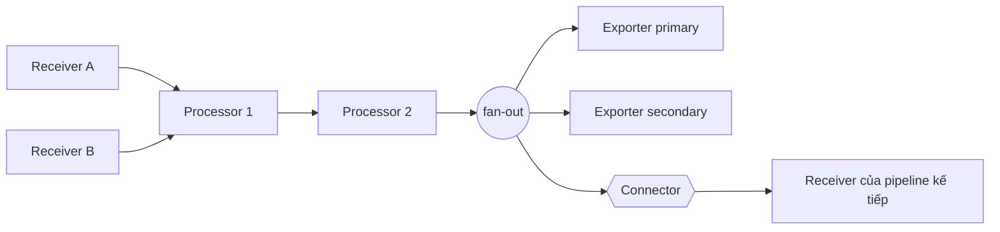

<Callout type="info" title="Pipeline là cấu hình thực thi">
  Khai báo một receiver, processor, exporter hoặc connector chưa làm component đó
  hoạt động. Component chỉ đi vào data path khi được tham chiếu đúng signal trong
  `service.pipelines`; hãy validate bằng đúng binary và distribution sẽ deploy.
</Callout>

## Mục lục

- [Mental model theo signal](#mental-model-theo-signal)
  - [Tên pipeline signal/name](#tên-pipeline-signalname)
  - [Định danh component type/name](#định-danh-component-typename)
- [Nối receivers, processors và exporters](#nối-receivers-processors-và-exporters)
  - [Thứ tự processor là contract](#thứ-tự-processor-là-contract)
  - [Fan-out và fan-in](#fan-out-và-fan-in)
- [Tái sử dụng component và ranh giới cô lập](#tái-sử-dụng-component-và-ranh-giới-cô-lập)
- [Connector tại biên pipeline](#connector-tại-biên-pipeline)
- [Tương thích signal](#tương-thích-signal)
- [Lifecycle, backpressure và lỗi từng nhánh](#lifecycle-backpressure-và-lỗi-từng-nhánh)
- [Cấu hình YAML hoàn chỉnh](#cấu-hình-yaml-hoàn-chỉnh)
  - [Đọc data path của ví dụ](#đọc-data-path-của-ví-dụ)
- [Validate và xác minh end-to-end](#validate-và-xác-minh-end-to-end)
  - [Kiểm tra tĩnh trước khi deploy](#kiểm-tra-tĩnh-trước-khi-deploy)
  - [Kiểm tra runtime theo từng signal](#kiểm-tra-runtime-theo-từng-signal)
- [Failure modes thường gặp](#failure-modes-thường-gặp)
- [Best practices cho production](#best-practices-cho-production)
- [Nguồn chính thức và tài liệu liên quan](#nguồn-chính-thức-và-tài-liệu-liên-quan)

## Mental model theo signal

`service.pipelines` là đồ thị thực thi của Collector. Mỗi pipeline chỉ mang một
signal. Receiver đưa dữ liệu vào, chuỗi processor xử lý tuần tự, rồi điểm fan-out
chuyển một bản dữ liệu tới từng exporter.



Một pipeline cần ít nhất một receiver và một exporter. Danh sách `processors` là
tùy chọn. Connector được đặt vào một trong hai danh sách biên đó tùy vai trò,
không nằm trong `processors`.

### Tên pipeline signal/name

ID pipeline có dạng `signal[/name]`. Phần `signal` quyết định kiểu dữ liệu;
`name` phân biệt nhiều pipeline cùng kiểu:

```yaml
service:
  pipelines:
    traces/ingest:
      receivers: [otlp]
      exporters: [forward/traces]
    traces/backend:
      receivers: [forward/traces]
      exporters: [otlp_grpc/primary]
```

`traces/ingest` và `traces/backend` đều là trace pipeline. Suffix không biến
`traces/backend` thành một signal khác và cũng không tự route theo tenant hay
`service.name`. Muốn route theo nội dung, cần processor hoặc connector có contract
routing phù hợp.

Các signal production phổ biến là `traces`, `metrics` và `logs`. Hỗ trợ
`profiles` đang bị feature gate và ở mức alpha trong Collector hiện hành; chỉ
dùng khi đúng release, distribution và flag đều được kiểm chứng.

### Định danh component type/name

Component ID cũng có dạng `type[/name]`, nhưng ý nghĩa khác pipeline ID. `type`
chọn factory có trong distribution. `name` tạo một cấu hình instance riêng:

```yaml
exporters:
  otlp_grpc/primary:
    endpoint: tempo.example:4317
  otlp_grpc/archive:
    endpoint: archive.example:4317
```

Tên tham chiếu phải khớp toàn bộ ID. `otlp_grpc/primary` không tham chiếu tới
`otlp_grpc` hay `otlp_grpc/archive`. Quy tắc này áp dụng cho receivers, processors, exporters và
connectors. Xem thêm [Cấu hình Collector](./configuration).

## Nối receivers, processors và exporters

Wiring tối thiểu nằm hoàn toàn dưới `service.pipelines`:

```yaml
service:
  pipelines:
    traces/app:
      receivers: [otlp]
      processors: [memory_limiter, resource/common, batch]
      exporters: [otlp_grpc/primary]
```

Luồng thực tế là `otlp → memory_limiter → resource/common → batch →
otlp_grpc/primary`. Khai báo component ở khối cấp cao nhưng không đưa vào pipeline
không kích hoạt component đó. Ngược lại, tham chiếu một ID chưa khai báo làm
startup/validation thất bại.

### Thứ tự processor là contract

Collector gọi processors đúng thứ tự trong danh sách. Vì processor có thể sửa,
gom, sinh hoặc drop dữ liệu, đổi thứ tự có thể đổi kết quả:

- Đặt `memory_limiter` sớm để từ chối tải trước các bước tốn bộ nhớ.
- Redact dữ liệu nhạy cảm trước processor hoặc exporter không được phép nhìn thấy
  dữ liệu gốc.
- Filter trước `batch` nếu mục tiêu là không giữ các item sẽ bị loại trong batch.
- Đặt `batch` gần cuối khi muốn gom kết quả sau transform/filter.
- Sampling trước một connector tổng hợp span sẽ làm metric dẫn xuất chỉ phản ánh
  tập span còn lại.

Không tham chiếu cùng một processor ID hai lần trong một pipeline; cấu hình core
hiện hành từ chối trường hợp đó. Nếu cần hai policy khác nhau của cùng type, tạo
hai ID như `transform/normalize` và `transform/redact`.

### Fan-out và fan-in

Nhiều exporter trong một pipeline tạo **fan-out**:

```yaml
exporters: [otlp_grpc/primary, otlp_grpc/archive]
```

Mỗi exporter nhận dữ liệu từ cuối chuỗi processor. Đây không phải giao dịch hai
đích: một nhánh có thể thành công trong khi nhánh kia retry hoặc thất bại.
Duplicate ở các backend là chủ đích của cấu hình này.

Nhiều receiver trong cùng pipeline tạo **fan-in** trước processor đầu tiên. Một
receiver cũng có thể được liệt kê trong nhiều pipeline cùng signal; khi đó nó
fan-out dữ liệu nhận được sang các pipeline đó. Cách này nhân đôi xử lý và có thể
nhân đôi export, nên phải được thể hiện rõ trong sơ đồ review.

## Tái sử dụng component và ranh giới cô lập

Tái sử dụng cùng ID không có cùng semantics cho mọi loại component:

| Loại | Khi cùng ID xuất hiện ở nhiều pipeline | Hệ quả vận hành |
| --- | --- | --- |
| Receiver | Một runtime instance cấp dữ liệu qua fan-out tới các pipeline tương thích | Một consumer chặn có thể chặn receiver và các pipeline dùng chung vì propagation là synchronous. |
| Processor | Mỗi pipeline có một runtime instance riêng nhưng dùng cùng cấu hình | State, batch và lỗi processor được tách theo pipeline; memory vẫn thuộc cùng process. |
| Exporter | Cùng ID trong nhiều pipeline **cùng signal** dùng chung một runtime instance; mỗi signal tạo runtime riêng | Queue, connection và lỗi đích được chia sẻ trong cùng signal, nhưng traces, metrics và logs có queue/runtime riêng. |
| Connector | Một node nối các biên pipeline theo signal pair được hỗ trợ | Backpressure/state có thể truyền qua graph; connector không tạo process isolation. |

Nếu cần failure domain độc lập thực sự, hãy tách thành nhiều Collector process và
nối chúng bằng giao thức/exporter phù hợp. Đổi suffix hoặc tách pipeline trong
cùng process không tạo quota CPU, heap hay crash boundary riêng.

<Callout type="warn" title="Dùng chung receiver có coupling đồng bộ">
  Tài liệu kiến trúc Collector nêu rõ fan-out từ một receiver dùng lời gọi đồng
  bộ. Nếu processor đầu của một pipeline bị block, receiver và các pipeline khác
  dùng receiver đó có thể ngừng nhận dữ liệu mới. Hãy load test graph dùng chung,
  không suy luận isolation chỉ từ tên pipeline.
</Callout>

## Connector tại biên pipeline

Connector vừa là exporter của pipeline nguồn, vừa là receiver của pipeline đích.
Chính cùng một ID phải xuất hiện ở hai biên:

```yaml
connectors:
  forward/traces: {}

service:
  pipelines:
    traces/ingest:
      receivers: [otlp]
      exporters: [forward/traces]
    traces/backend:
      receivers: [forward/traces]
      exporters: [otlp_grpc/primary]
```

`forward/traces` chuyển traces giữa hai pipeline trong cùng service graph. Một
connector khác có thể đổi signal, ví dụ traces thành metrics, nhưng chỉ khi
README của component công bố đúng cặp input/output đó. Connector không phải
processor, network queue hay durable buffer. Xem [Connectors](./connectors) để
đọc về vòng lặp, aggregation và delivery semantics.

Giữ graph không có cycle. Một vòng connector hoàn toàn nằm trong cùng service
graph làm validation topo thất bại và Collector không khởi động. Tuy vậy,
validator không nhìn thấy vòng đi qua network, ví dụ exporter gửi về OTLP
receiver ở một Collector khác rồi quay lại nguồn. Review cả graph trong process
và topology giữa các process để tránh feedback/duplicate.

## Tương thích signal

Pipeline quyết định signal, còn từng component công bố signal support riêng.
`otlp` thường hỗ trợ traces, metrics và logs, nhưng một receiver chuyên dụng hoặc
processor sampling có thể chỉ hỗ trợ một signal. Connector còn công bố **cặp**
signal, chẳng hạn traces→metrics.

Collector dựng graph lúc startup và trả lỗi kiểu `pipeline.ErrSignalNotSupported`
khi component không hỗ trợ signal của pipeline. Tuy vậy, hỗ trợ còn phụ thuộc
version và distribution. Chạy `otelcol components` bằng đúng image để xem
component và stability, rồi đọc README tại tag release đã pin. Không lấy việc
một component tồn tại trong `contrib` làm bằng chứng rằng custom distribution có
nó.

## Lifecycle, backpressure và lỗi từng nhánh

Collector dựng pipelines khi khởi động, sau khi resolve và validate cấu hình.
Receiver bắt đầu đưa dữ liệu qua các consumer trong process. Trên data path trực
tiếp, lời gọi đồng bộ cho phép tín hiệu lỗi hoặc backpressure truyền ngược về
receiver.

Exporter có `sending_queue` chèn hàng đợi bất đồng bộ tại biên mạng nếu component
hỗ trợ. Queue hấp thụ gián đoạn ngắn, không tạo dung lượng vô hạn. Khi queue đầy,
backend chậm hoặc memory limiter từ chối dữ liệu, Collector có thể trả lỗi upstream
hoặc drop theo contract của receiver/exporter. Retry cũng có thể tạo duplicate;
thiết kế backend phải chấp nhận delivery không mang tính giao dịch.

`batch`, queues, connector state và mọi pipeline vẫn dùng chung heap/process.
Restart có thể mất dữ liệu đang ở bộ nhớ nếu không có persistent queue được cấu
hình và hỗ trợ. Khi shutdown, Collector cố dừng components theo lifecycle, nhưng
termination grace period quá ngắn vẫn có thể cắt batch hoặc export đang chờ.
Theo dõi internal metrics về accepted/refused data, queue capacity, send failures,
CPU và memory thay vì chỉ kiểm tra health endpoint.

## Cấu hình YAML hoàn chỉnh

Ví dụ sau nhận ba signal qua OTLP. Traces đi qua connector `forward` để minh họa
biên pipeline; metrics và logs đi trực tiếp. Cả ba fan-out tới backend chính và
`debug` để verify tạm thời. Binary phải chứa `otlp`, `forward`, `memory_limiter`,
`resource`, `batch`, `otlp_grpc`, `debug` và `health_check`.

```yaml
receivers:
  otlp:
    protocols:
      grpc:
        endpoint: 0.0.0.0:4317
      http:
        endpoint: 0.0.0.0:4318

processors:
  memory_limiter:
    check_interval: 1s
    limit_mib: 512
    spike_limit_mib: 128
  resource/common:
    attributes:
      - key: deployment.environment.name
        value: "${env:DEPLOYMENT_ENVIRONMENT}"
        action: upsert
  batch:
    send_batch_size: 1024
    timeout: 5s

connectors:
  forward/traces: {}

exporters:
  otlp_grpc/primary:
    endpoint: "${env:OTLP_BACKEND_ENDPOINT}"
    headers:
      authorization: "${env:OTLP_AUTH_HEADER}"
    tls:
      ca_file: /var/run/secrets/otel/ca.pem
    sending_queue:
      enabled: true
  debug/canary:
    verbosity: basic

extensions:
  health_check:
    endpoint: 0.0.0.0:13133

service:
  extensions: [health_check]
  pipelines:
    traces/ingest:
      receivers: [otlp]
      processors: [memory_limiter, resource/common]
      exporters: [forward/traces]

    traces/backend:
      receivers: [forward/traces]
      processors: [batch]
      exporters: [otlp_grpc/primary, debug/canary]

    metrics:
      receivers: [otlp]
      processors: [memory_limiter, resource/common, batch]
      exporters: [otlp_grpc/primary, debug/canary]

    logs:
      receivers: [otlp]
      processors: [memory_limiter, resource/common, batch]
      exporters: [otlp_grpc/primary, debug/canary]
```

`0.0.0.0` mở listener trên mọi interface. Trong production, giới hạn bind address,
NetworkPolicy, firewall và authentication theo trust boundary. `debug` có thể làm
lộ telemetry; chỉ dùng cho canary trong môi trường kiểm soát rồi gỡ khỏi cả cấu
hình lẫn danh sách exporters.

### Đọc data path của ví dụ

- Traces: `otlp → memory_limiter → resource/common → forward/traces → batch →
  otlp_grpc/primary + debug/canary`.
- Metrics và logs: `otlp → memory_limiter → resource/common → batch →
  otlp_grpc/primary + debug/canary`.
- `resource/common` được tham chiếu ở ba pipeline và tạo ba processor runtime
  độc lập. `memory_limiter` cũng có các instance processor theo pipeline, nhưng
  các instance cùng bảo vệ một process và phải được sizing ở cấp process.
- `otlp` receiver có runtime theo từng signal support. Tương tự,
  `otlp_grpc/primary` tạo exporter runtime và queue riêng cho traces, metrics và
  logs. Queue failure là shared failure domain giữa các pipeline **cùng signal**,
  không phải một queue duy nhất dùng chung cho cả ba signal.

Nếu không cần policy riêng trước và sau connector, một trace pipeline duy nhất sẽ
đơn giản hơn. Connector trong ví dụ là ranh giới logic, không phải yêu cầu mặc
định cho mọi deployment.

## Validate và xác minh end-to-end

### Kiểm tra tĩnh trước khi deploy

Dùng đúng binary, version, feature gates và các nguồn cấu hình của production:

```bash
otelcol components

otelcol validate --config=file:/etc/otelcol/config.yaml
```

Nếu image dùng Collector Contrib, binary thường là `otelcol-contrib`. `validate`
kiểm tra parse, component references và validation do component cung cấp. Nó
không chứng minh DNS, TLS, credential hay backend đang nhận đúng signal.

Trong review hoặc CI, kiểm tra thêm:

1. Mỗi pipeline có ít nhất một receiver và một exporter.
2. Mọi ID tham chiếu đã được khai báo và suffix khớp chính xác.
3. Mỗi component hỗ trợ signal hoặc connector signal pair tương ứng.
4. Processor không lặp trong cùng pipeline và thứ tự đúng policy.
5. Mọi connector có đủ phía exporter nguồn và receiver đích; graph không có cycle.
6. Fan-out, reuse và failure domain đều có chủ đích.

### Kiểm tra runtime theo từng signal

1. Khởi động cấu hình trong staging và kiểm tra startup logs không có lỗi.
2. Gửi một trace, metric và log canary có marker duy nhất qua OTLP/gRPC hoặc
   OTLP/HTTP đúng cổng.
3. Xác nhận `debug/canary` thấy từng signal sau processors. Dùng `detailed` chỉ
   trong môi trường an toàn nếu cần xem payload.
4. Tìm cùng marker ở backend và kiểm tra resource attributes, số lượng và độ trễ.
5. Làm chậm hoặc chặn backend trong test. Quan sát queue, retry, refused data,
   memory và khả năng receiver tiếp tục phục vụ.
6. Rolling restart dưới tải để kiểm tra grace period và mức mất/duplicate chấp nhận
   được.
7. Gỡ `debug/canary`, validate lại và deploy cấu hình cuối.

Health endpoint chỉ chứng minh trạng thái extension/process theo implementation;
nó không chứng minh dữ liệu đã đi qua mọi processor và tới backend.

## Failure modes thường gặp

| Triệu chứng | Nguyên nhân khả dĩ | Cách xử lý |
| --- | --- | --- |
| Startup báo thiếu receiver/exporter | Pipeline có danh sách rỗng hoặc key sai indentation | Thêm ít nhất một biên vào/ra và chạy `validate`. |
| `unknown type` | Distribution không chứa factory của component | Chạy `components`; pin đúng distribution hoặc custom build. |
| `ErrSignalNotSupported` | Component không hỗ trợ signal pipeline | Chọn component tương thích; đọc README đúng release. |
| Collector chạy nhưng không listen/export | Component chỉ được khai báo, chưa được tham chiếu | Kiểm tra `service.pipelines` và ID đầy đủ. |
| Processor không có tác dụng | Sai thứ tự, sai suffix hoặc dữ liệu đã bị drop trước đó | Viết lại data path tuần tự và kiểm tra bằng canary. |
| Validation báo processor lặp | Cùng ID xuất hiện hai lần trong một pipeline | Tạo hai ID cấu hình riêng hoặc bỏ tham chiếu thừa. |
| Dữ liệu xuất hiện hai lần | Receiver hoặc exporter fan-out ngoài chủ đích | Vẽ graph theo signal và loại cạnh/pipeline trùng. |
| Một pipeline chậm kéo pipeline khác | Dùng chung receiver/exporter hoặc chung tài nguyên process | Tuning queue/capacity; tách Collector process nếu cần isolation. |
| Một backend có dữ liệu, backend kia trống | Fan-out không có atomic success | Theo dõi và alert từng exporter; test retry từng đích. |
| Queue đầy, refused data tăng | Backend chậm, queue quá nhỏ hoặc tải vượt capacity | Sửa backend, capacity-plan, giới hạn queue và scale có kiểm chứng. |
| Connector không phát dữ liệu | Thiếu một phía hoặc signal pair không hợp lệ | Nối cùng ID ở hai biên và kiểm tra contract component. |
| Restart làm mất batch/state | Dữ liệu chỉ nằm trong memory hoặc grace period ngắn | Cấu hình persistence nếu hỗ trợ; tăng grace period và test shutdown. |

## Best practices cho production

- Giữ pipeline nhỏ, đặt tên theo vai trò như `traces/ingest` và
  `metrics/derived`, không đặt tên mơ hồ như `/2`.
- Vẽ graph theo từng signal và review mọi cạnh fan-out/connector như code.
- Pin Collector version và distribution. Validate bằng chính binary trong image.
- Đặt processor bảo vệ tài nguyên sớm, redaction trước trust boundary và batch
  gần cuối khi phù hợp với semantics mong muốn.
- Không chia sẻ receiver/exporter giữa các pipeline cần failure isolation mạnh.
  Tách process khi coupling không chấp nhận được.
- Capacity-plan cho tổng batch, queues, connector state và số pipeline; tất cả
  tiêu thụ cùng CPU/heap.
- Cấu hình TLS và authentication cho receiver/exporter. Không log payload hoặc
  secret trong production.
- Theo dõi internal telemetry theo component ID và signal. Alert trên refused,
  failed sends, queue saturation, memory và restart.
- Canary từng signal sau mọi thay đổi. Traces thành công không chứng minh metrics
  hoặc logs thành công.
- Dùng [Receivers](./receivers), [Processors](./processors) và
  [Exporters](./exporters) để kiểm tra contract của từng node trước khi nối graph.

## Nguồn chính thức và tài liệu liên quan

- [Collector configuration — Service pipelines](https://opentelemetry.io/docs/collector/configuration/#pipelines)
- [Collector architecture — Pipelines, fan-out và component reuse](https://opentelemetry.io/docs/collector/architecture/#pipelines)
- [Pipeline ID `signal[/name]` trong Collector core](https://github.com/open-telemetry/opentelemetry-collector/blob/main/pipeline/pipeline.go)
- [Validation của `service.pipelines`](https://github.com/open-telemetry/opentelemetry-collector/blob/main/service/pipelines/config.go)
- [Collector troubleshooting](https://opentelemetry.io/docs/collector/troubleshooting/)
- [Collector component registry](https://opentelemetry.io/docs/collector/components/)

<Cards>
  <Card title="Cấu hình Collector" href="/collector/configuration/" description="Định danh component, nguồn cấu hình và validation." />
  <Card title="Connectors" href="/collector/connectors/" description="Nối pipeline, đổi signal và kiểm soát graph." />
  <Card title="Collector distributions" href="/collector/collector-distributions/" description="Chọn binary có đúng component và stability." />
</Cards>
