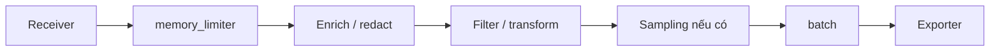

<Callout type="info" title="Phạm vi">
  Processor chạy **bên trong một pipeline và theo đúng thứ tự khai báo**. Trang này dùng cú pháp hiện hành; hãy kiểm tra component và stability trong đúng distribution Collector đang triển khai trước khi sao chép cấu hình.
</Callout>

## Mục lục

- [Mental model và thứ tự xử lý](#mental-model-và-thứ-tự-xử-lý)
  - [Thứ tự khuyến nghị](#thứ-tự-khuyến-nghị)
- [Các processor nền tảng](#các-processor-nền-tảng)
  - [memory_limiter và batch](#memory_limiter-và-batch)
  - [attributes và resource](#attributes-và-resource)
  - [filter](#filter)
  - [transform và OTTL](#transform-và-ottl)
  - [tail_sampling](#tail_sampling)
- [Cấu hình tham khảo có kiểm soát](#cấu-hình-tham-khảo-có-kiểm-soát)
- [Xác minh biến đổi](#xác-minh-biến-đổi)
- [Failure modes và best practices](#failure-modes-và-best-practices)
- [Nguồn tham khảo](#nguồn-tham-khảo)

## Mental model và thứ tự xử lý

Receiver tạo các batch telemetry nội bộ. Mỗi processor nhận batch từ component đứng trước, có thể sửa, bỏ hoặc giữ dữ liệu, rồi chuyển kết quả sang component kế tiếp. Processor không phải hàng đợi bền vững và không tự tạo đường đi sang pipeline khác.



Danh sách `processors` trong `service.pipelines` mới quyết định thứ tự chạy. Thứ tự các block ở cấp cao nhất không có ý nghĩa thực thi. Một processor đã cấu hình nhưng không được tham chiếu bởi pipeline sẽ không chạy; xem thêm [Collector configuration](./configuration) và [Service pipelines](./pipelines).

### Thứ tự khuyến nghị

Một điểm bắt đầu hợp lý là:

1. `memory_limiter` ở đầu pipeline để tạo backpressure trước các thao tác tốn bộ nhớ.
2. Enrichment — bước bổ sung thuộc tính — chạy khi còn context gốc, ví dụ metadata từ resource detection hoặc Kubernetes.
3. Xóa PII, chuẩn hóa trường dữ liệu và giới hạn cardinality — số lượng tổ hợp giá trị khác nhau — trước khi dữ liệu rời Collector.
4. `filter` trước thao tác đắt tiền nếu điều kiện lọc không phụ thuộc vào biến đổi phía sau.
5. `tail_sampling` sau các processor bổ sung thuộc tính mà policy cần.
6. `batch` gần cuối để gom dữ liệu theo đích xuất.

Đây là khuyến nghị, không phải luật tuyệt đối. Lọc sớm giảm CPU và bộ nhớ nhưng có thể làm mất dữ liệu cần cho transform hoặc sampling. Batch trước processor có trạng thái đôi khi tăng hiệu suất, nhưng có thể tăng peak memory và thay đổi kích thước batch mà component sau quan sát. Hãy chọn thứ tự từ dependency dữ liệu rồi đo tải thực tế.

## Các processor nền tảng

### memory_limiter và batch

`memory_limiter` theo dõi mức dùng bộ nhớ và từ chối dữ liệu khi vượt ngưỡng để Collector có cơ hội giải phóng bộ nhớ. Tín hiệu từ chối là lỗi có thể retry; receiver hỗ trợ backpressure có thể thử lại, nhưng sender không retry hoặc hàng đợi đầy vẫn có thể mất dữ liệu. Đây không phải hard limit của container, vì kiểm tra diễn ra theo chu kỳ và heap có thể vượt ngưỡng trong thời gian ngắn.

`batch` gom telemetry để giảm số request và overhead của exporter. Đổi lại, batch giữ dữ liệu trong bộ nhớ và thêm độ trễ. Không sao chép các giá trị timeout hoặc batch size từ môi trường khác nếu chưa load test.

<Callout type="warn" title="Không dùng memory_limiter thay cho resource limit">
  Đặt giới hạn bộ nhớ cho container/process, chừa headroom cho Collector, exporter queue và spike lưu lượng. Theo dõi các metric `otelcol_processor_refused_*`; việc từ chối lặp lại là dấu hiệu cần chỉnh cấu hình hoặc scale.
</Callout>

### attributes và resource

Hai processor giải quyết hai scope khác nhau:

| Processor | Scope | Dùng khi |
|---|---|---|
| `attributes` | Thuộc tính của span, log record hoặc datapoint được hỗ trợ | Xóa token, đổi tên key, chèn giá trị trên từng record |
| `resource` | Resource attributes dùng chung cho một nhóm telemetry | Chuẩn hóa `service.namespace`, môi trường triển khai hoặc metadata workload |

Không đưa user ID, URL đầy đủ, query text hay giá trị không bị chặn vào dimension metric. Mỗi giá trị duy nhất tạo thêm time series và làm tăng cardinality. Với PII, ưu tiên không thu thập từ SDK; redaction ở Collector chỉ là lớp phòng vệ thứ hai.

### filter

`filter` dùng điều kiện OTTL để **drop** telemetry khớp điều kiện. Trong release
`v0.157.0`, component này vẫn ở stability **alpha** cho traces, metrics và logs;
pin release và chạy fixture migration trước khi nâng cấp. Trong một danh sách
điều kiện, chỉ cần một điều kiện đúng là phần tử tương ứng bị loại. Lọc span
riêng lẻ có thể tạo trace mồ côi; lọc datapoint có thể làm metric rỗng và bị loại
theo.

Dùng `error_mode: ignore` khi muốn lỗi đánh giá một record không chặn cả batch, đồng thời phải giám sát log lỗi. Dùng chế độ propagate chỉ khi việc fail-closed quan trọng hơn availability. Context OTTL (`resource`, `span`, `datapoint`, `log`...) quyết định path nào hợp lệ; kiểm tra README của phiên bản đang chạy vì schema filter đã phát triển theo thời gian.

### transform và OTTL

`transform` chạy các statement của **OpenTelemetry Transformation Language (OTTL)**. OTTL truy cập telemetry theo context và cung cấp hàm như `set`, `delete_key` và `replace_pattern`. Ví dụ, `set(resource.attributes["deployment.environment.name"], "production")` sửa resource, còn `delete_key(attributes, "enduser.email")` xóa key trong context record phù hợp.

Statement có thể phá semantic conventions hoặc đổi kiểu dữ liệu. Đừng transform trực tiếp trên production trước khi chạy với fixture đại diện. Với biểu thức có khả năng lỗi, chọn `error_mode` có chủ đích và alert trên lỗi Collector.

### tail_sampling

`tail_sampling` giữ các span theo `trace_id` đến khi có đủ thông tin để quyết định giữ hay bỏ toàn trace. Nó phù hợp khi cần giữ trace lỗi hoặc trace chậm, nhưng có chi phí bộ nhớ và độ trễ đáng kể. Component này hỗ trợ traces ở mức **beta** trong distribution contrib/K8s ở release `v0.157.0`.

Mọi span của cùng trace phải đến cùng một Collector instance. Khi scale ngang, route theo trace ID trước tầng tail-sampling. Processor phải đứng sau component cần context gốc, vì việc tái gom span thành batch mới làm mất context nhận ban đầu. Chọn policy, thời gian chờ và capacity từ độ dài trace cùng lưu lượng thực tế; trace đến muộn hoặc bị phân tán có thể dẫn đến quyết định không đầy đủ.

<Callout type="warn" title="Sampling là data loss có chủ đích">
  Kiểm tra policy trên bản sao lưu lượng và đo tỷ lệ keep/drop. Không dùng tail sampling để che lỗi capacity, và không giả định metrics sinh từ trace đã sample đại diện chính xác cho toàn bộ traffic.
</Callout>

## Cấu hình tham khảo có kiểm soát

Ví dụ tối thiểu dưới đây xóa một thuộc tính nhạy cảm, bỏ health-check span, gắn
môi trường triển khai rồi batch trước khi xuất. `filter` vẫn là alpha và
`debug` chỉ dành cho kiểm chứng trong môi trường cô lập. Giá trị memory là điểm
khởi đầu minh họa, không phải default hay sizing recommendation.

```yaml
receivers:
  otlp:
    protocols:
      grpc:
        endpoint: 127.0.0.1:4317

processors:
  memory_limiter:
    check_interval: 1s
    limit_percentage: 75
    spike_limit_percentage: 15

  attributes/redact:
    actions:
      - key: enduser.email
        action: delete
      - key: http.request.header.authorization
        action: delete

  resource/environment:
    attributes:
      - key: deployment.environment.name
        value: production
        action: upsert

  filter/health:
    error_mode: ignore
    trace_conditions:
      - 'span.name == "GET /healthz"'

  batch: {}

exporters:
  debug:
    verbosity: detailed

service:
  pipelines:
    traces:
      receivers: [otlp]
      processors:
        - memory_limiter
        - attributes/redact
        - resource/environment
        - filter/health
        - batch
      exporters: [debug]
```

Receiver mẫu chỉ bind loopback vì không có TLS hoặc authenticator. Trước
production, thay `debug` bằng [exporter](./exporters) phù hợp và không để detailed
logging bật lâu: payload debug có thể chứa PII, tốn CPU và tăng dung lượng log.

## Xác minh biến đổi

1. Chạy `otelcol components` bằng đúng binary/image để xác nhận `memory_limiter`, `attributes`, `resource`, `filter` và `batch` tồn tại.
2. Khởi động Collector với file cấu hình trong CI hoặc staging. Startup failure bắt được component name, key và OTTL syntax sai.
3. Gửi fixture OTLP có `enduser.email`, Authorization header, một span `/healthz` và một span nghiệp vụ.
4. Quan sát `debug` trong staging: field nhạy cảm phải biến mất, resource mới phải có mặt, health span phải biến mất và business span phải còn.
5. So sánh số record vào/ra và theo dõi log cùng internal telemetry `otelcol_processor_*`. Load test để kiểm tra RSS, refused telemetry, latency và exporter failures.

Để tránh tự xác nhận bằng cùng một đường dữ liệu, lưu fixture và expected output trong test. Khi nâng Collector, chạy lại test vì stability alpha/beta cho phép thay đổi hành vi hoặc cấu hình.

## Failure modes và best practices

| Failure mode | Hậu quả | Cách giảm thiểu |
|---|---|---|
| `memory_limiter` quá sát container limit | OOM trước khi limiter phản ứng | Chừa headroom, load test spike, theo dõi RSS và refused records |
| Lọc hoặc redact sai context | Dữ liệu vẫn rò rỉ hoặc bị drop quá mức | Fixture cho từng signal/context; fail deployment nếu startup báo lỗi |
| Xóa thuộc tính trước policy cần nó | Sampling/routing sai | Ghi rõ dependency và đặt processor dùng field trước bước xóa |
| Thêm dimension không giới hạn | Bùng nổ time series và chi phí backend | Allowlist key/value; không dùng ID, raw URL hoặc query làm dimension |
| Tail sampling trên nhiều replica không sticky | Trace thiếu span, quyết định lệch | Route theo trace ID và đo late spans/decision capacity |
| Batch/queue giữ quá nhiều dữ liệu | Tăng RSS và độ trễ khi backend chậm | Sizing đồng thời batch, exporter queue và memory limit |
| Log payload để debug trên production | Rò PII và tăng I/O | Debug ngắn hạn, truy cập hạn chế, redaction trước debug exporter |

Best practice quan trọng nhất là coi thay đổi processor như thay đổi dữ liệu: review policy, test output, canary, đo trước/sau và có rollback. Pin phiên bản Collector thay vì theo tag trôi nổi.

## Nguồn tham khảo

- [Collector configuration — Processors](https://opentelemetry.io/docs/collector/configuration/#processors)
- [Danh sách processor, distribution và stability](https://opentelemetry.io/docs/collector/components/processor/)
- [Memory Limiter Processor](https://github.com/open-telemetry/opentelemetry-collector/tree/main/processor/memorylimiterprocessor)
- [Filter Processor và OTTL contexts](https://github.com/open-telemetry/opentelemetry-collector-contrib/tree/main/processor/filterprocessor)
- [Transform Processor](https://github.com/open-telemetry/opentelemetry-collector-contrib/tree/main/processor/transformprocessor)
- [Tail Sampling Processor](https://github.com/open-telemetry/opentelemetry-collector-contrib/tree/main/processor/tailsamplingprocessor)
