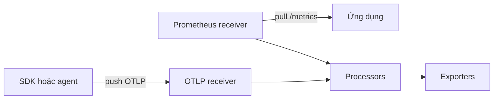

<Callout type="info" title="Receiver chỉ là cửa vào">
  Khai báo receiver chưa làm nó chạy. Bạn phải tham chiếu đúng tên instance trong một `service.pipelines` tương thích với signal; đồng thời phải bảo vệ mọi endpoint được mở ra mạng.
</Callout>

## Mục lục

- [Mental model](#mental-model)
  - [Push và pull](#push-và-pull)
  - [Lifecycle và backpressure](#lifecycle-và-backpressure)
- [OTLP receiver qua gRPC và HTTP](#otlp-receiver-qua-grpc-và-http)
  - [Endpoint, port và path](#endpoint-port-và-path)
  - [Cấu hình OTLP hoàn chỉnh](#cấu-hình-otlp-hoàn-chỉnh)
- [Prometheus receiver để scrape metrics](#prometheus-receiver-để-scrape-metrics)
- [Ranh giới mạng, TLS và xác thực](#ranh-giới-mạng-tls-và-xác-thực)
- [Xác minh ingress](#xác-minh-ingress)
- [Lỗi phổ biến](#lỗi-phổ-biến)
- [Nguồn chính thức và nội dung liên quan](#nguồn-chính-thức-và-nội-dung-liên-quan)

## Mental model

Receiver là component đưa telemetry **vào** pipeline Collector. Nó chuyển dữ liệu từ giao thức hoặc nguồn bên ngoài thành mô hình nội bộ của Collector; processor xử lý dữ liệu đó, rồi exporter gửi dữ liệu ra ngoài.



### Push và pull

- **Push receiver** lắng nghe kết nối và để client chủ động gửi dữ liệu. Ví dụ, SDK gửi OTLP/gRPC tới receiver `otlp` ở cổng `4317`. Receiver sở hữu listen endpoint; client sở hữu nhịp gửi.
- **Pull/scrape receiver** chủ động gọi target theo chu kỳ. Ví dụ, receiver `prometheus` gửi HTTP GET tới `app:9464/metrics`. Receiver sở hữu lịch scrape, timeout và danh sách target.

Push phù hợp với traces, logs và metrics do SDK phát. Pull phù hợp với metrics đã được ứng dụng hoặc hạ tầng expose theo định dạng Prometheus.

### Lifecycle và backpressure

Collector khởi tạo receiver khi pipeline tham chiếu đến nó, mở listener hoặc bắt đầu vòng scrape, rồi dừng nhận dữ liệu khi service shutdown. Nếu downstream xử lý chậm, áp lực ngược (**backpressure**) lan về receiver. Với push, request có thể chậm hoặc bị từ chối để client tự retry theo chính sách của client. Với pull, scrape có thể timeout hoặc bỏ lỡ chu kỳ.

Receiver không phải kho bền vững. **Batching** là gom nhiều telemetry item thành lần xử lý/gửi lớn hơn; nó cải thiện hiệu suất nhưng không biến RAM thành durable storage. Queue và retry thường nằm ở exporter, không bảo đảm dữ liệu đã vào receiver sẽ sống sót khi process bị kill.

## OTLP receiver qua gRPC và HTTP

Receiver type hiện hành là `otlp`. Nó nhận traces, metrics và logs qua OTLP/gRPC hoặc OTLP/HTTP. Chỉ protocol xuất hiện dưới `protocols` mới được bật.

### Endpoint, port và path

| Transport | Listen endpoint trong ví dụ | Đích client | Ghi chú |
| --- | --- | --- | --- |
| OTLP/gRPC | `0.0.0.0:4317` | `collector.example.com:4317` | gRPC; không thêm `/v1/...` |
| OTLP/HTTP | `0.0.0.0:4318` | base URL `http://collector.example.com:4318` | POST mặc định tới `/v1/traces`, `/v1/metrics`, `/v1/logs` |

`0.0.0.0` là địa chỉ **bind**, không phải hostname để client sử dụng. Nó expose listener trên mọi interface IPv4. Nếu chỉ nhận từ process cùng host, bind `127.0.0.1`; trong container hoặc Kubernetes, bind theo interface cần thiết và dùng firewall, NetworkPolicy hoặc security group để thu hẹp nguồn truy cập.

### Cấu hình OTLP hoàn chỉnh

Ví dụ này cố ý dùng plaintext cho lab nội bộ. Nó bật cả ba pipeline để cùng một receiver nhận đủ ba signal và dùng `debug` để kiểm tra dữ liệu.

```yaml
receivers:
  otlp:
    protocols:
      grpc:
        endpoint: 0.0.0.0:4317
      http:
        endpoint: 0.0.0.0:4318

exporters:
  debug:
    verbosity: basic

service:
  pipelines:
    traces:
      receivers: [otlp]
      exporters: [debug]
    metrics:
      receivers: [otlp]
      exporters: [debug]
    logs:
      receivers: [otlp]
      exporters: [debug]
```

Tên component có dạng `type[/name]`. Nếu khai báo `otlp/public`, pipeline phải dùng chính xác `otlp/public`, không dùng `otlp`.

<Callout type="warn" title="Không dùng plaintext qua mạng không tin cậy">
  Listener OTLP không tự tạo ranh giới tin cậy. Với production, bật TLS/mTLS hoặc server authenticator, đồng thời giới hạn network exposure.
</Callout>

## Prometheus receiver để scrape metrics

Receiver `prometheus` là pull receiver chỉ dành cho metrics. Cấu hình scrape nằm dưới `config` và dùng cấu trúc Prometheus. Ví dụ sau scrape path `/metrics` của ứng dụng mỗi 15 giây:

```yaml
receivers:
  prometheus/app:
    config:
      scrape_configs:
        - job_name: app
          scrape_interval: 15s
          metrics_path: /metrics
          static_configs:
            - targets: [app:9464]

exporters:
  debug:
    verbosity: basic

service:
  pipelines:
    metrics:
      receivers: [prometheus/app]
      exporters: [debug]
```

Target phải truy cập được **từ network namespace của Collector**. `localhost:9464` trong container Collector trỏ về chính container đó, không trỏ về container ứng dụng. Khi chạy nhiều replica Collector với cùng scrape config, mỗi replica có thể scrape cùng target và tạo dữ liệu trùng; hãy shard target hoặc dùng cơ chế phân bổ target phù hợp.

## Ranh giới mạng, TLS và xác thực

TLS trên receiver là cấu hình server-side. `cert_file` và `key_file` mã hóa kết nối; thêm `client_ca_file` để yêu cầu và kiểm tra chứng thư client (mTLS):

```yaml
receivers:
  otlp/secure:
    protocols:
      grpc:
        endpoint: 0.0.0.0:4317
        tls:
          cert_file: /etc/otel/tls/server.crt
          key_file: /etc/otel/tls/server.key
          client_ca_file: /etc/otel/tls/clients-ca.crt

exporters:
  debug:

service:
  pipelines:
    traces:
      receivers: [otlp/secure]
      exporters: [debug]
```

TLS xác minh danh tính bằng certificate; token/OIDC là lớp xác thực ứng dụng. Auth trên receiver cần một authenticator extension được cấu hình, bật trong `service.extensions`, rồi tham chiếu bằng `auth.authenticator` bên dưới protocol. Extension cụ thể phải có trong distribution đang chạy. Không đặt bí mật trực tiếp trong Git; dùng secret manager hoặc biến môi trường do nền tảng cấp.

## Xác minh ingress

1. Chạy `otelcol components` và xác nhận distribution có `otlp`, `prometheus` (nếu dùng) và `debug`.
2. Chạy `otelcol validate --config=config.yaml` trước khi deploy.
3. Kiểm tra Collector thực sự listen trên `4317`/`4318`, hoặc xem log scrape của Prometheus receiver.
4. Gửi một trace/metric/log thử từ workload với đúng transport. Với OTLP/HTTP, kiểm tra đúng signal path và `POST`; gọi `GET /v1/traces` không phải phép thử hợp lệ.
5. Tạm dùng `debug` exporter và tìm resource/service mong đợi trong log Collector. Sau đó kiểm tra internal telemetry của Collector, đặc biệt accepted/refused telemetry và lỗi receiver.

`curl` chỉ xác minh TCP/TLS hoặc HTTP routing, không tự tạo payload OTLP protobuf hợp lệ. Dùng ứng dụng instrumented, SDK, hoặc công cụ sinh telemetry để kiểm tra end-to-end.

## Lỗi phổ biến

| Triệu chứng | Nguyên nhân thường gặp | Cách xử lý |
| --- | --- | --- |
| Connection refused | Receiver không được bật trong pipeline, sai port, hoặc bind chỉ ở loopback | Đối chiếu `service.pipelines`, listener và network namespace |
| HTTP 404/405 | Dùng sai `/v1/{signal}` hoặc sai HTTP method | Dùng POST tới `/v1/traces`, `/v1/metrics` hay `/v1/logs` |
| gRPC báo protocol/TLS error | Client gửi HTTP vào `4317`, hoặc một phía dùng TLS còn phía kia plaintext | Khớp transport và TLS ở cả hai đầu |
| Collector chạy nhưng không có dữ liệu | Component chỉ được khai báo, chưa tham chiếu trong pipeline đúng signal | Bật receiver trong `service.pipelines` |
| Prometheus target down | DNS, path, port hoặc network policy sai | Gọi target từ chính pod/container Collector và kiểm tra `/metrics` |
| Dữ liệu bị từ chối khi tải cao | Downstream chậm gây backpressure hoặc Collector chạm giới hạn tài nguyên | Kiểm tra internal metrics, capacity và queue/retry phía exporter; client push phải có retry hữu hạn |

## Nguồn chính thức và nội dung liên quan

- [Collector configuration — Receivers](https://opentelemetry.io/docs/collector/configuration/#receivers)
- [OTLP receiver README](https://github.com/open-telemetry/opentelemetry-collector/tree/main/receiver/otlpreceiver)
- [Prometheus receiver README](https://github.com/open-telemetry/opentelemetry-collector-contrib/tree/main/receiver/prometheusreceiver)
- [Collector security guidance](https://opentelemetry.io/docs/security/config-best-practices/)

<Cards>
  <Card title="OTLP/gRPC và OTLP/HTTP" href="/protocols-backends/otlp-grpc-http/" description="Hiểu transport, endpoint và signal path của OTLP." />
  <Card title="Pipelines" href="/collector/pipelines/" description="Nối receiver, processor và exporter thành luồng chạy thực tế." />
</Cards>
