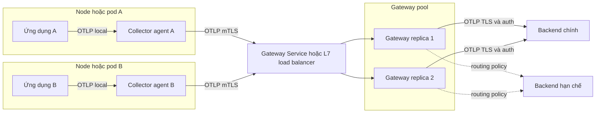
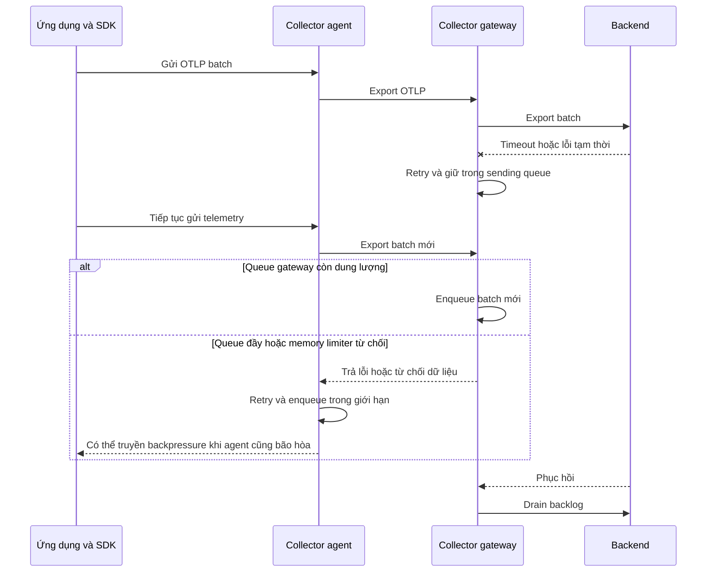

import { Step, Steps } from 'fumadocs-ui/components/steps';
import { Tab, Tabs } from 'fumadocs-ui/components/tabs';

Collector **agent** và **gateway** là hai vai trò triển khai của cùng một
OpenTelemetry Collector, không phải hai binary hoặc protocol khác nhau. Agent ở
gần nguồn telemetry; gateway cung cấp một lớp ingest và policy dùng chung cho
nhiều nguồn.

<Callout type="info" title="Phạm vi của guide">
  Guide này dùng topology `ứng dụng → agent → gateway → backend` làm ví dụ
  production. Các giá trị CPU, memory, batch và queue chỉ là điểm bắt đầu để
  minh họa. Hãy pin distribution/version, kiểm tra component thực có trong image
  và sizing bằng tải của hệ thống trước khi rollout.
</Callout>

## Mục lục

- [Mental model agent và gateway](#mental-model-agent-và-gateway)
  - [Agent](#agent)
  - [Gateway](#gateway)
  - [Khi nào chọn topology nào](#khi-nào-chọn-topology-nào)
- [Topology agent đến gateway](#topology-agent-đến-gateway)
  - [Kiến trúc tham chiếu](#kiến-trúc-tham-chiếu)
  - [Luồng khi downstream bị chậm](#luồng-khi-downstream-bị-chậm)
- [Phân chia trách nhiệm pipeline](#phân-chia-trách-nhiệm-pipeline)
  - [Công việc nên đặt ở agent](#công-việc-nên-đặt-ở-agent)
  - [Công việc nên đặt ở gateway](#công-việc-nên-đặt-ở-gateway)
  - [Routing khác load balancing](#routing-khác-load-balancing)
- [Cấu hình tham khảo](#cấu-hình-tham-khảo)
  - [Giả định và component cần có](#giả-định-và-component-cần-có)
  - [Cấu hình agent và gateway](#cấu-hình-agent-và-gateway)
  - [Routing theo policy tại gateway](#routing-theo-policy-tại-gateway)
  - [Đọc data path của cấu hình](#đọc-data-path-của-cấu-hình)
- [Scaling và failure domains](#scaling-và-failure-domains)
  - [Cô lập tầng agent](#cô-lập-tầng-agent)
  - [Scale pool gateway](#scale-pool-gateway)
  - [Xử lý có trạng thái và scraper](#xử-lý-có-trạng-thái-và-scraper)
- [Security và trust boundaries](#security-và-trust-boundaries)
  - [Bảo vệ từng network hop](#bảo-vệ-từng-network-hop)
  - [Bảo vệ dữ liệu và credential](#bảo-vệ-dữ-liệu-và-credential)
- [Backpressure, durability và duplicate](#backpressure-durability-và-duplicate)
  - [Backpressure truyền qua các tầng](#backpressure-truyền-qua-các-tầng)
  - [Sizing queue và retry](#sizing-queue-và-retry)
  - [Vì sao telemetry có thể bị trùng](#vì-sao-telemetry-có-thể-bị-trùng)
- [Kiểm chứng end to end](#kiểm-chứng-end-to-end)
  - [Kiểm tra tĩnh](#kiểm-tra-tĩnh)
  - [Gửi canary qua từng signal](#gửi-canary-qua-từng-signal)
  - [Đối chiếu từng hop](#đối-chiếu-từng-hop)
  - [Tiêm lỗi có kiểm soát](#tiêm-lỗi-có-kiểm-soát)
  - [Kiểm tra routing và duplicate](#kiểm-tra-routing-và-duplicate)
- [Rollout và rollback](#rollout-và-rollback)
  - [Ghi baseline và ngưỡng dừng](#ghi-baseline-và-ngưỡng-dừng)
  - [Triển khai gateway trước](#triển-khai-gateway-trước)
  - [Chuyển một nhóm agent canary](#chuyển-một-nhóm-agent-canary)
  - [Mở rộng và drain topology cũ](#mở-rộng-và-drain-topology-cũ)
  - [Rollback theo một thay đổi nguyên tử](#rollback-theo-một-thay-đổi-nguyên-tử)
- [Checklist production](#checklist-production)
- [Nguồn chính thức và bước tiếp theo](#nguồn-chính-thức-và-bước-tiếp-theo)

## Mental model agent và gateway

Một Collector pipeline vẫn có dạng `receiver → processors → exporters` ở cả hai
vai trò. Khác biệt nằm ở **locality** — Collector gần nguồn đến đâu — và
**failure domain** — phạm vi workload bị ảnh hưởng khi Collector lỗi.

| Tiêu chí | Agent | Gateway |
| --- | --- | --- |
| Vị trí | Cùng pod, host hoặc node với workload | Một service tập trung theo cluster, data center hoặc region |
| Nguồn gửi | Một workload hoặc nhóm workload cục bộ | Nhiều SDK, agent hoặc Collector tầng trước |
| Công việc điển hình | Nhận OTLP local, đọc file log, thu host metrics, enrich metadata cục bộ | Policy chung, routing, redaction, sampling, fan-out và giữ credential backend |
| Cách scale | Theo pod hoặc node; số instance đi cùng hạ tầng | Pool nhiều replica sau load balancer |
| Failure domain | Sidecar: pod; DaemonSet: node | Pool gateway và các nguồn phụ thuộc endpoint đó |
| Trade-off chính | Fleet lớn và dùng tài nguyên gần workload | Thêm network hop, latency và dependency chung |

### Agent

Agent chạy sát nơi dữ liệu được tạo. Sidecar đặt một agent trong mỗi pod nên cô
lập tốt theo workload. DaemonSet thường đặt một agent trên mỗi Kubernetes node,
phù hợp với file logs hoặc host metrics chỉ tồn tại tại node đó.

Agent không mặc nhiên đáng tin chỉ vì ở “nội bộ”. Một DaemonSet nhận traffic từ
mọi pod trên node vẫn là ranh giới chia sẻ. Hãy giới hạn source, xác thực khi cần
và không trộn tenant nếu threat model không cho phép.

### Gateway

Gateway cung cấp một OTLP endpoint ổn định cho nhiều nguồn. Team platform có thể
thay backend, rotate credential hoặc áp dụng policy mà không triển khai lại mọi
ứng dụng.

“Tập trung” không có nghĩa là một Collector duy nhất. Một gateway production
thường là pool nhiều replica. Pool cần load balancing, capacity, readiness,
rolling upgrade và quan sát riêng cho từng exporter.

### Khi nào chọn topology nào

| Yêu cầu thực tế | Lựa chọn bắt đầu | Lý do |
| --- | --- | --- |
| PoC nhỏ, một backend, không cần xử lý ngoài SDK | Direct export | Ít thành phần nhất; chấp nhận coupling endpoint và credential |
| Thu file logs hoặc host metrics tại node | Agent | Dữ liệu và quyền truy cập có tính cục bộ |
| Nhiều ứng dụng chỉ cần một policy OTLP chung | Gateway | Endpoint, credential và policy được quản lý tập trung |
| Cần isolation theo pod | Sidecar agent | Lỗi hoặc tải của Collector được giới hạn gần workload đó |
| Cần collection cục bộ và export tập trung | Agent đến gateway | Agent xử lý locality; gateway xử lý policy và egress |
| Cần tail sampling trên nhiều replica | Hai tầng gateway có routing nhất quán | Mọi span cùng trace phải hội tụ về cùng sampler instance |

Chọn agent đến gateway khi **cả hai tầng đều có nhiệm vụ không thể bỏ**. Nếu
agent chỉ nhận OTLP rồi chuyển nguyên trạng và gateway không cung cấp policy hay
failure boundary cần thiết, hop bổ sung chỉ làm tăng chi phí và điểm lỗi.

## Topology agent đến gateway

### Kiến trúc tham chiếu



Sơ đồ có ba network contract độc lập: ứng dụng đến agent, agent đến gateway và
gateway đến backend. Với mỗi contract, ghi rõ endpoint, protocol, TLS mode,
authentication, timeout, retry owner và giới hạn queue.

### Luồng khi downstream bị chậm



Queue chỉ trì hoãn backpressure. Nếu tốc độ vào liên tục lớn hơn tốc độ ra, mọi
queue hữu hạn cuối cùng đều đầy. Khi đó phải giảm volume, khôi phục hoặc tăng
capacity downstream; tăng queue mãi chỉ dùng thêm memory hoặc disk.

## Phân chia trách nhiệm pipeline

### Công việc nên đặt ở agent

Đặt công việc tại agent khi nó cần context hoặc quyền chỉ có ở nguồn:

- nhận OTLP qua loopback, pod network hoặc node-local endpoint;
- đọc file log và checkpoint ngay nơi file tồn tại;
- thu host metrics một lần trên mỗi host;
- gắn metadata node, pod hoặc availability zone từ nguồn tin cậy;
- loại sớm telemetry dung lượng lớn mà policy chắc chắn không cần;
- batch và queue cho hop agent đến gateway trong outage budget đã định.

Đừng đặt tail sampling ở mọi agent nếu một trace đi qua nhiều node. Mỗi agent chỉ
thấy một phần trace nên không thể ra quyết định toàn trace chính xác.

### Công việc nên đặt ở gateway

Đặt công việc tại gateway khi cần policy và góc nhìn chung:

- xác thực nguồn và ánh xạ nguồn sang tenant đáng tin cậy;
- redact field trước khi dữ liệu rời trust boundary;
- route theo tenant, region, data class hoặc backend;
- fan-out có chủ đích trong migration;
- giữ credential và certificate client của backend;
- tail sample hoặc aggregate sau khi đã bảo đảm affinity;
- queue và retry cho hop egress đến backend.

Batch ở cả agent lẫn gateway là hợp lệ nhưng cộng dồn độ trễ. Ví dụ agent chờ
`1s` và gateway chờ `3s` có thể thêm gần `4s` trước network/backend latency trong
trường hợp xấu. Hãy đặt latency budget end to end rồi tuning từng tầng.

### Routing khác load balancing

Hai khái niệm thường bị nhầm:

- **Routing connector** đọc nội dung telemetry hoặc metadata request bằng OTTL
  (OpenTelemetry Transformation Language), rồi chuyển record sang pipeline đích.
  Ví dụ: tenant `payments` đi vào backend riêng.
- **Load-balancing exporter** phân phối telemetry giữa nhiều Collector downstream.
  Nó có thể hash theo trace ID hoặc service name để dữ liệu liên quan hội tụ về
  cùng instance.

Routing quyết định **đường policy**. Load balancing quyết định **replica xử lý**.
Một L7 load balancer thông thường phù hợp với gateway stateless. Tail sampling
hoặc aggregation theo service cần tầng load-balancing exporter có routing key
phù hợp; round-robin tùy ý có thể chia nhỏ state.

## Cấu hình tham khảo

### Giả định và component cần có

Ví dụ dùng OTLP/gRPC giữa các tầng và ba signal `traces`, `metrics`, `logs`.
Distribution phải chứa `otlp`, `memory_limiter`, `batch`, `otlp_grpc`,
`file_storage` và `health_check`. Ví dụ routing còn cần connector `routing`, hiện
có stability **alpha** cho ba signal trong các distribution được README liệt kê.

Trước khi sao chép cấu hình:

1. Thay endpoint, đường dẫn certificate và giới hạn tài nguyên bằng giá trị của
   môi trường.
2. Gắn volume bền vững nếu bật `file_storage`; một filesystem tạm không tạo
   durability qua reschedule.
3. Chỉ bind `127.0.0.1` khi sender thực sự dùng chung network namespace. Agent
   DaemonSet thường cần node-local address và network policy khác.
4. Kiểm tra field bằng README đúng tag release đã pin. Component alpha có thể
   đổi cấu hình hoặc behavior.

### Cấu hình agent và gateway

<Tabs items={['Agent', 'Gateway']}>
  <Tab value="Agent">

Agent nhận OTLP local, bảo vệ memory, batch rồi gửi tới gateway bằng mTLS. Queue
được persist để có thể tiếp tục sau restart; đây là lựa chọn, không phải yêu cầu
cho mọi agent.

```yaml
receivers:
  otlp:
    protocols:
      grpc:
        endpoint: 127.0.0.1:4317
      http:
        endpoint: 127.0.0.1:4318

processors:
  memory_limiter:
    check_interval: 1s
    limit_percentage: 75
    spike_limit_percentage: 15
  batch/agent:
    send_batch_size: 1024
    timeout: 1s

extensions:
  file_storage/agent:
    directory: /var/lib/otelcol/queue
    create_directory: true
  health_check:
    endpoint: 127.0.0.1:13133

exporters:
  otlp_grpc/gateway:
    endpoint: "${env:GATEWAY_OTLP_ENDPOINT}"
    timeout: 10s
    tls:
      ca_file: /var/run/secrets/otel/gateway-ca.crt
      cert_file: /var/run/secrets/otel/agent.crt
      key_file: /var/run/secrets/otel/agent.key
    sending_queue:
      enabled: true
      sizer: items
      queue_size: 20000
      num_consumers: 4
      storage: file_storage/agent
    retry_on_failure:
      enabled: true
      initial_interval: 1s
      max_interval: 30s
      max_elapsed_time: 10m

service:
  extensions: [file_storage/agent, health_check]
  pipelines:
    traces:
      receivers: [otlp]
      processors: [memory_limiter, batch/agent]
      exporters: [otlp_grpc/gateway]
    metrics:
      receivers: [otlp]
      processors: [memory_limiter, batch/agent]
      exporters: [otlp_grpc/gateway]
    logs:
      receivers: [otlp]
      processors: [memory_limiter, batch/agent]
      exporters: [otlp_grpc/gateway]
```

  </Tab>
  <Tab value="Gateway">

Gateway xác thực certificate client tại OTLP receiver, batch ở lớp tập trung và
export bằng TLS. Credential backend được inject lúc runtime thay vì commit vào
YAML.

```yaml
receivers:
  otlp:
    protocols:
      grpc:
        endpoint: 0.0.0.0:4317
        tls:
          cert_file: /var/run/secrets/otel/gateway.crt
          key_file: /var/run/secrets/otel/gateway.key
          client_ca_file: /var/run/secrets/otel/agent-ca.crt

processors:
  memory_limiter:
    check_interval: 1s
    limit_percentage: 75
    spike_limit_percentage: 15
  batch/gateway:
    send_batch_size: 4096
    timeout: 3s

extensions:
  file_storage/gateway:
    directory: /var/lib/otelcol/queue
    create_directory: true
  health_check:
    endpoint: 0.0.0.0:13133

exporters:
  otlp_grpc/backend:
    endpoint: "${env:BACKEND_OTLP_ENDPOINT}"
    headers:
      authorization: "${env:BACKEND_AUTHORIZATION}"
    timeout: 10s
    tls:
      ca_file: /var/run/secrets/otel/backend-ca.crt
    sending_queue:
      enabled: true
      sizer: items
      queue_size: 100000
      num_consumers: 10
      storage: file_storage/gateway
    retry_on_failure:
      enabled: true
      initial_interval: 5s
      max_interval: 30s
      max_elapsed_time: 15m

service:
  extensions: [file_storage/gateway, health_check]
  pipelines:
    traces:
      receivers: [otlp]
      processors: [memory_limiter, batch/gateway]
      exporters: [otlp_grpc/backend]
    metrics:
      receivers: [otlp]
      processors: [memory_limiter, batch/gateway]
      exporters: [otlp_grpc/backend]
    logs:
      receivers: [otlp]
      processors: [memory_limiter, batch/gateway]
      exporters: [otlp_grpc/backend]
```

  </Tab>
</Tabs>

<Callout type="warn" title="Cấu hình mẫu không phải capacity plan">
  `queue_size`, `num_consumers`, batch size và retry window phía trên không phải
  default hay khuyến nghị chung. Queue lớn có thể làm đầy heap hoặc disk; nhiều
  consumer có thể dồn tải mạnh hơn vào backend đang lỗi. Đo tốc độ ingest, kích
  thước item, thời gian outage và tốc độ drain trước khi chọn giá trị.
</Callout>

### Routing theo policy tại gateway

Ví dụ đầy đủ dưới đây route traces của tenant `payments` tới backend riêng. Mọi
trace không khớp đi vào pipeline hạn chế thay vì bị drop hoặc đi nhầm tenant.
`action: move` ngăn record đã khớp tiếp tục được xét ở route sau.

```yaml
receivers:
  otlp:
    protocols:
      grpc:
        endpoint: 0.0.0.0:4317
        tls:
          cert_file: /var/run/secrets/otel/gateway.crt
          key_file: /var/run/secrets/otel/gateway.key
          client_ca_file: /var/run/secrets/otel/agent-ca.crt

processors:
  memory_limiter:
    check_interval: 1s
    limit_percentage: 75
    spike_limit_percentage: 15
  batch:
    send_batch_size: 4096
    timeout: 3s

connectors:
  routing/tenant:
    error_mode: ignore
    default_pipelines: [traces/restricted]
    table:
      - condition: 'resource.attributes["com.example.tenant.id"] == "payments"'
        action: move
        pipelines: [traces/payments]

exporters:
  otlp_grpc/payments:
    endpoint: "${env:PAYMENTS_OTLP_ENDPOINT}"
    headers:
      authorization: "${env:PAYMENTS_AUTHORIZATION}"
    tls:
      ca_file: /var/run/secrets/otel/payments-ca.crt
    sending_queue:
      enabled: true
      sizer: items
      queue_size: 50000
    retry_on_failure:
      enabled: true
      max_elapsed_time: 10m

  otlp_grpc/restricted:
    endpoint: "${env:RESTRICTED_OTLP_ENDPOINT}"
    headers:
      authorization: "${env:RESTRICTED_AUTHORIZATION}"
    tls:
      ca_file: /var/run/secrets/otel/restricted-ca.crt
    sending_queue:
      enabled: true
      sizer: items
      queue_size: 50000
    retry_on_failure:
      enabled: true
      max_elapsed_time: 10m

service:
  pipelines:
    traces/in:
      receivers: [otlp]
      processors: [memory_limiter]
      exporters: [routing/tenant]
    traces/payments:
      receivers: [routing/tenant]
      processors: [batch]
      exporters: [otlp_grpc/payments]
    traces/restricted:
      receivers: [routing/tenant]
      processors: [batch]
      exporters: [otlp_grpc/restricted]
```

`com.example.tenant.id` chỉ là namespace attribute minh họa. Không tin tenant ID
do ứng dụng tùy ý gửi. Hãy suy ra tenant từ workload identity hoặc metadata đã
được xác thực, sau đó ghi đè giá trị không đáng tin trước routing.

Routing connector chuyển dữ liệu giữa pipeline trong cùng process. Nó không tạo
network queue, crash boundary hay quota riêng. Nếu tenant cần isolation mạnh,
tách Collector process, workload identity, credential, storage và capacity.

### Đọc data path của cấu hình

- Agent: `otlp → memory_limiter → batch/agent → sending queue →
  otlp_grpc/gateway`.
- Gateway cơ bản: `otlp → memory_limiter → batch/gateway → sending queue →
  otlp_grpc/backend`.
- Gateway có routing: `otlp → memory_limiter → routing/tenant →
  traces/payments hoặc traces/restricted → batch → exporter queue → backend`.

Processor chạy theo đúng thứ tự trong `service.pipelines`. Khai báo component ở
khối cấp cao chưa làm nó hoạt động. Extension cũng phải xuất hiện trong
`service.extensions`; ví dụ routing rút gọn dùng memory queue nên không khai báo
`file_storage`.

## Scaling và failure domains

### Cô lập tầng agent

Sidecar và DaemonSet tạo failure domain khác nhau:

- **Sidecar:** một agent lỗi chủ yếu ảnh hưởng pod cùng nó. Đổi lại, tổng CPU,
  memory, connection và volume tăng theo số pod.
- **DaemonSet:** một agent phục vụ nhiều pod trên node. Nó hiệu quả cho host data,
  nhưng agent quá tải hoặc restart có thể làm mất đường thu của cả node.

Đặt request/limit và priority từ load test. Với DaemonSet, kiểm tra một workload
ồn ào có làm `refused_*` tăng cho workload khác không. Nếu cần quota hoặc
security isolation theo tenant, dùng agent hoặc pipeline riêng chưa đủ; cân nhắc
tách process và node pool.

### Scale pool gateway

Gateway stateless có thể scale ngang sau load balancer. Tuy vậy, gRPC thường giữ
kết nối lâu. Một L4 load balancer có thể ghim nhiều request của client vào một
replica. Dùng load balancer hiểu gRPC ở L7, hoặc kiểm tra client-side balancing
và connection behavior bằng tải thật.

Theo dõi ít nhất:

- receiver accepted và refused theo signal;
- `otelcol_processor_refused_*` khi `memory_limiter` hoạt động;
- `otelcol_exporter_queue_size` so với
  `otelcol_exporter_queue_capacity`;
- enqueue failure, send failure và export latency theo exporter;
- CPU, RSS/heap, disk queue, restart và thời gian drain;
- latency và error rate của chính workload gửi telemetry.

Scale khi Collector là bottleneck. Nếu queue tăng vì backend hoặc network egress
đã bão hòa, thêm gateway hay consumer có thể làm downstream tệ hơn. Nói ngắn
gọn: xác định chặng chậm trước khi scale.

Phân tán replica qua node và availability zone phù hợp. Load balancer phải loại
replica chưa ready, nhưng readiness chỉ chứng minh process nhận traffic; nó
không chứng minh backend đang ingest.

### Xử lý có trạng thái và scraper

Một số component không thể scale như receiver stateless:

- `tail_sampling` cần mọi span cùng trace đến cùng instance. Đặt tầng
  load-balancing exporter phía trước và hash theo trace ID.
- Aggregation theo service cần affinity theo service name nếu contract component
  yêu cầu.
- Prometheus receiver hoặc scraper khác cần chia target. Nhân bản cùng config có
  thể scrape trùng và vi phạm nguyên tắc single writer của metric stream.
- File log receiver cần ownership và checkpoint riêng; hai agent đọc cùng file có
  thể tạo duplicate.

Khi thay đổi số replica của tầng có state, kiểm tra rebalance, trace đang mở,
checkpoint và duplicate. Một Deployment nhiều replica tự thân không giải quyết
các contract này.

## Security và trust boundaries

### Bảo vệ từng network hop

- Bind receiver vào interface nhỏ nhất có thể. Loopback phù hợp cho sidecar cùng
  network namespace; gateway thường cần listener trên pod network.
- Dùng TLS cho agent đến gateway và gateway đến backend. Dùng mTLS khi gateway
  phải xác thực danh tính agent.
- Kiểm tra CA chain, SAN/hostname và thời hạn certificate. Không dùng
  `insecure_skip_verify` để chữa lỗi production.
- Giới hạn source bằng NetworkPolicy, firewall hoặc service mesh. Không expose
  OTLP receiver ra Internet nếu không có yêu cầu rõ ràng.
- Tách certificate, service account và quyền theo môi trường hoặc tenant. Thử
  trường hợp certificate hết hạn, sai CA và client không được cấp quyền.

mTLS xác thực certificate của client, nhưng authorization vẫn cần policy ánh xạ
danh tính đó sang tenant và hành động được phép. Routing theo một resource
attribute không thay thế authorization.

### Bảo vệ dữ liệu và credential

- Giữ token backend tại gateway khi ứng dụng và agent không cần biết nó.
- Inject secret từ secret manager, file mount hoặc workload identity. Không
  commit token, private key hay effective config có secret.
- Redact Authorization header, cookie, query, email và PII trước khi dữ liệu rời
  trust boundary. Tốt nhất là không thu thập từ SDK ngay từ đầu.
- Queue trên disk chứa telemetry nguyên bản. Mã hóa volume, giới hạn quyền đọc và
  không đưa WAL vào support bundle hoặc backup thiếu kiểm soát.
- `debug` exporter có thể ghi payload nhạy cảm. Chỉ bật ngắn hạn trong môi trường
  hạn chế sau bước redaction.
- Giới hạn cardinality của metric attributes; tenant ID có kiểm soát có thể hợp
  lệ, nhưng user ID hoặc URL thô thường tạo quá nhiều time series.

## Backpressure, durability và duplicate

### Backpressure truyền qua các tầng

Backpressure là phản ứng khi downstream xử lý chậm hơn upstream. Trên data path
đồng bộ, lỗi có thể truyền từ exporter về receiver. Sending queue chèn một ranh
giới bất đồng bộ nhưng chỉ trong capacity đã cấp.

Với hai tầng Collector, cần viết rõ behavior tại cả hai hop:

1. Gateway retry backend trong bao lâu?
2. Khi queue gateway đầy, gateway trả lỗi hay drop theo contract component nào?
3. Agent có retry lỗi đó không và queue được bao lâu?
4. Khi agent đầy, SDK chờ, retry hay drop?
5. Việc chờ có ảnh hưởng latency hoặc tài nguyên ứng dụng không?

Không hứa “không mất dữ liệu” chỉ vì đã bật queue. Memory queue mất khi process
chết. Persistent queue vẫn mất dữ liệu khi disk lỗi, đầy, volume biến mất hoặc
retry hết hạn. Nếu cần replay dài hạn và delivery contract mạnh hơn, cân nhắc
message broker bền vững giữa các tầng và chấp nhận chi phí vận hành bổ sung.

### Sizing queue và retry

Ước lượng tối thiểu theo tải đo được:

```text
số item cần giữ ≈ tốc độ item/giây × outage budget giây × hệ số an toàn
```

Ví dụ, `20.000` spans/giây trong outage budget `300` giây đã cần khoảng
`6.000.000` spans, chưa gồm metrics, logs, batch overhead và spike. Nếu
`sending_queue.sizer` là `items`, `queue_size` đo item chứ không đo byte. Hãy đo
kích thước serialized và heap/disk thực thay vì chỉ dùng công thức.

Retry window phải phù hợp queue capacity. Queue chỉ giữ được hai phút nhưng retry
mười lăm phút không tạo thêm mười ba phút durability. Sau backend phục hồi, tốc
độ export còn phải lớn hơn tốc độ vào để drain backlog trong thời gian chấp nhận
được.

Đặt alert trước khi queue đầy. Ngưỡng cụ thể phải đến từ load test và thời gian
on-call cần để phản ứng. Quan sát cả queue ratio lẫn tốc độ thay đổi; queue ở 50%
nhưng tăng nhanh có thể nguy hiểm hơn queue 70% đang drain.

### Vì sao telemetry có thể bị trùng

Collector và OTLP không cung cấp exactly-once end to end. Duplicate có thể xuất
hiện khi:

- backend đã nhận batch nhưng ACK bị mất; exporter timeout rồi gửi lại;
- agent và gateway đều retry cùng một sự cố;
- hai scraper cùng thu một target hoặc hai file receivers đọc cùng file;
- rollout cũ và mới cùng nhận một nguồn;
- fan-out gửi có chủ đích tới hai backend rồi hai luồng được nhập lại;
- routing dùng `action: copy` thay vì `move`;
- receiver hoặc exporter được tham chiếu ở nhiều pipeline tạo fan-out ngoài ý
  muốn;
- exporter quay lại receiver phía trước và tạo vòng lặp qua network.

Backend có thể deduplicate một số signal theo ID, nhưng không được giả định điều
đó cho mọi backend. Với traces, so cùng `trace_id` và `span_id`. Với logs, thêm
một canary event ID. Với metrics, giữ single writer và tìm out-of-order samples,
jump hoặc rate tăng gấp đôi.

<Callout type="warn" title="Retry đổi mất dữ liệu thành rủi ro duplicate">
  Đây là trade-off bình thường của delivery có retry. Xác định mức duplicate
  chấp nhận được, kiểm thử mất ACK và ghi rõ backend có deduplicate hay không.
  Không tắt retry chỉ để dashboard count trông sạch hơn.
</Callout>

## Kiểm chứng end to end

<Steps>
<Step>

### Kiểm tra tĩnh

Dùng đúng binary, image và mọi nguồn cấu hình sẽ chạy ở production:

```bash
otelcol components
otelcol validate --config=file:/etc/otelcol/agent.yaml
otelcol validate --config=file:/etc/otelcol/gateway.yaml
```

Nếu dùng Collector Contrib, binary có thể là `otelcol-contrib`. Xác nhận component
ID đầy đủ, signal support, connector stability và mọi extension đã được bật.
Validation không kiểm tra DNS, TLS, credential hoặc backend ingest.

</Step>
<Step>

### Gửi canary qua từng signal

Gửi một trace, metric và log có marker riêng qua endpoint agent. Trong môi trường
lab plaintext, `telemetrygen` có thể chạy như sau:

```bash
telemetrygen traces --otlp-endpoint 127.0.0.1:4317 --otlp-insecure --service agent-gateway-canary --traces 1
telemetrygen metrics --otlp-endpoint 127.0.0.1:4317 --otlp-insecure --metrics 1
telemetrygen logs --otlp-endpoint 127.0.0.1:4317 --otlp-insecure --logs 1
```

Pin version vì `telemetrygen` là utility alpha. Với cấu hình mTLS, dùng client có
CA/certificate phù hợp hoặc một application canary thật; không hạ TLS chỉ để test.

</Step>
<Step>

### Đối chiếu từng hop

Kiểm tra lần lượt SDK, agent receiver, agent exporter, gateway receiver, gateway
exporter và backend. Quan sát accepted/refused, queue size/capacity, enqueue
failed, send failed, retry, CPU, memory và restart theo từng signal.

Tìm canary ở backend bằng marker và time range chính xác. Đối chiếu
`service.name`, resource attributes, trace graph, metric value/unit và log
severity. Health endpoint chỉ chứng minh extension/process; nó không chứng minh
record đã tới backend.

</Step>
<Step>

### Tiêm lỗi có kiểm soát

Chặn backend trong thời gian ngắn hơn outage budget. Xác nhận gateway queue tăng
nhưng chưa đầy. Mở backend rồi đo tốc độ drain và ingest lag.

Lặp lại với gateway không reachable. Xác nhận agent queue/retry đúng contract và
workload không vượt error/latency budget. Sau đó restart một agent và một gateway
để kiểm tra persistent queue, termination grace period và dữ liệu trong batch.

</Step>
<Step>

### Kiểm tra routing và duplicate

Gửi ba fixture: tenant `payments`, tenant khác và thiếu tenant attribute. Chúng
phải lần lượt tới backend payments hoặc backend restricted đúng policy. Thử
attribute do client giả mạo để chứng minh gateway không tin nguồn chưa xác thực.

Mô phỏng backend nhận request nhưng client mất ACK nếu test double hỗ trợ. Đếm
cùng trace/span ID hoặc event ID trước và sau retry. Với metrics, xác nhận chỉ một
writer tạo từng stream và không có out-of-order samples.

</Step>
</Steps>

## Rollout và rollback

Không nâng agent, gateway, routing policy và backend exporter trong cùng một đợt.
Mỗi thay đổi độc lập giúp xác định đúng failure boundary khi canary lỗi.

<Steps>
<Step>

### Ghi baseline và ngưỡng dừng

Ghi volume theo signal, ingest lag, queue ratio, send/refused rate, CPU, memory,
disk, restart và chi phí backend của topology hiện tại. Định nghĩa trước ngưỡng
dừng cho data loss, duplicate, workload latency và security failure.

Lưu image digest, config hash, endpoint, certificate version và dashboard link.
Không có baseline thì “không thấy lỗi” không phải bằng chứng rollout an toàn.

</Step>
<Step>

### Triển khai gateway trước

Deploy gateway pool mới nhưng chưa chuyển toàn bộ agent. Validate readiness,
mTLS, backend auth, routing và capacity bằng synthetic canary. Làm mất một
replica và một availability zone nếu môi trường staging cho phép.

Giữ gateway cũ hoạt động. Không để hai gateway scrape cùng target hoặc cùng nhận
một nguồn metric pull.

</Step>
<Step>

### Chuyển một nhóm agent canary

Chọn một workload hoặc node pool đại diện rồi đổi endpoint agent sang gateway
mới. Không dual-write nếu mục tiêu là so count mà backend không deduplicate;
dual-write chủ đích sẽ tạo duplicate và tăng chi phí.

So canary với baseline qua ít nhất một chu kỳ peak và một bài test backend chậm.
Dừng rollout ngay khi queue không drain, refused tăng, routing sai tenant hoặc
workload bị ảnh hưởng.

</Step>
<Step>

### Mở rộng và drain topology cũ

Tăng tỷ lệ theo các nấc có thời gian quan sát. Theo dõi mỗi signal và mỗi tenant,
không suy luận metrics/logs thành công từ traces.

Sau khi nguồn cuối cùng chuyển đi, giữ topology cũ trong thời gian đủ để queue và
retry window kết thúc. Xác nhận queue bằng `0` hoặc giải thích phần còn lại trước
khi scale xuống. Thu hồi credential và route cũ sau khi không còn rollback window.

</Step>
<Step>

### Rollback theo một thay đổi nguyên tử

Nếu vượt ngưỡng dừng, đổi endpoint của nhóm canary về gateway cũ hoặc rollback
ConfigMap/revision cùng image đã biết tốt. Không sửa nóng nhiều processor trong
lúc sự cố vì sẽ làm mất bằng chứng.

Sau rollback, xác nhận telemetry mới chỉ đi qua topology cũ, queue của topology
mới không tiếp tục gửi duplicate và backend đã trở lại baseline. Nếu phải xóa
backlog, ghi rõ data loss được chấp nhận và người phê duyệt.

</Step>
</Steps>

## Checklist production

- [ ] Mỗi signal có sơ đồ từ source đến backend, gồm receiver, processor,
  exporter, queue và owner.
- [ ] Mỗi agent/gateway có failure domain, request/limit, readiness và
  termination grace period rõ ràng.
- [ ] Gateway có nhiều replica và load balancing phù hợp với gRPC hoặc stateful
  processing.
- [ ] Scraper và metric stream giữ single writer; file receiver có ownership và
  checkpoint duy nhất.
- [ ] `memory_limiter` đứng sớm, `batch` gần cuối và tổng latency hai tầng nằm
  trong budget.
- [ ] Queue/retry được sizing từ ingress rate, outage budget, memory/disk và tốc
  độ drain đo được.
- [ ] TLS/mTLS, authorization, NetworkPolicy, secret rotation và redaction đã
  được test bằng cả trường hợp thất bại.
- [ ] Routing có default bảo thủ, fixture cho từng nhánh và không tin attribute
  tenant chưa xác thực.
- [ ] Có test backend outage, gateway outage, restart, queue overflow, lost ACK
  và duplicate.
- [ ] Rollout có canary, ngưỡng dừng, artifact rollback và thời gian drain trước
  khi tắt topology cũ.

## Nguồn chính thức và bước tiếp theo

- [Agent deployment pattern](https://opentelemetry.io/docs/collector/deployment/agent/)
- [Gateway deployment pattern](https://opentelemetry.io/docs/collector/deployment/gateway/)
- [Scaling the Collector](https://opentelemetry.io/docs/collector/scaling/)
- [Collector resiliency](https://opentelemetry.io/docs/collector/resiliency/)
- [Collector configuration](https://opentelemetry.io/docs/collector/configuration/)
- [Routing connector](https://github.com/open-telemetry/opentelemetry-collector-contrib/tree/main/connector/routingconnector)
- [Load-balancing exporter](https://github.com/open-telemetry/opentelemetry-collector-contrib/tree/main/exporter/loadbalancingexporter)

<Cards>
  <Card title="Tổng quan Collector" href="/collector/overview/" description="Ôn lại data path, control boundary và vai trò triển khai." />
  <Card title="Service pipelines" href="/collector/pipelines/" description="Hiểu fan-out, component reuse, backpressure và connector." />
  <Card title="Sidecar và DaemonSet" href="/deployment/sidecar-daemonset/" description="Chọn cách đặt agent và failure domain phù hợp." />
  <Card title="Networking và TLS" href="/deployment/networking-tls/" description="Thiết kế endpoint, certificate và trust boundary cho từng hop." />
</Cards>
