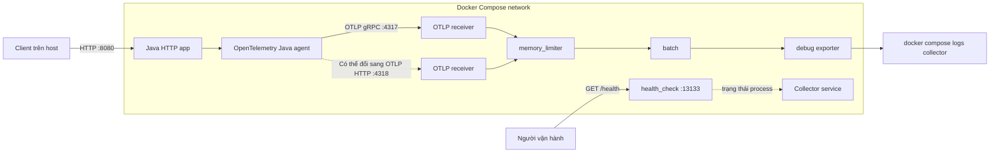

<Callout type="info" title="Mục tiêu của bài thực hành">
  Sau bài này, bạn sẽ chạy một ứng dụng HTTP có OpenTelemetry Java agent, gửi
  traces và metrics qua OTLP đến Collector, rồi xác minh dữ liệu bằng
  `health_check` và `debug` exporter. Ví dụ dùng Collector Contrib `v0.157.0`
  và Java agent `v2.30.0`; hãy đọc release notes trước khi nâng phiên bản.
</Callout>

## Mục lục

- [Mental model](#mental-model)
  - [Ranh giới container và địa chỉ localhost](#ranh-giới-container-và-địa-chỉ-localhost)
- [Kiến trúc](#kiến-trúc)
- [Điều kiện tiên quyết](#điều-kiện-tiên-quyết)
- [Chuẩn bị project](#chuẩn-bị-project)
  - [Cây thư mục](#cây-thư-mục)
  - [Ứng dụng Java được instrument](#ứng-dụng-java-được-instrument)
  - [Dockerfile của ứng dụng](#dockerfile-của-ứng-dụng)
  - [Cấu hình Collector](#cấu-hình-collector)
  - [Docker Compose](#docker-compose)
- [Chạy stack từng bước](#chạy-stack-từng-bước)
  - [Tạo và kiểm tra các file](#tạo-và-kiểm-tra-các-file)
  - [Kiểm tra distribution và cấu hình](#kiểm-tra-distribution-và-cấu-hình)
  - [Khởi động stack](#khởi-động-stack)
  - [Tạo telemetry](#tạo-telemetry)
- [Xác minh](#xác-minh)
  - [Kiểm tra process và health endpoint](#kiểm-tra-process-và-health-endpoint)
  - [Kiểm tra data path end-to-end](#kiểm-tra-data-path-end-to-end)
- [Chuyển giữa OTLP gRPC và OTLP HTTP](#chuyển-giữa-otlp-grpc-và-otlp-http)
- [Persistence và secret](#persistence-và-secret)
  - [Persistent queue cho exporter](#persistent-queue-cho-exporter)
  - [Secret và TLS](#secret-và-tls)
- [Giới hạn tài nguyên](#giới-hạn-tài-nguyên)
- [Failure modes thường gặp](#failure-modes-thường-gặp)
- [Best practices cho production](#best-practices-cho-production)
- [Dọn dẹp](#dọn-dẹp)
- [Nguồn chính thức và bài liên quan](#nguồn-chính-thức-và-bài-liên-quan)

## Mental model

Trong ví dụ này, Java agent là phần **instrumentation** nằm trong process ứng
 dụng. Agent quan sát HTTP server và JVM, sau đó SDK bên trong agent xuất
telemetry bằng OTLP. Collector là một process độc lập. Nó nhận dữ liệu, bảo vệ
bộ nhớ, gom batch rồi chuyển dữ liệu đến exporter.

```text
HTTP request ─► Java app + Java agent ─► OTLP receiver
                                      ─► memory_limiter
                                      ─► batch
                                      ─► debug exporter
```

Collector không phải database. `batch` và queue trong RAM chỉ giữ dữ liệu tạm
thời. `debug` exporter chỉ ghi telemetry ra stdout của container Collector; nó
phù hợp cho lab nhưng không phải backend production.

### Ranh giới container và địa chỉ localhost

Mỗi container có network namespace riêng. Vì vậy, `localhost` trong container
`app` trỏ về chính ứng dụng, không trỏ về Collector. Compose cung cấp DNS theo
tên service, nên endpoint đúng từ ứng dụng là `collector:4317` hoặc
`collector:4318`.

| Nguồn kết nối | Endpoint gRPC | Endpoint HTTP | Lý do |
| --- | --- | --- | --- |
| Container `app` | `http://collector:4317` | `http://collector:4318` | Dùng DNS nội bộ của Compose |
| Process trên máy host | `http://localhost:4317` | `http://localhost:4318` | Compose publish cổng về loopback của host |
| Chính container Collector | `http://localhost:4317` | `http://localhost:4318` | Receiver nằm cùng network namespace |

`0.0.0.0` trong cấu hình Collector là địa chỉ **bind**, không phải hostname mà
client nên dùng. Các cổng publish trong bài đều bind vào `127.0.0.1` của host để
không vô tình mở OTLP và health endpoint ra toàn mạng.

## Kiến trúc



Đường liền là data path của cấu hình mặc định. Đường chấm từ Java agent minh họa
phương án OTLP/HTTP thay thế. `health_check` nằm ngoài data path; HTTP 200 chỉ cho
biết endpoint health của Collector đang phục vụ, không chứng minh telemetry đã
đến exporter hoặc backend.

## Điều kiện tiên quyết

- Docker Engine đang chạy và `docker version` thành công.
- Docker Compose plugin v2; kiểm tra bằng `docker compose version`.
- `curl` trên máy host để gọi ứng dụng và health endpoint.
- Khoảng 1 GB RAM trống để build image Java và chạy hai container.
- Máy có thể tải image từ Docker Hub và Java agent từ GitHub Releases trong lần
  build đầu tiên.

```bash
docker version
docker compose version
curl --version
```

Ví dụ dùng cổng host `8080`, `4317`, `4318` và `13133`. Hãy dừng process đang
chiếm các cổng này hoặc đổi vế trái của mapping `ports` trong Compose.

## Chuẩn bị project

### Cây thư mục

Tạo một thư mục riêng, không đặt secret thật vào đó:

```text
otel-docker/
├── app/
│   ├── App.java
│   └── Dockerfile
├── collector-config.yaml
└── compose.yaml
```

### Ứng dụng Java được instrument

`app/App.java` dùng HTTP server có sẵn trong JDK. Java agent hỗ trợ
instrumentation cho Java HTTP Server, nên mỗi request tới ứng dụng tạo server
span mà không cần gọi OpenTelemetry API trong source code.

```java
import com.sun.net.httpserver.HttpExchange;
import com.sun.net.httpserver.HttpServer;

import java.io.IOException;
import java.net.InetSocketAddress;
import java.nio.charset.StandardCharsets;
import java.util.concurrent.Executors;

public final class App {
  private App() {}

  public static void main(String[] args) throws IOException {
    HttpServer server = HttpServer.create(new InetSocketAddress("0.0.0.0", 8080), 0);
    server.createContext("/", App::handle);
    server.setExecutor(Executors.newFixedThreadPool(4));
    server.start();
    System.out.println("HTTP app listening on :8080");
  }

  private static void handle(HttpExchange exchange) throws IOException {
    String body = "hello from " + exchange.getRequestURI().getPath() + "\n";
    byte[] response = body.getBytes(StandardCharsets.UTF_8);

    exchange.getResponseHeaders().set("Content-Type", "text/plain; charset=utf-8");
    exchange.sendResponseHeaders(200, response.length);
    try (var output = exchange.getResponseBody()) {
      output.write(response);
    }
  }
}
```

### Dockerfile của ứng dụng

`app/Dockerfile` biên dịch ứng dụng, tải Java agent đã pin và xác minh SHA-256
trước khi đưa agent vào runtime image. Checksum dưới đây thuộc asset chính thức
`opentelemetry-javaagent.jar` của release `v2.30.0`.

```dockerfile
FROM eclipse-temurin:21-jdk-alpine AS build
WORKDIR /src
COPY App.java .
RUN javac --add-modules jdk.httpserver App.java

FROM alpine:3.22 AS agent
ARG OTEL_JAVAAGENT_VERSION=2.30.0
ARG OTEL_JAVAAGENT_SHA256=9d6bc2ad8dd8fb7f730984988e57b8ac0a82d81c7b3b8ae795378718733a509d
RUN wget -q -O /tmp/opentelemetry-javaagent.jar \
      "https://github.com/open-telemetry/opentelemetry-java-instrumentation/releases/download/v${OTEL_JAVAAGENT_VERSION}/opentelemetry-javaagent.jar" \
    && echo "${OTEL_JAVAAGENT_SHA256}  /tmp/opentelemetry-javaagent.jar" | sha256sum -c -

FROM eclipse-temurin:21-jre-alpine
WORKDIR /app
COPY --from=agent --chown=10001:10001 /tmp/opentelemetry-javaagent.jar /otel/opentelemetry-javaagent.jar
COPY --from=build --chown=10001:10001 /src/App.class /app/App.class
USER 10001:10001
EXPOSE 8080
ENTRYPOINT ["java", "--add-modules", "jdk.httpserver", "-javaagent:/otel/opentelemetry-javaagent.jar", "App"]
```

Multi-stage build giữ compiler và công cụ tải file khỏi runtime image. User
`10001:10001` tránh chạy ứng dụng bằng root. Trong pipeline production, pin cả
base image bằng digest và lưu bằng chứng SBOM/provenance thay vì chỉ pin major
tag như ví dụ.

### Cấu hình Collector

Lưu nội dung sau thành `collector-config.yaml`:

```yaml
receivers:
  otlp:
    protocols:
      grpc:
        endpoint: 0.0.0.0:4317
      http:
        endpoint: 0.0.0.0:4318

processors:
  memory_limiter:
    check_interval: 1s
    limit_mib: 384
    spike_limit_mib: 64
  batch:
    timeout: 1s
    send_batch_size: 512

exporters:
  debug:
    verbosity: detailed

extensions:
  health_check:
    endpoint: 0.0.0.0:13133
    path: /health

service:
  extensions: [health_check]
  telemetry:
    logs:
      level: info
  pipelines:
    traces:
      receivers: [otlp]
      processors: [memory_limiter, batch]
      exporters: [debug]
    metrics:
      receivers: [otlp]
      processors: [memory_limiter, batch]
      exporters: [debug]
    logs:
      receivers: [otlp]
      processors: [memory_limiter, batch]
      exporters: [debug]
```

Receiver bật đồng thời OTLP/gRPC và OTLP/HTTP. Ứng dụng mẫu xuất traces cùng
runtime/HTTP metrics; `logs` pipeline được bật để endpoint cũng chấp nhận OTLP
logs từ client khác. `System.out` của ứng dụng vẫn chỉ đi vào Docker logs, không
tự động trở thành OTLP log record.

`debug.verbosity: detailed` giúp nhìn thấy `service.name` và attributes trong
lab. Nó có thể làm lộ dữ liệu nhạy cảm và tạo lượng log lớn. Hãy bỏ exporter này
hoặc chỉ bật `basic` trong môi trường tải cao.

### Docker Compose

Lưu nội dung sau thành `compose.yaml`:

```yaml
services:
  collector:
    image: otel/opentelemetry-collector-contrib:0.157.0
    command: ["--config=/etc/otelcol-contrib/config.yaml"]
    volumes:
      - ./collector-config.yaml:/etc/otelcol-contrib/config.yaml:ro
    ports:
      - "127.0.0.1:4317:4317"
      - "127.0.0.1:4318:4318"
      - "127.0.0.1:13133:13133"
    read_only: true
    tmpfs:
      - /tmp
    cap_drop: ["ALL"]
    pids_limit: 200
    cpus: 1.0
    mem_limit: 512m
    stop_grace_period: 30s

  app:
    build:
      context: ./app
    environment:
      JAVA_TOOL_OPTIONS: "-XX:MaxRAMPercentage=75.0"
      OTEL_SERVICE_NAME: docker-java-app
      OTEL_RESOURCE_ATTRIBUTES: "deployment.environment.name=local,service.version=1.0.0"
      OTEL_TRACES_EXPORTER: otlp
      OTEL_METRICS_EXPORTER: otlp
      OTEL_LOGS_EXPORTER: none
      OTEL_EXPORTER_OTLP_PROTOCOL: grpc
      OTEL_EXPORTER_OTLP_ENDPOINT: "http://collector:4317"
      OTEL_METRIC_EXPORT_INTERVAL: "5000"
    depends_on:
      collector:
        condition: service_started
    ports:
      - "127.0.0.1:8080:8080"
    read_only: true
    tmpfs:
      - /tmp
    cap_drop: ["ALL"]
    pids_limit: 100
    cpus: 0.5
    mem_limit: 256m
    stop_grace_period: 20s
```

`depends_on.condition: service_started` chỉ đảm bảo container Collector đã được
start, không đảm bảo receiver đã sẵn sàng. OTLP exporter của SDK có retry cho lỗi
tạm thời; phần xác minh bên dưới vẫn kiểm tra health trước khi tạo tải.

<Callout type="warn" title="health_check khác Docker HEALTHCHECK">
  Image Collector upstream là image tối giản và không có shell, `curl` hay
  `wget`. Vì vậy ví dụ không thêm một Docker `healthcheck:` giả tạo vào service
  Collector. Extension `health_check` mở endpoint thật tại `/health`; hãy probe
  endpoint từ host, một probe image chuyên dụng hoặc orchestrator. Lệnh
  `components` chạy thành công không phải health check của process đang chạy.
</Callout>

## Chạy stack từng bước

### Tạo và kiểm tra các file

Từ thư mục `otel-docker`, xác nhận Compose parse được cấu hình cuối cùng:

```bash
docker compose config --quiet
```

Lệnh này bắt lỗi YAML và biến Compose, nhưng chưa kiểm tra schema của Collector
hoặc khả năng build Java.

### Kiểm tra distribution và cấu hình

Dùng chính image đã khai báo trong Compose để kiểm tra component có sẵn:

```bash
docker compose run --rm --no-deps collector components
```

Output phải liệt kê ít nhất receiver `otlp`, processors `memory_limiter` và
`batch`, exporter `debug`, extension `health_check`. Sau đó validate file:

```bash
docker compose run --rm --no-deps collector \
  validate --config=file:/etc/otelcol-contrib/config.yaml
```

Validation không gọi backend và không gửi telemetry. Nó chỉ chứng minh file có
thể được giải mã bằng distribution hiện tại và service graph hợp lệ.

### Khởi động stack

```bash
docker compose up --build --detach
docker compose ps
docker compose logs --tail=50 collector app
```

Lần build đầu tải JDK base image và Java agent. Nếu checksum agent không khớp,
Docker build phải dừng ở bước `sha256sum -c -`; không cập nhật checksum nếu chưa
đối chiếu asset release chính thức.

### Tạo telemetry

Đợi health endpoint trả HTTP 200, sau đó gọi ứng dụng vài lần:

```bash
until curl --fail --silent http://localhost:13133/health >/dev/null; do
  sleep 1
done

for path in / /orders /checkout; do
  curl --fail --show-error "http://localhost:8080${path}"
done

# Chờ ít nhất một chu kỳ export metrics đã đặt là 5 giây.
sleep 6
```

Mỗi request tạo một HTTP server span. Java agent cũng xuất metrics JVM/HTTP theo
các instrumentation được bật và phiên bản agent đang chạy.

## Xác minh

### Kiểm tra process và health endpoint

```bash
docker compose ps
curl --fail --include http://localhost:13133/health
docker inspect --format '{{.State.OOMKilled}}' "$(docker compose ps -q collector)"
```

Kỳ vọng:

- `collector` và `app` có trạng thái `Up`;
- health endpoint trả mã `200`;
- `OOMKilled` là `false`.

Health xanh chưa chứng minh data path hoạt động. Collector vẫn có thể healthy khi
exporter lỗi, queue đầy hoặc backend không nhận được dữ liệu.

### Kiểm tra data path end-to-end

Tìm resource của ứng dụng và các batch traces/metrics trong log Collector:

```bash
docker compose logs collector | grep -E \
  'docker-java-app|ResourceSpans|ScopeSpans|ResourceMetrics|ScopeMetrics'
```

Với `debug: detailed`, output phải chứa `service.name: Str(docker-java-app)` và
ít nhất một nhóm `ResourceSpans`. Sau một chu kỳ metrics, output cũng phải có
`ResourceMetrics`. Nếu chỉ thấy thông báo startup, gọi lại ứng dụng rồi xem log
trực tiếp:

```bash
docker compose logs --follow collector
```

Để cô lập lỗi theo từng hop:

1. `curl :8080` chứng minh ứng dụng nhận request.
2. `curl :13133/health` chứng minh health extension phục vụ.
3. `debug` có `ResourceSpans` chứng minh trace đã đi qua receiver, processors và
   đến cuối pipeline.
4. Trong production, phải tìm cùng canary ở backend; debug output không chứng
   minh backend thật đã lưu dữ liệu.

## Chuyển giữa OTLP gRPC và OTLP HTTP

Collector đã listen cả hai transport. Chỉ đổi hai biến của service `app`:

```yaml
services:
  app:
    environment:
      OTEL_EXPORTER_OTLP_PROTOCOL: http/protobuf
      OTEL_EXPORTER_OTLP_ENDPOINT: "http://collector:4318"
```

Áp dụng lại container ứng dụng và tạo request mới:

```bash
docker compose up --detach --force-recreate app
curl --fail http://localhost:8080/http-test
sleep 2
docker compose logs --tail=100 collector
```

Với `OTEL_EXPORTER_OTLP_ENDPOINT`, Java agent xem giá trị HTTP là **base URL** và
tự nối `/v1/traces`, `/v1/metrics` hoặc `/v1/logs`. Không thêm `/v1/traces` vào
biến dùng chung. Với gRPC, không dùng signal path; client gọi OTLP protobuf
service trên cổng `4317`.

| Transport | Protocol | Base endpoint từ container app |
| --- | --- | --- |
| OTLP/gRPC | `grpc` | `http://collector:4317` |
| OTLP/HTTP + protobuf | `http/protobuf` | `http://collector:4318` |

Protocol và TLS phải khớp ở hai đầu. Gửi HTTP vào `4317`, gRPC vào `4318`, hoặc
bật TLS chỉ một phía đều dẫn đến lỗi handshake/protocol.

## Persistence và secret

### Persistent queue cho exporter

Stack lab không cần volume vì `debug` chỉ ghi stdout. Khi thay `debug` bằng
backend, sending queue mặc định vẫn nằm trong RAM và mất khi Collector bị xóa
hoặc restart đột ngột. Nếu yêu cầu chịu một khoảng gián đoạn backend qua restart,
dùng `file_storage` cùng volume bền vững.

Ví dụ production sau thay `debug` bằng OTLP/gRPC backend và persist queue:

```yaml
receivers:
  otlp:
    protocols:
      grpc:
        endpoint: 0.0.0.0:4317
      http:
        endpoint: 0.0.0.0:4318

processors:
  memory_limiter:
    check_interval: 1s
    limit_mib: 384
    spike_limit_mib: 64
  batch:
    timeout: 5s

extensions:
  health_check:
    endpoint: 0.0.0.0:13133
    path: /health
  file_storage/queue:
    directory: /var/lib/otelcol/queue
    create_directory: true

exporters:
  otlp_grpc/backend:
    endpoint: "${env:OTLP_BACKEND_ENDPOINT}"
    headers:
      authorization: "${env:OTLP_AUTH_HEADER}"
    tls:
      ca_file: /run/secrets/backend_ca
    timeout: 10s
    sending_queue:
      enabled: true
      queue_size: 10000
      storage: file_storage/queue
    retry_on_failure:
      enabled: true
      initial_interval: 5s
      max_interval: 30s
      max_elapsed_time: 10m

service:
  extensions: [health_check, file_storage/queue]
  pipelines:
    traces:
      receivers: [otlp]
      processors: [memory_limiter, batch]
      exporters: [otlp_grpc/backend]
    metrics:
      receivers: [otlp]
      processors: [memory_limiter, batch]
      exporters: [otlp_grpc/backend]
    logs:
      receivers: [otlp]
      processors: [memory_limiter, batch]
      exporters: [otlp_grpc/backend]
```

`queue_size` là quyết định capacity, không phải giá trị đúng cho mọi hệ thống.
Load test theo tốc độ ingest, kích thước telemetry, thời gian backend có thể gián
đoạn và dung lượng đĩa. Persistent queue vẫn có thể mất dữ liệu khi đĩa đầy,
quyền ghi sai, lỗi vĩnh viễn hoặc hết thời gian retry. Nó không thay thế durable
message broker khi hệ thống cần replay dài hạn.

Collector image chạy với UID/GID `10001:10001`. Named volume mới thường cần được
cấp quyền trước khi process non-root ghi vào. Overlay Compose dưới đây dùng một
init service để tạo quyền, mount CA read-only và truyền cấu hình backend:

```yaml
services:
  queue-init:
    image: alpine:3.22
    user: "0:0"
    command: ["sh", "-c", "chown -R 10001:10001 /queue && chmod 0700 /queue"]
    volumes:
      - collector-queue:/queue
    restart: "no"

  collector:
    command: ["--config=/etc/otelcol-contrib/collector-production.yaml"]
    depends_on:
      queue-init:
        condition: service_completed_successfully
    environment:
      OTLP_BACKEND_ENDPOINT: "${OTLP_BACKEND_ENDPOINT:?set OTLP_BACKEND_ENDPOINT}"
      OTLP_AUTH_HEADER: "${OTLP_AUTH_HEADER:?set OTLP_AUTH_HEADER}"
    volumes:
      - ./collector-production.yaml:/etc/otelcol-contrib/collector-production.yaml:ro
      - collector-queue:/var/lib/otelcol/queue
    secrets:
      - backend_ca

volumes:
  collector-queue:

secrets:
  backend_ca:
    file: ./secrets/backend-ca.pem
```

Lưu cấu hình production đầy đủ ở `collector-production.yaml`, rồi áp dụng overlay
cùng file gốc bằng `docker compose -f compose.yaml -f compose.production.yaml
up -d`. Hãy kiểm tra kết quả merge bằng cùng hai cờ `-f` với lệnh `docker compose
config` trước khi chạy.

### Secret và TLS

Compose secret ở trên mount CA tại `/run/secrets/backend_ca`. CA không nhất thiết
là bí mật, nhưng secret mount tạo ranh giới file read-only rõ ràng. Private key,
client certificate và token cần policy nghiêm ngặt hơn:

- Không commit `.env`, token, private key hoặc effective config có credential.
- `OTLP_AUTH_HEADER` nên chứa toàn bộ giá trị backend yêu cầu, ví dụ `Bearer ...`;
  không hard-code giá trị thật trong YAML.
- Environment variable có thể xuất hiện trong process inspection hoặc support
  bundle. Với threat model chặt, dùng secret manager của platform hoặc một
  authenticator extension hỗ trợ đọc file và rotation.
- Docker Compose secret chỉ mount file; Collector không tự đọc nội dung file rồi
  thay vào `${env:...}`. Đừng giả định file token sẽ tự biến thành header.
- Với mTLS, mount `ca_file`, `cert_file`, `key_file` read-only và cấu hình đúng
  đường dẫn trong exporter. Không dùng `insecure_skip_verify` để chữa lỗi
  certificate ở production.
- Rotate credential bằng quy trình đã test. Xác minh component có reload file hay
  cần rolling restart.

## Giới hạn tài nguyên

Compose đặt Collector ở `512m` RAM, còn `memory_limiter.limit_mib` là `384 MiB`.
Khoảng chênh tạo headroom cho Go runtime, queue, batch, network buffer và spike
giữa hai lần kiểm tra. `memory_limiter` không phải hard limit và không thay thế
`mem_limit` của container.

Các con số trong bài chỉ là điểm bắt đầu cho tải nhỏ. Khi sizing thực tế:

1. Đo spans, metric data points và log records mỗi giây ở tải đỉnh.
2. Đo kích thước batch, queue, RSS, CPU và độ trễ export.
3. Mô phỏng backend chậm để thấy queue tăng đến đâu.
4. Alert trước khi chạm memory/disk limit; không chờ OOM kill.
5. Chỉnh đồng thời `mem_limit`, `memory_limiter`, batch và exporter queue.

`cpus`, `pids_limit`, `cap_drop`, non-root user và read-only filesystem giảm bán
kính sự cố. Chúng không chứng minh cấu hình chịu tải. Nếu bật `file_storage`, chỉ
volume queue được phép ghi; giữ phần filesystem còn lại read-only.

## Failure modes thường gặp

| Triệu chứng | Nguyên nhân thường gặp | Cách xử lý |
| --- | --- | --- |
| App báo `Connection refused` tới `localhost:4317` | Dùng loopback của container app | Đổi endpoint thành `collector:4317` hoặc `collector:4318` |
| `connection refused` ngay sau startup | `service_started` chưa đồng nghĩa receiver ready | Probe `/health`, giữ retry hữu hạn và kiểm tra startup log |
| HTTP 404/405 trên cổng `4318` | Dùng sai path/method hoặc gọi base URL bằng `GET` | SDK phải POST OTLP tới `/v1/{signal}`; dùng app instrumented để test payload |
| gRPC handshake/protocol error | Trộn cổng/protocol hoặc lệch TLS | Khớp `grpc` với `4317`, `http/protobuf` với `4318` và cấu hình TLS hai đầu |
| Collector startup báo `unknown type` | Image/distribution không chứa component | Chạy `components`; dùng đúng distribution hoặc custom build |
| Collector chạy nhưng không có telemetry | Pipeline chưa tham chiếu receiver/exporter hoặc app sai endpoint | Chạy `validate`, đọc service graph và kiểm tra DNS từ network Compose |
| Health trả 200 nhưng backend trống | Health không kiểm tra end-to-end delivery | Xem failed sends/queue; gửi canary và tìm tại backend |
| Log Collector tăng rất nhanh | `debug: detailed` dưới tải lớn | Gỡ debug, giảm về `basic` trong test ngắn hoặc dùng backend thật |
| Container Collector bị OOM kill | Limit quá thấp hoặc batch/queue quá lớn | Chừa headroom, giảm queue/batch, load test và scale |
| Restart làm mất backlog | Queue vẫn ở memory hoặc volume không mount | Bật `file_storage`, volume đúng quyền và test restart khi backend bị chặn |
| `permission denied` tại `/var/lib/otelcol/queue` | Volume do root sở hữu, Collector chạy UID 10001 | Provision/chown volume bằng init service; không đổi Collector sang root |
| Backend trả `401`/`403` | Header thiếu, token hết hạn hoặc sai tenant | Kiểm tra secret injection mà không in token; rotate và giới hạn quyền |
| Dữ liệu trùng sau retry | Backend nhận request nhưng ACK bị mất | Chấp nhận at-least-once và dùng khả năng dedup của backend nếu có |

## Best practices cho production

- **Pin artifact bất biến:** pin Collector, Java agent và base images bằng digest;
  xác minh checksum/signature, lưu SBOM và review release notes khi nâng cấp.
- **Thay debug bằng backend thật:** `debug` không lưu trữ, query hoặc alert. Gỡ nó
  sau canary vì payload có thể chứa PII.
- **Thu hẹp mạng:** không publish `4317`, `4318` hoặc `13133` ra host nếu chỉ có
  container nội bộ cần truy cập. Dùng network riêng, firewall và allowlist.
- **Mã hóa và xác thực:** dùng TLS/mTLS cùng authenticator phù hợp khi telemetry đi
  qua trust boundary. Giới hạn credential chỉ có quyền ingest đúng tenant.
- **Giữ container tối thiểu:** chạy non-root, drop capabilities, read-only root
  filesystem và chỉ mount file/volume cần thiết.
- **Capacity-plan toàn pipeline:** tính memory cho processors, batch, queues và
  mọi signal. Retry chỉ hấp thụ lỗi tạm thời; tốc độ vào cao hơn tốc độ ra kéo
  dài cuối cùng vẫn làm đầy queue.
- **Quan sát chính Collector:** thu internal metrics và alert trên refused data,
  failed sends, enqueue failures, queue capacity, RSS, CPU, restart và disk.
- **Shutdown có kiểm soát:** đặt grace period đủ cho batch/queue flush và test
  `docker stop` dưới tải. Persistent queue giảm rủi ro nhưng không tạo exactly-once.
- **Không xem Compose là HA:** một Docker host vẫn là một failure domain. Gateway
  production cần nhiều replica, load balancer và orchestrator có rollout/canary.
- **Test từng signal:** thành công của traces không chứng minh metrics hoặc logs
  thành công. Gửi canary có marker ổn định và kiểm tra tại backend sau mỗi thay đổi.
- **Review cấu hình như code:** chạy `docker compose config`, Collector `validate`,
  integration test và failure injection trong CI trước khi rollout.

## Dọn dẹp

Dừng và xóa container/network của lab:

```bash
docker compose down
```

Nếu đã dùng overlay persistent queue và muốn xóa cả backlog:

```bash
docker compose -f compose.yaml -f compose.production.yaml down --volumes
```

`--volumes` xóa named volume và dữ liệu chưa export. Chỉ chạy sau khi xác nhận
backlog không còn cần thiết. Image build của ứng dụng vẫn được giữ trong local
cache; xóa riêng bằng `docker image rm` nếu cần.

## Nguồn chính thức và bài liên quan

- [Cài đặt OpenTelemetry Collector](https://opentelemetry.io/docs/collector/installation/)
- [Cấu hình OpenTelemetry Collector](https://opentelemetry.io/docs/collector/configuration/)
- [OTLP exporter configuration](https://opentelemetry.io/docs/languages/sdk-configuration/otlp-exporter/)
- [Java agent: Getting started](https://opentelemetry.io/docs/zero-code/java/agent/getting-started/)
- [Java agent: Configuration](https://opentelemetry.io/docs/zero-code/java/agent/configuration/)
- [Java agent releases](https://github.com/open-telemetry/opentelemetry-java-instrumentation/releases)
- [Health Check extension](https://github.com/open-telemetry/opentelemetry-collector-contrib/tree/main/extension/healthcheckextension)
- [Collector resiliency và persistent queue](https://opentelemetry.io/docs/collector/resiliency/)
- [Collector security best practices](https://opentelemetry.io/docs/security/config-best-practices/)

<Cards>
  <Card title="Cấu hình Collector" href="/collector/configuration/" description="Hiểu component, biến môi trường và validation." />
  <Card title="Receivers" href="/collector/receivers/" description="Cấu hình OTLP gRPC/HTTP và ranh giới mạng." />
  <Card title="Exporters" href="/collector/exporters/" description="Thiết kế queue, retry, TLS và persistent storage." />
  <Card title="Networking và TLS" href="/deployment/networking-tls/" description="Bảo vệ kết nối telemetry qua trust boundary." />
</Cards>
