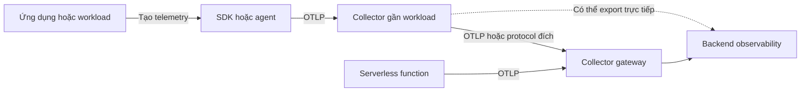

<Callout type="info" title="Mục tiêu của phần Triển khai">
  Phần này giúp bạn chuyển từ một pipeline chạy được sang một topology có thể vận hành. Hãy bắt đầu bằng câu hỏi workload nằm ở đâu, dữ liệu đi qua failure domain nào và ai sở hữu từng thành phần. Không có deployment model tốt nhất cho mọi hệ thống; lựa chọn tốt là lựa chọn làm rõ trade-off về độ trễ, độ tin cậy, bảo mật, chi phí và công sức vận hành.
</Callout>

## Mục lục

- [Mental model và đường đi của telemetry](#mental-model-và-đường-đi-của-telemetry)
  - [Vai trò của Collector](#vai-trò-của-collector)
  - [Locality và failure domain](#locality-và-failure-domain)
- [Cách chọn deployment model](#cách-chọn-deployment-model)
  - [Direct export](#direct-export)
  - [Agent sidecar và DaemonSet](#agent-sidecar-và-daemonset)
  - [Gateway tập trung](#gateway-tập-trung)
  - [Topology kết hợp](#topology-kết-hợp)
  - [Operator là lớp quản lý](#operator-là-lớp-quản-lý)
- [Lộ trình học trong nhóm Triển khai](#lộ-trình-học-trong-nhóm-triển-khai)
  - [Bước 1 Chạy local bằng Docker](#bước-1-chạy-local-bằng-docker)
  - [Bước 2 Đưa pipeline vào Kubernetes](#bước-2-đưa-pipeline-vào-kubernetes)
  - [Bước 3 So sánh agent sidecar và gateway](#bước-3-so-sánh-agent-sidecar-và-gateway)
  - [Bước 4 Quản lý bằng OpenTelemetry Operator](#bước-4-quản-lý-bằng-opentelemetry-operator)
  - [Bước 5 Xử lý runtime serverless](#bước-5-xử-lý-runtime-serverless)
  - [Bước 6 Hoàn thiện networking và TLS](#bước-6-hoàn-thiện-networking-và-tls)
- [Checklist trước production](#checklist-trước-production)
  - [Kiến trúc và đường đi dữ liệu](#kiến-trúc-và-đường-đi-dữ-liệu)
  - [Reliability và backpressure](#reliability-và-backpressure)
  - [Security và dữ liệu nhạy cảm](#security-và-dữ-liệu-nhạy-cảm)
  - [Capacity và chi phí](#capacity-và-chi-phí)
  - [Operability và lifecycle](#operability-và-lifecycle)
- [Cách kiểm chứng rollout](#cách-kiểm-chứng-rollout)
  - [Smoke test](#smoke-test)
  - [Canary và rollback](#canary-và-rollback)
- [Các bài trong nhóm Triển khai](#các-bài-trong-nhóm-triển-khai)
- [Tiếp theo](#tiếp-theo)

## Mental model và đường đi của telemetry

Một deployment OpenTelemetry có thể được nhìn như một đường đi gồm bốn lớp:

### Vai trò của Collector

[OpenTelemetry Collector](/collector/) là một service trung gian nhận, xử lý và export telemetry. Trong một pipeline, **receiver** nhận dữ liệu, **processor** biến đổi hoặc áp dụng policy, còn **exporter** gửi dữ liệu đến backend. `service.pipelines` nối các thành phần này thành đường xử lý cho từng signal.

Collector không tạo ra instrumentation cho business logic và cũng không phải nơi lưu trữ để truy vấn trace. Ứng dụng vẫn cần SDK, agent hoặc instrumentation library để tạo telemetry. Backend vẫn chịu trách nhiệm lưu trữ, truy vấn, trực quan hóa và cảnh báo.

Collector là tùy chọn về mặt kiến trúc. Ứng dụng có thể export trực tiếp đến backend nếu quy mô và yêu cầu vận hành cho phép. Collector trở nên có giá trị khi bạn cần gom nhiều nguồn, áp dụng policy chung, che giấu credential backend, đổi đích export hoặc kiểm soát lưu lượng ở một lớp riêng.

### Locality và failure domain

**Locality** là vị trí tương đối của các thành phần: cùng process, cùng pod, cùng node, cùng cluster hay khác network. **Failure domain** là phạm vi bị ảnh hưởng khi một thành phần hoặc hạ tầng gặp lỗi. Hai khái niệm này giúp biến một sơ đồ đẹp thành một quyết định vận hành cụ thể.

Ví dụ, sidecar ở cùng pod với ứng dụng có locality thấp và dễ cô lập theo workload. Đổi lại, mỗi pod có thêm một Collector cần CPU, memory và cấu hình. Gateway gom nhiều workload vào một Deployment, nên policy tập trung hơn. Đổi lại, network đến gateway và năng lực gateway trở thành dependency chung.

Hãy trả lời ba câu hỏi trước khi chọn topology:

1. Telemetry có cần rời khỏi host hoặc cluster trước khi được batch, lọc hay làm giàu không?
2. Khi backend chậm hoặc mất kết nối, workload có được phép bị ảnh hưởng không?
3. Ai sẽ sở hữu image, cấu hình, certificate, scaling và quá trình nâng cấp của Collector?

Nói ngắn gọn: đặt Collector gần nơi cần cô lập hoặc giảm traffic; đặt gateway ở nơi cần policy chung và kiểm soát tập trung.

## Cách chọn deployment model

Các tên **agent**, **gateway**, **sidecar** và **DaemonSet** mô tả vai trò hoặc cách đặt instance. Chúng không phải protocol mới. Cùng một Collector binary có thể đảm nhiệm vai trò khác nhau tùy cấu hình và vị trí chạy.

| Model | Vị trí thường gặp | Điểm mạnh | Trade-off cần chấp nhận |
| --- | --- | --- | --- |
| Direct export | Ứng dụng gửi thẳng đến backend hoặc managed endpoint | Ít thành phần, dễ bắt đầu | Ứng dụng giữ endpoint và credential; policy bị phân tán |
| Sidecar | Một Collector trong mỗi pod hoặc task | Cô lập theo workload, đường đi ngắn | Tốn tài nguyên và số instance tăng theo workload |
| DaemonSet agent | Một Collector trên mỗi node | Chia sẻ agent cho các pod trên node, phù hợp log hoặc host telemetry | Failure domain là node; cần kiểm soát routing và tải trên node |
| Gateway | Collector chạy như Deployment hoặc service tập trung | Policy, credential và export tập trung; dễ tách khỏi ứng dụng | Phụ thuộc network; cần scale, HA và bảo vệ gateway |
| Kết hợp | Agent hoặc sidecar gửi về gateway | Tách collection tại nguồn khỏi export tập trung | Nhiều hop, nhiều điểm cần quan sát và nhiều cấu hình hơn |

### Direct export

Direct export phù hợp cho PoC, một service nhỏ hoặc runtime nơi không thể chạy process Collector lâu dài. Nó có đường đi ngắn nên dễ kiểm tra: ứng dụng tạo telemetry rồi gửi đến endpoint đích.

Đổi lại, mỗi ứng dụng phải biết endpoint, authentication, retry và policy export. Khi đổi backend hoặc thay certificate, bạn có thể phải triển khai lại nhiều workload. Hãy chọn model này khi sự đơn giản quan trọng hơn việc tập trung policy và khi backend cung cấp một endpoint đáng tin cậy.

### Agent sidecar và DaemonSet

Agent là lớp Collector gần nguồn dữ liệu. [Sidecar và DaemonSet](/deployment/sidecar-daemonset/) là hai cách triển khai agent thường gặp nhưng có failure domain khác nhau:

- **Sidecar** dành cho isolation theo pod. Một workload có thể có cấu hình và quyền gửi riêng, nhưng chi phí tài nguyên và số bản sao tăng theo số pod.
- **DaemonSet** dành cho locality theo node. Nhiều pod dùng chung agent, thường hợp với log, host metrics hoặc telemetry đã có đường thu thập trên node. Khi node gặp lỗi, các workload dùng agent đó cùng mất đường thu thập tại chỗ.

Đừng chọn sidecar chỉ vì nó “gần” ứng dụng. Hãy tính overhead trên mỗi pod, giới hạn tài nguyên, cách inject cấu hình và hành vi khi Collector sidecar restart. Tương tự, đừng dùng DaemonSet mặc định cho mọi signal nếu một agent trên node sẽ trở thành nút nghẽn hoặc khiến dữ liệu của các tenant trộn vào nhau.

### Gateway tập trung

[Agent và gateway](/deployment/agent-gateway/) giải thích topology trong đó agent nhận telemetry ở gần nguồn rồi chuyển đến gateway. Gateway có thể chuẩn hóa resource, áp dụng sampling hoặc routing, quản lý credential backend và gom export ra ngoài cluster.

Gateway là lựa chọn hợp lý khi nhiều workload cần cùng một policy hoặc backend nằm ngoài trust boundary của ứng dụng. Nó cũng làm rõ ownership: team platform quản lý gateway, còn team ứng dụng chỉ cần biết endpoint nội bộ và contract telemetry.

Tập trung không có nghĩa là chỉ chạy một replica. Nếu gateway là đường duy nhất, hãy thiết kế số replica, load balancing, rolling upgrade, queue và capacity theo mức mất mát dữ liệu chấp nhận được. Khi gateway không khả dụng, phải biết agent sẽ retry, buffer, drop hay tạo backpressure; hành vi này phụ thuộc cấu hình và exporter, không nên đoán.

### Topology kết hợp

Topology kết hợp thường là điểm cân bằng cho production:

1. Ứng dụng export đến agent local để giảm coupling với backend.
2. Agent batch, giới hạn memory và chuyển telemetry qua một endpoint nội bộ.
3. Gateway xử lý policy chung, authentication và export ra backend.

Mỗi hop thêm một nơi có thể retry, timeout hoặc drop dữ liệu. Vì vậy, hãy ghi rõ signal đi qua hop nào, metric nào dùng để quan sát hop đó và ai chịu trách nhiệm khi hop bị lỗi. Nếu một hop không có mục đích rõ ràng, bỏ nó khỏi topology.

### Operator là lớp quản lý

[OpenTelemetry Operator](/deployment/operator/) là lớp quản lý Kubernetes cho Collector và các tài nguyên liên quan, bao gồm pattern auto-instrumentation được Operator hỗ trợ. Operator giúp mô tả desired state bằng resource Kubernetes và tự động hóa lifecycle; nó không tự quyết định topology phù hợp cho workload.

Bạn vẫn cần chọn Collector chạy như Deployment, DaemonSet hoặc pattern phù hợp khác, rồi xác định receiver, pipeline, endpoint và quyền truy cập. Hãy xem Operator như công cụ quản lý cấu hình và vòng đời, không phải một deployment model thay thế các model bên trên.

## Lộ trình học trong nhóm Triển khai

Đi theo thứ tự dưới đây nếu bạn mới đưa OTel từ local lên runtime thật. Ở mỗi bước, hãy giữ lại một fixture telemetry và một cách kiểm chứng. Khi topology thay đổi, fixture đó giúp phân biệt lỗi deployment với lỗi instrumentation.

### Bước 1 Chạy local bằng Docker

Bắt đầu với [Docker](/deployment/docker/). Dựng một ứng dụng instrumented, một Collector và backend tối thiểu. Mục tiêu không phải mô phỏng production mà là nhìn thấy trọn đường đi của một trace hoặc metric.

**Checkpoint:** bạn chỉ ra được endpoint ứng dụng export đến, receiver nhận dữ liệu và backend hiển thị dữ liệu ở đâu. Nếu chưa làm được, hãy đọc lại [Telemetry pipeline](/fundamentals/telemetry-pipeline/) trước khi thêm Kubernetes.

### Bước 2 Đưa pipeline vào Kubernetes

Tiếp tục với [Kubernetes](/deployment/kubernetes/). Tập trung vào ConfigMap hoặc Secret, Service, probes, resource requests và limits, namespace, service account và cách expose endpoint nội bộ.

**Checkpoint:** bạn có thể trả lời Collector đang chạy ở pod nào, nhận traffic từ đâu, restart như thế nào và config được cập nhật ra sao. Chưa cần tối ưu topology nhiều tầng ở bước này.

### Bước 3 So sánh agent sidecar và gateway

Đọc [Agent và gateway](/deployment/agent-gateway/) rồi [Sidecar và DaemonSet](/deployment/sidecar-daemonset/). Vẽ ít nhất hai topology cho cùng một workload và ghi rõ locality, failure domain, network hop, credential owner và cách scale.

**Checkpoint:** bạn giải thích được vì sao chọn sidecar, DaemonSet, gateway hoặc kết hợp. Lý do phải gắn với workload và SLO, không chỉ với thói quen triển khai.

### Bước 4 Quản lý bằng OpenTelemetry Operator

Khi đã hiểu các resource Kubernetes cơ bản, học [OpenTelemetry Operator](/deployment/operator/). Bắt đầu từ lifecycle của Collector, sau đó mới xem auto-instrumentation. Kiểm tra phiên bản Operator, CRD, image Collector và quyền mà cluster policy cho phép.

**Checkpoint:** một thay đổi resource tạo ra thay đổi dự kiến ở Collector hoặc workload; bạn biết cách xem events, status và log khi reconciliation không thành công.

### Bước 5 Xử lý runtime serverless

Đọc [Serverless](/deployment/serverless/). Function hoặc managed runtime thường không phù hợp với giả định “có một process Collector chạy liên tục bên cạnh ứng dụng”. Invocation có thể bị freeze hoặc kết thúc nhanh, nên việc flush, timeout, retry và giới hạn payload cần được kiểm chứng theo runtime cụ thể.

**Checkpoint:** bạn biết telemetry được gửi trực tiếp hay qua endpoint ngoài, lúc nào buffer được xả và điều gì xảy ra khi invocation kết thúc. Không suy luận behavior từ Docker hoặc Kubernetes sang serverless.

### Bước 6 Hoàn thiện networking và TLS

Kết thúc với [Networking và TLS](/deployment/networking-tls/). Kiểm tra DNS, route, firewall, port, certificate chain, hostname verification, mTLS nếu cần và quyền đọc Secret.

OTLP/gRPC thường dùng port `4317` và OTLP/HTTP thường dùng `4318`, nhưng đây là convention chứ không phải lý do để bỏ qua cấu hình thực tế. Hãy xác nhận endpoint, protocol và TLS mode ở cả phía gửi lẫn phía nhận.

**Checkpoint:** bạn có một test kết nối có chủ đích, biết certificate nào được trust và có thể phân biệt lỗi DNS, TCP, TLS, authentication với lỗi pipeline.

## Checklist trước production

Dùng checklist này khi review topology. Một mục “đã cấu hình” chưa đủ; hãy ghi thêm bằng chứng kiểm chứng và owner của mục đó.

### Kiến trúc và đường đi dữ liệu

- [ ] Liệt kê signal cần thu, nguồn phát, receiver, processor, exporter và backend cho từng pipeline.
- [ ] Vẽ đường đi của telemetry, gồm cả hop ngoài cluster, load balancer và trust boundary.
- [ ] Ghi rõ Collector nào là agent, Collector nào là gateway và failure domain của từng instance.
- [ ] Kiểm tra distribution chứa đúng component và version; validate config bằng chính binary hoặc image sẽ chạy.
- [ ] Xác định behavior khi Collector, network hoặc backend không khả dụng: retry, buffer, drop hay backpressure.

### Reliability và backpressure

**Backpressure** là tình huống downstream xử lý chậm hơn tốc độ upstream gửi dữ liệu. Nếu không định nghĩa behavior, một đợt backend chậm có thể làm đầy memory của Collector hoặc ảnh hưởng ứng dụng.

- [ ] Đặt giới hạn memory và CPU phù hợp; cấu hình cơ chế bảo vệ memory cho Collector.
- [ ] Dùng batching và timeout có chủ đích; kiểm tra queue hoặc retry của exporter nếu topology cần chịu outage ngắn.
- [ ] Đo `accepted`, `refused`, `send failures`, queue, latency export, CPU và memory theo signal.
- [ ] Kiểm tra graceful shutdown, rolling upgrade và việc flush dữ liệu trong thời gian termination cho phép.
- [ ] Nếu gateway là dependency chung, kiểm tra nhiều replica, phân phối tải và khả năng mất một replica hoặc một node.

<Callout type="warn" title="Đừng hứa hẹn không mất dữ liệu nếu chưa test">
  Retry và queue chỉ thay đổi xác suất hoặc thời gian giữ dữ liệu; chúng không biến một pipeline thành hệ thống lưu trữ bền vững trong mọi outage. Hãy thử tắt backend trong thời gian dự kiến, đo dữ liệu bị mất và ghi rõ giới hạn trong runbook.
</Callout>

### Security và dữ liệu nhạy cảm

- [ ] Mã hóa traffic qua network bằng TLS; dùng mTLS khi cần xác thực hai chiều giữa các boundary.
- [ ] Xác minh hostname, certificate chain và thời hạn certificate; không tắt verification để “sửa nhanh” lỗi TLS.
- [ ] Lưu credential trong Secret hoặc secret manager, cấp quyền tối thiểu và có kế hoạch rotation.
- [ ] Không expose receiver ra public network nếu không cần; giới hạn source bằng network policy hoặc firewall.
- [ ] Xác định PII hoặc secret có thể xuất hiện trong attribute, log và event; lọc hoặc redact trước khi export.
- [ ] Tránh đưa identifier có cardinality cao vào metric nếu không có lý do vận hành rõ ràng.

### Capacity và chi phí

- [ ] Ước tính số service, request, span, log record và metric point ở tải bình thường lẫn peak.
- [ ] Load test topology với đủ signal và exporter thật hoặc test double gần tương đương.
- [ ] Đo tác động của sampling, batch, filter và transform lên volume, latency và khả năng điều tra.
- [ ] Đặt budget cho ingest, lưu trữ và egress; kiểm tra chi phí khi cardinality hoặc traffic tăng.
- [ ] So sánh overhead của sidecar, DaemonSet và gateway bằng số instance, CPU, memory và network hop thực tế.

### Operability và lifecycle

- [ ] Có health, readiness và metrics để biết Collector đang sống, nhận dữ liệu và export thành công.
- [ ] Pin image bằng version đã duyệt, tốt hơn nữa là digest; lưu config và thay đổi version trong version control.
- [ ] Có CI cho syntax validation, component inventory, smoke test, load test và security scan.
- [ ] Có canary, rollback nguyên tử và runbook cho no data, export failure, memory pressure, certificate hết hạn và config sai.
- [ ] Theo dõi deprecation, stability level và compatibility của Collector, Operator, exporter và backend trước khi nâng cấp.
- [ ] Xác định owner, on-call, retention, quyền truy vấn và quy trình xử lý telemetry có dữ liệu nhạy cảm.

## Cách kiểm chứng rollout

### Smoke test

Thực hiện smoke test sau khi triển khai mới hoặc thay đổi endpoint:

1. Gửi một request fixture có trace ID dễ nhận diện.
2. Kiểm tra ứng dụng hoặc agent đã export thành công, không chỉ kiểm tra log “started”.
3. Kiểm tra Collector nhận record, xử lý đúng pipeline và không có refused data hoặc export error.
4. Truy vấn backend bằng trace ID hoặc thời gian gửi, rồi đối chiếu service name, resource và timestamp.
5. Ghi lại kết quả cho cả trường hợp backend chậm hoặc endpoint sai để biết alert và runbook có hoạt động không.

Một smoke test tốt kiểm tra cả đường đi và dữ liệu. Collector khởi động thành công chỉ chứng minh config parse được; nó không chứng minh receiver reachable, exporter được xác thực hoặc backend đã lưu record.

### Canary và rollback

Triển khai topology mới cho một workload hoặc một tỷ lệ nhỏ traffic trước. So sánh với baseline các chỉ số sau:

- tỷ lệ request lỗi và latency của workload;
- số record accepted, refused và send failure;
- queue size, retry, CPU, memory và restart của Collector;
- độ đầy đủ của trace, metric hoặc log tại backend;
- volume, cardinality và chi phí ingest.

Đặt ngưỡng dừng trước khi canary. Nếu vượt ngưỡng, quay về image, config và endpoint trước đó bằng một thay đổi nguyên tử. Sau rollback, xác minh dữ liệu mới không còn đi qua topology cũ và kiểm tra lại certificate hoặc queue tồn đọng.

## Các bài trong nhóm Triển khai

Các trang dưới đây đi từ cách chạy đơn giản đến các quyết định topology và network:

<Cards>
  <Card title="Docker" href="/deployment/docker/" description="Chạy Collector và ứng dụng instrumented trong local hoặc container." />
  <Card title="Kubernetes" href="/deployment/kubernetes/" description="Đưa telemetry pipeline vào cluster và quản lý các resource cần thiết." />
  <Card title="OpenTelemetry Operator" href="/deployment/operator/" description="Quản lý Collector và auto-instrumentation bằng resource Kubernetes." />
  <Card title="Agent và gateway" href="/deployment/agent-gateway/" description="So sánh topology local, gateway và mô hình kết hợp." />
  <Card title="Sidecar và DaemonSet" href="/deployment/sidecar-daemonset/" description="Chọn failure domain và mức cô lập phù hợp với workload." />
  <Card title="Serverless" href="/deployment/serverless/" description="Thiết kế export trong function hoặc managed runtime có vòng đời ngắn." />
  <Card title="Networking và TLS" href="/deployment/networking-tls/" description="Kiểm tra endpoint, firewall, certificate và mTLS cho telemetry." />
</Cards>

## Tiếp theo

Nếu bạn chưa có pipeline chạy được, bắt đầu từ [Local observability stack](/getting-started/local-stack/) rồi quay lại [Docker](/deployment/docker/). Nếu đã có Collector, đọc [Tổng quan Collector](/collector/overview/) và [Cấu hình Collector](/collector/configuration/) để nối lựa chọn topology với component thực tế.

Sau khi chọn được deployment model, hãy chuyển sang [Production](/production/) để kiểm tra reliability, security, performance và cost. Khi có lỗi, dùng [Troubleshooting](/troubleshooting/) và quay lại đúng chặng đầu tiên làm mất hoặc làm sai telemetry thay vì thay đổi nhiều thành phần cùng lúc.
