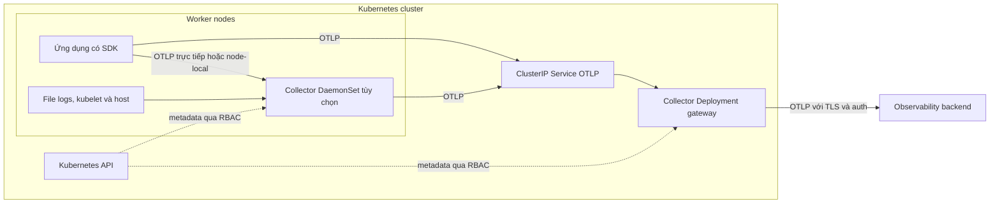

import { Step, Steps } from 'fumadocs-ui/components/steps';

<Callout type="info" title="Phạm vi và phiên bản">
  Trang này tập trung vào data plane telemetry trong Kubernetes: ứng dụng, Service,
  OpenTelemetry Collector và backend. Manifest thực hành pin image
  `otel/opentelemetry-collector-k8s:0.157.0`, phiên bản đã được đối chiếu với
  distribution upstream. Khi nâng phiên bản, hãy kiểm tra `components`, release
  notes và validate lại cấu hình trước khi rollout.
</Callout>

## Mục lục

- [Mental model Kubernetes telemetry](#mental-model-kubernetes-telemetry)
  - [Bốn lớp dữ liệu](#bốn-lớp-dữ-liệu)
  - [Luồng telemetry](#luồng-telemetry)
- [Chọn kiểu triển khai Collector](#chọn-kiểu-triển-khai-collector)
  - [Deployment gateway](#deployment-gateway)
  - [DaemonSet agent](#daemonset-agent)
  - [Sidecar](#sidecar)
  - [StatefulSet và Operator](#statefulset-và-operator)
- [Namespace, RBAC và cấu hình](#namespace-rbac-và-cấu-hình)
  - [Ranh giới namespace và RBAC](#ranh-giới-namespace-và-rbac)
  - [ConfigMap, Secret và NetworkPolicy](#configmap-secret-và-networkpolicy)
  - [Metadata Kubernetes](#metadata-kubernetes)
- [Ví dụ manifest chạy được](#ví-dụ-manifest-chạy-được)
  - [Những gì ví dụ tạo ra](#những-gì-ví-dụ-tạo-ra)
  - [Triển khai từng bước](#triển-khai-từng-bước)
- [OTLP service discovery](#otlp-service-discovery)
  - [Trong cùng namespace và khác namespace](#trong-cùng-namespace-và-khác-namespace)
  - [Chọn OTLP gRPC hay OTLP HTTP](#chọn-otlp-grpc-hay-otlp-http)
  - [DaemonSet và địa chỉ node-local](#daemonset-và-địa-chỉ-node-local)
- [Tài nguyên và probes](#tài-nguyên-và-probes)
  - [Requests, limits và memory limiter](#requests-limits-và-memory-limiter)
  - [Readiness, liveness và shutdown](#readiness-liveness-và-shutdown)
- [Scaling và tính sẵn sàng](#scaling-và-tính-sẵn-sàng)
  - [Gateway stateless](#gateway-stateless)
  - [Scraper và component có trạng thái](#scraper-và-component-có-trạng-thái)
  - [Rolling update và disruption](#rolling-update-và-disruption)
- [Xác minh end-to-end](#xác-minh-end-to-end)
  - [Kiểm tra Kubernetes objects](#kiểm-tra-kubernetes-objects)
  - [Gửi telemetry canary](#gửi-telemetry-canary)
  - [Đọc internal telemetry](#đọc-internal-telemetry)
- [Troubleshooting và failure modes](#troubleshooting-và-failure-modes)
  - [Quy trình khoanh vùng](#quy-trình-khoanh-vùng)
  - [Bảng triệu chứng](#bảng-triệu-chứng)
- [Checklist production](#checklist-production)
- [Nguồn chính thức và bài liên quan](#nguồn-chính-thức-và-bài-liên-quan)

## Mental model Kubernetes telemetry

Kubernetes không tự tạo một “luồng observability” hoàn chỉnh. Cluster chỉ cung
cấp scheduler, API, DNS, networking và lifecycle cho workload. Ứng dụng vẫn phải
được instrument để tạo traces, metrics hoặc logs. Collector nhận các signal đó,
bổ sung context Kubernetes và chuyển chúng tới backend.

### Bốn lớp dữ liệu

Phân biệt bốn lớp giúp tránh thu thập trùng hoặc đặt Collector sai vị trí:

| Lớp | Ví dụ | Cách thu thường dùng |
| --- | --- | --- |
| Telemetry ứng dụng | Span HTTP, business metric, structured log | SDK đẩy OTLP tới Collector |
| Telemetry workload | Pod phase, restart, resource request | Kubernetes API receiver hoặc hệ thống cluster metrics |
| Telemetry node | CPU node, kubelet/pod/container stats, file log | DaemonSet với `kubeletstats`, `host_metrics`, `filelog` |
| Telemetry của Collector | Accepted/refused items, queue, export errors, RSS | Internal metrics ở cổng `8888` và log của Collector |

Một trace ứng dụng và metric CPU pod là hai nguồn khác nhau. Processor
`k8s_attributes` chỉ **enrich** telemetry bằng resource attributes như
`k8s.namespace.name` và `k8s.pod.uid`; nó không thay thế receiver thu kubelet
metrics hoặc Kubernetes events.

### Luồng telemetry

Topology thực tế thường kết hợp agent theo node và gateway theo cluster. Không
cần triển khai cả hai tầng nếu một gateway đơn giản đã đáp ứng yêu cầu.



Đường push OTLP và đường pull Kubernetes API có failure mode khác nhau. Service
hoặc gateway hỏng làm client push bị timeout. Kubernetes API chậm có thể khiến
enrichment thiếu metadata dù OTLP receiver vẫn nhận được dữ liệu.

## Chọn kiểu triển khai Collector

Collector **agent** và **gateway** là vai trò, không phải hai binary khác nhau.
Chọn controller Kubernetes theo locality, state và failure domain cần có.

| Kiểu | Phù hợp nhất | Lợi ích | Chi phí hoặc rủi ro |
| --- | --- | --- | --- |
| `Deployment` | Gateway nhận OTLP tập trung | Service ổn định, rollout và HPA đơn giản | Thêm network hop; có thể thành bottleneck chung |
| `DaemonSet` | File logs, kubelet/host metrics, agent node-local | Một pod mỗi node, truy cập dữ liệu node | Tốn tài nguyên trên mọi node; không dùng HPA |
| Sidecar | Isolation và localhost theo workload | Failure domain theo pod, không cần Service cho app → Collector | Tăng CPU/RAM và số kết nối theo từng pod |
| `StatefulSet` | Stable identity hoặc persistent queue | Tên pod/PVC ổn định | Không tự giải quyết sharding hoặc state consistency |
| Operator | CRD, sidecar/auto-instrumentation, Target Allocator | Tự động hóa lifecycle và scrape allocation | Thêm controller, CRD và quy trình upgrade |

### Deployment gateway

Dùng `Deployment` khi ứng dụng gửi OTLP tới một endpoint chung trong cluster.
Bắt đầu với ít nhất hai replica nếu gateway nằm trên đường dữ liệu production.
Dùng anti-affinity hoặc topology spread để tránh đặt tất cả replica trên cùng
node hoặc zone.

Gateway phù hợp cho credential backend, redaction, routing và policy chung.
Không đặt mọi signal vào cùng một Deployment nếu logs có lưu lượng lớn và failure
budget khác traces. Tách workload Collector theo signal tạo scaling và failure
domain rõ hơn.

### DaemonSet agent

Dùng `DaemonSet` khi dữ liệu chỉ tồn tại trên node. `filelog` phải đọc
`/var/log/pods`; `kubeletstats` gọi kubelet của node; `host_metrics` cần mount
host filesystem. Một Deployment ngẫu nhiên chỉ nhìn thấy node mà pod của nó đang
chạy và không thể thay thế DaemonSet cho các use case này.

Với `k8s_attributes` trên agent, inject `spec.nodeName` bằng Downward API và đặt
`filter.node_from_env_var`. Mỗi agent khi đó chỉ cache pod trên node của nó, giảm
RAM và tải lên Kubernetes API trong cluster lớn.

### Sidecar

Sidecar hợp lý khi workload cần endpoint `localhost`, isolation mạnh hoặc vòng
đời Collector phải đi cùng pod ứng dụng. Đổi lại, 500 pod tạo 500 Collector.
Hãy tính tổng request CPU/RAM, số kết nối backend và chi phí rollout trước khi
chọn.

Không dùng sidecar như lựa chọn mặc định để đọc toàn bộ node logs. Sidecar chỉ
thấy volume được mount vào chính pod của nó.

### StatefulSet và Operator

`StatefulSet` cung cấp identity và volume ổn định, nhưng không làm một component
có state trở thành distributed component. Tail sampling vẫn cần mọi span cùng
`trace_id` đến cùng replica. Prometheus scraping vẫn cần chia target để tránh
mỗi replica scrape lại toàn bộ target.

Dùng [OpenTelemetry Operator](/deployment/operator/) khi cần sidecar injection,
Collector custom resource hoặc Target Allocator cho Prometheus receiver. Không
cài Operator chỉ để chạy một gateway tĩnh; Helm hoặc manifest có thể đơn giản
hơn.

## Namespace, RBAC và cấu hình

### Ranh giới namespace và RBAC

Namespace nhóm và áp policy cho resource, nhưng không tự giới hạn quyền của
`ClusterRole`. Gateway cần enrich pod từ nhiều namespace thường phải dùng một
ServiceAccount riêng cùng quyền `get`, `list`, `watch` trên `pods` và
`namespaces`. Chỉ cấp thêm `replicasets`, `deployments`, `nodes`, `jobs` hoặc
resource khác khi metadata/receiver thực sự cần chúng.

Nếu Collector chỉ theo dõi một namespace, có thể dùng `Role` và `RoleBinding`
kèm `k8s_attributes.filter.namespace`. Đổi lại, Collector không đọc được object
cluster-scoped như `nodes`, và không thể lấy metadata namespace khác. Hãy kiểm
tra quyền từ đúng ServiceAccount:

```bash
kubectl auth can-i list pods \
  --all-namespaces \
  --as=system:serviceaccount:observability:otel-collector
```

<Callout type="warn" title="RBAC tối thiểu theo component">
  Không sao chép một ClusterRole “toàn quyền cho observability”. `filelog` không
  cần Kubernetes API; `k8s_attributes`, `kubeletstats`, `k8s_cluster` và
  `k8sobjects` cần các rule khác nhau. Review README đúng release của từng
  component và theo dõi lỗi `403 Forbidden` sau rollout.
</Callout>

### ConfigMap, Secret và NetworkPolicy

Đặt pipeline không nhạy cảm trong `ConfigMap`. Không đặt token backend, private
key hoặc password ở đó. Mount `Secret` read-only, dùng external secret manager
hoặc workload identity rồi tham chiếu file/biến môi trường trong exporter.

Thay đổi `ConfigMap` không bảo đảm Collector tự reload. Với manifest thuần, quy
trình an toàn là validate cấu hình, cập nhật ConfigMap rồi chạy rolling restart:

```bash
kubectl rollout restart deployment/otel-collector -n observability
kubectl rollout status deployment/otel-collector -n observability
```

Dùng `NetworkPolicy` để chỉ cho namespace/workload được phép gọi `4317` và
`4318`. Egress cần cho Kubernetes API, DNS và backend. Không áp default-deny rồi
mở egress `0.0.0.0/0` chỉ để làm Collector chạy lại; hãy xác định endpoint và
trust boundary cụ thể.

### Metadata Kubernetes

`k8s_attributes` watch Kubernetes API, cache pod metadata rồi liên kết telemetry
với pod. Association theo IP của kết nối phù hợp khi ứng dụng gửi trực tiếp.
Proxy, mesh, agent trung gian hoặc NAT có thể làm Collector chỉ thấy IP của hop
gần nhất.

Đặt association bằng resource attribute trước, connection sau:

```yaml
processors:
  k8s_attributes:
    auth_type: serviceAccount
    pod_association:
      - sources:
          - from: resource_attribute
            name: k8s.pod.uid
      - sources:
          - from: resource_attribute
            name: k8s.pod.ip
      - sources:
          - from: connection
```

SDK hoặc agent phía trước nên gửi `k8s.pod.uid`/`k8s.pod.ip` khi traffic qua
proxy. Nếu dựa vào connection, đặt `k8s_attributes` trước `batch` hoặc tail
sampling vì các bước đó có thể làm mất connection context. Chỉ allowlist labels
và annotations có cardinality hữu hạn; không extract tất cả một cách mặc định.

## Ví dụ manifest chạy được

Ví dụ dưới đây tạo gateway lab gồm hai replica trong namespace `observability`.
Nó nhận traces, metrics và logs qua OTLP/gRPC hoặc OTLP/HTTP, enrich metadata
Kubernetes rồi in payload bằng `debug` exporter.

<Callout type="warn" title="Lab chạy được, chưa phải backend production">
  `debug` với `verbosity: detailed` có thể ghi PII và tạo nhiều I/O. Listener
  OTLP trong ví dụ dùng plaintext nội bộ. Trước production, thay `debug` bằng
  exporter backend có queue/retry, mount credential từ Secret, bật TLS/auth và
  áp NetworkPolicy.
</Callout>

### Những gì ví dụ tạo ra

- `Namespace`, ServiceAccount và RBAC chỉ đọc metadata cần cho processor.
- `ConfigMap` chứa pipeline đủ ba signal.
- `Deployment` có hai replica, security context, resource request/limit và ba
  loại probe.
- `ClusterIP Service` cung cấp DNS ổn định cho OTLP/gRPC `4317` và OTLP/HTTP
  `4318`.
- Internal metrics của từng Collector listen ở `8888`, không được publish qua
  Service công khai.

```yaml title="otel-collector-k8s.yaml"
apiVersion: v1
kind: Namespace
metadata:
  name: observability
---
apiVersion: v1
kind: ServiceAccount
metadata:
  name: otel-collector
  namespace: observability
automountServiceAccountToken: true
---
apiVersion: rbac.authorization.k8s.io/v1
kind: ClusterRole
metadata:
  name: otel-collector-k8s-attributes
rules:
  - apiGroups: [""]
    resources: ["pods", "namespaces"]
    verbs: ["get", "list", "watch"]
  - apiGroups: ["apps"]
    resources: ["replicasets"]
    verbs: ["get", "list", "watch"]
---
apiVersion: rbac.authorization.k8s.io/v1
kind: ClusterRoleBinding
metadata:
  name: otel-collector-k8s-attributes
roleRef:
  apiGroup: rbac.authorization.k8s.io
  kind: ClusterRole
  name: otel-collector-k8s-attributes
subjects:
  - kind: ServiceAccount
    name: otel-collector
    namespace: observability
---
apiVersion: v1
kind: ConfigMap
metadata:
  name: otel-collector-config
  namespace: observability
data:
  collector.yaml: |
    receivers:
      otlp:
        protocols:
          grpc:
            endpoint: 0.0.0.0:4317
          http:
            endpoint: 0.0.0.0:4318

    processors:
      memory_limiter:
        check_interval: 1s
        limit_mib: 400
        spike_limit_mib: 80
      k8s_attributes:
        auth_type: serviceAccount
        wait_for_metadata: true
        wait_for_metadata_timeout: 30s
        extract:
          metadata:
            - k8s.namespace.name
            - k8s.pod.name
            - k8s.pod.uid
            - k8s.pod.start_time
            - k8s.deployment.name
            - k8s.node.name
        pod_association:
          - sources:
              - from: resource_attribute
                name: k8s.pod.uid
          - sources:
              - from: resource_attribute
                name: k8s.pod.ip
          - sources:
              - from: connection
      batch:
        timeout: 5s
        send_batch_size: 1024

    exporters:
      debug:
        verbosity: detailed

    extensions:
      health_check:
        endpoint: 0.0.0.0:13133

    service:
      extensions: [health_check]
      telemetry:
        metrics:
          level: normal
          readers:
            - pull:
                exporter:
                  prometheus:
                    host: 0.0.0.0
                    port: 8888
                    without_type_suffix: true
                    without_units: true
      pipelines:
        traces:
          receivers: [otlp]
          processors: [memory_limiter, k8s_attributes, batch]
          exporters: [debug]
        metrics:
          receivers: [otlp]
          processors: [memory_limiter, k8s_attributes, batch]
          exporters: [debug]
        logs:
          receivers: [otlp]
          processors: [memory_limiter, k8s_attributes, batch]
          exporters: [debug]
---
apiVersion: apps/v1
kind: Deployment
metadata:
  name: otel-collector
  namespace: observability
spec:
  replicas: 2
  strategy:
    type: RollingUpdate
    rollingUpdate:
      maxUnavailable: 0
      maxSurge: 1
  selector:
    matchLabels:
      app.kubernetes.io/name: otel-collector
  template:
    metadata:
      labels:
        app.kubernetes.io/name: otel-collector
    spec:
      serviceAccountName: otel-collector
      terminationGracePeriodSeconds: 30
      securityContext:
        seccompProfile:
          type: RuntimeDefault
      containers:
        - name: collector
          image: otel/opentelemetry-collector-k8s:0.157.0
          imagePullPolicy: IfNotPresent
          args: ["--config=/conf/collector.yaml"]
          env:
            - name: GOMEMLIMIT
              value: 400MiB
          ports:
            - name: otlp-grpc
              containerPort: 4317
            - name: otlp-http
              containerPort: 4318
            - name: health
              containerPort: 13133
            - name: metrics
              containerPort: 8888
          resources:
            requests:
              cpu: 200m
              memory: 256Mi
            limits:
              cpu: "1"
              memory: 512Mi
          securityContext:
            allowPrivilegeEscalation: false
            readOnlyRootFilesystem: true
            runAsNonRoot: true
            capabilities:
              drop: ["ALL"]
          startupProbe:
            httpGet:
              path: /
              port: health
            periodSeconds: 2
            failureThreshold: 30
          readinessProbe:
            httpGet:
              path: /
              port: health
            periodSeconds: 10
            timeoutSeconds: 2
            failureThreshold: 3
          livenessProbe:
            httpGet:
              path: /
              port: health
            periodSeconds: 10
            timeoutSeconds: 2
            failureThreshold: 3
          volumeMounts:
            - name: config
              mountPath: /conf
              readOnly: true
      volumes:
        - name: config
          configMap:
            name: otel-collector-config
---
apiVersion: v1
kind: Service
metadata:
  name: otel-collector
  namespace: observability
spec:
  type: ClusterIP
  selector:
    app.kubernetes.io/name: otel-collector
  ports:
    - name: otlp-grpc
      port: 4317
      targetPort: otlp-grpc
      appProtocol: grpc
    - name: otlp-http
      port: 4318
      targetPort: otlp-http
      appProtocol: http
```

### Triển khai từng bước

<Steps>
<Step>

**Lưu và kiểm tra manifest phía client**

Lưu block trên thành `otel-collector-k8s.yaml`. Kiểm tra schema mà không ghi
resource vào cluster:

```bash
kubectl apply --dry-run=client -f otel-collector-k8s.yaml
```

</Step>
<Step>

**Áp manifest và chờ rollout**

```bash
kubectl apply -f otel-collector-k8s.yaml
kubectl rollout status deployment/otel-collector -n observability --timeout=120s
```

</Step>
<Step>

**Xác nhận Service có endpoint sẵn sàng**

```bash
kubectl get pods,service,endpointslice -n observability
```

Service phải có EndpointSlice trỏ tới các pod `Ready`. Nếu EndpointSlice rỗng,
kiểm tra selector và probe trước khi kiểm tra SDK.

</Step>
</Steps>

## OTLP service discovery

### Trong cùng namespace và khác namespace

Kubernetes DNS tạo tên ổn định cho Service. Pod ở namespace `observability` có
thể gọi tên ngắn; pod ở namespace khác nên dùng tên có namespace hoặc FQDN:

```text
Cùng namespace:  otel-collector:4317
Khác namespace:  otel-collector.observability:4317
FQDN:             otel-collector.observability.svc.cluster.local:4317
```

Cấu hình SDK phổ biến cho OTLP/gRPC plaintext nội bộ:

```yaml
apiVersion: apps/v1
kind: Deployment
spec:
  template:
    spec:
      containers:
        - name: app
          env:
            - name: OTEL_EXPORTER_OTLP_PROTOCOL
              value: grpc
            - name: OTEL_EXPORTER_OTLP_ENDPOINT
              value: http://otel-collector.observability.svc.cluster.local:4317
```

Không dùng IP pod Collector trong cấu hình ứng dụng. IP thay đổi khi rollout;
Service DNS và ClusterIP là contract discovery ổn định.

### Chọn OTLP gRPC hay OTLP HTTP

| Transport | Endpoint SDK | Đặc điểm cần nhớ |
| --- | --- | --- |
| OTLP/gRPC | `http://otel-collector.observability.svc:4317` | HTTP/2, không thêm `/v1/traces`; kết nối thường sống lâu |
| OTLP/HTTP protobuf | `http://otel-collector.observability.svc:4318` | SDK gửi `POST` tới `/v1/traces`, `/v1/metrics`, `/v1/logs` |

Với OTLP/HTTP, đặt `OTEL_EXPORTER_OTLP_PROTOCOL=http/protobuf`. Một số SDK có
biến riêng theo signal và quy tắc nối path khác nhau; đối chiếu tài liệu SDK đang
dùng. `curl GET /v1/traces` không phải test OTLP hợp lệ vì endpoint cần `POST` với
payload protobuf hoặc JSON đúng encoding.

<Callout type="warn" title="ClusterIP không rebalance kết nối gRPC đang tồn tại">
  Kubernetes Service chọn backend khi kết nối được tạo. Một channel gRPC sống lâu
  có thể tiếp tục gửi vào một Collector dù Deployment đã có nhiều replica. Dùng
  agent làm tầng fan-in, cấu hình client reconnect phù hợp hoặc dùng load balancer
  hiểu gRPC khi cần phân phối đều; đừng đánh giá cân bằng tải chỉ bằng số replica.
</Callout>

### DaemonSet và địa chỉ node-local

Ứng dụng không tự khám phá “Collector trên cùng node” qua một ClusterIP Service.
Pattern node-local thường expose `hostPort: 4317` trên DaemonSet rồi inject
`status.hostIP` vào pod ứng dụng:

```yaml
- name: NODE_IP
  valueFrom:
    fieldRef:
      fieldPath: status.hostIP
- name: OTEL_EXPORTER_OTLP_ENDPOINT
  value: http://$(NODE_IP):4317
```

`$(NODE_IP)` chỉ được Kubernetes mở rộng khi biến tham chiếu đứng sau biến nguồn
trong cùng danh sách `env`. Pattern này cần NetworkPolicy/firewall phù hợp và
không thể dùng hai DaemonSet cùng chiếm một `hostPort` trên node. Một lựa chọn
khác là sidecar và endpoint `localhost`.

## Tài nguyên và probes

### Requests, limits và memory limiter

Ba lớp kiểm soát memory có vai trò khác nhau:

1. `resources.requests.memory` giúp scheduler đặt pod lên node có capacity.
2. `GOMEMLIMIT` hướng Go runtime thu gom rác trước khi chạm cgroup limit.
3. `memory_limiter` tạo backpressure trước khi container bị `OOMKilled`.

Trong manifest mẫu, `memory_limiter.limit_mib: 400` và `GOMEMLIMIT=400MiB` nằm
dưới container limit `512Mi`. Phần headroom còn lại dành cho non-heap memory,
spike, queue và runtime. Các số này chỉ là điểm bắt đầu cho lab; load test với
kích thước payload, batch, queue và backend latency thật trước production.

CPU request là mẫu số khi HPA dùng CPU utilization. Nếu thiếu request, HPA không
thể tính utilization đúng. CPU limit bảo vệ multi-tenant node nhưng có thể
throttle Collector đúng lúc tải tăng. Đo `container_cpu_cfs_throttled_*`, độ trễ
pipeline và queue trước khi siết limit quá thấp.

### Readiness, liveness và shutdown

- `startupProbe` cho Collector thời gian sync metadata trước khi liveness bắt đầu.
- `readinessProbe` loại pod khỏi EndpointSlice khi process chưa sẵn sàng nhận lưu
  lượng.
- `livenessProbe` restart process bị kẹt; không nên dùng nó để restart chỉ vì
  backend tạm thời lỗi.
- `terminationGracePeriodSeconds` cho Collector flush batch và queue khi nhận
  `SIGTERM`.

Health extension trả HTTP thành công không chứng minh backend nhận dữ liệu. Một
backend outage không nên làm mọi gateway `Unready`, vì khi đó SDK không còn
endpoint để gửi và queue không thể drain. Theo dõi export errors, queue và canary
end-to-end riêng.

## Scaling và tính sẵn sàng

### Gateway stateless

Gateway chỉ nhận OTLP, enrich, batch và export thường có thể scale ngang. Bắt đầu
từ capacity test, không từ một con số replica cố định. Theo dõi ít nhất:

- CPU, RSS và restart/OOM;
- `otelcol_receiver_refused_*`;
- `otelcol_exporter_queue_size` so với `otelcol_exporter_queue_capacity`;
- `otelcol_exporter_enqueue_failed_*` và `otelcol_exporter_send_failed_*`;
- accepted ở receiver so với sent ở exporter theo từng signal.

HPA có thể scale Deployment theo CPU sau khi đã đặt request:

```yaml title="otel-collector-hpa.yaml"
apiVersion: autoscaling/v2
kind: HorizontalPodAutoscaler
metadata:
  name: otel-collector
  namespace: observability
spec:
  scaleTargetRef:
    apiVersion: apps/v1
    kind: Deployment
    name: otel-collector
  minReplicas: 2
  maxReplicas: 10
  behavior:
    scaleDown:
      stabilizationWindowSeconds: 300
  metrics:
    - type: Resource
      resource:
        name: cpu
        target:
          type: Utilization
          averageUtilization: 70
```

HPA CPU cần Metrics Server hoặc resource metrics provider. CPU thấp không có
nghĩa pipeline khỏe: backend chậm có thể làm queue tăng trong khi exporter đang
chờ I/O. Khi có custom metrics adapter, queue saturation hoặc receive rate là
tín hiệu bổ sung tốt hơn. Nếu backend là bottleneck, thêm Collector chỉ tăng áp
lực lên backend; phải sửa đích hoặc giảm tải có chủ đích.

### Scraper và component có trạng thái

Không scale mọi pipeline bằng cách tăng replica:

- Prometheus receiver với cùng scrape config sẽ scrape trùng target. Shard thủ
  công hoặc dùng Operator Target Allocator.
- `k8s_cluster`/cluster-level receiver chạy lặp có thể tạo duplicate nếu không có
  leader election theo contract của deployment/chart.
- Tail sampling cần mọi span cùng trace đến cùng replica. Dùng tầng
  load-balancing exporter route theo `traceID` trước tầng sampling.
- Stateful aggregation như span metrics cần routing theo service và đánh giá
  temporality/single-writer.
- DaemonSet tăng theo số node; HPA không áp dụng cho DaemonSet.

Nói ngắn gọn: stateless OTLP ingress có thể scale bằng Service + replicas;
scraper cần phân target; stateful processor cần routing ổn định.

### Rolling update và disruption

Dùng `maxUnavailable: 0`, nhiều replica và topology spread để giữ endpoint trong
rollout. Thêm `PodDisruptionBudget` cho voluntary disruption, nhưng nhớ rằng PDB
không tạo capacity mới và không bảo vệ khỏi node crash.

Queue mặc định trong RAM mất khi pod bị kill. Nếu cần giữ backlog qua restart,
dùng `file_storage` với persistent volume và kiểm thử recovery. Persistent queue
vẫn không tạo exactly-once và không cứu được disk đầy hoặc lỗi vĩnh viễn. Với
scale-down, cho pod đủ grace period và quan sát queue drain trước khi giảm
replica.

## Xác minh end-to-end

### Kiểm tra Kubernetes objects

Kiểm tra từ control plane tới process:

```bash
kubectl get deployment/otel-collector -n observability
kubectl get pods -n observability -l app.kubernetes.io/name=otel-collector -o wide
kubectl get endpointslice -n observability \
  -l kubernetes.io/service-name=otel-collector
kubectl logs -n observability \
  -l app.kubernetes.io/name=otel-collector \
  --prefix --tail=100
```

Startup log không được có `unknown type`, lỗi parse config, bind port hoặc
`Forbidden`. Nếu distribution không có component, kiểm tra trực tiếp image:

```bash
docker run --rm otel/opentelemetry-collector-k8s:0.157.0 components
```

### Gửi telemetry canary

Tạo một pod `telemetrygen` gửi ba trace qua đúng Service DNS:

```bash
kubectl run telemetrygen \
  --namespace observability \
  --restart=Never \
  --image=ghcr.io/open-telemetry/opentelemetry-collector-contrib/telemetrygen:0.157.0 \
  -- traces \
  --otlp-endpoint=otel-collector.observability.svc.cluster.local:4317 \
  --otlp-insecure \
  --traces=3

kubectl wait pod/telemetrygen -n observability \
  --for=jsonpath='{.status.phase}'=Succeeded --timeout=90s

kubectl logs -n observability \
  -l app.kubernetes.io/name=otel-collector \
  --prefix --tail=300

kubectl delete pod/telemetrygen -n observability
```

Trong output `debug`, tìm spans của telemetrygen và các resource attributes
`k8s.namespace.name=observability`, `k8s.pod.name=telemetrygen`. Có dữ liệu ở
`debug` chỉ chứng minh receiver → processors → exporter debug. Khi thay bằng
backend thật, phải tìm cùng canary/trace ID ở backend.

### Đọc internal telemetry

Port-forward tới một pod cụ thể vì metric là trạng thái của từng Collector:

```bash
POD=$(kubectl get pod -n observability \
  -l app.kubernetes.io/name=otel-collector \
  -o jsonpath='{.items[0].metadata.name}')

kubectl port-forward -n observability "pod/${POD}" 8888:8888
```

Ở terminal khác:

```bash
curl --fail --show-error http://127.0.0.1:8888/metrics
```

Đối chiếu accepted, refused, sent, failed và queue theo signal/component. Metric
names có thể đổi theo Collector version hoặc Prometheus suffix; pin dashboard
với release đang chạy thay vì giả định tên vĩnh viễn.

## Troubleshooting và failure modes

### Quy trình khoanh vùng

Khoanh vùng theo thứ tự, không bắt đầu bằng việc restart ngẫu nhiên:

1. **SDK:** có tạo signal, dùng đúng OTLP protocol, scheme, port và path không?
2. **DNS/Service:** tên có resolve từ pod ứng dụng, Service có EndpointSlice
   `Ready` không?
3. **Receiver:** Collector có listen và accepted counter có tăng không?
4. **Processor:** metadata có match pod; filter/memory limiter có drop/refuse
   không?
5. **Exporter:** DNS, TLS, auth, retry và queue tới backend có khỏe không?
6. **Backend:** tenant, retention, query time range và resource filter có đúng
   không?

Dùng canary có `service.name` hoặc trace ID riêng. Kiểm tra từng hop bằng cùng
canary để biết dữ liệu biến mất ở đâu.

### Bảng triệu chứng

| Triệu chứng | Nguyên nhân thường gặp | Cách xử lý |
| --- | --- | --- |
| Pod `CrashLoopBackOff` | YAML sai, image thiếu component, bind port lỗi | Xem previous logs; chạy `components` và `validate` bằng đúng image |
| Startup báo `403 Forbidden` | RBAC thiếu resource/verb hoặc dùng sai ServiceAccount | `kubectl auth can-i`; bổ sung quyền tối thiểu đúng component |
| Service không có endpoint | Selector không khớp hoặc readiness fail | So labels, EndpointSlice, events và health listener `13133` |
| SDK báo connection refused | Sai port/protocol, receiver không bật, policy chặn | Phân biệt `4317` gRPC và `4318` HTTP; kiểm tra Service từ pod nguồn |
| OTLP/HTTP trả `404`/`405` | Sai signal path hoặc dùng `GET` | SDK phải `POST` đúng `/v1/{signal}` với payload OTLP hợp lệ |
| Có telemetry nhưng thiếu `k8s.*` | Association thấy IP proxy, RBAC/cache lỗi, processor đặt sau batch | Gửi pod UID/IP resource attribute; kiểm tra order và API permissions |
| Chỉ một replica nhận phần lớn traces | Channel gRPC sống lâu bám một endpoint | Reconnect có kiểm soát, agent fan-in hoặc gRPC-aware load balancing |
| Metrics/logs bị nhân đôi | Nhiều replica scrape cùng target/file | DaemonSet một pod/node, shard scrape hoặc dùng Target Allocator/leader election |
| `OOMKilled` hoặc refused tăng | Limit quá thấp, batch/queue/cache lớn, backend chậm | Giảm buffer, chừa headroom, sửa backend, tăng capacity sau load test |
| Health xanh nhưng backend trống | Health không kiểm tra exporter end-to-end | Xem send failures, TLS/auth, queue; tìm canary tại backend |
| ConfigMap đã đổi nhưng hành vi cũ | Collector chưa reload | Validate rồi `kubectl rollout restart`; dùng checksum rollout với Helm |
| Mất dữ liệu khi rollout/scale-down | Queue chỉ ở RAM hoặc grace period ngắn | Tăng grace period, drain queue; persistent queue nếu delivery budget yêu cầu |
| Queue liên tục gần đầy | Throughput ra thấp hơn throughput vào | Không chỉ tăng queue; sửa backend/network, giảm tải hoặc tách/scale pipeline |

## Checklist production

- [ ] Chọn rõ gateway, agent, sidecar hoặc topology kết hợp theo nguồn dữ liệu.
- [ ] Pin image bằng version; production nghiêm ngặt nên pin thêm digest.
- [ ] Chạy `components` và `validate` bằng chính artifact sẽ deploy.
- [ ] Dùng ServiceAccount riêng và RBAC tối thiểu cho từng component.
- [ ] Tách config khỏi Secret; bật TLS/auth ở trust boundary.
- [ ] Dùng Service DNS, không dùng pod IP; kiểm tra hành vi long-lived gRPC.
- [ ] Đặt requests/limits, `GOMEMLIMIT`, `memory_limiter` và queue từ load test.
- [ ] Có startup/readiness/liveness probe và termination grace period hợp lý.
- [ ] Chạy ít nhất hai gateway replicas, topology spread và PDB khi cần.
- [ ] Scale scraper/stateful component bằng sharding/routing, không nhân replica mù quáng.
- [ ] Thu internal telemetry và alert trên refused, failed, queue, memory, restart.
- [ ] Canary đủ traces, metrics và logs sau mỗi đổi config/image.
- [ ] Test backend outage, Kubernetes API outage, node drain và rolling restart.
- [ ] Có rollback đồng thời cho image, config và RBAC.

## Nguồn chính thức và bài liên quan

- [OpenTelemetry Collector trên Kubernetes](https://opentelemetry.io/docs/platforms/kubernetes/collector/)
- [Các Collector component quan trọng cho Kubernetes](https://opentelemetry.io/docs/platforms/kubernetes/collector/components/)
- [OpenTelemetry Collector Helm chart](https://opentelemetry.io/docs/platforms/kubernetes/helm/collector/)
- [Kubernetes Attributes Processor](https://github.com/open-telemetry/opentelemetry-collector-contrib/tree/main/processor/k8sattributesprocessor)
- [Scaling the Collector](https://opentelemetry.io/docs/collector/scaling/)
- [Gateway deployment pattern](https://opentelemetry.io/docs/collector/deployment/gateway/)
- [Kubernetes DNS for Services and Pods](https://kubernetes.io/docs/concepts/services-networking/dns-pod-service/)
- [Kubernetes Horizontal Pod Autoscaling](https://kubernetes.io/docs/tasks/run-application/horizontal-pod-autoscale/)

<Cards>
  <Card title="Tổng quan Collector" href="/collector/overview/" description="Mental model agent, gateway, push/pull và failure boundaries." />
  <Card title="Cấu hình Collector" href="/collector/configuration/" description="Component IDs, service pipelines, validation và secret handling." />
  <Card title="OpenTelemetry Operator" href="/deployment/operator/" description="CRD, injection và quản lý Collector bằng Operator." />
  <Card title="Networking và TLS" href="/deployment/networking-tls/" description="Bảo vệ ingress/egress telemetry và certificate." />
</Cards>
