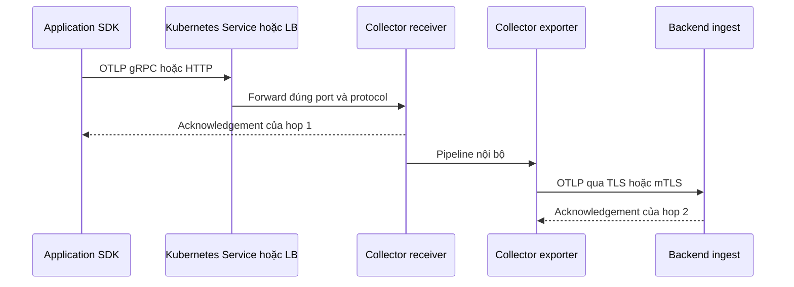
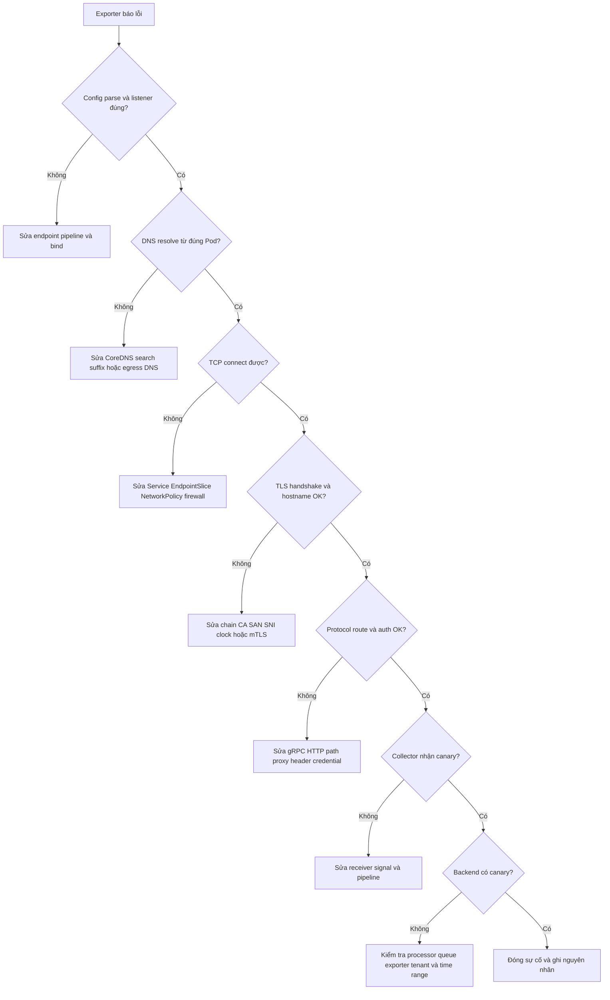

import { Tab, Tabs } from 'fumadocs-ui/components/tabs';
import { Step, Steps } from 'fumadocs-ui/components/steps';

OTLP đi qua nhiều ranh giới mạng: SDK đến Collector, Collector đến gateway và
gateway đến backend. Mỗi hop có DNS, listener, firewall, proxy, certificate và
credential riêng. Runbook này giúp triển khai các hop đó an toàn, sau đó kiểm
tra từ lớp thấp lên lớp cao thay vì đổi cấu hình ngẫu nhiên.

<Callout type="warn" title="Dùng runbook này khi nào">
  Dùng khi gặp `connection refused`, timeout, HTTP `404`, gRPC `UNAVAILABLE`,
  `unknown authority`, hostname mismatch hoặc lỗi mTLS. Các lệnh probe rỗng chỉ
  kiểm tra transport. Luôn kết thúc bằng một canary có telemetry thật và tìm nó
  tại backend.
</Callout>

## Mục lục

- [Mental model và port OTLP](#mental-model-và-port-otlp)
  - [Port mặc định không phải contract triển khai](#port-mặc-định-không-phải-contract-triển-khai)
  - [Kiểm tra từng hop độc lập](#kiểm-tra-từng-hop-độc-lập)
- [DNS và service discovery](#dns-và-service-discovery)
  - [Chọn tên endpoint ổn định](#chọn-tên-endpoint-ổn-định)
  - [Service discovery trong Kubernetes](#service-discovery-trong-kubernetes)
  - [DNS thay đổi và kết nối dài hạn](#dns-thay-đổi-và-kết-nối-dài-hạn)
- [Proxy firewall và egress](#proxy-firewall-và-egress)
  - [Mở đúng chiều và đúng protocol](#mở-đúng-chiều-và-đúng-protocol)
  - [Reverse proxy và load balancer](#reverse-proxy-và-load-balancer)
  - [Forward proxy cho egress](#forward-proxy-cho-egress)
- [TLS certificate chain SNI và CA](#tls-certificate-chain-sni-và-ca)
  - [Certificate chain hợp lệ](#certificate-chain-hợp-lệ)
  - [SNI SAN và hostname verification](#sni-san-và-hostname-verification)
  - [mTLS xác minh hai chiều](#mtls-xác-minh-hai-chiều)
- [Cấu hình TLS trong Collector](#cấu-hình-tls-trong-collector)
  - [Receiver làm TLS server](#receiver-làm-tls-server)
  - [Exporter làm TLS client](#exporter-làm-tls-client)
  - [Ý nghĩa các field quan trọng](#ý-nghĩa-các-field-quan-trọng)
- [Kubernetes Secrets và NetworkPolicy](#kubernetes-secrets-và-networkpolicy)
  - [Tạo và mount certificate](#tạo-và-mount-certificate)
  - [Giới hạn ingress và egress](#giới-hạn-ingress-và-egress)
- [Runbook xoay vòng certificate](#runbook-xoay-vòng-certificate)
  - [Rotate leaf certificate](#rotate-leaf-certificate)
  - [Rotate CA không gián đoạn](#rotate-ca-không-gián-đoạn)
  - [Rollback rotation](#rollback-rotation)
- [Xác minh theo từng lớp](#xác-minh-theo-từng-lớp)
  - [DNS listener và TCP](#dns-listener-và-tcp)
  - [Chain SNI và thời hạn bằng openssl](#chain-sni-và-thời-hạn-bằng-openssl)
  - [OTLP HTTP bằng curl](#otlp-http-bằng-curl)
  - [OTLP gRPC bằng grpcurl](#otlp-grpc-bằng-grpcurl)
  - [Canary end to end](#canary-end-to-end)
- [Troubleshooting theo layers](#troubleshooting-theo-layers)
  - [Cây quyết định xử lý sự cố](#cây-quyết-định-xử-lý-sự-cố)
  - [Bảng triệu chứng và hành động](#bảng-triệu-chứng-và-hành-động)
- [Security best practices](#security-best-practices)
- [Checklist production](#checklist-production)
- [Nguồn chính thức và bài liên quan](#nguồn-chính-thức-và-bài-liên-quan)

## Mental model và port OTLP

### Port mặc định không phải contract triển khai

OTLP ổn định cho traces, metrics và logs. Hai transport phổ biến dùng cùng data
model nhưng khác framing và route:

| Transport | Port mặc định | Dạng endpoint | Yêu cầu trên đường mạng |
| --- | ---: | --- | --- |
| OTLP/gRPC | `4317/TCP` | `otel-gateway.example.com:4317` | gRPC trên HTTP/2; không thêm `/v1/traces`. |
| OTLP/HTTP | `4318/TCP` | `https://otel-gateway.example.com:4318` | HTTP/1.1 hoặc HTTP/2; `POST` tới path theo signal. |
| OTLP qua endpoint public | Thường `443/TCP` | `https://telemetry.example.com` | Proxy hoặc backend quyết định gRPC, HTTP và base path. |

OTLP/HTTP mặc định dùng `/v1/traces`, `/v1/metrics` và `/v1/logs`. Endpoint
chung của SDK hoặc `otlp_http` exporter là base URL và tự thêm các path này.
Endpoint riêng theo signal phải chứa path hoàn chỉnh.

<Callout type="error" title="Port không tự nhận diện protocol">
  `4317` và `4318` chỉ là convention. Gửi gRPC vào listener HTTP thường tạo
  `UNIMPLEMENTED`, framing error hoặc status HTTP bất ngờ. Gửi HTTP vào listener
  gRPC thường trả `404`, `405` hoặc đóng kết nối. Luôn ghi rõ transport ở cả hai
  đầu.
</Callout>

Collector OTLP receiver hiện mặc định bind `localhost:4317` và
`localhost:4318`. Nếu client nằm ở Pod hoặc container khác, phải đặt `endpoint`
tường minh trên interface có thể đi tới. Không dùng `0.0.0.0` làm địa chỉ client;
đó chỉ là địa chỉ bind phía server.

### Kiểm tra từng hop độc lập

Một response thành công chỉ xác nhận hop hiện tại. Collector có thể nhận batch
từ SDK nhưng vẫn không gửi được đến backend.



Khi điều tra, ghi riêng cho mỗi hop:

- hostname, port, transport và path hiệu lực;
- nguồn DNS và IP đã resolve;
- policy ingress/egress cùng proxy trên đường đi;
- nơi TLS terminate và có re-encrypt hay không;
- CA, SAN, SNI và credential client được dùng;
- timeout, retry, queue và response/status cuối cùng.

## DNS và service discovery

### Chọn tên endpoint ổn định

Certificate xác minh **tên DNS mà client dùng**, không xác minh tên gọi nội bộ
của Deployment. Vì vậy, chọn endpoint trước khi cấp certificate.

Ví dụ trong Kubernetes:

```text
otel-gateway.observability.svc.cluster.local:4317
```

Certificate server cần có SAN DNS tương ứng, chẳng hạn
`DNS:otel-gateway.observability.svc.cluster.local`. Nếu client cùng namespace và
kết nối bằng tên ngắn `otel-gateway`, certificate chỉ có FQDN có thể không khớp.
Cách ít mơ hồ nhất là cấu hình client bằng FQDN đúng với SAN.

Không đưa IP Pod vào endpoint lâu dài. Pod IP thay đổi khi reschedule. Certificate
cũng hiếm khi có IP SAN cho mọi Pod. Dùng Kubernetes Service, DNS của load
balancer hoặc một tên riêng do tổ chức quản lý.

### Service discovery trong Kubernetes

Kubernetes tạo các dạng tên sau cho Service `otel-gateway` trong namespace
`observability`:

| Client | Tên nên dùng | Ghi chú |
| --- | --- | --- |
| Cùng namespace | `otel-gateway:4317` | Ngắn, nhưng SAN phải khớp tên client dùng. |
| Khác namespace | `otel-gateway.observability:4317` | CoreDNS thêm search suffix của cluster. |
| Cần tên canonical | `otel-gateway.observability.svc.cluster.local:4317` | Phù hợp nhất để cố định SAN/SNI. |
| Ngoài cluster | DNS public/private của LB | Không dùng tên `.svc.cluster.local` nếu DNS ngoài cluster không resolve được. |

Service `ClusterIP` cung cấp một virtual IP ổn định và cân bằng tới các Pod
ready. Headless Service trả về IP Pod; chỉ dùng khi client/resolver và chiến
lược cân bằng tải đã được kiểm thử. Một client gRPC giữ kết nối lâu có thể dồn
traffic vào một backend dù DNS trả nhiều địa chỉ.

Kiểm tra từ **đúng network namespace của client**:

```bash
kubectl exec -n shop deploy/checkout -- \
  getent ahosts otel-gateway.observability.svc.cluster.local

kubectl get service,endpointslice -n observability \
  -l kubernetes.io/service-name=otel-gateway -o wide
```

Nếu image ứng dụng không có công cụ mạng, dùng ephemeral debug container thay vì
cài package vào container production.

### DNS thay đổi và kết nối dài hạn

DNS resolve thành công không bảo đảm client sẽ chuyển ngay sang IP mới. HTTP
keep-alive và gRPC channel có thể giữ kết nối cũ. Khi thay load balancer,
Service hoặc DNS record:

1. Giảm TTL trước thay đổi nếu bạn quản lý authoritative DNS.
2. Giữ endpoint cũ hoạt động trong thời gian TTL và thời gian sống connection.
3. Quan sát reconnect, retry và phân bố traffic theo replica.
4. Chỉ gỡ endpoint cũ sau khi không còn connection hoặc traffic.

Với endpoint managed, firewall dựa trên một IP resolve tại thời điểm triển khai
rất dễ lỗi khi nhà cung cấp đổi IP. Dùng dải CIDR được công bố hoặc policy hỗ trợ
FQDN. Luôn có cảnh báo khi DNS thất bại hoặc IP đích thay đổi ngoài allowlist.

## Proxy firewall và egress

### Mở đúng chiều và đúng protocol

Firewall cần cho phép TCP từ source thực đến destination thực. Với topology
`application → Collector → backend`, rule tối thiểu thường là:

| Chiều | Source | Destination | Port |
| --- | --- | --- | ---: |
| Ingress Collector | Namespace hoặc workload ứng dụng | Collector Service/Pod | `4317/TCP`, `4318/TCP` theo transport được bật |
| Egress Collector | Collector | Cluster DNS | `53/UDP` và `53/TCP` |
| Egress Collector | Collector | Backend hoặc proxy | `443/TCP`, `4317/TCP` hoặc `4318/TCP` theo contract |
| Control plane tùy chọn | Collector có Kubernetes receivers/processors | Kubernetes API | Thường `443/TCP` |

Không mở cả hai port nếu chỉ dùng một transport. Không mở health, `pprof`,
`zpages` hoặc internal metrics ra internet. Một cloud security group cho phép
port chưa đủ nếu Kubernetes `NetworkPolicy`, service mesh hoặc host firewall vẫn
chặn.

### Reverse proxy và load balancer

Proxy phía trước receiver phải giữ đúng semantics:

- Với gRPC, hỗ trợ HTTP/2 phía client **và** gRPC upstream. Route theo
  `:authority` và full method, ví dụ
  `/opentelemetry.proto.collector.trace.v1.TraceService/Export`.
- Với OTLP/HTTP, giữ `POST`, body, `Content-Type`, `Content-Encoding`, auth
  headers và các path `/v1/traces`, `/v1/metrics`, `/v1/logs`.
- Đặt request-body limit sau giải nén phù hợp với batch. Không tăng vô hạn để
  che lỗi batch quá lớn.
- Căn timeout của proxy lớn hơn một export attempt hợp lý, nhưng vẫn hữu hạn.
- Nếu terminate TLS ở proxy, dùng TLS hoặc mTLS lại từ proxy đến Collector khi
  hop nội bộ đi qua trust boundary khác.

<Callout type="warn" title="TLS termination thay đổi identity của client">
  Khi proxy terminate mTLS, Collector phía sau chỉ xác minh certificate của
  proxy, không còn thấy certificate gốc của SDK. Chỉ forward identity qua header
  nếu proxy xóa header do client tự gửi, ký hoặc bảo vệ header đó, và Collector
  chỉ nhận traffic từ proxy.
</Callout>

HTTP `502`, `503` và `504` thường chỉ ra proxy không kết nối được upstream hoặc
upstream timeout. gRPC status `UNAVAILABLE` có thể là cùng một lỗi được proxy ánh
xạ. Kiểm tra access log proxy và probe trực tiếp upstream trong mạng nội bộ để
tách lỗi proxy khỏi lỗi Collector.

### Forward proxy cho egress

`otlp_http` exporter hỗ trợ `proxy_url` trong cấu hình HTTP client:

```yaml
exporters:
  otlp_http/backend:
    endpoint: https://telemetry.example.com/otel
    proxy_url: http://egress-proxy.platform.svc:3128
```

Proxy phải cho phép `CONNECT` tới hostname/port TLS đích nếu dùng HTTPS. Với
gRPC, toàn bộ đường đi phải hỗ trợ HTTP/2 và gRPC qua proxy; không giả định một
forward proxy HTTP/1.1 sẽ hoạt động. Hãy test đúng Collector distribution và
proxy thực tế trước khi chọn OTLP/gRPC cho đường egress bắt buộc qua proxy.

Các biến như `HTTP_PROXY`, `HTTPS_PROXY` và `NO_PROXY` có thể được runtime dùng,
nhưng mức áp dụng khác theo client và phiên bản. Với HTTP exporter, ưu tiên
`proxy_url` tường minh khi cần hành vi ổn định. Đặt `NO_PROXY` cho Service nội bộ
và loopback nếu policy yêu cầu đi trực tiếp. Không đưa proxy credential vào log
hoặc ConfigMap.

## TLS certificate chain SNI và CA

### Certificate chain hợp lệ

Một TLS chain điển hình gồm:

```text
server leaf certificate
  └── intermediate CA certificate
        └── root CA certificate được client tin cậy
```

Server nên gửi **leaf trước, sau đó các intermediate cần thiết** trong
`cert_file`. Thông thường không cần gửi root CA. Client cần trust anchor phù hợp
trong system trust store hoặc `ca_file`. Nếu server chỉ gửi leaf, máy có cached
intermediate có thể kết nối được trong khi container tối giản thất bại với
`unable to get local issuer certificate`.

Kiểm tra offline:

```bash
openssl verify \
  -CAfile root-ca.pem \
  -untrusted intermediate-ca.pem \
  -verify_hostname otel-gateway.example.com \
  server.pem
```

`ca_file` không phải certificate leaf của server chỉ vì file đó “có chữ cert”.
Nó phải chứa CA tin cậy có thể xây chain tới leaf. Giới hạn mỗi exporter vào CA
cần thiết thay vì tin mọi CA nội bộ nếu threat model yêu cầu isolation.

### SNI SAN và hostname verification

**SNI (Server Name Indication)** là tên host client gửi trong TLS ClientHello để
load balancer chọn certificate. **SAN (Subject Alternative Name)** là danh sách
tên mà certificate được phép đại diện. Client phải đồng thời:

1. gửi đúng SNI để nhận certificate đúng;
2. xây được chain tới CA tin cậy;
3. tìm thấy hostname endpoint trong SAN;
4. xác nhận certificate còn hạn và thời gian hệ thống đúng.

Kết nối tới IP trong khi certificate chỉ có DNS SAN thường thất bại. Dùng
`curl --resolve` hoặc `openssl s_client -servername` để ép IP khi debug mà vẫn
giữ hostname/SNI đúng. Không sửa production bằng `insecure_skip_verify`.

Collector TLS client suy ra server name từ endpoint. `server_name_override` có
thể thay tên này nhưng upstream mô tả nó chủ yếu cho testing. Trong production,
ưu tiên endpoint DNS khớp SAN; override dễ che thiết kế DNS/certificate sai.

### mTLS xác minh hai chiều

TLS một chiều chỉ yêu cầu server trình certificate. **mTLS** còn yêu cầu client
trình certificate và chứng minh sở hữu private key tương ứng.

| Bên | Trình gì | Xác minh gì |
| --- | --- | --- |
| Collector receiver | Server certificate và proof của server key | Client certificate chain qua `client_ca_file` |
| SDK hoặc Collector exporter | Client certificate và proof của client key | Server chain qua system roots hoặc `ca_file` |

mTLS cung cấp identity máy hoặc workload, không tự cấp quyền tenant. Kết hợp với
authenticator, gateway policy hoặc mapping certificate identity sang quyền
ingest. Không dùng cùng một client certificate cho mọi cluster nếu cần thu hồi
hoặc phân biệt nguồn.

Certificate client nên có Extended Key Usage `TLS Web Client Authentication`;
certificate server nên có `TLS Web Server Authentication`. CA phát client và CA
phát server có thể tách riêng để giảm phạm vi tin cậy.

## Cấu hình TLS trong Collector

Các ví dụ dùng tên component hiện hành `otlp_grpc` và `otlp_http`. Distribution
hoặc release cũ có thể dùng alias khác. Pin image, chạy `otelcol components` và
validate bằng đúng binary sẽ triển khai.

### Receiver làm TLS server

Mẫu sau nhận gRPC và HTTP bằng mTLS. `server-chain.pem` chứa leaf rồi
intermediate. `client-ca.pem` chứa CA được phép phát certificate cho clients.

```yaml
receivers:
  otlp:
    protocols:
      grpc:
        endpoint: "${env:MY_POD_IP}:4317"
        tls:
          cert_file: /var/run/secrets/otel-receiver/server-chain.pem
          key_file: /var/run/secrets/otel-receiver/server-key.pem
          client_ca_file: /var/run/secrets/otel-receiver/client-ca.pem
          min_version: "1.2"
          reload_interval: 1m
          client_ca_file_reload: true
      http:
        endpoint: "${env:MY_POD_IP}:4318"
        max_request_body_size: 20971520
        tls:
          cert_file: /var/run/secrets/otel-receiver/server-chain.pem
          key_file: /var/run/secrets/otel-receiver/server-key.pem
          client_ca_file: /var/run/secrets/otel-receiver/client-ca.pem
          min_version: "1.2"
          reload_interval: 1m
          client_ca_file_reload: true

processors:
  memory_limiter:
    check_interval: 1s
    limit_mib: 512
  batch:

exporters:
  debug/temporary:
    verbosity: basic

service:
  pipelines:
    traces:
      receivers: [otlp]
      processors: [memory_limiter, batch]
      exporters: [debug/temporary]
```

Receiver chỉ mở listener khi được tham chiếu trong ít nhất một pipeline. Bật
pipeline metrics và logs tương tự khi cần. Gỡ `debug` exporter sau khi test vì
telemetry có thể chứa dữ liệu nhạy cảm.

Nếu chỉ cần TLS một chiều, bỏ `client_ca_file` và
`client_ca_file_reload`. Khi đó receiver không yêu cầu client certificate;
phải dùng authentication khác nếu endpoint không hoàn toàn nằm trong mạng tin
cậy.

### Exporter làm TLS client

<Tabs items={['OTLP gRPC', 'OTLP HTTP']}>
  <Tab value="OTLP gRPC">

```yaml
exporters:
  otlp_grpc/backend:
    endpoint: telemetry.example.com:4317
    compression: gzip
    timeout: 10s
    headers:
      authorization: "Bearer ${env:OTLP_TOKEN}"
    tls:
      ca_file: /var/run/secrets/otel-exporter/backend-ca.pem
      cert_file: /var/run/secrets/otel-exporter/client-chain.pem
      key_file: /var/run/secrets/otel-exporter/client-key.pem
      min_version: "1.2"
      reload_interval: 1m
    sending_queue:
      enabled: true
      queue_size: 1000
    retry_on_failure:
      enabled: true
      initial_interval: 5s
      max_interval: 30s
      max_elapsed_time: 5m
```

`endpoint` là gRPC target. Không thêm `/v1/traces`. TLS được bật mặc định cho
exporter gRPC hiện hành khi `insecure` không được đặt; cấu hình CA và endpoint
rõ ràng vẫn dễ audit hơn.

  </Tab>
  <Tab value="OTLP HTTP">

```yaml
exporters:
  otlp_http/backend:
    endpoint: https://telemetry.example.com/otel
    encoding: proto
    compression: gzip
    timeout: 10s
    headers:
      authorization: "Bearer ${env:OTLP_TOKEN}"
    tls:
      ca_file: /var/run/secrets/otel-exporter/backend-ca.pem
      cert_file: /var/run/secrets/otel-exporter/client-chain.pem
      key_file: /var/run/secrets/otel-exporter/client-key.pem
      min_version: "1.2"
      reload_interval: 1m
    sending_queue:
      enabled: true
      queue_size: 1000
    retry_on_failure:
      enabled: true
      initial_interval: 5s
      max_interval: 30s
      max_elapsed_time: 5m
```

Exporter tạo các URL
`https://telemetry.example.com/otel/v1/traces`,
`.../v1/metrics` và `.../v1/logs`. Dùng `traces_endpoint`,
`metrics_endpoint` hoặc `logs_endpoint` khi backend có URL riêng.

  </Tab>
</Tabs>

Gắn exporter vào từng `service.pipelines.<signal>.exporters`. Cấu hình parse
được nhưng không có trong pipeline sẽ không gửi dữ liệu.

### Ý nghĩa các field quan trọng

| Field | Phía dùng | Ý nghĩa vận hành |
| --- | --- | --- |
| `ca_file` | TLS client | CA bundle để xác minh server; nếu bỏ, dùng system root CAs. |
| `cert_file`, `key_file` | TLS server | Certificate chain và private key của server; bắt buộc để receiver phục vụ TLS. |
| `cert_file`, `key_file` | TLS client | Client identity cho mTLS; không cần cho TLS một chiều. |
| `client_ca_file` | TLS server | CA xác minh client; khi đặt sẽ yêu cầu và verify client certificate. |
| `reload_interval` | Cả hai | Chu kỳ đọc lại certificate/key; nếu không đặt thì không reload định kỳ. |
| `client_ca_file_reload` | TLS server | Đọc lại file CA client khi file thay đổi. |
| `include_system_ca_certs_pool` | TLS client | Gộp system roots với `ca_file`; mặc định `false`. |
| `min_version` | Cả hai | Collector hiện mặc định TLS `1.2`; đặt tường minh để audit. |
| `insecure` | TLS client | Tắt transport security hoàn toàn. |
| `insecure_skip_verify` | TLS client | Vẫn mã hóa nhưng bỏ xác minh chain/hostname; không dùng production. |
| `server_name_override` | TLS client | Ghi đè tên dùng cho authority/SNI verification; chủ yếu phục vụ test. |

Field khả dụng thay đổi theo Collector release. Chạy validation bằng đúng image:

```bash
export MY_POD_IP=127.0.0.1
export OTLP_TOKEN=redacted-for-validation
otelcol validate --config=file:./otelcol.yaml
```

Validation không gọi DNS, không handshake TLS và không chứng minh backend nhận
dữ liệu.

## Kubernetes Secrets và NetworkPolicy

### Tạo và mount certificate

Tạo Secret TLS cho receiver và Secret generic cho trust/client identity. Không
đưa PEM hoặc private key thật vào Git:

```bash
kubectl create secret tls otel-receiver-tls \
  --namespace observability \
  --cert=server-chain.pem \
  --key=server-key.pem

kubectl create secret generic otel-tls-bundles \
  --namespace observability \
  --from-file=client-ca.pem=client-ca.pem \
  --from-file=backend-ca.pem=backend-ca.pem \
  --from-file=client-chain.pem=client-chain.pem \
  --from-file=client-key.pem=client-key.pem
```

`kubernetes.io/tls` chuẩn hóa hai key `tls.crt` và `tls.key`. Kubernetes kiểm tra
có key bắt buộc nhưng không thay PKI tool xác minh toàn bộ chain và usage.

Mount cả directory, read-only, và đổi tên key bằng `items`:

```yaml
spec:
  template:
    spec:
      containers:
        - name: otel-collector
          image: otel/opentelemetry-collector-k8s:0.157.0
          env:
            - name: MY_POD_IP
              valueFrom:
                fieldRef:
                  fieldPath: status.podIP
          volumeMounts:
            - name: receiver-tls
              mountPath: /var/run/secrets/otel-receiver
              readOnly: true
            - name: exporter-tls
              mountPath: /var/run/secrets/otel-exporter
              readOnly: true
      volumes:
        - name: receiver-tls
          secret:
            secretName: otel-receiver-tls
            defaultMode: 0400
            items:
              - key: tls.crt
                path: server-chain.pem
              - key: tls.key
                path: server-key.pem
        - name: exporter-tls
          secret:
            secretName: otel-tls-bundles
            defaultMode: 0400
```

Kubernetes cập nhật Secret volume theo cơ chế eventual consistency. Mount bằng
`subPath` **không nhận cập nhật tự động**. Dù file đã đổi, process chỉ dùng
certificate mới nếu component reload file hoặc Pod restart. Vì vậy, kết hợp
`reload_interval` với rolling restart đã kiểm thử; đừng giả định chỉ cập nhật
Secret là hoàn tất rotation.

<Callout type="error" title="Secret không tự được mã hóa an toàn">
  Kubernetes Secret chỉ base64-encode dữ liệu. Bật encryption at rest cho etcd,
  giới hạn RBAC, hạn chế quyền tạo Pod trong namespace và cân nhắc external
  secret store. Chỉ mount Secret vào container cần dùng.
</Callout>

### Giới hạn ingress và egress

Mẫu dưới đây minh họa default deny cho Collector gateway, cho workload có label
`otel-client=true` gửi OTLP và cho Collector gọi backend nội bộ. Điều chỉnh
namespace, label và port theo cluster:

```yaml
apiVersion: networking.k8s.io/v1
kind: NetworkPolicy
metadata:
  name: otel-gateway
  namespace: observability
spec:
  podSelector:
    matchLabels:
      app: otel-gateway
  policyTypes: [Ingress, Egress]
  ingress:
    - from:
        - namespaceSelector:
            matchLabels:
              kubernetes.io/metadata.name: shop
          podSelector:
            matchLabels:
              otel-client: "true"
      ports:
        - { protocol: TCP, port: 4317 }
        - { protocol: TCP, port: 4318 }
  egress:
    - to:
        - namespaceSelector:
            matchLabels:
              kubernetes.io/metadata.name: kube-system
          podSelector:
            matchLabels:
              k8s-app: kube-dns
      ports:
        - { protocol: UDP, port: 53 }
        - { protocol: TCP, port: 53 }
    - to:
        - namespaceSelector:
            matchLabels:
              kubernetes.io/metadata.name: telemetry-backend
          podSelector:
            matchLabels:
              app: otlp-ingest
      ports:
        - { protocol: TCP, port: 4317 }
```

Label DNS Pod khác nhau theo distribution, ví dụ `k8s-app=kube-dns` hoặc
`k8s-app=coredns`; kiểm tra cluster thực. Vanilla Kubernetes `NetworkPolicy`
không chọn đích theo FQDN. Với backend bên ngoài, dùng CIDR ổn định do nhà cung
cấp công bố hoặc tính năng FQDN egress của CNI. Không mở `0.0.0.0/0` lâu dài chỉ
để chữa timeout.

## Runbook xoay vòng certificate

### Rotate leaf certificate

<Steps>
  <Step>

**Kiểm tra certificate mới trước khi deploy**

```bash
openssl x509 -in server-chain.pem -noout \
  -subject -issuer -serial -dates -fingerprint -sha256
openssl x509 -in server-chain.pem -noout -ext subjectAltName
openssl verify -CAfile root-ca.pem \
  -untrusted intermediate-ca.pem \
  -verify_hostname otel-gateway.example.com server.pem
```

Xác nhận SAN, EKU, chain, key pair, `notBefore`, `notAfter` và clock. Giữ bản
Secret cũ trong secret manager để rollback, không xuất private key vào ticket.

  </Step>
  <Step>

**Cập nhật Secret và chờ volume được project**

Dùng công cụ PKI/cert-manager của tổ chức. Nếu thao tác tay, có thể tạo manifest
client-side rồi apply mà không ghi PEM vào shell history:

```bash
kubectl create secret tls otel-receiver-tls \
  -n observability \
  --cert=server-chain.pem \
  --key=server-key.pem \
  --dry-run=client -o yaml | kubectl apply -f -
```

  </Step>
  <Step>

**Reload hoặc rolling restart có kiểm soát**

Nếu release đã kiểm thử `reload_interval`, chờ ít nhất một chu kỳ rồi xác minh
fingerprint live. Cách an toàn khi chưa chắc component reload là rolling restart:

```bash
kubectl rollout restart deployment/otel-gateway -n observability
kubectl rollout status deployment/otel-gateway -n observability --timeout=180s
```

Giữ ít nhất hai replica và PodDisruptionBudget phù hợp để tránh mất toàn bộ
listener trong rollout.

  </Step>
  <Step>

**Xác minh từng transport và canary**

Kiểm tra live certificate bằng `openssl`, probe HTTP/gRPC, gửi canary rồi quan
sát accepted, refused, queue và export failures. Chỉ đóng change sau khi backend
tìm thấy canary của mọi signal đang dùng.

  </Step>
</Steps>

### Rotate CA không gián đoạn

CA rotation cần giai đoạn chồng lấn. Không thay CA và leaf trong một bước nếu
client chưa tin CA mới.

1. Tạo trust bundle `old-root + new-root` và triển khai tới mọi TLS client.
2. Với mTLS, triển khai bundle tương tự vào `client_ca_file` của mọi server.
3. Xác minh clients vẫn kết nối bằng leaf cũ.
4. Phát và triển khai leaf/intermediate mới được CA mới ký.
5. Buộc kết nối mới có kiểm soát hoặc chờ connection cũ hết vòng đời; xác minh
   live chain và canary.
6. Sau thời gian chồng lấn và khi không còn leaf cũ, loại CA cũ khỏi trust
   bundles.
7. Theo dõi `unknown authority`, handshake failures và retry storm trong toàn bộ
   quá trình.

Với gRPC connection dài hạn, connection đã mở có thể tiếp tục dùng session cũ.
`reload_interval` áp dụng certificate cho handshake mới; nó không bảo đảm mọi
channel đang mở lập tức reconnect. Thử rotation trong staging với đúng proxy,
load balancer và client SDK.

### Rollback rotation

Rollback khi handshake failures, rejected clients hoặc exporter failures tăng
sau thay đổi:

1. Dừng bước gỡ CA cũ; giữ trust bundle kép.
2. Khôi phục Secret leaf/key trước đó hoặc route về replica còn certificate cũ.
3. Rolling restart nếu process không reload file.
4. Xác minh fingerprint live, HTTP/gRPC probe và canary.
5. Thu hồi certificate lỗi theo quy trình PKI; không xóa bằng chứng audit.
6. Chỉ thử lại sau khi xác định lỗi thuộc SAN, chain, EKU, clock, SNI hay key
   mismatch.

## Xác minh theo từng lớp

Chạy probe từ cùng Pod, node hoặc egress path với Collector. Test từ laptop có
thể đi qua DNS, proxy và firewall hoàn toàn khác.

### DNS listener và TCP

```bash
# DNS từ Pod client
kubectl exec -n shop deploy/checkout -- \
  getent ahosts otel-gateway.observability.svc.cluster.local

# Listener trong container Collector
kubectl exec -n observability deploy/otel-gateway -- \
  sh -c "cat /proc/net/tcp /proc/net/tcp6"

# TCP từ ephemeral debug container
kubectl debug -n shop deploy/checkout -it \
  --image=nicolaka/netshoot --target=checkout -- \
  nc -vz otel-gateway.observability.svc.cluster.local 4317
```

`nc` thành công chỉ chứng minh TCP connect. Nó không xác minh TLS, gRPC service,
HTTP path, auth hoặc pipeline.

### Chain SNI và thời hạn bằng openssl

```bash
openssl s_client \
  -connect otel-gateway.example.com:4317 \
  -servername otel-gateway.example.com \
  -CAfile backend-ca.pem \
  -verify_return_error \
  -showcerts </dev/null
```

Tìm `Verify return code: 0 (ok)`, certificate đúng hostname và chain đầy đủ. Xem
thời hạn/fingerprint của leaf đang phục vụ:

```bash
openssl s_client \
  -connect otel-gateway.example.com:4317 \
  -servername otel-gateway.example.com </dev/null 2>/dev/null \
| openssl x509 -noout -subject -issuer -serial -dates -fingerprint -sha256
```

Probe mTLS bằng client identity:

```bash
openssl s_client \
  -connect otel-gateway.example.com:4317 \
  -servername otel-gateway.example.com \
  -CAfile backend-ca.pem \
  -cert client-chain.pem \
  -key client-key.pem \
  -verify_return_error </dev/null
```

Không paste private key vào command line hoặc support bundle. `-key` nhận path
file có quyền đọc tối thiểu.

### OTLP HTTP bằng curl

Một `ExportTraceServiceRequest` Protobuf rỗng mã hóa thành body rỗng. Lệnh sau
kiểm tra DNS, TCP, TLS, mTLS, auth, route và decoder:

```bash
curl --fail-with-body --verbose \
  --cacert backend-ca.pem \
  --cert client-chain.pem \
  --key client-key.pem \
  --header 'Content-Type: application/x-protobuf' \
  --header "Authorization: Bearer ${OTLP_TOKEN}" \
  --data-binary '' \
  https://otel-gateway.example.com:4318/v1/traces
```

Kỳ vọng HTTP `200` và response Protobuf có thể rỗng. Để test một IP load balancer
mà vẫn giữ Host và SNI:

```bash
curl --resolve otel-gateway.example.com:443:203.0.113.10 \
  --cacert backend-ca.pem \
  --header 'Content-Type: application/x-protobuf' \
  --data-binary '' \
  https://otel-gateway.example.com/v1/traces
```

Không dùng `curl -k`. Nó bỏ chính lớp hostname/CA cần kiểm chứng.

### OTLP gRPC bằng grpcurl

OTLP receiver không bắt buộc bật server reflection. Cung cấp `.proto` từ
repository `opentelemetry-proto` đã pin version:

```bash
grpcurl \
  -cacert backend-ca.pem \
  -cert client-chain.pem \
  -key client-key.pem \
  -H "authorization: Bearer ${OTLP_TOKEN}" \
  -import-path ./opentelemetry-proto \
  -proto opentelemetry/proto/collector/trace/v1/trace_service.proto \
  -d '{}' \
  otel-gateway.example.com:4317 \
  opentelemetry.proto.collector.trace.v1.TraceService/Export
```

Response `{}` chứng minh RPC `Export` rỗng hoạt động. `grpcurl list` thất bại với
“server does not support reflection” không có nghĩa OTLP service hỏng.

### Canary end to end

Dùng application thật hoặc `telemetrygen` đã pin version. Ví dụ mTLS qua gRPC:

```bash
telemetrygen traces \
  --otlp-endpoint otel-gateway.example.com:4317 \
  --otlp-ca-cert backend-ca.pem \
  --otlp-client-cert client-chain.pem \
  --otlp-client-key client-key.pem \
  --traces 1
```

Flag có thể thay đổi theo release; chạy `telemetrygen traces --help` trên binary
đang dùng. Sau khi gửi:

1. kiểm tra receiver accepted data;
2. kiểm tra processors không filter canary;
3. kiểm tra exporter queue, retry và send failures;
4. tìm canary ở backend theo `service.name`, trace ID hoặc tên span;
5. lặp lại cho metrics và logs nếu các signal đó đang được vận hành.

## Troubleshooting theo layers

### Cây quyết định xử lý sự cố



Nguyên tắc là không điều tra lớp trên khi lớp dưới chưa qua. Ví dụ, đừng đổi
token khi TCP còn timeout; đừng tăng retry khi hostname verification đang sai.

### Bảng triệu chứng và hành động

| Layer | Triệu chứng | Nguyên nhân thường gặp | Kiểm tra và xử lý |
| --- | --- | --- | --- |
| Cấu hình | Collector chạy nhưng không listen | Receiver khai báo nhưng chưa nằm trong pipeline; bind sai interface | `otelcol validate`, log startup, `service.pipelines`, socket trong Pod. |
| DNS | `no such host`, `SERVFAIL` | Sai namespace/FQDN, CoreDNS lỗi, egress DNS bị chặn | `getent`/`dig` từ Pod; mở UDP và TCP 53; kiểm tra Service. |
| Service discovery | DNS có IP nhưng không có endpoint ready | Selector sai, Pod chưa ready, port name/targetPort sai | `kubectl get svc,endpointslice,pod -o wide`. |
| TCP | `connection refused` | Không listener, sai targetPort hoặc process restart | Kiểm tra listener và EndpointSlice; refused khác timeout. |
| TCP | Timeout | NetworkPolicy, security group, firewall, route hoặc proxy | `nc`, flow logs và policy ở cả source/destination. |
| TLS chain | `unknown authority`, `unable to get local issuer` | Thiếu root/intermediate hoặc mount sai CA | `openssl s_client -showcerts`; sửa server chain và client `ca_file`. |
| TLS name | `certificate is valid for X, not Y` | Endpoint không nằm trong SAN hoặc SNI sai | Dùng DNS đúng SAN; cấp lại cert; không skip verify. |
| TLS time | `expired` hoặc `not yet valid` | Rotation trễ hoặc clock lệch | `openssl x509 -dates`; sửa NTP và certificate lifecycle. |
| mTLS | `certificate required`, `bad certificate` | Không gửi client cert, CA client sai, EKU sai hoặc key mismatch | Probe `openssl` với `-cert/-key`; kiểm tra `client_ca_file` và EKU. |
| Proxy | HTTP `502/503/504`, gRPC `UNAVAILABLE` | Upstream unreachable, timeout hoặc route gRPC sai | Xem proxy log; probe trực tiếp upstream; xác minh HTTP/2. |
| Protocol | HTTP `404/405` | Thiếu `/v1/<signal>`, base path bị strip hoặc dùng GET | In URL hiệu lực; dùng `POST`; sửa route cho cả ba signal. |
| Protocol | gRPC `UNIMPLEMENTED` | Đi nhầm listener hoặc proxy không route full method | Kiểm tra port, h2/gRPC upstream và service method. |
| Payload | HTTP `413`, gRPC `RESOURCE_EXHAUSTED` | Batch vượt body/message limit sau giải nén | Giảm batch; đặt limit hữu hạn và thống nhất qua mọi hop. |
| Auth | HTTP `401`, gRPC `UNAUTHENTICATED` | Header/cert thiếu, token hết hạn | Kiểm tra injection không log secret; phân biệt TLS identity và bearer auth. |
| Authz | HTTP `403`, gRPC `PERMISSION_DENIED` | Credential hợp lệ nhưng sai tenant/scope | Sửa quyền hoặc tenant header; không retry cùng request vô hạn. |
| OTLP | HTTP `200` nhưng thiếu records | Partial success hoặc probe rỗng | Đọc response/diagnostic; gửi canary thật; xem rejected counters. |
| Pipeline | Receiver nhận nhưng backend trống | Processor drop, exporter TLS/auth, queue đầy hoặc backend query sai | Bật `debug` tạm thời, xem internal telemetry, tenant và time range. |
| Rotation | Một số replica lỗi ngẫu nhiên | Secret/Pod/certificate không đồng nhất | So fingerprint theo từng Pod/IP; hoàn tất rollout hoặc rollback. |

Khi thu thập bằng chứng, ghi timestamp UTC, source Pod, hostname, resolved IP,
protocol, port, SNI, certificate serial/fingerprint và status đã redact. Không
thu private key, bearer token hoặc payload telemetry nhạy cảm.

## Security best practices

- Bind receiver vào interface cụ thể hoặc Pod IP. Chỉ dùng `0.0.0.0` khi đã có
  firewall, NetworkPolicy và authentication bao quanh.
- Mã hóa mọi hop vượt trust boundary. Nếu TLS terminate ở proxy, đánh giá và mã
  hóa lại hop proxy đến Collector.
- Dùng TLS `1.2` trở lên. Không ép cipher suite tùy chỉnh nếu không có yêu cầu
  compliance và kiểm thử tương thích.
- Không dùng `insecure: true`, `insecure_skip_verify: true`, `curl -k` hoặc
  `grpcurl -insecure` trong production. Sửa CA, SAN, SNI, chain hoặc clock.
- Tách CA server và CA client khi cần giảm blast radius. Dùng certificate ngắn
  hạn, identity riêng theo workload và quy trình thu hồi rõ ràng.
- Kết hợp mTLS với authorization. Sở hữu certificate hợp lệ không tự động có
  quyền ghi vào mọi tenant.
- Mount private key read-only với quyền tối thiểu. Bật encryption at rest, RBAC
  least privilege và external secret store nếu threat model yêu cầu.
- Giới hạn request/message size, concurrency, queue, retry và timeout. TLS không
  ngăn denial of service từ client đã được xác thực.
- Chỉ expose component cần thiết. Giữ health, internal metrics, `pprof` và
  `zpages` trong mạng quản trị; các endpoint debug có thể lộ metadata.
- Không log headers, effective config có secret, private key hoặc payload chi
  tiết. Redact trước khi gửi log/support bundle.
- Pin Collector distribution, SDK và tool probe. Validate config và diễn tập
  expiry, CA rotation, backend outage cùng proxy failure trước production.
- Theo dõi certificate expiry, handshake failures, DNS errors, retry, queue
  saturation, refused data và exporter failures. Cảnh báo phải đến trước ngày
  hết hạn đủ lâu để rotate an toàn.

## Checklist production

- [ ] Mỗi hop có owner, hostname, port, transport, path và nơi terminate TLS.
- [ ] OTLP/gRPC dùng đúng HTTP/2 route; OTLP/HTTP có đủ ba path signal cần dùng.
- [ ] DNS endpoint ổn định và SAN/SNI khớp chính xác tên client cấu hình.
- [ ] Server gửi leaf cùng intermediate đầy đủ; client chỉ tin CA cần thiết.
- [ ] mTLS, bearer token hoặc workload identity có authorization theo tenant.
- [ ] Receiver bind tối thiểu; ingress và egress chỉ mở source/destination cần thiết.
- [ ] DNS egress gồm cả UDP/TCP 53; backend/proxy egress không mở toàn internet.
- [ ] Secrets không nằm trong Git/ConfigMap; volume không dùng `subPath` nếu cần rotation.
- [ ] `reload_interval` hoặc rolling restart đã được kiểm thử với connection dài hạn.
- [ ] CA rotation có giai đoạn trust bundle kép và rollback đã diễn tập.
- [ ] `openssl`, `curl`, `grpcurl` probe chạy từ đúng network namespace.
- [ ] Canary traces, metrics và logs xuất hiện tại backend; probe rỗng không được coi là end to end.
- [ ] Có alert cho expiry, TLS/DNS errors, rejected data, queue và retry storm.
- [ ] Không còn skip verification, plaintext tạm thời hoặc debug exporter sau rollout.

## Nguồn chính thức và bài liên quan

Các port, endpoint, TLS field và quy trình kiểm chứng trong trang dựa trên:

- [OTLP Specification](https://opentelemetry.io/docs/specs/otlp/)
- [OTLP Exporter Configuration](https://opentelemetry.io/docs/languages/sdk-configuration/otlp-exporter/)
- [Collector OTLP receiver](https://github.com/open-telemetry/opentelemetry-collector/tree/main/receiver/otlpreceiver)
- [Collector OTLP gRPC exporter](https://github.com/open-telemetry/opentelemetry-collector/tree/main/exporter/otlpexporter)
- [Collector OTLP HTTP exporter](https://github.com/open-telemetry/opentelemetry-collector/tree/main/exporter/otlphttpexporter)
- [Collector TLS configuration](https://github.com/open-telemetry/opentelemetry-collector/tree/main/config/configtls)
- [Collector security best practices](https://opentelemetry.io/docs/security/config-best-practices/)
- [Kubernetes Secrets](https://kubernetes.io/docs/concepts/configuration/secret/)
- [Kubernetes NetworkPolicy](https://kubernetes.io/docs/concepts/services-networking/network-policies/)

<Cards>
  <Card
    title="OTLP gRPC và OTLP HTTP"
    href="/protocols-backends/otlp-grpc-http/"
    description="So sánh transport, endpoint, path, status và retry semantics."
  />
  <Card
    title="Cấu hình Collector"
    href="/collector/configuration/"
    description="Validate component graph, environment substitution và secret."
  />
  <Card
    title="Triển khai trên Kubernetes"
    href="/deployment/kubernetes/"
    description="Service discovery, RBAC, topology, scaling và NetworkPolicy."
  />
</Cards>
