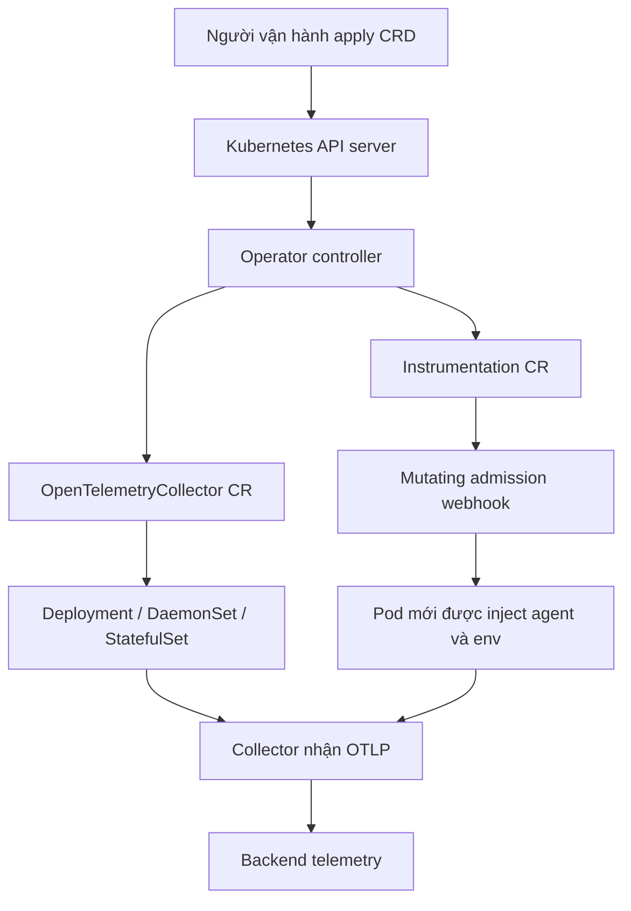

import { Step, Steps } from 'fumadocs-ui/components/steps';

<Callout type="info" title="Phạm vi và phiên bản minh họa">
  Trang này dùng API hiện hành `OpenTelemetryCollector` `opentelemetry.io/v1beta1` và
  `Instrumentation` `opentelemetry.io/v1alpha1`. Các lệnh cài đặt được pin ở Operator
  `v0.156.0`, Collector image `0.156.0`, và namespace `opentelemetry-operator-system`.
  Đây là version minh họa đã đối chiếu với upstream, không phải cam kết rằng đó luôn là
  release mới nhất. Trước production, hãy đối chiếu compatibility matrix và release notes
  của đúng version.
</Callout>

## Mục lục

- [Operator, CRD và các tài nguyên được quản lý](#operator-crd-và-các-tài-nguyên-được-quản-lý)
  - [Operator không phải Collector](#operator-không-phải-collector)
  - [Các tài nguyên chính](#các-tài-nguyên-chính)
- [Kiến trúc và luồng reconcile](#kiến-trúc-và-luồng-reconcile)
- [Chuẩn bị cluster](#chuẩn-bị-cluster)
  - [Kiểm tra tương thích và quyền](#kiểm-tra-tương-thích-và-quyền)
  - [Chuẩn bị cert-manager](#chuẩn-bị-cert-manager)
- [Cài Operator an toàn](#cài-operator-an-toàn)
  - [Manifest release được pin](#manifest-release-được-pin)
  - [Cài và kiểm tra webhook](#cài-và-kiểm-tra-webhook)
  - [Lựa chọn Helm](#lựa-chọn-helm)
- [Tạo Collector bằng Custom Resource](#tạo-collector-bằng-custom-resource)
  - [Collector gateway tối thiểu](#collector-gateway-tối-thiểu)
  - [RBAC và secrets](#rbac-và-secrets)
  - [Chọn deployment mode](#chọn-deployment-mode)
- [Cấu hình auto-instrumentation](#cấu-hình-auto-instrumentation)
  - [Instrumentation resource](#instrumentation-resource)
  - [Annotation opt-in trên Pod template](#annotation-opt-in-trên-pod-template)
  - [Pod nhiều container và runtime caveat](#pod-nhiều-container-và-runtime-caveat)
- [Xác minh end-to-end](#xác-minh-end-to-end)
  - [Xác minh CR và workload](#xác-minh-cr-và-workload)
  - [Xác minh mutation](#xác-minh-mutation)
  - [Xác minh đường dữ liệu](#xác-minh-đường-dữ-liệu)
- [Upgrade và rollback](#upgrade-và-rollback)
  - [Nâng Operator và CRD](#nâng-operator-và-crd)
  - [Rollback có kiểm soát](#rollback-có-kiểm-soát)
- [Failure modes và cách chẩn đoán](#failure-modes-và-cách-chẩn-đoán)
- [Checklist production](#checklist-production)
- [Nguồn chính thức](#nguồn-chính-thức)

## Operator, CRD và các tài nguyên được quản lý

**OpenTelemetry Operator** là controller chạy trong Kubernetes. Nó theo dõi các
Custom Resource (CR), rồi tạo hoặc cập nhật Deployment, DaemonSet, Service,
ConfigMap, Secret reference và admission webhook tương ứng. Operator không nằm
trên đường dữ liệu của một span.

**Custom Resource Definition (CRD)** là schema mở rộng Kubernetes API. CRD đăng ký
`OpenTelemetryCollector` và `Instrumentation` với API server. Một **CR** là một
instance cụ thể của schema đó. Có CRD mà không có Operator thì `kubectl apply` có
thể lưu được object, nhưng không có controller reconcile ra workload.

### Operator không phải Collector

| Thành phần | Vai trò | Vòng đời |
| --- | --- | --- |
| Operator controller | Reconcile CR thành tài nguyên Kubernetes; quản lý webhook mutation | Một Deployment, thường watch toàn cluster |
| CRD | Khai báo schema và version của API | Cluster-scoped |
| `OpenTelemetryCollector` CR | Mô tả một Collector instance, config, mode, image và policy | Namespace-scoped |
| Collector Pod | Nhận, xử lý và export traces, metrics, logs | Do Operator tạo từ CR |
| `Instrumentation` CR | Chọn endpoint, propagator, sampler và image/runtime config cho auto-instrumentation | Namespace-scoped |
| Admission webhook | Mutation Pod lúc admission để inject agent, init container, env hoặc sidecar | Được Operator phục vụ |

CRD không tự biến cấu hình Collector thành Pod. Tương tự, `Instrumentation` CR
không tự instrument mọi workload. Workload phải opt-in bằng annotation hoặc policy
namespace, và Pod phải được tạo lại để webhook có cơ hội mutation.

### Các tài nguyên chính

- `OpenTelemetryCollector` dùng `opentelemetry.io/v1beta1`. `spec.config` là
  **structured YAML object**, không phải chuỗi YAML như API `v1alpha1` cũ. Map
  rỗng phải ghi rõ `{}`.
- `Instrumentation` dùng `opentelemetry.io/v1alpha1`. Operator hiện hỗ trợ
  injection cho Java, Node.js, Python, .NET và Go; Go cần feature gate và eBPF.
- `TargetAllocator` là CRD riêng cho việc phân phối Prometheus scrape target;
  trang này không triển khai nó.

<Callout type="warn" title="Phạm vi quyền">
  CRD và RBAC của Operator thường là cluster-scoped vì controller cần watch nhiều
  namespace. Quyền của Collector là chuyện khác: chỉ cấp quyền `k8sattributesprocessor`
  cần, và ưu tiên Role/RoleBinding theo namespace nếu không cần enrich toàn cluster.
</Callout>

## Kiến trúc và luồng reconcile



Có hai luồng độc lập. Collector CR tạo data plane. Instrumentation CR cùng
webhook thay đổi Pod spec trước khi Pod được lưu. Vì vậy, Operator có thể đang
healthy trong khi Collector config sai hoặc auto-instrumentation không được
inject.

## Chuẩn bị cluster

### Kiểm tra tương thích và quyền

Release `v0.156.0` của Operator upstream công bố compatibility với Kubernetes
`v1.25` đến `v1.35` và cert-manager v1. Hãy dùng matrix của release thực tế nếu
cluster nằm ngoài khoảng này. Operator image chỉ chạy trên node Linux.

```bash
kubectl version
kubectl auth can-i create customresourcedefinitions
kubectl auth can-i create clusterroles
kubectl get nodes -o wide
kubectl get crd opentelemetrycollectors.opentelemetry.io instrumentations.opentelemetry.io
```

Lệnh cuối có thể trả `NotFound` trước khi cài. Người cài cần quyền tạo CRD,
ClusterRole, ValidatingWebhookConfiguration/MutatingWebhookConfiguration và
Deployment trong namespace Operator. Đừng cấp các quyền đó cho service account
của ứng dụng.

### Chuẩn bị cert-manager

Webhook cần chứng thư TLS được API server tin cậy. Cách upstream khuyến nghị là
cài cert-manager trước, rồi để manifest Operator tạo certificate resources. Xác
minh cert-manager đã sẵn sàng theo tài liệu của đúng release:

```bash
kubectl get pods -n cert-manager
kubectl get crd certificates.cert-manager.io issuers.cert-manager.io
kubectl wait --for=condition=Available deployment/cert-manager -n cert-manager --timeout=120s
kubectl wait --for=condition=Available deployment/cert-manager-webhook -n cert-manager --timeout=120s
```

Nếu dùng Helm chart, có thể bật cơ chế self-signed certificate do chart tạo thay
cho cert-manager. Không tắt webhook trong production để né lỗi TLS; làm vậy làm
mất admission mutation và tạo trạng thái “Pod chạy nhưng không được instrument”.

## Cài Operator an toàn

### Manifest release được pin

Không dùng URL `/releases/latest/` trong GitOps hoặc quy trình production. URL đó
có thể thay đổi CRD, RBAC, image và webhook ngoài review. Mẫu sau tải asset của
một release cụ thể, kiểm tra checksum đã công bố trên GitHub Release, rồi mới
apply:

```bash
set -eu

OTEL_OPERATOR_VERSION=v0.156.0
OTEL_OPERATOR_SHA256=20a57b9393b07a9c90fa002bff6d6ce54d514f7a218937809c1032b8ca479a59
OTEL_OPERATOR_NAMESPACE=opentelemetry-operator-system
MANIFEST=/tmp/opentelemetry-operator-${OTEL_OPERATOR_VERSION}.yaml

curl --fail --location --proto '=https' --tlsv1.2 \
  "https://github.com/open-telemetry/opentelemetry-operator/releases/download/${OTEL_OPERATOR_VERSION}/opentelemetry-operator.yaml" \
  --output "$MANIFEST"
printf '%s  %s\n' "$OTEL_OPERATOR_SHA256" "$MANIFEST" | sha256sum --check -

# Review thay đổi trước; diff có exit code 1 khi có khác biệt.
kubectl diff --server-side --filename "$MANIFEST" || test "$?" -eq 1
kubectl apply --server-side --filename "$MANIFEST"
```

Manifest release này tạo namespace `opentelemetry-operator-system`. Nếu tổ chức
muốn namespace khác, không sửa bằng find/replace sau khi tải. Hãy dùng Helm hoặc
kustomize có review đầy đủ cho toàn bộ ServiceAccount, Role, webhook certificate
và `namespaceSelector`.

Checksum ở trên chỉ đúng cho asset `v0.156.0`. Khi đổi version, lấy checksum từ
asset GitHub Release tương ứng. Không coi tag là đủ cho supply-chain security;
đưa manifest, checksum, image digest/SBOM và người phê duyệt vào repository hạ
tầng.

### Cài và kiểm tra webhook

```bash
kubectl rollout status deployment/opentelemetry-operator-controller-manager \
  -n "$OTEL_OPERATOR_NAMESPACE" --timeout=180s
kubectl get crd opentelemetrycollectors.opentelemetry.io instrumentations.opentelemetry.io
kubectl get mutatingwebhookconfiguration,validatingwebhookconfiguration | grep -i opentelemetry
kubectl get events -n "$OTEL_OPERATOR_NAMESPACE" --sort-by=.lastTimestamp
```

Chỉ tiếp tục tạo CR sau khi controller `Available` và webhook có certificate hợp
lệ. Trên private GKE, firewall của control plane phải cho phép API server tới
cổng webhook `9443/TCP` trên worker node; nếu không, admission request có thể
timeout.

### Lựa chọn Helm

Helm phù hợp khi cần values, upgrade và quản lý certificate tập trung. Pin cả
chart version và image, không chỉ pin image:

```bash
helm repo add open-telemetry https://open-telemetry.github.io/opentelemetry-helm-charts
helm repo update
helm search repo open-telemetry/opentelemetry-operator --versions | head

helm upgrade --install opentelemetry-operator \
  open-telemetry/opentelemetry-operator \
  --namespace opentelemetry-operator-system --create-namespace \
  --version <điền-chart-version-đã-review> \
  --set admissionWebhooks.certManager.enabled=true \
  --set manager.collectorImage.repository=ghcr.io/open-telemetry/opentelemetry-collector-releases/opentelemetry-collector-k8s
```

Chart có CRD templated nên không dùng `--skip-crds`; dùng `crds.create=false`
chỉ khi CRD được quản lý bởi một quy trình riêng. Helm v3 không tự cập nhật CRD
trong mọi trường hợp. Luôn đọc upgrade guide của chart trước khi nâng.

## Tạo Collector bằng Custom Resource

### Collector gateway tối thiểu

Ví dụ sau tạo Collector `platform` trong namespace ứng dụng `shop`. Chọn
`opentelemetry-collector-k8s` vì nó có component Kubernetes như
`k8sattributesprocessor`. Image và Operator cùng minor `0.156.0`; vì dùng image
custom, `upgradeStrategy: none` khiến Operator không tự đổi image lúc nâng.

```yaml
apiVersion: v1
kind: Namespace
metadata:
  name: shop
---
apiVersion: v1
kind: Secret
metadata:
  name: backend-auth
  namespace: shop
type: Opaque
stringData:
  OTLP_AUTH_HEADER: "Bearer replace-me"
---
apiVersion: opentelemetry.io/v1beta1
kind: OpenTelemetryCollector
metadata:
  name: platform
  namespace: shop
spec:
  mode: deployment
  replicas: 2
  image: ghcr.io/open-telemetry/opentelemetry-collector-releases/opentelemetry-collector-k8s:0.156.0
  upgradeStrategy: none
  serviceAccount: platform-collector
  envFrom:
    - secretRef:
        name: backend-auth
  resources:
    requests:
      cpu: 100m
      memory: 256Mi
    limits:
      cpu: 500m
      memory: 512Mi
  config:
    receivers:
      otlp:
        protocols:
          grpc:
            endpoint: 0.0.0.0:4317
          http:
            endpoint: 0.0.0.0:4318
    processors:
      memory_limiter:
        check_interval: 1s
        limit_percentage: 75
        spike_limit_percentage: 15
      k8sattributes:
        auth_type: serviceAccount
        filter:
          namespace: shop
        extract:
          metadata:
            - k8s.namespace.name
            - k8s.pod.name
            - k8s.pod.uid
      batch: {}
    exporters:
      otlp/backend:
        endpoint: otlp-gateway.telemetry.example:4317
        headers:
          authorization: ${env:OTLP_AUTH_HEADER}
      debug:
        verbosity: basic
    service:
      pipelines:
        traces:
          receivers: [otlp]
          processors: [memory_limiter, k8sattributes, batch]
          exporters: [otlp/backend]
        metrics:
          receivers: [otlp]
          processors: [memory_limiter, k8sattributes, batch]
          exporters: [otlp/backend]
        logs:
          receivers: [otlp]
          processors: [memory_limiter, k8sattributes, batch]
          exporters: [otlp/backend]
```

Các điểm cần đọc trong mẫu:

- `spec.config` là object của `v1beta1`. `debug: {}` và `batch: {}` là map rỗng
  hợp lệ; không dùng `debug:` bỏ trống.
- `mode: deployment` là mặc định. Hai replica giảm gián đoạn, nhưng cần xem xét
  batching, ordering và backend capacity trước khi scale.
- Collector Service do Operator tạo có tên `platform-collector`. Service đó là
  endpoint mà các workload trong cùng namespace có thể dùng.
- `envFrom` đưa header từ Secret vào Pod. `${env:OTLP_AUTH_HEADER}` được Collector
  resolve lúc khởi động. Secret trong ví dụ chỉ là placeholder, không commit token
  thật. Với production, dùng external secret manager hoặc workload identity.
- `debug` chỉ hữu ích khi kiểm tra ngắn hạn. Nó có thể in dữ liệu nhạy cảm; ở
  production nên bỏ khỏi pipeline.
- Endpoint OTLP/gRPC thường là `host:4317`; endpoint HTTP/protobuf thường là
  `http://host:4318`. Transport ở client và receiver phải khớp nhau.

Operator không validate toàn bộ semantics của Collector config. CR có thể apply
thành công nhưng Pod crash vì component không có trong distribution, sai option,
TLS, endpoint hoặc processor. Validate bằng chính binary/image sẽ deploy trong CI
và kiểm tra Pod sau apply.

### RBAC và secrets

RBAC của Operator không tự cấp quyền cho Collector. ServiceAccount dưới đây chỉ
cho Collector đọc Pod trong `shop`, đủ cho mẫu `k8sattributes` đã giới hạn
namespace. Nếu cần enrich toàn cluster, phải dùng ClusterRole cho `pods`,
`namespaces`, `nodes` và có thể `replicasets`; đó là một blast radius khác và
cần security review.

```yaml
apiVersion: v1
kind: ServiceAccount
metadata:
  name: platform-collector
  namespace: shop
---
apiVersion: rbac.authorization.k8s.io/v1
kind: Role
metadata:
  name: platform-collector-k8sattributes
  namespace: shop
rules:
  - apiGroups: [""]
    resources: [pods]
    verbs: [get, list, watch]
  - apiGroups: [apps]
    resources: [replicasets]
    verbs: [get, list, watch]
---
apiVersion: rbac.authorization.k8s.io/v1
kind: RoleBinding
metadata:
  name: platform-collector-k8sattributes
  namespace: shop
subjects:
  - kind: ServiceAccount
    name: platform-collector
    namespace: shop
roleRef:
  apiGroup: rbac.authorization.k8s.io
  kind: Role
  name: platform-collector-k8sattributes
```

Kiểm tra quyền thực tế thay vì đoán:

```bash
kubectl auth can-i --as=system:serviceaccount:shop:platform-collector \
  list pods -n shop
kubectl auth can-i --as=system:serviceaccount:shop:platform-collector \
  list replicasets.apps -n shop
kubectl apply --dry-run=server -f collector.yaml
```

Secret phải cùng namespace với Pod Collector. Không đưa bearer token vào
`ConfigMap`, image, Git hoặc log. Nếu cần CA riêng, mount một Secret read-only qua
`spec.volumes`/`spec.volumeMounts`, rồi trỏ `tls.ca_file` vào file đó. Rotate Secret
có thể cần restart Collector vì không phải exporter nào cũng reload credential.

### Chọn deployment mode

| Mode | Tạo ra | Dùng khi |
| --- | --- | --- |
| `deployment` | Deployment và Service | Gateway tập trung, scale độc lập |
| `daemonset` | Một Collector trên mỗi node | Agent nhận telemetry cục bộ |
| `statefulset` | Pod có ordinal ổn định | Cần identity hoặc volume ổn định |
| `sidecar` | Collector sidecar trong Pod được opt-in | Cần export sát từng workload, chấp nhận nhiều container |

Sidecar mode dùng annotation `sidecar.opentelemetry.io/inject` trên **Pod
template**, không phải metadata của Deployment. Khi có nhiều sidecar Collector
trong namespace, dùng tên cụ thể hoặc `namespace/name`. Sidecar Collector và
language auto-instrumentation là hai cơ chế injection khác nhau; đừng bật cả hai
mà không kiểm tra duplicate export.

## Cấu hình auto-instrumentation

### Instrumentation resource

`Instrumentation` CR định nghĩa cách Operator chuẩn bị agent/runtime artifact.
Nó không tự chọn workload. Endpoint trong mẫu là HTTP/protobuf trên Service
Collector cùng namespace:

```yaml
apiVersion: opentelemetry.io/v1alpha1
kind: Instrumentation
metadata:
  name: checkout-java
  namespace: shop
spec:
  exporter:
    endpoint: http://platform-collector:4318
  propagators:
    - tracecontext
    - baggage
  sampler:
    type: parentbased_traceidratio
    argument: "0.10"
  java:
    env:
      - name: OTEL_INSTRUMENTATION_KAFKA_ENABLED
        value: "false"
```

Endpoint phải đúng protocol mặc định của runtime. Java, .NET và Python trong tài
liệu upstream dùng HTTP/protobuf ở `4318`; Node.js mặc định dùng gRPC ở `4317`.
Python không hỗ trợ gRPC trong Operator flow này. Khi endpoint đi qua namespace
khác, dùng DNS đầy đủ, ví dụ
`http://platform-collector.shop.svc.cluster.local:4318`.

`argument: "0.10"` chỉ là sampling canary. Parent-based sampler giữ quyết định
của trace cha; không coi `0.10` là cứ mười request lấy một request chính xác.
Disable instrumentation không cần thiết bằng env runtime-specific. Đừng suy
đoán tên biến giữa Java, Node.js, Python và .NET.

### Annotation opt-in trên Pod template

Operator dùng mô hình opt-in. Annotation phải nằm dưới
`spec.template.metadata.annotations` để Pod mới nhận mutation:

```yaml
apiVersion: apps/v1
kind: Deployment
metadata:
  name: checkout
  namespace: shop
spec:
  replicas: 2
  selector:
    matchLabels:
      app: checkout
  template:
    metadata:
      labels:
        app: checkout
        app.kubernetes.io/name: checkout
        app.kubernetes.io/version: "2026.03.1"
      annotations:
        instrumentation.opentelemetry.io/inject-java: "checkout-java"
        resource.opentelemetry.io/service.name: "checkout"
        resource.opentelemetry.io/service.version: "2026.03.1"
    spec:
      containers:
        - name: app
          image: registry.example/checkout:2026.03.1
```

Giá trị annotation có ý nghĩa:

- `"true"`: dùng `Instrumentation` mặc định trong namespace hiện tại;
- `"checkout-java"`: dùng CR tên đó trong namespace hiện tại;
- `"shop/checkout-java"`: dùng CR ở namespace khác, nếu policy/RBAC cho phép;
- `"false"`: tắt injection.

Annotation namespace có thể opt-in cả namespace, nhưng blast radius lớn hơn. Bắt
đầu bằng annotation trên một Deployment canary. Mỗi thay đổi annotation cần
rollout/recreate Pod; sửa Deployment object không làm Pod đang chạy tự nhận agent.

### Pod nhiều container và runtime caveat

Mặc định Operator inject container đầu tiên trong `spec.containers`. Với Pod có
sidecar service mesh, chỉ rõ container:

```yaml
metadata:
  annotations:
    instrumentation.opentelemetry.io/inject-java: "checkout-java"
    instrumentation.opentelemetry.io/container-names: "app"
```

Với nhiều ngôn ngữ, cần bật feature gate `enable-multi-instrumentation` và dùng
annotation theo ngôn ngữ như `java-container-names` hoặc
`python-container-names`. Một container không thể nhận nhiều language
instrumentations. Go auto-instrumentation dùng eBPF sidecar, mặc định bị tắt và
cần `enable-go-instrumentation`; annotation phải cung cấp executable:

```yaml
metadata:
  annotations:
    instrumentation.opentelemetry.io/inject-go: "true"
    instrumentation.opentelemetry.io/otel-go-auto-target-exe: "/app/checkout"
```

Go cần quyền cao (`privileged: true`, `runAsUser: 0` trong upstream flow) và
không hỗ trợ Pod nhiều container. Chỉ bật sau security review. Python musl cần
`instrumentation.opentelemetry.io/otel-python-platform: "musl"`; mặc định là
glibc. Agent phải tương thích runtime, architecture, framework và startup order.
Operator không biến một image không tương thích thành image tương thích.

## Xác minh end-to-end

<Steps>
<Step>

### Xác minh CR và workload

```bash
kubectl apply --dry-run=server -f collector.yaml
kubectl apply -f collector.yaml
kubectl apply -f instrumentation.yaml
kubectl apply -f checkout.yaml

kubectl get opentelemetrycollector,instrumentation -n shop
kubectl get deploy,svc,pods -n shop -l app.kubernetes.io/managed-by=opentelemetry-operator
kubectl rollout status deployment/platform-collector -n shop --timeout=180s
kubectl rollout status deployment/checkout -n shop --timeout=180s
```

</Step>
<Step>

### Xác minh mutation

```bash
kubectl get pod -n shop -l app=checkout -o yaml > /tmp/checkout-pod.yaml
kubectl describe pod -n shop -l app=checkout
kubectl logs -n opentelemetry-operator-system deployment/opentelemetry-operator-controller-manager
```

Tìm init container, volume, env `OTEL_EXPORTER_OTLP_*` và agent-specific startup
option trong Pod đã tạo. `kubectl get deployment` không đủ vì mutation xảy ra trên
Pod template/admission path.

</Step>
<Step>

### Xác minh đường dữ liệu

Tạo một request canary đã biết. Kiểm tra Collector nhận span và backend tìm được
theo `service.name=checkout`, version và trace ID. Kiểm tra một server span, child
HTTP/DB span, parent-child relation, propagator và không có duplicate span.

```bash
kubectl logs -n shop deploy/platform-collector --since=10m
kubectl get events -n shop --sort-by=.lastTimestamp
```

Nếu cần, tạm thêm `debug` exporter hoặc tăng log ở đúng canary. Không bật debug
trên fleet vì có thể in PII và làm đầy log.

</Step>
</Steps>

Trình tự chẩn đoán là `webhook → Pod mutation → runtime hook → SDK/exporter →
Collector receiver → Collector exporter → backend`. Nếu Pod không có agent, chưa
điều tra firewall. Nếu Collector có span qua debug exporter mà backend trống, tập
trung vào TLS, auth, exporter và routing.

## Upgrade và rollback

### Nâng Operator và CRD

Đọc release notes, compatibility matrix và CRD changelog trước khi nâng. Operator
tracks Collector minor version khi dùng image mặc định. Nếu `spec.image` custom,
Operator không quản lý version image; pin và nâng image riêng.

Quy trình an toàn:

1. Export CR, Pod template, chart values, manifest, image digest và checksum hiện
   tại vào artifact có version.
2. Test manifest/chart mới ở staging với cùng CRD, config, webhook và workload
   canary.
3. Đối chiếu thay đổi `v1alpha1`/`v1beta1`. Collector `v1alpha1` cũ dùng
   `spec.config` là chuỗi; `v1beta1` dùng object. Migrate file trong Git trước,
   không dùng conversion để che drift.
4. Apply CRD trước theo hướng dẫn release, rồi rolling upgrade Operator. Không xóa
   CRD để “cài lại”; xóa CRD có thể xóa toàn bộ CR instances.
5. Kiểm tra webhook, `status`, Pod rollout, telemetry và error rate trước khi mở
   rộng.

`spec.upgradeStrategy: none` ngăn Operator tự nâng Collector CR. Giá trị mặc định
là `automatic`. Dùng `none` khi platform kiểm soát custom image, nhưng khi đó phải
có lịch nâng và compatibility test riêng.

### Rollback có kiểm soát

Rollback Operator không đồng nghĩa rollback agent đã inject. Pod cũ giữ mutation
cho tới khi bị recreate. Giữ release manifest cũ, CRD migration plan, image cũ và
Deployment revision.

```bash
kubectl rollout history deployment/checkout -n shop
kubectl rollout undo deployment/checkout -n shop
# Hoặc sửa annotation về false rồi tạo Pod revision mới.
kubectl patch deployment checkout -n shop --type=merge \
  -p '{"spec":{"template":{"metadata":{"annotations":{"instrumentation.opentelemetry.io/inject-java":"false"}}}}}'
kubectl rollout status deployment/checkout -n shop
```

Rollback hoàn chỉnh gồm: dừng rollout, đưa Operator/CRD/chart về version đã kiểm
chứng, bỏ annotation hoặc agent injection, recreate workload, rồi kiểm tra
Collector queue và backend ingestion trễ. `OTEL_SDK_DISABLED=true` là kill switch
hữu ích nếu runtime hỗ trợ nhưng không loại bỏ chi phí hook; đó không phải rollback
đầy đủ.

## Failure modes và cách chẩn đoán

| Triệu chứng | Nguyên nhân thường gặp | Cách xử lý |
| --- | --- | --- |
| CR apply bị `no matches for kind` | CRD chưa cài hoặc API version sai | Kiểm tra `kubectl get crd`; dùng `v1beta1` cho Collector hiện hành. |
| CR tồn tại nhưng không có Deployment | Operator chưa ready, namespace watch sai hoặc RBAC thiếu | Xem controller logs, events và `status`; kiểm tra webhook/controller scope. |
| Pod bị timeout lúc create | cert-manager/webhook TLS, DNS hoặc firewall cổng 9443 | Kiểm tra `MutatingWebhookConfiguration`, Service, certificate và control-plane reachability. |
| Pod chạy nhưng không inject | Annotation đặt trên Deployment thay vì Pod template; CR sai namespace/tên; Pod chưa recreate | Xem Pod YAML sau admission và annotation chính xác. |
| Auto-instrumentation init container crash | Image/runtime/architecture hoặc musl-glibc không khớp | Pin image đúng runtime, đọc init logs và rollback canary. |
| Java có span nhưng Node/Python không có | Chọn annotation hoặc protocol sai runtime | Đối chiếu endpoint mặc định: Node gRPC 4317; Python HTTP/protobuf 4318. |
| Go injection abort | Feature gate tắt hoặc thiếu `OTEL_GO_AUTO_TARGET_EXE` | Bật gate sau review, cung cấp executable hợp lệ; không dùng Pod nhiều container. |
| Collector Pod `CrashLoopBackOff` | Component không có trong image, config sai hoặc Secret/env thiếu | Dùng đúng distribution, validate bằng binary tương ứng, xem `kubectl logs --previous`. |
| Collector nhận nhưng backend trống | Endpoint, TLS, auth, NetworkPolicy hoặc exporter sai | Test DNS/TCP/TLS từ Pod, không log token; kiểm tra exporter metrics. |
| Không có Kubernetes attributes | Collector ServiceAccount thiếu Role hoặc namespace filter không khớp | `kubectl auth can-i`, kiểm tra RoleBinding và giảm metadata cần đọc. |
| Span trùng | Hai agent, sidecar và language injection, hoặc hai exporter route | Dùng trace/span ID, span kind và instrumentation scope để xác định owner. |
| Upgrade làm mất field/config | CRD version hoặc schema thay đổi | Đọc CRD changelog, render/apply dry-run và rollback artifact đã pin. |

Operator status chỉ cho biết reconcile ở mức tài nguyên. Nó không chứng minh
Collector export thành công hay backend đã ingest. Luôn kiểm tra từng hop bằng một
trace canary.

## Checklist production

- [ ] Operator, chart/manifest, CRD và Collector image được pin; không dùng `latest`.
- [ ] Namespace Operator, namespace workload và scope webhook được review.
- [ ] cert-manager hoặc cơ chế certificate thay thế được kiểm tra expiry và rotation.
- [ ] Compatibility matrix của Kubernetes, Operator, cert-manager và Collector đã đối chiếu.
- [ ] Collector CR dùng `v1beta1`, structured config và distribution có đủ component.
- [ ] `spec.config` được validate bằng đúng binary/image sẽ chạy.
- [ ] Collector có resource limits, queue/batch/memory policy và ít nhất một chiến lược HA phù hợp.
- [ ] RBAC Collector là least privilege; ClusterRole chỉ dùng khi thật sự cần.
- [ ] Secret không nằm trong Git, ConfigMap, image hoặc log; endpoint và TLS đã kiểm tra.
- [ ] Instrumentation CR pin image/runtime config và dùng sampling canary có chủ ý.
- [ ] Annotation nằm trên Pod template; đã xác minh Pod mutation sau recreate.
- [ ] Pod nhiều container, service mesh, init container và startup order đã test.
- [ ] Mỗi technical boundary có một instrumentation owner; không duplicate export.
- [ ] Có dashboard cho webhook errors, reconcile errors, Collector drops và exporter failures.
- [ ] Upgrade staging, CRD migration và rollback đã được diễn tập.
- [ ] Có cách bỏ injection và recreate workload trong thời gian rollback cho phép.

## Nguồn chính thức

- [OpenTelemetry Operator trên docs.opentelemetry.io](https://opentelemetry.io/docs/platforms/kubernetes/operator/)
- [Automatic instrumentation với Operator](https://opentelemetry.io/docs/platforms/kubernetes/operator/automatic/)
- [GitHub: OpenTelemetry Operator README](https://github.com/open-telemetry/opentelemetry-operator)
- [Operator getting started và compatibility](https://github.com/open-telemetry/opentelemetry-operator/tree/main/docs/getting-started)
- [Collector deployment modes](https://github.com/open-telemetry/opentelemetry-operator/blob/main/docs/collector/deployment-modes.md)
- [CRD changelog](https://github.com/open-telemetry/opentelemetry-operator/blob/main/docs/reference/crd-changelog.md)
- [Operator Helm chart](https://github.com/open-telemetry/opentelemetry-helm-charts/tree/main/charts/opentelemetry-operator)
- [Kubernetes `k8sattributes` RBAC](https://github.com/open-telemetry/opentelemetry-collector-contrib/tree/main/processor/k8sattributesprocessor)
