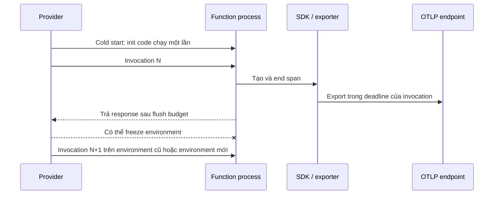
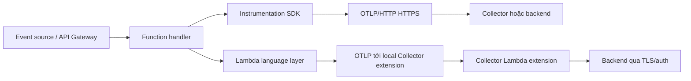

import { Step, Steps } from 'fumadocs-ui/components/steps';

<Callout type="info" title="Phạm vi và ví dụ">
  Serverless không phải là một runtime duy nhất. Trang này dùng **AWS Lambda với
  Node.js** để minh họa vì Lambda có hai sự kiện lifecycle quan trọng: invocation
  kết thúc và execution environment có thể được tái sử dụng hoặc bị đóng băng.
  Các nguyên tắc về timeout, memory, network và secret áp dụng rộng hơn, nhưng tên
  hook, layer và biến môi trường của AWS là đặc thù nền tảng. Hãy pin phiên bản
  SDK/layer và đối chiếu ma trận hỗ trợ của runtime trước khi triển khai.
</Callout>

## Mục lục

- [Mental model serverless](#mental-model-serverless)
  - [Process ngắn hạn và container bị đóng băng](#process-ngắn-hạn-và-container-bị-đóng-băng)
  - [Cold start](#cold-start)
  - [Không có daemon hoặc agent thường trú](#không-có-daemon-hoặc-agent-thường-trú)
  - [Những hệ quả cần nhớ](#những-hệ-quả-cần-nhớ)
- [Kiến trúc telemetry](#kiến-trúc-telemetry)
  - [Giả định runtime-neutral](#giả-định-runtime-neutral)
  - [Hai pattern triển khai](#hai-pattern-triển-khai)
- [Ví dụ chạy được: Node.js trên AWS Lambda](#ví-dụ-chạy-được-nodejs-trên-aws-lambda)
  - [Chuẩn bị và giới hạn phạm vi](#chuẩn-bị-và-giới-hạn-phạm-vi)
  - [Instrument function và export OTLP/HTTP](#instrument-function-và-export-otlphttp)
  - [Cấu hình deploy](#cấu-hình-deploy)
  - [Dùng Lambda layer và Collector extension](#dùng-lambda-layer-và-collector-extension)
- [Batching, sampling và flush](#batching-sampling-và-flush)
  - [Sampling ở SDK](#sampling-ở-sdk)
  - [Batching trong function](#batching-trong-function)
  - [Flush trước khi trả kết quả](#flush-trước-khi-trả-kết-quả)
- [Các giới hạn phải thiết kế trước](#các-giới-hạn-phải-thiết-kế-trước)
  - [Timeout và latency budget](#timeout-và-latency-budget)
  - [Memory và kích thước artifact](#memory-và-kích-thước-artifact)
  - [Network và TLS](#network-và-tls)
  - [Secrets và quyền truy cập](#secrets-và-quyền-truy-cập)
- [Xác minh end-to-end](#xác-minh-end-to-end)
  - [Kiểm tra trước deploy](#kiểm-tra-trước-deploy)
  - [Canary sau deploy](#canary-sau-deploy)
- [Failure modes và cách khoanh vùng](#failure-modes-và-cách-khoanh-vùng)
- [Best practices về cost và privacy](#best-practices-về-cost-và-privacy)
  - [Giảm cost mà không làm mất tín hiệu quan trọng](#giảm-cost-mà-không-làm-mất-tín-hiệu-quan-trọng)
  - [Privacy và governance](#privacy-và-governance)
- [Checklist production](#checklist-production)
- [Nguồn chính thức](#nguồn-chính-thức)

## Mental model serverless

Function-as-a-Service (FaaS) chạy code trong một execution environment do
provider tạo và quản lý. Bạn trả tiền cho thời gian function chạy, nhưng không
sở hữu lifecycle của process. Provider có thể tạo nhiều environment song song,
tái sử dụng một environment cho invocation tiếp theo, hoặc dừng nó sau khi
invocation hoàn tất.

Vì vậy, instrumentation serverless phải coi mỗi invocation là một cơ hội hữu hạn
để tạo và gửi telemetry. Đừng suy luận rằng một timer sẽ luôn chạy, một queue
trong RAM sẽ được drain, hoặc một process phụ sẽ còn sống sau khi handler return.

### Process ngắn hạn và container bị đóng băng

Trong mô hình process dài hạn, `BatchSpanProcessor` có thể chờ đến schedule delay
rồi export ở background. Trong Lambda, environment rảnh có thể bị **freeze**.
Timer và mọi process trong environment cũng bị dừng; khi environment được thaw,
chúng mới tiếp tục. Khoảng thời gian freeze không có SLA hữu ích cho việc flush.



`init` chạy một lần cho mỗi environment, không phải một lần cho toàn bộ
function. Vì thế, hãy tạo provider/exporter ngoài handler để tái sử dụng kết nối
khi warm, nhưng vẫn gọi `forceFlush` sau mỗi invocation nếu SDK hỗ trợ. Không
khởi tạo rồi shutdown toàn bộ SDK trong từng request: cách đó làm mất warm reuse,
tăng handshake và tăng latency.

### Cold start

**Cold start** là chi phí khi provider phải tạo execution environment mới và chạy
phần khởi tạo trước invocation đầu tiên. Dependency lớn, auto-instrumentation
nhiều module, resource detector chậm, TLS handshake và DNS lookup đều có thể làm
cold start dài hơn.

Đo cold start riêng với warm invocation. Đặt `service.name` và
`deployment.environment.name` ổn định để so sánh cùng một service; không dùng
`service.instance.id` làm tên service. Chỉ bật instrumentation cần thiết, lazy
load thư viện nặng, và không gọi backend telemetry trong init nếu request đầu
tiên chưa cần nó.

<Callout type="warn" title="Instrumentation không làm cold start miễn phí">
  Auto-instrumentation tiện lợi nhưng vẫn nạp code và có thể patch nhiều module.
  Layer cũng làm tăng kích thước artifact và memory high-water mark. Hãy đo p50,
  p95 cold start sau khi thêm layer, thay vì dùng con số benchmark của runtime
  khác.
</Callout>

### Không có daemon hoặc agent thường trú

“Không daemon/agent” nghĩa là application không nên tự khởi chạy một Collector
hoặc process nền rồi trông chờ process đó sống độc lập như trên VM. Function chỉ
có thể gửi trực tiếp đến OTLP endpoint, hoặc gửi đến một integration mà platform
quản lý lifecycle cho nó.

AWS Lambda là ngoại lệ có cấu trúc: Lambda Extension API cho phép một **extension**
chạy trong cùng execution environment. OpenTelemetry Lambda cung cấp Collector
extension layer và language-specific layer. Extension này không biến Lambda thành
một host daemon bền vững; nó vẫn bị freeze, có giới hạn memory chung và mất khi
environment bị thu hồi.

### Những hệ quả cần nhớ

- **Async export chưa đủ:** promise hoặc timer chưa hoàn tất khi handler return có
  thể bị freeze hoặc bị cắt. Cần `await` flush có deadline.
- **Một invocation có thể tạo nhiều span:** instrumentation ở init phải an toàn
  khi environment được warm reuse. Không đăng ký global provider lặp lại.
- **Một process không đại diện cho toàn function:** scale-out tạo nhiều
  environment. Metrics state trong từng process không phải một bộ đếm toàn cục.
- **Retry phải hữu hạn:** retry dài hơn thời gian còn lại của invocation chỉ làm
  function timeout. Khi downstream lỗi, chấp nhận drop có chủ đích và quan sát
  drop count thay vì block vô hạn.

## Kiến trúc telemetry

### Giả định runtime-neutral

Phần này dùng các giả định có thể chuyển sang Azure Functions, Google Cloud
Functions hoặc runtime serverless khác:

1. Handler nhận một invocation và có một deadline còn lại.
2. Code ngoài handler có thể được chạy lại hoặc được giữ lại cho warm invocation.
3. Process không được đảm bảo chạy nền giữa hai invocation.
4. Network egress tới OTLP endpoint có thể bị giới hạn bởi VPC, firewall, proxy
   hoặc policy của provider.
5. SDK đang dùng có tracer provider, OTLP exporter, batch processor và API
   `forceFlush`/`shutdown` tương ứng. Tên class, hook và mức hỗ trợ là đặc thù
   ngôn ngữ.

Các giả định này không nói rằng mọi FaaS có cùng semantics. Hãy thay `context`
AWS bằng deadline/lifecycle hook của platform đang dùng.

### Hai pattern triển khai

Có hai đường dữ liệu phổ biến:



| Pattern | Khi dùng | Trade-off |
| --- | --- | --- |
| **Function → OTLP/HTTP** | Function có egress trực tiếp tới gateway/backend và muốn kiểm soát code | Ít thành phần hơn, nhưng function chịu DNS, TLS, auth, retry và flush latency. |
| **Function/layer → provider layer** | Nền tảng có integration được hỗ trợ, ví dụ OpenTelemetry Lambda layers | Giảm code ứng dụng và có thể export bất đồng bộ qua extension; phải pin layer, kiểm tra support matrix và cộng memory/layer size. |

OpenTelemetry khuyến nghị dùng Collector trong production khi có thể. Với
serverless, Collector có thể là gateway bên ngoài hoặc một extension layer. Không
đặt credential backend rộng quyền trong từng function nếu một gateway/extension
đã có thể giữ credential và áp policy tập trung.

## Ví dụ chạy được: Node.js trên AWS Lambda

Ví dụ này dùng **Node.js 20+**, JavaScript ESM, AWS Lambda handler async và
OTLP/HTTP protobuf. Nó instrument một span function thủ công, xuất traces trực
tiếp tới endpoint đã cấu hình, và tạo một counter metrics để minh họa hai signal.
Ví dụ không phụ thuộc Express hay HTTP server vì Lambda không tự mở port lắng
nghe.

<Callout type="warn" title="Ví dụ trực tiếp không thay thế layer">
  Đây là pattern SDK trong process. Nếu dùng OpenTelemetry Lambda Node.js layer,
  hãy theo đúng README của release layer và để wrapper/layer sở hữu phần
  instrumentation. Không cài đồng thời hai bộ auto-instrumentation cho cùng một
  module nếu chưa kiểm tra duplicate spans.
</Callout>

### Chuẩn bị và giới hạn phạm vi

Cài các package cần cho trace, metric và OTLP/HTTP protobuf:

```bash
npm install @opentelemetry/api \
  @opentelemetry/resources \
  @opentelemetry/sdk-trace-node \
  @opentelemetry/sdk-metrics \
  @opentelemetry/exporter-trace-otlp-proto \
  @opentelemetry/exporter-metrics-otlp-proto
```

Pin các package trong lockfile. SDK JavaScript có thể thay đổi API giữa major
version; code dưới đây là ví dụ cho API Node.js hiện hành và phải được compile,
unit test cùng lockfile của project.

### Instrument function và export OTLP/HTTP

Tạo provider ở module scope. `BatchSpanProcessor` giúp không gửi request mạng
đồng bộ ở mỗi `span.end()`. Handler gọi `forceFlush` trước khi return, nhưng chỉ
dùng phần thời gian còn lại được platform cấp.

```js title="telemetry.mjs"
import { trace } from '@opentelemetry/api';
import { resourceFromAttributes } from '@opentelemetry/resources';
import { NodeTracerProvider } from '@opentelemetry/sdk-trace-node';
import { BatchSpanProcessor } from '@opentelemetry/sdk-trace-base';
import { OTLPTraceExporter } from '@opentelemetry/exporter-trace-otlp-proto';
import { MeterProvider, PeriodicExportingMetricReader } from '@opentelemetry/sdk-metrics';
import { OTLPMetricExporter } from '@opentelemetry/exporter-metrics-otlp-proto';

const resource = resourceFromAttributes({
  'service.name': process.env.OTEL_SERVICE_NAME ?? 'orders-function',
  'deployment.environment.name': process.env.DEPLOYMENT_ENVIRONMENT ?? 'staging',
  'service.version': process.env.SERVICE_VERSION ?? 'dev',
});

const traces = new OTLPTraceExporter({
  // Endpoint theo signal được dùng nguyên trạng: phải có /v1/traces.
  url: process.env.OTEL_EXPORTER_OTLP_TRACES_ENDPOINT,
  headers: process.env.OTEL_EXPORTER_OTLP_HEADERS
    ? { authorization: process.env.OTEL_EXPORTER_OTLP_HEADERS }
    : {},
});

const tracerProvider = new NodeTracerProvider({
  resource,
  spanProcessors: [
    new BatchSpanProcessor(traces, {
      maxQueueSize: 256,
      maxExportBatchSize: 64,
      scheduledDelayMillis: 1000,
      exportTimeoutMillis: 800,
    }),
  ],
});
tracerProvider.register();

const metrics = new OTLPMetricExporter({
  url: process.env.OTEL_EXPORTER_OTLP_METRICS_ENDPOINT,
  headers: process.env.OTEL_EXPORTER_OTLP_HEADERS
    ? { authorization: process.env.OTEL_EXPORTER_OTLP_HEADERS }
    : {},
});
const meterProvider = new MeterProvider({
  resource,
  readers: [
    new PeriodicExportingMetricReader({
      exporter: metrics,
      exportIntervalMillis: 5000,
      exportTimeoutMillis: 800,
    }),
  ],
});

const tracer = trace.getTracer('orders-function');
const meter = meterProvider.getMeter('orders-function');
const invocations = meter.createCounter('orders.function.invocations');

export { meterProvider, tracer, tracerProvider, invocations };
```

Tạo handler và một helper flush có deadline:

```js title="handler.mjs"
import {
  invocations,
  meterProvider,
  tracer,
  tracerProvider,
} from './telemetry.mjs';

const withTimeout = (promise, milliseconds) =>
  Promise.race([
    promise,
    new Promise((_, reject) =>
      setTimeout(() => reject(new Error('telemetry flush deadline exceeded')), milliseconds),
    ),
  ]);

export const handler = async (event, context) => {
  // Không chờ các socket telemetry trong event loop sau khi đã quyết định return.
  context.callbackWaitsForEmptyEventLoop = false;

  const span = tracer.startSpan('orders.process');
  invocations.add(1, { 'faas.trigger': 'http' });

  try {
    span.setAttribute('orders.event_type', event?.type ?? 'unknown');
    // Business logic thật nằm ở đây; không ghi token, body nhạy cảm hoặc user ID
    // chưa được allowlist vào span.
    return { statusCode: 200, body: JSON.stringify({ ok: true }) };
  } catch (error) {
    span.recordException(error);
    span.setStatus({ code: 2, message: error.message });
    throw error;
  } finally {
    span.end();

    // Giữ lại một phần nhỏ cho Lambda hoàn tất response. Không block vô hạn.
    const remaining = context.getRemainingTimeInMillis();
    const flushBudget = Math.max(50, Math.min(700, remaining - 100));

    try {
      await withTimeout(
        Promise.all([
          tracerProvider.forceFlush(),
          meterProvider.forceFlush(),
        ]),
        flushBudget,
      );
    } catch (flushError) {
      // Ghi log đã redact; không làm request thành công thành lỗi chỉ vì telemetry.
      console.error('OpenTelemetry flush failed', { message: flushError.message });
    }
  }
};
```

Trong deployment, đặt hai endpoint signal-specific:

```text
OTEL_EXPORTER_OTLP_TRACES_ENDPOINT=https://otel-gateway.example.com/v1/traces
OTEL_EXPORTER_OTLP_METRICS_ENDPOINT=https://otel-gateway.example.com/v1/metrics
OTEL_EXPORTER_OTLP_PROTOCOL=http/protobuf
OTEL_EXPORTER_OTLP_TIMEOUT=800
```

`OTEL_EXPORTER_OTLP_TRACES_ENDPOINT` và `..._METRICS_ENDPOINT` là endpoint theo
signal nên được dùng nguyên trạng. Nếu dùng `OTEL_EXPORTER_OTLP_ENDPOINT` chung,
đó là base URL và SDK nối thêm `/v1/traces`, `/v1/metrics` hoặc `/v1/logs` theo
OTLP exporter specification. Luôn kiểm tra SDK Node đang dùng có đọc environment
hay không; exporter được khởi tạo bằng code có thể chỉ dùng option `url`.

<Callout type="error" title="Không coi forceFlush là bảo đảm tuyệt đối">
  `forceFlush` chỉ cố gắng export các record mà SDK đang giữ. Process bị kill,
  network bị chặn, timeout hết hạn hoặc queue đã drop vẫn gây mất dữ liệu. Flush
  chỉ nên nằm trong một budget hữu hạn và phải có metric/log để phát hiện thất bại.
</Callout>

### Cấu hình deploy

Ví dụ CloudFormation/SAM tối giản dưới đây chỉ minh họa các knobs của Lambda.
Giá trị memory, timeout và VPC phải được load test theo workload thật.

```yaml title="template.yaml"
Resources:
  OrdersFunction:
    Type: AWS::Serverless::Function
    Properties:
      Runtime: nodejs20.x
      Handler: src/handler.handler
      CodeUri: .
      MemorySize: 512
      Timeout: 10
      Tracing: Active
      Environment:
        Variables:
          OTEL_SERVICE_NAME: orders-function
          DEPLOYMENT_ENVIRONMENT: production
          SERVICE_VERSION: 2026.03.0
          OTEL_EXPORTER_OTLP_PROTOCOL: http/protobuf
          OTEL_EXPORTER_OTLP_TRACES_ENDPOINT: https://otel-gateway.example.com/v1/traces
          OTEL_EXPORTER_OTLP_METRICS_ENDPOINT: https://otel-gateway.example.com/v1/metrics
          OTEL_EXPORTER_OTLP_TIMEOUT: "800"
      Policies:
        - Statement:
            - Effect: Allow
              Action:
                - secretsmanager:GetSecretValue
              Resource: arn:aws:secretsmanager:REGION:ACCOUNT:secret:otel/orders-*
```

Đây là các runtime-neutral assumption phía sau manifest:

- Function có quyền egress tới `otel-gateway.example.com:443`.
- Gateway xác minh TLS và xác thực request OTLP.
- Secret manager inject header/token lúc runtime; endpoint không chứa credential.
- `Timeout` lớn hơn business deadline cộng instrumentation overhead và flush
  budget. `OTEL_EXPORTER_OTLP_TIMEOUT` nhỏ hơn timeout của function.
- Provider được khởi tạo một lần trong execution environment và không shutdown
  trong mỗi invocation.

Trong production, không ghi API key trực tiếp trong `template.yaml`. Cách inject
secret phụ thuộc framework và secret manager. Nếu SDK chỉ nhận header qua
environment, đặt environment từ cơ chế secret injection của platform và cấm log
ra effective environment.

### Dùng Lambda layer và Collector extension

OpenTelemetry Lambda repository cung cấp language-specific layer cho Node.js và
Collector Lambda layer. Node.js layer dùng execution wrapper; đặt
`AWS_LAMBDA_EXEC_WRAPPER=/opt/otel-handler` theo README của layer. Layer language
và Collector phải cùng kiến trúc, vùng AWS và release compatibility.

Quy trình tổng quát:

<Steps>
<Step>

**Chọn release và layer đúng runtime**

Lấy ARN/version từ release chính thức của
[OpenTelemetry Lambda](https://github.com/open-telemetry/opentelemetry-lambda/releases),
không copy một ARN không có region hoặc version. Pin version trong IaC và review
thay đổi support matrix trước khi nâng.

</Step>
<Step>

**Bật wrapper và cấu hình exporter**

Thêm Node.js layer, Collector extension layer nếu pattern của release yêu cầu,
và đặt `AWS_LAMBDA_EXEC_WRAPPER=/opt/otel-handler`. Cấu hình endpoint/backend
bằng biến môi trường hoặc `OPENTELEMETRY_COLLECTOR_CONFIG_URI` theo README của
Collector layer.

</Step>
<Step>

**Kiểm tra component của Collector layer**

Một Lambda layer là distribution bị rút gọn, không có mọi receiver, processor
hoặc exporter của Collector Contrib. Kiểm tra component list và validate config
bằng đúng release. Đừng giả định một processor có trong image Collector đầy đủ
sẽ có trong layer.

</Step>
<Step>

**Đo cold start và flush latency**

So sánh invocation chưa instrument, warm invocation và cold invocation. Đọc
CloudWatch duration, timeout, memory high-water mark và log của extension. Chỉ
bật auto-instrumentation cần thiết.

</Step>
</Steps>

Collector extension có thể export bất đồng bộ qua lifecycle của extension. Tuy
nhiên, Lambda environment vẫn có thể freeze và extension vẫn dùng memory, CPU,
network của function. README chính thức của OpenTelemetry Lambda mô tả việc flush
TracerProvider/MeterProvider ở cuối invocation và cơ chế `decouple` để tách phần
function return khỏi phần export. Hãy dùng config do release cung cấp thay vì tự
bịa một địa chỉ `localhost` hoặc thêm processor không có trong layer.

<Callout type="warn" title="Support matrix thay đổi theo release">
  Repository OpenTelemetry Lambda hiện liệt kê support khác nhau giữa Node,
  Python, Java, .NET, Go và Ruby; bảng của Node không đồng nghĩa mọi signal đều
  được hỗ trợ như nhau. Đặc biệt, hãy xác minh metrics/logs, incoming context và
  auto-instrumentation của đúng layer version trước khi chọn layer thay cho SDK
  trực tiếp.
</Callout>

## Batching, sampling và flush

Ba cơ chế này giải quyết ba vấn đề khác nhau:

- **Sampling** quyết định record/trace nào được ghi và export.
- **Batching** gom record để giảm số request và overhead mạng.
- **Flush** đẩy phần đang chờ trước khi platform kết thúc hoặc freeze invocation.

Không dùng một cơ chế để thay thế cơ chế khác. Sampling 5% không ngăn queue đầy
khi traffic tăng 100 lần. Flush không khôi phục record đã bị sampling drop.

### Sampling ở SDK

Head sampling đưa ra quyết định sớm, thường dựa trên trace ID. Nó rẻ và phù hợp
với function vì giảm CPU, memory và bytes ngay trong process. Một cấu hình ratio
portable theo OpenTelemetry environment specification là:

```bash
OTEL_TRACES_SAMPLER=parentbased_traceidratio
OTEL_TRACES_SAMPLER_ARG=0.10
```

Cấu hình này lấy khoảng 10% root traces và tôn trọng sampling decision của parent.
Trong production, cân nhắc giữ 100% lỗi hoặc trace latency cao ở tail sampler
phía gateway/backend. Tail sampling cần nhìn nhiều hoặc toàn bộ spans của trace,
đòi hỏi state và routing theo `trace_id`; function không phải nơi thích hợp để tự
vận hành tail sampler.

Sampling là policy cost và điều tra, không phải policy privacy duy nhất. Dữ liệu
không được phép thu thập vẫn phải được loại bỏ trước khi sampler quyết định.

### Batching trong function

Batching giảm số lần TLS/HTTP request nhưng tạo queue trong memory. Với function
ngắn, batch size và delay phải nhỏ hơn workload dài hạn:

| Tham số | Điểm bắt đầu cho ví dụ | Trade-off |
| --- | ---: | --- |
| `maxQueueSize` | `256` spans | Lớn hơn hấp thụ burst tốt hơn, nhưng tốn memory và mất nhiều hơn khi crash. |
| `maxExportBatchSize` | `64` spans | Lớn hơn giảm request count, nhưng payload và flush time tăng. |
| Schedule delay | `1000 ms` | Chỉ là fallback khi invocation còn sống; không chờ timer để bảo đảm export. |
| Export timeout | `800 ms` | Phải nhỏ hơn phần time budget dành cho telemetry. |

Tuning thực tế cần số span/invocation, concurrency, payload size, cold-start rate
và latency của gateway. Nếu function thường kết thúc trước schedule delay, chỉ
`forceFlush` mới gửi batch; nếu queue liên tục đầy, giảm dữ liệu hoặc tăng capacity
có chủ đích thay vì tăng queue vô hạn.

### Flush trước khi trả kết quả

Trình tự an toàn nhất là:

```text
end span
  → ngừng nhận work mới
  → forceFlush traces/metrics/logs với deadline
  → trả response
  → để platform freeze hoặc thu hồi environment
```

Trong Node.js, gọi `forceFlush` ở `finally` để cả success và error đều được xử lý.
Dùng `context.getRemainingTimeInMillis()` để tính budget. Không gọi `shutdown()`
trong mỗi invocation vì warm invocation tiếp theo sẽ nhận provider đã đóng. Chỉ
shutdown một lần khi runtime có lifecycle hook thật sự cho phép; nếu không có hook,
force flush cuối invocation là giới hạn thực tế.

Nếu flush làm tăng latency đáng kể, chuyển export sang Collector extension/provider
layer có lifecycle serverless phù hợp, giảm batch và sampling, hoặc chấp nhận mất
một phần telemetry không quan trọng. Không “giải quyết” bằng cách bỏ `await`.

## Các giới hạn phải thiết kế trước

### Timeout và latency budget

Function timeout phải chứa cả business work và instrumentation overhead:

```text
function timeout
  ≥ business deadline
  + SDK/serialization time
  + network/TLS/export timeout
  + flush margin
```

Đặt exporter timeout thấp hơn function timeout. Trong ví dụ, exporter timeout
`800 ms` và helper giữ lại `100 ms` cho function hoàn tất. Các con số này không
phải default universal.

Theo dõi riêng `Duration` và `Max Memory Used` của invocation. Một request OTLP
bị retry nhiều lần có thể biến lỗi telemetry thành timeout business. Retry hữu hạn
và backoff có jitter ở gateway thường an toàn hơn retry dài trong function.

### Memory và kích thước artifact

Memory của serverless bao gồm code, dependencies, SDK, queue, serialization,
TLS buffers và Collector extension nếu có. Batch queue tăng theo số record và
kích thước attributes. Raw URL, request body, stack trace lớn hoặc user-defined
attributes có thể làm payload phình to.

Giảm rủi ro bằng cách:

- chỉ cài instrumentation cần dùng;
- giới hạn span attributes, event count và value length;
- allowlist attributes cardinality thấp cho metrics;
- đặt queue/batch nhỏ rồi load test;
- kiểm tra kích thước unzipped function + layers theo giới hạn provider;
- so sánh memory high-water mark trước và sau khi thêm layer.

OpenTelemetry Lambda design proposal lưu ý Collector Contrib đầy đủ quá lớn cho
layer, nên layer được rút gọn theo component. Đó là lý do không thể copy nguyên
config Collector trên VM vào Lambda layer mà không validate.

### Network và TLS

Function không có network path mặc định tới mọi endpoint. Khi gắn Lambda vào VPC,
subnet route, NAT hoặc VPC endpoint và security group phải cho phép egress tới
Collector/backend. DNS failure, NAT exhaustion và proxy idle timeout đều có thể
làm OTLP export thất bại.

Dùng OTLP/HTTP protobuf qua HTTPS khi endpoint hoặc gateway hỗ trợ. OTLP exporter
specification định nghĩa `http/protobuf`, `grpc` và tùy chọn `http/json`; SDK phải
hỗ trợ ít nhất một transport, không phải mọi SDK hỗ trợ cả ba. Với HTTP:

- endpoint chung là base URL, exporter thêm `/v1/traces`, `/v1/metrics`, `/v1/logs`;
- endpoint theo signal dùng nguyên trạng;
- `https` bật TLS; CA, client certificate và private key phải được cấu hình theo
  khả năng SDK;
- `gzip` có thể giảm bytes nhưng dùng thêm CPU;
- không dùng `insecure_skip_verify` hoặc plaintext qua Internet.

Collector hoặc gateway nên là trust boundary: nhận OTLP từ function, xác minh
TLS/auth, redaction nếu cần, rồi export tới backend. Không mở OTLP receiver công
khai không có authentication, rate limit và network policy.

### Secrets và quyền truy cập

Secret cần một vòng đời khác với code. Dùng Secrets Manager, Parameter Store,
workload identity hoặc cơ chế secret injection của provider. Không commit token,
private key, API key hoặc `.env` thật vào repository hay layer.

- Cấp IAM permission chỉ đọc đúng secret cần cho function.
- Không đặt secret trong `service.name`, resource attributes, baggage hoặc span
  attributes.
- Không log toàn bộ `process.env`, effective Collector config hay OTLP headers.
- Mount CA/certificate read-only nếu SDK hỗ trợ file path.
- Rotate credential và kiểm tra warm environment có reload secret hay cần tạo
  environment mới.
- Dùng token ingest giới hạn tenant/signal; không dùng credential quản trị.

<Callout type="error" title="Telemetry có thể chứa dữ liệu ứng dụng">
  Auto-instrumentation có thể ghi URL, database statement, exception và HTTP
  headers tùy instrumentation. Mặc định hãy coi telemetry là dữ liệu nhạy cảm.
  Redact ở instrumentation/gateway trước khi gửi ra ngoài; không trông chờ
  sampling sẽ xóa PII.
</Callout>

## Xác minh end-to-end

### Kiểm tra trước deploy

<Steps>
<Step>

**Kiểm tra dependency và bundle**

```bash
npm ci
npm test
npm run build --if-present
```

Kiểm tra handler import được trong Node.js cùng version với Lambda. Đừng chỉ
chạy trên macOS rồi deploy binary native chưa build cho Linux/architecture đích.

</Step>
<Step>

**Kiểm tra cấu hình đã redact**

Xác nhận `service.name`, environment, protocol, hostname, path, timeout và
sampling ratio. In ra host/path đã che credential, không in giá trị header.

</Step>
<Step>

**Kiểm tra OTLP receiver bằng canary**

Nếu dùng Collector gateway, gửi một trace canary tới gateway trong staging và
xác minh Collector accepted, exporter sent và backend query được trace ID. `curl`
GET vào `/v1/traces` chỉ kiểm tra HTTP route, không phải payload OTLP hợp lệ.

</Step>
</Steps>

### Canary sau deploy

Gọi function với một marker không chứa dữ liệu cá nhân:

```bash
aws lambda invoke \
  --function-name orders-function-staging \
  --payload '{"type":"otel-canary-2026-03"}' \
  --cli-binary-format raw-in-base64-out \
  /tmp/orders-response.json

cat /tmp/orders-response.json
aws logs tail /aws/lambda/orders-function-staging --since 5m
```

Xác minh theo từng hop:

1. Response thành công chứng minh handler chạy, không chứng minh telemetry được
   export.
2. Log SDK/extension không có `ECONNREFUSED`, TLS handshake, `401`, `403` hoặc
   timeout.
3. Collector gateway có accepted và sent tăng theo signal.
4. Backend tìm được trace theo `service.name`, environment và trace ID.
5. Metrics xuất hiện sau một chu kỳ reader; đừng kết luận mất metrics ngay sau
   invocation đầu.

Chạy test cold start và warm invocation riêng. Tạo burst với concurrency cao để
kiểm tra queue, NAT, backend rate limit và duplicate instrumentation. Test một
lần timeout business có chủ đích để xác minh span lỗi được end và flush vẫn có
budget.

## Failure modes và cách khoanh vùng

| Triệu chứng | Nguyên nhân thường gặp | Cách xử lý |
| --- | --- | --- |
| Không có spans | Provider chưa đăng ký trước handler, exporter không được tạo, sampler off | Kiểm tra module init, final Resource và sampler; chạy console/in-memory exporter trong test. |
| Span cuối invocation bị mất | Handler return trước batch export hoặc environment bị freeze | `await forceFlush` với deadline; giảm batch; dùng integration layer có flush hook. |
| Function timeout sau khi bật OTel | Flush/retry dùng hết thời gian còn lại | Đặt exporter timeout thấp hơn function timeout; dùng remaining-time budget và retry hữu hạn. |
| Warm invocation không có telemetry | Gọi `shutdown()` sau invocation trước | Không shutdown provider mỗi lần; khởi tạo một lần ngoài handler. |
| Cold start tăng mạnh | Layer/dependency nặng hoặc patch quá nhiều module | Chỉ bật instrumentation cần thiết; đo bundle, init duration và memory. |
| `404` từ OTLP/HTTP | Dùng endpoint theo signal nhưng thiếu `/v1/traces` | Thêm path đầy đủ cho endpoint theo signal hoặc dùng base endpoint chung. |
| `4318` không nhận dữ liệu | SDK đang dùng gRPC hoặc Collector chỉ bật gRPC | Đặt protocol rõ ràng và bật receiver tương ứng; không trộn port/protocol. |
| TLS handshake thất bại | CA/SAN sai, clock lệch, proxy hoặc private key không đọc được | Kiểm tra chain, hostname, file permissions, route; không tắt verify. |
| `ECONNREFUSED`/DNS error | VPC không có egress, sai hostname, gateway không listen | Kiểm tra route/NAT/security group/DNS từ subnet Lambda và gateway logs. |
| `401` hoặc `403` | Header/token sai, secret hết hạn, IAM/tenant sai | Kiểm tra injection đã redact và quyền tối thiểu; rotate secret. |
| Metrics không xuất hiện | Chưa tới periodic interval, reader chưa flush, layer không support metrics | Chờ interval hoặc force flush SDK trực tiếp; kiểm tra support matrix layer. |
| Dữ liệu trùng | Bật layer auto-instrumentation và code instrumentation cùng module | Chỉ sở hữu một instrumentation path; kiểm tra trace/span count. |
| Queue/memory tăng | Backend chậm, batch quá lớn, attributes/metrics cardinality cao | Giảm payload/cardinality, giới hạn queue, sửa downstream hoặc giảm sampling. |
| Backend có trace nhưng thiếu spans | Head/tail sampling, queue drop hoặc route theo trace sai | Kiểm tra sampling decision, dropped counters và collector routing. |
| Health xanh nhưng backend trống | Health chỉ kiểm tra process/extension | Dùng canary end-to-end và đối chiếu accepted/sent/backend query. |

Khoanh vùng theo thứ tự **SDK → function deadline → network/TLS → Collector →
backend**. Không bắt đầu bằng việc đổi sampling hoặc restart layer khi lỗi có thể
chỉ là endpoint sai. Dùng cùng một canary marker ở mọi hop để biết record biến mất
ở đâu.

## Best practices về cost và privacy

### Giảm cost mà không làm mất tín hiệu quan trọng

- **Sampling theo traffic:** giữ tỷ lệ cao hơn cho error/high-latency hoặc service
  ít traffic; dùng head sampling trong function nếu cần giảm bytes sớm.
- **Giữ metrics aggregate:** không thêm `user.id`, `order.id`, raw URL hoặc email
  vào metric attributes. Cardinality cao tạo nhiều time series và tăng ingest cost.
- **Batch có giới hạn:** batch giảm số request nhưng queue và flush latency cũng là
  cost. Tuning theo số invocation và payload thật.
- **Chọn signal:** traces, metrics và logs có volume/cost khác nhau. Bật signal khi
  có use case và pipeline backend tương ứng; test từng signal.
- **Collector gần function:** một gateway có thể gom auth, retry, routing,
  redaction và sampling thay vì mỗi function mở nhiều kết nối backend.
- **Theo dõi cost driver:** số invocation, cold start duration, memory tier, egress
  bytes, OTLP requests, telemetry records, retry và backend retention.

OpenTelemetry mô tả sampling là một cách giảm noise và cost, nhưng sampling tail
cần component stateful và tài nguyên vận hành. Với function volume thấp, 100% trace
có thể đơn giản và rẻ hơn việc vận hành tail sampler. Quyết định bằng số liệu,
không dùng một ratio chung cho mọi function.

### Privacy và governance

- Thiết lập allowlist fields trước khi instrument database/HTTP client.
- Redact authorization, cookie, query chứa secret, request body và PII.
- Dùng `service.name`, environment và version ổn định; không dùng identifier cá
  nhân làm resource attribute cardinality cao.
- Giới hạn retention ở backend và kiểm tra access audit.
- Tách staging/production dataset, endpoint và credential.
- Xem xét region/data residency khi function gửi OTLP qua Internet.
- Ghi lại signal nào được thu, sampling policy, redaction rule và owner chịu trách
  nhiệm khi có incident.

<Callout type="idea" title="Canary an toàn">
  Canary nên dùng một giá trị cố định như `otel-canary-2026-03`, không dùng email,
  token hoặc payload người dùng. Trace ID và service identity đủ để tìm data path.
</Callout>

## Checklist production

- [ ] Đã xác định runtime, platform lifecycle và hook deadline thật.
- [ ] Provider/exporter được tạo một lần ngoài handler; không shutdown mỗi invocation.
- [ ] Handler end span trong `finally` và force flush với budget hữu hạn.
- [ ] OTLP protocol, port, path và TLS khớp ở hai đầu.
- [ ] Endpoint theo signal có path đầy đủ; endpoint chung được dùng như base URL.
- [ ] Sampling policy được ghi rõ và tôn trọng parent context.
- [ ] Batch queue, batch size, timeout và memory được load test.
- [ ] Cold start, warm latency, timeout rate và memory high-water mark có baseline.
- [ ] VPC/egress/DNS/NAT/firewall đã được test từ execution environment thật.
- [ ] Secret không nằm trong source, IaC plaintext, log, baggage hoặc attributes.
- [ ] Layer/SDK/Collector distribution được pin version và validate đúng artifact.
- [ ] Không có duplicate instrumentation khi kết hợp layer với code.
- [ ] Canary kiểm tra SDK → Collector → backend cho từng signal.
- [ ] Đã test backend outage, TLS/auth failure, queue full và function timeout.
- [ ] Có cảnh báo cho flush failure, exporter failure, dropped data, duration,
      memory và backend ingest.

## Nguồn chính thức

- [OpenTelemetry: Functions as a Service](https://opentelemetry.io/docs/platforms/faas/)
- [OpenTelemetry Lambda repository](https://github.com/open-telemetry/opentelemetry-lambda)
- [OpenTelemetry Lambda Node.js layer](https://github.com/open-telemetry/opentelemetry-lambda/tree/main/nodejs)
- [OpenTelemetry Lambda Collector layer](https://github.com/open-telemetry/opentelemetry-lambda/tree/main/collector)
- [OpenTelemetry JavaScript: Node.js getting started](https://opentelemetry.io/docs/languages/js/getting-started/nodejs/)
- [OpenTelemetry JavaScript: OTLP exporters](https://opentelemetry.io/docs/languages/js/exporters/)
- [OTLP exporter specification](https://opentelemetry.io/docs/specs/otel/protocol/exporter/)
- [Tracing SDK specification: ForceFlush và Shutdown](https://opentelemetry.io/docs/specs/otel/trace/sdk/)
- [OpenTelemetry sampling](https://opentelemetry.io/docs/concepts/sampling/)
- [AWS Lambda layers](https://docs.aws.amazon.com/lambda/latest/dg/chapter-layers.html)
- [AWS Lambda extensions](https://docs.aws.amazon.com/lambda/latest/dg/runtimes-extensions-api.html)

<Cards>
  <Card title="Cấu hình SDK" href="/instrumentation/configuration/" description="Endpoint, batch, sampler, resource và lifecycle flush theo specification." />
  <Card title="Networking và TLS" href="/deployment/networking-tls/" description="Thiết kế trust boundary, egress và mTLS cho OTLP." />
  <Card title="Cost control" href="/production/cost-control/" description="Sampling, cardinality, retention và các cost driver của telemetry." />
</Cards>
