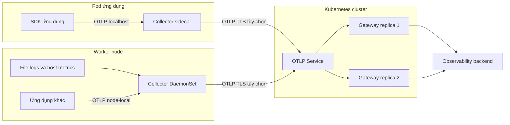

import { Step, Steps } from 'fumadocs-ui/components/steps';
import { Tab, Tabs } from 'fumadocs-ui/components/tabs';

Collector **agent** và **gateway** là vai trò triển khai, không phải hai binary
khác nhau. Sidecar đặt agent trong cùng Pod với ứng dụng. DaemonSet đặt một agent
trên mỗi node phù hợp. Deployment thường chạy gateway tập trung sau một Service.

<Callout type="info" title="Phạm vi và giả định">
  Trang này tập trung vào OpenTelemetry Collector trong Kubernetes. Manifest dùng
  image `ghcr.io/open-telemetry/opentelemetry-collector-releases/opentelemetry-collector-k8s:0.157.0`
  và `debug` exporter để có thể kiểm tra trong lab. Hãy thay image bằng artifact đã
  được duyệt, kiểm tra component inventory và thay `debug` bằng backend exporter
  có TLS, authentication, queue và retry trước production.
</Callout>

## Mục lục

- [Mental model và phạm vi](#mental-model-và-phạm-vi)
  - [Sidecar là gì](#sidecar-là-gì)
  - [DaemonSet là gì](#daemonset-là-gì)
  - [Deployment gateway là gì](#deployment-gateway-là-gì)
- [Sơ đồ và nguyên tắc chọn](#sơ-đồ-và-nguyên-tắc-chọn)
  - [Sơ đồ topology](#sơ-đồ-topology)
  - [Bảng quyết định](#bảng-quyết-định)
- [So sánh isolation chi phí và scaling](#so-sánh-isolation-chi-phí-và-scaling)
  - [Isolation và failure domain](#isolation-và-failure-domain)
  - [Chi phí và resource overhead](#chi-phí-và-resource-overhead)
  - [Scaling và network](#scaling-và-network)
- [Chọn theo signal](#chọn-theo-signal)
  - [Logs](#logs)
  - [Metrics](#metrics)
  - [Traces](#traces)
- [Manifest mẫu cho sidecar](#manifest-mẫu-cho-sidecar)
  - [Cấu hình sidecar](#cấu-hình-sidecar)
  - [Triển khai sidecar](#triển-khai-sidecar)
- [Manifest mẫu cho DaemonSet](#manifest-mẫu-cho-daemonset)
  - [Cấu hình DaemonSet](#cấu-hình-daemonset)
  - [Triển khai DaemonSet](#triển-khai-daemonset)
- [Tài nguyên bảo mật và lifecycle](#tài-nguyên-bảo-mật-và-lifecycle)
  - [Requests limits và memory](#requests-limits-và-memory)
  - [Security context và quyền](#security-context-và-quyền)
  - [Probes và graceful shutdown](#probes-và-graceful-shutdown)
  - [Cập nhật cấu hình và image](#cập-nhật-cấu-hình-và-image)
- [Xác minh end to end](#xác-minh-end-to-end)
  - [Kiểm tra tĩnh và Kubernetes objects](#kiểm-tra-tĩnh-và-kubernetes-objects)
  - [Gửi canary cho ba signal](#gửi-canary-cho-ba-signal)
  - [Đối chiếu backend và internal telemetry](#đối-chiếu-backend-và-internal-telemetry)
- [Failure modes và cách xử lý](#failure-modes-và-cách-xử-lý)
- [Migration guidance](#migration-guidance)
  - [Từ sidecar sang DaemonSet](#từ-sidecar-sang-daemonset)
  - [Từ DaemonSet sang gateway](#từ-daemonset-sang-gateway)
  - [Rollback](#rollback)
- [Checklist production](#checklist-production)
- [Nguồn chính thức](#nguồn-chính-thức)

## Mental model và phạm vi

**Locality** là khoảng cách từ nguồn telemetry đến Collector. Sidecar có locality
mức Pod vì ứng dụng gọi `localhost`. DaemonSet có locality mức node. Gateway có
locality mức cluster, region hoặc data center.

**Failure domain** là phạm vi workload chịu ảnh hưởng khi một thành phần lỗi.
Một sidecar lỗi thường chỉ làm mất đường telemetry của một Pod. DaemonSet lỗi có
thể ảnh hưởng mọi Pod trên cùng node. Gateway lỗi có thể ảnh hưởng mọi client
cùng dùng Service, trừ khi gateway có nhiều replica và client có retry/buffer.

Ví dụ cụ thể: nếu `/var/log/pods` là nguồn dữ liệu, Collector phải chạy trên
chính node chứa file đó. Nếu ứng dụng chỉ cần một endpoint OTLP chung và policy
redaction tập trung, gateway phù hợp hơn. Đừng chọn model chỉ dựa trên số replica;
hãy bắt đầu từ nguồn dữ liệu và failure domain muốn có.

### Sidecar là gì

Sidecar là container phụ chạy cùng Pod với container ứng dụng. Các container trong
một Pod dùng chung network namespace, nên ứng dụng có thể gửi OTLP tới
`127.0.0.1:4317` hoặc `127.0.0.1:4318`. Chúng có thể chia sẻ volume, nhưng không
chia sẻ filesystem root của nhau.

Kubernetes hỗ trợ native sidecar bằng init container có
`restartPolicy: Always` từ Kubernetes v1.33 (stable). Tuy nhiên, Collector
sidecar thường được khai báo như một container thông thường để tương thích với
cluster cũ và vì nó sống cùng ứng dụng trong suốt vòng đời Pod. Chỉ dùng native
sidecar khi cần thứ tự khởi động hoặc thứ tự dừng rõ ràng, và đã kiểm tra version
Kubernetes của cluster.

Sidecar tạo isolation tốt theo workload. Đổi lại, mỗi Pod có thêm một process,
một pipeline và thường một queue. 500 Pod có thể đồng nghĩa với 500 Collector,
không phải một Collector dùng chung.

### DaemonSet là gì

DaemonSet đảm bảo một bản sao Pod chạy trên mỗi node đủ điều kiện, hoặc trên một
tập node được chọn bằng `nodeSelector`, affinity và toleration. Kubernetes tự tạo
Pod khi node mới gia nhập và thu dọn Pod khi node bị xóa.

DaemonSet phù hợp với dữ liệu có tính node-local như file logs, host metrics và
một số kubelet metrics. Một DaemonSet cũng có thể nhận OTLP từ các workload trên
node. Nó không tự động bảo đảm client kết nối đúng agent cùng node; cần thiết kế
endpoint bằng `hostPort`, node-local Service hoặc cơ chế discovery phù hợp.

DaemonSet không phải gateway có `replicas` tùy ý. Số instance gần như gắn với số
node eligible. Khi node có nhiều workload, một agent DaemonSet trở thành failure
domain chia sẻ và có thể trở thành nút nghẽn.

### Deployment gateway là gì

Deployment gateway chạy một pool Collector stateless phía sau Service. Ứng dụng
hoặc agent gửi đến một OTLP endpoint tập trung. Gateway là nơi thích hợp để giữ
credential backend, xác thực nguồn, redaction, routing, sampling và export ra
ngoài cluster.

Gateway cần ít nhất hai replica cho đường production quan trọng, cùng
`topologySpreadConstraints` hoặc anti-affinity để tránh dồn tất cả Pod vào một
node. Một replica mới không tự giải quyết stateful processing: tail sampling cần
mọi span của cùng trace đi vào cùng instance, còn metrics cần single-writer.

## Sơ đồ và nguyên tắc chọn

### Sơ đồ topology



Sidecar và DaemonSet có thể cùng gửi về gateway, nhưng không nên để một signal đi
qua hai agent chỉ vì cả hai đều đang chạy. Với mỗi workload, hãy ghi rõ một
**instrumentation owner** và một **collection owner**. Nếu cả sidecar lẫn
DaemonSet đọc cùng file hoặc cùng SDK signal, duplicate là kết quả dễ xảy ra.

### Bảng quyết định

| Tình huống | Lựa chọn bắt đầu | Vì sao | Điều kiện loại trừ |
| --- | --- | --- | --- |
| Cần `localhost` và isolation theo Pod | Sidecar | Không cần Service cho app đến agent; lỗi giới hạn trong Pod | Không phù hợp khi số Pod lớn và overhead bị giới hạn |
| Đọc file logs của node | DaemonSet | File và host nằm tại node; một agent dùng chung cho các Pod | Không đủ isolation nếu tenant trên cùng node không được tin cậy |
| Thu host hoặc kubelet metrics | DaemonSet | Locality và quyền truy cập node tự nhiên | Cần kiểm soát hostPath, RBAC và tải trên node |
| Nhiều app dùng chung policy và backend | Deployment gateway | Endpoint, credential, routing và rollout tập trung | Không dùng một replica duy nhất cho đường production |
| Cần collection local rồi export tập trung | DaemonSet hoặc sidecar đến gateway | Agent xử lý locality, gateway xử lý egress và policy | Thêm network hop, queue và failure boundary |
| Tail sampling toàn trace | Gateway có routing theo `traceID` | Tất cả span của trace hội tụ về một sampler | Round-robin không đủ; cần load-balancing exporter hoặc cơ chế tương đương |
| Workload ngắn hạn hoặc Job | Sidecar thường hoặc SDK flush trực tiếp | Vòng đời gắn với Pod và cần flush rõ ràng | Kiểm tra sidecar không giữ Job ở trạng thái chưa hoàn tất |

<Callout type="idea" title="Quy tắc chọn nhanh">
  Chọn **sidecar** cho isolation và localhost, **DaemonSet** cho dữ liệu node-local,
  và **Deployment gateway** cho policy tập trung. Chọn topology kết hợp khi mỗi
  tầng có một nhiệm vụ riêng; nếu không nêu được nhiệm vụ của một hop, hãy bỏ hop đó.
</Callout>

## So sánh isolation chi phí và scaling

### Isolation và failure domain

| Tiêu chí | Sidecar | DaemonSet agent | Deployment gateway |
| --- | --- | --- | --- |
| Ranh giới lỗi chính | Một Pod | Một node và các Pod dùng agent | Một pool gateway và các client của Service |
| Quyền truy cập | Thường chỉ volume và network của Pod | Có thể cần hostPath, kubelet, host metrics | Thường cần network và RBAC metadata cluster |
| Ảnh hưởng khi Collector restart | Mất hoặc retry telemetry của một workload | Ảnh hưởng nhiều workload trên node | Ảnh hưởng nhiều node nếu pool không đủ HA |
| Cô lập tài nguyên | Tốt theo Pod nhưng chia sẻ cgroup Pod | Chia sẻ giữa workload trên node | Tách khỏi app nhưng có contention ở gateway |
| Cô lập tenant | Mạnh hơn nếu mỗi sidecar có policy và credential riêng | Yếu hơn nếu nhiều tenant dùng cùng agent | Tập trung policy; cần auth và quota rõ |

Sidecar có thể restart độc lập với container ứng dụng, nhưng Pod vẫn chia sẻ CPU,
memory và network. Nếu readiness của sidecar là điều kiện Pod Ready, sidecar
chưa sẵn sàng sẽ làm Pod bị loại khỏi Service. Nếu không đặt readiness đúng, ứng
dụng có thể phục vụ request trong khi telemetry bị mất. Đây là một quyết định
SLO, không phải mặc định tốt hay xấu.

DaemonSet chia sẻ failure domain theo node. Node drain, kernel upgrade hoặc
memory pressure có thể làm mất agent và toàn bộ đường thu node-local trong một
khoảng thời gian. DaemonSet cũng có thể được cấu hình chỉ chạy trên node pool
được chọn; không mặc định chạy trên control-plane node.

Gateway tách Collector khỏi Pod ứng dụng nhưng tạo dependency chung. HA cần nhiều
replica, phân tán topology và một Service chỉ gửi traffic tới Pod Ready. PDB giúp
với voluntary disruption, nhưng không bảo vệ khỏi node crash và không tự tạo
capacity.

### Chi phí và resource overhead

Với `N` Pod ứng dụng và `M` node eligible, mô hình đơn giản có thể ước lượng:

```text
sidecar:    N × (CPU_collector + memory_collector)
daemonset:  M × (CPU_collector + memory_collector)
gateway:    G × (CPU_collector + memory_collector)
```

Đây chỉ là ước lượng request cố định. Thực tế còn có chi phí network, queue,
TLS handshake, backend ingest, log volume và cache metadata. Sidecar thường tốn
nhiều instance nhất khi `N` lớn. DaemonSet tiết kiệm hơn sidecar nếu một node có
nhiều Pod, nhưng agent phải đủ capacity cho peak của cả node. Gateway tối ưu hóa
policy và pooling, nhưng thêm network hop và chi phí vận hành HA.

Kubernetes tính resource của Pod sidecar vào resource hiệu dụng của Pod. Request
và limit của các container ứng dụng cùng sidecar được cộng để scheduler, quota và
QoS đánh giá. Vì vậy, đừng chỉ thêm `resources` cho app rồi coi sidecar là “miễn
phí”.

Đo trước khi quyết định:

- CPU, RSS/heap, GC và CPU throttling của Collector;
- bytes và items mỗi signal ở normal và peak;
- số file đang tail, kích thước batch, cache metadata và queue;
- số kết nối OTLP và TLS handshake;
- chi phí ingest, egress và storage tại backend.

### Scaling và network

Sidecar scale cùng Deployment ứng dụng. Đây là scaling tự nhiên theo workload,
nhưng rollout app cũng rollout Collector. Không có load balancing giữa sidecar
của các Pod.

DaemonSet scale theo số node, không theo số Pod và không dùng HPA để tăng replica.
Có thể dùng nhiều DaemonSet cho các node pool khác nhau. Khi expose OTLP bằng
`hostPort`, node chỉ có thể có một listener cho port đó. Ứng dụng cần biết node IP
hoặc dùng một cơ chế node-local Service; kiểm tra NetworkPolicy và tránh mở
`hostNetwork` nếu không cần.

Gateway scale bằng số replica, Service và có thể HPA. HPA dựa trên CPU cần có
resource request và Metrics Server. CPU thấp không có nghĩa gateway khỏe khi
exporter đang chờ backend; hãy thêm queue saturation, receive rate và send error
vào tín hiệu scale hoặc alert.

OTLP/gRPC thường giữ channel lâu. Kubernetes Service chọn backend khi kết nối
được tạo, nên nhiều replica không đảm bảo mọi request trong channel được phân đều.
Dùng client reconnect có kiểm soát, load balancer hiểu gRPC hoặc agent fan-in khi
cần phân phối đều. Với tail sampling, dùng load-balancing exporter với routing
key `traceID`; với aggregation theo service, cân nhắc routing key `service`.

## Chọn theo signal

Một topology có thể đúng cho traces nhưng sai cho logs. Hãy chọn từng signal theo
nơi dữ liệu tồn tại, trạng thái cần giữ và mức duplicate chấp nhận được.

### Logs

**File logs** thường nên thu bằng một DaemonSet vì file container nằm trên node,
thường dưới `/var/log/pods` hoặc `/var/log/containers`. Collector cần hostPath
read-only, parser đúng format runtime và checkpoint riêng. Hai Collector cùng
tail một file có thể tạo duplicate hoặc tranh chấp checkpoint.

**OTLP logs** từ SDK hoặc logging bridge có thể đi tới sidecar qua localhost hoặc
gateway qua Service. Sidecar cho phép policy theo workload, còn DaemonSet gom
được các log được đẩy tới node-local endpoint. Không dùng sidecar để đọc file
của Pod khác: sidecar chỉ thấy volume được mount vào Pod của nó.

Logs thường có volume lớn và payload dài. Tách pipeline logs khỏi traces nếu log
traffic có thể làm đầy queue dùng chung. Đặt giới hạn body, lọc PII và đặt
backpressure rõ ràng. `debug` exporter chỉ nên dùng cho canary vì có thể in toàn
bộ payload vào log Collector.

### Metrics

Host metrics và kubelet metrics có tính node-local nên DaemonSet là lựa chọn tự
nhiên. Prometheus receiver hoặc scraper cấp cluster cần chia target. Nhân nhiều
replica cùng một scrape config có thể tạo duplicate và vi phạm single-writer
principle của metric stream.

Metrics từ SDK có thể export qua sidecar hoặc gateway. Gateway nhiều replica cần
đảm bảo mỗi stream có một writer toàn cục. Nếu dùng span metrics hoặc aggregation,
routing theo service hoặc một cơ chế ownership ổn định quan trọng hơn round-robin.

Giữ cardinality có kiểm soát. Không biến `user.id`, URL thô hoặc request ID thành
label metric chỉ vì Collector gần nguồn hơn. Với `k8sattributes`, chỉ extract
metadata cần thiết và cấp RBAC tối thiểu.

### Traces

Traces từ SDK phù hợp với sidecar nếu cần localhost, hoặc gửi thẳng tới gateway
nếu SDK đã có retry và gateway là policy boundary. Sidecar có thể giảm network
coupling nhưng không tự bảo đảm tail sampling toàn trace.

Tail sampling phải nhìn thấy các span liên quan của cùng một trace. Khi có nhiều
Collector xử lý sampling, route theo `traceID` trước tầng sampler. Khi chỉ cần
head sampling ở SDK, gateway stateless có thể scale đơn giản hơn.

Theo dõi `trace_id`, `span_id`, parent relation và instrumentation scope trong
canary. Retry có thể tạo duplicate nếu backend đã nhận batch nhưng ACK bị mất;
không tuyên bố exactly-once chỉ vì đã bật queue.

## Manifest mẫu cho sidecar

Ví dụ dưới đây tạo một Pod có ứng dụng và Collector sidecar. Ứng dụng gửi OTLP
đến `localhost`; Collector dùng `debug` exporter để nhìn thấy trace, metric và
log trong log của sidecar. `ConfigMap` được mount read-only và thay đổi cấu hình
sẽ cần rollout Pod.

<Callout type="warn" title="Manifest lab">
  Image `example/app:1.0.0` là placeholder cho image ứng dụng có SDK. Manifest
  không tạo telemetry nếu ứng dụng chưa được instrument. `debug` exporter không
  phù hợp với production và có thể ghi dữ liệu nhạy cảm.
</Callout>

### Cấu hình sidecar

```yaml title="sidecar.yaml"
apiVersion: v1
kind: Namespace
metadata:
  name: observability
---
apiVersion: v1
kind: ConfigMap
metadata:
  name: otel-sidecar-config
  namespace: observability
data:
  collector.yaml: |
    receivers:
      otlp:
        protocols:
          grpc:
            endpoint: 127.0.0.1:4317
          http:
            endpoint: 127.0.0.1:4318

    processors:
      memory_limiter:
        check_interval: 1s
        limit_mib: 128
        spike_limit_mib: 32
      batch:
        timeout: 2s
        send_batch_size: 256

    exporters:
      debug:
        verbosity: basic

    extensions:
      health_check:
        endpoint: 127.0.0.1:13133

    service:
      extensions: [health_check]
      pipelines:
        traces:
          receivers: [otlp]
          processors: [memory_limiter, batch]
          exporters: [debug]
        metrics:
          receivers: [otlp]
          processors: [memory_limiter, batch]
          exporters: [debug]
        logs:
          receivers: [otlp]
          processors: [memory_limiter, batch]
          exporters: [debug]
---
apiVersion: apps/v1
kind: Deployment
metadata:
  name: checkout
  namespace: observability
spec:
  replicas: 2
  selector:
    matchLabels:
      app.kubernetes.io/name: checkout
  template:
    metadata:
      labels:
        app.kubernetes.io/name: checkout
    spec:
      terminationGracePeriodSeconds: 30
      securityContext:
        seccompProfile:
          type: RuntimeDefault
      containers:
        - name: app
          image: example/app:1.0.0
          env:
            - name: OTEL_EXPORTER_OTLP_ENDPOINT
              value: http://127.0.0.1:4318
            - name: OTEL_SERVICE_NAME
              value: checkout
          resources:
            requests:
              cpu: 100m
              memory: 128Mi
            limits:
              cpu: 500m
              memory: 256Mi
        - name: otel-sidecar
          image: ghcr.io/open-telemetry/opentelemetry-collector-releases/opentelemetry-collector-k8s:0.157.0
          args: ["--config=/conf/collector.yaml"]
          ports:
            - name: otlp-grpc
              containerPort: 4317
            - name: otlp-http
              containerPort: 4318
            - name: health
              containerPort: 13133
          resources:
            requests:
              cpu: 50m
              memory: 96Mi
            limits:
              cpu: 250m
              memory: 192Mi
          securityContext:
            allowPrivilegeEscalation: false
            readOnlyRootFilesystem: true
            runAsNonRoot: true
            capabilities:
              drop: ["ALL"]
          readinessProbe:
            httpGet:
              path: /
              port: health
            periodSeconds: 10
            timeoutSeconds: 2
          livenessProbe:
            httpGet:
              path: /
              port: health
            periodSeconds: 10
            timeoutSeconds: 2
          volumeMounts:
            - name: collector-config
              mountPath: /conf
              readOnly: true
      volumes:
        - name: collector-config
          configMap:
            name: otel-sidecar-config
```

`OTEL_EXPORTER_OTLP_ENDPOINT` cần đúng protocol của SDK. Trong ví dụ, HTTP/protobuf
dùng port `4318`; với gRPC, dùng endpoint tương ứng `http://127.0.0.1:4317` và
cấu hình protocol của SDK. Một số SDK tự nối path `/v1/{signal}` cho HTTP, còn
gRPC không dùng path đó.

### Triển khai sidecar

<Steps>
<Step>

**Kiểm tra config bằng đúng image**

Lấy binary trong chính image đã pin và validate config. Tên lệnh có thể khác giữa
distribution; hãy kiểm tra `components` trước khi chạy trong CI.

```bash
docker run --rm \
  ghcr.io/open-telemetry/opentelemetry-collector-releases/opentelemetry-collector-k8s:0.157.0 \
  validate --config=/conf/collector.yaml
```

Lệnh trên chỉ là minh họa vì file `/conf/collector.yaml` chưa nằm trong container
trừ khi bạn mount file vào. Trong CI, mount ConfigMap render hoặc chạy binary với
đường dẫn thật. Không bỏ qua bước này.

</Step>
<Step>

**Apply và chờ cả hai container**

```bash
kubectl apply -f sidecar.yaml
kubectl rollout status deployment/checkout -n observability --timeout=120s
kubectl get pods -n observability -l app.kubernetes.io/name=checkout
```

Pod phải có `2/2` container Ready nếu readiness sidecar được dùng. Nếu ứng dụng
không cần sidecar để phục vụ request, có thể tách readiness của app và sidecar,
nhưng phải ghi rõ SLO telemetry bị mất trong thời gian sidecar chưa sẵn sàng.

</Step>
<Step>

**Đọc log sidecar**

```bash
kubectl logs -n observability deploy/checkout -c otel-sidecar --tail=100
kubectl describe pod -n observability -l app.kubernetes.io/name=checkout
```

Tìm lỗi parse config, bind port, refused data và export error. `debug` output có
thể không xuất hiện nếu ứng dụng chưa gửi signal.

</Step>
</Steps>

## Manifest mẫu cho DaemonSet

Manifest này minh họa agent node-local cho file logs, host metrics và OTLP. Nó
mount dữ liệu host ở chế độ read-only, dùng `hostPort` để workload có thể gửi tới
node IP và in dữ liệu bằng `debug` exporter. Trong production, thay exporter và
review kỹ hostPath, NetworkPolicy, RBAC, TLS và quyền đọc file.

### Cấu hình DaemonSet

```yaml title="daemonset.yaml"
apiVersion: v1
kind: ConfigMap
metadata:
  name: otel-node-agent-config
  namespace: observability
data:
  collector.yaml: |
    receivers:
      otlp:
        protocols:
          grpc:
            endpoint: 0.0.0.0:4317
      filelog:
        include:
          - /var/log/pods/*/*/*.log
        exclude:
          - /var/log/pods/observability_otel-node-agent*/*/*.log
        start_at: end
        include_file_path: true
        operators:
          - id: container-parser
            type: container
      hostmetrics:
        root_path: /hostfs
        collection_interval: 30s
        scrapers:
          cpu: {}
          memory: {}
          filesystem: {}
          load: {}

    processors:
      memory_limiter:
        check_interval: 1s
        limit_mib: 384
        spike_limit_mib: 64
      batch:
        timeout: 5s
        send_batch_size: 512

    exporters:
      debug:
        verbosity: basic

    extensions:
      health_check:
        endpoint: 0.0.0.0:13133

    service:
      extensions: [health_check]
      pipelines:
        logs:
          receivers: [filelog]
          processors: [memory_limiter, batch]
          exporters: [debug]
        metrics:
          receivers: [hostmetrics, otlp]
          processors: [memory_limiter, batch]
          exporters: [debug]
        traces:
          receivers: [otlp]
          processors: [memory_limiter, batch]
          exporters: [debug]
---
apiVersion: apps/v1
kind: DaemonSet
metadata:
  name: otel-node-agent
  namespace: observability
  labels:
    app.kubernetes.io/name: otel-node-agent
spec:
  selector:
    matchLabels:
      app.kubernetes.io/name: otel-node-agent
  updateStrategy:
    type: RollingUpdate
    rollingUpdate:
      maxUnavailable: 1
  template:
    metadata:
      labels:
        app.kubernetes.io/name: otel-node-agent
    spec:
      terminationGracePeriodSeconds: 30
      nodeSelector:
        kubernetes.io/os: linux
      securityContext:
        seccompProfile:
          type: RuntimeDefault
      containers:
        - name: collector
          image: ghcr.io/open-telemetry/opentelemetry-collector-releases/opentelemetry-collector-k8s:0.157.0
          args: ["--config=/conf/collector.yaml"]
          ports:
            - name: otlp-grpc
              containerPort: 4317
              hostPort: 4317
              protocol: TCP
            - name: health
              containerPort: 13133
          env:
            - name: GOMEMLIMIT
              value: 384MiB
          resources:
            requests:
              cpu: 200m
              memory: 256Mi
            limits:
              cpu: "1"
              memory: 512Mi
          securityContext:
            allowPrivilegeEscalation: false
            readOnlyRootFilesystem: true
            runAsNonRoot: true
            capabilities:
              drop: ["ALL"]
          startupProbe:
            httpGet:
              path: /
              port: health
            periodSeconds: 2
            failureThreshold: 30
          readinessProbe:
            httpGet:
              path: /
              port: health
            periodSeconds: 10
            timeoutSeconds: 2
          livenessProbe:
            httpGet:
              path: /
              port: health
            periodSeconds: 10
            timeoutSeconds: 2
          volumeMounts:
            - name: collector-config
              mountPath: /conf
              readOnly: true
            - name: varlogpods
              mountPath: /var/log/pods
              readOnly: true
            - name: hostfs
              mountPath: /hostfs
              readOnly: true
      volumes:
        - name: collector-config
          configMap:
            name: otel-node-agent-config
        - name: varlogpods
          hostPath:
            path: /var/log/pods
            type: Directory
        - name: hostfs
          hostPath:
            path: /
            type: Directory
```

Có ba điểm cần review trước khi apply:

1. Component `filelog` cần parser phù hợp với container runtime và phiên bản
   distribution. Nếu image không có `container` operator, chạy `components` và
   thay parser theo README của release đó.
2. HostPath `/` và `/var/log/pods` mở rộng quyền đọc dữ liệu node. Nếu chỉ cần logs,
   bỏ mount `/hostfs` và `hostmetrics`. Nếu cần host metrics, giữ mount read-only
   và kiểm tra path trên distro node.
3. `hostPort` là contract node-level. Không triển khai một DaemonSet khác chiếm
   cùng port. Có thể thay bằng Service node-local nếu cluster đã có pattern đó.

### Triển khai DaemonSet

Workload cần gửi tới agent trên cùng node có thể nhận node IP từ Downward API. Biến
nguồn phải đứng trước biến tham chiếu trong danh sách `env` để Kubernetes mở rộng
`$(NODE_IP)`:

```yaml
apiVersion: apps/v1
kind: Deployment
metadata:
  name: checkout-node-local
  namespace: observability
spec:
  replicas: 1
  selector:
    matchLabels:
      app.kubernetes.io/name: checkout-node-local
  template:
    metadata:
      labels:
        app.kubernetes.io/name: checkout-node-local
    spec:
      containers:
        - name: app
          image: example/app:1.0.0
          env:
            - name: NODE_IP
              valueFrom:
                fieldRef:
                  fieldPath: status.hostIP
            - name: OTEL_EXPORTER_OTLP_ENDPOINT
              value: http://$(NODE_IP):4317
```

Triển khai và kiểm tra:

```bash
kubectl apply -f daemonset.yaml
kubectl rollout status daemonset/otel-node-agent -n observability --timeout=180s
kubectl get pods -n observability -l app.kubernetes.io/name=otel-node-agent -o wide
kubectl logs -n observability daemonset/otel-node-agent --tail=100
```

Số Pod phải tương ứng với số node Linux eligible, sau khi trừ node bị selector,
taint hoặc resource constraint. Nếu dùng node pool riêng, thêm label và
`nodeSelector`; không thêm toleration cho control-plane nếu không có yêu cầu đọc
log/metrics tại đó.

## Tài nguyên bảo mật và lifecycle

### Requests limits và memory

Collector nhận nhiều signal và có thể tăng memory do batch, cache Kubernetes,
queue, payload spike và runtime. Dùng ba lớp bảo vệ:

1. `resources.requests` giúp scheduler đặt Pod lên node đủ capacity.
2. `resources.limits` đặt trần cgroup và bảo vệ node, nhưng limit CPU quá thấp có
   thể gây throttling.
3. `memory_limiter` tạo backpressure trước `OOMKilled`; `GOMEMLIMIT` hướng Go
   runtime giữ heap dưới limit.

`memory_limiter.limit_mib` phải thấp hơn container memory limit và chừa headroom
cho non-heap, queue và spike. Giá trị trong manifest chỉ là điểm bắt đầu. Load test
với payload thật, tỷ lệ logs, số file tail và backend latency trước khi đổi.

Với sidecar, request/limit được cộng vào Pod cùng app. Với DaemonSet, request được
nhân theo số node. Với gateway, request nhân theo số replica. Hãy ghi cả tổng
cluster budget và budget trên một node; một DaemonSet request quá cao có thể làm
Pod ứng dụng không còn chỗ schedule.

### Security context và quyền

Sidecar không cần hostPath nếu chỉ nhận OTLP localhost. Bắt đầu bằng
`runAsNonRoot`, `readOnlyRootFilesystem`, `allowPrivilegeEscalation: false`,
`seccompProfile: RuntimeDefault` và drop toàn bộ capabilities. Chỉ thêm quyền
khi component cụ thể yêu cầu.

DaemonSet đọc host logs hoặc host metrics có trust boundary rộng hơn:

- Mount hostPath read-only và chỉ mount các path cần thiết.
- Dùng ServiceAccount riêng; `filelog` không cần Kubernetes API, còn
  `k8sattributes`, `kubeletstats` hoặc `k8sobjects` cần RBAC riêng.
- Không bật `privileged`, `hostNetwork` hoặc `hostPID` theo thói quen.
- Nếu file log cần quyền mà non-root không đọc được, dùng ACL/group hoặc một
  thiết kế mount khác trước khi cân nhắc root. Ghi rõ lý do trong security review.
- Giới hạn source bằng NetworkPolicy. `hostPort` không thay thế authentication.

Gateway giữ credential backend nên phải mount Secret read-only hoặc dùng workload
identity. Bật TLS tại trust boundary, xác minh CA và hostname, xoay certificate
trước expiry. Không đặt token trong ConfigMap, image, Git hoặc `debug` log.

### Probes và graceful shutdown

`startupProbe` cho Collector thời gian khởi động và load metadata. `readinessProbe`
quyết định Pod có nhận traffic mới hay không. `livenessProbe` chỉ nên restart
process bị kẹt, không nên restart Collector chỉ vì backend tạm thời lỗi; nếu làm
vậy, queue có thể mất nhanh hơn.

Health extension chỉ chứng minh process và listener health. Nó không chứng minh
backend đã nhận record. Theo dõi exporter errors, queue và canary end to end riêng.

Khi Pod bị terminate, Collector cần nhận `SIGTERM`, flush batch và dừng exporter
trong `terminationGracePeriodSeconds`. Queue trong RAM mất khi process chết.
Persistent queue bằng `file_storage` cần PVC hoặc disk phù hợp; nó vẫn không tạo
exactly-once và không cứu được disk đầy, volume mất hoặc retry hết hạn.

Sidecar native của Kubernetes được dừng sau container ứng dụng theo thứ tự lifecycle
native. Với regular sidecar, thứ tự phụ thuộc cấu hình Pod và kubelet. Nếu ứng
dụng là Job, kiểm tra sidecar không giữ Job sống vô hạn; native sidecar có semantics
riêng cho trường hợp Job nhưng cần cluster version hỗ trợ.

### Cập nhật cấu hình và image

ConfigMap mount không đồng nghĩa Collector luôn hot reload. Cách an toàn với
manifest thuần là validate, cập nhật ConfigMap rồi restart rollout có chủ ý. Có
thể thêm checksum ConfigMap vào Pod template khi dùng Helm/Kustomize để thay đổi
config tạo revision mới.

Sidecar đổi image sẽ làm container sidecar restart, nhưng thay đổi Pod template
thường khiến cả Pod được rollout. Điều này làm app và Collector cùng thay đổi
failure window. DaemonSet rollout theo node và có `maxUnavailable`; gateway
Deployment có thể dùng `maxUnavailable: 0` với nhiều replica.

Pin image bằng version, tốt hơn là digest. Trước upgrade, kiểm tra component
inventory, config schema, stability level, resource usage và backend compatibility.
Giữ revision cũ đủ lâu để rollback và quan sát queue drain.

## Xác minh end to end

### Kiểm tra tĩnh và Kubernetes objects

<Steps>
<Step>

**Validate YAML và Collector config**

```bash
kubectl apply --dry-run=client -f sidecar.yaml
kubectl apply --dry-run=client -f daemonset.yaml

# Tùy distribution, dùng otelcol hoặc otelcol-contrib.
otelcol components
otelcol validate --config=file:collector.yaml
```

Lệnh `validate` phải chạy với đúng distribution và version sẽ deploy. Nếu ConfigMap
chứa config lồng trong manifest, render key `collector.yaml` ra file trước khi
validate. Kiểm tra `filelog`, `hostmetrics`, `otlp`, `memory_limiter`, `batch`,
`health_check` và exporter đều có trong component inventory.

</Step>
<Step>

**Kiểm tra workload và endpoints**

```bash
kubectl get pods -n observability -o wide
kubectl get events -n observability --sort-by=.lastTimestamp
kubectl describe pod -n observability -l app.kubernetes.io/name=otel-node-agent
kubectl rollout status deployment/checkout -n observability
kubectl rollout status daemonset/otel-node-agent -n observability
```

Kiểm tra `Ready`, restart count, node placement, volume mount và probe events. Với
DaemonSet, đối chiếu số Pod với số node eligible. Với sidecar, xác nhận Pod có
đủ app và Collector container.

</Step>
<Step>

**Kiểm tra network contract**

Từ app sidecar, endpoint phải là `127.0.0.1`. Từ app dùng DaemonSet, kiểm tra
`status.hostIP`, port `4317`, NetworkPolicy và listener node-local. Với gateway,
kiểm tra Service có EndpointSlice Ready và DNS resolve từ namespace nguồn.

Không dùng `curl GET /v1/traces` để kiểm tra OTLP/HTTP. Endpoint đó cần `POST` với
payload OTLP hợp lệ; OTLP/gRPC cần client gRPC hoặc telemetry generator phù hợp.

</Step>
</Steps>

### Gửi canary cho ba signal

Dùng một workload canary có `service.name` và marker riêng cho traces, metrics và
logs. Với OTLP/gRPC plaintext trong lab, có thể dùng `telemetrygen` từ Pod gần
endpoint:

```bash
kubectl run telemetrygen \
  --namespace observability \
  --restart=Never \
  --image=ghcr.io/open-telemetry/opentelemetry-collector-contrib/telemetrygen:0.157.0 \
  -- traces \
  --otlp-endpoint=otel-gateway.observability.svc.cluster.local:4317 \
  --otlp-insecure \
  --traces=3

kubectl wait pod/telemetrygen -n observability \
  --for=jsonpath='{.status.phase}'=Succeeded --timeout=90s
kubectl logs -n observability pod/telemetrygen
kubectl delete pod/telemetrygen -n observability
```

Image và flags của `telemetrygen` thay đổi theo release. Đối chiếu README đúng
version trước khi dùng. Để test sidecar, chạy canary trong cùng Pod hoặc cấu hình
endpoint `127.0.0.1:4317`. Để test DaemonSet, gửi tới node IP của Pod canary.

Trace cần đối chiếu `trace_id`, `span_id` và parent relation. Metric cần kiểm tra
một writer, timestamp, temporality và cardinality. Log cần kiểm tra event marker,
body, severity và resource attributes. Thành công ở một signal không chứng minh
hai signal còn lại đi qua đúng pipeline.

### Đối chiếu backend và internal telemetry

Nếu dùng `debug`, tìm marker trong log Collector:

```bash
kubectl logs -n observability deploy/checkout -c otel-sidecar --since=10m
kubectl logs -n observability daemonset/otel-node-agent --since=10m
```

Với backend thật, tìm cùng trace ID, metric name hoặc log event ID trong time range
có chủ đích. Kiểm tra resource attributes như `service.name`, `k8s.namespace.name`,
`k8s.pod.name` và `k8s.node.name`.

Expose internal metrics ở cổng riêng hoặc port-forward tới đúng Pod. Theo dõi
accepted/refused ở receiver, processor refused, exporter send/enqueue failures,
queue size/capacity, retry, memory, CPU, restart và file checkpoint. Health xanh
chỉ là điều kiện cần; backend query là bằng chứng end to end.

## Failure modes và cách xử lý

| Triệu chứng | Sidecar | DaemonSet hoặc gateway | Cách khoanh vùng |
| --- | --- | --- | --- |
| Pod `CrashLoopBackOff` | Config sai, component thiếu, port localhost trùng | Config sai, hostPath không tồn tại, port hostPort trùng | `kubectl logs --previous`, `components`, `validate` |
| App chạy nhưng không có telemetry | Sai endpoint/protocol hoặc sidecar chưa Ready | App dùng sai node IP/port hoặc gateway Service không có endpoint | Kiểm tra env, DNS, TCP, receiver accepted |
| Collector bị OOM | Một workload tạo payload/queue lớn | Một node hoặc gateway pool nhận quá nhiều signal | Kiểm tra RSS, queue, batch, memory limiter và limit |
| Nhiều logs hoặc metrics bị duplicate | Sidecar và SDK cùng export, hai reader cùng volume | Hai DaemonSet hoặc nhiều gateway scrape cùng target | So `trace_id`, `span_id`, event ID và single-writer |
| Chỉ mất dữ liệu trên một node | Pod sidecar hoặc app node đó lỗi | DaemonSet Pod bị restart, node drain hoặc hostPath lỗi | Đối chiếu Pod/node events và checkpoint |
| Backend chậm làm queue đầy | Retry/queue cục bộ đầy, có thể ảnh hưởng app nếu SDK block | DaemonSet ảnh hưởng nhiều app; gateway ảnh hưởng toàn cluster | Đo queue growth, send failure, latency và drain rate |
| Service vẫn Ready nhưng backend trống | Health probe không kiểm tra exporter | Gateway process khỏe nhưng egress/TLS/auth hỏng | Tìm canary ở backend và xem exporter metrics |
| Gateway scale nhưng tải không đều | Không áp dụng giữa sidecar | gRPC channel sống lâu hoặc LB không hiểu gRPC | Kiểm tra connection distribution và reconnect |
| Thiếu `k8s.*` attributes | Sidecar thiếu RBAC hoặc association không match | RBAC, namespace filter, proxy IP hoặc API chậm | `kubectl auth can-i`, processor log và Pod UID/IP |
| DaemonSet không đủ Pod | Node selector, taint hoặc resource không phù hợp | Không áp dụng cho gateway Deployment | `kubectl describe ds`, node labels, taints, events |
| Rollout mất telemetry | Pod cũ dừng trước khi queue drain | `maxUnavailable`, PDB hoặc gateway capacity chưa đủ | Kiểm tra termination, queue và rollout history |
| HostPath làm tăng rủi ro | Thường không cần | Có thể đọc dữ liệu ngoài Pod hoặc log nhạy cảm | Review mount read-only, UID, capabilities và policy |

Khi backend outage, không chỉ tăng queue. Queue hữu hạn cuối cùng sẽ đầy nếu
throughput vào lớn hơn throughput ra. Chọn rõ signal nào được ưu tiên, signal nào
có thể sample/drop và SLO mất dữ liệu nào được chấp nhận.

## Migration guidance

Migration nên thay đổi một failure boundary mỗi lần. Giữ cùng một canary marker,
ảnh image đã pin, dashboard và ngưỡng dừng. Không dual-write vào cùng backend nếu
backend không deduplicate; phép so sánh đó có thể tự tạo duplicate và chi phí giả.

### Từ sidecar sang DaemonSet

Chuyển khi số Pod làm sidecar overhead quá lớn hoặc telemetry đã phù hợp với
node-local agent. Trình tự đề xuất:

<Steps>
<Step>

Đo baseline sidecar: CPU/RAM mỗi Pod, volume logs, receiver accepted/refused,
queue, app latency và backend volume. Chọn một node pool canary có workload đại
diện.

</Step>
<Step>

Triển khai DaemonSet trên node pool canary với hostPath tối thiểu, `hostPort` hoặc
node-local Service, resource budget và pipeline tách biệt. Test logs, metrics và
traces riêng.

</Step>
<Step>

Chuyển một workload từ `localhost` sang node-local endpoint. Xác nhận Pod được
schedule trên node có agent, không có sidecar còn chạy và không có hai collector
cùng đọc file hoặc nhận cùng SDK signal.

</Step>
<Step>

Mở rộng theo node pool. Chờ queue cũ drain, kiểm tra duplicate và backend
cardinality, rồi xóa sidecar injection/config sau rollback window. Nếu cần giữ
isolation theo tenant, không chuyển mù sang một agent dùng chung.

</Step>
</Steps>

### Từ DaemonSet sang gateway

Chuyển khi policy, credential, routing hoặc scaling cần tập trung; hoặc khi muốn
giảm hostPath và quyền node. Không chuyển file logs trực tiếp sang gateway nếu
gateway không có access tới file. Giữ DaemonSet cho collection, chỉ chuyển hop
export từ agent tới gateway.

1. Triển khai gateway với ít nhất hai replica, Service, TLS/mTLS, RBAC và backend
   exporter. Kiểm tra capacity và topology spread.
2. Cấu hình một pipeline agent canary export tới gateway. Giữ queue và retry ở
   agent đủ cho thời gian outage đã cam kết.
3. Kiểm tra gRPC load balancing, routing key nếu có stateful processor, metrics
   single-writer và duplicate.
4. Chuyển dần các node pool. Giữ agent tại node để đọc logs/host metrics; chỉ bỏ
   DaemonSet nếu nguồn dữ liệu node-local đã được thay thế bằng cơ chế khác.
5. Sau khi gateway ổn định, thu hồi credential backend khỏi agent và chỉ cho phép
   gateway egress tới backend.

### Rollback

Rollback cần đưa endpoint, image, config và credential về revision cuối đã kiểm
chứng. Với sidecar, patch Pod template rồi chờ Deployment rollout. Với DaemonSet,
rollout về revision cũ và kiểm tra từng node. Với gateway, giữ pool cũ hoạt động
trong thời gian drain trước khi xóa.

```bash
kubectl rollout history deployment/checkout -n observability
kubectl rollout undo deployment/checkout -n observability
kubectl rollout history daemonset/otel-node-agent -n observability
kubectl rollout undo daemonset/otel-node-agent -n observability
kubectl rollout status daemonset/otel-node-agent -n observability --timeout=180s
```

Sau rollback, xác nhận telemetry mới không còn đi qua topology mới, queue không
replay duplicate ngoài chủ ý và backend đã trở lại baseline. Ghi nhận data loss,
duplicate và thời gian phục hồi nếu xảy ra; rollback thành công không đồng nghĩa
mọi telemetry đã được khôi phục.

## Checklist production

- [ ] Chọn model theo nguồn dữ liệu, isolation, cost, scaling và failure domain;
      có lý do cho từng network hop.
- [ ] Có một instrumentation owner và collection owner cho từng signal.
- [ ] Sidecar được tính vào Pod resource; DaemonSet được tính theo node; gateway
      được tính theo replica và HA budget.
- [ ] Logs file chỉ có một owner đọc; metrics giữ single-writer; traces có
      routing theo `traceID` nếu tail sampling phân tán.
- [ ] Image và config được pin, validate bằng đúng distribution sẽ deploy.
- [ ] Requests, limits, `memory_limiter`, `GOMEMLIMIT`, batch và queue được sizing
      từ load test và outage budget.
- [ ] Có startup, readiness, liveness, termination grace period và rollout policy.
- [ ] Sidecar không dùng hostPath nếu không cần; DaemonSet hostPath read-only và
      đã qua security review.
- [ ] RBAC tối thiểu, Secret không nằm trong ConfigMap/Git/log, TLS và NetworkPolicy
      đã kiểm tra ở mọi trust boundary.
- [ ] Có canary cho logs, metrics và traces; kiểm tra backend thay vì chỉ health.
- [ ] Có dashboard cho accepted/refused, export failure, queue, memory, restart,
      duplicate và ingest lag.
- [ ] Đã test backend outage, node drain, Collector restart, config lỗi, TLS lỗi,
      queue overflow và rollout.
- [ ] Có migration, drain window, rollback artifact và owner/on-call rõ ràng.

## Nguồn chính thức

- [OpenTelemetry agent deployment pattern](https://opentelemetry.io/docs/collector/deployment/agent/)
- [OpenTelemetry gateway deployment pattern](https://opentelemetry.io/docs/collector/deployment/gateway/)
- [OpenTelemetry Collector trên Kubernetes](https://opentelemetry.io/docs/platforms/kubernetes/collector/)
- [OpenTelemetry scaling và load-balancing exporter](https://opentelemetry.io/docs/collector/scaling/)
- [Kubernetes DaemonSet](https://kubernetes.io/docs/concepts/workloads/controllers/daemonset/)
- [Kubernetes sidecar containers](https://kubernetes.io/docs/concepts/workloads/pods/sidecar-containers/)
- [Kubernetes resource management](https://kubernetes.io/docs/concepts/configuration/manage-resources-containers/)
- [Kubernetes probes](https://kubernetes.io/docs/concepts/configuration/liveness-readiness-startup-probes/)
- [Kubernetes Service và node-local traffic](https://kubernetes.io/docs/concepts/services-networking/service-traffic-policy/)
- [Kubernetes Pod lifecycle](https://kubernetes.io/docs/concepts/workloads/pods/pod-lifecycle/)

<Cards>
  <Card title="Kubernetes Collector" href="/deployment/kubernetes/" description="RBAC, Service, probes, resource và kiểm chứng Collector trong cluster." />
  <Card title="Agent và gateway" href="/deployment/agent-gateway/" description="Phân chia pipeline, queue, routing và failure domain giữa các tầng." />
  <Card title="OpenTelemetry Operator" href="/deployment/operator/" description="Quản lý mode deployment, daemonset và sidecar bằng CRD." />
  <Card title="Networking và TLS" href="/deployment/networking-tls/" description="Thiết kế endpoint, certificate và trust boundary cho từng network hop." />
</Cards>
