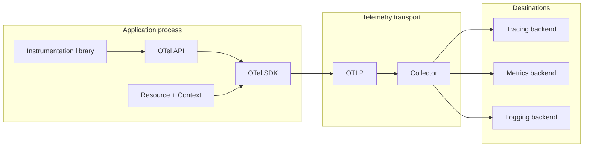
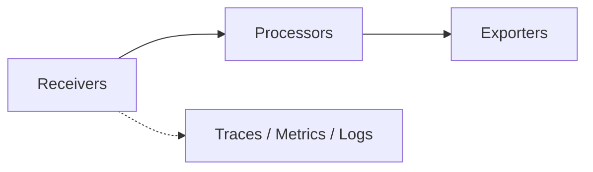

<Callout type="info" title="Đọc sơ đồ">
  Có hai lớp thường bị nhầm: lớp **trong application** tạo telemetry (API, SDK,
  instrumentation) và lớp **bên ngoài application** vận chuyển/xử lý dữ liệu
  (Collector, backend). Hai lớp kết hợp thành một hệ thống observability nhưng
  có vòng đời và trách nhiệm khác nhau.
</Callout>

## Mục lục

- [Bức tranh tổng thể](#bức-tranh-tổng-thể)
- [Các thành phần trong application](#các-thành-phần-trong-application)
  - [Instrumentation](#instrumentation)
  - [API](#api)
  - [SDK](#sdk)
  - [Resource và context](#resource-và-context)
- [Các thành phần ngoài application](#các-thành-phần-ngoài-application)
  - [Collector](#collector)
  - [Protocol và exporter](#protocol-và-exporter)
  - [Backend](#backend)
- [Các topology triển khai](#các-topology-triển-khai)
- [Luồng một request](#luồng-một-request)
- [Ranh giới trách nhiệm](#ranh-giới-trách-nhiệm)

## Bức tranh tổng thể



Application có thể export trực tiếp tới backend, nhưng mô hình qua Collector thường tách được credential, retry, batching, filtering và routing khỏi business process.

## Các thành phần trong application

### Instrumentation

Instrumentation tạo dữ liệu bằng cách quan sát framework hoặc được viết thủ công. Instrumentation nên tạo span ở boundary có ý nghĩa, ghi metric với unit rõ ràng và kết nối log với active context.

Automatic instrumentation thường bao phủ HTTP server/client, database, messaging và framework. Manual instrumentation phù hợp cho business operation, cache, feature flag hoặc code custom chưa có integration.

### API

API là contract ổn định mà instrumentation sử dụng để lấy tracer, meter hoặc logger. API không quyết định exporter và có thể hoạt động dưới dạng no-op nếu không cài SDK.

Tách API khỏi SDK cho phép thư viện instrument được dùng trong nhiều môi trường. Application owner mới là bên quyết định SDK provider, sampling, exporter và resource.

### SDK

SDK triển khai API và quản lý lifecycle của telemetry:

- provider và named instrumentation scope;
- span processor/exporter;
- metric reader, aggregation và temporality;
- log processor/exporter nếu language hỗ trợ;
- sampler, resource và shutdown behavior.

SDK là code production nên cần quan sát chính nó: export latency, queue size, dropped records, exporter errors và memory.

### Resource và context

Resource mô tả service instance và môi trường, ví dụ `service.name`, version, host, container hoặc Kubernetes metadata. Context mô tả operation đang active, trace relationship và baggage.

Resource thường gắn vào mọi signal; context thay đổi theo execution và được propagate qua boundary. Không nên dùng baggage để thay thế resource hoặc dùng resource để chứa dữ liệu riêng của từng request.

## Các thành phần ngoài application

### Collector

Collector là binary độc lập với ba loại component chính:



- **Receiver** nhận hoặc scrape dữ liệu.
- **Processor** batch, filter, enrich, transform, sample hoặc giới hạn memory.
- **Exporter** gửi dữ liệu tới backend hoặc gateway khác.

Collector có thể chạy như agent gần workload hoặc gateway tập trung. Distribution cụ thể quyết định component nào có sẵn.

### Protocol và exporter

OTLP là protocol chính của OTel, có transport gRPC và HTTP. SDK hoặc Collector có thể dùng OTLP để giao tiếp với một Collector/backend hỗ trợ protocol này. Các exporter khác tồn tại để tương thích với hệ thống hoặc backend cụ thể.

Protocol là cách truyền; exporter là implementation biết cách serialize và gửi signal. Đừng nhầm một endpoint HTTP bất kỳ với OTLP endpoint: path, content type, TLS và authentication phải khớp.

### Backend

Backend chịu trách nhiệm lưu trữ, index, query, visualization, alerting và retention. OTel không ép bạn dùng một backend nào. Khi chọn backend, cần xem khả năng ingest, correlation, sampling, retention, cost và mapping semantic conventions.

## Các topology triển khai

### Direct export

```text
Application + SDK ─────────► Backend
```

Đơn giản cho local hoặc hệ thống nhỏ. Application phải sở hữu credential, retry, exporter và có thể chịu ảnh hưởng khi backend chậm.

### Agent

```text
Application ─► Collector agent ─► Backend hoặc gateway
```

Agent chạy trên host, container hoặc pod gần application. Nó gom dữ liệu từ nhiều process gần nhau và giảm việc để application kết nối trực tiếp tới backend.

### Gateway

```text
Applications / agents ─► Collector gateway ─► nhiều backend
```

Gateway tập trung routing, policy, filtering và export. Cần thiết kế capacity, HA, network boundary và failure behavior; gateway tập trung không nên trở thành single point of failure.

### Agent + gateway

```text
Application ─► agent/sidecar ─► gateway ─► backend
```

Topology này tách local buffering/metadata khỏi policy tập trung, đổi lại tăng hop mạng và độ phức tạp vận hành.

## Luồng một request

1. HTTP instrumentation mở server span và lấy context từ request.
2. Code gọi database; database instrumentation tạo child span.
3. SDK gắn resource và attributes, sau đó kết thúc spans.
4. Batch processor gom spans và OTLP exporter gửi đi.
5. Collector nhận qua OTLP receiver.
6. Collector áp dụng memory limit, enrich, batch và export.
7. Backend dựng trace bằng trace ID và parent-child relationship.

## Ranh giới trách nhiệm

| Thành phần | Trách nhiệm chính | Không nên kỳ vọng |
| --- | --- | --- |
| Instrumentation | Quan sát operation và tạo signal | Tự biết business intent ở mọi nơi |
| API | Cung cấp contract tạo telemetry | Lưu trữ hoặc gửi dữ liệu |
| SDK | Record, sample, process và export trong process | Thay thế Collector policy tập trung |
| Collector | Receive, process, route, export | Tự tạo dữ liệu cho code chưa instrument |
| Backend | Lưu, query, visualize, alert | Sửa một instrumentation sai mà không có dữ liệu |

<Callout type="warn" title="Đừng tạo vòng lặp export">
  Khi cấu hình nhiều Collector hoặc nhiều exporter, xác định rõ nguồn và đích.
  Một Collector export nhầm về receiver của chính nó có thể tạo vòng lặp, nhân
  bản telemetry và làm cạn tài nguyên.
</Callout>
