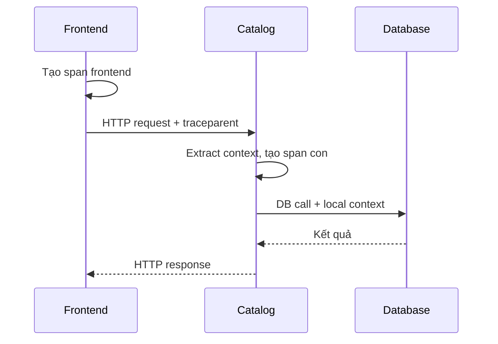

<Callout type="info" title="Ý tưởng cốt lõi">
  Context propagation truyền thông tin về operation hiện tại qua process và
  network boundary. Service nhận context có thể tạo span con thuộc cùng trace,
  nhờ đó backend dựng lại được causal path của request.
</Callout>

## Mục lục

- [Context và propagation](#context-và-propagation)
- [Một request đi qua hai service](#một-request-đi-qua-hai-service)
- [Trace context](#trace-context)
  - [Header `traceparent`](#header-traceparent)
  - [Trace state](#trace-state)
- [Propagation trong ứng dụng](#propagation-trong-ứng-dụng)
  - [Inject ở phía gửi](#inject-ở-phía-gửi)
  - [Extract ở phía nhận](#extract-ở-phía-nhận)
- [Baggage](#baggage)
- [Khi context bị mất](#khi-context-bị-mất)
- [Bảo mật](#bảo-mật)

## Context và propagation

**Context** là trạng thái gắn với execution hiện tại, thường gồm span hiện tại, trace ID, span ID, sampling flags và baggage. **Propagation** là cơ chế serialize context vào carrier, truyền carrier qua boundary, rồi deserialize ở phía nhận.

Carrier phổ biến nhất là HTTP headers. Với message queue, carrier có thể là message headers hoặc metadata. Với RPC, carrier phụ thuộc protocol và instrumentation.



## Một request đi qua hai service

Giả sử `frontend` gọi `catalog`:

1. `frontend` có active span với `trace_id = T` và `span_id = A`.
2. HTTP instrumentation inject context vào request header.
3. `catalog` extract header và dùng span A làm parent remote.
4. `catalog` tạo span mới với `trace_id = T`, `span_id = B`.
5. Khi `catalog` gọi database hoặc service khác, nó inject span B làm parent tiếp theo.

Kết quả là các span thuộc cùng trace nhưng mỗi service vẫn có span ID riêng. Không truyền context thì backend có thể hiển thị nhiều trace rời rạc hoặc tạo root span mới ở mỗi service.

## Trace context

### Header `traceparent`

Propagator mặc định phổ biến của OTel dùng W3C Trace Context. Header `traceparent` có dạng:

```text
00-4bf92f3577b34da6a3ce929d0e0e4736-00f067aa0ba902b7-01
│  │                                │                 │
│  │                                │                 └─ trace flags
│  │                                └────────────────── parent-id/span-id
│  └────────────────────────────────────────────────── trace-id
└───────────────────────────────────────────────────── version
```

`trace_id` nhận diện trace, `parent-id` nhận diện span gửi request và `trace-flags` chứa các cờ như sampled. Header phải được validate; application không nên tự nối chuỗi hoặc tin mù quáng vào giá trị từ bên ngoài.

### Trace state

`tracestate` mang vendor-specific state bổ sung cho trace context. Code nghiệp vụ thường không cần đọc hoặc sửa trực tiếp giá trị này. Hãy để propagator của SDK xử lý và chỉ forward state khi trust boundary cho phép.

## Propagation trong ứng dụng

Instrumentation thư viện thường tự inject/extract. Chỉ cần làm thủ công khi protocol hoặc message transport chưa được hỗ trợ.

### Inject ở phía gửi

Phía gửi lấy context hiện tại và inject vào carrier trước khi gửi:

```text
carrier = tạo metadata/header của request
propagator.inject(context hiện tại, carrier)
gửi request với carrier
```

Carrier phải là object mà propagator hỗ trợ. Không serialize cả object context tùy tiện vào header và không đưa dữ liệu nhạy cảm vào đó.

### Extract ở phía nhận

Phía nhận extract carrier trước khi tạo span server/consumer:

```text
remoteContext = propagator.extract(carrier)
with context(remoteContext):
    tạo span server/consumer
    xử lý request
```

Nếu framework đã tạo server span và set active context, không tạo thêm một span tương đương chỉ để extract. Hãy dùng API của instrumentation hiện có để tránh duplicate spans.

<Callout type="idea" title="Test propagation ở boundary">
  Viết integration test cho HTTP, queue hoặc RPC boundary: gửi request có parent
  context, nhận request ở service sau và assert trace ID giữ nguyên, span ID mới
  và parent relation đúng.
</Callout>

## Baggage

Baggage là các cặp key-value đi cùng context, ví dụ `tenant.id` hoặc một routing hint. Baggage hữu ích khi downstream cần cùng một context mà không muốn nhúng vào từng API parameter.

Tuy nhiên baggage có thể được forward qua nhiều service và network. Nó không phải nơi lưu secret, JWT, password hoặc PII. Giới hạn kích thước, key được phép và trust boundary; đừng copy toàn bộ baggage vào span attributes hoặc logs một cách tự động.

## Khi context bị mất

| Triệu chứng | Nguyên nhân thường gặp | Cách kiểm tra |
| --- | --- | --- |
| Mỗi service tạo một trace mới | Header bị strip hoặc propagator khác nhau | Capture request headers và kiểm tra `traceparent` |
| Span có trace đúng nhưng parent sai | Extract sau khi tạo span hoặc dùng nhầm context | Kiểm tra thứ tự extract → tạo span |
| Trace mất ở queue | Message carrier không copy metadata | Kiểm tra inject/extract ở producer/consumer |
| Trace đứt ngẫu nhiên | Proxy, retry hoặc async task không giữ context | Test từng boundary và scheduler |
| Dữ liệu lộ ra ngoài | Forward context/baggage tới external service | Xem allowlist propagator và scrub policy |

## Bảo mật

Context đi qua ranh giới tin cậy nên cần được xem là input từ bên ngoài:

- Validate và giới hạn header trước khi parse.
- Cân nhắc không nhận hoặc không forward context từ public traffic nếu use case không cần.
- Không gửi baggage nội bộ tới external service không tin cậy.
- Không đặt credential, access token hay PII trong baggage.
- Nếu log propagation headers, phải redact giá trị theo policy.

Propagation giúp correlation, không phải cơ chế authentication hay authorization. Một `traceparent` hợp lệ không chứng minh caller được phép truy cập tài nguyên.
