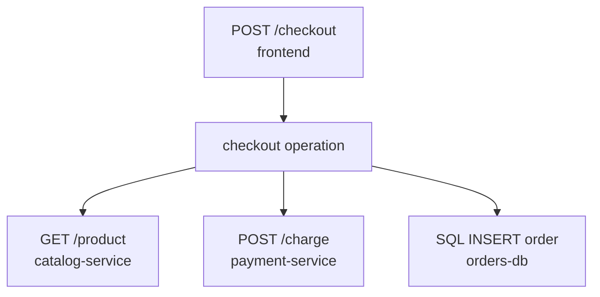

<Callout type="info" title="Signal là góc nhìn, không phải bản sao của ứng dụng">
  Mỗi signal mô tả hệ thống ở một độ phân giải khác nhau. Hãy chọn signal theo
  câu hỏi cần trả lời và liên kết chúng bằng context thay vì cố nhồi mọi chi tiết
  vào một loại dữ liệu.
</Callout>

## Mục lục

- [Các signal được OpenTelemetry hỗ trợ](#các-signal-được-opentelemetry-hỗ-trợ)
- [Traces](#traces)
  - [Trace và span](#trace-và-span)
- [Metrics](#metrics)
  - [Các loại metric cơ bản](#các-loại-metric-cơ-bản)
- [Logs](#logs)
- [Baggage và profiles](#baggage-và-profiles)
- [So sánh và chọn signal](#so-sánh-và-chọn-signal)
- [Liên kết các signal](#liên-kết-các-signal)

## Các signal được OpenTelemetry hỗ trợ

OpenTelemetry hiện hỗ trợ ba signal chính là **traces**, **metrics** và **logs**. **Baggage** là dữ liệu context dạng key-value được truyền qua các boundary; nó không phải bản ghi telemetry độc lập theo cùng nghĩa với ba signal trên. **Profiles** đang được phát triển và mô tả resource usage ở mức code.

| Signal | Đơn vị | Câu hỏi điển hình | Điểm mạnh |
| --- | --- | --- | --- |
| Trace | Trace, span | Request này đã đi qua đâu và chậm ở đâu? | Causal path và latency từng operation |
| Metric | Data point theo thời gian | Hệ thống đang khỏe trên diện rộng không? | Dashboard, alert, SLO, chi phí thấp hơn |
| Log | Log record/event | Sự kiện hoặc exception cụ thể là gì? | Chi tiết lỗi và ngữ cảnh tùy ý |
| Baggage | Key-value trong context | Có context nào cần đi cùng request? | Truyền thông tin giữa service; cần kiểm soát chặt |

## Traces

Trace là tập hợp các span mô tả đường đi của một request. Span có tên, thời gian bắt đầu/kết thúc, status, attributes, events, links và quan hệ với span khác.

### Trace và span

Một request `POST /checkout` có thể tạo cây span như sau:

Span con giúp tìm critical path và dependency. Không phải mọi function call đều cần một span; span nên đại diện cho operation có ý nghĩa khi điều tra, chẳng hạn network call, queue processing hoặc business step.

<Callout type="warn" title="Tránh span và attribute gây nổ cardinality">
  Không dùng URL đầy đủ chứa ID người dùng làm tên span. Dùng route template như `/users/{id}` và đặt ID vào attribute chỉ khi có lý do, retention và quyền truy cập phù hợp.
</Callout>

## Metrics

Metric là các phép đo số được ghi nhận theo thời gian. OTel metric data thường gồm tên, mô tả, unit, resource, attributes và data points. Attributes tạo nên các time series khác nhau nên mỗi attribute cần được chọn có chủ đích.

### Các loại metric cơ bản

- **Counter**: giá trị chỉ tăng, phù hợp với số request hoặc số lỗi.
- **UpDownCounter**: có thể tăng hoặc giảm, phù hợp với số item đang hoạt động.
- **Histogram**: phân bố của các giá trị, phù hợp với latency hoặc kích thước response.
- **Gauge/Observable gauge**: giá trị hiện tại được quan sát, như nhiệt độ hoặc memory sử dụng.

Ví dụ metric request duration là histogram; từ đó backend có thể tính percentile gần đúng. Đừng dùng counter để ghi giá trị hiện tại hoặc dùng gauge cho tổng số sự kiện tích lũy.

## Logs

Log record là bản ghi một sự kiện, thường có timestamp, severity, body, attributes và resource. Log có thể được tạo trực tiếp bởi OTel Logs API/SDK hoặc được Collector nhận từ một định dạng log khác.

Log độc lập dễ đọc trong lúc debug nhưng khó ghép thành một request end-to-end. Khi có active context, hãy bổ sung `trace_id`, `span_id` và trace flags theo khả năng của logging SDK. Structured fields tốt hơn việc parse message tự do.

## Baggage và profiles

**Baggage** truyền các cặp key-value cùng context giữa service. Baggage có thể hỗ trợ routing, tenant context hoặc feature flag, nhưng mọi downstream có thể nhận được nó. Không đưa credential, token, PII hoặc dữ liệu không cần thiết vào baggage.

**Profiles** ghi nhận việc sử dụng tài nguyên ở mức code, ví dụ CPU hoặc memory allocation. Đây là tín hiệu bổ sung cho trace và metric, hữu ích khi cần biết thời gian hoặc tài nguyên bị tiêu tốn ở function nào.

## So sánh và chọn signal

| Nhu cầu | Signal nên bắt đầu | Signal bổ sung |
| --- | --- | --- |
| Alert khi error rate tăng | Metric | Trace để drill-down |
| Điều tra một request chậm | Trace | Log và metric của dependency |
| Tìm stack trace của exception | Log | Trace để biết request context |
| Theo dõi queue backlog | Metric | Trace cho từng message hoặc batch |
| Tối ưu function nóng CPU | Profile | Trace để chọn request và metric để đo tác động |

## Liên kết các signal

Correlation thường dựa trên:

- `trace_id` để gắn log với một distributed trace;
- `span_id` để gắn log với operation cụ thể;
- resource attributes như `service.name`, `service.version`, `deployment.environment.name` để biết instance phát dữ liệu;
- exemplars để liên kết một metric data point với trace đại diện, nếu backend hỗ trợ.

Một quy trình điều tra hiệu quả thường đi từ metric tổng hợp → trace mẫu → log chi tiết. Thứ tự ngược lại cũng có thể phù hợp khi bắt đầu từ một exception cụ thể.
