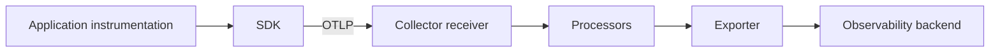

import { Step, Steps } from 'fumadocs-ui/components/steps';

<Callout type="info" title="Mental model">
  Một pipeline telemetry có ba giai đoạn: **receive**, **process** và
  **export**. SDK có thể thực hiện một phần pipeline trong application; Collector
  thường đảm nhiệm phần xử lý và định tuyến bên ngoài process.
</Callout>

## Mục lục

- [Pipeline là gì?](#pipeline-là-gì)
- [Đường đi end-to-end](#đường-đi-end-to-end)
- [Pipeline trong ứng dụng](#pipeline-trong-ứng-dụng)
- [Pipeline trong Collector](#pipeline-trong-collector)
  - [Receivers](#receivers)
  - [Processors](#processors)
  - [Exporters](#exporters)
- [Ví dụ cấu hình](#ví-dụ-cấu-hình)
- [Thiết kế pipeline an toàn](#thiết-kế-pipeline-an-toàn)
- [Debug khi không có dữ liệu](#debug-khi-không-có-dữ-liệu)

## Pipeline là gì?

Pipeline là chuỗi xử lý mà telemetry đi qua từ lúc được tạo đến lúc được lưu ở backend. Có thể hình dung:



Một pipeline cụ thể luôn thuộc một signal type: `traces`, `metrics` hoặc `logs`. Component phải hỗ trợ signal type đó; receiver nhận metric không thể tự động được dùng trong pipeline traces.

## Đường đi end-to-end

1. **Instrument**: framework instrumentation hoặc code thủ công tạo span, metric hoặc log.
2. **Record**: SDK gắn resource và context, sau đó lưu tạm trong processor/reader.
3. **Encode**: exporter serialize dữ liệu, thường bằng OTLP/gRPC hoặc OTLP/HTTP.
4. **Receive**: Collector hoặc backend nhận payload.
5. **Process**: Collector batch, enrich, filter, transform hoặc sample theo policy.
6. **Export**: Collector gửi dữ liệu tới một hay nhiều backend.
7. **Ingest**: backend index, aggregate và cung cấp query/dashboard/alert.

<Callout type="warn" title="Mất dữ liệu có nhiều điểm xảy ra">
  “Application không thấy trace” chưa đủ để kết luận. Hãy phân biệt không tạo
  span, SDK không export, network không tới Collector, Collector drop/error,
  exporter retry thất bại và backend không ingest.
</Callout>

## Pipeline trong ứng dụng

SDK trong process thường có các thành phần sau:

- **Tracer/Meter/Logger provider** cung cấp API cho instrumentation.
- **Resource** mô tả service và môi trường phát telemetry.
- **Span processor** xử lý span khi kết thúc; thường có simple hoặc batch processor.
- **Metric reader** thu thập metric theo push hoặc pull tùy SDK.
- **Exporter** gửi dữ liệu ra ngoài process.
- **Sampler** quyết định span nào được ghi hoặc export.

Trong production, batch export thường giảm số request mạng nhưng dùng thêm memory. Cấu hình shutdown hook để flush dữ liệu trước khi process kết thúc; đặc biệt quan trọng với job ngắn hoặc serverless function.

## Pipeline trong Collector

Collector pipeline được định nghĩa trong `service.pipelines`. Mỗi pipeline có receiver, processor tùy chọn và exporter:

```text
receiver(s) → processor(s) → exporter(s)
```

Một receiver hoặc exporter có thể được tham chiếu bởi nhiều pipeline. Processor được chạy theo thứ tự khai báo. Nếu một processor filter hoặc sampler drop record, record sẽ không đi tới exporter phía sau nó.

### Receivers

Receiver nhận telemetry từ network hoặc chủ động scrape/poll một nguồn. Ví dụ `otlp` receiver nhận OTLP/gRPC và OTLP/HTTP. Khai báo receiver trong phần `receivers` chưa đủ; receiver phải được gắn vào một pipeline trong `service`.

### Processors

Processor biến đổi hoặc điều khiển dữ liệu trước khi export. Một số use case:

- `memory_limiter`: giảm nguy cơ Collector dùng hết memory.
- `batch`: gom record thành batch để export hiệu quả hơn.
- `filter` hoặc `probabilistic_sampler`: loại dữ liệu theo policy.
- `attributes`/`resource`/`transform`: chuẩn hóa hoặc enrich metadata.
- `k8sattributes`: gắn metadata Kubernetes khi triển khai phù hợp.

Tên và khả năng component phụ thuộc distribution của Collector. Luôn kiểm tra component có trong binary đang chạy và có hỗ trợ signal mong muốn không.

### Exporters

Exporter gửi dữ liệu tới backend, gateway khác hoặc đích debug. Có thể cấu hình nhiều exporter trong một pipeline để fan-out, nhưng mỗi bản sao làm tăng network và chi phí. Retry và queue giúp chống lỗi tạm thời; chúng không thể thay thế capacity planning hoặc persistent buffering khi outage dài.

## Ví dụ cấu hình

Ví dụ tối thiểu nhận traces và metrics bằng OTLP, batch rồi gửi tới một OTLP backend:

```yaml
receivers:
  otlp:
    protocols:
      grpc:
        endpoint: 0.0.0.0:4317
      http:
        endpoint: 0.0.0.0:4318

processors:
  memory_limiter:
    check_interval: 1s
    limit_mib: 512
  batch:
    send_batch_size: 1024
    timeout: 5s

exporters:
  otlp:
    endpoint: observability.example.com:4317
    tls:
      insecure: false

service:
  pipelines:
    traces:
      receivers: [otlp]
      processors: [memory_limiter, batch]
      exporters: [otlp]
    metrics:
      receivers: [otlp]
      processors: [memory_limiter, batch]
      exporters: [otlp]
```

`endpoint`, TLS và authentication ở đây chỉ là ví dụ. Không commit token hoặc credential vào file cấu hình; dùng secret/binding/secret manager của môi trường triển khai.

## Thiết kế pipeline an toàn

- Đặt `memory_limiter` trước `batch` trong Collector production.
- Theo dõi queue size, export failure, dropped data và Collector memory.
- Đặt timeout, retry và backpressure rõ ràng.
- Lọc PII trước khi dữ liệu rời khỏi trust boundary.
- Tách pipeline theo signal hoặc tenant khi policy, retention và backend khác nhau.
- Dùng `debug` exporter ở local để kiểm chứng payload trước khi kết nối backend.
- Test shutdown và restart để biết có bao nhiêu dữ liệu nằm trong buffer có thể mất.

## Debug khi không có dữ liệu

<Steps>
<Step>

### Kiểm tra nguồn

Xác nhận instrumentation được load, span/metric/log thực sự được tạo và `service.name` có giá trị hợp lệ.

</Step>
<Step>

### Kiểm tra SDK exporter

Bật log debug hoặc dùng exporter local. Xác nhận endpoint, protocol, TLS, timeout và credential.

</Step>
<Step>

### Kiểm tra Collector

Kiểm tra config có hợp lệ, receiver đang listen đúng port, pipeline đã tham chiếu component và internal telemetry không báo dropped data.

</Step>
<Step>

### Kiểm tra backend

Dùng đúng time range, `service.name` và signal type. Xác nhận backend đã ingest dữ liệu và clock của các máy không lệch nghiêm trọng.

</Step>
</Steps>
