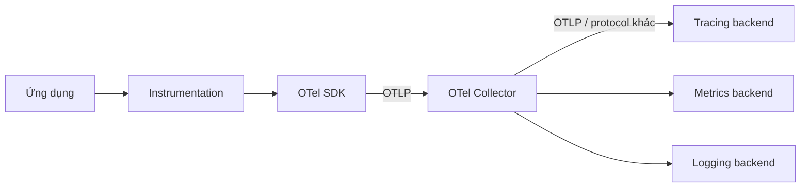

<Callout type="info" title="Một framework, không phải một backend">
  OpenTelemetry (OTel) là dự án open source, vendor-neutral để tạo và thu thập
  telemetry. OTel không phải nơi lưu trữ hay giao diện truy vấn cuối cùng; dữ
  liệu thường được gửi tới một hoặc nhiều observability backend.
</Callout>

## Mục lục

- [OpenTelemetry cung cấp gì?](#opentelemetry-cung-cấp-gì)
- [OpenTelemetry không phải gì?](#opentelemetry-không-phải-gì)
- [Các khối chính](#các-khối-chính)
  - [API](#api)
  - [SDK](#sdk)
  - [Instrumentation](#instrumentation)
  - [Collector](#collector)
  - [Exporter và backend](#exporter-và-backend)
- [Đường đi của một telemetry record](#đường-đi-của-một-telemetry-record)
- [Vì sao dùng OTel?](#vì-sao-dùng-otel)
- [Một số hiểu lầm thường gặp](#một-số-hiểu-lầm-thường-gặp)

## OpenTelemetry cung cấp gì?

OTel chuẩn hóa các phần lặp lại trong observability:

- API và SDK cho nhiều ngôn ngữ để tạo traces, metrics và logs.
- Instrumentation libraries để tự động hoặc thủ công ghi nhận operation.
- OTLP, giao thức trung lập để chuyển telemetry.
- Collector để receive, process và export dữ liệu.
- Semantic conventions để đặt tên resource và attributes nhất quán.
- Context propagation để nối operation qua process và network boundary.



## OpenTelemetry không phải gì?

| Không phải | Ý nghĩa |
| --- | --- |
| Không phải APM backend | OTel không thay thế Jaeger, Prometheus, Grafana hoặc vendor backend. |
| Không phải agent duy nhất | Có SDK/instrumentation trong app và có thể có Collector bên ngoài app. |
| Không phải một thư viện độc lập với ngôn ngữ | API, SDK và auto-instrumentation là các implementation theo từng language. |
| Không phải quy tắc bắt buộc phải dùng một backend | Cùng một pipeline có thể export tới nhiều đích nếu phù hợp. |

## Các khối chính

### API

API định nghĩa interface mà application hoặc instrumentation dùng để tạo telemetry. Ví dụ, tracing API cho phép lấy tracer và tạo span mà chưa cần quyết định SDK hay exporter cụ thể.

Việc tách API giúp thư viện instrumentation không phải tự sở hữu cấu hình runtime của ứng dụng. Application có thể cài SDK để biến các lời gọi API thành dữ liệu thật, hoặc dùng no-op implementation khi telemetry bị tắt.

### SDK

SDK là implementation runtime của API. SDK thường quản lý provider, sampling, processor, resource, aggregation và exporter. Tùy language, tên lớp và cách cấu hình khác nhau, nhưng mental model chung vẫn là:

```text
Instrumentation → API → SDK provider → processor/aggregator → exporter
```

SDK chạy trong process ứng dụng, vì vậy cấu hình sai có thể ảnh hưởng latency, memory hoặc startup. Hãy đặt giới hạn queue, batch và export timeout; đừng để exporter làm request nghiệp vụ bị block vô thời hạn.

### Instrumentation

Instrumentation tạo telemetry từ code. Hai cách phổ biến:

- **Automatic instrumentation**: agent hoặc package hook vào framework, HTTP client, database client để tạo span mà ít thay đổi code.
- **Manual instrumentation**: developer chủ động tạo span, metric hoặc log cho business operation và các đoạn code chưa được hỗ trợ.

Auto-instrumentation cho coverage nhanh; manual instrumentation bổ sung ngữ cảnh nghiệp vụ. Hai cách thường được dùng cùng nhau, nhưng cần tránh tạo span trùng cho cùng một operation.

### Collector

Collector là service độc lập nhận telemetry từ app hoặc agent, xử lý rồi chuyển đến backend. Nó có thể chuẩn hóa attributes, batch, filter, sample hoặc fan-out dữ liệu.

Collector giúp tách code ứng dụng khỏi credential, retry logic và exporter-specific protocol. Tuy vậy, Collector không làm cho dữ liệu thiếu instrumentation trở nên đầy đủ.

### Exporter và backend

Exporter chuyển telemetry từ SDK hoặc Collector đến đích. Backend lưu trữ, truy vấn, trực quan hóa và cảnh báo trên dữ liệu đó. Một exporter không nhất thiết phải là backend; `debug` exporter chẳng hạn chỉ in dữ liệu để kiểm tra local.

## Đường đi của một telemetry record

Ví dụ một HTTP request được instrument:

1. Instrumentation tạo span khi request bắt đầu.
2. Context hiện tại và resource của service được gắn vào span.
3. Khi request kết thúc, span được đóng với duration, status và attributes.
4. SDK processor chuyển span tới exporter hoặc OTLP endpoint.
5. Collector nhận span, áp dụng processors và export tới backend.
6. Backend index và hiển thị span trong trace.

<Callout type="idea" title="Cách debug">
  Kiểm tra theo đúng thứ tự: code có tạo signal không → SDK có record/export không → Collector có nhận và xử lý không → exporter có gửi thành công không → backend có ingest và hiển thị không.
</Callout>

## Vì sao dùng OTel?

- **Portability**: giảm phụ thuộc vào API độc quyền của một vendor.
- **Consistency**: dùng chung protocol, semantic conventions và context model.
- **Ecosystem**: tái sử dụng instrumentation và Collector components.
- **Control**: xử lý, lọc và định tuyến telemetry ở nơi phù hợp.
- **Migration**: đổi backend bằng cách đổi exporter hoặc pipeline thay vì rewrite toàn bộ application instrumentation.

Portability không có nghĩa mọi backend cung cấp tính năng giống nhau. Hãy kiểm tra mapping attribute, retention, sampling và truy vấn đặc thù của backend mục tiêu.

## Một số hiểu lầm thường gặp

### “Cài Collector là đã có observability”

Collector chỉ xử lý dữ liệu nó nhận được. Bạn vẫn cần instrument application, đặt resource đúng và kiểm tra exporter/backend.

### “Mọi dữ liệu nên gửi ở mức chi tiết cao nhất”

Không. Sampling, filtering và cardinality control là những quyết định thiết kế quan trọng. Hãy giữ dữ liệu đủ để trả lời câu hỏi vận hành với cost và privacy phù hợp.

### “OTel phải được thêm vào business code ở mọi nơi”

Auto-instrumentation có thể bao phủ nhiều framework. Chỉ thêm manual instrumentation ở boundary và operation nghiệp vụ nơi telemetry tự động chưa thể mô tả ý định của hệ thống.
