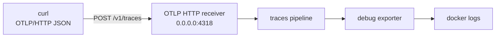

import { Step, Steps } from 'fumadocs-ui/components/steps';

<Callout type="info" title="Bạn sẽ hoàn thành gì?">
  Bạn sẽ chạy OpenTelemetry Collector Contrib trong Docker, gửi một payload
  OTLP/HTTP JSON trực tiếp bằng `curl`, rồi đọc trace trong log của `debug`
  exporter. Cách này không cần sample app, SDK hay tracing backend.
</Callout>

## Mục lục

- [Bạn sẽ làm gì](#bạn-sẽ-làm-gì)
- [Chuẩn bị](#chuẩn-bị)
- [Mental model](#mental-model)
- [Thực hành tạo trace bằng curl](#thực-hành-tạo-trace-bằng-curl)
  - [Bước 1: Kiểm tra Docker và curl](#bước-1-kiểm-tra-docker-và-curl)
  - [Bước 2: Chạy Collector với pipeline traces](#bước-2-chạy-collector-với-pipeline-traces)
  - [Bước 3: Gửi trace qua OTLP/HTTP](#bước-3-gửi-trace-qua-otlphttp)
  - [Bước 4: Xác minh trace trong log](#bước-4-xác-minh-trace-trong-log)
- [Đọc trace và output](#đọc-trace-và-output)
  - [Các trường quan trọng](#các-trường-quan-trọng)
  - [Cách đọc output của debug exporter](#cách-đọc-output-của-debug-exporter)
- [Lỗi thường gặp](#lỗi-thường-gặp)
  - [Collector không khởi động](#collector-không-khởi-động)
  - [curl báo Connection refused](#curl-báo-connection-refused)
  - [HTTP 404, 405 hoặc 415](#http-404-405-hoặc-415)
  - [HTTP 400 và không có trace](#http-400-và-không-có-trace)
  - [POST trả 200 nhưng không thấy log](#post-trả-200-nhưng-không-thấy-log)
- [Giới hạn và bước tiếp theo](#giới-hạn-và-bước-tiếp-theo)

## Bạn sẽ làm gì

Trace là một tập hợp các **span** mô tả đường đi của một request hoặc operation.
Trong bài này, `curl` đóng vai trò một producer tối giản: nó không chạy ứng dụng
được instrument mà gửi thẳng một span root đã được tạo sẵn. Collector nhận span,
đưa span qua pipeline `traces`, rồi in span ra terminal bằng `debug` exporter.

OTLP (OpenTelemetry Protocol) là giao thức truyền telemetry. Ta dùng transport
HTTP của OTLP, vì vậy endpoint nhận traces là `POST /v1/traces`. Đây là endpoint
của OTLP/HTTP, không phải một URL HTTP tùy ý.

Cách này giúp kiểm tra riêng đường truyền và Collector trước khi thêm SDK vào
ứng dụng. Khi đã nhìn thấy trace, bạn có thể thay payload thủ công bằng
[instrumentation tự động](/instrumentation/auto-instrumentation/) hoặc
[instrumentation thủ công](/instrumentation/manual-instrumentation/).

## Chuẩn bị

Bạn cần:

- Docker Engine hoặc Docker Desktop đang chạy.
- `curl` trong terminal.
- Một shell tương thích POSIX như Linux, macOS hoặc WSL, vì bước tạo file cấu
  hình dùng here-document.

Nếu Docker chưa được cài, xem [trang chuẩn bị môi trường](/getting-started/environment/).
Bài này chỉ mở cổng trên `127.0.0.1`, nên không yêu cầu tài khoản backend hay
credential.

<Callout type="warn" title="Đây là môi trường local">
  Payload có các giá trị ID và timestamp cố định để dễ đối chiếu. Không dùng
  `debug` exporter làm nơi lưu trace trong production. Nó chỉ ghi telemetry vào
  log của Collector; production cần exporter tới một backend có retention,
  query và quyền truy cập phù hợp.
</Callout>

## Mental model

Luồng dữ liệu của bài thực hành là:



- **Receiver** là component nhận telemetry từ network. `otlp` receiver được
  cấu hình với protocol HTTP và lắng nghe trên port `4318`.
- **Pipeline** là chuỗi xử lý cho một signal. Pipeline `traces` ở đây nối
  receiver với exporter, chưa có processor nào.
- **Exporter** là component gửi telemetry tới một đích. `debug` exporter gửi
  ra log stdout của Collector để kiểm tra.

Collector chạy trong container. Vì vậy receiver phải bind vào
`0.0.0.0:4318` bên trong container; nếu bind vào `127.0.0.1`, nó chỉ nhận kết
nối từ chính container và không nhận được request từ host. Lệnh Docker ánh xạ
`127.0.0.1:4318` của host vào port đó.

## Thực hành tạo trace bằng curl

<Steps>
<Step>

### Bước 1: Kiểm tra Docker và curl

Chạy:

```bash
docker version
curl --version
```

**Kết quả mong đợi:** Docker in ra phần `Client` và `Server`, còn `curl` in ra
phiên bản cùng các protocol được hỗ trợ. Nếu Docker chỉ in được `Client` hoặc
báo không kết nối được daemon, hãy khởi động Docker Desktop hoặc Docker Engine
trước khi tiếp tục.

**Dọn dẹp:** Bước này không tạo container hay file nào, nên không cần dọn dẹp.

</Step>
<Step>

### Bước 2: Chạy Collector với pipeline traces

Tạo một file cấu hình tạm thời rồi khởi động Collector Contrib:

```bash
cat > /tmp/otel-first-trace-config.yaml <<'YAML'
receivers:
  otlp:
    protocols:
      http:
        endpoint: 0.0.0.0:4318

exporters:
  debug:
    verbosity: detailed

service:
  pipelines:
    traces:
      receivers: [otlp]
      exporters: [debug]
YAML

docker rm -f otel-first-trace >/dev/null 2>&1 || true
docker run -d \
  --name otel-first-trace \
  --publish 127.0.0.1:4318:4318 \
  --volume /tmp/otel-first-trace-config.yaml:/etc/otelcol-contrib/config.yaml:ro \
  otel/opentelemetry-collector-contrib:latest \
  --config=/etc/otelcol-contrib/config.yaml
```

Cấu hình có ba phần. `receivers.otlp` nhận OTLP/HTTP. `exporters.debug` in dữ
liệu ở mức chi tiết. `service.pipelines.traces` thực sự nối hai component; chỉ
khai báo receiver hoặc exporter riêng lẻ thì Collector chưa xử lý traces.

Lệnh dùng image chính thức `otel/opentelemetry-collector-contrib:latest` để
tránh một version cũ bị hỏng khi copy tutorial. Khi triển khai production,
hãy chọn version hoặc digest đã kiểm thử thay vì để việc cập nhật image diễn ra
ngoài kế hoạch.

**Kết quả mong đợi:** Docker trả về một container ID. Kiểm tra trạng thái khởi
động bằng:

```bash
docker logs otel-first-trace 2>&1 | grep -E 'Everything is ready|error|Error' || true
```

Collector đang chạy bình thường khi log có thông báo tương tự `Everything is
ready`. Một số dòng startup khác nhau theo version là bình thường.

**Dọn dẹp:** Nếu dừng tutorial ở bước này, chạy lệnh sau. Nếu tiếp tục, giữ
container và file cấu hình cho các bước sau:

```bash
docker rm -f otel-first-trace >/dev/null 2>&1 || true
rm -f /tmp/otel-first-trace-config.yaml
```

</Step>
<Step>

### Bước 3: Gửi trace qua OTLP/HTTP

Gửi một `ExportTraceServiceRequest` ở dạng JSON protobuf mapping:

```bash
curl --fail --silent --show-error \
  --output /dev/null \
  --write-out 'HTTP %{http_code}\n' \
  -X POST 'http://127.0.0.1:4318/v1/traces' \
  -H 'Content-Type: application/json' \
  --data-binary @- <<'JSON'
{
  "resourceSpans": [
    {
      "resource": {
        "attributes": [
          {
            "key": "service.name",
            "value": { "stringValue": "curl-first-trace" }
          },
          {
            "key": "deployment.environment.name",
            "value": { "stringValue": "local" }
          }
        ]
      },
      "scopeSpans": [
        {
          "scope": { "name": "curl.first-trace" },
          "spans": [
            {
              "traceId": "4bf92f3577b34da6a3ce929d0e0e4736",
              "spanId": "00f067aa0ba902b7",
              "name": "first-operation",
              "kind": "SPAN_KIND_INTERNAL",
              "startTimeUnixNano": "1767225600000000000",
              "endTimeUnixNano": "1767225600100000000",
              "attributes": [
                {
                  "key": "demo.message",
                  "value": { "stringValue": "hello from curl" }
                }
              ],
              "status": { "code": "STATUS_CODE_OK" }
            }
          ]
        }
      ]
    }
  ]
}
JSON
```

**Kết quả mong đợi:** Terminal in:

```text
HTTP 200
```

HTTP 200 cho biết receiver đã chấp nhận request. Nó chưa có nghĩa là một
backend production đã lưu trace; trong bài này exporter chỉ in trace vào log.

Payload có một resource, một instrumentation scope và một span. `parentSpanId`
được bỏ qua vì đây là span root. Nếu gửi lại cùng payload nhiều lần, cùng một
ID có thể khiến backend sau này coi các bản ghi là trùng nhau; hãy tạo ID mới
khi mô phỏng các trace khác nhau.

**Dọn dẹp:** Chưa cần dọn dẹp. Giữ Collector đang chạy để đọc log ở bước tiếp
theo. Nếu muốn hủy giữa chừng, dùng lệnh dọn dẹp ở cuối bước 4.

</Step>
<Step>

### Bước 4: Xác minh trace trong log

Lọc các dòng quan trọng từ log của container:

```bash
docker logs --since 30s otel-first-trace 2>&1 \
  | grep -E 'curl-first-trace|first-operation|Trace ID|Span ID' \
  || docker logs --since 30s otel-first-trace 2>&1
```

**Kết quả mong đợi:** `debug` exporter in một block chứa các thông tin tương tự
sau (format và timestamp log có thể khác theo version):

```text
service.name: curl-first-trace
Trace ID: 4bf92f3577b34da6a3ce929d0e0e4736
Span ID: 00f067aa0ba902b7
Name: first-operation
```

Nếu lệnh lọc không tìm thấy dòng nào, vế sau sẽ in toàn bộ log gần đây để bạn
kiểm tra. Thấy đúng `Trace ID`, `Span ID`, `service.name` và tên span là xác minh
đủ cho đường đi `curl → receiver → pipeline → debug exporter`.

**Dọn dẹp:** Khi đã xác minh xong, xóa container và file cấu hình tạm:

```bash
docker rm -f otel-first-trace >/dev/null 2>&1 || true
rm -f /tmp/otel-first-trace-config.yaml
```

</Step>
</Steps>

## Đọc trace và output

### Các trường quan trọng

| Trường | Ý nghĩa trong payload này |
| --- | --- |
| `traceId` | ID của toàn bộ trace. Đây là 16 byte được viết thành 32 ký tự hex. Mọi span cùng một request phân tán sẽ dùng cùng trace ID. |
| `spanId` | ID của operation `first-operation`. Đây là 8 byte được viết thành 16 ký tự hex và phải khác nhau giữa các span trong cùng trace. |
| `startTimeUnixNano` và `endTimeUnixNano` | Thời điểm bắt đầu và kết thúc theo Unix epoch, tính bằng nanosecond. Đây là số nguyên 64-bit nên OTLP JSON biểu diễn chúng dưới dạng chuỗi thập phân. Trong ví dụ, duration là 100 ms. |
| `resource` | Metadata của entity phát telemetry. `service.name` định danh service là `curl-first-trace`; `deployment.environment.name` cho biết môi trường local. Resource được gắn ở cấp resource spans, không phải attribute riêng của operation. |
| `scope` | Tên instrumentation scope tạo span. `curl.first-trace` chỉ là scope minh họa cho payload thủ công. |
| `name` | Tên operation của span. `first-operation` là tên minh họa, không phải một endpoint ứng dụng thật. |
| `kind` | Loại span. `SPAN_KIND_INTERNAL` nói rằng đây là operation nội bộ được tạo thủ công. Việc truyền payload qua HTTP không biến span này thành HTTP server span. |
| `status` | Kết quả operation. `STATUS_CODE_OK` thể hiện operation mẫu thành công. |

`traceId` trả lời “các span này thuộc trace nào?”, còn `spanId` trả lời “span
nào đại diện cho operation này?”. Một span con sẽ thêm `parentSpanId` để Collector
hoặc backend dựng quan hệ cha-con. Vì ví dụ chỉ có một span root, không có
`parentSpanId`.

<Callout type="info" title="Timestamp phải có thứ tự">
  `startTimeUnixNano` phải nhỏ hơn hoặc bằng `endTimeUnixNano`. ID phải là chuỗi
  hex đúng độ dài: 32 ký tự cho `traceId` và 16 ký tự cho `spanId`. Các điều kiện
  này quan trọng hơn giá trị lịch cụ thể của timestamp.
</Callout>

### Cách đọc output của debug exporter

Đọc output theo ba lớp:

1. **Resource**: tìm `service.name` để biết nguồn phát telemetry. Đây là cách
   phân biệt trace của service nào khi nhiều service gửi vào cùng Collector.
2. **Span identity và quan hệ**: đối chiếu `Trace ID`, `Span ID`, `Parent ID`,
   `Name` và `Kind`. Trace ID giữ các span trong cùng một trace; Parent ID cho
   biết span được tạo từ operation nào.
3. **Thời gian và nội dung**: xem `Start time`, `End time`, attributes và status.
   Khoảng cách giữa start và end là duration; attributes bổ sung metadata cho
   operation.

`debug` exporter là công cụ quan sát payload trong lúc phát triển. Nó không
cung cấp truy vấn, retention, sampling policy hay giao diện trace. Khi cần xem
trace theo thời gian và nối nhiều service, hãy thêm backend qua một Collector
pipeline phù hợp. Xem [telemetry pipeline](/fundamentals/telemetry-pipeline/)
để phân biệt receive, process và export.

## Lỗi thường gặp

### Collector không khởi động

Xem log đầy đủ thay vì chỉ xem container ID:

```bash
docker logs otel-first-trace 2>&1
```

Các nguyên nhân thường gặp là YAML sai indentation, port `4318` đã được process
khác sử dụng, hoặc image chưa pull xong. Nếu port trên host bị chiếm, dừng process
đó hoặc đổi phần bên trái của mapping, chẳng hạn `127.0.0.1:14318:4318`, rồi gửi
curl tới `http://127.0.0.1:14318/v1/traces`. Giữ port bên phải là `4318` vì đó là
port trong container.

### curl báo Connection refused

Kiểm tra container và mapping:

```bash
docker ps --filter name=otel-first-trace
docker port otel-first-trace
```

Nếu container đã thoát, xem `docker logs otel-first-trace`. Nếu container đang
chạy nhưng không có mapping `4318/tcp`, hãy chạy lại đúng lệnh Docker ở bước 2.
Cũng kiểm tra bạn đang dùng đúng `127.0.0.1:4318` và Collector đã bind
`0.0.0.0:4318` bên trong container.

### HTTP 404, 405 hoặc 415

- `404` hoặc `405` thường là dùng sai path hoặc method. OTLP/HTTP traces cần
  `POST /v1/traces`, không phải `/`, `/v1/trace` hay `GET /v1/traces`.
- `415` thường là thiếu hoặc sai header. Gửi
  `Content-Type: application/json` cùng payload JSON.

Đừng dùng endpoint OTLP/gRPC `4317` với lệnh curl JSON này. `curl` trong tutorial
đang dùng OTLP/HTTP trên `4318`.

### HTTP 400 và không có trace

HTTP 400 nghĩa là receiver không chấp nhận payload. Kiểm tra các điểm sau:

- JSON hợp lệ và có đủ các lớp `resourceSpans`, `scopeSpans` và `spans`.
- Tên field dùng camelCase như `traceId`, `spanId` và `startTimeUnixNano`.
- `traceId` có 32 ký tự hex, `spanId` có 16 ký tự hex.
- Timestamp là chuỗi số nguyên nanosecond, `startTimeUnixNano` không lớn hơn
  `endTimeUnixNano`.
- Giá trị enum dùng tên protobuf hợp lệ như `SPAN_KIND_INTERNAL` và
  `STATUS_CODE_OK`.

Để xem phản hồi lỗi thay vì bỏ body, bỏ `--output /dev/null` và `--fail` trong
lệnh curl, hoặc chạy lại với `--verbose`.

### POST trả 200 nhưng không thấy log

Trước hết, xem toàn bộ log và không giới hạn `--since` quá ngắn:

```bash
docker logs otel-first-trace 2>&1
```

`docker logs` mới là nơi `debug` exporter ghi dữ liệu; không có UI nào tự xuất
hiện. Gửi lại payload rồi lọc bằng đúng `traceId`. Nếu vẫn không thấy, kiểm tra
pipeline có `traces`, receiver `otlp` và exporter `debug` đúng như cấu hình. HTTP
200 chỉ xác nhận receiver đã nhận request, không xác nhận một backend khác đã
ingest dữ liệu.

## Giới hạn và bước tiếp theo

Bài này tạo span bằng tay nên chưa cho thấy cách một ứng dụng tự tạo span, giữ
active context hoặc propagate trace qua nhiều service. Nó cũng không có
processor như `batch`, `memory_limiter` hay backend để truy vấn. Đây là chủ ý:
trước tiên xác minh payload và đường ống tối thiểu, sau đó mới tăng độ phức tạp.

Khi muốn instrument ứng dụng thật, hãy đặt `service.name` ở **resource** của SDK
thay vì gán lặp lại vào từng span. Khi muốn quan sát nhiều signal hoặc thêm
backend local, chuyển sang [local observability stack](/getting-started/local-stack/).
Để hiểu sâu hơn về trace, xem [ba nhóm tín hiệu](/fundamentals/signals-overview/)
và [resources trong instrumentation](/instrumentation/resources/).

<Cards>
  <Card
    title="Local observability stack"
    href="/getting-started/local-stack/"
    description="Mở rộng từ debug exporter sang một stack local có backend."
  />
  <Card
    title="Ba nhóm tín hiệu"
    href="/fundamentals/signals-overview/"
    description="Hiểu trace, span và cách traces liên hệ với metrics, logs."
  />
  <Card
    title="Manual instrumentation"
    href="/instrumentation/manual-instrumentation/"
    description="Tạo span từ code ứng dụng thay vì gửi payload thủ công."
  />
</Cards>
