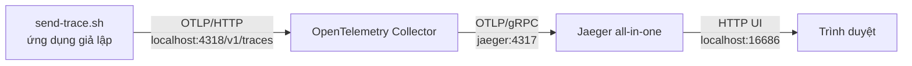

import { Step, Steps } from 'fumadocs-ui/components/steps';
import { File, Files } from 'fumadocs-ui/components/files';

<Callout type="info" title="Phạm vi của bài">
  Bài này dùng Docker Compose để chạy một pipeline trace tối thiểu trên máy cá nhân. Bạn không cần tạo hoặc phụ thuộc vào sample nào trong repository. Script `send-trace.sh` đóng vai trò ứng dụng giả lập: nó gửi một trace OTLP/HTTP có `service.name` đến Collector.
</Callout>

## Mục lục

- [Stack này làm gì](#stack-này-làm-gì)
- [Kiến trúc và luồng dữ liệu](#kiến-trúc-và-luồng-dữ-liệu)
- [Chuẩn bị](#chuẩn-bị)
- [Tạo các file](#tạo-các-file)
  - [`docker-compose.yaml`](#docker-composeyaml)
  - [`collector-config.yaml`](#collector-configyaml)
  - [`send-trace.sh`](#send-tracesh)
- [Khởi động stack](#khởi-động-stack)
  - [Kiểm tra cấu hình Compose](#kiểm-tra-cấu-hình-compose)
  - [Khởi động container](#khởi-động-container)
- [Gửi trace thử nghiệm](#gửi-trace-thử-nghiệm)
- [Mở UI và truy vấn theo service.name](#mở-ui-và-truy-vấn-theo-servicename)
- [Kiểm tra logs và health](#kiểm-tra-logs-và-health)
- [Dừng và xóa stack](#dừng-và-xóa-stack)
- [Troubleshooting](#troubleshooting)
  - [Collector không khởi động](#collector-không-khởi-động)
  - [Trace không xuất hiện trong Jaeger](#trace-không-xuất-hiện-trong-jaeger)
  - [Cổng đã được sử dụng](#cổng-đã-được-sử-dụng)
- [Giới hạn của local stack](#giới-hạn-của-local-stack)
- [Tiếp theo](#tiếp-theo)

## Stack này làm gì

Stack này giúp bạn kiểm tra trọn đường đi của một trace mà không cần tài khoản cloud:

- **Ứng dụng giả lập** (`send-trace.sh`) tạo một span, tức một đơn vị công việc trong trace, rồi gửi nó bằng **OTLP/HTTP**. OTLP là giao thức chuẩn của OpenTelemetry.
- **OpenTelemetry Collector** nhận trace, gom các record nhỏ bằng processor `batch`, rồi export sang Jaeger.
- **Jaeger** lưu trace trong bộ nhớ và cung cấp UI để tìm theo `service.name`, xem span và thời gian xử lý.

Mục tiêu của bài là thấy được một trace có service `local-curl`. Đây là cách kiểm tra đường truyền cơ bản, không phải cách instrument một ứng dụng thật. Để tạo trace từ code ứng dụng, xem [Trace đầu tiên](/getting-started/first-trace/).

## Kiến trúc và luồng dữ liệu



Collector dùng hai receiver OTLP để bạn có thể gửi bằng HTTP hoặc gRPC:

- Host port `4318` nhận OTLP/HTTP.
- Host port `4317` nhận OTLP/gRPC từ ứng dụng khác nếu bạn muốn thử thêm.
- Collector gửi nội bộ đến Jaeger qua OTLP/gRPC trên port `4317`.
- Jaeger UI mở ở `http://localhost:16686`.
- Health check của Collector mở ở `http://localhost:13133/`.

<Callout type="warn" title="Chỉ dùng cho local">
  Jaeger all-in-one trong bài lưu dữ liệu trong memory. Khởi động lại container có thể làm mất trace. Không expose các port này ra Internet và không xem cấu hình này là production topology.
</Callout>

## Chuẩn bị

Cài các công cụ sau:

1. Docker Engine hoặc Docker Desktop có Docker Compose v2. Kiểm tra bằng `docker --version` và `docker compose version`.
2. `curl` trên host để gửi trace. Linux và macOS thường đã có sẵn; Windows có thể dùng WSL hoặc Git Bash.
3. Một thư mục làm việc bất kỳ. Nên dùng thư mục tạm bên ngoài repository để các file thử nghiệm không bị nhầm là sample của repository.

Tạo thư mục và chuyển vào đó:

```bash
mkdir -p /tmp/otel-local-stack
cd /tmp/otel-local-stack
```

Nếu thư mục `/tmp` không phù hợp với hệ điều hành của bạn, thay bằng một thư mục local khác. Các lệnh còn lại giả định bạn đang đứng trong thư mục này.

## Tạo các file

Sau bước này, thư mục có cấu trúc sau:

<Files>
  <File name="docker-compose.yaml" />
  <File name="collector-config.yaml" />
  <File name="send-trace.sh" />
</Files>

Các tag image được đặt qua biến môi trường để dễ cập nhật mà không phải sửa pipeline. Default bên dưới là các tag release cụ thể, ổn định hơn `latest`; nếu môi trường của bạn đã chuẩn hóa version khác, hãy đặt `OTELCOL_VERSION` và `JAEGER_VERSION` trước khi chạy `docker compose`.

### `docker-compose.yaml`

Tạo file `docker-compose.yaml` với nội dung đầy đủ sau:

```yaml
services:
  jaeger:
    image: jaegertracing/all-in-one:${JAEGER_VERSION:-1.76.0}
    environment:
      COLLECTOR_OTLP_ENABLED: "true"
    ports:
      - "16686:16686"

  collector:
    image: otel/opentelemetry-collector-contrib:${OTELCOL_VERSION:-0.123.0}
    command:
      - "--config=/etc/otelcol-contrib/config.yaml"
    volumes:
      - ./collector-config.yaml:/etc/otelcol-contrib/config.yaml:ro
    depends_on:
      - jaeger
    ports:
      - "4317:4317"
      - "4318:4318"
      - "13133:13133"
```

`depends_on` chỉ đảm bảo container Jaeger được tạo trước Collector. Nó không đợi Jaeger hoàn tất khởi động. Collector sẽ retry export khi backend chưa sẵn sàng; xem logs nếu bạn muốn quan sát giai đoạn này.

### `collector-config.yaml`

Tạo file `collector-config.yaml`:

```yaml
receivers:
  otlp:
    protocols:
      grpc:
        endpoint: 0.0.0.0:4317
      http:
        endpoint: 0.0.0.0:4318

processors:
  batch:

exporters:
  otlp/jaeger:
    endpoint: jaeger:4317
    tls:
      insecure: true

extensions:
  health_check:
    endpoint: 0.0.0.0:13133

service:
  extensions:
    - health_check
  pipelines:
    traces:
      receivers:
        - otlp
      processors:
        - batch
      exporters:
        - otlp/jaeger
```

Pipeline này có ba phần: `receivers` nhận dữ liệu, `processors` xử lý dữ liệu, và `exporters` gửi dữ liệu đi. `batch` gom nhiều span trước khi gửi để giảm số request. Exporter dùng tên DNS `jaeger`, vì đó là tên service trên mạng nội bộ do Compose tạo.

### `send-trace.sh`

Tạo file `send-trace.sh`:

```bash
#!/usr/bin/env bash
set -euo pipefail

# Dùng timestamp hiện tại để trace nằm trong khoảng thời gian tìm kiếm mặc định của Jaeger.
# Chỉ dùng date +%s để script chạy được trên cả Linux và macOS.
start_ns=$(( $(date +%s) * 1000000000 - 100000000 ))
end_ns=$(( $(date +%s) * 1000000000 ))

curl --fail-with-body --silent --show-error \
  -X POST \
  -H 'Content-Type: application/json' \
  --data-binary @- \
  http://localhost:4318/v1/traces <<JSON
{
  "resourceSpans": [
    {
      "resource": {
        "attributes": [
          {
            "key": "service.name",
            "value": { "stringValue": "local-curl" }
          },
          {
            "key": "deployment.environment.name",
            "value": { "stringValue": "local" }
          }
        ]
      },
      "scopeSpans": [
        {
          "scope": {
            "name": "local-stack-demo",
            "version": "0.1.0"
          },
          "spans": [
            {
              "traceId": "4bf92f3577b34da6a3ce929d0e0e4736",
              "spanId": "00f067aa0ba902b7",
              "name": "GET /hello",
              "kind": "SPAN_KIND_SERVER",
              "startTimeUnixNano": "${start_ns}",
              "endTimeUnixNano": "${end_ns}",
              "attributes": [
                {
                  "key": "http.request.method",
                  "value": { "stringValue": "GET" }
                },
                {
                  "key": "url.path",
                  "value": { "stringValue": "/hello" }
                },
                {
                  "key": "http.response.status_code",
                  "value": { "intValue": "200" }
                }
              ],
              "status": { "code": "STATUS_CODE_OK" }
            }
          ]
        }
      ]
    }
  ]
}
JSON

printf 'Đã gửi trace của service local-curl qua OTLP/HTTP.\n'
```

Cấp quyền thực thi cho script:

```bash
chmod +x send-trace.sh
```

## Khởi động stack

<Steps>
<Step>

### Kiểm tra cấu hình Compose

Chạy lệnh sau để Compose render cấu hình và phát hiện lỗi YAML hoặc biến môi trường:

```bash
docker compose config
```

Nếu lệnh này thành công, bạn có thể xem image sẽ dùng bằng:

```bash
docker compose config --images
```

</Step>
<Step>

### Khởi động container

```bash
docker compose up -d
```

Lần đầu chạy có thể mất thời gian để tải image. Xem trạng thái:

```bash
docker compose ps
```

Hai service phải ở trạng thái đang chạy. Collector có thể log lỗi export trong vài giây đầu nếu Jaeger chưa sẵn sàng; hãy kiểm tra lại sau khi cả hai container đã khởi động.

</Step>
</Steps>

## Gửi trace thử nghiệm

Từ thư mục `/tmp/otel-local-stack`, chạy:

```bash
./send-trace.sh
```

HTTP `200` hoặc `202` từ Collector cho biết request OTLP/HTTP đã được nhận. Sau đó đợi một hoặc hai giây để processor `batch` flush dữ liệu sang Jaeger. Gửi thêm vài lần nếu muốn có nhiều trace để thử bộ lọc:

```bash
for _ in 1 2 3; do ./send-trace.sh; done
```

Để so sánh với trace sinh từ code thật, mở [Trace đầu tiên](/getting-started/first-trace/). Khi ứng dụng dùng OTLP/HTTP, endpoint host thường là `http://localhost:4318`; khi dùng OTLP/gRPC, endpoint thường là `http://localhost:4317` hoặc dạng endpoint gRPC tương ứng theo SDK.

## Mở UI và truy vấn theo service.name

Mở [Jaeger UI](http://localhost:16686) trong trình duyệt. Trong ô **Service**, chọn hoặc nhập `local-curl`, rồi bấm **Find Traces**.

Bạn sẽ thấy trace có tên `GET /hello`. Chọn trace để xem:

- `service.name=local-curl` trên resource của span.
- Thời lượng span giữa `startTimeUnixNano` và `endTimeUnixNano`.
- Các attributes `http.request.method`, `url.path` và `http.response.status_code`.
- Trace ID và span ID dùng để liên kết các operation.

Nếu danh sách Service chưa cập nhật, refresh UI và chạy lại `./send-trace.sh`. Jaeger chỉ hiển thị dữ liệu mà nó đã nhận; ô tìm kiếm không tự tạo trace.

## Kiểm tra logs và health

Kiểm tra health endpoint của Collector:

```bash
curl --fail http://localhost:13133/
```

Một response thành công cho biết process Collector và extension health check đang phục vụ request. Đây chưa phải là bằng chứng trace đã được export thành công.

Đọc logs của từng service:

```bash
docker compose logs --tail=100 collector
docker compose logs --tail=100 jaeger
```

Theo dõi logs trong lúc gửi trace:

```bash
docker compose logs -f collector
```

Trong logs, chú ý các dấu hiệu sau:

- Collector khởi động pipeline `traces` mà không báo lỗi cấu hình.
- Không có lỗi kết nối lặp lại đến `jaeger:4317`.
- Request đến receiver không bị từ chối vì sai protocol hoặc sai port.

## Dừng và xóa stack

Dừng container nhưng giữ network và container metadata:

```bash
docker compose stop
```

Dừng rồi xóa container và network của Compose:

```bash
docker compose down
```

Trong ví dụ này Jaeger lưu dữ liệu trong memory nên `down` cũng đồng nghĩa dữ liệu trace sẽ mất khi container bị xóa. Xóa luôn volumes nếu sau này bạn bổ sung volume vào Compose:

```bash
docker compose down -v
```

## Troubleshooting

### Collector không khởi động

Xem lỗi parse config hoặc lỗi không tìm thấy file:

```bash
docker compose logs collector
```

Đảm bảo bạn chạy lệnh trong đúng thư mục có cả `docker-compose.yaml` và `collector-config.yaml`. Sau đó kiểm tra phần `receivers`, `processors`, `exporters` và `service.pipelines.traces` trong YAML. Một component được khai báo nhưng không được nối vào pipeline không tạo ra đường truyền dữ liệu.

Nếu lỗi nói exporter `otlp/jaeger` không hợp lệ, hãy kiểm tra tag Collector và cú pháp exporter của distribution đang chạy. Image `contrib` được chọn vì có bộ component rộng hơn bản core; không nên đổi sang image core mà giữ nguyên giả định component một cách mù quáng.

### Trace không xuất hiện trong Jaeger

Kiểm tra theo thứ tự này:

1. Collector có đang chạy và health endpoint trả về thành công không?
2. `./send-trace.sh` có kết thúc không có lỗi không? Nếu không, kiểm tra port `4318` và đọc logs Collector.
3. Collector có báo lỗi export đến `jaeger:4317` không?
4. Bạn đã đợi batch flush một hoặc hai giây chưa?
5. Trong Jaeger, Service có đúng là `local-curl` không? Hãy mở rộng khoảng thời gian tìm kiếm nếu máy có clock không chính xác.

Nếu request được nhận nhưng Jaeger vẫn không có dữ liệu, xem logs của Jaeger và kiểm tra `COLLECTOR_OTLP_ENABLED` đang là `true`. Khi mở rộng stack sang metrics hoặc logs, hãy kiểm tra riêng pipeline và exporter của từng signal.

### Cổng đã được sử dụng

Lỗi kiểu `port is already allocated` nghĩa là một process khác đang giữ `16686`, `4317`, `4318` hoặc `13133`. Tìm process/container đang dùng cổng:

```bash
docker compose ps
docker ps
```

Bạn có thể đổi port phía host mà không đổi port nội bộ. Ví dụ, đổi Jaeger UI từ `16686:16686` thành `16687:16686`, rồi mở `http://localhost:16687`. Nếu đổi port Collector phía host, phải sửa URL trong `send-trace.sh`; port bên phải dấu `:` trong Compose vẫn phải khớp với receiver trong container.

## Giới hạn của local stack

Stack này phù hợp để học và kiểm tra kết nối. Nó không đại diện cho một hệ thống production vì:

- Jaeger all-in-one gộp nhiều vai trò vào một container và lưu trace trong memory.
- Không có TLS, authentication, authorization hoặc network policy.
- Không có persistent storage, replication, queue bền vững hay kế hoạch backup.
- Chưa có sampling, memory limiter, retry policy và capacity planning phù hợp với tải thật.
- Chỉ có trace pipeline. Metrics và logs cần receiver, processor, exporter và backend riêng.
- Chưa có monitoring cho chính Collector, alerting, ownership hoặc quy trình nâng cấp.

Trong production, topology agent/gateway, backend lưu trữ bền vững và boundary bảo mật cần được thiết kế theo workload. Xem [Agent và gateway](/deployment/agent-gateway/), [Production readiness](/production/production-readiness/) và [Security](/production/security/) trước khi đưa pattern này ra ngoài máy cá nhân.

## Tiếp theo

Sau khi truy vấn được `local-curl`, hãy chuyển từ dữ liệu giả lập sang ứng dụng thật:

<Cards>
  <Card title="Trace đầu tiên" href="/getting-started/first-trace/" description="Tạo và export trace từ một ứng dụng thay vì curl." />
  <Card title="Collector configuration" href="/collector/configuration/" description="Đọc cấu trúc YAML và cách các component liên kết." />
  <Card title="Jaeger" href="/protocols-backends/jaeger/" description="Hiểu backend trace đang hiển thị dữ liệu local." />
  <Card title="Lab: Collector pipeline" href="/labs/collector-pipeline/" description="Thực hành receiver, processor và exporter với pipeline riêng." />
</Cards>
