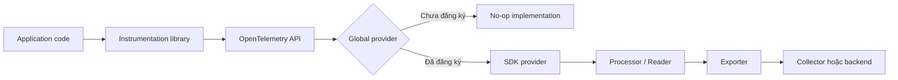
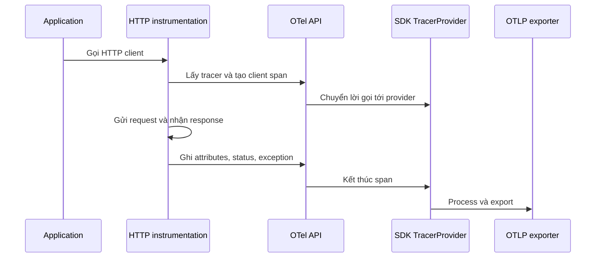

import { Step, Steps } from 'fumadocs-ui/components/steps';

<Callout type="info" title="Ý tưởng cốt lõi">
  OpenTelemetry API là hợp đồng mà application hoặc instrumentation library dùng để
  tạo telemetry. OpenTelemetry SDK là phần triển khai thực hiện việc xử lý, sampling
  và export telemetry. Tách hai lớp này giúp library có thể tích hợp OTel mà không
  ép ứng dụng phải dùng một backend hay một SDK cụ thể.
</Callout>

## Mục lục

- [API và SDK là gì](#api-và-sdk-là-gì)
- [Kiến trúc lúc ứng dụng chạy](#kiến-trúc-lúc-ứng-dụng-chạy)
- [OpenTelemetry API](#opentelemetry-api)
  - [API cung cấp hợp đồng](#api-cung-cấp-hợp-đồng)
  - [No-op implementation](#no-op-implementation)
  - [Global provider](#global-provider)
- [OpenTelemetry SDK](#opentelemetry-sdk)
  - [Provider](#provider)
  - [Processor và exporter của traces](#processor-và-exporter-của-traces)
  - [Reader và exporter của metrics](#reader-và-exporter-của-metrics)
  - [Logger provider](#logger-provider)
- [Instrumentation library dùng API như thế nào](#instrumentation-library-dùng-api-như-thế-nào)
- [Vòng đời khởi tạo và shutdown](#vòng-đời-khởi-tạo-và-shutdown)
  - [1. Đọc cấu hình](#1-đọc-cấu-hình)
  - [2. Tạo exporter và provider](#2-tạo-exporter-và-provider)
  - [3. Đăng ký provider](#3-đăng-ký-provider)
  - [4. Khởi động application](#4-khởi-động-application)
  - [5. Flush và shutdown](#5-flush-và-shutdown)
- [Ví dụ bootstrap tối thiểu](#ví-dụ-bootstrap-tối-thiểu)
- [Chọn API, SDK hay auto-instrumentation](#chọn-api-sdk-hay-auto-instrumentation)
- [Xác minh và xử lý lỗi](#xác-minh-và-xử-lý-lỗi)
  - [Kiểm tra theo từng lớp](#kiểm-tra-theo-từng-lớp)
  - [Các lỗi thường gặp](#các-lỗi-thường-gặp)
- [Bước tiếp theo](#bước-tiếp-theo)

## API và SDK là gì

Hãy xem API như **ổ cắm** và SDK như **thiết bị được cắm vào ổ**:

- **API** định nghĩa các interface và kiểu dữ liệu để code lấy tracer, meter,
  logger và tạo telemetry.
- **SDK** cung cấp implementation cho các interface đó. SDK quyết định telemetry
  được xử lý, giữ trong bộ nhớ bao lâu, sampling ra sao và gửi đi đâu.
- **Instrumentation library** là thư viện gắn telemetry vào framework hoặc client
  như HTTP server, database client và message queue. Library nên phụ thuộc vào API,
  còn application thường cấu hình SDK ở entry point.
- **Exporter** là adapter gửi telemetry tới một đích, chẳng hạn Collector qua
  OTLP. Exporter không phải là API và cũng không tự động làm cho application được
  instrument.

Ví dụ, một thư viện database có thể gọi API để tạo span. Nếu ứng dụng chưa cài SDK,
cuộc gọi đó vẫn an toàn nhưng thường tạo no-op span. Khi ứng dụng cài và đăng ký SDK,
cùng đoạn code thư viện có thể gửi span tới backend mà không cần sửa library.

<Callout type="warn" title="API không tự gửi dữ liệu">
  Cài một package API chỉ giúp code biên dịch và tạo telemetry object. Để nhìn thấy
  span hoặc metric ở Collector, ứng dụng còn phải cấu hình provider, exporter và
  lifecycle của SDK.
</Callout>

## Kiến trúc lúc ứng dụng chạy

Luồng phụ thuộc nên đi theo một chiều: instrumentation gọi API, provider của SDK
cung cấp implementation, rồi SDK chuyển telemetry qua processor hoặc reader tới
exporter.



Ở startup, application đăng ký SDK provider trước khi request đầu tiên được xử lý.
Ở shutdown, application flush telemetry rồi gọi `shutdown()` để đóng exporter và
giải phóng tài nguyên. Nếu đảo thứ tự này, những request đầu tiên có thể tạo no-op
telemetry hoặc những span cuối cùng có thể bị mất.

## OpenTelemetry API

### API cung cấp hợp đồng

API là lớp mà code nghiệp vụ hoặc library trực tiếp gọi. Các khái niệm chính là:

| Thành phần | Vai trò | Ví dụ operation |
| --- | --- | --- |
| `TracerProvider` | Cung cấp `Tracer` để tạo span và trace | `getTracer("checkout")` |
| `Tracer` | Tạo span cho một operation | `tracer.startActiveSpan("charge", ...)` |
| `MeterProvider` | Cung cấp `Meter` để tạo instruments | `getMeter("checkout")` |
| `Meter` | Tạo counter, histogram hoặc gauge | `meter.createCounter("orders.created")` |
| `LoggerProvider` | Cung cấp API tạo log record có correlation context | Tạo log record gắn trace context |
| `Context` | Mang trạng thái execution hiện tại | Active span và baggage |
| `Propagator` | Inject hoặc extract context qua boundary | Header `traceparent` |

API tập trung vào **tạo và truy cập telemetry**, không tập trung vào nơi lưu
telemetry. Vì vậy một instrumentation library không nên tự khởi tạo exporter, tự
chọn endpoint hoặc tự đăng ký global SDK provider.

### No-op implementation

Khi chưa có SDK provider, API dùng implementation rỗng — thường gọi là **no-op**.
No-op có hành vi an toàn:

- Gọi `startSpan()` trả về span không ghi dữ liệu.
- Thao tác với context vẫn giữ đúng contract của API.
- Code application không cần rải `if (sdkEnabled)` quanh mỗi instrumentation call.
- Không có dữ liệu để export cho tới khi provider thật được đăng ký.

No-op không phải là lỗi. Nó cho phép một library có telemetry optional. Tuy nhiên,
nếu application mong đợi trace mà vẫn thấy no-op, nguyên nhân thường là SDK chưa được
khởi tạo, khởi tạo quá muộn hoặc provider bị đăng ký ở sai process.

### Global provider

API thường cho phép đăng ký một provider global cho mỗi signal. Những lời gọi sau đó
sẽ lấy provider này khi code gọi `getTracer()`, `getMeter()` hoặc API tương ứng.

Global provider tiện cho application nhỏ và auto-instrumentation, nhưng có các quy
ước cần giữ:

1. Đăng ký provider một lần ở entry point.
2. Thực hiện việc đó trước khi import hoặc khởi động phần code cần instrument nếu
   framework khởi tạo instrumentation trong lúc import.
3. Không để mỗi module tự đăng ký một provider khác nhau.
4. Không dùng global registration để truyền credential hoặc cấu hình riêng giữa
   tenant; cấu hình đó thuộc application boundary.

Với ứng dụng nhiều process hoặc worker, mỗi process có runtime và provider riêng.
Đăng ký provider ở process chính không tự động cấu hình cho process con.

## OpenTelemetry SDK

SDK là runtime observability của ứng dụng. SDK biến các lời gọi API thành pipeline
telemetry có buffering, processing, sampling và exporting.

### Provider

Mỗi signal có provider và lifecycle riêng:

- `TracerProvider` quản lý tracer, span processor, sampler và span limits.
- `MeterProvider` quản lý meter, metric reader, views và metric limits.
- `LoggerProvider` quản lý log record processor và log exporter khi ngôn ngữ SDK
  hỗ trợ Logs API.

Provider cũng tạo **instrumentation scope**. Scope nhận diện library tạo telemetry,
thường gồm tên package, version và tùy chọn schema URL. Scope khác với
`service.name`: scope nói “thư viện nào tạo telemetry”, còn resource nói “entity nào
đang phát telemetry”.

### Processor và exporter của traces

Khi một span kết thúc, `SpanProcessor` quyết định SDK xử lý span đó như thế nào:

- **Simple processor** export ngay. Cách này dễ nhìn thấy trong demo nhưng có thể
  làm tăng latency của request.
- **Batch processor** gom nhiều span và export theo batch. Đây thường là lựa chọn
  phù hợp hơn cho production.
- **Sampler** quyết định span nào được giữ từ lúc span bắt đầu. Sampling khác với
  việc chỉ lọc ở exporter vì nó ảnh hưởng tới chi phí và thông tin context được
  truyền xuống.

Exporter chuyển span đã được SDK xử lý tới Collector hoặc backend. Nếu dùng OTLP,
application vẫn cần chọn đúng transport, endpoint, credential và timeout. SDK không
thể tự biết backend của bạn chỉ từ việc API đã tạo span.

### Reader và exporter của metrics

Metrics thường được đọc theo chu kỳ thay vì export ngay khi mỗi measurement xuất
hiện. `MetricReader` gọi SDK để collect dữ liệu ở một thời điểm và chuyển dữ liệu đó
cho exporter.

Hai kiểu thường gặp:

- **Periodic exporting**: SDK collect và export theo interval.
- **Pull reader**: một backend hoặc endpoint gọi vào để đọc metrics.

Metric exporter và trace exporter có lifecycle, timeout và failure mode riêng. Cấu
hình trace thành công không có nghĩa metrics cũng đang được export.

### Logger provider

Logs API liên kết log record với context hiện tại, nhờ đó log có thể chứa trace ID
và span ID. Việc liên kết này không biến mọi log thành span và cũng không thay thế
log pipeline của ứng dụng.

Nếu SDK hoặc backend chưa hỗ trợ Logs API trong stack bạn đang dùng, hãy giữ logging
hiện tại và dùng context correlation theo khả năng của runtime. Đừng tự parse trace
ID từ chuỗi log nếu logging instrumentation đã có cách chuẩn để thêm correlation.

## Instrumentation library dùng API như thế nào

Instrumentation library nên có ranh giới rõ ràng giữa hook vào thư viện được instrument
và việc gửi telemetry:



Một library chất lượng thường làm các việc sau:

1. Lấy tracer bằng tên và version ổn định của chính library.
2. Tạo span bao quanh operation mà nó hiểu, chẳng hạn một HTTP request.
3. Dùng active context để tạo parent-child relation.
4. Ghi semantic attributes cần thiết, không sao chép mọi dữ liệu request.
5. Đặt status và ghi exception khi operation thất bại.
6. Không tự cấu hình exporter, endpoint hoặc global provider.
7. Cho phép người dùng tắt instrumentation hoặc giảm chi tiết theo cấu hình.

Tên tracer không nên là `service.name`. Một service có thể dùng nhiều library, và
mỗi library cần scope riêng để backend phân biệt nguồn tạo span.

## Vòng đời khởi tạo và shutdown

Vòng đời nên được quản lý ở process boundary, không phải trong từng request.
Một thứ tự an toàn là:

<Steps>
<Step>

### 1. Đọc cấu hình

Đọc endpoint, credential, service identity, sampling và environment từ cấu hình
của process. Validate giá trị bắt buộc nhưng không log secret.

</Step>
<Step>

### 2. Tạo exporter và provider

Tạo exporter cho từng signal cần dùng. Gắn exporter vào processor hoặc reader,
đặt provider tương ứng và cấu hình resource như `service.name`.

</Step>
<Step>

### 3. Đăng ký provider

Đăng ký provider global trước khi server, worker hoặc framework bắt đầu nhận việc.
Nếu dùng auto-instrumentation, tuân thủ cơ chế preload/agent của runtime để hook
được cài trước module đích.

</Step>
<Step>

### 4. Khởi động application

Sau khi SDK sẵn sàng, khởi động HTTP server, queue consumer hoặc scheduler. Từ
đây instrumentation library sẽ nhận provider thật thay vì no-op provider.

</Step>
<Step>

### 5. Flush và shutdown

Khi nhận tín hiệu dừng, ngừng nhận work mới, chờ các operation đang chạy trong
giới hạn, gọi `forceFlush()` nếu SDK cung cấp, rồi gọi `shutdown()`. Đặt timeout
cho shutdown để process không treo vô hạn vì exporter.

</Step>
</Steps>

<Callout type="warn" title="Đừng shutdown theo request">
  `shutdown()` đóng provider và exporter cho toàn bộ process. Gọi nó sau mỗi request
  sẽ làm các request sau mất telemetry hoặc tạo provider lỗi. Chỉ gọi shutdown khi
  process thực sự kết thúc.
</Callout>

## Ví dụ bootstrap tối thiểu

Ví dụ sau minh họa **application bootstrap** bằng TypeScript. Tên class và package
cụ thể thay đổi theo ngôn ngữ; điểm quan trọng là SDK được cấu hình và đăng ký
trước khi server nhận request.

```ts
// telemetry.ts — chạy một lần khi process khởi động
const resource = createResource({
  "service.name": "checkout",
  "deployment.environment.name": "local",
});

const traceExporter = createOtlpTraceExporter({
  url: process.env.OTEL_EXPORTER_OTLP_TRACES_ENDPOINT,
});

const tracerProvider = createTracerProvider({
  resource,
  spanProcessors: [createBatchSpanProcessor(traceExporter)],
});

registerGlobalTracerProvider(tracerProvider);

export async function shutdownTelemetry() {
  await tracerProvider.shutdown();
}
```

Code nghiệp vụ hoặc instrumentation library chỉ cần lấy API:

```ts
const tracer = getTracer("checkout.http", "1.0.0");

return tracer.startActiveSpan("checkout.create", async (span) => {
  try {
    const result = await createOrder();
    span.setAttribute("app.order_id", result.id);
    span.setStatus({ code: "OK" });
    return result;
  } catch (error) {
    span.recordException(error);
    span.setStatus({ code: "ERROR" });
    throw error;
  } finally {
    span.end();
  }
});
```

Đây là pseudocode có chủ ý: `createResource`, `createTracerProvider` và các hàm
`registerGlobalTracerProvider` đại diện cho API của SDK trong từng ngôn ngữ. Khi
viết code thật, hãy dùng package và phương thức của runtime tương ứng; xem hướng
dẫn [JavaScript và Node.js](/languages/javascript-nodejs/) hoặc trang ngôn ngữ bạn
đang dùng.

Một lỗi phổ biến là gọi `span.end()` trong `try` rồi lại gọi lần nữa trong `finally`.
Ví dụ trên chỉ kết thúc span ở `finally`, nên cả success và error đều có một điểm
kết thúc. Nếu callback có thể bị gọi nhiều lần bởi framework, hãy bảo đảm lifecycle
của span vẫn chỉ được kết thúc một lần.

## Chọn API, SDK hay auto-instrumentation

| Nhu cầu | Lựa chọn phù hợp | Lý do |
| --- | --- | --- |
| Viết library có telemetry tùy chọn | Phụ thuộc API | Library không khóa người dùng vào exporter hoặc backend. |
| Cấu hình telemetry cho một application | API + SDK | SDK cung cấp provider, processing và exporting. |
| Có trace cơ bản mà ít sửa code | Auto-instrumentation + SDK/agent của runtime | Framework và client phổ biến được hook tự động. |
| Instrument operation nghiệp vụ đặc thù | Manual instrumentation qua API | Chỉ code nghiệp vụ biết tên operation và thuộc tính có ý nghĩa. |
| Chạy test không muốn exporter thật | API no-op hoặc in-memory exporter | Test nhanh, deterministic và không gửi dữ liệu ra ngoài. |

Auto-instrumentation không loại bỏ SDK. Agent hoặc package auto-instrumentation vẫn
cần một runtime telemetry phù hợp để provider xử lý và export span. Manual instrumentation
cũng không có nghĩa phải tự viết exporter; application có thể dùng API để tạo span
và để SDK lo phần còn lại.

## Xác minh và xử lý lỗi

### Kiểm tra theo từng lớp

Khi không thấy telemetry, kiểm tra theo thứ tự từ code tới backend:

1. **Instrumentation**: operation có thực sự chạy qua hook hoặc đoạn code tạo span
   không? Tạm thời đặt tên span dễ tìm để xác minh.
2. **API**: code có lấy đúng tracer/meter không? Nếu provider là no-op, telemetry
   sẽ không có dữ liệu để export.
3. **SDK provider**: provider có được tạo và đăng ký trước khi application start
   không? Có provider khác ghi đè hoặc được đăng ký quá muộn không?
4. **Processor/reader**: span có được end không? Metric reader có chạy tới kỳ collect
   không? Batch queue có bị đầy hoặc process thoát quá sớm không?
5. **Exporter và transport**: endpoint, protocol, port, TLS, credential và timeout
   có đúng không?
6. **Collector/backend**: receiver và pipeline có đang hoạt động không? Backend có
   filter, sampling hoặc retention policy làm ẩn dữ liệu không?

Kiểm tra từng lớp bằng một span hoặc metric tối thiểu trước khi thêm attributes,
đổi sampler hay tối ưu batch. Cách này giúp phân biệt lỗi tạo telemetry với lỗi vận
chuyển telemetry.

### Các lỗi thường gặp

| Triệu chứng | Nguyên nhân thường gặp | Cách xử lý |
| --- | --- | --- |
| Không có span nào | SDK chưa đăng ký hoặc app chạy trước bootstrap | Import/chạy telemetry bootstrap trước server hoặc worker. |
| Span tồn tại nhưng không export | Span chưa `end()` hoặc batch chưa flush | Kiểm tra mọi nhánh kết thúc span và lifecycle shutdown. |
| Chỉ thấy span của framework | Auto-instrumentation hoạt động nhưng manual hook chưa chạy | Kiểm tra code path và tracer được lấy từ đúng API. |
| Service name bị thiếu | Resource không có `service.name` hoặc cấu hình bị ghi đè | Đặt service identity ở resource và kiểm tra thứ tự merge config. |
| Mỗi package tạo telemetry không nhất quán | Library tự tạo provider riêng | Để application đăng ký provider; library chỉ dùng API. |
| Test gửi dữ liệu thật | Test dùng exporter production hoặc global state còn sót | Dùng in-memory/no-op provider và reset global state giữa test. |
| Shutdown treo | Exporter chờ network không có timeout | Đặt export/shutdown timeout và có fallback khi process dừng. |

<Callout type="idea" title="Debug nhanh">
  Trước tiên thêm một exporter debug hoặc in-memory ở môi trường local. Nếu span
  xuất hiện ở đó, API và SDK đã tạo được telemetry; hãy tiếp tục kiểm tra exporter
  mạng hoặc Collector thay vì sửa instrumentation một cách mù quáng.
</Callout>

## Bước tiếp theo

API và SDK là nền tảng chung cho cả auto-instrumentation và manual instrumentation.
Sau khi phân biệt được hai lớp, hãy học cách chọn và nạp instrumentation library,
đặt resource, rồi tạo span nghiệp vụ.

<Cards>
  <Card
    title="Auto-instrumentation"
    href="/instrumentation/auto-instrumentation/"
    description="Để agent hoặc package tự động tạo telemetry cho framework phổ biến."
  />
  <Card
    title="Manual instrumentation"
    href="/instrumentation/manual-instrumentation/"
    description="Tạo span, metric và context cho các operation nghiệp vụ đặc thù."
  />
  <Card
    title="SDK configuration"
    href="/instrumentation/configuration/"
    description="Cấu hình resource, exporter, sampler và propagator cho application."
  />
</Cards>
