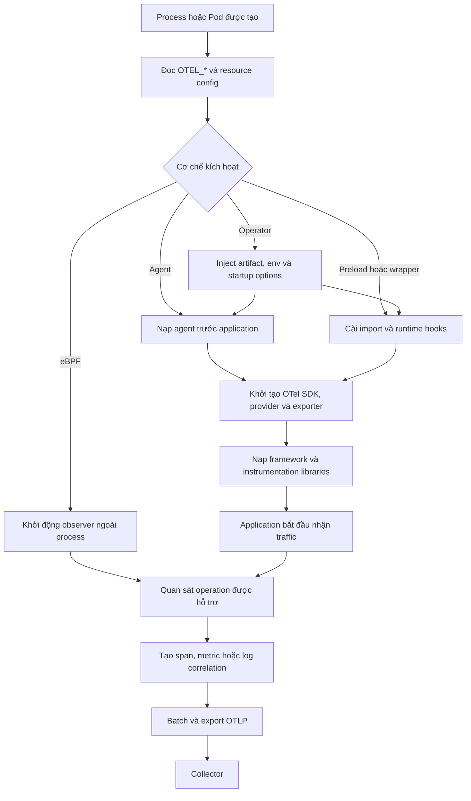

import { Step, Steps } from 'fumadocs-ui/components/steps';

<Callout type="info" title="Mục tiêu của trang">
  Auto-instrumentation giúp quan sát nhanh các biên kỹ thuật như HTTP, database và
  messaging mà không phải tự bọc từng lời gọi. Nó không tự hiểu nghiệp vụ của ứng
  dụng. Cách triển khai tốt thường là dùng auto-instrumentation cho hạ tầng phổ
  biến, rồi bổ sung manual instrumentation có chọn lọc cho operation nghiệp vụ.
</Callout>

## Mục lục

- [Auto-instrumentation là gì](#auto-instrumentation-là-gì)
  - [Auto-instrumentation và zero-code](#auto-instrumentation-và-zero-code)
  - [Những gì tự động thấy và không thấy](#những-gì-tự-động-thấy-và-không-thấy)
- [Cơ chế hoạt động](#cơ-chế-hoạt-động)
  - [Agent và biến đổi bytecode](#agent-và-biến-đổi-bytecode)
  - [Preload và import hook](#preload-và-import-hook)
  - [Profiler native extension và runtime hook](#profiler-native-extension-và-runtime-hook)
  - [Quan sát ngoài process bằng eBPF](#quan-sát-ngoài-process-bằng-ebpf)
- [Luồng khởi động](#luồng-khởi-động)
  - [Startup order là một phần của tính đúng đắn](#startup-order-là-một-phần-của-tính-đúng-đắn)
- [Mức độ hỗ trợ theo runtime](#mức-độ-hỗ-trợ-theo-runtime)
- [Chọn cơ chế triển khai](#chọn-cơ-chế-triển-khai)
  - [Chọn agent hoặc runtime bundle](#chọn-agent-hoặc-runtime-bundle)
  - [Chọn package và preload](#chọn-package-và-preload)
  - [Chọn OpenTelemetry Operator](#chọn-opentelemetry-operator)
- [Cấu hình nền tảng bằng biến môi trường](#cấu-hình-nền-tảng-bằng-biến-môi-trường)
  - [Cấu hình OTLP tối thiểu](#cấu-hình-otlp-tối-thiểu)
  - [Quy tắc quản lý cấu hình](#quy-tắc-quản-lý-cấu-hình)
- [Instrumentation scope và semantic conventions](#instrumentation-scope-và-semantic-conventions)
- [Phối hợp với manual instrumentation và tránh span trùng](#phối-hợp-với-manual-instrumentation-và-tránh-span-trùng)
  - [Nhận diện kiểu trùng lặp](#nhận-diện-kiểu-trùng-lặp)
  - [Quy định quyền sở hữu span](#quy-định-quyền-sở-hữu-span)
- [Xác minh bằng Collector và debug exporter](#xác-minh-bằng-collector-và-debug-exporter)
  - [Collector cục bộ tối thiểu](#collector-cục-bộ-tối-thiểu)
  - [Checklist xác minh một request](#checklist-xác-minh-một-request)
- [Hiệu năng và bảo mật](#hiệu-năng-và-bảo-mật)
  - [Kiểm soát chi phí runtime](#kiểm-soát-chi-phí-runtime)
  - [Giảm bề mặt tấn công và rò rỉ dữ liệu](#giảm-bề-mặt-tấn-công-và-rò-rỉ-dữ-liệu)
- [Rollout canary và rollback](#rollout-canary-và-rollback)
  - [Lập inventory và baseline](#lập-inventory-và-baseline)
  - [Kiểm chứng trong staging](#kiểm-chứng-trong-staging)
  - [Canary trên một cohort nhỏ](#canary-trên-một-cohort-nhỏ)
  - [Mở rộng có cổng kiểm soát](#mở-rộng-có-cổng-kiểm-soát)
  - [Rollback bằng cách bỏ injection](#rollback-bằng-cách-bỏ-injection)
- [Troubleshooting theo triệu chứng](#troubleshooting-theo-triệu-chứng)
- [Khi nào cần bổ sung manual instrumentation](#khi-nào-cần-bổ-sung-manual-instrumentation)
- [Checklist trước production](#checklist-trước-production)
- [Bước tiếp theo](#bước-tiếp-theo)

## Auto-instrumentation là gì

**Auto-instrumentation** là việc OpenTelemetry tự gắn logic tạo telemetry vào
framework hoặc thư viện đang chạy. Logic này thường bao quanh những operation đã
có ranh giới rõ ràng, ví dụ:

- nhận một HTTP request và trả response;
- gọi một HTTP hoặc RPC service khác;
- thực thi câu lệnh qua database client;
- publish hoặc consume message;
- chạy một job qua framework scheduler;
- thu thập runtime metrics nếu distro của runtime hỗ trợ.

Instrumentation tạo span bằng OpenTelemetry API, lấy context hiện tại, inject
hoặc extract trace context, và ghi các attribute theo semantic conventions. SDK
sau đó sampling, batch và export dữ liệu. Vì vậy, “đã hook được framework” và
“đã gửi được dữ liệu” là hai điều khác nhau.

Một mental model ngắn gọn:

```text
Cơ chế hook  →  Instrumentation library  →  OTel API/SDK  →  OTLP  →  Collector
   ở startup       hiểu HTTP/DB/...          xử lý dữ liệu              định tuyến
```

### Auto-instrumentation và zero-code

Hai thuật ngữ liên quan nhưng không hoàn toàn đồng nghĩa:

- **Auto-instrumentation** nói về cách telemetry được tạo tự động quanh code của
  framework hoặc library.
- **Zero-code instrumentation** nói về cách kích hoạt mà không sửa source code
  ứng dụng. Bạn vẫn phải thay đổi command khởi động, image, biến môi trường hoặc
  manifest triển khai.
- **Instrumentation library** là package chứa hiểu biết về một thư viện đích.
  Package đó có thể được agent nạp tự động, hoặc application đăng ký trong một
  file bootstrap.
- **Library instrumentation** cũng có thể được tác giả thư viện tích hợp sẵn.
  Khi đó library gọi OTel API trực tiếp và không cần runtime patching cho chính
  operation đó.

Ví dụ, một package HTTP instrumentation là auto-instrumentation dù application
phải thêm file bootstrap để đăng ký package. Ngược lại, một Java agent có thể
cung cấp zero-code vì chỉ cần thêm tùy chọn startup, nhưng bên trong agent vẫn
nạp nhiều instrumentation libraries.

<Callout type="warn" title="Zero-code không có nghĩa zero-change">
  Hãy quản lý agent, preload flag, biến môi trường và manifest như một thay đổi
  production bình thường. Chúng có thể ảnh hưởng startup, hiệu năng, dữ liệu xuất
  ra và bề mặt tấn công của process.
</Callout>

### Những gì tự động thấy và không thấy

| Auto-instrumentation thường thấy | Auto-instrumentation thường không biết |
| --- | --- |
| Route HTTP, method, status và latency | Đơn hàng nào có giá trị cao hoặc vì sao bị từ chối |
| Loại database operation và thời gian gọi | Ý nghĩa nghiệp vụ của transaction hoặc query |
| Producer, consumer và messaging destination | Message đại diện cho workflow nghiệp vụ nào |
| Exception đi qua API được hook | Lỗi đã bị application bắt rồi chuyển thành trạng thái nghiệp vụ |
| Quan hệ parent-child nếu context được truyền đúng | Causality qua custom queue hoặc callback không được hỗ trợ |
| Metadata runtime và thư viện đã được detector nhận diện | Tenant, feature flag hoặc business outcome riêng của hệ thống |

Kết luận thực dụng: dùng auto-instrumentation để có **coverage kỹ thuật ban đầu**.
Đừng ép nó suy đoán dữ liệu mà chỉ code nghiệp vụ mới biết.

## Cơ chế hoạt động

Các runtime khác nhau cần cơ chế hook khác nhau. Tất cả đều có cùng mục tiêu:
chạy logic “trước” và “sau” operation đích, đồng thời không thay đổi kết quả của
operation đó.

### Agent và biến đổi bytecode

Runtime có bytecode hoặc cơ chế attach agent có thể nạp một agent trước application.
Agent nhận biết class hoặc method của framework, rồi biến đổi bytecode khi class
được load. Logic được chèn sẽ tạo span, kích hoạt context, ghi exception và kết
thúc span.

Đây là mô hình quen thuộc của Java agent. Ưu điểm là coverage rộng mà không sửa
source. Đổi lại, agent phải tương thích với runtime, framework, class loader và
kiểu đóng gói của application. Native image, custom class loader hoặc library
phiên bản chưa được hỗ trợ có thể làm hook không khớp.

### Preload và import hook

Runtime module-based thường cho phép preload một module trước entry point. Module
preload cài hook vào cơ chế load module hoặc patch API của thư viện trước khi
application import thư viện đó.

Node.js dùng startup preload; Python zero-code dùng launcher và chủ yếu monkey
patch các hàm library trong runtime. Điểm quan trọng không phải tên flag cụ thể,
mà là **preload phải chạy trước import đầu tiên của thư viện đích**.

Nếu HTTP framework đã được import và giữ reference tới hàm gốc, patch sau đó có
thể không còn tác dụng. Đây là lý do một file telemetry được import ở cuối entry
point thường cho kết quả thiếu hoặc không ổn định.

### Profiler native extension và runtime hook

Một số runtime cung cấp profiler API, startup hook hoặc native extension. Cơ chế
này có thể quan sát lúc method được biên dịch hoặc chạy, rồi gọi instrumentation
callback ở ranh giới phù hợp.

Ví dụ điển hình là .NET automatic instrumentation qua profiler/startup hooks và
PHP qua extension kết hợp instrumentation packages. Cài extension hoặc profiler
chỉ tạo **khả năng hook**. Bạn vẫn cần SDK, exporter và instrumentation tương ứng
để tạo telemetry hữu ích.

### Quan sát ngoài process bằng eBPF

Instrumentation dựa trên eBPF quan sát executable, system call hoặc giao thức mạng
ở Linux mà không patch source code trong process. Cách này hữu ích khi không thể
sửa image, khi binary đã biên dịch sẵn, hoặc khi cần coverage nhanh trên nhiều
runtime.

Tuy nhiên, eBPF nhìn rõ giao thức hơn nghiệp vụ. Nó có thể thấy HTTP, gRPC hoặc
một số database protocol, nhưng không tự biết `checkout.approve` nghĩa là gì.
Nó cũng cần kernel, capability và mô hình bảo mật phù hợp. Hãy xem eBPF như một
lựa chọn riêng, không phải bản thay thế tương đương cho mọi language agent.

## Luồng khởi động



Operator không instrument request trong control plane. Operator thay đổi Pod lúc
admission hoặc chuẩn bị artifact bằng init container, sau đó runtime trong Pod
vẫn dùng agent, preload hay profiler tương ứng.

### Startup order là một phần của tính đúng đắn

Một thứ tự an toàn là:

1. Chuẩn bị artifact instrumentation đã được pin và kiểm chứng.
2. Inject biến môi trường, credential reference và startup option.
3. Nạp agent, profiler, extension hoặc preload module.
4. Khởi tạo SDK provider, propagator, processor và exporter.
5. Đăng ký instrumentation trước khi framework hoặc client library được load.
6. Khởi động server, worker, consumer và scheduler.
7. Khi dừng, ngừng nhận work mới rồi flush và shutdown trong một timeout hữu hạn.

Với process model dạng pre-fork hoặc nhiều worker, hãy kiểm tra mỗi worker có SDK
và hook đúng cách. Provider, queue và network connection được tạo ở process cha
không phải lúc nào cũng an toàn để dùng sau fork.

Dạng command tổng quát nên có cấu trúc sau; đây là pseudocode, không phải lệnh của
một runtime cụ thể:

```bash
exec runtime <agent-or-preload-options> application-entrypoint
```

Dùng `exec` trong entrypoint container giúp application nhận đúng tín hiệu dừng.
Không giả định có thể hot-attach agent sau khi process đã nhận traffic. Phần lớn
thay đổi injection cần restart process hoặc tạo Pod mới.

<Callout type="error" title="Lỗi startup phổ biến nhất">
  Application import framework trước, telemetry bootstrap chạy sau. Kết quả có
  thể là không có span, chỉ có một phần span, hoặc context propagation bị đứt.
  Hãy đặt instrumentation ở startup mechanism của runtime thay vì dựa vào thứ tự
  import ngẫu nhiên trong code nghiệp vụ.
</Callout>

## Mức độ hỗ trợ theo runtime

Bảng này mô tả **kiểu tích hợp upstream phổ biến**, không phải compatibility
matrix cho mọi framework. Danh sách library được hỗ trợ thay đổi nhanh hơn trang
này; luôn đối chiếu [OpenTelemetry Registry](https://opentelemetry.io/ecosystem/registry/?component=instrumentation)
và tài liệu của đúng distro trước khi rollout.

| Runtime hoặc môi trường | Cơ chế zero-code phổ biến | Mức coverage thực tế cần kỳ vọng | Điểm phải kiểm tra |
| --- | --- | --- | --- |
| JVM | Java agent và biến đổi bytecode | Rộng cho framework server, HTTP client, database và messaging phổ biến | Java/runtime được hỗ trợ, class loader, agent extension và danh sách library |
| .NET | Profiler API, startup hook và native components | Rộng cho các integration có trong automatic instrumentation distro | OS, architecture, hosting model, self-contained deployment và profiler conflict |
| Node.js | Package auto-instrumentation được preload trước entry point | Tốt cho module có instrumentation; phụ thuộc cách module được load | CommonJS/ESM, preload order, bundler và package version |
| Python | Launcher cùng instrumentation packages, chủ yếu dùng monkey patching | Tốt cho framework/package đã được registry nhận diện | Virtual environment, worker model, import order và package tương thích |
| PHP | OpenTelemetry extension, Composer autoloading, SDK và instrumentation packages | Chỉ có telemetry cho integration đã cài; extension một mình chưa đủ | Extension được bật, autoload order, SAPI và package instrumentation |
| Go | eBPF hoặc compile-time approach tùy use case | Có thể cho edge/protocol coverage; upstream mô tả Go zero-code là work in progress | Kernel/capability, binary, target executable, framework và propagation limitations |
| Linux đa runtime | OpenTelemetry eBPF Instrumentation ngoài process | Rộng ở lớp giao thức và RED metrics; ít ngữ nghĩa application hơn language agent | Kernel, BTF, privileges, protocol encryption path và khả năng context association |
| Runtime không có distro zero-code phù hợp | Library instrumentation hoặc manual API/SDK | Chính xác hơn nhưng cần bootstrap hoặc sửa code | Registry, lifecycle SDK và ownership của từng operation |

Tài liệu zero-code upstream hiện liệt kê các hướng dành cho Go, .NET, PHP, Python,
Java và JavaScript. Tài liệu Operator mô tả injection cho .NET, Java, Node.js,
Python và Go; một số capability như Go có thể nằm sau feature gate. Đây là claim
dễ thay đổi theo release, vì vậy hãy kiểm tra trực tiếp
[trang Zero-code Instrumentation](https://opentelemetry.io/docs/zero-code/) và
[tài liệu Operator automatic instrumentation](https://opentelemetry.io/docs/platforms/kubernetes/operator/automatic/)
khi chốt kiến trúc.

<Callout type="idea" title="Đừng đánh giá hỗ trợ chỉ bằng tên runtime">
  Một runtime “được hỗ trợ” không đồng nghĩa mọi library trong ứng dụng đều được
  hook. Compatibility thực tế là giao của runtime, OS, architecture, framework,
  phiên bản library, kiểu đóng gói và cơ chế startup.
</Callout>

## Chọn cơ chế triển khai

| Tiêu chí | Agent hoặc runtime bundle | Package và preload | Operator | eBPF ngoài process |
| --- | --- | --- | --- | --- |
| Có sửa source code không | Không | Không, hoặc chỉ cần bootstrap nhỏ | Không sửa source; có sửa manifest/policy | Không |
| Ai quản lý artifact | Image/host hoặc platform team | Application team qua dependency manager | Platform team qua CR và admission | Platform/SRE |
| Kiểm soát library bật tắt | Thường qua config riêng của distro | Rõ ở dependency và danh sách registration | Qua `Instrumentation` CR và env runtime-specific | Theo protocol/process discovery |
| Phù hợp nhất khi | Có quyền sửa startup command | Có quyền quản lý dependency và entry point | Kubernetes cần chuẩn hóa fleet | Khó sửa workload hoặc cần coverage giao thức nhanh |
| Rủi ro nổi bật | Compatibility và startup overhead | Import order và dependency drift | Mutation ngoài ý muốn, blast radius theo namespace | Privilege cao và thiếu business semantics |
| Rollback | Bỏ startup option rồi restart | Bỏ preload/package config rồi restart | Bỏ annotation/policy rồi recreate Pod | Dừng DaemonSet/sidecar/observer |

### Chọn agent hoặc runtime bundle

Chọn agent khi runtime có distro upstream trưởng thành, application có startup
command ổn định và bạn muốn coverage rộng với ít thay đổi. Pin artifact theo digest
hoặc checksum. Đừng tải “latest” từ Internet mỗi lần process khởi động.

Agent cũng phù hợp khi nhiều team dùng cùng runtime và platform team có thể kiểm
thử một compatibility matrix chung. Nếu application có custom class loader,
native image hoặc profiler khác, hãy chạy proof of compatibility trước.

### Chọn package và preload

Chọn package khi application team muốn quản lý instrumentation trong dependency
lockfile, cần bật chính xác vài integration, hoặc không thể cài agent ở host.
Package/preload cũng giúp test cùng application build trong CI.

Hãy giữ bootstrap tối thiểu. Bootstrap nên cấu hình instrumentation và SDK, không
chứa logic nghiệp vụ. Lock version của instrumentation cùng các framework đích
để dependency update không âm thầm thay đổi span shape.

### Chọn OpenTelemetry Operator

Chọn Operator khi workload chạy trên Kubernetes và tổ chức cần:

- một cách khai báo thống nhất cho endpoint, resource, propagator và sampler;
- injection theo workload hoặc namespace;
- tách quản trị instrumentation khỏi application image;
- rollout và rollback bằng deployment policy.

Operator là admission-time automation. Annotation sai namespace, chọn nhầm
container trong Pod nhiều container, hoặc feature gate chưa bật đều có thể làm
injection không xảy ra. Ngược lại, opt-in ở namespace quá rộng có thể instrument
workload ngoài dự kiến.

<Callout type="warn" title="Operator không loại bỏ compatibility testing">
  Operator chỉ phân phối và kích hoạt artifact. Nó không làm một agent trở nên
  tương thích với framework, OS hay architecture vốn chưa được agent hỗ trợ.
</Callout>

## Cấu hình nền tảng bằng biến môi trường

OpenTelemetry chuẩn hóa nhiều biến `OTEL_*`, nhưng specification cho phép từng
implementation lựa chọn mức hỗ trợ. Đọc tài liệu của distro để biết biến chung
nào được triển khai và biến runtime-specific nào cần thêm.

### Cấu hình OTLP tối thiểu

Ví dụ sau tập trung vào traces và dùng OTLP/HTTP. Thay hostname bằng Collector
nội bộ của môi trường. Không copy credential vào file hoặc log:

```bash
export OTEL_SERVICE_NAME="checkout"
export OTEL_RESOURCE_ATTRIBUTES="deployment.environment.name=staging,service.version=2026-03-15"

export OTEL_TRACES_EXPORTER="otlp"
export OTEL_EXPORTER_OTLP_ENDPOINT="https://otel-collector.example.internal:4318"
export OTEL_EXPORTER_OTLP_PROTOCOL="http/protobuf"

export OTEL_PROPAGATORS="tracecontext,baggage"
export OTEL_TRACES_SAMPLER="parentbased_traceidratio"
export OTEL_TRACES_SAMPLER_ARG="0.10"
export OTEL_LOG_LEVEL="info"
```

| Biến | Vai trò | Lỗi thường gặp |
| --- | --- | --- |
| `OTEL_SERVICE_NAME` | Đặt resource attribute `service.name` | Mọi service dùng cùng tên hoặc để tên mặc định khó truy vấn |
| `OTEL_RESOURCE_ATTRIBUTES` | Gắn environment, version và metadata resource | Hard-code `service.instance.id` giống nhau cho mọi replica |
| `OTEL_EXPORTER_OTLP_ENDPOINT` | Đặt endpoint OTLP dùng chung | Nhầm scheme, port, path hoặc gửi ra ngoài network policy |
| `OTEL_EXPORTER_OTLP_PROTOCOL` | Chọn transport như `grpc` hoặc `http/protobuf` | Protocol của exporter không khớp receiver Collector |
| `OTEL_PROPAGATORS` | Chọn format inject và extract context | Các service dùng propagator khác nhau làm gãy trace |
| `OTEL_TRACES_SAMPLER` | Chọn chiến lược sampling | Dùng sampler không parent-based làm quyết định không nhất quán |
| `OTEL_TRACES_SAMPLER_ARG` | Đặt tham số cho sampler ratio | Giá trị ngoài khoảng hợp lệ hoặc tưởng `0.1` là 10 request cố định |
| `OTEL_LOG_LEVEL` | Điều chỉnh internal diagnostic logs | Để `debug` lâu trong production gây log lớn và tăng overhead |

Theo specification, `OTEL_SERVICE_NAME` có ưu tiên hơn `service.name` trong
`OTEL_RESOURCE_ATTRIBUTES`. Với endpoint, biến theo signal như
`OTEL_EXPORTER_OTLP_TRACES_ENDPOINT` thường cụ thể hơn biến endpoint chung. Đừng
đặt đồng thời nhiều nguồn nếu chưa xác định precedence của distro.

Cấu hình trên dùng sampler 10% để minh họa, không phải giá trị production mặc
định cho mọi hệ thống. Chọn sampling bằng dữ liệu về traffic, ngân sách và yêu
cầu điều tra. Trong một canary rất nhỏ, có thể tạm giữ toàn bộ trace để kiểm tra
shape rồi giảm lại trước khi mở rộng.

### Quy tắc quản lý cấu hình

1. **Một nguồn sở hữu:** xác định Helm values, deployment manifest hay platform
   policy là nguồn chuẩn. Tránh vừa set trong image vừa override ở runtime.
2. **Tách identity khỏi instance:** `service.name` ổn định giữa replica;
   `service.instance.id` phải duy nhất và nên do detector hoặc platform tạo.
3. **Không để secret trong tài liệu:** lấy OTLP headers hoặc certificate từ secret
   store. Không in toàn bộ environment khi debug.
4. **Khớp endpoint và protocol:** OTLP/gRPC và OTLP/HTTP là hai transport khác
   nhau. Mở port không đồng nghĩa receiver đã bật đúng protocol.
5. **Giữ propagator nhất quán:** `tracecontext,baggage` là lựa chọn phổ biến. Chỉ
   thêm format legacy khi có kế hoạch migration và kiểm thử deduplication.
6. **Tắt signal có chủ ý:** nếu rollout chỉ kiểm tra traces, cấu hình signal khác
   theo khả năng của distro thay vì để exporter mặc định liên tục báo lỗi.
7. **Ghi lại config hiệu lực:** lưu bản cấu hình đã redaction cùng deployment
   revision để điều tra và rollback.

Xem danh sách và quy tắc parse chính thức tại
[Environment Variable Specification](https://opentelemetry.io/docs/specs/otel/configuration/sdk-environment-variables/).

## Instrumentation scope và semantic conventions

Mỗi instrumentation library lấy tracer, meter hoặc logger với một
**instrumentation scope**. Scope nhận diện phần mềm tạo telemetry, thường gồm tên,
version và có thể có schema URL. Scope không phải service identity.

| Lớp metadata | Trả lời câu hỏi | Ví dụ |
| --- | --- | --- |
| Resource | Entity nào phát telemetry? | `service.name=checkout` |
| Instrumentation scope | Library hoặc module nào tạo telemetry? | HTTP client instrumentation và version của nó |
| Span name và kind | Operation nào đang diễn ra, ở vai trò nào? | request server, client call, producer hoặc consumer |
| Span attributes | Operation có đặc điểm gì? | HTTP method, route, status hoặc server address |

Scope rất hữu ích khi nâng cấp. Nếu span đổi tên hoặc attribute sau rollout, hãy
lọc theo scope name và version để biết instrumentation nào tạo ra thay đổi. Với
manual instrumentation, scope nên là tên module nghiệp vụ ổn định, không phải
`service.name` lặp lại.

**Semantic conventions** quy định tên và ý nghĩa chung cho resource, trace,
metric và log attributes. Chúng giúp backend hiểu telemetry từ nhiều ngôn ngữ
cùng một cách. Instrumentation nên phát attribute chuẩn trước; custom attribute
chỉ dành cho khái niệm thật sự riêng của hệ thống.

Các nguyên tắc an toàn:

- Không đổi route template thành URL chứa ID thật. `/orders/{orderId}` có
  cardinality hữu hạn; `/orders/8f3...` có thể tạo cardinality rất lớn.
- Không tự thêm attribute cũ và mới cho cùng một ý nghĩa nếu distro đang migration
  semantic conventions. Điều này tăng chi phí và gây query mơ hồ.
- Không sửa scope name để “đẹp hơn”. Scope là provenance của telemetry, không
  phải nhãn dashboard.
- Pin và kiểm thử agent/package khi semantic convention version thay đổi. Nếu
  backend cần migration, thực hiện transformation ở một nơi có kiểm soát.
- Xác minh dữ liệu nhạy cảm trong URL, query, database statement, messaging
  payload và headers trước khi gửi khỏi trust boundary.

Đọc thêm về [instrumentation scope](https://opentelemetry.io/docs/concepts/instrumentation-scope/)
và [semantic conventions](https://opentelemetry.io/docs/concepts/semantic-conventions/)
trong tài liệu chính thức.

## Phối hợp với manual instrumentation và tránh span trùng

Auto và manual instrumentation có thể cùng tồn tại. Mô hình tốt là:

```text
HTTP server span tự động
└── checkout.place_order span nghiệp vụ thủ công
    ├── database client span tự động
    └── HTTP client span tự động
```

Span `checkout.place_order` bổ sung ý nghĩa nghiệp vụ. Nó không bọc lại HTTP
request dưới một tên khác. Đây là nesting hữu ích, không phải duplicate.

### Nhận diện kiểu trùng lặp

Các nguyên nhân thường gặp:

- cùng framework được bật trong hai agent hoặc hai preload bundle;
- auto-instrumentation và manual code cùng tạo span cho đúng một HTTP/DB boundary;
- framework instrumentation và generic protocol instrumentation đều bọc cùng
  operation mà không có suppression;
- language agent và eBPF đều xuất span edge cho cùng request;
- telemetry được gửi qua hai exporter hoặc hai Collector route tới cùng backend;
- application tự cài SDK/provider trong khi agent đã cung cấp provider khác.

Phân biệt bằng ID trước khi sửa:

- **Cùng `trace_id` và `span_id` xuất hiện hai lần:** nghi ngờ export hoặc routing
  lặp, retry không được backend deduplicate, hay hai pipeline cùng tới một đích.
- **Khác `span_id` nhưng cùng khoảng thời gian và cùng boundary:** nghi ngờ hai
  instrumentation cùng tạo span.
- **Một span server và một span internal lồng nhau:** có thể là hợp lệ. Kiểm tra
  scope, span kind và ý nghĩa trước khi tắt.

### Quy định quyền sở hữu span

1. Chọn **một instrumentation owner cho mỗi technical boundary**. Ví dụ, HTTP
   server do framework instrumentation sở hữu.
2. Manual code chỉ thêm operation nghiệp vụ hoặc gap chưa được library hỗ trợ.
3. Nếu agent đã quản lý SDK, manual code chỉ dùng OTel API/provider hiện có. Đừng
   khởi tạo SDK global thứ hai.
4. Khi có hai integration cạnh tranh, giữ integration hiểu abstraction cao hơn.
   Framework route thường có ngữ nghĩa tốt hơn socket-level span.
5. Dùng cơ chế disable hoặc suppression của đúng distro để tắt instrumentation
   thừa. Tên biến bật/tắt là runtime-specific; không suy đoán tên.
6. Nếu chạy language agent cùng eBPF, quyết định rõ nguồn nào tạo application
   spans và nguồn nào chỉ cung cấp network metrics. Kiểm thử context association.
7. Sau thay đổi, so sánh số span trên mỗi request, parent-child tree và scope.

<Callout type="warn" title="Đừng deduplicate chỉ bằng tên span">
  Hai span có cùng tên vẫn có thể đại diện cho client và server ở hai process khác
  nhau. Dùng trace ID, span ID, parent span ID, span kind, resource và
  instrumentation scope để kết luận.
</Callout>

## Xác minh bằng Collector và debug exporter

Đừng bắt đầu bằng dashboard. Trước tiên chứng minh ba điều theo thứ tự:

1. hook tạo được telemetry;
2. SDK export được OTLP;
3. Collector nhận đúng resource, scope, context và attributes.

### Collector cục bộ tối thiểu

Cấu hình sau chỉ nhận traces trên loopback và in ra stdout. Nó phù hợp cho local
verification khi application và Collector cùng host/network namespace:

```yaml
# otelcol-debug.yaml
receivers:
  otlp:
    protocols:
      grpc:
        endpoint: 127.0.0.1:4317
      http:
        endpoint: 127.0.0.1:4318

exporters:
  debug:
    verbosity: detailed

service:
  pipelines:
    traces:
      receivers: [otlp]
      processors: []
      exporters: [debug]
```

Validate rồi chạy Collector bằng binary của distribution bạn đã cài:

```bash
otelcol validate --config=otelcol-debug.yaml
otelcol --config=otelcol-debug.yaml
```

Nếu binary của distro có tên khác, thay `otelcol` bằng tên tương ứng. Trong
Kubernetes, receiver thường phải listen trên interface mà Pod khác truy cập được.
Khi dùng `0.0.0.0`, hãy giới hạn đường vào bằng Service, NetworkPolicy, firewall
và authentication phù hợp; không public debug receiver ra Internet.

Trỏ canary tới Collector này, tạo đúng **một request biết trước**, rồi tìm trong
output. `debug` exporter có thể lộ attributes nhạy cảm và tạo log lớn, nên chỉ bật
ngắn hạn ở môi trường kiểm soát.

### Checklist xác minh một request

- [ ] Có đúng một server span cho request vào.
- [ ] `service.name`, environment và service version đúng với canary.
- [ ] Scope name/version cho biết instrumentation library nào tạo span.
- [ ] Span name dùng route template ổn định, không chứa ID động.
- [ ] Span kind, start time, end time và status hợp lý.
- [ ] Outbound call là con của server hoặc business span mong đợi.
- [ ] Request sang service kế tiếp giữ cùng trace ID và có parent đúng.
- [ ] Error path ghi status/exception phù hợp nhưng không lộ payload nhạy cảm.
- [ ] Không có cặp span trùng do agent, manual hook hoặc pipeline kép.
- [ ] Collector không báo lỗi decode, TLS, authentication, queue hoặc export.

Nếu không có dữ liệu, tạm tăng internal log level của **canary duy nhất** theo tài
liệu distro. Khôi phục về `info` ngay sau khi thu thập chẩn đoán. Với runtime có
console exporter, có thể dùng nó để tách lỗi “không tạo span” khỏi lỗi mạng, nhưng
không nên bật console exporter trên toàn fleet production.

## Hiệu năng và bảo mật

### Kiểm soát chi phí runtime

Auto-instrumentation thêm code vào hot path. Chi phí đến từ hook, context
propagation, attribute creation, stack/exception processing, queue và export.
Sampling giảm số span được record/export, nhưng không nhất thiết loại bỏ toàn bộ
chi phí hook.

Đo trước và sau bằng cùng workload:

| Nhóm chỉ số | Cần so sánh |
| --- | --- |
| Application SLO | p50, p95, p99 latency; throughput; error rate |
| Runtime | CPU, allocation, GC, thread/event-loop delay, memory RSS |
| Startup | Thời gian process ready và lỗi hook lúc load |
| Telemetry SDK | Queue usage, dropped spans, batch size, export latency, retries |
| Collector | Receiver accepted/refused, processor drops, exporter failures |
| Chi phí dữ liệu | Spans mỗi request, bytes mỗi span, attribute cardinality |

Cách tối ưu theo thứ tự ưu tiên:

1. Tắt instrumentation không có giá trị hoặc có volume quá cao.
2. Loại attribute nhạy cảm, dư thừa hoặc cardinality cao tại nguồn nếu có thể.
3. Dùng parent-based sampling phù hợp và batch processor cho production.
4. Điều chỉnh queue, batch và timeout dựa trên đo đạc, không copy mù cấu hình.
5. Giữ internal debug logging tắt trong vận hành bình thường.
6. Load test cả success, error, timeout, cancellation và shutdown path.

Đừng dùng việc “backend vẫn nhận trace” làm benchmark. Một exporter blocking hoặc
queue đầy có thể chỉ lộ ra ở p99 và lúc backend chậm.

### Giảm bề mặt tấn công và rò rỉ dữ liệu

Agent và native extension chạy trong application process, thường có cùng quyền
với application. Operator có thể mutate workload. eBPF thường cần Linux
capabilities hoặc quyền cao hơn. Vì vậy:

- chỉ lấy artifact từ nguồn tin cậy; pin version/digest và xác minh checksum hoặc
  signature nếu quy trình hỗ trợ;
- đưa agent/package vào SBOM, vulnerability scanning và quy trình patch;
- không cho workload tải agent từ Internet tại mỗi startup;
- giới hạn quyền của Operator và phạm vi namespace được phép inject;
- cấp capability eBPF tối thiểu theo tài liệu, không mặc định dùng privileged nếu
  deployment mode an toàn hơn đáp ứng được;
- dùng TLS và authentication cho OTLP qua trust boundary;
- allowlist headers/attributes cần thu thập thay vì capture tất cả;
- redact query string, database statement, messaging payload, token, cookie và
  thông tin định danh cá nhân trước khi export;
- không ghi OTLP headers, secret hoặc toàn bộ environment vào diagnostic logs;
- đặt memory limit, queue limit và timeout để lỗi backend không trở thành sự cố
  application;
- chạy agent dưới cùng security profile mà production thực sự dùng.

<Callout type="error" title="Telemetry là dữ liệu production">
  Trace có thể chứa URL, câu lệnh database, error message và topology nội bộ.
  Áp dụng data classification, retention, access control và incident response cho
  telemetry như với log production.
</Callout>

## Rollout canary và rollback

<Steps>
<Step>

### Lập inventory và baseline

Ghi lại runtime, OS, architecture, framework, library version, startup command,
process model và profiler/agent hiện có. Đo baseline latency, CPU, memory, startup
time và spans hiện tại nếu hệ thống đã có telemetry.

Đặt tiêu chí dừng trước rollout. Ví dụ: không vi phạm SLO, không tăng error rate,
không có dữ liệu nhạy cảm, không có duplicate span và Collector không drop dữ
liệu vượt ngưỡng đã thống nhất.

</Step>
<Step>

### Kiểm chứng trong staging

Dùng đúng artifact và cấu hình dự kiến cho production. Chạy test success, error,
timeout, retry, async work và graceful shutdown. Xác minh trace tree bằng debug
exporter, rồi load test với backend OTLP bình thường và backend bị chậm.

</Step>
<Step>

### Canary trên một cohort nhỏ

Bật injection cho một instance, một deployment riêng hoặc một cohort có nhãn rõ
ràng. Đặt `service.version` và deployment metadata để query canary tách biệt.
Không bật đồng thời agent mới, Collector pipeline mới và sampling policy mới nếu
không cần; thay một biến tại một thời điểm giúp xác định nguyên nhân.

</Step>
<Step>

### Mở rộng có cổng kiểm soát

So sánh canary với control theo SLO, resource usage, telemetry quality và chi phí.
Mở rộng theo từng đợt và giữ một khoảng quan sát đủ bao phủ traffic peak. Tự động
dừng rollout khi health check, startup hoặc exporter error vượt ngưỡng.

</Step>
<Step>

### Rollback bằng cách bỏ injection

Rollback đáng tin cậy nhất là khôi phục startup contract cũ: bỏ agent/preload,
bỏ annotation Operator hoặc dừng eBPF observer, rồi restart/recreate workload.
Giữ sẵn deployment revision và image trước rollout.

`OTEL_SDK_DISABLED=true` hoặc exporter `none` có thể là kill switch nếu distro hỗ
trợ, nhưng chúng không đảm bảo loại bỏ chi phí hook hay native profiler. Vì vậy,
kill switch chỉ là biện pháp giảm tác động khẩn cấp; rollback hoàn chỉnh vẫn cần
bỏ cơ chế injection và khởi động process mới.

</Step>
</Steps>

Sau rollback, kiểm tra cả application lẫn pipeline. Telemetry có thể tiếp tục xuất
hiện trong một khoảng ngắn do batch đang flush, Collector queue hoặc backend
ingestion delay. Phân biệt dữ liệu trễ với workload vẫn còn được instrument.

## Troubleshooting theo triệu chứng

| Triệu chứng | Kiểm tra đầu tiên | Nguyên nhân thường gặp | Hành động |
| --- | --- | --- | --- |
| Không có span nào | Startup logs và config hiệu lực | Agent/preload không được nạp; SDK disabled; exporter sai | Xác minh process command, artifact path và console/debug output trên một canary |
| Có log agent nhưng không có framework span | Scope/instrumentation list | Framework load trước hook; library/version chưa hỗ trợ | Sửa startup order; đối chiếu Registry; bật đúng integration |
| Chỉ thiếu request đầu tiên | Timeline startup | Server nhận traffic trước SDK/instrumentation ready | Hoàn tất bootstrap trước readiness và trước khi bind/listen |
| Trace bị gãy giữa services | `traceparent`, propagator và span parent | Hai phía dùng propagator khác nhau; proxy xóa header; async context mất | Chuẩn hóa propagator; kiểm tra inject/extract tại boundary |
| Service name lạ hoặc thay đổi | Resource trong debug output | Detector hoặc nhiều nguồn config ghi đè | Chọn một nguồn sở hữu; kiểm tra precedence và resource merge |
| Span xuất hiện hai lần | Trace ID, span ID, scope và kind | Hai hook cùng boundary hoặc hai pipeline cùng backend | Phân loại duplicate rồi tắt một instrumentation/export route |
| Có span nhưng không có child DB/HTTP | Scope list và code path | Client library không được hỗ trợ; integration bị tắt; wrapper custom | Đối chiếu registry; bật integration; bổ sung library/manual instrumentation |
| Span không kết thúc hoặc duration rất lớn | Error/cancellation path | Hook không thấy callback kết thúc; library incompatibility | Nâng/hạ artifact đã kiểm thử; tắt integration lỗi; báo upstream với reproduction |
| CPU hoặc latency tăng | So sánh canary-control | Debug log, instrumentation volume cao, exporter blocking | Tắt integration ít giá trị; dùng batch/sampling; kiểm tra queue và timeout |
| Memory tăng dần | SDK queue và backend health | Collector unreachable; queue lớn; spans không end | Sửa network/TLS; giới hạn queue; kiểm tra lifecycle span |
| Collector nhận nhưng backend không có | Collector exporter metrics/logs | Auth, TLS, filter, sampling hoặc route backend | Giữ debug exporter song song tạm thời; kiểm tra từng processor/exporter |
| Pod không được Operator inject | Pod spec sau admission và Operator logs | Thiếu/sai annotation, namespace, container target hoặc feature gate | Kiểm tra `Instrumentation` CR, webhook, policy và recreate Pod |
| Process crash lúc startup | Native/runtime diagnostics | Agent xung đột profiler, architecture sai, artifact hỏng | Rollback injection; thu crash dump; kiểm tra compatibility trước khi thử lại |

Trình tự điều tra nên đi từ trái sang phải:

```text
Startup → Hook → API/SDK → Processor/queue → OTLP network → Collector → Backend
```

Chỉ thay một lớp mỗi lần. Nếu debug exporter của Collector thấy span đúng, đừng
sửa hook; hãy tiếp tục ở Collector processor, exporter hoặc backend. Nếu console
exporter trong process không thấy span, đừng bắt đầu bằng firewall.

## Khi nào cần bổ sung manual instrumentation

Auto-instrumentation đã làm đúng nhiệm vụ khi nó cung cấp trace skeleton ổn định.
Bổ sung manual instrumentation khi skeleton không trả lời được câu hỏi vận hành
hoặc nghiệp vụ quan trọng.

| Nhu cầu | Manual instrumentation nên làm gì |
| --- | --- |
| Operation nghiệp vụ kéo dài qua nhiều lời gọi kỹ thuật | Tạo span như `checkout.place_order` bao quanh workflow |
| Custom library không có integration | Viết wrapper/library instrumentation nhỏ dùng OTel API |
| Async handoff không giữ được parent context | Propagate context rõ ràng hoặc dùng span links theo mô hình causality |
| Cần business outcome | Thêm attribute cardinality có kiểm soát như outcome category, không thêm payload |
| Cần metric nghiệp vụ | Tạo counter/histogram với dimension hữu hạn |
| Cần event tại một mốc quan trọng | Thêm span event có schema rõ và không chứa secret |
| Auto span quá chi tiết hoặc sai abstraction | Tắt integration đó rồi thay bằng instrumentation có ownership rõ |
| Cần kiểm soát dữ liệu nhạy cảm tại nguồn | Chỉ record allowlisted fields trong manual code |

Không bổ sung manual span chỉ để đổi tên span tự động. Trước hết kiểm tra option
cấu hình, semantic convention và khả năng customize của instrumentation. Nếu vẫn
cần manual span, đặt nó ở boundary nghiệp vụ khác biệt và viết test cho parent,
attributes, error path và span end.

Khi agent đã cài SDK/provider, manual code nên phụ thuộc OpenTelemetry API và dùng
provider hiện có. Cách này giữ một trace context và một export pipeline cho toàn
process.

## Checklist trước production

- [ ] Đã đối chiếu runtime, OS, architecture, framework và library compatibility.
- [ ] Agent/package/image được pin; không tải `latest` khi startup.
- [ ] Instrumentation được nạp trước framework và mọi worker process được kiểm tra.
- [ ] `service.name`, environment, version và instance identity đúng.
- [ ] OTLP endpoint, protocol, TLS, authentication và NetworkPolicy khớp nhau.
- [ ] Propagator thống nhất với các service lân cận.
- [ ] Mỗi technical boundary có một instrumentation owner.
- [ ] Đã kiểm tra scope, semantic attributes, cardinality và dữ liệu nhạy cảm.
- [ ] Đã benchmark latency, CPU, memory, startup và exporter failure mode.
- [ ] Internal debug logs và Collector debug exporter không bật lâu dài.
- [ ] Canary có control group, tiêu chí dừng và dashboard tách theo version.
- [ ] Rollback đã được diễn tập bằng cách bỏ injection và restart workload.
- [ ] Graceful shutdown flush trong timeout mà không chặn process vô hạn.
- [ ] Khoảng trống nghiệp vụ đã được liệt kê để bổ sung manual instrumentation.

## Bước tiếp theo

Auto-instrumentation tạo coverage ban đầu nhanh, nhưng chất lượng production phụ
thuộc vào resource identity, SDK configuration, propagation, testing và quyền sở
hữu telemetry rõ ràng.

<Cards>
  <Card
    title="API và SDK"
    href="/instrumentation/api-sdk/"
    description="Hiểu provider, processor, exporter và lifecycle phía sau auto-instrumentation."
  />
  <Card
    title="Manual instrumentation"
    href="/instrumentation/manual-instrumentation/"
    description="Bổ sung span, metric và context cho operation nghiệp vụ."
  />
  <Card
    title="SDK configuration"
    href="/instrumentation/configuration/"
    description="Cấu hình resource, exporter, sampler và propagator."
  />
  <Card
    title="Kiểm thử instrumentation"
    href="/instrumentation/testing-instrumentation/"
    description="Kiểm tra span shape, context, attributes và failure path."
  />
</Cards>
