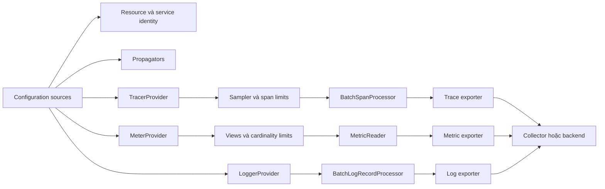
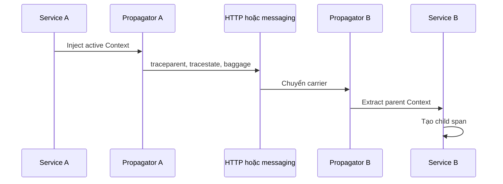

import { Step, Steps } from 'fumadocs-ui/components/steps';

<Callout type="info" title="Phạm vi của trang">
  Trang này mô tả cấu hình SDK theo cách độc lập với ngôn ngữ. Tên class và API
  programmatic khác nhau giữa Java, JavaScript, Go, Python, .NET và các SDK khác.
  Tên biến môi trường được giữ đúng theo OpenTelemetry specification, nhưng mỗi
  SDK có thể chỉ hỗ trợ một phần cơ chế auto-configuration. Luôn đối chiếu tài
  liệu và compliance matrix của SDK đang triển khai.
</Callout>

## Mục lục

- [Mô hình cấu hình theo lớp](#mô-hình-cấu-hình-theo-lớp)
  - [Các lớp trong pipeline](#các-lớp-trong-pipeline)
  - [Nguồn cấu hình và precedence](#nguồn-cấu-hình-và-precedence)
- [Chọn zero-code hay programmatic](#chọn-zero-code-hay-programmatic)
  - [Zero-code với biến môi trường](#zero-code-với-biến-môi-trường)
  - [Programmatic configuration](#programmatic-configuration)
- [Resource và định danh service](#resource-và-định-danh-service)
- [Cấu hình OTLP exporter](#cấu-hình-otlp-exporter)
  - [Endpoint chung và endpoint theo signal](#endpoint-chung-và-endpoint-theo-signal)
  - [Protocol và đường dẫn OTLP](#protocol-và-đường-dẫn-otlp)
  - [Headers TLS timeout và compression](#headers-tls-timeout-và-compression)
- [Cấu hình traces](#cấu-hình-traces)
  - [Sampler](#sampler)
  - [Span limits](#span-limits)
  - [Batch span processor](#batch-span-processor)
- [Cấu hình metrics](#cấu-hình-metrics)
  - [MetricReader và chu kỳ export](#metricreader-và-chu-kỳ-export)
  - [Views aggregation và cardinality](#views-aggregation-và-cardinality)
- [Cấu hình logs](#cấu-hình-logs)
- [Propagators và distributed context](#propagators-và-distributed-context)
- [Tắt telemetry và no-op](#tắt-telemetry-và-no-op)
- [Lifecycle flush và shutdown](#lifecycle-flush-và-shutdown)
  - [Ngừng nhận work mới](#ngừng-nhận-work-mới)
  - [Force flush providers](#force-flush-providers)
  - [Shutdown providers](#shutdown-providers)
- [Cấu hình theo môi trường](#cấu-hình-theo-môi-trường)
  - [Local](#local)
  - [Staging](#staging)
  - [Production](#production)
- [Quản lý secret](#quản-lý-secret)
- [Ví dụ cấu hình hoàn chỉnh](#ví-dụ-cấu-hình-hoàn-chỉnh)
  - [Mẫu zero-code bằng biến môi trường](#mẫu-zero-code-bằng-biến-môi-trường)
  - [Mẫu programmatic bằng pseudocode](#mẫu-programmatic-bằng-pseudocode)
- [Validation và debug](#validation-và-debug)
  - [Checklist lúc startup](#checklist-lúc-startup)
  - [Kiểm tra từng signal](#kiểm-tra-từng-signal)
- [Failure modes thường gặp](#failure-modes-thường-gặp)
- [Tài liệu tham khảo và bước tiếp theo](#tài-liệu-tham-khảo-và-bước-tiếp-theo)

## Mô hình cấu hình theo lớp

Cấu hình OpenTelemetry không chỉ là một URL exporter. Một cấu hình hoàn chỉnh
trả lời lần lượt sáu câu hỏi:

1. **Có tạo telemetry không?** SDK được bật, tắt hay chạy no-op?
2. **Telemetry thuộc về ai?** Resource nhận diện service, version, instance và
   môi trường triển khai.
3. **Context đi qua boundary thế nào?** Propagator inject và extract trace
   context hoặc baggage.
4. **Mỗi signal được thu thập ra sao?** Traces dùng sampler và span processor;
   metrics dùng views và reader; logs dùng log record processor.
5. **Dữ liệu được gửi bằng gì?** Exporter chọn OTLP protocol, endpoint, TLS,
   headers, timeout và compression.
6. **Dữ liệu cuối process được xử lý thế nào?** Provider cần flush và shutdown
   trong một deadline hữu hạn.

### Các lớp trong pipeline



Các provider nên dùng cùng một final Resource. Exporter của từng signal vẫn có
pipeline và failure mode riêng. Vì vậy, trace export thành công không chứng minh
metrics hoặc logs cũng đang hoạt động.

### Nguồn cấu hình và precedence

OpenTelemetry có ba cơ chế cấu hình chính:

| Nguồn | Phù hợp khi | Đặc điểm |
| --- | --- | --- |
| Programmatic API | Cần views, custom sampler, nhiều pipeline hoặc logic theo runtime | Biểu đạt đầy đủ nhất; tên API phụ thuộc ngôn ngữ. |
| Biến môi trường | Auto-instrumentation, container và cùng một image chạy nhiều môi trường | Portable ở mức tên biến; mức hỗ trợ vẫn phụ thuộc SDK. |
| Declarative config | Distribution hỗ trợ file cấu hình chuẩn | Có cấu trúc hơn env vars; cần kiểm tra trạng thái hỗ trợ của SDK. |

Không có một phép merge portable cho mọi tổ hợp programmatic API, env vars và
framework auto-configuration. Một constructor exporter được gọi trực tiếp có
thể chỉ đọc tham số truyền vào và hoàn toàn không đọc environment. Ngược lại,
một agent hoặc autoconfigure module có thể lấy mọi giá trị từ environment.

Các quy tắc precedence có thể dựa vào specification là:

1. Tùy chọn OTLP **theo signal** ghi đè tùy chọn OTLP chung cùng loại. Ví dụ,
   `OTEL_EXPORTER_OTLP_TRACES_ENDPOINT` thắng
   `OTEL_EXPORTER_OTLP_ENDPOINT` cho traces.
2. `OTEL_SERVICE_NAME` thắng `service.name` bên trong
   `OTEL_RESOURCE_ATTRIBUTES`.
3. Resource do người dùng cung cấp programmatically có ưu tiên cao hơn Resource
   đọc từ `OTEL_RESOURCE_ATTRIBUTES` khi hai bên có cùng key.
4. Nếu implementation hỗ trợ `OTEL_CONFIG_FILE` và biến này được đặt, file đó
   có precedence trên các SDK environment variables khác. Các biến khác phải bị
   bỏ qua, trừ biến được file tham chiếu để substitution.

<Callout type="warn" title="Precedence giữa code và environment phụ thuộc implementation">
  Đừng mặc định rằng environment luôn ghi đè code, hoặc ngược lại. Programmatic
  API là nền tảng bắt buộc của SDK, nhưng cách một autoconfigure module điền các
  field còn trống là đặc thù ngôn ngữ và distribution. Hãy chọn một nguồn sở hữu
  mỗi field, ghi lại policy của ứng dụng, rồi test final configuration lúc startup.
</Callout>

Một policy vận hành dễ hiểu thường là: **code đặt cấu trúc pipeline**, còn
**deployment đặt identity, endpoint, credential và tuning qua environment**.
Nếu phải override một field bằng code, đừng đồng thời đặt env var cho field đó.

## Chọn zero-code hay programmatic

### Zero-code với biến môi trường

Zero-code configuration phù hợp khi SDK được bootstrap bởi Java agent, .NET
auto-instrumentation, Python distro, Node.js preload hoặc cơ chế tương tự. Hệ
thống triển khai có thể đổi endpoint và service identity mà không build lại image.

Các nhóm biến portable quan trọng gồm:

| Mục đích | Biến chính |
| --- | --- |
| Bật hoặc tắt SDK | `OTEL_SDK_DISABLED` |
| Service và Resource | `OTEL_SERVICE_NAME`, `OTEL_RESOURCE_ATTRIBUTES` |
| Chọn exporter | `OTEL_TRACES_EXPORTER`, `OTEL_METRICS_EXPORTER`, `OTEL_LOGS_EXPORTER` |
| OTLP chung | `OTEL_EXPORTER_OTLP_ENDPOINT`, `OTEL_EXPORTER_OTLP_PROTOCOL`, `OTEL_EXPORTER_OTLP_HEADERS` |
| OTLP theo signal | `OTEL_EXPORTER_OTLP_TRACES_*`, `OTEL_EXPORTER_OTLP_METRICS_*`, `OTEL_EXPORTER_OTLP_LOGS_*` |
| Trace sampling | `OTEL_TRACES_SAMPLER`, `OTEL_TRACES_SAMPLER_ARG` |
| Propagation | `OTEL_PROPAGATORS` |
| SDK diagnostics | `OTEL_LOG_LEVEL` |

Nếu một biến rỗng, specification yêu cầu xử lý như chưa đặt. Với số không parse
được hoặc enum không nhận diện, implementation nên log cảnh báo rồi bỏ qua giá
trị. Tuy vậy, đừng dựa vào fallback âm thầm; validate trước khi deploy.

### Programmatic configuration

Dùng programmatic API khi cần:

- metric Views để bỏ attributes cardinality cao hoặc đổi histogram buckets;
- custom sampler, custom ID generator hoặc nhiều processors;
- nhiều exporter hoặc nhiều provider độc lập;
- Resource detectors đặc thù cloud;
- lifecycle tích hợp chặt với server, worker hoặc FaaS runtime;
- unit test với in-memory exporter.

Application nên sở hữu việc tạo SDK. Instrumentation library chỉ phụ thuộc API
và không nên tự tạo global provider hoặc đọc credential exporter. Ranh giới này
được giải thích kỹ hơn tại [API và SDK](/instrumentation/api-sdk/).

## Resource và định danh service

**Resource** là tập attributes bất biến mô tả entity phát telemetry. Nó khác
span attributes: `service.name` mô tả service phát mọi signals, còn một span
attribute như `http.request.method` mô tả một operation cụ thể.

Bộ identity tối thiểu nên cân nhắc:

| Attribute | Ý nghĩa | Cách đặt thường dùng |
| --- | --- | --- |
| `service.name` | Tên logic, ổn định của service | `OTEL_SERVICE_NAME` |
| `service.namespace` | Namespace phân biệt các nhóm có thể trùng tên | `OTEL_RESOURCE_ATTRIBUTES` |
| `service.version` | Version artifact đang chạy | `OTEL_RESOURCE_ATTRIBUTES` hoặc build metadata |
| `service.instance.id` | ID duy nhất của instance đang chạy | Resource detector hoặc code lúc startup |
| `deployment.environment.name` | Môi trường như `local`, `staging`, `production` | `OTEL_RESOURCE_ATTRIBUTES` |

```bash
export OTEL_SERVICE_NAME=checkout
export OTEL_RESOURCE_ATTRIBUTES='service.namespace=shop,service.version=2.4.1,deployment.environment.name=staging'
```

`OTEL_RESOURCE_ATTRIBUTES` dùng danh sách `key=value` ngăn cách bằng dấu phẩy;
values được đọc như string. Dấu `,` và `=` nằm trong key hoặc value phải được
percent-encode. Nếu parse lỗi, specification khuyến nghị bỏ toàn bộ giá trị thay
vì merge một phần.

Không đặt cùng một `service.instance.id` cố định cho mọi replica. Một detector
Kubernetes, container hoặc cloud thường phù hợp hơn. Đồng thời, đừng dùng pod
name hoặc version làm `service.name`: dashboard sẽ bị chia thành một service mới
sau mỗi rollout.

```text
default Resource
  → resource detectors của host/container/cloud
  → Resource từ environment
  → Resource do application cung cấp rõ ràng
  = final Resource dùng chung cho traces, metrics và logs
```

Thứ tự tự động giữa default Resource và detector packages phụ thuộc SDK. Phần
được specification đảm bảo là Resource người dùng cung cấp có precedence trên
`OTEL_RESOURCE_ATTRIBUTES` khi merge. Hãy inspect final Resource thay vì đoán.

<Callout type="warn" title="Luôn đặt service.name rõ ràng">
  Nếu không đặt, SDK có thể dùng một tên dạng `unknown_service` hoặc thêm tên
  executable theo semantic conventions. Giá trị fallback không đủ ổn định để
  làm service identity trong production.
</Callout>

## Cấu hình OTLP exporter

OTLP exporter gửi traces, metrics hoặc logs tới Collector/backend. Mỗi signal có
thể dùng endpoint khác nhau, nhưng dùng một Collector gateway chung thường đơn
giản hơn cho application.

### Endpoint chung và endpoint theo signal

| Phạm vi | Endpoint | Protocol | Headers | Timeout | Compression |
| --- | --- | --- | --- | --- | --- |
| Chung | `OTEL_EXPORTER_OTLP_ENDPOINT` | `OTEL_EXPORTER_OTLP_PROTOCOL` | `OTEL_EXPORTER_OTLP_HEADERS` | `OTEL_EXPORTER_OTLP_TIMEOUT` | `OTEL_EXPORTER_OTLP_COMPRESSION` |
| Traces | `OTEL_EXPORTER_OTLP_TRACES_ENDPOINT` | `OTEL_EXPORTER_OTLP_TRACES_PROTOCOL` | `OTEL_EXPORTER_OTLP_TRACES_HEADERS` | `OTEL_EXPORTER_OTLP_TRACES_TIMEOUT` | `OTEL_EXPORTER_OTLP_TRACES_COMPRESSION` |
| Metrics | `OTEL_EXPORTER_OTLP_METRICS_ENDPOINT` | `OTEL_EXPORTER_OTLP_METRICS_PROTOCOL` | `OTEL_EXPORTER_OTLP_METRICS_HEADERS` | `OTEL_EXPORTER_OTLP_METRICS_TIMEOUT` | `OTEL_EXPORTER_OTLP_METRICS_COMPRESSION` |
| Logs | `OTEL_EXPORTER_OTLP_LOGS_ENDPOINT` | `OTEL_EXPORTER_OTLP_LOGS_PROTOCOL` | `OTEL_EXPORTER_OTLP_LOGS_HEADERS` | `OTEL_EXPORTER_OTLP_LOGS_TIMEOUT` | `OTEL_EXPORTER_OTLP_LOGS_COMPRESSION` |

Signal-specific option ghi đè option chung cùng loại. Đừng dựa vào việc headers
chung và headers theo signal sẽ được merge; cấu hình signal-specific nên được
xem là giá trị thay thế, trừ khi SDK của bạn ghi rõ hành vi khác.

Ví dụ mọi signal đi tới cùng một OTLP/HTTP Collector:

```bash
export OTEL_EXPORTER_OTLP_PROTOCOL=http/protobuf
export OTEL_EXPORTER_OTLP_ENDPOINT=http://otel-collector:4318
```

Ví dụ traces đi thẳng tới một endpoint riêng:

```bash
export OTEL_EXPORTER_OTLP_PROTOCOL=http/protobuf
export OTEL_EXPORTER_OTLP_ENDPOINT=http://otel-collector:4318
export OTEL_EXPORTER_OTLP_TRACES_ENDPOINT=https://traces.example.com/v1/traces
```

### Protocol và đường dẫn OTLP

Các giá trị protocol chuẩn là:

- `grpc`: protobuf qua gRPC, thường dùng HTTP/2;
- `http/protobuf`: protobuf qua HTTP;
- `http/json`: JSON qua HTTP, là tùy chọn mà SDK có thể không hỗ trợ.

SDK phải hỗ trợ ít nhất một trong `grpc` và `http/protobuf`, và nên hỗ trợ cả
hai. Dù specification hiện khuyến nghị `http/protobuf` làm default, một SDK ổn
định có thể giữ `grpc` để tương thích ngược. Vì vậy, hãy đặt protocol rõ ràng.

Quy tắc endpoint OTLP/HTTP rất quan trọng:

- Với `OTEL_EXPORTER_OTLP_ENDPOINT`, exporter coi URL là **base URL** rồi thêm
  `v1/traces`, `v1/metrics` hoặc `v1/logs`.
- Với biến endpoint **theo signal**, exporter dùng URL **nguyên trạng**. Nó không
  tự thêm `/v1/traces`, `/v1/metrics` hoặc `/v1/logs`.

```text
OTEL_EXPORTER_OTLP_ENDPOINT=http://collector:4318
  traces  → http://collector:4318/v1/traces
  metrics → http://collector:4318/v1/metrics
  logs    → http://collector:4318/v1/logs

OTEL_EXPORTER_OTLP_TRACES_ENDPOINT=http://collector:4318
  traces  → http://collector:4318/
```

Với OTLP/gRPC, endpoint là gRPC target. Không thêm các path OTLP/HTTP như
`/v1/traces`; service method protobuf xác định signal sau khi kết nối.

<Callout type="error" title="Một lỗi endpoint khó nhận ra">
  `OTEL_EXPORTER_OTLP_TRACES_ENDPOINT=http://collector:4318` không tự trở thành
  `http://collector:4318/v1/traces` khi dùng OTLP/HTTP. Hãy thêm path vào biến
  theo signal, hoặc dùng biến endpoint chung.
</Callout>

### Headers TLS timeout và compression

| Nhu cầu | Biến chung | Biến theo signal |
| --- | --- | --- |
| CA tin cậy để xác minh server | `OTEL_EXPORTER_OTLP_CERTIFICATE` | `OTEL_EXPORTER_OTLP_<SIGNAL>_CERTIFICATE` |
| Client certificate cho mTLS | `OTEL_EXPORTER_OTLP_CLIENT_CERTIFICATE` | `OTEL_EXPORTER_OTLP_<SIGNAL>_CLIENT_CERTIFICATE` |
| Private key cho mTLS | `OTEL_EXPORTER_OTLP_CLIENT_KEY` | `OTEL_EXPORTER_OTLP_<SIGNAL>_CLIENT_KEY` |
| Kết nối gRPC không TLS | `OTEL_EXPORTER_OTLP_INSECURE` | `OTEL_EXPORTER_OTLP_<SIGNAL>_INSECURE` |

Trong tên mẫu, `<SIGNAL>` là `TRACES`, `METRICS` hoặc `LOGS`. Đây chỉ là ký
hiệu trong bảng; khi cấu hình phải dùng tên đầy đủ, ví dụ
`OTEL_EXPORTER_OTLP_TRACES_CERTIFICATE`.

Các điểm cần nhớ:

- `http://` và `https://` trên endpoint điều khiển transport security. Với gRPC,
  scheme có precedence trên tùy chọn `INSECURE`.
- `INSECURE` chỉ áp dụng cho OTLP/gRPC khi endpoint không có scheme, và SDK có
  thể không cung cấp tùy chọn này nếu gRPC client không cần nó.
- `CERTIFICATE`, `CLIENT_CERTIFICATE` và `CLIENT_KEY` là đường dẫn file theo
  OTLP exporter specification. Mount secret file với quyền đọc tối thiểu.
- Headers dùng dạng `key1=value1,key2=value2`; dấu chấm phẩy không được hỗ trợ.
  Format tuân theo W3C Baggage, nên percent-encode dấu phân cách hoặc ký tự không
  hợp lệ nằm trong key/value.
- Timeout OTLP environment variables tính bằng **milliseconds**. Default chuẩn
  là `10000` ms cho mỗi batch export.
- Compression chuẩn hỗ trợ `gzip`; dùng `none` để tắt. Compression giảm băng
  thông nhưng dùng thêm CPU.

```bash
export OTEL_EXPORTER_OTLP_ENDPOINT=https://otel-gateway.example.com
export OTEL_EXPORTER_OTLP_PROTOCOL=http/protobuf
export OTEL_EXPORTER_OTLP_HEADERS="x-api-key=${OTEL_API_KEY}"
export OTEL_EXPORTER_OTLP_CERTIFICATE=/var/run/secrets/otel/ca.pem
export OTEL_EXPORTER_OTLP_TIMEOUT=10000
export OTEL_EXPORTER_OTLP_COMPRESSION=gzip
```

## Cấu hình traces

Trace pipeline thường có dạng:

```text
span start → sampler → recording span → span end → BatchSpanProcessor → exporter
```

Sampler giảm dữ liệu từ lúc span bắt đầu. Span limits giới hạn dữ liệu giữ trên
mỗi recording span. Batch processor giới hạn queue và cách export span đã kết
thúc. Ba lớp này giải quyết ba loại chi phí khác nhau.

### Sampler

| Biến | Ý nghĩa | Default chuẩn |
| --- | --- | --- |
| `OTEL_TRACES_SAMPLER` | Chọn sampler | `parentbased_always_on` |
| `OTEL_TRACES_SAMPLER_ARG` | Argument của sampler đã chọn | Không đặt |

Các giá trị portable thường dùng:

- `always_on` và `always_off`;
- `traceidratio` với ratio từ `0` đến `1`;
- `parentbased_always_on` và `parentbased_always_off`;
- `parentbased_traceidratio` với ratio từ `0` đến `1`.

Ví dụ lấy mẫu 5% root traces và để child spans làm theo quyết định của parent:

```bash
export OTEL_TRACES_SAMPLER=parentbased_traceidratio
export OTEL_TRACES_SAMPLER_ARG=0.05
```

`ParentBased` giúp tránh trace bị đứt giữa các services. Nếu Collector thực hiện
tail sampling và cần nhìn mọi span trước khi quyết định, head sampler của SDK
thường phải giữ toàn bộ root traces. Đổi lại, network và Collector phải chịu tải
cao hơn. Xem phân tích đầy đủ tại [Sampling](/signals/sampling/).

<Callout type="warn" title="Sampling không phải rate limit">
  Ratio 5% không đảm bảo đúng một số spans cố định mỗi giây. Traffic tăng đột
  biến vẫn có thể làm queue đầy. Hãy theo dõi dropped spans và capacity của
  Collector, không chỉ nhìn sampling ratio.
</Callout>

### Span limits

Các biến chuẩn sau kiểm soát lượng dữ liệu giữ trên một span:

| Biến | Giới hạn | Default chuẩn |
| --- | --- | --- |
| `OTEL_SPAN_ATTRIBUTE_COUNT_LIMIT` | Số attributes trên span | `128` |
| `OTEL_SPAN_ATTRIBUTE_VALUE_LENGTH_LIMIT` | Độ dài value của span attribute | Không giới hạn |
| `OTEL_SPAN_EVENT_COUNT_LIMIT` | Số events trên span | `128` |
| `OTEL_SPAN_LINK_COUNT_LIMIT` | Số links trên span | `128` |
| `OTEL_EVENT_ATTRIBUTE_COUNT_LIMIT` | Số attributes trên mỗi span event | `128` |
| `OTEL_LINK_ATTRIBUTE_COUNT_LIMIT` | Số attributes trên mỗi span link | `128` |

`OTEL_ATTRIBUTE_COUNT_LIMIT` và `OTEL_ATTRIBUTE_VALUE_LENGTH_LIMIT` là fallback
chung cho signal có hỗ trợ attribute limits. Biến riêng của span nên được dùng
khi cần tuning traces mà không ảnh hưởng logs. SDK chỉ nên cung cấp biến length
limit nếu nó thực sự triển khai truncation.

Khi vượt limit, SDK drop attributes, events hoặc links thừa và exporter có thể
báo dropped count. Đừng tăng limit chỉ để chứa payload lớn. Dữ liệu request/response
nhạy cảm hoặc có kích thước không giới hạn không nên được gắn vào span.

### Batch span processor

Batch processor phù hợp với production hơn simple processor vì không export
đồng bộ trên request path.

| Biến | Ý nghĩa | Default chuẩn |
| --- | --- | --- |
| `OTEL_BSP_SCHEDULE_DELAY` | Delay tối đa giữa các lần export, ms | `5000` |
| `OTEL_BSP_EXPORT_TIMEOUT` | Deadline của một lần export, ms | `30000` |
| `OTEL_BSP_MAX_QUEUE_SIZE` | Số spans tối đa trong queue | `2048` |
| `OTEL_BSP_MAX_EXPORT_BATCH_SIZE` | Số spans tối đa mỗi batch | `512` |

`OTEL_BSP_MAX_EXPORT_BATCH_SIZE` phải nhỏ hơn hoặc bằng
`OTEL_BSP_MAX_QUEUE_SIZE`. Khi queue đầy, span mới có thể bị drop. Tăng queue
làm hấp thụ burst tốt hơn nhưng tăng memory và số telemetry có thể mất khi
process crash.

Simple processor hữu ích cho test hoặc debug vì export ngay khi span kết thúc.
Không nên dùng nó mặc định trên request path production vì network latency của
exporter có thể ảnh hưởng application.

## Cấu hình metrics

Metrics không đi qua span processor. Measurements được aggregate trong SDK, rồi
một `MetricReader` collect các metric streams để exporter gửi đi hoặc để scraper
đọc.

### MetricReader và chu kỳ export

Với push exporter như OTLP, `PeriodicExportingMetricReader` thường dùng hai biến:

| Biến | Ý nghĩa | Default chuẩn |
| --- | --- | --- |
| `OTEL_METRIC_EXPORT_INTERVAL` | Khoảng thời gian giữa lúc bắt đầu hai lần export, ms | `60000` |
| `OTEL_METRIC_EXPORT_TIMEOUT` | Deadline của một lần export, ms | `30000` |

```bash
export OTEL_METRIC_EXPORT_INTERVAL=30000
export OTEL_METRIC_EXPORT_TIMEOUT=10000
```

Interval ngắn tạo dữ liệu mới nhanh hơn nhưng tăng CPU, network và ingest cost.
Timeout phải đủ cho một lần collect/export nhưng không nên làm shutdown treo quá
lâu. Khi debug “không thấy metric”, hãy chờ ít nhất một interval hoặc gọi
`forceFlush()` nếu SDK hỗ trợ.

Pull reader như Prometheus chỉ gửi dữ liệu khi scraper yêu cầu. `forceFlush()`
không thể thay thế một scrape request. Cũng không nên gắn cùng một
`MetricReader` instance vào nhiều providers; reader sở hữu state collection của
pipeline đó.

### Views aggregation và cardinality

**View** chọn instruments rồi định nghĩa metric stream đầu ra. Một View có thể:

- allowlist attribute keys;
- đổi aggregation hoặc histogram bucket boundaries;
- đổi tên stream;
- drop một instrument không cần thiết;
- đặt aggregation cardinality limit nếu SDK hỗ trợ.

Ví dụ pseudocode giữ chỉ method, route chuẩn hóa và status code:

```text
view = create_view(
  instrument_name = "http.server.request.duration",
  attribute_keys = [
    "http.request.method",
    "http.route",
    "http.response.status_code"
  ],
  aggregation = explicit_bucket_histogram(
    boundaries = [0.005, 0.01, 0.025, 0.05, 0.1, 0.25, 0.5, 1, 2.5, 5]
  ),
  aggregation_cardinality_limit = 1000
)
```

Cardinality là số tổ hợp attribute values khác nhau của một metric. Ví dụ
`user.id` tạo một time series cho mỗi user. Views nên loại attributes cardinality
cao **trước** khi SDK áp cardinality limit.

Metrics SDK specification khuyến nghị default cardinality limit `2000` data
points cho mỗi instrument trong một collection cycle nếu View và reader đều
không đặt giá trị khác. Khi vượt limit, implementation conformant dùng một điểm
synthetic với `otel.metric.overflow=true` để gộp measurements không thể tạo
series riêng.

<Callout type="info" title="Views cần programmatic hoặc declarative config">
  Environment Variable Specification không định nghĩa một env var portable để
  cấu hình Views hoặc cardinality limit. Đừng bịa các tên như
  `OTEL_METRIC_VIEWS` hay `OTEL_METRIC_CARDINALITY_LIMIT`. Hãy dùng API của SDK,
  file declarative nếu implementation hỗ trợ, hoặc processors ở Collector.
</Callout>

View loại attribute khỏi metric stream không bảo đảm attribute đó biến mất khỏi
exemplar. Nếu đây là dữ liệu nhạy cảm, cấu hình exemplar filter/reservoir phù hợp
hoặc dùng `OTEL_METRICS_EXEMPLAR_FILTER=always_off` khi SDK hỗ trợ biến chuẩn này.
Default chuẩn của exemplar filter là `trace_based`.

## Cấu hình logs

OpenTelemetry logs pipeline cần một `LoggerProvider`, một hoặc nhiều
`LogRecordProcessor` và exporter. Logging framework hiện hữu cũng cần bridge
hoặc instrumentation phù hợp; chỉ đặt `OTEL_LOGS_EXPORTER=otlp` không tự động
thu mọi dòng log của ứng dụng.

Hai processor built-in có vai trò tương tự traces:

- **SimpleLogRecordProcessor** export log record ngay, phù hợp debug.
- **BatchLogRecordProcessor** gom records ngoài application hot path, phù hợp
  production.

| Biến | Ý nghĩa | Default chuẩn |
| --- | --- | --- |
| `OTEL_BLRP_SCHEDULE_DELAY` | Delay giữa hai lần export, ms | `1000` |
| `OTEL_BLRP_EXPORT_TIMEOUT` | Deadline của một lần export, ms | `30000` |
| `OTEL_BLRP_MAX_QUEUE_SIZE` | Số log records tối đa trong queue | `2048` |
| `OTEL_BLRP_MAX_EXPORT_BATCH_SIZE` | Số records tối đa mỗi batch | `512` |
| `OTEL_LOGRECORD_ATTRIBUTE_COUNT_LIMIT` | Số attributes trên log record | `128` |
| `OTEL_LOGRECORD_ATTRIBUTE_VALUE_LENGTH_LIMIT` | Độ dài value | Không giới hạn |

Batch size phải nhỏ hơn hoặc bằng queue size. Khi queue đầy, logs bị drop; SDK
không nên block request vô hạn để chờ exporter. Nếu log volume cao, lọc severity
ở logging framework hoặc processor được SDK hỗ trợ trước khi tăng queue.

`OTEL_LOG_LEVEL` điều khiển **internal logger của SDK**, không phải severity của
application logs. Đặt `debug` tạm thời có thể giúp xem parse errors hoặc exporter
failures, nhưng không thay thế cấu hình level của Logback, Serilog, Python
logging hoặc framework khác.

## Propagators và distributed context

Propagator inject context vào carrier, ví dụ HTTP headers, rồi extract ở service
nhận. Default chuẩn của `OTEL_PROPAGATORS` là `tracecontext,baggage`:

```bash
export OTEL_PROPAGATORS=tracecontext,baggage
```

Các giá trị chuẩn phổ biến gồm `tracecontext`, `baggage`, `b3`, `b3multi` và
`none`. Một số giá trị khác là third-party hoặc deprecated; mức hỗ trợ tùy SDK.
Danh sách phải được de-duplicate khi autoconfigure.

Trong hệ thống mới, ưu tiên W3C Trace Context và Baggage. Chỉ thêm B3 khi phải
tương thích với hệ thống cũ. Nếu hai propagators cùng inject nhiều format, hãy
kiểm tra backend và proxy không làm mất hoặc tạo context mâu thuẫn.



`OTEL_PROPAGATORS=none` tắt propagator được auto-configure. Nó không ngăn code
tự đăng ký propagator khác. Ngược lại, `OTEL_SDK_DISABLED=true` không ảnh hưởng
propagators cấu hình qua `OTEL_PROPAGATORS`; context vẫn có thể đi qua process
no-op. Xem thêm [Propagators](/instrumentation/propagators/) và
[Context propagation](/fundamentals/context-propagation/).

<Callout type="warn" title="Baggage không phải nơi chứa secret">
  Baggage có thể được truyền sang nhiều services và không tự động trở thành
  telemetry attribute. Không đặt token, password, session ID hoặc dữ liệu cá
  nhân vào baggage.
</Callout>

## Tắt telemetry và no-op

“Tắt OpenTelemetry” có nhiều mức. Chọn mức đúng với mục đích:

| Mục tiêu | Cấu hình | Hành vi |
| --- | --- | --- |
| Tắt toàn SDK được auto-configure | `OTEL_SDK_DISABLED=true` | Dùng no-op SDK cho mọi signals; propagators không bị ảnh hưởng. |
| Không auto-configure trace exporter | `OTEL_TRACES_EXPORTER=none` | Không tạo trace exporter tự động; provider hoặc exporter tạo bằng code vẫn có thể hoạt động. |
| Không auto-configure metric exporter | `OTEL_METRICS_EXPORTER=none` | Không tạo metric exporter tự động. |
| Không auto-configure log exporter | `OTEL_LOGS_EXPORTER=none` | Không tạo log exporter tự động. |
| Không auto-configure propagator | `OTEL_PROPAGATORS=none` | Không inject/extract qua propagator tự động. |
| Drop root traces bằng sampler | `OTEL_TRACES_SAMPLER=parentbased_always_off` | Root traces bị drop; sampled parent vẫn có thể được tôn trọng bởi ParentBased. |
| Không cài SDK provider | API no-op mặc định | Instrumentation calls an toàn nhưng không export telemetry. |

`none` trong exporter selection chỉ điều khiển **automatically configured
exporter**. Nó không vô hiệu hóa exporter được application tạo trực tiếp. Tương
tự, sampler `always_off` không phải nút tắt metrics hoặc logs.

Trong test, no-op provider phù hợp khi chỉ cần code chạy. In-memory exporter phù
hợp hơn nếu cần assert span, metric hoặc log record. Không dùng endpoint
production trong test suite.

## Lifecycle flush và shutdown

Provider là tài nguyên cấp process. Khởi tạo trước khi server nhận request và
shutdown một lần khi process kết thúc. Không tạo hoặc shutdown provider theo
mỗi request.

<Steps>
<Step>

### Ngừng nhận work mới

Khi nhận `SIGTERM` hoặc lifecycle event tương đương, dừng nhận request/message
mới. Chờ các operation đang chạy kết thúc trong grace period để span của chúng
có end timestamp.

</Step>
<Step>

### Force flush providers

Gọi `forceFlush()` cho tracer, meter và logger providers nếu SDK cung cấp. Đặt
một deadline chung. Với push metrics, flush yêu cầu reader collect/export sớm;
với pull metrics, scraper vẫn là bên quyết định lúc lấy dữ liệu.

</Step>
<Step>

### Shutdown providers

Gọi `shutdown()` đúng một lần cho từng provider. Shutdown phải lan xuống
processors, readers và exporters. Sau shutdown, provider nên trả no-op
tracer/meter/logger nếu code vẫn cố lấy instance mới.

</Step>
</Steps>

```text
stop accepting work
  → wait for in-flight operations
  → forceFlush(traces, metrics, logs) với deadline
  → shutdown(traces, metrics, logs) với deadline
  → process exit
```

`shutdown()` của built-in processor bao gồm hiệu lực của flush, nhưng gọi
`forceFlush()` rõ ràng trước shutdown giúp application ghi nhận lỗi và phân bổ
deadline dễ hơn. Không đảm bảo mọi dữ liệu được gửi nếu process bị `SIGKILL`,
crash hoặc hết grace period.

Với serverless/FaaS có thể suspend process sau invocation, chỉ gọi force flush
khi platform và SDK khuyến nghị. Flush mọi invocation có thể làm mất lợi ích
batching và tăng latency đáng kể.

## Cấu hình theo môi trường

Giữ cùng code và thay deployment configuration. Đừng để local, staging và
production vô tình gửi chung service identity hoặc cùng dataset.

| Thuộc tính | Local | Staging | Production |
| --- | --- | --- | --- |
| `deployment.environment.name` | `local` | `staging` | `production` |
| Endpoint | Collector trên máy hoặc Docker network | Gateway staging | Gateway production có HA |
| TLS/auth | Có thể `http` trong loopback/network cô lập | Bật TLS và credential như production | TLS, auth, rotation và egress policy |
| Sampling | Thường 100% để debug | Gần production, có thể 100% cho test tải nhỏ | Theo SLO, volume và sampling architecture |
| Processor | Simple chỉ khi debug ngắn | Batch | Batch |
| Metrics interval | Ngắn hơn để phản hồi nhanh | Gần production | Theo freshness và ingest budget |
| SDK diagnostics | `debug` tạm thời | `info`, tăng khi điều tra | `info` hoặc policy đã kiểm thử |

### Local

Ví dụ gửi OTLP/HTTP tới Collector local và giữ mọi root trace:

```bash
export OTEL_SERVICE_NAME=checkout
export OTEL_RESOURCE_ATTRIBUTES='service.namespace=shop,deployment.environment.name=local'
export OTEL_EXPORTER_OTLP_PROTOCOL=http/protobuf
export OTEL_EXPORTER_OTLP_ENDPOINT=http://localhost:4318
export OTEL_TRACES_SAMPLER=parentbased_always_on
export OTEL_METRIC_EXPORT_INTERVAL=5000
```

Trong container, `localhost` là chính container application, không phải máy host
hay container Collector. Dùng đúng DNS service của Compose/Kubernetes, ví dụ
`http://otel-collector:4318`.

### Staging

Staging nên kiểm tra cùng protocol, TLS, auth, Resource conventions và batch
behavior như production. Khác biệt chỉ nên là endpoint, credential, environment
name và tuning có chủ đích. Chạy load test để phát hiện queue drops, timeout và
cardinality explosion trước production.

### Production

Production nên gửi tới Collector/gateway gần application thay vì để mọi SDK kết
nối trực tiếp qua Internet. Collector giúp retry/buffer theo kiến trúc được chọn,
redaction, routing và đổi backend mà không redeploy mọi service.

Đặt sampling ratio dựa trên volume và mục tiêu điều tra, không sao chép một tỷ lệ
cho mọi service. Theo dõi chính exporter/SDK và Collector để biết dropped data,
retry, queue saturation và export latency.

## Quản lý secret

Credential OTLP thường đi qua `OTEL_EXPORTER_OTLP_HEADERS` hoặc biến headers theo
signal. Áp dụng các nguyên tắc sau:

- lấy secret từ secret manager và inject lúc runtime;
- không commit token vào Dockerfile, image layer, `.env` mẫu hoặc repository;
- không đưa secret vào `OTEL_RESOURCE_ATTRIBUTES`, span attributes hay baggage;
- không in toàn bộ environment hoặc exporter config trong startup logs;
- mount CA, client certificate và private key read-only với quyền file tối thiểu;
- rotate credential và kiểm tra exporter reconnect/reload theo khả năng SDK;
- giới hạn quyền token chỉ cho ingest vào tenant/dataset cần thiết;
- ưu tiên Collector local làm điểm chứa credential backend nếu threat model cho
  phép, thay vì phát credential backend tới mọi application.

Environment variables có thể lộ qua crash dump, process inspection hoặc support
bundle. Nếu threat model không chấp nhận điều đó, dùng file mount, workload
identity hoặc cơ chế credential programmatic của SDK/vendor.

<Callout type="error" title="Không log headers để debug">
  Khi cần xác minh auth, chỉ log tên header đã cấu hình hoặc fingerprint đã che.
  Không log token đầy đủ, kể cả ở local hoặc CI.
</Callout>

## Ví dụ cấu hình hoàn chỉnh

### Mẫu zero-code bằng biến môi trường

Mẫu dưới đây dùng OTLP/HTTP, batch processors và các biến chuẩn. Nó giả định
auto-instrumentation distribution của bạn hỗ trợ các biến tương ứng.

```bash
# Bật/tắt và định danh
export OTEL_SDK_DISABLED=false
export OTEL_SERVICE_NAME=checkout
export OTEL_RESOURCE_ATTRIBUTES='service.namespace=shop,service.version=2.4.1,deployment.environment.name=staging'

# Signals và propagation
export OTEL_TRACES_EXPORTER=otlp
export OTEL_METRICS_EXPORTER=otlp
export OTEL_LOGS_EXPORTER=otlp
export OTEL_PROPAGATORS=tracecontext,baggage

# OTLP dùng chung
export OTEL_EXPORTER_OTLP_PROTOCOL=http/protobuf
export OTEL_EXPORTER_OTLP_ENDPOINT=https://otel-gateway.staging.example.com
export OTEL_EXPORTER_OTLP_HEADERS="x-api-key=${OTEL_API_KEY}"
export OTEL_EXPORTER_OTLP_CERTIFICATE=/var/run/secrets/otel/ca.pem
export OTEL_EXPORTER_OTLP_TIMEOUT=10000
export OTEL_EXPORTER_OTLP_COMPRESSION=gzip

# Traces
export OTEL_TRACES_SAMPLER=parentbased_traceidratio
export OTEL_TRACES_SAMPLER_ARG=0.10
export OTEL_SPAN_ATTRIBUTE_COUNT_LIMIT=128
export OTEL_SPAN_EVENT_COUNT_LIMIT=128
export OTEL_SPAN_LINK_COUNT_LIMIT=128
export OTEL_BSP_SCHEDULE_DELAY=5000
export OTEL_BSP_EXPORT_TIMEOUT=30000
export OTEL_BSP_MAX_QUEUE_SIZE=4096
export OTEL_BSP_MAX_EXPORT_BATCH_SIZE=512

# Metrics push reader
export OTEL_METRIC_EXPORT_INTERVAL=30000
export OTEL_METRIC_EXPORT_TIMEOUT=10000
export OTEL_METRICS_EXEMPLAR_FILTER=trace_based

# Logs
export OTEL_BLRP_SCHEDULE_DELAY=1000
export OTEL_BLRP_EXPORT_TIMEOUT=30000
export OTEL_BLRP_MAX_QUEUE_SIZE=4096
export OTEL_BLRP_MAX_EXPORT_BATCH_SIZE=512

# Chỉ bật debug tạm thời khi điều tra SDK
export OTEL_LOG_LEVEL=info
```

Không thêm `/v1/traces` vào endpoint chung trong mẫu: OTLP/HTTP exporter tự thêm
path theo signal. Nếu chuyển sang biến endpoint riêng, phải ghi đầy đủ path.

### Mẫu programmatic bằng pseudocode

Ví dụ sau tập trung vào cấu trúc, không đại diện API của một ngôn ngữ cụ thể:

```text
function configure_telemetry(deployment):
  validate(deployment.service_name)
  validate_url_and_protocol(deployment.otlp_endpoint, deployment.otlp_protocol)
  validate_batch_sizes(deployment.batch)
  validate_sampling_ratio(deployment.trace_ratio)

  detected = detect_resource([process, host, container, cloud])
  environment_resource = read_otel_resource_environment()
  explicit_resource = Resource({
    "service.name": deployment.service_name,
    "service.namespace": "shop",
    "service.version": BUILD_VERSION,
    "deployment.environment.name": deployment.environment_name
  })

  resource = default_resource
    .merge(detected)
    .merge(environment_resource)
    .merge(explicit_resource)

  trace_exporter = OtlpTraceExporter(
    endpoint = deployment.otlp_endpoint,
    protocol = deployment.otlp_protocol,
    headers = secret_headers(),
    timeout = 10s,
    compression = gzip
  )

  tracer_provider = TracerProvider(
    resource = resource,
    sampler = ParentBased(TraceIdRatioBased(deployment.trace_ratio)),
    span_limits = SpanLimits(attribute_count=128, event_count=128, link_count=128),
    processors = [BatchSpanProcessor(trace_exporter,
      max_queue_size=4096,
      max_export_batch_size=512,
      schedule_delay=5s,
      export_timeout=30s)]
  )

  metric_exporter = OtlpMetricExporter(same_secure_otlp_options())
  metric_reader = PeriodicExportingMetricReader(
    exporter=metric_exporter,
    interval=30s,
    timeout=10s,
    default_cardinality_limit=2000
  )
  meter_provider = MeterProvider(
    resource=resource,
    readers=[metric_reader],
    views=[http_server_duration_view(
      keep=["http.request.method", "http.route", "http.response.status_code"])]
  )

  log_exporter = OtlpLogExporter(same_secure_otlp_options())
  logger_provider = LoggerProvider(
    resource=resource,
    processors=[BatchLogRecordProcessor(log_exporter,
      max_queue_size=4096,
      max_export_batch_size=512,
      schedule_delay=1s,
      export_timeout=30s)]
  )

  set_global_propagator(Composite([W3CTraceContext(), W3CBaggage()]))
  register_global_providers(tracer_provider, meter_provider, logger_provider)

  return async function shutdown_telemetry(deadline):
    await force_flush_all([tracer_provider, meter_provider, logger_provider], deadline)
    await shutdown_all([tracer_provider, meter_provider, logger_provider], deadline)
```

Trong code thật, một SDK có thể merge default Resource tự động hoặc yêu cầu gọi
resource detector riêng. Một số SDK cũng có một convenience SDK object quản lý
cả ba providers. Hãy giữ invariants: bootstrap một lần, final Resource nhất quán,
không log secret và lifecycle có deadline.

## Validation và debug

### Checklist lúc startup

Validate cấu hình trước khi nhận traffic:

- [ ] `service.name` khác rỗng và ổn định qua replicas.
- [ ] `deployment.environment.name` đúng môi trường.
- [ ] Protocol khớp port và receiver: thường `4317` cho gRPC, `4318` cho HTTP.
- [ ] Endpoint theo signal có path đúng khi dùng OTLP/HTTP.
- [ ] Scheme TLS, CA và mTLS files nhất quán.
- [ ] Headers có key cần thiết nhưng secret không xuất hiện trong logs.
- [ ] Sampling ratio nằm trong khoảng `0` đến `1`.
- [ ] Batch size nhỏ hơn hoặc bằng queue size.
- [ ] Export interval và mọi timeout là số milliseconds hợp lệ khi dùng env vars.
- [ ] Metric Views loại identifiers cardinality cao.
- [ ] Provider được đăng ký trước khi framework bắt đầu tạo telemetry.
- [ ] Grace period của process đủ cho flush/shutdown deadline.

Khi SDK cho phép, log một bản cấu hình đã **redact** gồm service identity,
protocol, hostname, port, signal enablement, sampler description và batch sizes.
Không log URL query chứa credential, headers hoặc private-key path nếu path cũng
nhạy cảm.

### Kiểm tra từng signal

<Steps>
<Step>

**1. Xác minh tại SDK**

Bật internal diagnostics tạm thời bằng `OTEL_LOG_LEVEL=debug` nếu SDK hỗ trợ.
Dùng console hoặc in-memory exporter trong local để chứng minh instrumentation
đã tạo span, metric hoặc log record. Console exporter có thể lộ dữ liệu, nên
không bật lâu trong production.

</Step>
<Step>

**2. Xác minh transport**

Kiểm tra DNS, port, TLS handshake, auth và protocol từ cùng network namespace
với application. `curl` có thể kiểm tra kết nối HTTP nhưng không chứng minh
payload OTLP hợp lệ; `curl` thường cũng không kiểm tra được OTLP/gRPC.

</Step>
<Step>

**3. Xác minh Collector**

Xem internal telemetry và logs của Collector. Trong môi trường kiểm soát, thêm
debug exporter tạm thời sau receiver để biết dữ liệu đã vào pipeline hay chưa.
Không để debug exporter in dữ liệu nhạy cảm lâu dài.

</Step>
<Step>

**4. Xác minh backend**

Tìm theo `service.name`, environment, trace ID hoặc metric name. Kiểm tra filter,
tail sampling, tenant, retention và clock skew trước khi kết luận SDK không gửi.

</Step>
</Steps>

Tạo một canary rõ ràng cho từng signal: một span đã `end()`, một counter tăng và
một log record có severity dễ tìm. Metrics cần chờ collection interval; logs cần
bridge đúng với logging framework.

## Failure modes thường gặp

| Triệu chứng | Nguyên nhân thường gặp | Cách xử lý |
| --- | --- | --- |
| Không có signal nào | `OTEL_SDK_DISABLED=true`, SDK chưa bootstrap hoặc provider no-op | Kiểm tra startup order và final enablement. |
| Traces có nhưng metrics/logs không có | Chỉ trace exporter/processor được tạo | Kiểm tra provider, reader/processor và exporter cho từng signal. |
| OTLP/HTTP trả `404` | Dùng endpoint theo signal nhưng thiếu `/v1/<signal>` | Thêm path đầy đủ hoặc chuyển sang endpoint chung. |
| gRPC báo `UNIMPLEMENTED` hoặc protocol error | Gửi HTTP vào gRPC port, hoặc ngược lại | Đặt `OTEL_EXPORTER_OTLP_PROTOCOL` rõ ràng và kiểm tra receiver. |
| TLS handshake thất bại | Sai scheme, CA, hostname hoặc client certificate | Kiểm tra chain, SAN, clock và file mount; không tắt TLS để chữa tạm production. |
| `401` hoặc `403` | Header không được parse, token sai hoặc thiếu quyền | Kiểm tra key/value format và secret injection mà không log token. |
| Service xuất hiện dưới `unknown_service` | Thiếu `OTEL_SERVICE_NAME` hoặc Resource bị merge sai | Inspect final Resource và đặt identity rõ ràng. |
| Một service bị tách thành nhiều service | Dùng pod/version làm `service.name` | Giữ tên logic ổn định; chuyển metadata biến động sang attributes đúng. |
| Trace bị đứt giữa services | Propagators khác nhau, proxy xóa headers hoặc child không dùng extracted context | Chuẩn hóa `tracecontext,baggage` và kiểm tra carrier ở boundary. |
| Ít trace hơn dự kiến | Head sampler drop, tail sampler drop hoặc queue đầy | Phân biệt sampling decision với dropped spans ở processor/Collector. |
| Span cuối process bị mất | Process thoát trước batch delay hoặc không shutdown | Thêm graceful shutdown và deadline phù hợp. |
| Application tăng latency | Dùng simple processor hoặc exporter block | Dùng batch processor và giới hạn timeout. |
| Memory tăng khi backend lỗi | Queue quá lớn, retry kéo dài hoặc cardinality metrics cao | Giới hạn queue, quan sát retry và dùng Views/cardinality limits. |
| Metrics nổ số series | Attributes như `user.id`, raw URL hoặc order ID | Allowlist low-cardinality attributes bằng View; dùng route chuẩn hóa. |
| Không thấy metric ngay | Chưa tới `OTEL_METRIC_EXPORT_INTERVAL` | Chờ một interval hoặc force flush push reader. |
| Không thấy application logs | Chỉ tạo OTLP log exporter nhưng chưa bridge logging framework | Cài logging instrumentation/bridge phù hợp với runtime. |
| Env var dường như bị bỏ qua | SDK không hỗ trợ biến đó hoặc code tự tạo component | Kiểm tra compliance matrix và nguồn cấu hình thực sự sở hữu field. |
| Batch processor drop dữ liệu | Queue đầy hoặc batch size/timeout không phù hợp | Theo dõi dropped count, tune capacity và sửa downstream bottleneck. |
| `OTEL_LOG_LEVEL=debug` không tăng app logs | Biến này chỉ điều khiển SDK internal logger | Cấu hình logging framework riêng. |

Khi điều tra, thay đổi một lớp mỗi lần. Bắt đầu bằng console/in-memory exporter,
rồi mới kiểm tra network, Collector và backend. Cách này tránh sửa sampler hoặc
instrumentation khi lỗi thực sự chỉ là endpoint.

## Tài liệu tham khảo và bước tiếp theo

Các tên biến và defaults trong trang dựa trên specification chính thức. Mức hỗ
trợ thực tế cần được xác minh theo ngôn ngữ và phiên bản SDK:

- [OpenTelemetry Environment Variable Specification](https://opentelemetry.io/docs/specs/otel/configuration/sdk-environment-variables/)
- [OTLP Exporter specification](https://opentelemetry.io/docs/specs/otel/protocol/exporter/)
- [OTLP exporter configuration guide](https://opentelemetry.io/docs/languages/sdk-configuration/otlp-exporter/)
- [Resource SDK specification](https://opentelemetry.io/docs/specs/otel/resource/sdk/)
- [Tracing SDK specification](https://opentelemetry.io/docs/specs/otel/trace/sdk/)
- [Metrics SDK specification](https://opentelemetry.io/docs/specs/otel/metrics/sdk/)
- [Logs SDK specification](https://opentelemetry.io/docs/specs/otel/logs/sdk/)

<Cards>
  <Card
    title="API và SDK"
    href="/instrumentation/api-sdk/"
    description="Hiểu provider, processor, reader, exporter và lifecycle trước khi cấu hình."
  />
  <Card
    title="Resources"
    href="/instrumentation/resources/"
    description="Thiết kế service identity và metadata nhất quán cho mọi signal."
  />
  <Card
    title="Propagators"
    href="/instrumentation/propagators/"
    description="Cấu hình W3C Trace Context, Baggage và tương thích hệ thống cũ."
  />
  <Card
    title="Environment variables"
    href="/reference/environment-variables/"
    description="Tra cứu biến môi trường SDK và Collector theo nhóm."
  />
</Cards>
