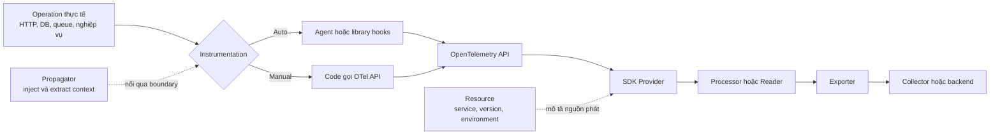
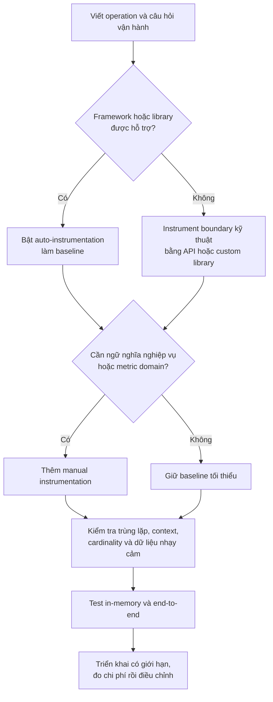

<Callout type="info" title="Mục tiêu của phần này">
  Sau khi hoàn thành nhóm **Instrumentation**, bạn có thể chọn đúng cách tạo
  telemetry, giải thích vai trò của API và SDK, bảo toàn context qua service
  boundary, cấu hình pipeline an toàn và kiểm chứng dữ liệu trước khi đưa lên
  production.
</Callout>

## Mục lục

- [Instrumentation là gì](#instrumentation-là-gì)
  - [Điều instrumentation làm](#điều-instrumentation-làm)
  - [Điều instrumentation không làm](#điều-instrumentation-không-làm)
- [Mental model từ operation đến backend](#mental-model-từ-operation-đến-backend)
  - [Bảy lớp cần phân biệt](#bảy-lớp-cần-phân-biệt)
- [Auto và manual instrumentation](#auto-và-manual-instrumentation)
  - [Auto-instrumentation](#auto-instrumentation)
  - [Manual instrumentation](#manual-instrumentation)
  - [Mô hình kết hợp nên dùng](#mô-hình-kết-hợp-nên-dùng)
- [Các mảnh ghép của một hệ thống instrumentation](#các-mảnh-ghép-của-một-hệ-thống-instrumentation)
  - [API và SDK](#api-và-sdk)
  - [Resources](#resources)
  - [Cấu hình SDK](#cấu-hình-sdk)
  - [Propagators](#propagators)
  - [Instrumentation libraries](#instrumentation-libraries)
  - [Kiểm thử instrumentation](#kiểm-thử-instrumentation)
- [Chọn cách instrument](#chọn-cách-instrument)
  - [Bảng quyết định](#bảng-quyết-định)
  - [Luồng quyết định](#luồng-quyết-định)
- [Lộ trình đọc đề xuất](#lộ-trình-đọc-đề-xuất)
  - [Chặng 1 hiểu runtime](#chặng-1-hiểu-runtime)
  - [Chặng 2 tạo telemetry](#chặng-2-tạo-telemetry)
  - [Chặng 3 định danh và nối request](#chặng-3-định-danh-và-nối-request)
  - [Chặng 4 vận hành và kiểm chứng](#chặng-4-vận-hành-và-kiểm-chứng)
- [Nguyên tắc cho production](#nguyên-tắc-cho-production)
  - [Khởi tạo và dừng đúng vòng đời](#khởi-tạo-và-dừng-đúng-vòng-đời)
  - [Giữ telemetry có nghĩa và có giới hạn](#giữ-telemetry-có-nghĩa-và-có-giới-hạn)
  - [Bảo vệ dữ liệu và boundary tin cậy](#bảo-vệ-dữ-liệu-và-boundary-tin-cậy)
  - [Thiết kế cho lỗi export](#thiết-kế-cho-lỗi-export)
  - [Kiểm chứng từ ứng dụng đến backend](#kiểm-chứng-từ-ứng-dụng-đến-backend)
- [Checklist hoàn thành](#checklist-hoàn-thành)
- [Đi tiếp trong nhóm Instrumentation](#đi-tiếp-trong-nhóm-instrumentation)

## Instrumentation là gì

**Instrumentation** là việc thêm cơ chế quan sát vào phần mềm để phần mềm tạo ra
telemetry khi chạy. Telemetry thường gồm traces, metrics và logs. Nó mô tả operation
đã diễn ra, mất bao lâu, thành công hay thất bại và operation đó liên quan tới phần
nào của hệ thống.

Ví dụ, với `POST /checkout`, instrumentation có thể:

- tạo server span cho request nhận vào;
- tạo client span khi gọi payment service và database;
- ghi histogram thời lượng cùng counter lỗi;
- liên kết log lỗi với active span bằng `trace_id` và `span_id`;
- gắn resource như `service.name=checkout` và
  `deployment.environment.name=production`.

Kết quả tốt không phải là “có thật nhiều dữ liệu”. Kết quả tốt là telemetry trả lời
được một câu hỏi vận hành cụ thể, chẳng hạn “dependency nào làm checkout chậm sau
bản deploy mới?”.

### Điều instrumentation làm

Instrumentation nằm tại nơi ứng dụng hiểu một operation. Nó quan sát lúc operation
bắt đầu và kết thúc, ghi các thuộc tính có ý nghĩa rồi dùng OpenTelemetry API để tạo
telemetry.

Có ba nguồn instrumentation thường gặp:

| Nguồn | Ai tạo telemetry | Ví dụ |
| --- | --- | --- |
| Agent hoặc cơ chế runtime | OpenTelemetry distribution của ngôn ngữ hook vào runtime | Java agent tạo HTTP và JDBC spans |
| Instrumentation library | Package tích hợp với framework hoặc client cụ thể | Instrumentation cho Express, gRPC hoặc database client |
| Code ứng dụng | Nhóm phát triển gọi API tại operation nghiệp vụ | Span `checkout.place_order` hoặc counter `orders.created` |

Cùng một ứng dụng có thể dùng cả ba nguồn. Điểm quan trọng là tránh tạo hai
instrumentation cho cùng một boundary, vì điều đó dễ sinh span hoặc metric trùng
lặp.

### Điều instrumentation không làm

Instrumentation không đồng nghĩa với toàn bộ telemetry pipeline:

- Nó không tự quyết định backend lưu dữ liệu.
- Chỉ cài OpenTelemetry API không tự tạo exporter hoặc gửi dữ liệu.
- Một exporter không tự biết operation nghiệp vụ nào cần quan sát.
- Collector nhận và xử lý telemetry, nhưng không thể bổ sung context đã bị mất từ
  trong ứng dụng.
- Dashboard không sửa được tên span, resource hay attributes được thiết kế sai ở
  nguồn.

<Callout type="warn" title="Có package chưa có nghĩa là có observability">
  Một integration chỉ có giá trị khi đúng code path thực sự được instrument, SDK
  đang hoạt động, context được truyền qua boundary và backend nhận đúng dữ liệu.
  Luôn kiểm chứng toàn bộ đường đi bằng một request biết trước.
</Callout>

## Mental model từ operation đến backend

Hãy tách quá trình thành các lớp. Auto-instrumentation và manual instrumentation
chỉ là hai cách tạo lời gọi vào cùng OpenTelemetry API. SDK xử lý các lời gọi đó,
còn exporter và Collector chịu trách nhiệm vận chuyển dữ liệu.

Một request đi qua sơ đồ như sau: instrumentation tạo span bằng API; SDK áp dụng
resource, sampling và giới hạn; processor gom span; exporter gửi batch qua OTLP;
Collector xử lý rồi chuyển tới backend. Ở một service boundary, propagator inject
trace context vào HTTP headers hoặc message metadata. Service nhận extract context
đó để span mới tiếp tục cùng trace.

### Bảy lớp cần phân biệt

| Lớp | Câu hỏi cần trả lời | Lỗi điển hình |
| --- | --- | --- |
| Operation | Việc gì trong hệ thống cần quan sát? | Instrument chi tiết kỹ thuật nhưng bỏ sót operation nghiệp vụ |
| Instrumentation | Hook hoặc đoạn code nào tạo telemetry? | Hook không được nạp, chạy trùng hoặc đặt sai boundary |
| API | Code dùng hợp đồng nào để tạo span, metric và context? | Chỉ cài API nhưng không đăng ký SDK |
| SDK | Telemetry được sample, aggregate, buffer và xử lý ra sao? | Provider khởi tạo muộn hoặc cấu hình sai signal |
| Resource và context | Dữ liệu đến từ đâu và có quan hệ với operation nào? | Thiếu `service.name` hoặc trace bị chia thành nhiều root |
| Export | Dữ liệu rời process bằng protocol, endpoint và credential nào? | Sai OTLP transport, TLS, timeout hoặc endpoint |
| Collector và backend | Dữ liệu được xử lý, lưu và truy vấn ở đâu? | Pipeline không có receiver/exporter phù hợp hoặc backend lọc dữ liệu |

Tách lớp giúp debug có thứ tự. Nếu debug exporter khi hook chưa từng tạo span, bạn
đang kiểm tra sai tầng.

## Auto và manual instrumentation

Hai cách này bổ sung cho nhau. Auto-instrumentation cho độ phủ kỹ thuật nhanh;
manual instrumentation thêm ngữ nghĩa mà chỉ code nghiệp vụ mới biết.

### Auto-instrumentation

**Auto-instrumentation** dùng agent, profiler, monkey patch, bytecode injection hoặc
cơ chế hook tương ứng với từng runtime để quan sát framework và thư viện phổ biến.
Bạn thường không phải sửa từng HTTP handler hoặc từng lời gọi database.

Auto-instrumentation phù hợp khi cần:

- tạo baseline traces cho HTTP, RPC, database và messaging;
- triển khai nhanh trên nhiều service dùng stack tương tự;
- quan sát code của framework mà nhóm không sở hữu;
- bắt đầu đánh giá OpenTelemetry trước khi thay đổi nhiều code.

Giới hạn của nó là ngữ nghĩa nghiệp vụ. Hook HTTP biết request gọi `/checkout`,
nhưng thường không biết request đó đang “xác nhận đơn hàng” hay “gia hạn subscription”.
Độ phủ cũng phụ thuộc ngôn ngữ, phiên bản runtime và phiên bản library được hỗ trợ.

Xem [Auto-instrumentation](/instrumentation/auto-instrumentation/) để hiểu cách nạp
agent hoặc package, kiểm tra compatibility và xử lý trường hợp hook không hoạt động.

### Manual instrumentation

**Manual instrumentation** là code ứng dụng chủ động gọi OpenTelemetry API. Nhóm phát
triển chọn operation, tên span, metric instrument, attributes, events và cách xử lý
context.

Manual instrumentation phù hợp khi cần:

- biểu diễn operation nghiệp vụ như `checkout.place_order`;
- đo metric domain như số đơn được chấp nhận hoặc giá trị hàng đợi hiện tại;
- tạo span quanh code nội bộ không có instrumentation library;
- truyền hoặc liên kết context qua protocol tùy biến;
- thêm attributes có tập giá trị hữu hạn và ý nghĩa điều tra rõ ràng.

Manual instrumentation cho nhiều quyền kiểm soát hơn, nhưng cũng dễ tạo cardinality
cao, làm rò rỉ dữ liệu hoặc quản lý span lifecycle sai. Hãy đặt code quan sát gần
operation, nhưng để cấu hình provider và exporter tại application bootstrap.

Xem [Manual instrumentation](/instrumentation/manual-instrumentation/) để thiết kế
span, metric, log correlation và context trong code ứng dụng.

### Mô hình kết hợp nên dùng

Với phần lớn service, lựa chọn thực tế là **hybrid**:

1. Dùng auto-instrumentation để có server, client, database và messaging spans cơ
   bản.
2. Thêm manual instrumentation tại các operation nghiệp vụ quan trọng.
3. Tắt integration bị trùng hoặc quá ồn thay vì giữ hai hook cho cùng operation.
4. Dùng một SDK configuration và một resource identity nhất quán cho cả hai nguồn.
5. Kiểm thử quan hệ parent-child để manual span nằm đúng chỗ trong trace tự động.

Ví dụ, auto-instrumentation tạo server span `POST /checkout` và client span gọi
payment. Code ứng dụng thêm span `checkout.validate_cart` cùng metric
`checkout.completed`. Trace vẫn cho thấy boundary kỹ thuật, đồng thời phản ánh các
bước mà người vận hành thực sự quan tâm.

<Callout type="idea" title="Bắt đầu rộng rồi làm sâu có chủ đích">
  Bật auto-instrumentation để nhìn thấy topology và code path trước. Sau đó chỉ thêm
  manual telemetry cho operation gắn với SLO, incident, rủi ro hoặc quyết định sản
  phẩm. Cách này giảm thời gian triển khai mà vẫn giữ được ngữ nghĩa nghiệp vụ.
</Callout>

## Các mảnh ghép của một hệ thống instrumentation

Instrumentation chạy đúng khi các thành phần dưới đây có ranh giới rõ ràng. Mỗi
thành phần giải quyết một vấn đề khác nhau; không thành phần nào thay thế toàn bộ
các phần còn lại.

### API và SDK

OpenTelemetry **API** là hợp đồng để application và instrumentation library tạo
telemetry. **SDK** là implementation của hợp đồng đó. SDK quản lý provider,
processor hoặc metric reader, sampling, aggregation, limits và exporting.

Library nên phụ thuộc vào API để không ép ứng dụng chọn backend. Application sở hữu
SDK vì application biết endpoint, credential, environment và lifecycle của process.
Khi chưa đăng ký SDK, API thường dùng no-op implementation an toàn và không tạo dữ
liệu để export.

Đọc [API và SDK](/instrumentation/api-sdk/) trước khi tự viết bootstrap hoặc đánh
giá một integration. Đây là nền tảng để tránh việc mỗi package tự tạo provider và
exporter riêng.

### Resources

**Resource** mô tả thực thể tạo ra telemetry. Các thuộc tính thường dùng gồm
`service.name`, `service.version`, `service.instance.id` và
`deployment.environment.name`.

Resource trả lời “dữ liệu đến từ service hoặc instance nào?”. Nó khác span attributes,
vốn mô tả một operation cụ thể. Một `service.name` ổn định giúp traces, metrics và
logs của cùng service có thể được lọc và liên kết nhất quán.

Đọc [Resources](/instrumentation/resources/) để chọn service identity, kết hợp
resource detectors và tránh metadata mâu thuẫn giữa cấu hình code với môi trường.

### Cấu hình SDK

Cấu hình SDK biến API calls thành một pipeline có hành vi cụ thể. Tùy signal và ngôn
ngữ, cấu hình có thể bao gồm provider, exporter, processor, metric reader, sampler,
views, limits, timeout và batch queue.

Giữ cấu hình có thể thay đổi theo môi trường. Endpoint, protocol, sampling rate và
credential không nên bị hard-code trong instrumentation library. Cũng không nên giả
định cấu hình traces tự động áp dụng cho metrics hoặc logs; mỗi signal có pipeline
và mức hỗ trợ riêng.

Đọc [SDK configuration](/instrumentation/configuration/) để thiết kế cấu hình theo
environment variable hoặc code, quản lý precedence và chọn giá trị phù hợp cho
production.

### Propagators

**Propagator** chuyển distributed context qua process boundary. Nó inject context
vào một carrier, chẳng hạn HTTP headers, rồi extract context ở phía nhận. W3C Trace
Context dùng header `traceparent`; W3C Baggage dùng header `baggage`.

Nếu propagation hỏng, từng service vẫn có thể tạo span nhưng backend sẽ hiển thị
nhiều trace rời rạc. Nếu có nhiều định dạng propagation, hai phía phải thống nhất
thứ tự inject và extract để tránh context không hợp lệ hoặc quan hệ cha con bất ngờ.

Đọc [Propagators](/instrumentation/propagators/) để cấu hình W3C Trace Context,
Baggage, composite propagator và boundary giữa các miền tin cậy.

### Instrumentation libraries

**Instrumentation library** tích hợp OpenTelemetry API với một framework hoặc client
cụ thể. Library hiểu lifecycle của HTTP server, database driver hoặc message consumer,
nhờ đó có thể tạo span đúng quanh operation kỹ thuật.

Hãy kiểm tra package có hỗ trợ đúng phiên bản framework đang chạy hay không. Đồng
thời kiểm tra semantic conventions, cấu hình loại trừ, mức ổn định và khả năng tạo
attributes nhạy cảm. Nâng framework hoặc instrumentation package cần được xem là
một thay đổi telemetry có thể làm đổi tên span và dashboard.

Đọc [Instrumentation libraries](/instrumentation/instrumentation-libraries/) để
chọn package, quản lý version, tránh duplicate instrumentation và xác minh integration
sau khi nâng cấp.

### Kiểm thử instrumentation

Kiểm thử instrumentation không nên chỉ hỏi “có span hay không”. Một test hữu ích còn
xác minh tên operation, span kind, parent-child relation, status, attributes bắt buộc,
metric dimensions và hành vi khi lỗi xảy ra.

Unit và integration test nên dùng in-memory exporter hoặc test reader để không phụ
thuộc network. Ngoài ra, cần ít nhất một smoke test end-to-end đi qua SDK, OTLP,
Collector và backend thử nghiệm. Test đó bắt các lỗi endpoint, propagation và pipeline
mà in-memory test không nhìn thấy.

Đọc [Kiểm thử instrumentation](/instrumentation/testing-instrumentation/) để xây
assertions ổn định, reset global state và kiểm tra cả success path lẫn error path.

## Chọn cách instrument

Đừng bắt đầu bằng câu hỏi “nên cài package nào?”. Trước hết, hãy viết operation và
câu hỏi vận hành cần trả lời. Sau đó mới chọn auto, manual hoặc kết hợp.

### Bảng quyết định

| Tình huống | Lựa chọn khởi đầu | Việc cần làm tiếp |
| --- | --- | --- |
| Service dùng framework phổ biến và chưa có traces | Auto-instrumentation | Xác minh compatibility, service resource và propagation |
| Cần thấy HTTP, database và messaging với ít sửa code | Auto-instrumentation | Loại trừ endpoint nhiễu và kiểm tra duplicate spans |
| Cần quan sát operation nghiệp vụ | Manual instrumentation | Thiết kế tên, attributes và lifecycle theo semantic conventions |
| Dùng protocol hoặc framework nội bộ | Manual hoặc custom instrumentation library | Đóng gói hook dùng API, không nhúng exporter vào library |
| Đang xây thư viện dùng chung | OpenTelemetry API | Để application cung cấp SDK và cấu hình |
| Đã có auto spans nhưng thiếu ngữ nghĩa domain | Kết hợp auto và manual | Đặt manual spans làm con của active auto span |
| Chỉ cần thử nghiệm cục bộ | Auto hoặc manual tối thiểu với debug exporter | Chuyển sang batch và OTLP trước production |
| Cần bảo đảm nâng cấp không đổi telemetry contract | Test instrumentation | Assert cấu trúc quan trọng, không snapshot mọi field biến động |

### Luồng quyết định

Nếu chưa chắc, hãy bắt đầu với một endpoint quan trọng và một backend thử nghiệm.
Đo số span, số time series, kích thước payload và giá trị điều tra thực tế trước khi
mở rộng ra toàn bộ service.

## Lộ trình đọc đề xuất

Các trang trong nhóm được sắp theo thứ tự từ runtime contract đến vận hành. Người
mới nên đọc tuần tự. Nếu đang xử lý một lỗi cụ thể, bạn có thể bắt đầu tại chặng gần
nhất rồi quay lại [API và SDK](/instrumentation/api-sdk/) khi gặp ranh giới chưa rõ.

### Chặng 1 hiểu runtime

1. [API và SDK](/instrumentation/api-sdk/) — phân biệt hợp đồng tạo telemetry với
   implementation xử lý và export telemetry.
2. [Auto-instrumentation](/instrumentation/auto-instrumentation/) — hiểu agent,
   package hooks, thời điểm nạp và phạm vi hỗ trợ.
3. [Manual instrumentation](/instrumentation/manual-instrumentation/) — tạo telemetry
   cho operation mà framework không thể tự hiểu.

Sau chặng này, bạn nên giải thích được telemetry được tạo ở đâu, provider thuộc về
ai và vì sao auto với manual có thể cùng dùng một SDK.

### Chặng 2 tạo telemetry

4. [Instrumentation libraries](/instrumentation/instrumentation-libraries/) — chọn
   integration đúng phiên bản và kiểm tra hành vi của hook.
5. Quay lại [Manual instrumentation](/instrumentation/manual-instrumentation/) cho
   các khoảng trống nghiệp vụ sau khi baseline tự động đã rõ.

Kết quả của chặng này là một service có spans hoặc metrics vừa đủ để trả lời câu hỏi
đã chọn, không có duplicate instrumentation rõ ràng.

### Chặng 3 định danh và nối request

6. [Resources](/instrumentation/resources/) — gắn identity ổn định cho service,
   version, instance và môi trường.
7. [Propagators](/instrumentation/propagators/) — bảo toàn trace context qua HTTP,
   RPC, message queue và boundary tùy biến.

Sau chặng này, backend phải phân biệt được nguồn phát và dựng được một trace liền
mạch qua các service liên quan.

### Chặng 4 vận hành và kiểm chứng

8. [SDK configuration](/instrumentation/configuration/) — chọn exporter, processor,
   reader, sampler, limits và timeout theo môi trường.
9. [Kiểm thử instrumentation](/instrumentation/testing-instrumentation/) — xác minh
   telemetry contract trong test và kiểm tra đường đi end-to-end.

Hoàn thành chặng này khi service khởi tạo telemetry trước request đầu tiên, flush có
giới hạn khi shutdown và có kiểm tra phát hiện regression sau nâng cấp.

## Nguyên tắc cho production

Instrumentation chạy trong cùng process với application nên luôn có chi phí và
failure mode. Mục tiêu production là telemetry đủ giá trị nhưng không làm thay đổi
đáng kể độ tin cậy của workload.

### Khởi tạo và dừng đúng vòng đời

- Khởi tạo resource, exporter và SDK provider trước khi server nhận request đầu
  tiên.
- Với runtime cần preload hoặc agent, nạp auto-instrumentation trước module đích để
  hook có thể được cài đúng lúc.
- Chỉ tạo provider một lần cho mỗi process và signal, trừ khi SDK có mô hình khác
  được tài liệu hóa rõ ràng.
- Khi dừng, ngừng nhận work mới rồi `forceFlush()` và `shutdown()` trong một timeout
  hữu hạn.
- Không khởi tạo hoặc shutdown SDK theo từng request.

Một process kết thúc ngay sau khi enqueue batch có thể làm mất các span cuối. Ngược
lại, shutdown không timeout có thể giữ deployment treo khi Collector không reachable.
Hãy đặt một giới hạn thời gian và chấp nhận mất phần telemetry còn lại khi giới hạn
đó hết.

### Giữ telemetry có nghĩa và có giới hạn

- Dùng semantic conventions khi đã có tên chuẩn cho protocol hoặc framework.
- Đặt tên span theo operation ổn định, không nhúng ID, URL thô hoặc timestamp vào
  tên.
- Giới hạn số attributes, event count, span size, queue size và thời gian export.
- Kiểm soát **cardinality**, tức số tổ hợp giá trị khác nhau. Đặc biệt không dùng
  `user.id`, `request.id` hoặc URL thô làm metric attributes.
- Chọn sampling sau khi xác định trace nào cần giữ. Sampling không sửa được metric
  cardinality và cũng không thay thế retention policy.
- Theo dõi chi phí CPU, memory, network và số time series trước và sau khi bật
  instrumentation.

<Callout type="warn" title="Cardinality là chi phí nhân">
  Một metric có ba attributes, mỗi attribute có 100 giá trị, có thể tạo tới một
  triệu tổ hợp. Hãy ưu tiên các chiều hữu hạn như method, status class, region hoặc
  version. ID riêng của từng request phù hợp hơn với trace hoặc log có kiểm soát,
  không phù hợp với metric label.
</Callout>

### Bảo vệ dữ liệu và boundary tin cậy

- Không ghi token, cookie, authorization header, password hoặc connection string
  vào telemetry.
- Xem URL, SQL statement, request body và exception message là dữ liệu có thể nhạy
  cảm. Chỉ thu thập sau khi có quy tắc lọc hoặc redaction.
- Không tự động sao chép toàn bộ Baggage thành span, metric hoặc log attributes.
- Validate context và Baggage đi vào từ mạng không tin cậy; đừng dùng Baggage làm
  cơ chế authorization.
- Giới hạn kích thước carrier và danh sách headers được capture.
- Quản lý credential của exporter bằng secret store hoặc cơ chế cấu hình của môi
  trường, không hard-code trong source.

Một attribute hữu ích trong local chưa chắc phù hợp production. Trước khi bật capture,
hãy xác định người có quyền truy cập, thời gian retention và cách xóa dữ liệu.

### Thiết kế cho lỗi export

Telemetry là công cụ quan sát application, không nên trở thành dependency đồng bộ
làm application ngừng phục vụ. Trong đa số workload, hãy:

- dùng batch processor hoặc periodic reader phù hợp thay vì export đồng bộ theo mỗi
  operation;
- đặt timeout, queue bound và retry có giới hạn;
- chọn rõ chính sách drop khi queue đầy;
- giữ Collector hoặc backend endpoint ngoài request critical path;
- theo dõi SDK hoặc exporter diagnostics, dropped items và export failures;
- tránh log lỗi export theo vòng lặp không giới hạn vì chính log đó có thể làm sự
  cố nặng hơn.

Có hệ thống yêu cầu audit không được phép mất dữ liệu. Trường hợp đó cần một pipeline
bền vững riêng; không nên mặc định biến span hoặc log observability thông thường
thành cơ chế audit.

### Kiểm chứng từ ứng dụng đến backend

Kiểm tra theo thứ tự sau khi không thấy telemetry:

1. Operation cần quan sát có thực sự chạy không?
2. Auto hook hoặc manual API call có tạo record không?
3. SDK provider có được đăng ký trước operation không?
4. Span có kết thúc, metric reader có collect và batch có flush không?
5. Resource và propagation có đúng không?
6. Exporter có dùng đúng endpoint, protocol, TLS và credential không?
7. Collector pipeline có nhận, xử lý và export signal đó không?
8. Backend có ingest, giữ lại và hiển thị đúng phạm vi thời gian không?

Dùng in-memory exporter để tách lỗi tạo telemetry khỏi lỗi network. Sau đó gửi một
request có dấu hiệu dễ nhận diện qua pipeline thật để kiểm tra Collector và backend.
Không dùng dữ liệu nhạy cảm làm dấu hiệu kiểm thử.

## Checklist hoàn thành

Trước khi gọi một service là “đã instrument”, hãy kiểm tra:

- [ ] Có câu hỏi vận hành và operation mục tiêu rõ ràng.
- [ ] Đã chọn auto, manual hoặc kết hợp dựa trên độ phủ thực tế.
- [ ] Không có duplicate spans hoặc metric instruments cho cùng boundary.
- [ ] API và SDK có đúng ownership; library không tự áp đặt exporter.
- [ ] `service.name`, environment và version nhất quán giữa các signal.
- [ ] Trace context đi qua HTTP, RPC hoặc message boundary quan trọng.
- [ ] Span names và attributes tuân theo semantic conventions khi phù hợp.
- [ ] Metric attributes có cardinality được kiểm soát.
- [ ] Dữ liệu nhạy cảm được loại bỏ hoặc redaction trước export.
- [ ] Queue, timeout, retry, sampling và limits có giá trị hữu hạn.
- [ ] Startup xảy ra trước workload và shutdown có flush với timeout.
- [ ] Unit hoặc integration test dùng exporter test, không gửi dữ liệu production.
- [ ] Smoke test end-to-end xác minh SDK, OTLP, Collector và backend.
- [ ] Có cách theo dõi export failures, dropped telemetry và overhead của SDK.

## Đi tiếp trong nhóm Instrumentation

<Cards>
  <Card
    title="API và SDK"
    href="/instrumentation/api-sdk/"
    description="Hiểu hợp đồng API, implementation SDK, provider và lifecycle."
  />
  <Card
    title="Auto-instrumentation"
    href="/instrumentation/auto-instrumentation/"
    description="Tạo baseline telemetry bằng agent và package hooks."
  />
  <Card
    title="Manual instrumentation"
    href="/instrumentation/manual-instrumentation/"
    description="Thêm ngữ nghĩa nghiệp vụ bằng spans, metrics và context."
  />
  <Card
    title="Resources"
    href="/instrumentation/resources/"
    description="Gắn service identity, version, instance và environment."
  />
  <Card
    title="SDK configuration"
    href="/instrumentation/configuration/"
    description="Cấu hình exporter, processor, reader, sampler và limits."
  />
  <Card
    title="Propagators"
    href="/instrumentation/propagators/"
    description="Truyền trace context và Baggage qua service boundary."
  />
  <Card
    title="Instrumentation libraries"
    href="/instrumentation/instrumentation-libraries/"
    description="Chọn integration, quản lý version và tránh telemetry trùng."
  />
  <Card
    title="Kiểm thử instrumentation"
    href="/instrumentation/testing-instrumentation/"
    description="Kiểm tra spans, attributes, context và pipeline end-to-end."
  />
</Cards>
