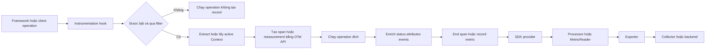

import { Step, Steps } from 'fumadocs-ui/components/steps';

<Callout type="info" title="Phạm vi của trang">
  Trang này nói về package kết nối OpenTelemetry với một framework, client hoặc
  runtime library cụ thể. Ví dụ cấu hình là pseudocode trung lập ngôn ngữ. Tên
  package, option và compatibility thay đổi theo runtime, vì vậy hãy đối chiếu
  [OpenTelemetry Registry](https://opentelemetry.io/ecosystem/registry/?component=instrumentation)
  và tài liệu của package đang pin trước khi triển khai.
</Callout>

## Mục lục

- [Instrumentation library là gì](#instrumentation-library-là-gì)
  - [Phân biệt với API SDK và exporter](#phân-biệt-với-api-sdk-và-exporter)
  - [Library hook vào framework và client như thế nào](#library-hook-vào-framework-và-client-như-thế-nào)
- [Luồng tạo telemetry](#luồng-tạo-telemetry)
- [Instrumentation scope](#instrumentation-scope)
- [Semantic conventions](#semantic-conventions)
- [Chọn package](#chọn-package)
  - [Nguồn gốc và mô hình bảo trì](#nguồn-gốc-và-mô-hình-bảo-trì)
  - [Compatibility và signal support](#compatibility-và-signal-support)
  - [Bảo mật license và khả năng vận hành](#bảo-mật-license-và-khả-năng-vận-hành)
- [Quản lý version và dependency](#quản-lý-version-và-dependency)
  - [Lập version matrix](#lập-version-matrix)
  - [Xử lý dependency conflicts](#xử-lý-dependency-conflicts)
- [Cấu hình integration](#cấu-hình-integration)
  - [Bật tắt và lọc](#bật-tắt-và-lọc)
  - [Enrich bằng hook](#enrich-bằng-hook)
  - [Startup order](#startup-order)
- [Tránh duplicate telemetry](#tránh-duplicate-telemetry)
  - [Xác định quyền sở hữu boundary](#xác-định-quyền-sở-hữu-boundary)
  - [Phân loại duplicate](#phân-loại-duplicate)
  - [Suppression](#suppression)
- [Hiệu năng cardinality và quyền riêng tư](#hiệu-năng-cardinality-và-quyền-riêng-tư)
- [Thử nghiệm canary nâng cấp và rollback](#thử-nghiệm-canary-nâng-cấp-và-rollback)
- [Kiểm chứng telemetry](#kiểm-chứng-telemetry)
  - [Kiểm chứng spans](#kiểm-chứng-spans)
  - [Kiểm chứng metrics](#kiểm-chứng-metrics)
  - [Kiểm chứng scope](#kiểm-chứng-scope)
- [Troubleshooting](#troubleshooting)
- [Checklist đánh giá package](#checklist-đánh-giá-package)
- [Nguồn chính thức](#nguồn-chính-thức)
- [Bài liên quan](#bài-liên-quan)

## Instrumentation library là gì

**Instrumentation library** là phần mềm biết lifecycle và abstraction của một
library đích. Nó có thể hiểu khi nào một HTTP request bắt đầu, lúc database call
hoàn tất, callback nào xử lý message và lỗi nào đại diện cho kết quả operation.
Từ các điểm đó, instrumentation library dùng OpenTelemetry API để tạo span,
metric hoặc log correlation.

Có hai cách tích hợp thường gặp:

- **Instrumentation nằm ngoài library đích:** một package riêng hook hoặc wrap
  framework/client. Package này thường được agent, preload bundle hoặc bootstrap
  của application đăng ký.
- **Native instrumentation:** chính framework hoặc client gọi OpenTelemetry API.
  Không cần monkey patch cho operation đó, nhưng application vẫn phải cung cấp
  SDK nếu muốn record và export telemetry.

Một package instrumentation không nhất thiết là auto-instrumentation hoàn toàn.
Application có thể phải đăng ký package bằng code. Điều làm nó trở thành
instrumentation library là hiểu library đích và tạo telemetry thay cho từng call
site, không phải cách package được cài.

### Phân biệt với API SDK và exporter

| Thành phần | Trách nhiệm | Không nên làm |
| --- | --- | --- |
| OpenTelemetry API | Cung cấp `Tracer`, `Meter`, `Logger`, `Context` và propagator contract | Không tự batch hoặc gửi telemetry tới backend |
| Instrumentation library | Hook operation đích, đặt name, kind, attributes và propagation theo semantics | Không sở hữu credential, endpoint hay global SDK lifecycle |
| OpenTelemetry SDK | Sampling, limits, processing, aggregation, buffering và provider lifecycle | Không tự hiểu callback hoặc route riêng của mọi framework |
| Exporter | Chuyển telemetry đã xử lý sang OTLP hoặc định dạng đích | Không tạo span quanh HTTP, database hay business operation |
| Collector | Nhận, xử lý và định tuyến telemetry ngoài process | Không khôi phục context hoặc operation đã không được instrument tại nguồn |

Ví dụ, instrumentation cho database client tạo một `CLIENT` span bằng API. SDK
quyết định span có được record hay không. Exporter chuyển span đã kết thúc tới
Collector. Bốn vai trò này liên quan nhưng không thay thế nhau.

<Callout type="warn" title="Cài package chưa đủ">
  Package có thể hook đúng nhưng API vẫn nối với no-op provider, hoặc SDK có thể
  chạy tốt nhưng package được nạp quá muộn để hook framework. Hãy kiểm chứng cả
  hook, provider, export pipeline và dữ liệu đầu ra.
</Callout>

### Library hook vào framework và client như thế nào

Library cần các **extension points**, tức vị trí framework cho phép code bên ngoài
quan sát lifecycle. Cơ chế cụ thể phụ thuộc runtime:

| Cơ chế | Cách hoạt động | Rủi ro cần kiểm tra |
| --- | --- | --- |
| Middleware hoặc interceptor | Chạy trước và sau handler hoặc client call | Thứ tự middleware, error path và route chưa resolve |
| Callback hoặc event hook | Framework gọi callback tại start, response, error hoặc close | Callback gọi nhiều lần, thiếu cancellation hoặc kết thúc muộn |
| Wrapper hoặc decorator | Bọc object, method hay transport do application tạo | Một instance đi đường khác không được wrap |
| Monkey patch hoặc import hook | Thay hàm/module lúc load để chèn instrumentation | Framework đã import trước patch; ESM/CJS, bundler hoặc module copy khác nhau |
| Bytecode hoặc profiler hook | Agent biến đổi method khi runtime load hoặc execute code | Runtime, class loader, native image hoặc profiler conflict |
| Native API integration | Framework gọi OTel API trực tiếp | Trùng với agent/package đang hook cùng boundary |

Một hook đúng phải giữ nguyên return value, exception, cancellation và timing contract
của library đích. Telemetry failure không được biến success thành failure hoặc
chặn request vô hạn.

## Luồng tạo telemetry

Sơ đồ sau cho thấy ranh giới giữa hook, API, SDK và pipeline. Các điểm `filter` và
`enrich` thuộc cấu hình instrumentation. Sampling, processing và exporting thuộc
SDK.



Instrumentation thường làm việc sau:

1. Xác định operation và context cha.
2. Tạo span hoặc chuẩn bị metric instruments theo semantic conventions.
3. Làm context mới active khi gọi user callback hoặc operation lồng nhau.
4. Inject hoặc extract context tại network hay messaging boundary nếu package sở
   hữu boundary đó.
5. Ghi kết quả, exception và attributes có giới hạn.
6. Restore context và end span đúng một lần trên success, error và cancellation.

Nếu package chỉ tạo traces, đừng suy ra rằng metrics và logs cũng được hỗ trợ.
Mỗi signal cần capability, cấu hình SDK và test riêng.

## Instrumentation scope

**Instrumentation scope** nhận diện đơn vị phần mềm tạo telemetry. Theo
OpenTelemetry, scope được xác định bởi tuple `(name, version, schema_url,
attributes)`. Chỉ `name` là bắt buộc; các phần còn lại là tùy chọn.

Với package hook bên ngoài, scope name và version thường là tên đầy đủ cùng version
của **instrumentation library**, không phải `service.name` và không nhất thiết là
version framework đích. Với native instrumentation, library được instrument và
library tạo instrumentation có thể là cùng một thành phần.

| Metadata | Câu hỏi trả lời | Ví dụ khái niệm |
| --- | --- | --- |
| Resource | Entity nào phát telemetry? | service, instance, environment |
| Instrumentation scope | Module hoặc library nào tạo record? | package instrumentation và version |
| Span hoặc metric name | Operation hay đại lượng nào được ghi? | HTTP server operation hoặc request duration |
| Attributes | Record cụ thể có đặc điểm gì? | route template, status code, server address |

Scope có giá trị trực tiếp khi điều tra regression. Nếu shape của spans thay đổi
sau nâng cấp, lọc theo scope name và scope version giúp tìm package phát ra thay
đổi. Scope cũng giúp phân biệt một span framework với span do manual module tạo.

Không ghi version framework đích vào scope version chỉ để tiện truy vấn, trừ khi
đó chính là contract của native instrumentation. Nếu cần biết library đích, dùng
attribute chuẩn được semantic conventions quy định hoặc resource/package metadata
phù hợp.

<Callout type="idea" title="Scope là provenance không phải service identity">
  `service.name=checkout` cho biết workload nào phát dữ liệu. Scope cho biết code
  instrumentation nào tạo dữ liệu. Đặt cả hai thành `checkout` làm mất thông tin
  cần thiết để debug package và version.
</Callout>

## Semantic conventions

**Semantic conventions** là schema chuẩn cho tên span, metric, attributes,
`SpanKind`, unit và ý nghĩa của dữ liệu theo domain như HTTP, RPC, database hoặc
messaging. Chúng giúp telemetry từ nhiều ngôn ngữ được query nhất quán.

Khi đánh giá package, kiểm tra:

- package theo domain conventions nào và trạng thái ổn định của phần đó;
- tên span có dùng operation class hoặc route template ổn định hay không;
- attributes bắt buộc và có điều kiện có được phát đúng không;
- unit, instrument kind và aggregation expectation của metrics có đúng không;
- error, retry, redirect, streaming và messaging batch được mô hình hóa ra sao;
- package có công bố schema URL hoặc cơ chế opt-in khi migration conventions hay
  không;
- thay đổi conventions trong release notes có làm hỏng dashboard, alert hoặc test
  contract hiện tại không.

Đừng thêm đồng thời attribute legacy và attribute mới một cách vô thời hạn. Cách
này tăng payload, cardinality và làm query không biết trường nào là nguồn chuẩn.
Nếu phải migration, đặt thời hạn chuyển đổi, kiểm thử cả producer lẫn consumer và
xóa alias sau khi dashboard đã chuyển.

<Callout type="warn" title="Semantic conventions vẫn có mức ổn định theo phần">
  Không giả định toàn bộ conventions có cùng stability. Kiểm tra trạng thái của
  đúng signal và domain trong
  [Semantic Conventions](https://opentelemetry.io/docs/specs/semconv/), rồi pin
  package và test output thay vì dựa vào tên attribute nhớ từ một phiên bản cũ.
</Callout>

## Chọn package

Đừng chọn package chỉ vì tên framework khớp. Compatibility thực tế là giao của
runtime, framework/client, phiên bản package đích, OTel API/SDK, cơ chế load module,
OS/architecture và các agent đang cùng chạy.

### Nguồn gốc và mô hình bảo trì

| Nguồn package | Điểm mạnh có thể có | Việc vẫn phải xác minh |
| --- | --- | --- |
| OpenTelemetry official hoặc contrib | Thường bám specification, semantic conventions và release process của dự án | Stability của component, support matrix, release notes và maintainer activity |
| Native hoặc first-party integration | Maintainer framework hiểu lifecycle và có thể test cùng release framework | Mức signal support, cách nối SDK, opt-out và tương tác với agent bên ngoài |
| Community package | Có thể lấp khoảng trống cho framework ngách hoặc release mới | Bus factor, cadence, CI, issue response, security policy và provenance artifact |
| Vendor distribution hoặc integration | Có support, cấu hình tập trung hoặc feature riêng cho backend | Lock-in, patch delta so với upstream, data capture mặc định và đường rollback |

Nhãn trong registry giúp khám phá, không thay thế due diligence. Kiểm tra repository,
release artifact, tài liệu và ownership thực tế. Một package nằm trong registry
không tự động có nghĩa package đó phù hợp production hay được OpenTelemetry bảo
đảm an toàn.

### Compatibility và signal support

Dùng scorecard thay vì một cột “supported”:

| Tiêu chí | Bằng chứng tốt | Dấu hiệu rủi ro |
| --- | --- | --- |
| Runtime và OS | CI/test matrix ghi rõ runtime, OS, architecture | Chỉ ghi “works everywhere” |
| Framework/client version | Range hoặc matrix được maintainer công bố | Không có upper bound và không test major mới |
| Cơ chế đóng gói | Tài liệu cho module mode, bundler, native image hoặc worker model đang dùng | Chỉ có ví dụ development đơn giản |
| Traces | Span names, kinds, propagation, error và async behavior được mô tả | Chỉ nói “tracing supported” |
| Metrics | Instrument names, units, attributes và collection semantics rõ | Metric được tạo nhưng không có schema hoặc cardinality guidance |
| Logs | Nêu rõ log bridge, correlation hay LogRecord export | Đánh đồng console logs với OTel logs |
| Configuration | Có per-instrumentation enable, filter, hooks và defaults | Chỉ có global on/off |
| Tests | Có integration tests với framework thật và concurrency/error paths | Chỉ unit test helper nội bộ |

Hãy kiểm tra đúng signal cần dùng. Một package có traces tốt vẫn có thể không phát
metrics. Một logging integration có thể chỉ thêm trace ID vào log hiện tại thay vì
export OTel LogRecords.

### Bảo mật license và khả năng vận hành

Trước khi đưa package vào process production, xác minh:

- license và transitive licenses phù hợp chính sách tổ chức;
- repository có security policy, kênh báo lỗ hổng và lịch sử vá hợp lý;
- artifact đến từ registry tin cậy, có checksum/signature nếu hệ sinh thái hỗ trợ;
- package cùng transitive dependencies xuất hiện trong lockfile, SBOM và scanner;
- package không tải code hoặc binary không pin từ Internet lúc startup;
- cấu hình mặc định không capture body, token, cookie, SQL raw hoặc message payload;
- có diagnostics đủ dùng nhưng không buộc bật debug log trên toàn fleet;
- có cách tắt riêng integration và rollback mà không đổi business code.

Vendor support có thể giảm thời gian xử lý sự cố nhưng không loại bỏ kiểm thử. Hãy
xác định rõ ai chịu trách nhiệm khi package xung đột framework mới, ai phát hành bản
vá và có thể quay về upstream hay không.

## Quản lý version và dependency

### Lập version matrix

Không nhúng danh sách version dễ lỗi thời vào runbook. Thay vào đó, lưu matrix đã
kiểm chứng cùng source code hoặc release evidence của service:

| Thành phần | Version hoặc range đã pin | Bằng chứng compatibility | Kết quả test | Owner |
| --- | --- | --- | --- | --- |
| Runtime và architecture | `<điền từ image/build>` | Tài liệu runtime/package | startup, concurrency, shutdown | Platform |
| Framework hoặc client đích | `<điền từ lockfile>` | Support matrix của instrumentation | success, error, retry, async | App team |
| Instrumentation package | `<version chính xác>` | Release notes và registry entry | span/metric contract | Observability |
| OTel API và SDK | `<version hoặc BOM>` | Compatibility notes của language implementation | provider, export, no-op | Observability |
| Agent hoặc vendor distro | `<artifact digest>` | Distro matrix | duplicate và startup | Platform |
| Semantic conventions mode | `<stable hoặc opt-in mode>` | Package docs | dashboard/query migration | Data owner |

Matrix là artifact theo **mỗi release**, không phải bảng chung “đã từng chạy”. Gắn
nó với lockfile digest, image digest, commit test và deployment revision để có thể
tái tạo canary hoặc rollback.

Một quy tắc nâng cấp an toàn là chỉ thay một trục chính mỗi lần. Nếu đồng thời nâng
runtime, framework, instrumentation và SDK, khi spans biến mất bạn sẽ không biết
compatibility nào bị phá.

### Xử lý dependency conflicts

Các conflict phổ biến gồm:

- package instrumentation yêu cầu OTel API range khác application;
- agent hoặc vendor distro đã bundle instrumentation, nhưng application cài thêm
  một copy khác;
- nhiều bản của framework/client cùng tồn tại và hook chỉ patch một bản;
- package manager resolve hai bản OTel API, làm global provider hoặc Context không
  được chia sẻ như dự kiến;
- SDK, exporter và semantic-conventions package bị nâng lệch nhau;
- native extension hoặc profiler cạnh tranh với agent khác;
- framework major mới đổi method signature, callback timing hay module path.

Cách xử lý theo thứ tự:

1. Đọc dependency tree và peer dependency warnings. Không chỉ nhìn direct
   dependencies.
2. Dùng lockfile, BOM hoặc dependency constraints idiomatic của runtime để giữ bộ
   OTel tương thích.
3. Ưu tiên range được maintainer package công bố. Không cưỡng ép override chỉ để
   package manager im lặng.
4. Nếu phải override, tạo integration test tái hiện hook và ghi ngày hết hạn cho
   override.
5. Kiểm tra số bản OTel API, framework và instrumentation thực sự được load trong
   process.
6. Nâng package trong branch riêng, so sánh telemetry contract rồi mới cập nhật
   lockfile production.

<Callout type="error" title="Resolve thành công không có nghĩa runtime tương thích">
  Package manager chỉ chứng minh dependency graph có thể cài. Nó không chứng minh
  monkey patch khớp method, Context đi qua async boundary hay semantic attributes
  còn giữ contract. Chỉ test với application build thật mới trả lời được.
</Callout>

## Cấu hình integration

API cấu hình khác nhau giữa các ngôn ngữ. Pseudocode dưới đây mô tả các capability
nên tìm, không phải package cụ thể để copy chạy:

```ts
// Pseudocode: ánh xạ sang API chính thức của runtime/package đang pin.
registerInstrumentation({
  enabled: true,
  ignoreIncomingRequest: (request) => isHealthRoute(request.routeTemplate),
  ignoreOutgoingRequest: (request) => isTrustedTelemetryEndpoint(request.host),
  requestHook: (span, request) => {
    span.setAttribute("app.request.class", classifyRequest(request));
  },
  responseHook: (span, response) => {
    span.setAttribute("app.response.class", normalizeStatus(response.status));
  },
});
```

Tên hook và signature chỉ minh họa. Không copy option từ package cùng tên của một
ngôn ngữ sang ngôn ngữ khác.

### Bật tắt và lọc

Nên có ba mức kiểm soát:

1. **Kill switch cho toàn bộ telemetry runtime** để giảm tác động khẩn cấp. Cơ chế
   này không nhất thiết loại bỏ chi phí agent hoặc hook.
2. **Bật tắt từng instrumentation** để giữ package hữu ích và tắt integration lỗi
   hoặc trùng.
3. **Filter từng operation** cho health check, static asset, polling hoặc endpoint
   có volume cao nhưng ít giá trị.

Filter nên dựa trên metadata ổn định như route template, operation type hoặc host
đã chuẩn hóa. Tránh filter bằng raw URL chứa ID. Filter cũng không nên đọc body để
quyết định, vì việc đó vừa tốn chi phí vừa có thể tiêu thụ stream và đổi hành vi
application.

Phân biệt ba công cụ:

| Công cụ | Mục tiêu | Chi phí còn lại |
| --- | --- | --- |
| Disable instrumentation | Không cài hoặc không chạy hook đó | Thấp nhất nếu hook thực sự không được cài |
| Filter trước khi tạo record | Bỏ operation cụ thể tại nguồn | Có chi phí gọi hook và predicate |
| Sampling | Quyết định trace nào được record/export | Hook và context propagation vẫn có thể chạy |
| Collector/backend filter | Loại dữ liệu sau khi rời process | Toàn bộ chi phí tạo và vận chuyển trước điểm lọc đã phát sinh |

### Enrich bằng hook

Enrichment hook bổ sung dữ liệu vào record package đã tạo. Đây thường là lựa chọn
tốt hơn việc tạo một span song song chỉ để thêm attributes.

Nguyên tắc cho hook:

- chỉ đọc field đã có sẵn; tránh parse body, serialize object lớn hoặc gọi I/O;
- dùng allowlist và tập giá trị hữu hạn;
- không ghi authorization header, cookie, token, connection string hoặc payload;
- normalize route, status, error type và tenant class trước khi ghi;
- không đổi request/response hoặc nuốt exception;
- hook phải chịu được field thiếu và không được throw vào business path;
- nếu tính attribute đắt, dùng capability kiểm tra recording/enabled của runtime
  khi package cung cấp;
- viết test cho success, error, cancellation và callback gọi nhiều lần.

Không dùng enrich hook để sửa semantic conventions sai bằng một tập attributes
custom song song. Nếu package phát schema sai, ưu tiên nâng/hạ package, cấu hình mode
được hỗ trợ hoặc báo lỗi upstream.

### Startup order

Hook dựa vào import, module patching, agent hoặc profiler phải chạy trước library
đích. Startup order vì thế là một phần của tính đúng đắn.

<Steps>
<Step>

**1. Resolve cấu hình và artifact**

Đọc config hiệu lực, pin package/agent và xác nhận kill switch. Không tải artifact
`latest` từ Internet trong lúc process start.

</Step>
<Step>

**2. Khởi tạo SDK hoặc runtime telemetry owner**

Chọn đúng một owner cho provider. Tạo resource, propagator, processor/reader và
exporter trước khi nhận traffic. Nếu agent hoặc vendor distro sở hữu SDK, application
không đăng ký global provider thứ hai.

</Step>
<Step>

**3. Đăng ký instrumentation**

Cài agent, preload/import hook hoặc gọi registration API. Bật đúng integrations và
filters trước khi load framework/client đích.

</Step>
<Step>

**4. Load framework và khởi động worker**

Import application, tạo server/client/consumer rồi mới bind port hoặc báo readiness.
Với pre-fork và multi-worker, xác minh provider, hook và exporter trong từng worker.

</Step>
<Step>

**5. Flush và shutdown**

Ngừng nhận work mới, chờ operation đang chạy trong giới hạn, rồi flush/shutdown SDK
theo owner đã chọn. Không shutdown theo từng request.

</Step>
</Steps>

<Callout type="warn" title="Request đầu tiên là một test startup">
  Nếu chỉ request đầu tiên thiếu span, server có thể đã báo ready trước khi SDK và
  hooks hoàn tất. Readiness chỉ nên thành công sau khi telemetry bootstrap cần thiết
  đã hoàn thành, dù exporter remote tạm thời không reachable.
</Callout>

## Tránh duplicate telemetry

### Xác định quyền sở hữu boundary

Một application có thể đồng thời chứa:

- native instrumentation trong framework;
- package instrumentation do application đăng ký;
- language agent hoặc preload bundle;
- vendor distribution có integrations riêng;
- manual wrapper do team viết;
- observer ngoài process như service mesh hoặc eBPF.

Chọn **một owner cho mỗi technical boundary**. Nếu framework instrumentation hiểu
route template và middleware lifecycle tốt hơn generic HTTP hook, thường nên giữ
abstraction cao hơn. Manual instrumentation chỉ nên tạo operation nghiệp vụ khác
biệt hoặc lấp gap thật sự.

| Boundary | Các owner đang có | Owner được chọn | Nguồn bị tắt | Test chống trùng |
| --- | --- | --- | --- | --- |
| HTTP server | native, agent, package | `<điền>` | `<điền>` | một server span mỗi request fixture |
| HTTP client | agent, vendor, manual wrapper | `<điền>` | `<điền>` | một client span mỗi network attempt |
| Database | driver native, package, agent | `<điền>` | `<điền>` | count và parent đúng |
| Messaging | client package, framework, manual | `<điền>` | `<điền>` | producer/consumer semantics và links đúng |
| Runtime metrics | SDK, agent, vendor | `<điền>` | `<điền>` | một stream cho mỗi instrument identity |

### Phân loại duplicate

Đừng kết luận chỉ từ tên span:

- **Cùng `trace_id` và `span_id`, payload gần giống:** record có thể bị export hoặc
  route hai lần. Kiểm tra nhiều exporters, Collector fan-out và backend ingestion.
- **Khác `span_id`, cùng kind, cùng boundary và timestamps gần trùng:** hai hooks có
  thể cùng tạo span. So sánh scope name/version để tìm owner.
- **Một span framework và một span socket lồng nhau:** có thể là hai abstraction
  hợp lệ, nhưng thường quá ồn nếu cùng trả lời một câu hỏi. Xem semantics và chi
  phí trước khi tắt.
- **Metric value gần gấp đôi traffic fixture:** hai instrumentations có thể record
  cùng measurement, hoặc một callback được đăng ký hai lần.
- **Hai root spans cho một request:** thường là propagation/context issue, không
  nhất thiết là duplicate.

Sửa ở nguồn phát trước. Ẩn một span bằng dashboard hoặc chia metric cho hai chỉ che
lỗi và vẫn trả toàn bộ chi phí runtime, network cùng storage.

### Suppression

**Suppression** là cơ chế đánh dấu trong Context rằng một lớp instrumentation không
nên tạo telemetry cho operation lồng bên dưới. Nó hữu ích khi instrumentation ở
abstraction cao tự gọi một client thấp hơn và chủ động muốn tránh span thấp hơn bị
trùng.

```text
high_level_span = high_level_instrumentation.start(operation)
try:
    with documented_suppression_scope(for = "underlying-client-instrumentation"):
        underlying_client.call(operation)
finally:
    high_level_span.end()
```

Đây là pseudocode. OpenTelemetry không cung cấp một tên option suppression giống
nhau cho mọi ngôn ngữ và distro. Chỉ dùng API/context key được implementation hoặc
package tài liệu hóa; không tự tạo cờ global.

Quy tắc an toàn:

- suppress phạm vi hẹp nhất và restore Context trong `finally` hoặc scope guard;
- không suppress toàn bộ process để xử lý một endpoint;
- không dùng suppression để giấu span có ý nghĩa ở abstraction khác;
- kiểm tra async propagation để cờ không rò sang request khác;
- test khi package cấp cao throw, timeout hoặc cancel;
- ưu tiên disable integration rõ ràng nếu hai owners luôn trùng nhau;
- nhớ rằng SDK disabled, sampling và backend filtering không tương đương suppression.

<Callout type="error" title="Suppression sai có thể tạo blind spot">
  Một cờ suppression bị rò qua thread pool hoặc async Context có thể làm mất spans
  của request không liên quan. Luôn dùng cơ chế idiomatic, scope hữu hạn và
  concurrency test.
</Callout>

## Hiệu năng cardinality và quyền riêng tư

Instrumentation chạy trên hot path. Chi phí đến từ hook dispatch, Context,
allocation, clock, attribute creation, stack trace, metric aggregation, queue và
export. Head sampling có thể giảm số span recording, nhưng không loại bỏ mọi chi
phí hook hoặc propagation.

| Nhóm rủi ro | Cần đo | Cách giảm đầu tiên |
| --- | --- | --- |
| Latency và CPU | p50/p95/p99, throughput, event-loop/thread delay | Tắt integration ít giá trị, bỏ hook đắt |
| Memory | allocation, GC, RSS, SDK queue | Giới hạn attributes/events/queue; kiểm tra spans không end |
| Startup | thời gian ready, lỗi load, worker crash | Giảm bundle, pin artifact, sửa load order |
| Trace volume | spans mỗi request, bytes mỗi span, dropped spans | Chọn owner, filter operation, sampling phù hợp |
| Metric cardinality | số active series và overflow/drop diagnostics | Bỏ ID/raw URL/error message khỏi dimensions |
| Dữ liệu nhạy cảm | headers, URL, SQL, payload, exception, baggage | Allowlist tại nguồn; redact trước export |

**Cardinality** là số giá trị hoặc tổ hợp giá trị khác nhau. Với metrics, mỗi tổ
hợp attributes có thể tạo một time series. Không dùng `user.id`, `request.id`,
trace ID, raw path, email hoặc error message làm metric dimensions. Với spans,
những field này vẫn tăng chi phí index và rủi ro dữ liệu dù không tạo time series
theo cùng cách.

Chính sách capture nên trả lời rõ:

- field nào được phép thu thập theo environment;
- dữ liệu nào cần hash, truncate, normalize hoặc cấm hoàn toàn;
- ai có quyền bật capture chi tiết và trong bao lâu;
- redaction xảy ra tại hook, SDK processor hay Collector;
- test nào chứa fake secret để chứng minh dữ liệu không thoát ra;
- retention, access control và data residency nào áp dụng cho telemetry.

Ưu tiên allowlist tại nguồn. Collector redaction là lớp phòng thủ bổ sung, không
phải lý do để gửi raw token hoặc payload qua network trước rồi mới xóa.

<Callout type="error" title="Data capture là thay đổi bảo mật">
  Bật capture headers, query, database statements hoặc message payload phải qua
  review dữ liệu như logging production. Debug exporter và diagnostic logs cũng
  có thể lộ cùng dữ liệu; chỉ bật ngắn hạn trong môi trường kiểm soát.
</Callout>

## Thử nghiệm canary nâng cấp và rollback

<Steps>
<Step>

**1. Inventory và đặt baseline**

Ghi runtime, framework/client, package đích, instrumentation, OTel API/SDK, agent,
startup order và owner của từng boundary. Đo latency, CPU, memory, startup time,
spans mỗi request, metric series và export failures trước thay đổi.

</Step>
<Step>

**2. Test trong process**

Dùng in-memory exporter hoặc test reader. Chạy success, error, retry, timeout,
cancellation, async concurrency và shutdown. Assert scope, parent, names,
attributes, measurements và không duplicate.

</Step>
<Step>

**3. Test integration và staging**

Dùng application build, framework version và lockfile thật. Gửi traffic fixture qua
OTLP tới Collector test. So sánh semantic conventions, payload, propagation và
behavior khi Collector chậm hoặc không reachable.

</Step>
<Step>

**4. Canary một cohort nhỏ**

Triển khai một instance hoặc cohort có `service.version` và deployment metadata rõ.
Chỉ đổi package instrumentation nếu có thể; không đồng thời đổi sampler, Collector
pipeline và dashboard. So sánh canary với control theo SLO và telemetry contract.

</Step>
<Step>

**5. Mở rộng có cổng kiểm soát**

Dừng rollout nếu error rate, p99, memory, startup failure, dropped telemetry,
duplicate hoặc dữ liệu nhạy cảm vượt ngưỡng. Mở rộng theo từng đợt đủ lâu để gặp
traffic peak và error paths thực tế.

</Step>
<Step>

**6. Rollback artifact và startup contract**

Khôi phục lockfile/image/digest cùng config registration trước đó rồi restart
workload. Nếu cần giảm tác động ngay, tắt integration bằng kill switch đã thử trước.
Sau rollback, xác minh package cũ thực sự được load và phân biệt batch cũ còn trong
pipeline với telemetry mới.

</Step>
</Steps>

Giữ artifact rollback còn truy cập được. Một version cũ đã bị xóa khỏi registry
hoặc một image chỉ gắn tag mutable không phải rollback plan đáng tin cậy.

## Kiểm chứng telemetry

Dùng một traffic fixture có kết quả biết trước, chẳng hạn một request thành công,
một request lỗi và một outbound call. Không bắt đầu từ dashboard aggregate. Trước
tiên xem record gần nguồn bằng in-memory exporter hoặc Collector debug exporter
trong môi trường kiểm soát.

### Kiểm chứng spans

Với mỗi fixture, kiểm tra:

- đúng số span và chỉ một owner cho mỗi boundary;
- span name ổn định, `SpanKind` và status đúng;
- server/client, producer/consumer hoặc internal hierarchy hợp lý;
- child giữ cùng trace ID và có parent span ID đúng;
- remote boundary inject/extract context theo propagator đã cấu hình;
- start/end bao phủ đúng operation, kể cả async, timeout và cancellation;
- exception/events không bị ghi lặp ở nhiều lớp;
- required semantic attributes có type và giá trị đúng;
- raw URL, token, cookie, payload và fake secret không xuất hiện;
- scope name/version chỉ đúng instrumentation phát record.

Pseudocode assertion:

```text
spans = test_exporter.finished_spans()
server = exactly_one(spans where kind == SERVER)
client = exactly_one(spans where kind == CLIENT)

assert client.trace_id == server.trace_id
assert client.parent_span_id == server.span_id
assert server.scope.name == expected_instrumentation_scope
assert no_forbidden_attributes(spans)
```

Đừng snapshot toàn bộ payload. Timestamps, IDs, optional attributes và một số
runtime metadata thay đổi hợp lệ. Assert contract quan trọng để test vừa bắt
regression vừa không khóa package vào chi tiết không có ý nghĩa.

### Kiểm chứng metrics

Metrics cần thời điểm collect. Trong test, dùng manual/test reader hoặc force
collection theo API của SDK thay vì chờ interval ngẫu nhiên.

- xác minh instrument name, type, unit và description;
- tạo số request biết trước rồi kiểm tra sum/count/histogram points tương ứng;
- xác minh attributes chỉ có tập dimension cho phép;
- kiểm tra success và error không double count;
- kiểm tra observable callback không đăng ký hai lần;
- kiểm tra UpDownCounter hoặc active metric trở về baseline;
- theo dõi cardinality/overflow diagnostics khi đưa nhiều giá trị fixture;
- xác minh scope của `ScopeMetrics` đúng package tạo instruments;
- nếu đổi package, so sánh temporality và aggregation expectation mà backend nhận.

Một request tạo hai client spans có thể hợp lệ nếu có retry hai lần. Tương tự, một
metric count cao hơn request count có thể đúng nếu metric đo attempts. Viết rõ
population được đo trước khi kết luận duplicate.

### Kiểm chứng scope

Trong OTLP, telemetry được nhóm theo Resource và InstrumentationScope. Collector
`debug` exporter thường hiển thị nhóm scope cho traces và metrics. Tên trường hiển
thị có thể khác theo version/distro, nhưng cần tìm đủ:

| Kiểm tra | Giá trị mong đợi |
| --- | --- |
| Resource | `service.name`, version và environment của canary |
| Scope name | Tên đầy đủ, ổn định của package/module tạo telemetry |
| Scope version | Version instrumentation đang thực sự load |
| Schema URL | Schema mà emitted telemetry tuyên bố tuân theo, nếu package đặt |
| Scope attributes | Chỉ metadata scope được implementation hỗ trợ, không chứa request data |

Nếu lockfile nói version mới nhưng scope vẫn hiện version cũ, process có thể đang
load artifact cũ, agent bundle riêng hoặc một dependency copy khác. Đây là tín hiệu
để kiểm tra image và runtime dependency tree, không phải để sửa scope ở Collector.

## Troubleshooting

| Triệu chứng | Kiểm tra đầu tiên | Nguyên nhân thường gặp | Hành động |
| --- | --- | --- | --- |
| Không có span nào | Provider và debug output trong process | SDK no-op, integration disabled, hook không load | Xác minh bootstrap, config hiệu lực và test exporter |
| Có manual span nhưng thiếu framework span | Startup timeline và scope list | Framework import trước hook hoặc version không hỗ trợ | Sửa preload order; đối chiếu support matrix |
| Chỉ thiếu request đầu tiên | Readiness và thời điểm registration | Server nhận traffic trước bootstrap hoàn tất | Chỉ ready sau registration; test cold start |
| Có server span nhưng thiếu client/DB span | Dependency thực sự được load | Client khác version/copy, integration tắt hoặc wrapper custom | Xem runtime dependency tree; bật đúng package hoặc instrument gap |
| Span xuất hiện hai lần với span ID khác | Kind, timestamps và scope | Native, agent, vendor hoặc package cùng hook boundary | Chọn một owner và tắt integration còn lại |
| Cùng span ID xuất hiện hai lần | Exporters và Collector routes | Hai pipeline cùng gửi tới backend | Bỏ exporter/route trùng; kiểm tra retry behavior |
| Scope version không khớp lockfile | Artifact trong image/process | Agent bundle có bản riêng hoặc image cũ | Kiểm tra digest, loaded modules và startup logs |
| Trace gãy qua service | Carrier và parent context | Inject/extract thiếu, propagator khác nhau, async Context mất | Kiểm tra boundary theo thứ tự và test với context biết trước |
| Spans không end hoặc duration rất dài | Error/cancel callbacks | Hook không tương thích lifecycle framework | Rollback package; tạo reproduction và báo maintainer |
| Metric gần gấp đôi | Registration count và population | Package đăng ký hai lần hoặc hai owners record | Đảm bảo bootstrap idempotent; tắt một nguồn |
| Metric series bùng nổ | Attribute keys và values | Raw URL, ID hoặc error message làm dimensions | Filter/normalize tại nguồn; đặt cardinality budget |
| CPU hoặc p99 tăng | Canary so với control | Hook đắt, stack capture, debug logs, volume cao | Tắt integration ít giá trị; giảm capture; benchmark lại |
| Memory tăng khi Collector lỗi | SDK queue và spans lifecycle | Queue lớn, export retry hoặc span không end | Đặt bounds/timeout; sửa endpoint; kiểm tra lifecycle |
| Application crash lúc startup | Runtime/profiler diagnostics | Native extension hoặc agent conflict | Rollback startup artifact; kiểm tra OS/architecture và profiler |
| Secret xuất hiện trong output | Hook và config capture | Capture mặc định hoặc enrichment quá rộng | Tắt capture ngay; rotate secret nếu cần; thêm negative test |

Điều tra theo một chiều:

```text
Startup → Package load → Hook match → OTel API/Context → SDK → Exporter → Collector → Backend
```

Nếu in-memory exporter thấy span đúng, đừng sửa hook trước khi kiểm tra network và
Collector. Nếu in-memory exporter không thấy span, dashboard không phải nơi debug
đầu tiên.

## Checklist đánh giá package

**Nguồn gốc và quản trị**

- [ ] Entry trong Registry hoặc tài liệu upstream trỏ đúng repository và artifact.
- [ ] Xác định package là official/contrib, native/first-party, community hay vendor.
- [ ] Có maintainer, release cadence, issue tracker và security policy đủ rõ.
- [ ] License và transitive licenses đã được phê duyệt.
- [ ] Artifact được pin, xuất hiện trong lockfile, SBOM và vulnerability scan.
- [ ] Không tải code hoặc binary mutable trong lúc application startup.

**Compatibility và dependency**

- [ ] Runtime, OS, architecture và process model nằm trong phạm vi đã test.
- [ ] Framework/client version khớp support matrix của package.
- [ ] Module mode, bundler, native image, class loader hoặc worker model đã được thử.
- [ ] OTel API, SDK, exporter và agent/distro versions tương thích.
- [ ] Dependency tree không chứa OTel API hoặc framework copies ngoài dự kiến.
- [ ] Override/constraint tạm thời có test, owner và ngày xem xét lại.

**Telemetry contract**

- [ ] Signal support được xác minh riêng cho traces, metrics và logs.
- [ ] Scope name/version/schema URL phản ánh đúng instrumentation.
- [ ] Span names, kinds, attributes và metric units theo conventions phù hợp.
- [ ] Success, error, retry, timeout, cancellation và async paths đã được test.
- [ ] Propagation, parent-child và links đúng ở boundary liên quan.
- [ ] Một traffic fixture chứng minh không duplicate spans hoặc double-count metrics.

**Cấu hình và dữ liệu**

- [ ] Có cách bật tắt từng integration và kill switch đã được diễn tập.
- [ ] Filter dùng metadata ổn định và không đọc payload ngoài ý muốn.
- [ ] Enrichment hook không block, không throw và không đổi business behavior.
- [ ] Suppression dùng API được tài liệu hóa, scope hẹp và không rò Context.
- [ ] Headers, URL, SQL, payload, exceptions và baggage có allowlist/redaction.
- [ ] Metric dimensions và span attributes nằm trong cardinality budget.

**Vận hành thay đổi**

- [ ] Đã đo baseline latency, CPU, memory, startup và telemetry volume.
- [ ] In-memory test và OTLP/Collector smoke test đều pass.
- [ ] Canary có control group, stop criteria và deployment metadata rõ.
- [ ] Dashboard, alert và query đã được kiểm tra với semantic changes.
- [ ] Artifact/config cũ còn sẵn và rollback yêu cầu hữu hạn, đã diễn tập.
- [ ] Sau rollback có kiểm tra version thực sự load và dữ liệu batch đến trễ.

## Nguồn chính thức

- [OpenTelemetry Libraries](https://opentelemetry.io/docs/concepts/instrumentation/libraries/) — hướng dẫn native/library instrumentation, API-only dependency, performance và testing.
- [OpenTelemetry Registry](https://opentelemetry.io/ecosystem/registry/?component=instrumentation) — nơi tìm integrations; luôn mở entry cụ thể để xem repository, docs và metadata.
- [Instrumentation scope concept](https://opentelemetry.io/docs/concepts/instrumentation-scope/) — mô hình scope name, version, schema URL và attributes.
- [Instrumentation Scope specification](https://opentelemetry.io/docs/specs/otel/common/instrumentation-scope/) — contract ổn định của scope trong telemetry model.
- [Tracing API](https://opentelemetry.io/docs/specs/otel/trace/api/#get-a-tracer) — tham số scope khi lấy tracer và hành vi API.
- [Semantic Conventions](https://opentelemetry.io/docs/specs/semconv/) — schema theo signal/domain và trạng thái ổn định.
- [OpenTelemetry Client Design Principles](https://opentelemetry.io/docs/specs/otel/library-guidelines/) — ranh giới API, SDK, exporter và version compatibility.

## Bài liên quan

<Cards>
  <Card
    title="API và SDK"
    href="/instrumentation/api-sdk/"
    description="Phân biệt provider, processor, exporter và instrumentation scope."
  />
  <Card
    title="Auto-instrumentation"
    href="/instrumentation/auto-instrumentation/"
    description="Hiểu agent, preload, startup order và rollout zero-code."
  />
  <Card
    title="Manual instrumentation"
    href="/instrumentation/manual-instrumentation/"
    description="Bổ sung operation nghiệp vụ mà framework instrumentation không biết."
  />
  <Card
    title="SDK configuration"
    href="/instrumentation/configuration/"
    description="Cấu hình provider, sampler, reader, exporter và limits."
  />
  <Card
    title="Kiểm thử instrumentation"
    href="/instrumentation/testing-instrumentation/"
    description="Xây contract tests cho spans, metrics, context và pipeline."
  />
</Cards>
