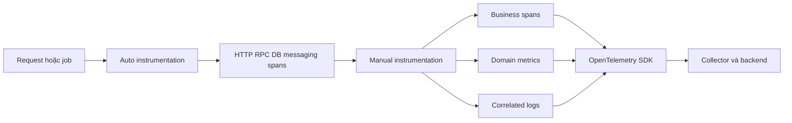
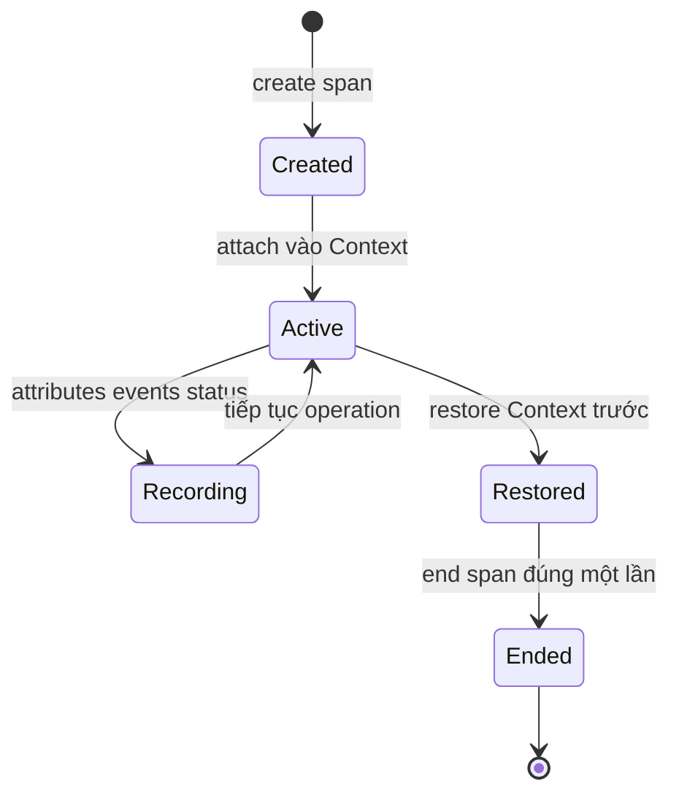
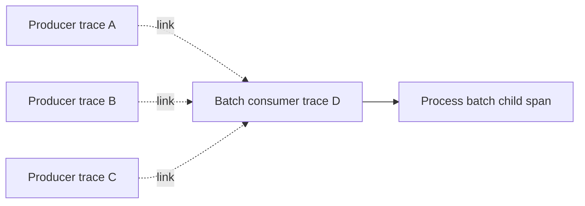
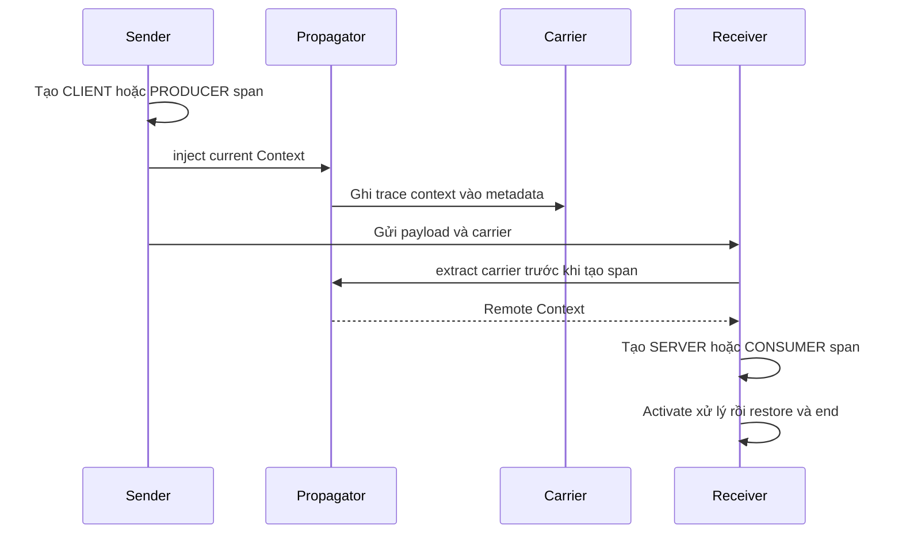
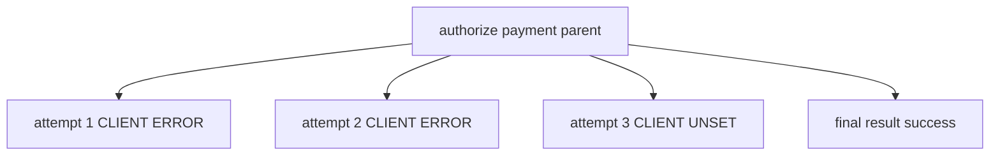

import { Step, Steps } from 'fumadocs-ui/components/steps';

<Callout type="info" title="Phạm vi của bài">
  Bài này tập trung vào **instrumentation nằm trong code ứng dụng hoặc library**.
  Phần khởi tạo provider, processor, reader và exporter được trình bày tại
  [API và SDK](/instrumentation/api-sdk/). Mọi ví dụ API bên dưới đều là
  pseudocode portable hoặc TypeScript-flavored pseudocode; hãy ánh xạ sang API
  idiomatic của SDK và phiên bản runtime bạn đang dùng.
</Callout>

## Mục lục

- [Manual instrumentation là gì và khi nào cần](#manual-instrumentation-là-gì-và-khi-nào-cần)
  - [Khi nên viết thủ công](#khi-nên-viết-thủ-công)
  - [Khi không nên viết thủ công](#khi-không-nên-viết-thủ-công)
- [Thiết kế telemetry trước khi viết code](#thiết-kế-telemetry-trước-khi-viết-code)
- [Tracing và active context](#tracing-và-active-context)
  - [Lifecycle create activate record end](#lifecycle-create-activate-record-end)
  - [Parent child và links](#parent-child-và-links)
  - [Tên span và SpanKind](#tên-span-và-spankind)
  - [Status và exception](#status-và-exception)
  - [Attributes events cardinality và PII](#attributes-events-cardinality-và-pii)
- [Propagation qua custom boundary](#propagation-qua-custom-boundary)
  - [Phía gửi inject](#phía-gửi-inject)
  - [Phía nhận extract](#phía-nhận-extract)
  - [Boundary nội bộ và tác vụ bất đồng bộ](#boundary-nội-bộ-và-tác-vụ-bất-đồng-bộ)
- [Metrics thủ công](#metrics-thủ-công)
  - [Chọn instrument](#chọn-instrument)
  - [Ví dụ metrics portable](#ví-dụ-metrics-portable)
  - [Schema unit và lifecycle](#schema-unit-và-lifecycle)
- [Log correlation](#log-correlation)
- [Ví dụ TypeScript dạng pseudocode](#ví-dụ-typescript-dạng-pseudocode)
  - [Helper span dùng lại được](#helper-span-dùng-lại-được)
  - [Checkout kết hợp ba signals](#checkout-kết-hợp-ba-signals)
- [Phối hợp auto và manual instrumentation](#phối-hợp-auto-và-manual-instrumentation)
- [Async cancellation và retry](#async-cancellation-và-retry)
  - [Async và detached work](#async-và-detached-work)
  - [Cancellation và deadline](#cancellation-và-deadline)
  - [Retry](#retry)
- [Testing và verification](#testing-và-verification)
  - [Unit và contract tests](#unit-và-contract-tests)
  - [Integration và end to end](#integration-và-end-to-end)
  - [Quy trình xác minh khi không thấy dữ liệu](#quy-trình-xác-minh-khi-không-thấy-dữ-liệu)
- [Lỗi thường gặp](#lỗi-thường-gặp)
- [Production checklist](#production-checklist)
- [Nguồn tham khảo chính thức](#nguồn-tham-khảo-chính-thức)
- [Bài liên quan](#bài-liên-quan)

## Manual instrumentation là gì và khi nào cần

**Manual instrumentation** là việc code chủ động gọi OpenTelemetry API để tạo
telemetry cho operation mà generic framework instrumentation không hiểu. Ví dụ,
auto-instrumentation có thể tạo span cho `POST /checkout` và truy vấn database.
Chỉ code nghiệp vụ mới biết giữa hai boundary đó có các bước `validate cart`,
`reserve inventory` và `authorize payment`.

Manual không đồng nghĩa với việc tự viết exporter hoặc tự khởi tạo một provider
trong mỗi module. Application cấu hình SDK một lần. Code instrumentation chỉ lấy
`Tracer`, `Meter` hoặc logging bridge/API từ provider đã được application sở hữu.
Library tái sử dụng được thường chỉ phụ thuộc vào OpenTelemetry API để vẫn hoạt
động an toàn với no-op provider.



### Khi nên viết thủ công

Manual instrumentation có giá trị khi ít nhất một trong các câu sau có đáp án
rõ ràng:

- Operation nghiệp vụ nào đang chi phối latency hoặc failure nhưng chưa có span?
- Metric nào cần cho SLO, capacity hoặc business health mà framework không thể
  suy ra?
- Protocol, queue, scheduler hoặc callback custom nào chưa được instrumentation
  library hỗ trợ propagation?
- Log nào cần gắn đúng active span để điều tra một quyết định nghiệp vụ?
- Library nội bộ nào cần phát telemetry portable mà không sở hữu backend?

Ví dụ phù hợp gồm `checkout.validate_cart`, số order được tạo, phân bố thời gian
chờ lock, số task đang chạy và context được truyền qua một in-house job bus.

### Khi không nên viết thủ công

Không thêm manual instrumentation chỉ để “có nhiều dữ liệu hơn”. Tránh nó khi:

- HTTP, RPC, database hoặc messaging instrumentation hiện có đã mô tả đúng cùng
  boundary;
- operation quá nhỏ, không có latency, failure hay ý nghĩa vận hành riêng;
- dữ liệu duy nhất có thể ghi là payload, secret hoặc ID không có use case query;
- metric chỉ lặp lại một histogram hoặc counter đã có;
- team chưa xác định owner, schema, cardinality budget và cách kiểm thử.

<Callout type="warn" title="Một boundary chỉ nên có một owner">
  Nếu auto-instrumentation đã tạo HTTP server span, đừng bọc cùng request bằng
  một manual `SERVER` span tương đương. Hãy tạo child span cho business step cần
  thấy, hoặc enrich span hiện có qua extension point được instrumentation hỗ trợ.
</Callout>

## Thiết kế telemetry trước khi viết code

Bắt đầu từ câu hỏi vận hành, không bắt đầu từ API method. Một bản thiết kế nhỏ có
thể dùng bảng sau:

| Câu hỏi | Signal phù hợp | Record đề xuất | Tiêu chí chấp nhận |
| --- | --- | --- | --- |
| Checkout chậm ở bước nào? | Trace | Child span cho từng business step đáng đo | Parent đúng, name ổn định, duration bao phủ đúng operation |
| Tỷ lệ order thành công là bao nhiêu? | Metric | Counter hoặc count của histogram, tùy semantics | Không double count, attributes cardinality thấp |
| Phân bố thời gian checkout? | Metric | Histogram với unit và boundaries phù hợp | Unit đúng, bucket hữu ích cho SLO |
| Vì sao một payment bị từ chối? | Log và trace | Structured log trong active payment span | Log có trace ID và span ID đúng |
| Batch này đến từ messages nào? | Trace | Consumer span có links tới producer contexts | Mỗi nguồn nhân quả được giữ lại |

Với mỗi record, chốt trước:

1. **Owner:** auto-instrumentation, manual module hay instrumentation library nào
   tạo record?
2. **Boundary:** operation bắt đầu và kết thúc chính xác ở đâu?
3. **Schema:** name, kind, unit, attributes và semantic convention version nào?
4. **Context:** parent lấy từ active context, explicit context hay carrier nào?
5. **Data policy:** field nào được allowlist, redact hoặc cấm?
6. **Budget:** số span, event, metric series và log bytes tối đa trên một request?
7. **Verification:** test nào chứng minh quan hệ, giá trị và không duplicate?

Nếu chưa trả lời được owner và boundary, khoan viết helper. Một abstraction đẹp
không thể sửa một mô hình telemetry sai.

## Tracing và active context

Một span là bản ghi của một operation có điểm bắt đầu và kết thúc. **Active
context** là context gắn với execution hiện tại. Nó thường chứa active span mà
child instrumentation và logging bridge sẽ dùng.

Tạo span và làm span active là hai việc khác nhau. Trace API không yêu cầu một
span mới tự động trở thành active. Một số SDK cung cấp callback, scope hoặc
context manager làm cả hai; một số runtime yêu cầu attach và detach rõ ràng.

### Lifecycle create activate record end



<Steps>
<Step>

**1. Create**

Tạo span bằng `Tracer`. Cung cấp name, parent context, `SpanKind`, initial
attributes và initial links đã biết. Initial data quan trọng vì head sampler chỉ
có thể xem thông tin có sẵn lúc span bắt đầu.

</Step>
<Step>

**2. Activate**

Đưa span vào một Context mới rồi chạy operation trong context đó. Child spans và
logs bên trong mới nhìn thấy span này là active. Lưu context trước để có thể
restore chính xác.

</Step>
<Step>

**3. Record**

Ghi attributes mô tả toàn operation, events cho thời điểm đáng chú ý, exception
và status theo kết quả. Nếu cần tính metadata rất đắt, có thể kiểm tra API
`IsRecording` tương đương của runtime trước khi tính. Không dùng trạng thái này
để thay đổi business logic.

</Step>
<Step>

**4. End**

Restore context và end span trong `finally`, scope guard hoặc context manager.
`end` không tự restore active context và không tự end child spans. Sau khi end,
những thay đổi telemetry tiếp theo phải bị bỏ qua.

</Step>
</Steps>

Pseudocode trung lập ngôn ngữ:

```text
span = tracer.start_span(
  name = "checkout.validate_cart",
  parent_context = current_context(),
  kind = INTERNAL,
  initial_attributes = {"app.checkout.item_count": cart.item_count}
)

previous = context.attach(span)
try:
    validate(cart)
catch error:
    span.record_exception(error)
    span.set_status(ERROR, "validation failed")
    throw error
finally:
    context.detach(previous)
    span.end()
```

Tên method chỉ minh họa contract. Trong code thật, ưu tiên callback, scope hoặc
context manager idiomatic do runtime cung cấp để tránh quên detach khi exception,
return sớm hoặc cancellation xảy ra.

### Parent child và links

Mỗi span có tối đa một parent. Parent-child biểu diễn operation con xảy ra trực
tiếp vì operation cha. Nếu không truyền parent rõ ràng, API thường lấy span từ
current Context; nếu Context không có span hợp lệ, span mới trở thành root.

**Link** tham chiếu thêm tới một `SpanContext` nhưng không thay parent và không
đổi trace ID. Links phù hợp khi cây một-parent không biểu diễn đủ quan hệ nhân
quả.

| Tình huống | Parent | Links |
| --- | --- | --- |
| Function nghiệp vụ chạy trong request | Active request hoặc business span | Thường không cần |
| HTTP hoặc RPC incoming | Remote context đã extract | Không cần cho caller trực tiếp |
| Một message được xử lý | Theo messaging semantic conventions và topology | Có thể link tới message creation context |
| Một batch chứa nhiều messages | Parent theo convention hoặc root mới | Link tới context của từng message để không mất nguồn |
| Workflow mới chủ động tách trace | Root mới | Link tới span đã lên lịch workflow cũ |
| Retry attempt đồng bộ | Parent operation điều phối retry | Không dùng link chỉ vì đây là attempt khác |



Đặt links đã biết ngay lúc tạo span. Sampler có thể xem initial links; link thêm
sau sampling decision không thể thay đổi quyết định đã xảy ra. Với messaging,
hãy theo semantic conventions đúng version thay vì áp dụng một quy tắc parent
hay link cho mọi broker và topology.

### Tên span và SpanKind

Tên span phải mô tả một **lớp operations ổn định**, không mô tả từng instance.
`checkout.validate_cart` dễ group. `checkout.validate_cart/order-8f31` tạo name
cardinality cao và làm backend khó aggregate.

| `SpanKind` | Dùng khi | Ví dụ |
| --- | --- | --- |
| `INTERNAL` | Operation bên trong process, không đại diện remote boundary | `checkout.validate_cart` |
| `SERVER` | Nhận request theo mô hình request-response | Nhận HTTP hoặc RPC request |
| `CLIENT` | Gọi ra ngoài và chờ response | HTTP, RPC hoặc database call |
| `PRODUCER` | Gửi hoặc lên lịch deferred work | Publish message, enqueue job |
| `CONSUMER` | Nhận hoặc xử lý deferred work | Process message hoặc batch |

`INTERNAL` là mặc định trong Trace API, nhưng mặc định không luôn đúng. Chọn kind
theo vai trò của operation tại boundary, không theo việc code có dùng
`async/await` hay không.

Quy tắc đặt tên:

- ưu tiên semantic convention hiện hành cho HTTP, RPC, database và messaging;
- dùng route template, RPC method hoặc destination ổn định;
- namespace tên custom theo domain, ví dụ `checkout.apply_discount`;
- không đưa user ID, order ID, UUID, raw URL hoặc error message vào name;
- không tạo span cho mọi function, getter hoặc vòng lặp.

### Status và exception

Span status và exception event trả lời hai câu hỏi khác nhau:

- **Status** kết luận operation thành công, chưa được kết luận hay thất bại.
- **Exception event** ghi chi tiết một exception đã xảy ra tại một thời điểm.

| Status | Cách dùng thực tế |
| --- | --- |
| `UNSET` | Mặc định; hợp lệ cho phần lớn operation thành công khi convention không yêu cầu kết luận khác |
| `OK` | Chỉ đặt khi instrumentation thật sự cần kết luận thành công rõ ràng |
| `ERROR` | Đặt khi operation thất bại theo semantic convention hoặc contract của operation |

Gọi `recordException` không nhất thiết tự đặt `ERROR`. Nếu exception làm
operation thất bại, ghi exception **và** đặt status phù hợp. Nếu exception đã
được xử lý và parent operation cuối cùng thành công sau retry, attempt lỗi vẫn
có thể là `ERROR` nhưng parent không cần bị đánh lỗi.

Không nhét stack trace, payload hoặc message thay đổi mạnh vào status description.
Dùng exception event hoặc structured log cho chi tiết, đồng thời áp dụng redaction.

<Callout type="warn" title="Đừng lan lỗi lên toàn bộ cây một cách máy móc">
  Status thuộc về kết quả của từng operation. Một payment attempt timeout có thể
  là `ERROR`, trong khi checkout parent vẫn thành công vì attempt tiếp theo hoàn
  tất. Đặt status theo điều caller thực sự quan sát được.
</Callout>

### Attributes events cardinality và PII

**Attribute** mô tả operation hoặc measurement. **Event** đánh dấu một thời điểm
đáng chú ý bên trong span. Nếu cần duration riêng, tạo child span thay vì hai
events `started` và `finished`.

| Nhu cầu | Dùng gì? | Ví dụ |
| --- | --- | --- |
| Filter hoặc group operation | Span attribute | route template, operation type, item count |
| Ghi một state transition có timestamp | Span event | `payment.retry_scheduled` |
| Đo latency của sub-operation | Child span | `checkout.reserve_inventory` |
| Liên hệ operation ngoài parent trực tiếp | Link | Batch consumer tới nhiều producer contexts |
| Giữ chi tiết sự kiện dài hoặc cần tìm kiếm text | Structured log | Payment provider trả lỗi đã redact |

**Cardinality** là số giá trị hoặc tổ hợp giá trị khác nhau. Traces chịu chi phí
index khi attributes có cardinality cao. Metrics còn tạo một time series cho mỗi
tổ hợp dimensions, nên rủi ro lớn hơn nhiều.

| Dữ liệu | Nên làm | Nên tránh |
| --- | --- | --- |
| HTTP path | Dùng route template như `/orders/{id}` | Raw path `/orders/981742` |
| Error | Nhóm ổn định như `timeout` nếu convention cho phép | Error message tự do làm metric attribute |
| Business ID | Chỉ ghi có chọn lọc trên trace/log theo policy | Đưa vào metric dimensions hoặc span name |
| Request body | Allowlist field tối thiểu rồi redact | Ghi nguyên body |
| Token và cookie | Không ghi | Redact muộn sau khi đã export |
| Baggage | Chỉ chép key được allowlist | Copy toàn bộ sang mọi signal |

PII là dữ liệu có thể nhận diện cá nhân. Một order ID tưởng như vô hại vẫn có thể
trở thành PII nếu backend nối được nó với khách hàng. Kiểm soát dữ liệu ở nơi tạo
record là lớp bảo vệ đầu tiên; Collector redaction chỉ là lớp phòng thủ bổ sung.

## Propagation qua custom boundary

Chỉ instrument propagation thủ công khi transport hoặc scheduler chưa được
instrumentation library hỗ trợ. **Carrier** là nơi giữ metadata qua boundary,
chẳng hạn HTTP headers, message properties hoặc job envelope. Dùng Propagators
API và getter/setter phù hợp với carrier; không tự nối chuỗi `traceparent`.



### Phía gửi inject

Thứ tự an toàn ở phía gửi:

1. tạo outgoing `CLIENT` hoặc `PRODUCER` span nếu boundary cần span;
2. activate span đó;
3. inject **current Context chứa outgoing span** vào carrier;
4. gửi request hoặc message;
5. record kết quả, restore context và end span.

```text
send_span = tracer.start_span(kind = PRODUCER, parent = current_context())
with active(send_span):
    propagator.inject(current_context(), message.metadata, carrier_setter)
    broker.publish(message)
send_span.end()
```

Nếu inject context cha trước rồi mới tạo outgoing span, downstream có thể gắn
vào sai parent và outgoing span trở thành sibling thay vì caller trực tiếp.

### Phía nhận extract

Extract trước khi tạo incoming span:

```text
remote_context = propagator.extract(
  base_context = root_or_current_according_to_boundary_policy,
  carrier = message.metadata,
  getter = carrier_getter
)

consumer_span = tracer.start_span(
  name = "orders.process",
  kind = CONSUMER,
  parent_context = remote_context
)

with active(consumer_span):
    process(message)
consumer_span.end()
```

Pseudocode chỉ minh họa thứ tự. Với messaging, parent hay link phải theo semantic
conventions, broker semantics và mô hình batch của phiên bản đang dùng.

Tại public hoặc cross-tenant boundary, context nhận vào là dữ liệu không tin cậy.
Validate kích thước và định dạng qua propagator, quyết định có chấp nhận remote
parent hay bắt đầu trace mới, và không forward baggage chưa allowlist. Trace
context không phải authentication hoặc authorization.

### Boundary nội bộ và tác vụ bất đồng bộ

Trong cùng process, thường không cần serialize Context. Capture **full Context**
khi schedule và restore nó khi callback chạy:

```text
captured = current_context()
scheduler.submit(() => context.run(captured, callback))
```

Không capture một biến global như `currentTraceId`. Nhiều request chạy đồng thời
sẽ ghi đè lẫn nhau. Cũng không chỉ copy trace ID: parent relation, trace state,
flags và baggage hợp lệ nằm trong Context do API quản lý.

Nếu scheduler hoặc thread pool đã có context instrumentation, wrapper thủ công có
thể duplicate hoặc giữ context quá lâu. Viết concurrency test trước khi thêm
wrapper vào toàn bộ executor.

## Metrics thủ công

Metrics đo dữ liệu tổng hợp. Instrument được tạo một lần từ `Meter`, còn
measurements được ghi trên hot path hoặc được callback quan sát khi collection.
Từ `async` trong Metrics API nói về callback của collector, không nói business
function có dùng `await`.

### Chọn instrument

| Câu hỏi về đại lượng | Instrument | Giá trị báo vào API | Ví dụ |
| --- | --- | --- | --- |
| Delta chỉ tăng? | `Counter` | Increment không âm | Số order hoàn tất, bytes nhận thêm |
| Delta có thể tăng và giảm? | `UpDownCounter` | Increment dương hoặc âm | Số checkout đang active |
| Cần phân bố của từng quan sát? | `Histogram` | Mỗi duration hoặc size | Checkout duration, payload size |
| Đọc tổng tuyệt đối monotonic lúc collect? | `ObservableCounter` | Giá trị hiện tại tuyệt đối | CPU time hoặc page faults từ runtime |
| Đọc tổng tuyệt đối có thể tăng giảm và cộng được? | `ObservableUpDownCounter` | Giá trị hiện tại tuyệt đối | Queue size hoặc heap size khi semantics additive |
| Đọc snapshot hiện tại không có tính cộng? | `ObservableGauge` | Giá trị hiện tại tuyệt đối | Nhiệt độ, utilization theo instance |

Một số runtime còn hỗ trợ synchronous `Gauge`; mức hỗ trợ và tên builder khác
nhau. Không có `ObservableHistogram` trong Metrics API. Nếu nguồn chỉ cung cấp
histogram đã aggregate, hãy dùng bridge hoặc receiver phù hợp thay vì giả lập
bằng gauge.

Quy tắc nhanh:

- dùng `Counter` cho **delta**, không gọi `add(totalSoFar)` mỗi lần;
- dùng `Histogram` cho latency, không chỉ ghi average hoặc giá trị cuối;
- với `UpDownCounter`, phép `+1` và `-1` của cùng work item phải dùng cùng tập
  attributes;
- observable callback chỉ đọc snapshot nhanh, không gây side effect, không chờ
  I/O vô hạn và không báo trùng cùng attribute set trong một collection;
- asynchronous observations không gắn với active Context, nên không tạo exemplar
  correlation theo cách synchronous measurement có thể làm.

### Ví dụ metrics portable

Đây là **pseudocode portable, không phải code chạy trực tiếp**:

```text
meter = meter_provider.get_meter("com.example.checkout", version)

orders_created = meter.create_counter(
  name = "checkout.orders.created",
  unit = "{order}",
  description = "Number of orders created successfully"
)

checkout_duration = meter.create_histogram(
  name = "checkout.operation.duration",
  unit = "s",
  description = "Duration of checkout operations"
)

active_checkouts = meter.create_up_down_counter(
  name = "checkout.active",
  unit = "{checkout}",
  description = "Number of checkouts currently in progress"
)

queue_depth = meter.create_observable_up_down_counter(
  name = "checkout.queue.depth",
  unit = "{job}",
  callback = () => observe(queue.snapshot_depth(), {"queue.name": "checkout"})
)
```

Ghi measurement trên operation:

```text
attrs = {
  "app.checkout.channel": normalized_channel,
  "app.checkout.result": normalized_result
}

active_attrs = {"app.checkout.channel": normalized_channel}
active_checkouts.add(+1, active_attrs)
started = monotonic_clock.now()
try:
    result = run_checkout()
    orders_created.add(1, attrs)
finally:
    active_checkouts.add(-1, active_attrs)
    checkout_duration.record(monotonic_clock.elapsed_seconds(started), attrs)
```

Tập attributes dùng cho `active_checkouts.add(+1)` và `add(-1)` phải giống hệt
nhau. Nếu decrement thêm `result`, phép tăng và giảm đi vào hai series khác nhau,
làm active count không trở về baseline.

### Schema unit và lifecycle

- Dùng semantic conventions nếu domain đã có metric chuẩn. Chỉ tạo custom metric
  khi nó trả lời câu hỏi khác.
- Tên instrument ổn định và không chứa environment, tenant hoặc ID động.
- Unit là metadata, không tự chuyển đổi giá trị. Khai báo `s` thì code phải ghi
  giây, không ghi milliseconds.
- Chọn histogram boundaries theo SLO và phân bố thực tế. Cấu hình aggregation có
  thể nằm ở View thay vì call site, tùy SDK.
- Tạo instrument một lần theo scope, không tạo lại trên mỗi request.
- Unregister observable callback khi component owner kết thúc nếu runtime hỗ trợ
  registration động.
- Đặt budget cho tích Descartes của metric attributes. Không dùng trace ID,
  request ID, order ID, raw path, email hoặc error message làm dimensions.
- Không tạo counter thứ hai nếu `count` của histogram đã trả lời chính xác cùng
  câu hỏi và cùng population.

<Callout type="idea" title="Correlation metrics với traces">
  Ghi synchronous histogram hoặc counter trong active Context để SDK có cơ hội
  tạo exemplar chứa trace ID và span ID. Không đưa trace ID vào metric
  attributes. Xem [Signal correlation](/signals/correlation/) và
  [Exemplars](/signals/exemplars/).
</Callout>

## Log correlation

Manual logging thường không yêu cầu thay logger hiện có. Ưu tiên appender,
handler hoặc bridge OpenTelemetry dành cho logging framework của runtime. Bridge
nên capture Context tại call site và map record sang LogRecord có cấu trúc.

Một log được emit trong active span có thể mang các top-level fields:
`TraceId`, `SpanId` và `TraceFlags`. Điều này cho phép backend mở đúng trace và
span. Các field vật lý trong backend có thể dùng casing khác; kiểm tra mapping
thực tế thay vì tự thêm nhiều alias custom.

```text
with active(payment_span):
    app_logger.warn(
      "Payment attempt timed out",
      error_type = "timeout",
      payment_provider = "acme-pay",
      retry_attempt = 1
    )
```

Đây là pseudocode. Logging bridge phải lấy context tại lúc `warn` được gọi. Nếu
logger đưa record vào queue và chỉ đọc current Context trên worker thread sau
đó, log có thể mất IDs hoặc gắn nhầm request.

Các nguyên tắc quan trọng:

- emit structured fields thay vì nối mọi metadata vào message;
- giữ `service.name` và Resource nhất quán giữa traces, metrics và logs;
- không log cùng exception ở manual code, framework handler và
  auto-instrumentation nếu một record đã đủ;
- không giả định log có sampled flag thì trace chắc chắn còn trong backend;
- log startup hoặc background maintenance ngoài mọi span có thể hợp lệ khi không
  có trace IDs;
- không dùng trace ID như session token, business ID hoặc authorization input.

## Ví dụ TypeScript dạng pseudocode

Hai ví dụ dưới đây dùng cú pháp TypeScript để dễ đọc nhưng **không cam kết tên
package, enum, overload hay context manager của runtime cụ thể**. Các interface
`Telemetry`, `Context`, `Span` và `Logger` là abstraction minh họa. Khi triển
khai, thay chúng bằng API idiomatic và kiểm tra tài liệu version đang pin.

### Helper span dùng lại được

Helper nên chuẩn hóa lifecycle và policy nhỏ, không che giấu toàn bộ OpenTelemetry.
Nó không tự tạo SDK provider, exporter hoặc global state.

```ts
// TypeScript-flavored pseudocode — không chạy trực tiếp.
type SpanOptions = {
  kind: "INTERNAL" | "SERVER" | "CLIENT" | "PRODUCER" | "CONSUMER";
  parentContext?: Context;
  attributes?: Record<string, AttributeValue>;
  links?: Array<{ context: SpanContext; attributes?: Record<string, AttributeValue> }>;
};

async function inSpan<T>(
  telemetry: Telemetry,
  name: string,
  options: SpanOptions,
  operation: (span: Span) => Promise<T>,
): Promise<T> {
  const parent = options.parentContext ?? telemetry.context.current();
  const span = telemetry.tracer.startSpan(name, { ...options, parentContext: parent });

  try {
    // runWithSpan phải giữ context cho tới khi Promise settle và restore sau đó.
    return await telemetry.context.runWithSpan(span, () => operation(span));
  } catch (error) {
    span.recordException(error);
    span.setStatus({ code: "ERROR", description: stableErrorType(error) });
    throw error; // Không đổi contract hoặc nuốt lỗi nghiệp vụ.
  } finally {
    span.end(); // Kết thúc đúng một lần trên success, error và cancellation.
  }
}
```

Helper này chỉ phù hợp khi mọi exception thoát khỏi callback đều làm operation
thất bại. Với domain nơi một exception được xử lý và kết quả vẫn thành công,
caller phải có cách điều khiển status. Đừng tạo helper “một kích cỡ cho mọi
operation” rồi tự động đánh `ERROR` sai semantics.

Một helper production nên:

- nhận `Tracer` hoặc telemetry facade qua dependency injection;
- dùng scope name và version ổn định;
- áp dụng allowlist cho attributes, không serialize object tùy ý;
- giữ nguyên return value, exception, cancellation và deadline;
- cho phép initial attributes/links để sampler nhìn thấy;
- tránh tính dữ liệu đắt khi span không recording nếu runtime hỗ trợ kiểm tra;
- không gọi flush hoặc shutdown trong request;
- có unit tests riêng cho context restore và double-end.

### Checkout kết hợp ba signals

```ts
// TypeScript-flavored pseudocode — tên API chỉ minh họa contract portable.
async function checkout(input: CheckoutInput, cancel: Cancellation): Promise<Order> {
  const metricAttrs = {
    "app.checkout.channel": normalizeChannel(input.channel),
  };
  const started = monotonicClock.now();
  metrics.activeCheckouts.add(1, metricAttrs);

  try {
    return await inSpan(
      telemetry,
      "checkout.process",
      {
        kind: "INTERNAL",
        attributes: {
          "app.checkout.channel": metricAttrs["app.checkout.channel"],
          "app.checkout.item_count": input.items.length,
        },
      },
      async (span) => {
        cancel.throwIfCancelled();
        span.addEvent("checkout.validation_started");
        await validateCart(input.items, cancel);

        const order = await authorizeAndCreateOrder(input, cancel);

        // Measurement diễn ra trong active span để exemplar có thể correlate.
        metrics.ordersCreated.add(1, {
          ...metricAttrs,
          "app.checkout.result": "success",
        });

        logger.info("Order created", {
          // Chỉ ghi ID nếu policy cho phép; không dùng nó làm metric attribute.
          "app.order.id": order.id,
          "app.checkout.item_count": input.items.length,
        });

        return order;
      },
    );
  } finally {
    metrics.activeCheckouts.add(-1, metricAttrs);
    metrics.checkoutDuration.record(
      monotonicClock.elapsedSeconds(started),
      metricAttrs,
    );
  }
}
```

Ví dụ cố ý không đặt status `OK`; success thông thường có thể giữ `UNSET`. Logger
được giả định đã có bridge lấy active Context. `order.id` không đi vào metric.
Operation dùng monotonic clock cho elapsed duration và luôn decrement active
count trong `finally`.

## Phối hợp auto và manual instrumentation

Auto và manual instrumentation bổ sung cho nhau khi mỗi lớp sở hữu operation
khác nhau:

```text
HTTP SERVER span                  ← auto-instrumentation sở hữu
└── checkout.process INTERNAL     ← manual instrumentation sở hữu
    ├── payment HTTP CLIENT       ← auto-instrumentation sở hữu
    ├── database CLIENT           ← auto-instrumentation sở hữu
    └── publish PRODUCER          ← auto hoặc manual, chọn đúng một owner
```

Trước khi thêm manual span hoặc metric:

1. chạy một request fixture chỉ với auto-instrumentation;
2. ghi lại names, kinds, scope names, attributes và timestamps hiện có;
3. xác định khoảng trống nghiệp vụ thực sự;
4. thêm một manual record cho khoảng trống đó;
5. so sánh output lần nữa để phát hiện duplicate và double count.

Dấu hiệu duplicate gồm hai spans cùng kind, gần như cùng start/end, cùng remote
boundary nhưng có instrumentation scope khác nhau; hoặc metric count gần gấp đôi
traffic fixture.

Cách xử lý theo thứ tự ưu tiên:

- bỏ manual wrapper nếu auto record đã đúng;
- tắt một instrumentation cụ thể bằng cấu hình chính thức nếu manual owner có lý
  do rõ ràng;
- dùng suppression mechanism của runtime khi một instrumentation library custom
  cố ý thay thế built-in instrumentation;
- enrich existing span qua hook được hỗ trợ thay vì tạo span song song;
- không lọc duplicate ở backend như giải pháp mặc định vì chi phí đã phát sinh
  trong application và pipeline.

<Callout type="warn" title="Không sửa double count bằng dashboard">
  Chia metric cho hai hoặc ẩn một span bằng query chỉ che lỗi ownership. Chọn một
  nguồn phát tại instrumentation layer rồi kiểm thử lại traffic fixture.
</Callout>

## Async cancellation và retry

### Async và detached work

Span phải bao phủ logical operation, không chỉ thời gian schedule callback. Nếu
operation kết thúc khi Promise/Future hoàn tất, helper phải `await` nó trước khi
end span và restore context.

Phân biệt hai trường hợp:

| Trường hợp | Lifecycle phù hợp |
| --- | --- |
| Request chờ async work hoàn tất | Giữ span active qua `await`; end khi Promise/Future settle |
| Fire-and-forget nhưng vẫn thuộc operation hiện tại | Tránh nếu không quản lý được lifecycle; đăng ký task và end khi task thực sự hoàn tất |
| Background job có lifecycle riêng | Capture context khi enqueue; phía worker tạo `CONSUMER` hoặc internal span theo topology |
| Detached work tồn tại lâu hơn trace gốc | Có thể bắt đầu trace mới và link tới scheduling context |

Không để active Context rò sang task không liên quan. Sau callback, context phải
trở về giá trị trước đó kể cả khi throw, timeout hoặc cancel.

### Cancellation và deadline

Cancellation là tín hiệu operation không nên tiếp tục. Instrumentation không
được nuốt cancellation, đổi nó thành success hoặc làm chậm phản hồi chỉ để export
telemetry.

- end span trong cancellation path bằng `finally` hoặc scope guard;
- ghi event hoặc attributes chỉ khi convention/domain cần phân biệt lý do;
- đặt `ERROR` theo semantic convention và contract của operation, không mặc định
  mọi cancellation là lỗi;
- phân biệt user cancellation, deadline exceeded và service shutdown bằng tập
  giá trị hữu hạn;
- không dùng exception message tự do làm metric dimension hoặc status
  description;
- propagation của cancellation token và propagation của OTel Context là hai
  contract khác nhau; cần giữ cả hai nếu boundary hỗ trợ.

Ví dụ, caller hủy một search vì người dùng đóng trang có thể là kết quả dự kiến.
Deadline exceeded của payment call lại có thể là failure. Takeaway: status phản
ánh semantics của operation, không chỉ loại exception của runtime.

### Retry

Mô hình retry nên cho thấy cả kết quả cuối và từng attempt khi chúng có latency
hoặc failure cần điều tra:



- Parent span đo logical operation gồm retry policy và backoff.
- Mỗi network attempt có span riêng nếu client instrumentation chưa tạo nó.
- Attempt lỗi ghi exception/status theo kết quả attempt.
- Parent status theo final outcome caller nhận, không copy status từ attempt đầu.
- Ghi attempt number bằng giá trị hữu hạn. Không dùng idempotency key hoặc raw
  error message làm metric attribute.
- Backoff có thể là event nếu chỉ cần timestamp, hoặc child span nếu cần đo
  duration riêng.
- Đừng retry exporter hoặc flush telemetry trong business retry loop; SDK và
  Collector có retry policy riêng.

## Testing và verification

Telemetry là output có schema và quan hệ, vì vậy cần test như một contract. Chỉ
assert “không throw” không chứng minh instrumentation đúng.

### Unit và contract tests

Dùng in-memory exporter, test span processor, metric reader hoặc log sink của
runtime. Không gửi dữ liệu test tới backend production.

| Signal | Assertions tối thiểu |
| --- | --- |
| Trace | Số span, name, kind, parent, links, status, events, initial attributes và span đã end |
| Metric | Instrument name, kind, unit, measurements/points, attributes, active count về baseline và không có series ngoài schema |
| Log | Body/severity/attributes, Resource, trace ID và span ID bằng active span tại call site |
| Context | Child dùng cùng trace ID, span ID mới, context được restore sau callback |
| Propagation | Sender inject, receiver extract, parent hoặc links đúng theo contract |

Pseudocode test cho helper:

```text
run inSpan("checkout.validate") with a child operation

assert exported_spans.count == 2
assert child.trace_id == parent.trace_id
assert child.parent_span_id == parent.span_id
assert parent.name == "checkout.validate"
assert parent.end_time is present
assert current_context_after_test == context_before_test
```

Bổ sung negative tests:

- operation throw exception;
- Promise bị reject hoặc cancellation xảy ra;
- hai requests chạy đồng thời để phát hiện context leak;
- retry thành công sau một attempt lỗi;
- attribute chứa fake secret để kiểm tra redaction;
- `+1` rồi `-1` dùng cùng attributes và active metric về zero;
- auto và manual cùng bật để phát hiện duplicate;
- observable callback bị gọi nhiều lần nhưng không gây side effect.

### Integration và end to end

Một bài test boundary nên tạo parent context biết trước, gửi qua transport thật
trong môi trường test rồi kiểm tra phía nhận:

1. sender tạo outgoing span và inject carrier;
2. receiver extract trước khi tạo incoming span;
3. incoming span giữ trace ID và có parent/link đúng;
4. một log bên trong incoming span có cùng trace ID và span ID;
5. một synchronous metric measurement trong active span có thể tạo exemplar nếu
   test pipeline bật và hỗ trợ;
6. output không chứa fake token hoặc field ngoài allowlist;
7. request count và histogram count khớp traffic fixture, không gấp đôi;
8. shutdown/force-flush của test harness hoàn tất trong timeout.

Dùng Collector `debug` exporter trong môi trường kiểm soát để xem payload gần
đường wire. Output chi tiết có thể chứa dữ liệu nhạy cảm, vì vậy không bật lâu
dài trong production.

### Quy trình xác minh khi không thấy dữ liệu

<Steps>
<Step>

**1. Xác nhận code path**

Chứng minh operation đã chạy và helper đã được gọi. Dùng fixture có marker ổn
định trong test, không dùng ID ngẫu nhiên làm schema production.

</Step>
<Step>

**2. Xác nhận API và active Context**

Provider có phải no-op vì bootstrap quá muộn không? Span có recording không?
Child/log có nhìn thấy active span mong đợi không?

</Step>
<Step>

**3. Xác nhận lifecycle**

Mọi span đã end chưa? Metric reader đã collect chưa? Observable callback có được
đăng ký không? Process có shutdown trước batch/collection interval không?

</Step>
<Step>

**4. Xác nhận propagation và ownership**

Carrier có context sau inject không? Receiver extract trước span creation không?
Có hai instrumentation cùng ghi một boundary không?

</Step>
<Step>

**5. Xác nhận pipeline**

Kiểm tra SDK diagnostics, exporter timeout, Collector receiver/pipeline, queue,
retry, filter, sampling và backend retention. So sánh debug output với backend
query trước khi sửa dashboard.

</Step>
</Steps>

## Lỗi thường gặp

| Triệu chứng | Nguyên nhân thường gặp | Cách sửa |
| --- | --- | --- |
| Child trở thành root hoặc gắn sai parent | Span được tạo nhưng không active; async Context bị mất | Dùng scope/context manager; test concurrency và restore |
| Span không xuất hiện | Quên end, provider no-op, sampling hoặc export failure | Kiểm tra lifecycle từ API tới backend |
| Span duration quá ngắn | End ngay sau khi schedule async work | Await logical operation trước khi end |
| Span duration quá dài | Quên end ở error/cancel path | Dùng `finally`, scope guard hoặc context manager |
| Log có trace ID sai | Async logger đọc context trên worker thay vì call site | Capture Context cùng log record tại call site |
| Mỗi service có trace mới | Thiếu inject/extract hoặc extract sau span creation | Sửa thứ tự outgoing span → inject và extract → incoming span |
| Downstream là sibling của client span | Inject context cha trước khi tạo outgoing span | Activate outgoing span rồi inject current Context |
| Batch chỉ liên hệ một message | Chọn một producer làm parent và bỏ các nguồn khác | Dùng links theo messaging convention |
| UI có exception nhưng span không lỗi | `recordException` không tự đảm bảo status `ERROR` | Đặt status khi operation thật sự thất bại |
| Parent lỗi dù retry thành công | Copy status từ attempt lên parent | Đặt status theo final outcome của từng operation |
| Mọi span đều `OK` | Helper tự đánh success | Giữ `UNSET` khi không cần kết luận rõ |
| Tên span có hàng triệu giá trị | Chèn ID hoặc raw URL vào name | Dùng operation class hoặc route template |
| Metric active không về zero | Attributes của `+1` và `-1` khác nhau | Tái sử dụng cùng immutable attribute set |
| Counter tăng quá nhanh | Ghi absolute total vào synchronous Counter | Ghi delta hoặc dùng ObservableCounter phù hợp |
| Latency chỉ còn giá trị cuối | Dùng gauge thay Histogram | Record từng duration vào Histogram |
| Metric series bùng nổ | ID, raw path hoặc message làm dimensions | Dùng schema allowlist và cardinality budget |
| Count gần gấp đôi | Auto và manual cùng phát cùng span/metric | Chọn một owner và tắt/bỏ nguồn còn lại |
| Secret vẫn xuất hiện | Redact sau khi dữ liệu đã rời process | Allowlist/redact tại source; test toàn payload |
| Helper làm đổi hành vi ứng dụng | Nuốt lỗi, đổi cancellation hoặc block để flush | Giữ nguyên contract; telemetry failure không điều khiển business logic |

<Callout type="error" title="Không ghép trace bằng timestamp hoặc business ID">
  Hai spans gần nhau về thời gian hoặc cùng order ID chưa chứng minh quan hệ
  parent-child. Sửa Context propagation, hoặc dùng link khi mô hình chủ động tách
  trace. Timestamp chỉ là bằng chứng phụ.
</Callout>

## Production checklist

**Thiết kế và ownership**

- [ ] Mỗi span, metric và log có câu hỏi vận hành và owner rõ ràng.
- [ ] Auto-instrumentation hiện có đã được inventory trước khi thêm manual code.
- [ ] Không có hai owners cho cùng HTTP, RPC, DB, messaging hoặc metric boundary.
- [ ] Scope name/version nhận diện đúng module instrumentation, không dùng
  `service.name` làm scope name.
- [ ] Semantic convention version được pin và có kế hoạch migration.

**Tracing và context**

- [ ] Span name ổn định, không chứa ID hoặc raw path.
- [ ] `SpanKind` đúng vai trò của boundary.
- [ ] Initial attributes và links cần cho sampling được đặt lúc tạo span.
- [ ] Mọi span đều end đúng một lần trên success, error và cancellation.
- [ ] Active Context được restore; không rò giữa concurrent requests.
- [ ] Parent-child và links phản ánh causal model, đặc biệt với batch và retry.
- [ ] Sender tạo outgoing span trước inject; receiver extract trước incoming span.
- [ ] Custom carrier có getter/setter, size limit và trust-boundary policy.
- [ ] Baggage có allowlist và không chứa secret hoặc PII.

**Status và dữ liệu**

- [ ] Exception làm operation thất bại có event và status phù hợp.
- [ ] Success không bị buộc thành `OK` nếu `UNSET` đã đúng convention.
- [ ] Attributes/events có schema, type và count limit rõ ràng.
- [ ] PII, token, cookie, body và stack trace được allowlist/redact tại source.
- [ ] Dữ liệu đắt chỉ được tính khi cần và không thay đổi business logic.

**Metrics và logs**

- [ ] Counter nhận delta không âm; UpDownCounter dùng attributes đối xứng.
- [ ] Histogram dùng đúng unit và boundaries hỗ trợ SLO.
- [ ] Observable callbacks nhanh, side-effect free và có lifecycle registration.
- [ ] Metric dimensions có cardinality budget; không chứa trace/request/order ID.
- [ ] Instruments được tạo một lần và không xung đột name, kind hoặc unit.
- [ ] Logging bridge capture Context tại call site.
- [ ] Correlated log resolve tới đúng span khi trace được sampled và còn retention.
- [ ] Không ghi cùng exception ở nhiều tầng nếu không có mục đích khác nhau.

**Verification và vận hành**

- [ ] Unit tests kiểm tra schema, lifecycle, context restore và error paths.
- [ ] Integration tests kiểm tra inject/extract qua transport thật.
- [ ] Concurrency, cancellation, retry, shutdown và backend outage đã được test.
- [ ] Traffic fixture chứng minh không duplicate spans hoặc double-count metrics.
- [ ] Collector/debug output đã được đối chiếu với backend query.
- [ ] SDK và Collector queue, drop, retry, export failure và metric overflow có
  monitoring.
- [ ] Overhead CPU, memory, payload volume và latency nằm trong budget.
- [ ] Graceful shutdown flush telemetry trong timeout nhưng không treo process.

## Nguồn tham khảo chính thức

- [OpenTelemetry — JavaScript manual instrumentation](https://opentelemetry.io/docs/languages/js/instrumentation/) — ví dụ cụ thể cho một runtime; dùng để tham khảo cách API idiomatic thay vì copy sang ngôn ngữ khác.
- [OpenTelemetry Specification — Tracing API](https://opentelemetry.io/docs/specs/otel/trace/api/) — lifecycle, Context, parent, links, events, status và `IsRecording`.
- [OpenTelemetry Specification — Metrics API](https://opentelemetry.io/docs/specs/otel/metrics/api/) — synchronous/asynchronous instruments, callbacks và measurements.
- [OpenTelemetry Specification — Logs API](https://opentelemetry.io/docs/specs/otel/logs/api/) — emit LogRecord với Context, severity, body và attributes.
- [OpenTelemetry — Context propagation](https://opentelemetry.io/docs/concepts/context-propagation/) — inject/extract và custom carrier boundary.
- [OpenTelemetry Semantic Conventions](https://opentelemetry.io/docs/specs/semconv/) — naming và attributes chuẩn theo domain.
- [W3C Trace Context](https://www.w3.org/TR/trace-context/) — định dạng trace context chuẩn qua network.

<Callout type="info" title="Kiểm tra trạng thái theo runtime">
  Trace API là nền tảng ổn định, nhưng mức hỗ trợ Logs API, synchronous Gauge,
  metric Views, exemplars và một số semantic conventions có thể khác giữa SDK và
  version. Luôn kiểm tra tài liệu chính thức của runtime, pin dependencies và
  xác minh OTLP output thực tế.
</Callout>

## Bài liên quan

<Cards>
  <Card title="API và SDK" href="/instrumentation/api-sdk/" description="Phân biệt API, SDK, provider và lifecycle bootstrap." />
  <Card title="Spans" href="/signals/spans/" description="Đọc sâu về SpanContext, kind, links, events và status." />
  <Card title="Metrics" href="/signals/metrics/" description="Hiểu instruments, aggregation, temporality và cardinality." />
  <Card title="Logs" href="/signals/logs/" description="Thiết kế structured logs và trace correlation." />
  <Card title="Context propagation" href="/fundamentals/context-propagation/" description="Giữ trace context qua HTTP, RPC, queue và custom boundaries." />
  <Card title="Kiểm thử instrumentation" href="/instrumentation/testing-instrumentation/" description="Xây test contract cho spans, metrics, logs và exporters." />
</Cards>
