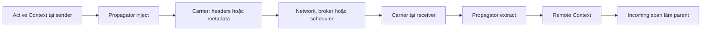
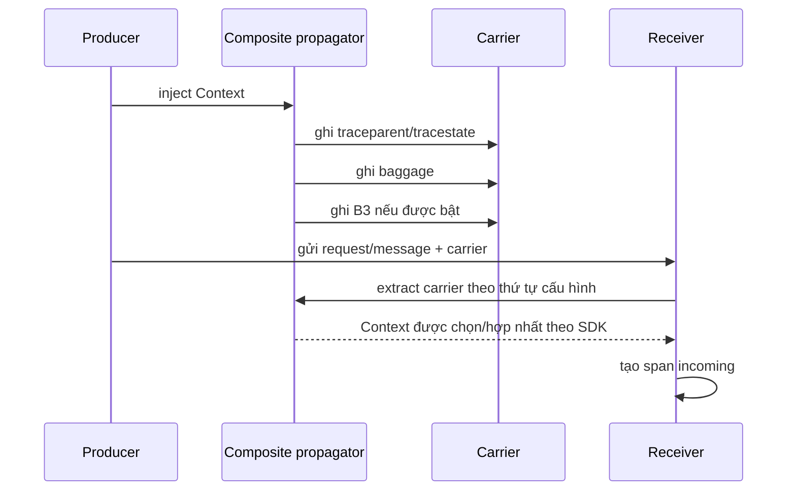
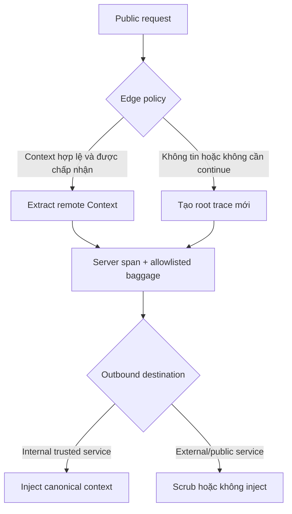
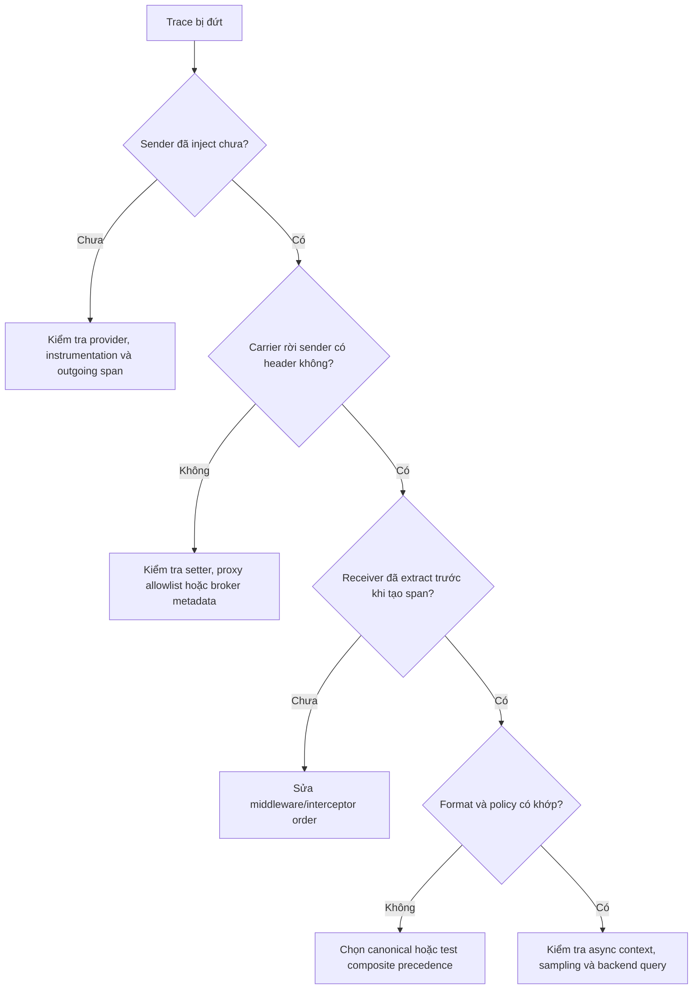

import { Step, Steps } from 'fumadocs-ui/components/steps';

<Callout type="info" title="Phạm vi của bài">
  Propagator là phần chuyển `Context` thành dữ liệu trong một **carrier** ở phía
  gửi và đọc carrier đó ở phía nhận. Bài này tập trung vào cấu hình và vận hành
  propagation trong production: W3C Trace Context, Baggage, composite propagator,
  trust boundary, async context và cách kiểm thử parent relation. Các API trong
  ví dụ là pseudocode portable; tên package và cách đăng ký có thể khác theo
  ngôn ngữ. Xem [Context propagation](/fundamentals/context-propagation/) để ôn
  mental model cơ bản, và [API và SDK](/instrumentation/api-sdk/) để hiểu provider
  và lifecycle của SDK.
</Callout>

## Mục lục

- [Propagator giải quyết vấn đề gì](#propagator-giải-quyết-vấn-đề-gì)
  - [Context và carrier](#context-và-carrier)
  - [Inject và extract](#inject-và-extract)
- [W3C Trace Context và Baggage](#w3c-trace-context-và-baggage)
  - [Header `traceparent`](#header-traceparent)
  - [`tracestate`](#tracestate)
  - [W3C Baggage](#w3c-baggage)
- [Composite propagator và thứ tự](#composite-propagator-và-thứ-tự)
- [Cấu hình bằng `OTEL_PROPAGATORS`](#cấu-hình-bằng-otelpropagators)
  - [Giá trị chuẩn](#giá-trị-chuẩn)
  - [Chọn một format canonical](#chọn-một-format-canonical)
- [Propagation theo loại boundary](#propagation-theo-loại-boundary)
  - [HTTP](#http)
  - [RPC](#rpc)
  - [Message queue và event bus](#message-queue-và-event-bus)
  - [Custom carrier](#custom-carrier)
- [Trust boundary và public traffic](#trust-boundary-và-public-traffic)
  - [Inbound context](#inbound-context)
  - [Outbound context](#outbound-context)
  - [Baggage, PII và giới hạn header](#baggage-pii-và-giới-hạn-header)
- [Interoperability với B3 và Jaeger](#interoperability-với-b3-và-jaeger)
- [Duplicate, mismatch và migration](#duplicate-mismatch-và-migration)
- [Async context và tác vụ detached](#async-context-và-tác-vụ-detached)
- [Pseudocode cho custom boundary](#pseudocode-cho-custom-boundary)
  - [Producer: inject](#producer-inject)
  - [Consumer: extract](#consumer-extract)
- [Kiểm thử propagation](#kiểm-thử-propagation)
  - [Test parent relation](#test-parent-relation)
  - [Test carrier và policy](#test-carrier-và-policy)
- [Troubleshooting broken traces](#troubleshooting-broken-traces)
- [Production checklist](#production-checklist)
- [Bài liên quan](#bài-liên-quan)

## Propagator giải quyết vấn đề gì

**Context** là trạng thái gắn với execution hiện tại. Trong tracing, context thường
chứa `SpanContext` gồm `trace_id`, `span_id`, trace flags, `tracestate` và trạng
thái remote; nó cũng có thể chứa Baggage. **Propagator** biết cách serialize phần
context cần truyền vào carrier và deserialize nó ở process khác.

**Carrier** là nơi chứa metadata khi đi qua boundary. HTTP headers, RPC metadata,
message properties và job envelope đều có thể là carrier. Carrier không phải là
Context. Carrier là dữ liệu vận chuyển; Context là object bất biến được runtime dùng
trong execution hiện tại.



Instrumentation library của HTTP client/server, RPC hoặc messaging thường tự làm
hai thao tác này. Chỉ viết propagation thủ công khi protocol hoặc thư viện transport
chưa có hỗ trợ. Nếu tự làm một boundary đã được instrumentation quản lý, bạn có thể
tạo duplicate spans, inject hai lần hoặc làm parent bị ghi đè.

<Callout type="warn" title="Propagation không phải cơ chế bảo mật">
  `traceparent` hợp lệ chỉ nói rằng một context có thể được dùng để liên kết trace.
  Nó không chứng minh caller đã đăng nhập, được cấp quyền hay là hệ thống nội bộ.
  Luôn thực hiện authentication và authorization bằng cơ chế riêng.
</Callout>

### Context và carrier

Context nên được xem là immutable. Thao tác thêm span hoặc baggage tạo Context mới
thay vì sửa object đang được các execution khác dùng chung. Runtime có thể lưu
Context implicit theo thread, async task hoặc execution-local storage; instrumentation
không nên tự duy trì một biến global chứa trace ID hiện tại.

Carrier nên có một abstraction getter/setter thay vì ép mọi transport thành object
HTTP. Propagator cần biết cách đọc và ghi các key header, nhưng không nên biết payload
nghiệp vụ. Ví dụ carrier có thể là:

| Boundary | Carrier thường gặp | Đặc điểm cần kiểm tra |
| --- | --- | --- |
| HTTP | Request/response headers | Header name có thể không phân biệt hoa thường; proxy có thể strip hoặc merge |
| RPC | Metadata hoặc metadata map | Quy tắc binary metadata, lowercase key và interceptor của framework |
| Message queue | Message headers/properties | Metadata phải đi cùng message; batch có thể có nhiều producer context |
| Job scheduler | Job envelope hoặc task metadata | Context phải được capture lúc schedule và extract lúc worker nhận |
| Custom protocol | Map hoặc record metadata riêng | Có chỗ dành riêng cho metadata; validate trước khi parse payload |

Carrier cần tồn tại trong suốt thời điểm inject hoặc extract. Không serialize cả
object Context, không đặt object tùy ý vào header và không dùng payload field nghiệp
vụ làm nơi chứa trace context nếu receiver không có contract rõ ràng.

### Inject và extract

Phía gửi lấy Context hiện tại và gọi `inject`. Nếu có outgoing span, outgoing span
phải được tạo và activate **trước** khi inject, để downstream nhận span đó làm parent.
Phía nhận gọi `extract` **trước** khi tạo incoming span. Trình tự tối thiểu là:

<Steps>
<Step>

**1. Tạo outgoing span nếu boundary cần span**

HTTP/RPC client thường dùng `CLIENT`; publisher hoặc scheduler thường dùng
`PRODUCER`. Span này có parent là active Context hiện tại.

</Step>
<Step>

**2. Inject Context vào carrier**

Chạy propagator với Context đang active và getter/setter của carrier. Sau đó mới
gửi request, RPC hoặc message.

</Step>
<Step>

**3. Extract ở receiver**

Đọc carrier qua propagator. Kết quả là Context có remote `SpanContext` nếu dữ liệu
hợp lệ và được policy chấp nhận.

</Step>
<Step>

**4. Tạo và activate incoming span**

Tạo `SERVER` hoặc `CONSUMER` span với remote Context làm parent, hoặc dùng links
theo messaging convention. Chạy handler trong Context mới rồi restore và end span.

</Step>
</Steps>

```text
// Không phải code cụ thể của một SDK.
outgoing = tracer.start_span("orders.publish", parent=current_context())
with context.run(outgoing):
    propagator.inject(current_context(), carrier, setter)
    transport.send(message, carrier)

remote = propagator.extract(base_context, carrier, getter)
incoming = tracer.start_span("orders.process", parent=remote, kind=CONSUMER)
with context.run(incoming):
    handle(message)
incoming.end()
```

Inject/extract không nhất thiết tạo span. Chúng chỉ truyền context. Việc tạo span,
activate, record và end vẫn thuộc lifecycle của instrumentation hoặc application.

## W3C Trace Context và Baggage

OpenTelemetry mặc định dùng các header của W3C Trace Context cho trace propagation.
Theo chuẩn environment variables của OpenTelemetry, cấu hình mặc định phổ biến của
`OTEL_PROPAGATORS` là `tracecontext,baggage`. Cả hai format phục vụ mục đích khác
nhau và không nên trộn khái niệm của chúng.

### Header `traceparent`

`traceparent` có dạng tổng quát:

```text
version-trace-id-parent-id-trace-flags
```

Một giá trị hợp lệ thường có dạng:

```text
00-4bf92f3577b34da6a3ce929d0e0e4736-00f067aa0ba902b7-01
```

| Phần | Ý nghĩa | Quy tắc vận hành |
| --- | --- | --- |
| `version` | Version của format, hiện thường là `00` | Không tự nâng hoặc nối chuỗi version |
| `trace-id` | Định danh 16-byte của trace, biểu diễn bằng 32 hex ký tự | Không được toàn số 0 |
| `parent-id` | Span ID 8-byte của sender, 16 hex ký tự | Không được toàn số 0; receiver dùng làm remote parent |
| `trace-flags` | Các cờ của trace, trong đó bit sampled là quan trọng nhất | Không coi sampled là quyền truy cập hoặc cam kết backend sẽ giữ span |

Receiver không nên tự parse rồi ghép ID bằng string manipulation. Propagator phải
validate định dạng, tạo `SpanContext` remote và xử lý giá trị không hợp lệ theo
quy tắc của SDK. Context không hợp lệ thường khiến receiver bắt đầu root trace mới;
đó là lý do cần kiểm tra header trên wire khi trace bị đứt.

### `tracestate`

`tracestate` mang các key-value vendor-specific đi cùng `traceparent`. Nó cho phép
nhiều hệ thống tracing trao đổi state bổ sung mà không biến `traceparent` thành
format riêng của vendor.

Application code thường **không cần đọc hoặc sửa** `tracestate`. Hãy để propagator và
SDK parse, validate, forward hoặc cập nhật state theo chuẩn. Nếu request đi qua một
trust boundary, policy có thể loại bỏ `tracestate` hoặc không forward nó tới hệ thống
không tin cậy. Không log nguyên giá trị này ở production nếu nó có thể chứa thông tin
nội bộ theo implementation của vendor.

### W3C Baggage

Baggage là danh sách key-value được truyền độc lập với trace parent. Ví dụ có thể là
`tenant.region=eu-west` hoặc một routing hint đã được allowlist. Baggage không tạo
parent-child relation và không thay thế span attributes.

Baggage dễ lan xa hơn dự kiến: một service nhận nó có thể forward sang nhiều
 downstream service. Vì vậy:

- chỉ cho phép key đã đăng ký, chẳng hạn `tenant.region`, không forward mọi key;
- giới hạn số item, độ dài key, độ dài value và tổng kích thước header;
- encode/decode theo propagator, không tự nối chuỗi hoặc tự URL-decode nhiều lần;
- không đặt password, API key, JWT, cookie, session token hoặc PII vào baggage;
- không copy toàn bộ baggage vào span attributes, metrics hoặc logs;
- xóa hoặc scrub baggage trước outbound call tới external service nếu không có
  contract chia sẻ rõ ràng.

<Callout type="error" title="Baggage là input có thể bị giả mạo">
  Caller bên ngoài có thể gửi baggage tùy ý. Không dùng `tenant.id` từ baggage để
  quyết định authorization, truy cập database hoặc chọn secret. Nếu cần tenant
  identity đáng tin cậy, lấy nó từ identity đã xác thực rồi kiểm tra nhất quán với
  baggage như một tín hiệu phụ, không phải nguồn sự thật.
</Callout>

## Composite propagator và thứ tự

**Composite propagator** là một propagator kết hợp nhiều format. Khi inject, các
thành phần thường cùng ghi format của mình vào carrier. Khi extract, các thành phần
được gọi theo thứ tự cấu hình và cùng góp phần xây dựng Context theo behavior của
SDK/ngôn ngữ.

Ví dụ một hệ thống đang chuyển từ B3 sang W3C có thể tạm cấu hình:

```text
composite = [tracecontext, baggage, b3]
```

Thứ tự không chỉ là chi tiết thẩm mỹ:

1. Khi nhiều format cùng xuất hiện, các propagator có thể đọc cùng một carrier và
   tạo ra kết quả xung đột.
2. Precedence cụ thể khi extract có thể phụ thuộc implementation của SDK, vì vậy
   không nên dựa vào một thứ tự “ngầm hiểu” nếu chưa test runtime đang dùng.
3. Khi inject, nhiều bộ header làm tăng kích thước request và có thể vượt giới hạn
   của proxy hoặc broker.
4. Format legacy có thể không thể biểu diễn đầy đủ `tracestate` hoặc baggage.

Cách an toàn là chọn một format canonical cho đường đi mới, dùng composite chỉ trong
thời kỳ interoperability có thời hạn, và viết contract test cho trường hợp carrier
chứa đồng thời hai format. Không dùng composite để che giấu việc các service đang
cấu hình khác nhau.



<Callout type="warn" title="Một canonical format giúp giảm rủi ro">
  Đừng bật `tracecontext`, `b3`, `b3multi` và `jaeger` vô thời hạn chỉ vì muốn “hỗ
  trợ mọi thứ”. Hãy đo kích thước header, chọn owner cho migration và đặt ngày gỡ
  format cũ. Mọi thứ tự composite phải được kiểm chứng bằng integration test của
  chính các SDK và proxy trong hệ thống.
</Callout>

## Cấu hình bằng `OTEL_PROPAGATORS`

`OTEL_PROPAGATORS` là danh sách propagator phân tách bằng dấu phẩy. SDK hoặc thành
phần autoconfiguration phải hỗ trợ biến này thì biến mới có hiệu lực; API/SDK không
phải ngôn ngữ nào cũng tự động đọc environment theo cùng cách. Luôn kiểm tra tài
liệu của runtime và log cấu hình lúc startup.

Ví dụ:

```bash
# Mặc định phổ biến: W3C Trace Context + W3C Baggage
OTEL_PROPAGATORS=tracecontext,baggage

# Tạm thời hỗ trợ thêm B3 trong giai đoạn migration
OTEL_PROPAGATORS=tracecontext,baggage,b3

# Không tự động đăng ký propagator
OTEL_PROPAGATORS=none
```

Danh sách nên được cấu hình ở process boundary, không để từng instrumentation
library tự chọn một bộ khác. Nếu có `OTEL_CONFIG_FILE` hoặc cơ chế cấu hình declarative
của runtime, hãy kiểm tra precedence: specification hiện hành quy định file cấu hình
có thể được ưu tiên hơn các environment variable còn lại.

### Giá trị chuẩn

Theo Environment Variable Specification, các giá trị được biết đến gồm:

| Giá trị | Format | Tình trạng và lưu ý |
| --- | --- | --- |
| `tracecontext` | W3C Trace Context | Lựa chọn canonical phổ biến cho trace |
| `baggage` | W3C Baggage | Chỉ dùng cho key-value đã allowlist |
| `b3` | B3 Single | Interoperability với hệ thống Zipkin/Brave hoặc tương tự |
| `b3multi` | B3 Multi | Interoperability dạng nhiều header B3 |
| `jaeger` | Jaeger propagation | Deprecated trong danh sách chuẩn; chỉ bật khi legacy contract bắt buộc |
| `xray` | AWS X-Ray | Third-party; cần SDK/runtime hỗ trợ |
| `ottrace` | OT Trace | Third-party và deprecated; tránh cho thiết kế mới |
| `none` | Không tự động cấu hình | Hữu ích khi application tự đăng ký hoặc muốn tắt propagation tự động |

Tên có thể được SDK mở rộng, nhưng không nên suy ra rằng mọi SDK hỗ trợ mọi giá
trị. Environment specification yêu cầu các giá trị trong danh sách được deduplicate
để một propagator không bị đăng ký nhiều lần. Một giá trị không nhận biết nên tạo
warning và được xử lý theo behavior của implementation; đừng coi startup “không
crash” là bằng chứng cấu hình đúng.

### Chọn một format canonical

Dùng bảng quyết định sau:

| Tình huống | Cấu hình khuyến nghị |
| --- | --- |
| Toàn bộ hệ thống mới hoặc đã đồng nhất | `tracecontext,baggage` |
| Đang migrate từ B3 | `tracecontext,baggage,b3` trong thời hạn rõ ràng; test cả chiều vào và ra |
| Chỉ giao tiếp với legacy Jaeger | Bật `jaeger` ở boundary cần thiết, lập kế hoạch thay thế vì giá trị đã deprecated |
| Public ingress không cần tiếp tục trace bên ngoài | Policy edge bỏ remote context; có thể giữ propagator cho internal hops sau khi tạo root mới |
| Custom runtime tự quản lý propagator | `none` nếu implementation thực sự không muốn autoconfiguration, rồi đăng ký explicit |

Đừng đặt `OTEL_PROPAGATORS=none` để “tắt tracing” mà quên rằng nó chỉ liên quan
propagation. Environment specification nói `OTEL_SDK_DISABLED=true` không tác động
đến propagators được cấu hình qua `OTEL_PROPAGATORS`; các khái niệm này phải được
quản lý riêng.

## Propagation theo loại boundary

Mỗi transport có carrier và lifecycle khác nhau, nhưng quy tắc cốt lõi không đổi:
outgoing span → inject → gửi; nhận → extract → incoming span. Hãy ưu tiên
instrumentation native của framework trước custom hook.

### HTTP

Với HTTP client, inject vào request headers sau khi `CLIENT` span được activate.
Với HTTP server, framework instrumentation thường extract từ request headers rồi
làm server span active trước khi gọi handler.

Kiểm tra các điểm sau:

- proxy, ingress hoặc service mesh có preserve `traceparent`, `tracestate` và
  baggage không;
- middleware có chạy đúng thứ tự, extract trước route handler và không tạo server
  span thứ hai không;
- header name có bị lowercase, merge hoặc cắt bởi proxy không;
- outbound call tới public API có cần scrub context nội bộ không;
- retry của HTTP client tạo một span logical hay một span cho từng network attempt
  theo instrumentation đã chọn.

Không truyền context bằng query string hoặc body nếu HTTP header đã có contract.
Nếu một gateway chỉ allow một số header, thêm W3C headers vào allowlist ở cả hai
chiều và kiểm tra giới hạn header của gateway.

### RPC

RPC metadata thường được xử lý bằng interceptor. Interceptor client tạo/activate
outgoing span và inject vào metadata; interceptor server extract metadata và tạo
incoming span trước khi dispatch method.

RPC có thể có binary metadata. Dùng getter/setter mà SDK hoặc framework yêu cầu,
không ép bytes thành chuỗi tùy tiện. Đảm bảo metadata propagation không bị bỏ qua
khi dùng streaming, bidi stream, connection pool hoặc retry interceptor.

Tên method và service nên ổn định, chẳng hạn `/catalog.Product/GetProduct`. Không
đưa request ID động vào span name hoặc metadata propagation. Nếu RPC chạy qua nhiều
interceptor, ghi rõ interceptor nào sở hữu inject/extract và test thứ tự đăng ký.

### Message queue và event bus

Message carrier thường là map headers hoặc properties. Producer inject context vào
message trước publish; consumer extract khi nhận message. Message queue khác HTTP ở
chỗ producer và consumer có thể chạy cách nhau lâu, retry nhiều lần hoặc xử lý batch.

| Mô hình | Quan hệ nên kiểm tra |
| --- | --- |
| Một message, một consumer | Consumer span có parent producer context theo convention của messaging |
| Một message được nhiều consumer xử lý | Mỗi consumer tạo span riêng; không dùng chung span object giữa process |
| Batch từ nhiều message | Không chọn một parent rồi làm mất các nguồn; dùng links theo convention/runtime |
| Redelivery/retry | Phân biệt logical processing span và attempt span; tránh tạo trace mới ngoài ý muốn |
| Message chứa dữ liệu public/untrusted | Validate context, giới hạn metadata và không tin baggage cho authorization |

Context phải được copy cùng message. Đừng giữ một mutable carrier object rồi sửa nó
cho message tiếp theo; lỗi này có thể làm message khác nhận nhầm parent. Với broker
không có metadata field, tạo envelope riêng có schema version và policy rõ ràng; không
lẫn metadata tracing vào payload domain một cách không tương thích.

### Custom carrier

Custom carrier có thể là record job, map của protocol nội bộ hoặc metadata trong
scheduler. Carrier cần một field metadata riêng, getter/setter deterministic và
kiểm thử round-trip. Nếu protocol không có metadata field, receiver phải extract và
loại bỏ phần metadata trước khi parse payload để tránh undefined behavior.

Một custom carrier production nên xác định trước:

- key nào được phép (`traceparent`, `tracestate`, `baggage` hoặc format legacy);
- encoding, case sensitivity và cách biểu diễn nhiều giá trị;
- giới hạn từng value và tổng metadata;
- behavior khi value lỗi, quá dài hoặc lặp key;
- trust policy inbound/outbound;
- schema version và backward compatibility khi worker được deploy lệch phiên bản.

## Trust boundary và public traffic

Propagation là dữ liệu đi qua process và network. Hãy phân loại boundary trước khi
bật propagator, thay vì forward mọi header theo mặc định.



### Inbound context

Ở internal trusted network, service thường accept một `traceparent` hợp lệ làm
remote parent để trace liên tục. “Trusted” ở đây chỉ là policy về khả năng chấp
nhận correlation context; nó không thay cho network authentication.

Ở public ingress hoặc cross-tenant ingress, có ba lựa chọn cần được quyết định bằng
policy:

1. **Continue remote trace sau validation:** phù hợp khi muốn khách hàng hoặc gateway
   theo dõi cùng trace. Phải giới hạn header, sanitize baggage và chấp nhận rằng
   caller có thể ảnh hưởng trace topology.
2. **Start root trace mới:** phù hợp khi không muốn external caller quyết định parent
   hoặc sampling context. Có thể lưu thông tin correlation bên ngoài bằng cơ chế
   được kiểm soát, nhưng không dùng header đó cho authorization.
3. **Không nhận propagation ở boundary:** phù hợp với endpoint không cần distributed
   tracing. Strip hoặc bỏ qua context trước khi vào application và không forward nó.

Không ghi lỗi parse chi tiết kèm toàn bộ header vào response. Tạo metric/diagnostic
đã redact như `propagation.invalid_header=true` nếu cần theo dõi chất lượng traffic.

### Outbound context

Đừng inject context nội bộ vào mọi outbound request chỉ vì client instrumentation
đang bật. Với internal service đã có contract, inject W3C canonical format và
allowlisted baggage. Với external SaaS, vendor API hoặc public endpoint:

- xác định vendor có hỗ trợ format nào và có thực sự cần trace correlation không;
- không forward baggage nội bộ mặc định;
- cân nhắc strip `tracestate` và context khi trace nội bộ không nên lộ ra ngoài;
- dùng allowlist theo destination, không chỉ allowlist theo process;
- ghi lại policy để thay đổi không phụ thuộc vào một developer nhớ cấu hình.

Nếu external service trả callback vào hệ thống, xử lý callback như inbound
untrusted traffic. Không tin rằng context bạn đã inject sẽ quay lại nguyên vẹn hoặc
được vendor bảo vệ.

### Baggage, PII và giới hạn header

Có ba lớp giới hạn cần phân biệt:

| Lớp | Ví dụ | Ai chịu trách nhiệm |
| --- | --- | --- |
| Carrier/protocol | Tổng HTTP header bytes, số metadata entries, message property size | Proxy, framework, broker và application boundary |
| Propagator policy | Allowlist key, số baggage item, độ dài key/value, destination policy | Application hoặc wrapper quanh propagator |
| Telemetry record | Span attribute/event/link limits | SDK span limits và pipeline |

`OTEL_ATTRIBUTE_VALUE_LENGTH_LIMIT` hoặc `OTEL_SPAN_ATTRIBUTE_COUNT_LIMIT` là giới
hạn telemetry record. Chúng **không tự động giới hạn** kích thước `traceparent`,
`tracestate` hoặc Baggage trong request header. Carrier phải có giới hạn riêng ở
proxy/framework/application.

Baggage nên được lọc tại source trước khi inject:

```text
allowed = {"tenant.region", "request.class"}
filtered = baggage.keep_keys(allowed)
filtered = filtered.limit_items(8).limit_value_length(128)
propagator.inject(context.with_baggage(filtered), carrier, setter)
```

Giới hạn là defense in depth, không phải giấy phép ghi PII. Xác định data owner,
retention và redaction trước khi cho phép một key baggage mới. Không log raw carrier
trong production; nếu debug bắt buộc, redact `traceparent`, `tracestate`, Baggage,
token và cookie theo policy.

## Interoperability với B3 và Jaeger

B3 và Jaeger là các format propagation khác W3C. Ở mức khái niệm:

- **B3 Single** thường mang thông tin trong một header như `b3`.
- **B3 Multi** tách thông tin thành các header `X-B3-*`.
- **Jaeger propagation** dùng các header/format theo hệ sinh thái Jaeger cũ.
- W3C `traceparent`/`tracestate` là lựa chọn canonical phổ biến hiện nay.

Interop không có nghĩa là các format luôn chuyển đổi hoàn hảo. Vendor state, flags,
validity rule và baggage có thể khác. Khi một service W3C gọi service B3, composite
propagator có thể inject cả hai nếu contract yêu cầu. Khi nhận cả hai, phải test
precedence và xử lý mismatch; không đoán bằng việc nhìn một header ngẫu nhiên.

Jaeger nằm trong danh sách giá trị known của `OTEL_PROPAGATORS` nhưng đã được đánh
dấu deprecated trong Environment Variable Specification. Chỉ dùng nó ở legacy
boundary có owner và kế hoạch migration. Không thiết kế hệ thống mới phụ thuộc vào
Jaeger propagator chỉ vì backend Jaeger có thể nhận OTLP hoặc hiển thị trace.

Migration nên diễn ra theo các bước:

1. inventory service, gateway, SDK version và format đang phát/nhận;
2. chọn W3C làm canonical contract cho traffic mới;
3. bật composite có thời hạn ở boundary legacy;
4. đo tỷ lệ request còn cần B3/Jaeger và test carrier có cả hai format;
5. chuyển từng consumer/producer, rồi bỏ format cũ khỏi `OTEL_PROPAGATORS`;
6. giữ dashboard và alert để phát hiện trace fragmentation sau khi tắt.

## Duplicate, mismatch và migration

Duplicate xảy ra khi cùng một boundary có hai lớp inject/extract hoặc hai
instrumentation library cùng sở hữu span. Mismatch xảy ra khi sender và receiver
không dùng format chung, hoặc cùng dùng composite nhưng policy/precedence khác nhau.

| Dấu hiệu | Nguyên nhân khả dĩ | Cách xử lý |
| --- | --- | --- |
| Hai bộ `traceparent`/B3 được gửi | Composite đang bật nhiều format | Có chủ đích trong migration thì giữ; nếu không, chọn canonical format |
| Hai server span cho một request | Framework và manual middleware cùng extract/tạo span | Chọn một owner, bỏ wrapper hoặc dùng hook enrich |
| Downstream thành sibling | Inject trước khi outgoing span active | Tạo outgoing span, activate rồi inject current Context |
| Trace ID đúng nhưng parent ID sai | Carrier có conflict hoặc extract sau span creation | Test thứ tự composite, tắt format xung đột, kiểm tra wire data |
| Một hop tạo trace mới | Header bị strip, invalid hoặc SDK không đăng ký propagator | Capture carrier ở hai phía và xem startup configuration |
| Baggage bị nhân bản | Inject lặp hoặc append header thay vì set/replace | Xác định một lần inject và semantics setter của carrier |
| Chỉ một số route bị đứt | Middleware order hoặc gateway allowlist không đồng nhất | So sánh route fixture và bypass proxy để khoanh boundary |

Không sửa duplicate bằng cách lọc span ở backend như giải pháp đầu tiên. Chi phí
CPU, network và storage đã phát sinh. Hãy sửa ownership và test output ngay tại
application. Đối với mismatch, kiểm tra bốn điểm: format được inject, header đến
proxy, header rời proxy và format được receiver extract.

## Async context và tác vụ detached

Propagation qua network không phải là cách duy nhất làm mất trace. Trong cùng
process, Context có thể mất khi callback chạy trên thread pool, task queue,
Promise chain hoặc scheduler không tự hỗ trợ context.

Capture **toàn bộ Context** tại điểm schedule và restore nó khi callback thực thi:

```text
captured = context.current()
scheduler.submit(() => context.run(captured, () => process(item)))
```

Không chỉ capture một `trace_id` string. Parent span, span flags, `tracestate` và
Baggage đều có thể cần cho execution. Cũng không lưu Context vào biến global hoặc
reuse một Context mutable cho nhiều task.

Tác vụ detached cần policy lifecycle riêng:

- Nếu request chờ task, giữ Context qua `await` và end span khi task hoàn tất.
- Nếu worker nhận một job độc lập, serialize context vào job carrier và extract ở
  consumer boundary.
- Nếu task sống lâu hơn request hoặc tạo một workflow mới, tạo trace mới và dùng
  link tới scheduling span thay vì giữ một parent đã kết thúc quá lâu.
- Luôn restore Context trong `finally`, kể cả khi callback throw, timeout hoặc
  cancellation.

<Callout type="idea" title="Kiểm tra context leak bằng concurrency test">
  Chạy đồng thời hai request với hai parent khác nhau và cho callback hoàn tất theo
  thứ tự đảo ngược. Nếu callback của request A có span hoặc baggage của request B,
  executor wrapper đang capture/restore sai.
</Callout>

## Pseudocode cho custom boundary

Ví dụ này mô tả một job bus chưa có instrumentation. `carrier` là metadata của job,
không phải payload; `setter` và `getter` là adapter cho map của job bus.

### Producer: inject

```text
function enqueueJob(payload):
    parent = context.current()
    producer = tracer.start_span(
        name = "orders.enqueue",
        kind = PRODUCER,
        parent_context = parent
    )

    token = context.attach(context.with_span(producer))
    try:
        carrier = new JobMetadata()
        carrier.set("schema.version", "1")

        // Lọc baggage trước khi cho phép rời process.
        safe_context = context.with_baggage(
            context.baggage().keep_keys({"tenant.region"})
        )
        propagator.inject(safe_context, carrier, setter)

        job_bus.publish(payload, carrier)
        producer.set_status(UNSET)
    catch error:
        producer.record_exception(error)
        producer.set_status(ERROR, "publish failed")
        throw error
    finally:
        context.detach(token)
        producer.end()
```

Điểm quan trọng là `producer` đã active khi inject. `schema.version` của envelope
là metadata của application, không phải một phần W3C context; receiver phải validate
nó theo contract riêng.

### Consumer: extract

```text
function consumeJob(payload, carrier):
    // Carrier có thể đến từ producer không tin cậy; propagator phải validate.
    remote = propagator.extract(
        base_context = context.root(),
        carrier = carrier,
        getter = getter
    )

    consumer = tracer.start_span(
        name = "orders.process",
        kind = CONSUMER,
        parent_context = remote
    )
    token = context.attach(context.with_span(consumer))
    try:
        handle_job(payload)
    catch error:
        consumer.record_exception(error)
        consumer.set_status(ERROR, "process failed")
        throw error
    finally:
        context.detach(token)
        consumer.end()
```

Ở code thật, dùng context manager hoặc callback API idiomatic của SDK nếu có. Với
batch nhiều messages, không copy ví dụ này một cách máy móc: xác định parent/link
theo messaging semantic conventions và topology của broker.

## Kiểm thử propagation

Propagation cần được kiểm thử như một contract giữa hai process. Test “request không
throw” là chưa đủ; phải chứng minh trace ID, span ID và parent relation.

### Test parent relation

Một test tối thiểu dùng in-memory exporter hoặc test span processor:

<Steps>
<Step>

**1. Tạo parent đã biết**

Tạo một span producer/client với `trace_id` và `span_id` cố định hoặc có thể đọc
được sau export. Activate span trước khi inject.

</Step>
<Step>

**2. Round-trip qua carrier**

Inject vào carrier mới. Truyền carrier tới receiver test rồi extract bằng đúng
getter. Không lấy Context trực tiếp từ process sender để giả lập receiver.

</Step>

<Step>

**3. Tạo incoming span**

Tạo server/consumer span từ Context extract được. Chạy handler trong Context
incoming rồi end mọi span và flush test exporter.

</Step>

<Step>

**4. Assert quan hệ**

Assert incoming `trace_id` bằng producer `trace_id`, incoming `span_id` khác
producer `span_id`, `parent_span_id` bằng producer `span_id` và `is_remote=true`
trên extracted SpanContext nếu SDK expose thuộc tính này.

</Step>
</Steps>

```text
assert received.trace_id == sent.trace_id
assert received.span_id != sent.span_id
assert received.parent_span_id == sent.span_id
assert received.parent_is_remote == true
assert context.current() == context_before_handler_after_restore
```

Test thêm trường hợp carrier thiếu header, header sai format, header quá dài, baggage
có key bị cấm, hai format cùng tồn tại và remote context bị policy public edge từ
chối. Kỳ vọng rõ ràng là root mới hay span được tạo từ remote parent; đừng assert
một behavior ngẫu nhiên do SDK chưa được cấu hình.

### Test carrier và policy

Carrier test cần kiểm tra cả serialization và policy:

| Test case | Kết quả cần assert |
| --- | --- |
| HTTP header chuẩn | `traceparent`, `tracestate` và baggage round-trip không đổi ngoài biến đổi chuẩn |
| RPC metadata binary | Getter/setter giữ đúng encoding và không cắt bytes |
| Message copy | Mỗi message có metadata riêng, không rò parent của message trước |
| Invalid context | Không làm handler crash; behavior root/ignore theo policy và có diagnostic đã redact |
| Header quá giới hạn | Bị reject, truncate theo contract hoặc bỏ qua có chủ đích; không làm process OOM |
| Baggage ngoài allowlist | Không được inject outbound và không xuất hiện trong telemetry ngoài policy |
| Composite conflict | Precedence được ghi trong test, không phụ thuộc thứ tự tình cờ |
| Async concurrency | Hai task giữ đúng Context riêng và restore sau callback |
| Duplicate instrumentation | Một boundary chỉ có owner/span dự kiến, metric không double count |

Dùng test transport thật trong integration test để bao phủ proxy, broker hoặc
interceptor. Có thể dùng Collector debug exporter ở môi trường test để kiểm tra
payload gần wire. Không gửi fake secret hoặc dữ liệu production vào debug output.

## Troubleshooting broken traces

Khi trace bị đứt, bắt đầu từ boundary đầu tiên có trace ID hoặc parent ID khác mong
đợi. Đừng sửa sampler hay dashboard trước khi biết header đã đi qua wire.



| Triệu chứng | Kiểm tra đầu tiên | Hướng xử lý |
| --- | --- | --- |
| Mỗi service là một trace | Capture outbound/inbound `traceparent` | Kiểm tra header bị strip, `OTEL_PROPAGATORS`, SDK bootstrap và format mismatch |
| Trace ID đúng nhưng parent sai | Export span IDs và thứ tự middleware | Extract trước incoming span; inject sau khi outgoing span active; test composite conflict |
| Trace mất chỉ qua queue | Inspect message headers/properties | Copy carrier cùng message, không reuse mutable metadata, xử lý batch theo convention |
| Trace mất ngẫu nhiên ở async | Chạy hai request đồng thời với completion đảo thứ tự | Capture full Context khi schedule và restore trong callback |
| Baggage không tới downstream | Kiểm tra allowlist, setter và composite | Bật `baggage` có chủ đích; không nhầm Baggage với `traceparent` |
| Header quá lớn hoặc proxy trả 4xx | Đo raw carrier bytes và số key | Giảm baggage, bỏ legacy format, đặt header limits và allowlist theo destination |
| Thấy B3 nhưng receiver chỉ đọc W3C | So sánh sender/receiver config | Dùng W3C canonical hoặc composite migration có test và expiry date |
| Có hai server/client span | Xem instrumentation scope và start/end time | Chọn một owner; tắt hook trùng hoặc enrich span hiện có |
| Span có vẻ đúng nhưng không thấy backend | Kiểm tra in-memory/debug exporter trước | Kiểm tra sampling, batch flush, exporter, Collector filter và retention |
| Context từ public request điều khiển trace nội bộ | Kiểm tra edge policy | Sanitize/ignore remote context hoặc tạo root mới; không dùng trace context cho auth |

Khi debug header, chỉ log tên key, độ dài và kết quả validation. Redact giá trị
header trong log production. Với broken traces liên quan retry, kiểm tra từng attempt
và logical parent riêng; một retry thành công không có nghĩa attempt lỗi phải bị xóa.

## Production checklist

**Cấu hình và format**

- [ ] `OTEL_PROPAGATORS` được đặt rõ ở process boundary và đã kiểm tra runtime có hỗ trợ.
- [ ] Mặc định hoặc cấu hình canonical là `tracecontext,baggage` nếu hệ thống không
      có yêu cầu legacy.
- [ ] Mỗi giá trị được deduplicate; không bật `none` cùng các propagator khác.
- [ ] B3/Jaeger chỉ bật trong migration hoặc boundary có contract, có owner và ngày gỡ.
- [ ] Composite order và behavior khi carrier chứa format xung đột có integration test.
- [ ] Sender/receiver thống nhất format, encoding và interceptor/middleware order.

**Context và lifecycle**

- [ ] Outgoing span được tạo/activate trước `inject`.
- [ ] Receiver `extract` trước khi tạo incoming span.
- [ ] Context được capture/restore đúng qua async, thread pool, scheduler và worker.
- [ ] Context không được giữ trong global mutable state hoặc reuse giữa messages.
- [ ] Span end đúng một lần trên success, error, cancellation và shutdown.
- [ ] Batch, fan-out, retry và detached work có parent/link model được ghi rõ.

**Trust và dữ liệu**

- [ ] Inbound public context có policy: continue, root mới hoặc ignore.
- [ ] Outbound policy phân biệt internal trusted service và external/public service.
- [ ] `traceparent`/`tracestate` không được dùng cho authentication/authorization.
- [ ] Baggage key được allowlist theo destination, không chứa secret, credential hay PII.
- [ ] Có giới hạn số item, độ dài value và tổng bytes của carrier/header.
- [ ] Header và baggage được redact trước khi log; không log raw carrier production.
- [ ] Carrier limits được cấu hình riêng; không nhầm với span attribute limits.

**Kiểm thử và giám sát**

- [ ] Test round-trip assert trace ID giữ nguyên, span ID mới và parent relation đúng.
- [ ] Test `is_remote`, invalid/oversized header, Baggage allowlist và composite conflict.
- [ ] Test proxy/gateway, RPC interceptor, broker metadata và async concurrency.
- [ ] Traffic fixture chứng minh không duplicate spans hoặc double inject.
- [ ] Có metric/diagnostic đã redact cho invalid, missing hoặc rejected propagation.
- [ ] Có cách xem carrier ở test/debug path mà không làm lộ dữ liệu production.
- [ ] Theo dõi header size, propagation reject, trace fragmentation và export failure.
- [ ] Migration legacy có dashboard, rollback plan và điều kiện kết thúc rõ ràng.

## Bài liên quan

<Cards>
  <Card title="Context propagation" href="/fundamentals/context-propagation/" description="Mental model của Context, traceparent, Baggage và các network boundary." />
  <Card title="API và SDK" href="/instrumentation/api-sdk/" description="Provider, global registration, SDK configuration và lifecycle shutdown." />
  <Card title="Manual instrumentation" href="/instrumentation/manual-instrumentation/" description="Tạo span và giữ active Context qua custom boundary, retry và async work." />
  <Card title="Cấu hình instrumentation" href="/instrumentation/configuration/" description="Resource, exporter, sampler và các thiết lập runtime liên quan." />
</Cards>

Các tên biến môi trường và behavior trong bài dựa trên [OpenTelemetry Environment
Variable Specification](https://opentelemetry.io/docs/specs/otel/configuration/sdk-environment-variables/),
[Context propagation](https://opentelemetry.io/docs/concepts/context-propagation/),
[Context specification](https://opentelemetry.io/docs/specs/otel/context/) và
[W3C Trace Context](https://www.w3.org/TR/trace-context/). SDK ngôn ngữ có thể
khác về cách đăng ký nhưng không nên làm thay đổi contract propagation đã chọn.
