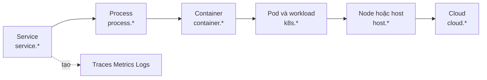
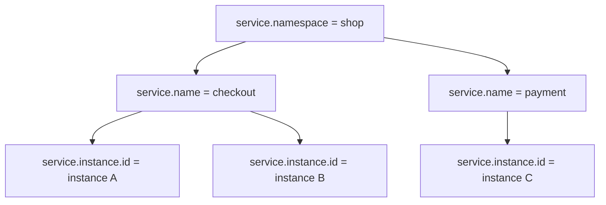
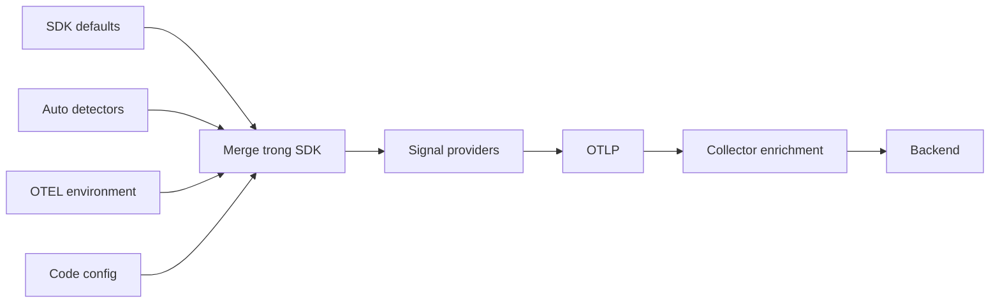

import { Step, Steps } from 'fumadocs-ui/components/steps';

<Callout type="info" title="Ý tưởng cốt lõi">
  **Resource** mô tả entity đang tạo telemetry, chẳng hạn một instance của
  `checkout-service` chạy trong một Pod trên Kubernetes. Resource trả lời
  “dữ liệu này đến từ đâu?”, còn attributes của span, metric hoặc log trả lời
  “operation hay record này có đặc điểm gì?”.
</Callout>

## Mục lục

- [Resource là gì](#resource-là-gì)
  - [Một Resource có thể mô tả nhiều lớp entity](#một-resource-có-thể-mô-tả-nhiều-lớp-entity)
- [Phân biệt các loại metadata](#phân-biệt-các-loại-metadata)
  - [Resource và attributes của record](#resource-và-attributes-của-record)
  - [Resource và instrumentation scope](#resource-và-instrumentation-scope)
  - [Resource và context hoặc baggage](#resource-và-context-hoặc-baggage)
- [Thiết kế định danh service](#thiết-kế-định-danh-service)
  - [Tên và namespace](#tên-và-namespace)
  - [Instance ID](#instance-id)
  - [Version và deployment environment](#version-và-deployment-environment)
- [Resource được tạo và hợp nhất như thế nào](#resource-được-tạo-và-hợp-nhất-như-thế-nào)
  - [Các nguồn metadata](#các-nguồn-metadata)
  - [Quy tắc merge](#quy-tắc-merge)
  - [Precedence cần kiểm chứng](#precedence-cần-kiểm-chứng)
- [Cấu hình Resource](#cấu-hình-resource)
  - [Biến môi trường chuẩn](#biến-môi-trường-chuẩn)
  - [Pseudocode cấu hình SDK](#pseudocode-cấu-hình-sdk)
  - [Dùng cùng Resource cho mọi signal](#dùng-cùng-resource-cho-mọi-signal)
- [Metadata container Kubernetes và cloud](#metadata-container-kubernetes-và-cloud)
  - [Container](#container)
  - [Kubernetes](#kubernetes)
  - [Cloud host và process](#cloud-host-và-process)
  - [Chọn nơi enrich metadata](#chọn-nơi-enrich-metadata)
- [Semantic conventions và schema](#semantic-conventions-và-schema)
  - [Dùng tên chuẩn](#dùng-tên-chuẩn)
  - [Schema URL](#schema-url)
- [Độ ổn định cardinality và dữ liệu nhạy cảm](#độ-ổn-định-cardinality-và-dữ-liệu-nhạy-cảm)
  - [Giữ identity ổn định](#giữ-identity-ổn-định)
  - [Kiểm soát cardinality](#kiểm-soát-cardinality)
  - [Không đưa PII hoặc secret vào Resource](#không-đưa-pii-hoặc-secret-vào-resource)
- [Xác minh Resource end to end](#xác-minh-resource-end-to-end)
  - [1. Tạo một telemetry record dễ tìm](#1-tạo-một-telemetry-record-dễ-tìm)
  - [2. Xem output ngay sau SDK](#2-xem-output-ngay-sau-sdk)
  - [3. Xem output tại Collector](#3-xem-output-tại-collector)
  - [4. Xem Resource trong backend](#4-xem-resource-trong-backend)
  - [5. Kiểm tra cả ba signal](#5-kiểm-tra-cả-ba-signal)
  - [Kiểm tra tại ứng dụng](#kiểm-tra-tại-ứng-dụng)
  - [Kiểm tra bằng Collector debug exporter](#kiểm-tra-bằng-collector-debug-exporter)
  - [Kiểm tra trong backend](#kiểm-tra-trong-backend)
- [Troubleshooting](#troubleshooting)
  - [Thiếu hoặc unknown service](#thiếu-hoặc-unknown-service)
  - [Resource bị ghi đè](#resource-bị-ghi-đè)
  - [Metadata hạ tầng bị thiếu hoặc sai](#metadata-hạ-tầng-bị-thiếu-hoặc-sai)
  - [Các signal mang identity khác nhau](#các-signal-mang-identity-khác-nhau)
- [Checklist production](#checklist-production)
  - [Identity](#identity)
  - [Detection và merge](#detection-và-merge)
  - [Schema và tương thích](#schema-và-tương-thích)
  - [Cost và bảo mật](#cost-và-bảo-mật)
  - [Kiểm chứng vận hành](#kiểm-chứng-vận-hành)
- [Tài liệu liên quan](#tài-liệu-liên-quan)

## Resource là gì

Resource là tập attributes bất biến mô tả **entity được quan sát và đang phát
telemetry**. Entity đó thường là một service instance, nhưng Resource cũng có thể
chứa metadata của process, container, Pod, node hoặc cloud instance nơi service
đang chạy.

Ví dụ sau mô tả một instance của service `checkout`:

```json
{
  "service.namespace": "shop",
  "service.name": "checkout",
  "service.instance.id": "9f4f31f2-2f49-4e73-91a2-8dc886ce42c8",
  "service.version": "2026.03.1",
  "deployment.environment.name": "production",
  "k8s.namespace.name": "commerce",
  "k8s.pod.name": "checkout-7d6f8c9b9c-k2q7m",
  "k8s.pod.uid": "f2c69550-1f50-4f98-920f-70a26f49ef6a",
  "container.id": "3f4c2a...",
  "cloud.region": "asia-southeast1"
}
```

Resource được gắn vào provider khi `TracerProvider`, `MeterProvider` hoặc
`LoggerProvider` được tạo. Theo mô hình SDK, association này không đổi trong
vòng đời provider. Mọi span, metric hoặc log record do provider đó tạo ra đều
mang Resource tương ứng.

Điều này dẫn đến hai quy tắc thực tế:

1. Tạo Resource **trước** khi server hoặc worker bắt đầu nhận việc.
2. Nếu identity thay đổi thật sự, chẳng hạn process được khởi động lại thành một
   instance mới, hãy tạo provider mới trong lifecycle mới. Đừng sửa Resource theo
   từng request.

### Một Resource có thể mô tả nhiều lớp entity

Một Resource không chỉ chứa một “đối tượng”. Nó có thể kết hợp các lớp mô tả có
quan hệ với nhau:



Ví dụ, `service.name` cho biết component logic nào đang chạy. `k8s.pod.uid` cho
biết replica cụ thể nằm ở đâu. `cloud.region` cho biết vùng hạ tầng. Các field này
bổ sung cho nhau; không nên dùng tên Pod thay cho `service.name`.

<Callout type="warn" title="Resource không phải dữ liệu theo request">
  Không đặt `request.id`, `user.id`, URL hiện tại hoặc trạng thái của một order
  vào Resource. Những giá trị đó thay đổi theo operation và thuộc về span, log,
  metric data point hoặc context phù hợp.
</Callout>

## Phân biệt các loại metadata

Cùng là key-value nhưng vị trí của metadata quyết định phạm vi, lifecycle và cách
backend index dữ liệu.

| Loại | Mô tả cái gì | Lifecycle điển hình | Ví dụ |
| --- | --- | --- | --- |
| Resource attribute | Entity tạo telemetry | Toàn bộ vòng đời provider/process | `service.name`, `k8s.pod.uid` |
| Span attribute | Một operation trong trace | Một span | `http.request.method`, `db.operation.name` |
| Metric attribute | Một data point hoặc series | Mỗi measurement/aggregation | `http.response.status_code` |
| Log attribute | Một log record | Một event | `error.type`, `app.order.id` |
| Instrumentation scope | Code/library tạo signal | Theo tracer, meter hoặc logger | tên package, version, schema URL |
| Context hoặc baggage | Execution/request hiện tại | Được truyền qua async/network boundary | active span, routing hint được phép |

### Resource và attributes của record

Giả sử hai request đi vào cùng một process `checkout`:

- Cả hai span dùng chung Resource có `service.name=checkout` và cùng
  `service.instance.id`.
- Span thứ nhất có `http.route=/orders/{order_id}` và status `200`.
- Span thứ hai có cùng route nhưng status `500`.

Nếu đặt status code vào Resource, toàn bộ process sẽ bị mô tả sai như chỉ có một
status. Nếu lặp `service.name` trên từng span attribute, dữ liệu vừa dư thừa vừa có
nguy cơ xung đột với Resource mà backend dùng để nhận diện service.

### Resource và instrumentation scope

**Instrumentation scope** nhận diện thư viện hoặc module đã tạo telemetry. Scope
thường gồm tên, version và tùy chọn schema URL. Ví dụ:

```text
Resource:
  service.name = checkout

Instrumentation scope A:
  name    = opentelemetry.instrumentation.http
  version = 1.2.3

Instrumentation scope B:
  name    = shop.checkout.business
  version = 2026.03.1
```

Cả HTTP instrumentation và business instrumentation chạy trong cùng service nên
chúng dùng cùng Resource. Tuy nhiên, chúng có scope khác nhau vì được tạo bởi hai
library khác nhau.

Không truyền `service.name` vào `getTracer()` hoặc `getMeter()` để thay cho
Resource. Tên tracer/meter nên là tên ổn định của instrumentation package hoặc
module tạo telemetry.

### Resource và context hoặc baggage

Context giữ active span và quan hệ trace cho operation hiện tại. Baggage là
key-value có thể được propagate sang service khác. Resource thì không được truyền
qua request để “đổi identity” của downstream service.

Ví dụ, `checkout` gọi `payment`:

- trace context được truyền để nối hai span vào cùng trace;
- Resource của span client vẫn là `checkout`;
- Resource của span server là `payment`;
- `payment` không sao chép `service.name=checkout` từ baggage hay request header.

## Thiết kế định danh service

Bộ ba `service.namespace`, `service.name` và `service.instance.id` diễn đạt ba cấp
định danh khác nhau. Hãy thiết kế chúng trước khi tạo dashboard hoặc alert.



### Tên và namespace

| Attribute | Ý nghĩa | Cách chọn |
| --- | --- | --- |
| `service.name` | Tên logic của component | Ổn định qua restart và giống nhau trên mọi replica chạy cùng service |
| `service.namespace` | Nhóm các service liên quan | Tên hệ thống, product hoặc ownership boundary có ý nghĩa lâu dài |

`service.name` là identity quan trọng nhất và nên luôn được đặt rõ. Mọi replica
của cùng một horizontally scaled service phải dùng cùng giá trị, ví dụ
`checkout`. Không dùng `checkout-7d6f8c9b9c-k2q7m` vì đó là tên Pod và thay đổi khi
rollout.

Nếu không có tên rõ ràng, SDK phải dùng fallback dạng
`unknown_service:<process executable>` khi biết executable, hoặc
`unknown_service` khi không biết. Fallback giúp payload hợp lệ nhưng không phải
một service identity tốt cho production.

`service.namespace` giúp tránh collision. Ví dụ hai hệ thống đều có service
`api` có thể dùng `service.namespace=shop` và `service.namespace=identity`. Khi
namespace không được đặt, namespace rỗng vẫn là một namespace hợp lệ; lúc đó
`service.name` cần duy nhất trong nhóm service không khai báo namespace.

<Callout type="idea" title="Quy ước đặt tên">
  Dùng tên ngắn, lowercase và ổn định nếu tổ chức chưa có convention khác. Không
  nhúng region, environment, Pod UID hoặc version vào `service.name`; đã có các
  attributes riêng cho những chiều đó.
</Callout>

### Instance ID

`service.instance.id` nhận diện một instance cụ thể của cùng cặp
`service.namespace` và `service.name`. Bộ ba namespace, name và instance ID cần
phân biệt được các instance tồn tại đồng thời.

Một giá trị tốt có các tính chất sau:

- duy nhất giữa các replica đang chạy;
- giữ nguyên trong vòng đời của instance;
- giống nhau trên traces, metrics và logs của instance đó;
- opaque, không cần mang ý nghĩa nghiệp vụ;
- được tạo hoặc đọc một lần ở startup.

UUID ngẫu nhiên là lựa chọn portable. Một runtime cũng có thể dùng ID hạ tầng vốn
đã duy nhất, nhưng phải hiểu lifecycle của ID đó. Pod UID có thể phù hợp khi một
Pod tương ứng rõ ràng với một service instance. Nếu một Pod chứa nhiều container
ứng dụng hoặc nhiều worker độc lập, chỉ dùng Pod UID sẽ làm các instance bị gộp.

Không tạo UUID mới cho từng span, từng lần export hoặc từng provider signal. Làm
vậy biến một process thành hàng nghìn “instance” trong backend.

### Version và deployment environment

| Attribute | Ý nghĩa | Ví dụ |
| --- | --- | --- |
| `service.version` | Version chính xác của artifact đang chạy | `2.4.1`, `a01dbef8a` |
| `deployment.environment.name` | Tên deployment environment hoặc tier | `production`, `staging`, `development`, `test` |

`service.version` nên khớp với đơn vị thực sự được deploy: release version,
container image tag bất biến hoặc commit hash. Đừng dùng thời điểm startup vì nó
không cho biết hai instance có chạy cùng artifact hay không.

`deployment.environment.name` mô tả môi trường nhưng không tham gia uniqueness
constraint của service identity trong semantic conventions. Nói cách khác,
`checkout` ở staging và production vẫn là cùng **service logic**. Khi query hoặc
aggregate, backend nên thêm environment làm filter/group để tránh trộn dữ liệu
vận hành của hai môi trường.

Tên attribute cũ hoặc vendor-specific có thể vẫn xuất hiện trong stack đã tồn
tại. Với instrumentation mới, ưu tiên `deployment.environment.name`, rồi migration
dashboard và query có kiểm soát thay vì phát song song nhiều tên vô thời hạn.

## Resource được tạo và hợp nhất như thế nào

Một Resource production thường đến từ nhiều nguồn. SDK phải hợp nhất chúng thành
một tập attributes trước khi provider bắt đầu tạo telemetry.

### Các nguồn metadata

Các nguồn thường gặp là:

1. **SDK defaults**: chẳng hạn `telemetry.sdk.name`, `telemetry.sdk.language`,
   `telemetry.sdk.version` và fallback cho `service.name`.
2. **Resource detectors trong process**: phát hiện process, OS, host, container,
   Kubernetes hoặc cloud metadata nếu SDK/package hỗ trợ.
3. **Environment configuration**: `OTEL_SERVICE_NAME` và
   `OTEL_RESOURCE_ATTRIBUTES`.
4. **Cấu hình bằng code**: identity do application owner khai báo.
5. **Collector enrichment**: bổ sung metadata sau khi nhận dữ liệu, ví dụ
   Kubernetes Attributes Processor hoặc Resource Detection Processor.
6. **Backend ingest rules**: mapping cuối cùng của vendor; không nên là nơi đầu
   tiên sửa một identity sai từ nguồn.



Detector có thể nằm trong SDK core, package riêng, auto-instrumentation agent hoặc
Collector distribution. Không giả định rằng cài SDK là tự động có mọi detector.
Hãy kiểm tra tài liệu của language và binary đang dùng.

### Quy tắc merge

Resource là bất biến. Operation `merge(old, updating)` tạo Resource mới:

- kết quả chứa attributes từ cả hai Resource;
- nếu cùng key, giá trị trong Resource **updating** thắng, kể cả chuỗi rỗng;
- Resource đầu vào không bị sửa.

Ví dụ:

```text
old       = { service.name: "checkout", cloud.region: "asia-southeast1" }
updating  = { service.name: "checkout-canary", service.version: "2.4.1" }

result    = {
  service.name: "checkout-canary",
  service.version: "2.4.1",
  cloud.region: "asia-southeast1"
}
```

Merge direction rất quan trọng. Đổi vị trí hai đối số sẽ đổi bên thắng khi key
trùng nhau.

<Callout type="warn" title="Đừng vô tình bỏ Resource mặc định">
  Ở một số SDK, truyền một custom Resource trực tiếp cho provider có thể thay vì
  tự động merge nó với default Resource. Khi đó `telemetry.sdk.*` hoặc detector
  attributes có thể biến mất. Hãy dùng API merge/default resource đúng của SDK
  và kiểm tra payload thực tế.
</Callout>

### Precedence cần kiểm chứng

OpenTelemetry quy định một số quan hệ precedence quan trọng:

- Trong `OTEL_RESOURCE_ATTRIBUTES`, key xuất hiện dưới dạng các cặp
  `key=value`.
- Nếu cả hai biến môi trường cùng đặt `service.name`,
  `OTEL_SERVICE_NAME` thắng giá trị `service.name` trong
  `OTEL_RESOURCE_ATTRIBUTES`.
- Theo Resource SDK specification, Resource do user cung cấp có priority cao hơn
  Resource đọc từ `OTEL_RESOURCE_ATTRIBUTES`.
- Với operation merge chung, Resource ở vị trí **updating** thắng key trùng.

Tuy vậy, tập detector mặc định, thứ tự chạy detector và cơ chế autoconfiguration
khác nhau giữa language SDK, agent và distribution. Collector còn có cờ như
`override` hoặc action `insert`, `update`, `upsert` riêng. Vì vậy, đừng suy luận
một “thứ tự toàn cầu” cho mọi stack.

Một policy dễ vận hành là:

```text
SDK defaults < metadata được detect < cấu hình môi trường < cấu hình code có chủ đích
```

Đây là policy triển khai gợi ý, không phải lời hứa rằng mọi SDK tự ghép đúng thứ
tự đó. Hãy viết test cho key xung đột như `service.name` và xem output sau **mỗi
điểm enrich**.

## Cấu hình Resource

### Biến môi trường chuẩn

Cách portable nhất để đặt identity cho auto-instrumentation là dùng biến môi
trường:

```bash
export OTEL_SERVICE_NAME="checkout"
export OTEL_RESOURCE_ATTRIBUTES="service.namespace=shop,service.version=2026.03.1,deployment.environment.name=production"

./checkout-server
```

`OTEL_RESOURCE_ATTRIBUTES` là danh sách cặp `key=value`, phân tách bằng dấu phẩy.
Theo specification:

- mọi value được đọc là string;
- dấu `,` và `=` nằm bên trong key hoặc value phải được percent-encode;
- biến rỗng được xử lý như không được đặt;
- nếu chuỗi không decode được, implementation nên bỏ toàn bộ giá trị và báo lỗi.

Ví dụ một value chứa dấu phẩy:

```bash
export OTEL_RESOURCE_ATTRIBUTES="service.namespace=shop,app.owner=platform%2Cpayments"
```

Nếu cố tình đặt trùng:

```bash
export OTEL_SERVICE_NAME="checkout"
export OTEL_RESOURCE_ATTRIBUTES="service.name=wrong-name,service.version=2026.03.1"
```

thì `OTEL_SERVICE_NAME=checkout` phải thắng trong cấu hình environment chuẩn.
Dù vậy, code cấu hình Resource sau đó có thể có priority cao hơn tùy API và cách
bootstrap SDK.

<Callout type="warn" title="Environment variable không phải secret store">
  Resource attributes được export cùng telemetry. Đừng đặt token, password,
  connection string hoặc credential vào `OTEL_RESOURCE_ATTRIBUTES`, kể cả khi
  biến môi trường được cấp từ một Secret.
</Callout>

### Pseudocode cấu hình SDK

Ví dụ sau cố ý không phụ thuộc ngôn ngữ. Tên class và detector trong SDK thật sẽ
khác nhau:

```text
# Chạy một lần ở process startup
base = sdk.defaultResource()

detected = detectResources([
  processDetector,
  osDetector,
  containerDetector,
  cloudDetector,
])

environment = resourceFromOtelEnvironment()

declared = Resource.create({
  "service.namespace": "shop",
  "service.name": "checkout",
  "service.version": BUILD_VERSION,
  "deployment.environment.name": DEPLOYMENT_ENV,
  "service.instance.id": INSTANCE_ID,
})

# Policy của ứng dụng: bên phải thắng
resource = base.merge(detected).merge(environment).merge(declared)

tracerProvider = TracerProvider(resource=resource)
meterProvider  = MeterProvider(resource=resource)
loggerProvider = LoggerProvider(resource=resource)
```

Trong code thật:

1. Chỉ bật detector phù hợp với platform để tránh probe metadata endpoint không
   cần thiết.
2. Đặt timeout ngắn cho cloud detector ở startup.
3. Log tên detector thất bại, nhưng không log credential hoặc toàn bộ metadata
   nhạy cảm.
4. Xác nhận SDK xử lý detector bất đồng bộ như thế nào trước khi provider tạo
   telemetry đầu tiên.
5. Gọi shutdown cho từng provider theo lifecycle của ứng dụng.

### Dùng cùng Resource cho mọi signal

Nếu tạo ba Resource riêng, một lỗi nhỏ trong merge có thể khiến:

```text
Traces  → service.name=checkout, deployment.environment.name=production
Metrics → service.name=unknown_service:node
Logs    → service.name=checkout-api, deployment.environment.name bị thiếu
```

Backend sẽ coi chúng như các nguồn khác nhau và correlation bị hỏng. Hãy tạo một
Resource đã resolve hoàn chỉnh rồi chia sẻ nó cho `TracerProvider`,
`MeterProvider` và `LoggerProvider` khi SDK cho phép. Nếu language SDK tự tạo
Resource cho từng signal, hãy áp dụng cùng nguồn cấu hình và assert output của cả
ba signal trong integration test.

## Metadata container Kubernetes và cloud

Metadata hạ tầng giúp chuyển từ “service nào lỗi?” sang “replica, workload, node
hoặc region nào lỗi?”. Chỉ thu thập các field cần cho câu hỏi vận hành.

### Container

Các attributes thường hữu ích gồm:

| Attribute | Công dụng |
| --- | --- |
| `container.id` | Nhận diện container runtime instance |
| `container.name` | Tên do container runtime đặt |
| `container.image.name` | Tên image đang chạy |
| `container.image.tags` hoặc field image theo convention hiện hành | Thông tin tag nếu detector cung cấp |
| `container.image.repo_digests` hoặc OCI digest tương ứng | Liên kết chính xác artifact bất biến |
| `oci.manifest.digest` | Digest của OCI image manifest khi áp dụng |

Tập field image đã thay đổi qua các phiên bản semantic conventions và detector.
Hãy dùng attributes mà version detector hiện tại phát ra, rồi chuẩn hóa ở một
điểm có kiểm soát. Không tự tạo nhiều alias như `docker_image`, `imageName` và
`container_image`.

Không thu thập toàn bộ container labels theo mặc định. Labels có thể chứa commit,
ID động, dữ liệu tenant hoặc annotation được tạo tự do. Ngoài cardinality, command
line và labels còn có thể làm lộ secret.

### Kubernetes

Một tập tối thiểu thường đủ để điều tra workload là:

```text
k8s.cluster.name hoặc k8s.cluster.uid
k8s.namespace.name
k8s.workload tương ứng, ví dụ k8s.deployment.name
k8s.pod.name
k8s.pod.uid
k8s.container.name
k8s.node.name khi cần điều tra theo node
```

Tên Kubernetes object dễ đọc nhưng có thể được tái sử dụng. UID phân biệt object
qua thời gian tốt hơn. Vì vậy, giữ cả name để query và UID để nhận diện khi cost
cho phép.

Trong Collector, Kubernetes Attributes Processor liên kết telemetry tới Pod rồi
bổ sung Resource attributes. Ví dụ rút gọn:

```yaml
processors:
  k8s_attributes/app:
    auth_type: serviceAccount
    extract:
      metadata:
        - k8s.namespace.name
        - k8s.pod.name
        - k8s.pod.uid
        - k8s.deployment.name
        - k8s.node.name
    pod_association:
      - sources:
          - from: resource_attribute
            name: k8s.pod.uid
      - sources:
          - from: resource_attribute
            name: k8s.pod.ip
      - sources:
          - from: connection
```

Tên component và option cụ thể phụ thuộc version/distribution Collector. Với
Kubernetes Attributes Processor hiện hành, association rules được thử theo thứ
tự. Association bằng connection IP có thể sai hoặc mất khi telemetry đi qua
proxy, load balancer hay Collector gateway. Ưu tiên gửi `k8s.pod.uid` hoặc
`k8s.pod.ip` từ agent khi topology làm mất source connection.

Collector cần RBAC để đọc Pod và workload metadata. Chỉ cấp `get`, `list`, `watch`
cho những resource cần thiết. Nếu processor chạy trước khi cache metadata sync,
những record đầu tiên có thể chưa được enrich; cân nhắc readiness/wait option mà
version processor cung cấp.

<Callout type="warn" title="Pod UID không luôn là service.instance.id">
  Một Pod có thể chứa nhiều application container hoặc nhiều process/worker.
  Collector chỉ nên đặt `service.instance.id` khi xác định không mơ hồ instance
  nào đã tạo telemetry. Nếu không chắc, giữ `k8s.pod.uid` và để SDK trong process
  tạo `service.instance.id`.
</Callout>

### Cloud host và process

Cloud detectors có thể lấy các field như:

- `cloud.provider`, `cloud.platform`, `cloud.account.id`;
- `cloud.region`, `cloud.availability_zone`, `cloud.resource_id`;
- `host.id`, `host.name`, `host.type`;
- `process.pid`, executable và runtime attributes.

Metadata server thường nằm ở địa chỉ link-local và có security policy riêng.
Chỉ bật detector đúng cloud provider. Đặt timeout. Không proxy request metadata
ra ngoài. Trên cloud hỗ trợ token/session cho metadata service, dùng mode bảo mật
mà detector và platform khuyến nghị.

`cloud.account.id`, `cloud.resource_id`, host name và process command line có thể
là dữ liệu hạ tầng nhạy cảm. Security review phải quyết định field nào được phép
rời trust boundary.

### Chọn nơi enrich metadata

| Nơi enrich | Điểm mạnh | Rủi ro cần kiểm soát |
| --- | --- | --- |
| SDK trong application | Biết chính xác process/service tạo dữ liệu | Thêm dependency và startup probe vào app |
| Auto-instrumentation agent | Ít sửa code, gần nguồn | Detector/support khác nhau theo language |
| Collector agent/sidecar | Gần workload, quản lý tập trung | Phải map đúng app tới container/Pod |
| Collector gateway | Policy tập trung | Gateway nhìn thấy môi trường của chính nó, source connection có thể đã mất |

Resource Detection Processor chạy trong Collector phát hiện **môi trường của
Collector**. Nếu một gateway dùng chung cho hàng trăm service chạy detector
`system` hoặc cloud rồi override dữ liệu đầu vào, nó có thể gắn host/cloud identity
của gateway lên mọi application. Detector kiểu này phù hợp hơn ở agent/sidecar
đồng vị trí hoặc cho telemetry do chính Collector tạo.

Với processor có tùy chọn `override`, production thường bắt đầu bằng
`override: false`: giữ metadata application đã gửi và chỉ điền field thiếu. Chỉ
bật override cho từng key sau khi có policy, test và bằng chứng rằng nguồn
Collector đáng tin cậy hơn.

## Semantic conventions và schema

### Dùng tên chuẩn

Resource attributes nằm trong [semantic conventions](/fundamentals/semantic-conventions/).
Convention định nghĩa tên, kiểu, ý nghĩa, requirement level và đôi khi tập giá trị
well-known. Các namespace thường gặp là:

- `service.*` cho service identity và version;
- `deployment.*` cho deployment environment;
- `telemetry.sdk.*` cho SDK tạo telemetry;
- `process.*`, `os.*`, `host.*` cho runtime và compute host;
- `container.*`, `k8s.*` cho container/Kubernetes;
- `cloud.*` và provider-specific namespaces cho cloud.

Không suy ra tên bằng cách đổi camelCase tùy ý. Ví dụ,
`deployment.environment.name` có nghĩa chuẩn; `environment`, `env` và
`deploymentEnvironment` là ba custom fields khác, dù backend có thể hiển thị
chúng giống nhau.

Semantic conventions tiến hóa độc lập với từng language SDK và instrumentation
package. Khi nâng dependency, đọc release note, kiểm tra stability của nhóm field
đang dùng và chạy canary trên payload thật.

### Schema URL

Schema URL nhận diện version telemetry schema mà Resource hoặc instrumentation
scope tuân theo. Nó giúp consumer hiểu và, nếu hỗ trợ, chuyển đổi field giữa các
schema version.

Resource merge có quy tắc riêng cho Schema URL:

- một bên rỗng thì dùng URL không rỗng của bên kia;
- hai URL giống nhau thì giữ URL đó;
- hai URL đều không rỗng nhưng khác nhau tạo merge error; kết quả phụ thuộc
  implementation và không nên được dùng như bình thường.

Đừng giải quyết conflict bằng cách chọn URL mới nhất một cách mù quáng. Attributes
cũ chưa tự biến thành schema mới chỉ vì thay chuỗi URL. Hãy dùng detector/library
phát ra đúng Schema URL, hoặc thực hiện migration/translation được hỗ trợ.

Resource và instrumentation scope có thể mang Schema URL riêng vì chúng mô tả
hai phạm vi khác nhau. Schema URL cũng không thay thế `service.version`:

- `service.version` là version artifact của ứng dụng;
- scope version là version instrumentation library;
- Schema URL là version schema của telemetry.

<Callout type="info" title="Diễn đạt bền vững theo version">
  Tài liệu này ưu tiên tên convention hiện hành như
  `deployment.environment.name`, nhưng không khẳng định mọi SDK cũ đều phát ra
  tên đó. Hãy lock dependency, ghi nhận semantic-conventions version đang dùng
  và validate payload khi nâng cấp.
</Callout>

## Độ ổn định cardinality và dữ liệu nhạy cảm

### Giữ identity ổn định

Một identity ổn định không có nghĩa mọi field tồn tại mãi mãi. Nó có nghĩa mỗi
field chỉ đổi khi entity tương ứng thực sự đổi.

| Field | Nên đổi khi | Không nên đổi khi |
| --- | --- | --- |
| `service.namespace` | Service chuyển sang system/namespace mới theo quyết định kiến trúc | Mỗi deploy hoặc mỗi replica |
| `service.name` | Component logic được rename/migration có chủ đích | Restart, autoscale, đổi Pod |
| `service.instance.id` | Instance mới được tạo theo lifecycle đã chọn | Mỗi request hoặc mỗi batch export |
| `service.version` | Artifact deploy thay đổi | Process restart cùng artifact |
| `deployment.environment.name` | Workload chuyển environment/tier | Pod reschedule trong cùng environment |

Trong một rolling deployment, version cũ và mới có thể tồn tại đồng thời. Đó là
điều đúng: `service.name` giống nhau, `service.version` khác nhau và mỗi instance
có ID riêng. Backend có thể so sánh error rate theo version mà không chia service
thành nhiều tên giả.

### Kiểm soát cardinality

Resource được lặp về mặt logic trên rất nhiều telemetry record. Backend thường
dùng Resource để phân vùng, index hoặc chuyển thành labels. Mỗi giá trị động có
thể làm tăng số nhóm, series và chi phí lưu trữ.

Các field cardinality cao nhưng hợp lệ như `service.instance.id`, `k8s.pod.uid`
vẫn hữu ích để điều tra replica. Đừng xóa chúng theo phản xạ. Thay vào đó:

- không dùng chúng trong mọi metric aggregation hoặc alert;
- aggregate SLI theo `service.name`, environment và các chiều hữu hạn;
- chỉ drill down theo instance khi điều tra;
- đặt retention/index policy phù hợp trong backend;
- đo số giá trị duy nhất trước và sau mỗi thay đổi detector;
- allowlist Kubernetes labels và cloud tags thay vì thu thập tất cả.

Các field tuyệt đối không thuộc Resource gồm `request.id`, `trace_id`, `user.id`,
timestamp startup dạng key mới, random value theo event và URL chứa ID.

### Không đưa PII hoặc secret vào Resource

Resource được đính kèm vào traces, metrics và logs nên phạm vi phát tán rất rộng.
Một secret đặt ở đây có thể xuất hiện trong debug output, Collector queue, nhiều
backend và bản sao lưu.

Không thu thập:

- password, API key, token, cookie hoặc connection string;
- email, số điện thoại, địa chỉ hoặc định danh người dùng;
- command line có credential;
- toàn bộ environment variables;
- labels/annotations tự do chưa qua allowlist;
- cloud tags có dữ liệu billing hoặc ownership nhạy cảm nếu chưa được phê duyệt.

Ngay cả ID opaque cũng có thể là dữ liệu nhạy cảm nếu liên kết được với người
hoặc hạ tầng nội bộ. Áp dụng allowlist tại nguồn, redact trước khi ra khỏi trust
boundary và giới hạn quyền truy cập telemetry.

## Xác minh Resource end to end

Đừng dừng ở việc “đã set biến môi trường”. Cần kiểm tra Resource tại từng ranh
giới để biết key bị mất hoặc ghi đè ở đâu.

<Steps>
<Step>

### 1. Tạo một telemetry record dễ tìm

Gửi một request test hoặc tạo một span/metric/log có tên xác định. Ghi lại thời
gian, trace ID nếu có và expected Resource:

```json
{
  "service.namespace": "shop",
  "service.name": "checkout",
  "service.version": "2026.03.1",
  "deployment.environment.name": "staging"
}
```

</Step>
<Step>

### 2. Xem output ngay sau SDK

Tạm dùng console/debug exporter của language SDK hoặc một in-memory exporter
trong integration test. Assert cả giá trị và việc không tồn tại key cũ/nhạy cảm.
Nếu sai ở đây, lỗi nằm trong bootstrap, detector hoặc merge của ứng dụng.

</Step>
<Step>

### 3. Xem output tại Collector

Bật `debug` exporter với `verbosity: detailed` trong môi trường kiểm thử. Tìm
`Resource attributes` và `Resource SchemaURL`. So sánh output trước và sau các
processor enrich/transform nếu topology cho phép tách pipeline kiểm tra.

</Step>
<Step>

### 4. Xem Resource trong backend

Tìm theo `service.name`, time range và signal. Mở phần resource/process/service
dimensions của record. Xác nhận backend không rename, drop hoặc promote Resource
thành labels theo cách làm thay đổi query.

</Step>
<Step>

### 5. Kiểm tra cả ba signal

So sánh traces, metrics và logs của cùng process. Chúng phải đồng nhất ở
`service.namespace`, `service.name`, `service.version`, environment và instance
ID khi các signal cùng mô tả một entity.

</Step>
</Steps>

### Kiểm tra tại ứng dụng

Một integration test tốt nên assert Resource đã resolve thay vì chỉ kiểm tra biến
môi trường:

```text
resource = telemetryBootstrapForTest(environment={
  OTEL_SERVICE_NAME: "checkout",
  OTEL_RESOURCE_ATTRIBUTES: "service.name=wrong,service.namespace=shop"
})

assert resource["service.name"] == "checkout"
assert resource["service.namespace"] == "shop"
assert resource["service.instance.id"] is not empty
assert resource does not contain "app.api_token"
```

Thêm test lifecycle: mọi record trong cùng process dùng cùng instance ID; process
mới có ID mới nếu đó là policy đã chọn.

### Kiểm tra bằng Collector debug exporter

Cấu hình tối thiểu sau in payload Collector nhận được:

```yaml
receivers:
  otlp:
    protocols:
      grpc:
        endpoint: 0.0.0.0:4317
      http:
        endpoint: 0.0.0.0:4318

exporters:
  debug/resources:
    verbosity: detailed

service:
  pipelines:
    traces:
      receivers: [otlp]
      exporters: [debug/resources]
    metrics:
      receivers: [otlp]
      exporters: [debug/resources]
    logs:
      receivers: [otlp]
      exporters: [debug/resources]
```

Output chi tiết thường có phần tương tự:

```text
Resource SchemaURL: https://opentelemetry.io/schemas/<version>
Resource attributes:
  -> service.namespace: Str(shop)
  -> service.name: Str(checkout)
  -> service.version: Str(2026.03.1)
  -> deployment.environment.name: Str(staging)
```

Tên/format output của debug exporter không phải API ổn định. Dùng nó để quan sát,
không viết production parser phụ thuộc vào chuỗi log này.

<Callout type="error" title="Không bật detailed debug lâu dài ở production">
  Debug exporter có thể in toàn bộ telemetry, bao gồm dữ liệu nhạy cảm, đồng thời
  tăng CPU, I/O và log volume. Chỉ bật trong môi trường cô lập hoặc cửa sổ debug
  ngắn, rồi xóa exporter khỏi pipeline.
</Callout>

### Kiểm tra trong backend

Backend có cách hiển thị khác nhau: “Resource”, “Process”, “Service”, “Dimensions”
hoặc labels. Kiểm tra tối thiểu:

- service xuất hiện đúng một tên mong đợi;
- staging và production không bị trộn trong dashboard;
- filter theo version tìm được cả canary và stable release;
- instance count gần với replica count trong khoảng thời gian tương ứng;
- trace, metric và log có thể pivot qua cùng service identity;
- field nhạy cảm không xuất hiện trong facet/index.

Nếu Collector debug đúng nhưng backend sai, kiểm tra exporter mapping, backend
normalization, ingest transform và query. Đừng sửa SDK để bù cho một mapping mà
chỉ backend đó áp dụng trước khi hiểu hậu quả với các đích khác.

## Troubleshooting

### Thiếu hoặc unknown service

| Dấu hiệu | Nguyên nhân thường gặp | Cách xử lý |
| --- | --- | --- |
| `unknown_service` | Không đặt `service.name` | Đặt `OTEL_SERVICE_NAME` hoặc Resource trong bootstrap |
| `unknown_service:<executable>` | SDK chỉ có fallback executable | Chọn logical service name ổn định |
| Biến môi trường có nhưng không hiệu lực | Auto-config không được load, biến đặt ở sai process hoặc SDK không hỗ trợ cơ chế đó | In env của đúng process một cách an toàn; kiểm tra package autoconfiguration |
| Chỉ signal đầu tiên đúng | Mỗi provider nhận Resource khác nhau | Tạo/chia sẻ cùng resolved Resource cho mọi provider |
| Mất `telemetry.sdk.*` | Custom Resource thay default thay vì merge | Merge với default Resource theo API của SDK |

Kiểm tra cả khoảng trắng, dấu quote do orchestrator giữ lại và lỗi parse
`OTEL_RESOURCE_ATTRIBUTES`. Một chuỗi malformed có thể bị bỏ toàn bộ thay vì chỉ
bỏ cặp sai.

### Resource bị ghi đè

Dùng một giá trị canary dễ nhận diện, rồi quan sát theo thứ tự:

```text
SDK output → Collector receiver → sau từng processor → exporter → backend
```

Các nguồn ghi đè phổ biến:

- code tạo Resource chạy sau environment autoconfiguration;
- hai auto-instrumentation agent cùng cấu hình provider;
- Collector `resource`/`transform` processor dùng action `upsert`;
- Resource Detection Processor bật `override`;
- gateway áp identity của chính gateway lên dữ liệu ứng dụng;
- backend rename hoặc inject field ingest-time.

Cách sửa là chọn một **source of truth cho từng key**. Ví dụ application sở hữu
`service.*`; Kubernetes Attributes Processor sở hữu `k8s.*`; cloud detector ở
node agent sở hữu `cloud.*`. Các lớp sau chỉ điền field thiếu trừ khi có migration
được phê duyệt.

### Metadata hạ tầng bị thiếu hoặc sai

| Triệu chứng | Kiểm tra |
| --- | --- |
| Không có `k8s.*` | Processor có nằm trong cả ba pipeline không; RBAC có `get/list/watch`; cache đã sync chưa |
| Pod bị gán sai | Thứ tự `pod_association`; source IP có qua proxy/NAT; có Pod UID/IP làm hint không |
| Không có cloud metadata | Detector đúng provider không; metadata endpoint có reachable; timeout/proxy/security token có đúng không |
| Mọi service mang host của gateway | Resource detection đang chạy ở gateway và override dữ liệu nguồn |
| Container metadata chập chờn | Runtime socket/quyền truy cập; container ID có bị rút gọn hoặc tái sử dụng không |
| Deployment name thiếu | Collector distribution/version có detector hoặc informer cần thiết; RBAC có đọc ReplicaSet/Deployment không |

Detector không tìm thấy metadata vì đang chạy ngoài platform tương ứng thường
không phải lỗi nghiệp vụ. Nhưng detector đã xác định đúng platform rồi thất bại
khi đọc metadata cần được log, theo dõi và xử lý.

### Các signal mang identity khác nhau

Traces, metrics và logs có pipeline độc lập. Một processor được gắn vào pipeline
traces không tự áp dụng cho metrics hoặc logs. Tương tự, cấu hình
`TracerProvider` không cấu hình `MeterProvider`.

Khi identity lệch:

1. So sánh Resource ngay tại từng SDK provider.
2. So sánh danh sách processor của từng Collector pipeline.
3. Kiểm tra exporter/backend mapping theo signal.
4. Dùng cùng một record test và cùng time window.
5. Chỉ kết luận correlation đã đúng sau khi query được cả ba signal bằng cùng bộ
   Resource attributes.

## Checklist production

### Identity

- [ ] `service.name` được đặt rõ, ổn định và giống nhau trên mọi replica của cùng service.
- [ ] `service.namespace` có convention toàn tổ chức và tránh collision tên.
- [ ] `service.instance.id` duy nhất theo instance, không đổi theo request/export và không mơ hồ trong Pod nhiều container.
- [ ] `service.version` đến từ artifact/build, không phải timestamp ngẫu nhiên lúc chạy.
- [ ] `deployment.environment.name` dùng tập giá trị hữu hạn và dashboard luôn filter/group theo environment.

### Detection và merge

- [ ] Đã ghi tài liệu source of truth và precedence cho từng nhóm `service.*`, `k8s.*`, `cloud.*`.
- [ ] Chỉ bật detector phù hợp; cloud detector có timeout và policy metadata endpoint.
- [ ] Custom Resource được merge với SDK defaults thay vì vô tình thay thế.
- [ ] Collector enrich không ghi identity của agent/gateway lên application telemetry.
- [ ] Kubernetes association ưu tiên UID/IP đáng tin cậy; RBAC tuân thủ least privilege.
- [ ] Mọi Collector processor enrich cần thiết đã được gắn vào traces, metrics và logs pipelines.

### Schema và tương thích

- [ ] Dùng semantic attribute hiện hành; custom attribute có namespace và owner.
- [ ] Dependency và semantic-conventions version được lock.
- [ ] Nâng version qua canary; dashboard, alert và query được test trước migration.
- [ ] Không merge hai Resource có Schema URL không rỗng nhưng khác nhau.
- [ ] Không thay Schema URL nếu chưa chuyển đổi attributes tương ứng.

### Cost và bảo mật

- [ ] Không có PII, secret, token hoặc connection string trong Resource.
- [ ] Kubernetes labels, annotations và cloud tags được allowlist.
- [ ] Đã đo cardinality theo service, version, instance, Pod và custom fields.
- [ ] Metric aggregation không vô tình group theo mọi instance ID.
- [ ] Debug exporter chi tiết bị tắt khỏi production pipeline bình thường.

### Kiểm chứng vận hành

- [ ] Integration test assert resolved Resource và precedence của env/code.
- [ ] Trace, metric và log cùng process có cùng service identity.
- [ ] Collector debug output đã được kiểm tra trong môi trường an toàn.
- [ ] Backend query phân tách đúng environment/version và drill down được tới instance.
- [ ] Có runbook cho `unknown_service`, metadata detector failure và Resource bị overwrite.

## Tài liệu liên quan

<Cards>
  <Card
    title="API và SDK"
    href="/instrumentation/api-sdk/"
    description="Hiểu provider lifecycle và vị trí Resource trong SDK."
  />
  <Card
    title="Semantic conventions"
    href="/fundamentals/semantic-conventions/"
    description="Chọn tên, kiểu và quy ước attributes nhất quán."
  />
  <Card
    title="Telemetry pipeline"
    href="/fundamentals/telemetry-pipeline/"
    description="Theo dõi Resource từ SDK qua Collector tới backend."
  />
  <Card
    title="Collector processors"
    href="/collector/processors/"
    description="Enrich, transform và kiểm soát Resource trong Collector."
  />
</Cards>

Nguồn chuẩn nên đối chiếu khi nâng stack:

- [OpenTelemetry Resources](https://opentelemetry.io/docs/concepts/resources/)
- [Resource SDK specification](https://opentelemetry.io/docs/specs/otel/resource/sdk/)
- [Resource semantic conventions](https://opentelemetry.io/docs/specs/semconv/resource/)
- [Service semantic conventions](https://opentelemetry.io/docs/specs/semconv/resource/service/)
- [SDK environment variables](https://opentelemetry.io/docs/specs/otel/configuration/sdk-environment-variables/)
- [Telemetry Schemas](https://opentelemetry.io/docs/specs/otel/schemas/)
