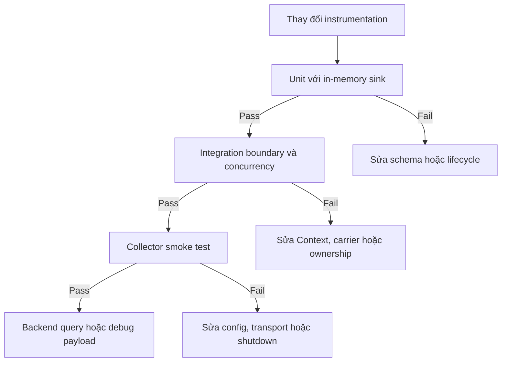

import { Step, Steps } from 'fumadocs-ui/components/steps';

<Callout type="info" title="Phạm vi và cách đọc ví dụ">
  Một test instrumentation phải kiểm tra **telemetry contract**: record nào được
  tạo, quan hệ giữa các record ra sao, schema có đúng không và dữ liệu có rời process
  theo đường dự kiến không. Không chỉ kiểm tra rằng business function “không throw”.
  Các đoạn code trong bài là **pseudocode portable**, có phong cách TypeScript để
  dễ đọc nhưng không phải code chạy trực tiếp của một SDK cụ thể. Hãy thay tên
  exporter, provider, reader và API context bằng package của runtime đang dùng.
</Callout>

## Mục lục

- [Kiểm thử instrumentation là kiểm thử contract](#kiểm-thử-instrumentation-là-kiểm-thử-contract)
  - [Một test tốt cần chứng minh gì](#một-test-tốt-cần-chứng-minh-gì)
  - [Pseudocode không phải API của một SDK cụ thể](#pseudocode-không-phải-api-của-một-sdk-cụ-thể)
- [Testing pyramid cho telemetry](#testing-pyramid-cho-telemetry)
  - [Ba tầng kiểm thử](#ba-tầng-kiểm-thử)
  - [Luồng kiểm thử đề xuất](#luồng-kiểm-thử-đề-xuất)
- [Chuẩn bị test harness deterministic](#chuẩn-bị-test-harness-deterministic)
  - [In-memory exporter và reader](#in-memory-exporter-và-reader)
  - [Processor deterministic](#processor-deterministic)
  - [Reset global provider và Context](#reset-global-provider-và-context)
  - [Lifecycle của fixture](#lifecycle-của-fixture)
    - [1. Tạo provider và sink](#1-tạo-provider-và-sink)
    - [2. Đăng ký trước khi khởi tạo code cần test](#2-đăng-ký-trước-khi-khởi-tạo-code-cần-test)
    - [3. Chạy operation trong Context được kiểm soát](#3-chạy-operation-trong-context-được-kiểm-soát)
    - [4. Collect và snapshot](#4-collect-và-snapshot)
    - [5. Đóng và restore](#5-đóng-và-restore)
- [Unit test cho traces](#unit-test-cho-traces)
  - [Kiểm tra schema và lifecycle của span](#kiểm-tra-schema-và-lifecycle-của-span)
  - [Parent, link, Resource và instrumentation scope](#parent-link-resource-và-instrumentation-scope)
  - [Không overfit ID, timestamp và duration](#không-overfit-id-timestamp-và-duration)
  - [Error path và cancellation](#error-path-và-cancellation)
- [Unit test cho metrics](#unit-test-cho-metrics)
  - [Kiểm tra aggregation](#kiểm-tra-aggregation)
  - [Cardinality và schema dimensions](#cardinality-và-schema-dimensions)
  - [Ví dụ kiểm tra metric](#ví-dụ-kiểm-tra-metric)
- [Kiểm thử log correlation](#kiểm-thử-log-correlation)
- [Integration test cho propagation](#integration-test-cho-propagation)
  - [HTTP hoặc RPC boundary](#http-hoặc-rpc-boundary)
  - [Queue và message carrier](#queue-và-message-carrier)
  - [Custom carrier](#custom-carrier)
  - [Negative test cho propagation](#negative-test-cho-propagation)
- [End-to-end app đến Collector đến backend](#end-to-end-app-đến-collector-đến-backend)
  - [Smoke test với Collector debug exporter](#smoke-test-với-collector-debug-exporter)
    - [1. Khởi động Collector cô lập](#1-khởi-động-collector-cô-lập)
    - [2. Khởi động application fixture](#2-khởi-động-application-fixture)
    - [3. Phát đủ ba signal](#3-phát-đủ-ba-signal)
    - [4. Flush theo signal](#4-flush-theo-signal)
    - [5. Đọc debug output](#5-đọc-debug-output)
    - [6. Đóng theo thứ tự](#6-đóng-theo-thứ-tự)
  - [Tiêu chí pass của E2E](#tiêu-chí-pass-của-e2e)
- [Các negative test cần có](#các-negative-test-cần-có)
  - [Error, retry và sampling](#error-retry-và-sampling)
  - [Timeout, shutdown và exporter outage](#timeout-shutdown-và-exporter-outage)
- [Concurrency và async context](#concurrency-và-async-context)
- [Golden tests và semantic convention changes](#golden-tests-và-semantic-convention-changes)
- [CI, flakiness, timeout và cleanup](#ci-flakiness-timeout-và-cleanup)
- [Troubleshooting test thất bại](#troubleshooting-test-thất-bại)
- [Release checklist](#release-checklist)
- [Nguồn tham khảo chính thức](#nguồn-tham-khảo-chính-thức)
- [Bài liên quan](#bài-liên-quan)

## Kiểm thử instrumentation là kiểm thử contract

Instrumentation là một phần của schema telemetry. Khi một HTTP client span đổi
name, khi một metric thêm một dimension, hoặc khi log mất `TraceId`, dashboard và
quy trình điều tra có thể hỏng dù application vẫn trả kết quả đúng.

Hãy coi output của instrumentation như một API có version:

- **Traces** mô tả operation, `SpanKind`, lifecycle và quan hệ parent-child hoặc
  link.
- **Metrics** mô tả instrument, unit, aggregation, temporality và tập dimensions.
- **Logs** mô tả body, severity, attributes, Resource và correlation fields.
- **Context** mô tả quan hệ execution hiện tại và cách quan hệ đó đi qua boundary.
- **Exporter pipeline** mô tả record có được collect, xử lý, gửi và nhận hay không.

### Một test tốt cần chứng minh gì

Một test nên trả lời một câu hỏi cụ thể. Ví dụ:

| Câu hỏi | Test phù hợp | Bằng chứng nên assert |
| --- | --- | --- |
| Function có tạo đúng business span không? | Unit test | Name, kind, status, event và lifecycle |
| Child có dùng đúng parent không? | Unit test context | Cùng trace ID, parent span ID đúng, context được restore |
| Duration metric có được aggregate đúng không? | Metric reader test | Count, sum, bucket hoặc last value |
| Log có gắn với span tại call site không? | Log sink test | `TraceId` và `SpanId` khớp active span |
| Context có qua HTTP hoặc queue không? | Integration test | Carrier sau inject và span ở receiver |
| Collector có nhận payload không? | E2E smoke test | App output, Collector debug output và backend query |
| Dữ liệu cấm có bị export không? | Negative privacy test | Secret, token, body và PII không xuất hiện trong payload |

Đừng bắt đầu bằng việc snapshot toàn bộ object của SDK. Trước tiên viết contract
nhỏ gồm các field ổn định và quan hệ có ý nghĩa. Cách này làm test vừa nhạy với
regression vừa ít phụ thuộc implementation.

### Pseudocode không phải API của một SDK cụ thể

Các tên như `InMemorySpanExporter`, `InMemoryMetricReader`, `SimpleSpanProcessor`,
`runWithContext` và `collect` chỉ là tên khái niệm. Mỗi runtime có cách gọi khác
nhau. Một số SDK cung cấp in-memory exporter chính thức; một số SDK chỉ có
in-memory reader hoặc test exporter trong package testing.

```text
// Pseudocode portable — không chạy trực tiếp.
harness = create_test_harness(
  tracer_provider = provider_with(in_memory_span_exporter),
  meter_provider = provider_with(in_memory_metric_reader),
  logger_provider = provider_with(in_memory_log_exporter),
  processor = deterministic_processor,
)

result = run_operation(harness)
harness.force_flush_all()
records = harness.snapshot()
assert_contract(records)
harness.close_and_restore_globals()
```

Đọc tài liệu SDK đúng ngôn ngữ để biết exporter có copy record trước khi
`shutdown()` hay không, reader có cần gọi `collect()` hay không, và global provider
có thể reset trong cùng process hay không. Khi không có API reset an toàn, chạy
mỗi test group trong process riêng là lựa chọn đáng tin cậy hơn.

## Testing pyramid cho telemetry

Không phải mọi test đều cần chạy qua Collector. Test càng gần source càng nhanh
và dễ chẩn đoán; test càng xa source càng giống production nhưng chậm và nhiều
failure mode hơn.

### Ba tầng kiểm thử

| Tầng | Phạm vi | Tốc độ và số lượng | Khi nào thất bại |
| --- | --- | --- | --- |
| **Unit** | Một helper hoặc một instrumentation module với in-memory sink | Nhanh; chạy trên mọi commit | Schema, lifecycle, context local, attributes sai |
| **Integration** | Nhiều module và boundary transport thật hoặc test server/broker | Vừa; chạy trong CI chính | Inject/extract, async context, duplicate, reader/exporter wiring |
| **End-to-end** | Application → Collector → backend hoặc debug exporter | Chậm; chạy theo smoke/release | Config, OTLP, TLS/auth, pipeline, retry, backend mapping |

Unit test nên chiếm phần lớn suite. Integration test giữ một số fixture đại diện
cho HTTP, queue và custom carrier. E2E không cần kiểm tra mọi tổ hợp attribute;
nó cần chứng minh đường vận chuyển tối thiểu và một vài contract quan trọng vẫn
đúng.

### Luồng kiểm thử đề xuất



Một regression ở unit không nên được chẩn đoán bằng cách nhìn dashboard production.
Ngược lại, unit pass không chứng minh Collector, TLS hoặc backend đã nhận record.
Hãy giữ mỗi tầng có assertion và log chẩn đoán riêng.

## Chuẩn bị test harness deterministic

Test harness là fixture tạo provider, sink, processor, Resource và Context cho test.
Nó nên được tạo theo test hoặc test group, không dùng chung mutable exporter cho
toàn bộ suite.

### In-memory exporter và reader

**In-memory exporter** nhận record vào một collection trong process thay vì gửi
network. Nó phù hợp để assert span và log đã end. **In-memory metric reader**
collect aggregation tại thời điểm test yêu cầu, nên tránh phải chờ periodic
interval.

Một harness tối thiểu nên có:

- in-memory span exporter hoặc span recorder để lấy những span đã kết thúc;
- deterministic span processor, thường là simple/synchronous processor hoặc test
  processor tự ghi nhận theo thứ tự end;
- in-memory metric reader để gọi `collect()` sau measurement;
- in-memory log exporter hoặc sink bắt được LogRecord tại call site;
- Resource cố định như `service.name=checkout-test`;
- clock hoặc time source có thể kiểm soát nếu SDK cho phép;
- helper `force_flush` và `shutdown` có timeout.

```text
// Pseudocode portable — tên builder chỉ minh họa.
span_exporter = InMemorySpanExporter()
span_processor = SimpleSpanProcessor(span_exporter)
tracer_provider = TracerProvider(
  resource = fixed_test_resource(),
  processors = [span_processor],
  sampler = AlwaysOn,
)

metric_reader = InMemoryMetricReader()
meter_provider = MeterProvider(
  resource = fixed_test_resource(),
  readers = [metric_reader],
)

log_exporter = InMemoryLogExporter()
logger_provider = LoggerProvider(
  resource = fixed_test_resource(),
  processors = [SimpleLogRecordProcessor(log_exporter)],
)
```

Nếu SDK không có `SimpleLogRecordProcessor`, dùng processor đồng bộ tương đương.
Mục tiêu của test là output sẵn sàng ngay sau operation, không phải mô phỏng
throughput của batch processor.

### Processor deterministic

Batch processor phù hợp production nhưng dễ làm unit test chập chờn vì record có
thể chưa export khi assertion chạy. Unit test nên dùng một processor deterministic:

1. nhận span ngay khi `end()` được gọi;
2. export đồng bộ hoặc đưa record vào collection có thể đọc ngay;
3. không phụ thuộc timer, scheduler hoặc network;
4. báo lỗi export rõ ràng thay vì nuốt lỗi ngoài test;
5. cung cấp `reset`, `finished_records` và `shutdown` rõ ràng.

Nếu cần kiểm tra chính batch processor, viết test riêng với fake clock hoặc clock
injectable, queue nhỏ và barrier; đừng dùng batch processor để kiểm tra mọi
instrumentation helper.

<Callout type="warn" title="Đừng dùng exporter thật trong unit test">
  Exporter thật biến một test schema thành test mạng. Nó tạo timeout, retry, credential
  và nguy cơ gửi dữ liệu giả ra hệ thống thật. Dành OTLP exporter cho integration hoặc
  E2E có endpoint cô lập.
</Callout>

### Reset global provider và Context

Global provider và current Context là state dùng chung. Nếu test A đăng ký
`TracerProvider` hoặc để span active mà không dọn, test B có thể nhận exporter,
Resource hoặc parent của test A.

Ưu tiên thứ tự sau:

1. **Dependency injection:** truyền `Tracer`, `Meter`, logger bridge hoặc facade
   vào module. Đây là cách dễ cô lập nhất.
2. **Scope local:** tạo provider cho test, chạy operation trong context riêng và
   restore context trong `finally`.
3. **Restore global:** lưu provider global trước test, đăng ký provider test nếu
   SDK cho phép, rồi khôi phục provider cũ sau test.
4. **Process isolation:** nếu global provider chỉ được set một lần và không có API
   unregister, chạy test group trong worker/process riêng.

```text
before_each:
    previous_tracer_provider = global_tracer_provider()
    previous_meter_provider = global_meter_provider()
    previous_logger_provider = global_logger_provider()
    previous_context = current_context()
    harness = new_isolated_harness()
    register_test_providers(harness)

after_each:
    harness.force_flush_with_timeout(2 seconds)
    harness.shutdown_with_timeout(2 seconds)
    restore_global_providers(
      previous_tracer_provider,
      previous_meter_provider,
      previous_logger_provider,
    )
    context.restore(previous_context)
    assert current_context() == previous_context
```

Pseudocode trên chỉ hợp lệ nếu SDK hỗ trợ đọc và restore global provider. Một
runtime có thể cache provider trong module, agent hoặc process và không cho reset.
Khi đó không cố “hack” private field. Dùng dependency injection hoặc process
isolation.

### Lifecycle của fixture

Fixture phải dọn cả state thành công lẫn state lỗi. Dùng `try/finally` hoặc cơ chế
`afterEach` của test runner:

<Steps>
<Step>

### 1. Tạo provider và sink

Tạo Resource cố định, in-memory exporter/reader và processor đồng bộ. Không tạo
một provider mới ở mỗi assertion.

</Step>
<Step>

### 2. Đăng ký trước khi khởi tạo code cần test

Nếu module lấy tracer hoặc meter ở thời điểm import, đăng ký provider trước khi
import module đó, hoặc refactor module để nhận dependency.

</Step>
<Step>

### 3. Chạy operation trong Context được kiểm soát

Tạo parent span biết trước cho test parent-child, chạy operation trong scope đó,
và giữ context tới khi Promise/Future hoàn tất.

</Step>
<Step>

### 4. Collect và snapshot

Gọi `collect()` cho metrics, `forceFlush()` nếu cần, rồi copy records sang snapshot
bất biến. Assert sau khi snapshot để test không đọc collection đang bị mutate.

</Step>
<Step>

### 5. Đóng và restore

Gọi shutdown với timeout, xóa callback observable, đóng server/broker giả và
restore global provider cùng Context. Dọn kể cả khi assertion trước đó thất bại.

</Step>
</Steps>

## Unit test cho traces

Unit test trace nên tập trung vào **ý nghĩa** của span. Đừng biến test thành bản
sao của tất cả field nội bộ mà SDK có thể thay đổi giữa minor release.

### Kiểm tra schema và lifecycle của span

Với một operation thành công, assert ít nhất:

- đúng số span dự kiến và không có span duplicate;
- `name` ổn định, ví dụ `checkout.validate_cart`;
- `kind` đúng vai trò, ví dụ `INTERNAL` cho business step;
- span đã end và `end_time` tồn tại;
- status đúng contract. Success thông thường có thể là `UNSET`, không bắt buộc
  mọi helper phải đặt `OK`;
- initial attributes có mặt và đúng type;
- event có tên ổn định, attributes có schema và số lượng đúng;
- Resource có `service.name` và environment test;
- instrumentation scope nhận diện module và version.

```text
// Pseudocode portable — không chạy trực tiếp.
span = exported_spans.only(name = "checkout.validate_cart")

assert span.kind == INTERNAL
assert span.status.code == UNSET
assert span.attributes["app.checkout.item_count"] == 3
assert span.events.names == ["checkout.validation_started"]
assert span.end_time exists
assert span.resource["service.name"] == "checkout-test"
assert span.scope.name == "com.example.checkout.instrumentation"
assert span.scope.version == "test-fixture-version"
```

Assert tập event theo contract. Nếu thứ tự event có ý nghĩa, assert thứ tự. Nếu
các event độc lập về thứ tự, assert theo set hoặc tìm từng event để test không
hỏng vì processor reorder không ảnh hưởng semantics.

### Parent, link, Resource và instrumentation scope

Tạo parent test rõ ràng thay vì dựa vào một span global còn sót:

```text
// Pseudocode portable.
run_with_new_root("test.request", () => {
  parent = current_span()

  run_with_new_span("checkout.validate_cart", () => {
    child = current_span()
    do_work()
  })

  link = exported_span("checkout.validate_cart")
  assert link.trace_id == parent.trace_id
  assert link.parent_span_id == parent.span_id
  assert link.span_id != parent.span_id
})
```

Với batch consumer, tạo nhiều producer contexts rồi assert tất cả links xuất hiện:

```text
consumer = start_span("orders.process_batch", kind = CONSUMER,
                      links = [producer_a.context, producer_b.context])

assert consumer.links contains_context producer_a.context
assert consumer.links contains_context producer_b.context
assert consumer.parent is the context required by the messaging contract
```

`Resource` và `InstrumentationScope` không phải span attributes. Assert chúng ở
đúng lớp. Đừng chỉ kiểm tra `service.name` trên từng span rồi bỏ qua scope; scope
là bằng chứng hữu ích để phát hiện auto-instrumentation và manual instrumentation
cùng sở hữu một boundary.

### Không overfit ID, timestamp và duration

ID và timestamp có tính biến thiên. Test nên kiểm tra quan hệ và invariant:

| Field | Nên assert | Không nên assert |
| --- | --- | --- |
| Trace ID | Child cùng trace ID với parent; ID hợp lệ, khác zero | Một chuỗi ID cố định do random generator |
| Span ID | Child khác parent và parent reference đúng | Giá trị hex cụ thể nếu không dùng fake ID có chủ ý |
| Parent | Đúng span trực tiếp hoặc root không có parent | Quan hệ suy ra từ timestamp |
| Link | Đủ context nguồn, attributes ổn định | Thứ tự nếu convention không yêu cầu |
| Start/end | Có mặt, `end >= start`, bao phủ operation | Nanosecond chính xác của wall clock |
| Duration | Nằm trong khoảng hợp lý hoặc dùng fake clock | `duration == 42ms` trong test chạy thật |
| Exception stack | Có exception event và type | Toàn bộ stack trace hoặc memory address |

Có thể dùng fake ID generator và fake clock khi cần golden output, nhưng đó là
một dependency của test fixture, không phải lý do để production code tự tạo ID.
Nếu dùng real clock, assert duration không âm và nằm dưới timeout rộng hơn thay vì
assert một con số chính xác.

### Error path và cancellation

Một operation thất bại nên được test riêng với expectation rõ ràng:

```text
error = fake_error(type = "TimeoutError", message = "fake only")

assert_throws(error, () => run_checkout(error))
span = exported_span("checkout.process")

assert span.status.code == ERROR
assert span.events contains_exception_type("TimeoutError")
assert span.end_time exists
assert business_error == error  // instrumentation không nuốt hoặc đổi lỗi
assert current_context() == context_before_test
```

`recordException` không tự đảm bảo status là `ERROR`; test phải bắt cả hai nếu
contract yêu cầu operation thất bại. Với cancellation, assert token vẫn được
truyền, cancellation error vẫn tới caller, span end đúng một lần và status/event
phân biệt được cancellation dự kiến với deadline failure.

## Unit test cho metrics

Metrics test không nên tìm một measurement thô trong OTLP output. Metrics SDK
thường aggregate measurements thành data point khi reader collect.

### Kiểm tra aggregation

Chọn dữ liệu test nhỏ và biết trước kết quả. Ví dụ với Histogram:

```text
// Pseudocode portable.
duration.record(0.05, {route: "/checkout", result: "success"})
duration.record(0.20, {route: "/checkout", result: "success"})
duration.record(0.80, {route: "/checkout", result: "error"})

points = metric_reader.collect()
point = find_point(points, name = "app.checkout.duration",
                   attributes = {route: "/checkout", result: "success"})

assert point.count == 2
assert point.sum == approximately(0.25)
assert sum(point.bucket_counts) == point.count
assert point.unit == "s"
```

Với Counter, ghi delta `+2` rồi collect và assert sum/temporality theo cấu hình.
Với UpDownCounter, ghi `+1` và `-1` bằng **cùng tập attributes**, collect và
assert active value trở về baseline. Với Observable instrument, mock snapshot,
gọi collection nhiều lần và assert callback không tạo side effect hoặc I/O không
bounded.

Đồng thời kiểm tra:

- instrument name, kind, unit và description;
- aggregation đúng loại: Sum, Last Value hoặc Histogram;
- temporality `DELTA` hay `CUMULATIVE` theo test contract;
- `start_time` và `time` có quan hệ hợp lệ;
- Resource và scope đúng;
- không có duplicate stream do hai instrument cùng name nhưng khác unit/kind.

<Callout type="warn" title="Đừng chờ periodic reader trong unit test">
  Chờ `sleep(10 seconds)` để metric xuất hiện làm test chậm và dễ flake. Dùng in-memory
  reader với `collect()` hoặc fake clock. Chỉ kiểm tra periodic scheduling trong một
  integration test riêng.
</Callout>

### Cardinality và schema dimensions

Cardinality test bảo vệ chi phí trước khi metric đến production. Chuẩn bị input
có ID, raw URL và error message khác nhau, rồi kiểm tra output chỉ dùng dimensions
đã allowlist:

```text
// Pseudocode portable.
for request in fixture_requests_with_100_dynamic_ids:
    handle(request)

points = metric_reader.collect()
series = points.where(name = "app.checkout.duration")

assert every(point.attributes.keys)
       subset_of ["http.route", "http.request.method", "app.checkout.result"]
assert series.count <= expected_bounded_series
assert no_attribute_value_matches_uuid(series)
assert no_attribute_key in ["trace_id", "request.id", "order.id"]
```

Test thêm các invariant cardinality:

- route dùng template, không phải raw path;
- error type nằm trong enum hữu hạn;
- ID nghiệp vụ không phải metric dimension;
- attribute `+1` và `-1` của active gauge/counter đối xứng;
- overflow point nếu SDK hỗ trợ được phát hiện và làm test fail hoặc được theo dõi
  có chủ đích, thay vì âm thầm chấp nhận.

Metric cardinality không phải số exemplar. Một test riêng cho exemplar có thể
kiểm tra trace/span IDs trong exemplar, nhưng không đưa IDs đó vào data point
attributes. Xem [Metrics](/signals/metrics/) và [Exemplars](/signals/exemplars/)
để phân biệt hai lớp.

### Ví dụ kiểm tra metric

```ts
// TypeScript-flavored pseudocode — không chạy trực tiếp.
it("records duration in seconds and returns active work to baseline", async () => {
  const before = await reader.collect();
  const activeAttrs = { "app.checkout.channel": "web" };

  await runCheckout({ channel: "web" });
  await reader.collect();

  const after = await reader.collect();
  const active = findPoint(after, "app.checkout.active", activeAttrs);
  const duration = findPoint(after, "app.checkout.duration", {
    ...activeAttrs,
    "app.checkout.result": "success",
  });

  assert(active.value === 0); // sau khi operation hoàn tất
  assert(duration.unit === "s");
  assert(duration.count === 1);
  assert(duration.sum >= 0);
  assertNoUnexpectedMetricSeries(after);
});
```

Đây là pseudocode. Một SDK có thể cần `forceFlush`, một SDK khác chỉ cần
`collect`; cumulative reader có thể chứa state từ lần collect trước. Nếu reader
cumulative, reset fixture hoặc tính delta giữa snapshot trước và sau thay vì
mong đợi mọi point bắt đầu từ zero.

## Kiểm thử log correlation

Log bridge phải lấy Context tại **call site**. Test hãy chạy một log bên trong
active span và một log bên ngoài span để tạo đối chứng:

```text
// Pseudocode portable.
run_with_new_span("checkout.process", () => {
  expected = current_span().context
  logger.warn("payment timeout", {error_type: "timeout"})
})

inside = log_exporter.find(body = "payment timeout")
outside = emit_log_outside_any_span("startup marker")

assert inside.trace_id == expected.trace_id
assert inside.span_id == expected.span_id
assert inside.trace_flags == expected.trace_flags
assert outside.trace_id is absent
assert outside.span_id is absent
```

Assert thêm severity, body, structured attributes, Resource và scope. Không assert
message đã được format thành một chuỗi cụ thể nếu logger bridge cho phép nhiều
format hợp lệ; assert fields có cấu trúc và type đúng.

Với async logger, dùng queue/barrier để chắc chắn record đã được xử lý rồi mới
assert. Test một logger worker chạy đồng thời với request khác để phát hiện việc
bridge đọc current Context của consumer thread thay vì context đã capture. Kiểm
tra privacy bằng cách serialize `LogRecord` và assert fake token, cookie, body
nhạy cảm và stack trace chứa secret đều không xuất hiện.

<Callout type="idea" title="Log có trace ID nhưng không mở được trace">
  Đây có thể là sampling, export failure hoặc retention khác nhau, không nhất thiết
  là lỗi correlation. Test cần phân biệt “ID được gắn đúng” với “trace còn ở backend”.
</Callout>

## Integration test cho propagation

Propagation test cần đi qua boundary giống production. Tạo parent context biết
trước ở sender, inject vào carrier, gửi bằng transport test, extract ở receiver,
rồi assert span mới có trace ID và quan hệ đúng.

### HTTP hoặc RPC boundary

HTTP integration fixture nên có sender và receiver thật, dù chỉ chạy trên localhost:

```text
// Pseudocode portable.
sender_span = start_span("client.request", kind = CLIENT)
with active(sender_span):
    request = new_http_request("POST", "/test")
    propagator.inject(current_context(), request.headers)
    response = test_server.handle(request)

receiver_span = server_exporter.find(name = "POST /test", kind = SERVER)
assert receiver_span.trace_id == sender_span.trace_id
assert receiver_span.parent_span_id == sender_span.span_id
assert receiver_span.parent_context.is_remote == true
assert request.headers contains_valid_traceparent
```

Nếu server instrumentation tự tạo span, không tạo thêm một server span tương
đương trong handler. Hãy lấy span do server instrumentation tạo từ test exporter
hoặc kiểm tra child business span của nó. Test response status và lỗi transport
riêng với test context. Kiểm tra cả HTTP headers case-insensitive và việc proxy
không strip `traceparent`/`tracestate` ngoài policy.

Với RPC, giữ assertion ở contract logic: carrier có trace context hợp lệ, receiver
extract trước span creation, cùng trace ID và parent span ID mong đợi. Tên method
và field cụ thể phụ thuộc RPC framework.

### Queue và message carrier

Queue test cần phân biệt producer với consumer. Producer span thường kết thúc sau
khi publish, còn consumer span bắt đầu khi worker nhận message:

```text
// Pseudocode portable.
producer = start_span("orders.publish", kind = PRODUCER)
with active(producer):
    message = {body: fake_order, headers: {}}
    propagator.inject(current_context(), message.headers)
    test_queue.publish(message)
producer.end()

received = test_queue.consume()
remote = propagator.extract(received.headers)
consumer = start_span("orders.process", kind = CONSUMER,
                      parent_context = remote)
with active(consumer):
    process(received)
consumer.end()

assert consumer.trace_id == producer.trace_id
assert consumer.parent_span_id == producer.span_id
assert remote.is_remote == true
```

Nếu topology batch có nhiều producer contexts, assert links tới từng context theo
messaging semantic convention. Không chọn ngẫu nhiên một message làm parent chỉ
vì test queue trả message đó đầu tiên.

Test negative với message thiếu header, header sai format và header quá lớn. Kỳ
vọng là receiver bắt đầu trace mới hoặc dùng policy fallback, không throw làm
mất business message nếu propagation metadata không bắt buộc cho nghiệp vụ.

### Custom carrier

Custom carrier có thể là map metadata, object envelope hoặc record key-value.
Không tự serialize cả Context hoặc tự nối chuỗi `traceparent`; dùng Propagator
API với getter/setter của carrier:

```text
// Pseudocode portable.
carrier = {metadata: new_map()}
propagator.inject(current_context(), carrier, setter = metadata_setter)

assert carrier.metadata contains "traceparent"
assert carrier.metadata["traceparent"] matches valid_w3c_shape
assert no_secret_or_baggage_not_allowlisted(carrier)

extracted = propagator.extract(empty_context(), carrier,
                               getter = metadata_getter)
assert extracted.span_context.trace_id == sender.context.trace_id
assert extracted.span_context.is_remote == true
```

Test key không tồn tại, giá trị rỗng, duplicate key, sai casing nếu carrier
không phân biệt hoa thường, giá trị không phải string và giới hạn kích thước.
Getter nên trả tất cả giá trị khi transport cho phép nhiều header; setter không
được silently append context cũ nếu contract yêu cầu replace.

### Negative test cho propagation

| Tình huống | Kỳ vọng | Lỗi được phát hiện |
| --- | --- | --- |
| Không có carrier | Receiver tạo root/fallback theo policy | Code giả định header luôn có |
| `traceparent` sai format | Bỏ context lỗi, không crash business request | Parser thủ công hoặc trust input mù quáng |
| Extract sau tạo server span | Test phải fail parent assertion | Sai thứ tự lifecycle |
| Inject context cha thay vì outgoing span | Downstream là sibling | Quên activate outgoing span trước inject |
| Context qua worker bị mất | Test concurrency phát hiện trace mới/sai parent | Async scheduler không capture Context |
| Baggage có secret | Test fail privacy assertion | Forward toàn bộ baggage |
| Proxy xóa header | E2E cho thấy downstream root mới | Hạ tầng làm đứt propagation |

Không dùng trace ID để quyết định quyền truy cập. Một header hợp lệ chỉ chứng minh
metadata có thể parse, không chứng minh caller được xác thực.

## End-to-end app đến Collector đến backend

E2E test nên dùng một fixture nhỏ, dữ liệu giả và backend cô lập. Mục tiêu là kiểm
tra đường vận chuyển, không thay thế unit test schema.

### Smoke test với Collector debug exporter

`debug` exporter của Collector hữu ích để nhìn payload gần đường wire. Cấu hình
minh họa sau chỉ dành cho test/local và cần đối chiếu với đúng distribution,
version Collector đang dùng:

```yaml
receivers:
  otlp:
    protocols:
      grpc:
        endpoint: 127.0.0.1:4317
      http:
        endpoint: 127.0.0.1:4318

exporters:
  debug:
    verbosity: detailed

service:
  pipelines:
    traces:
      receivers: [otlp]
      exporters: [debug]
    metrics:
      receivers: [otlp]
      exporters: [debug]
    logs:
      receivers: [otlp]
      exporters: [debug]
```

Dùng marker cố định chỉ trong run test, ví dụ `test.run_id=otel-test-001`, rồi
thực hiện:

<Steps>
<Step>

### 1. Khởi động Collector cô lập

Start Collector bằng config test, chờ health/readiness endpoint và lưu log khởi
động. Không trỏ exporter tới backend production.

</Step>
<Step>

### 2. Khởi động application fixture

Cấu hình OTLP endpoint của test Collector, Resource cố định và sampler dễ quan sát
như AlwaysOn trong lab. Tạo một HTTP request hoặc message có marker test.

</Step>
<Step>

### 3. Phát đủ ba signal

Tạo server span, ghi histogram trong active span và emit một log structured.
Đảm bảo các record chứa marker ở field được policy cho phép.

</Step>
<Step>

### 4. Flush theo signal

Gọi `forceFlush` hoặc chờ reader/exporter theo đúng SDK. Không chỉ flush traces:
metrics và logs có reader/processor riêng.

</Step>
<Step>

### 5. Đọc debug output

Parse hoặc grep output có kiểm soát để xác nhận span, metric data point, log
record, Resource, scope, correlation IDs và không có dữ liệu cấm.

</Step>
<Step>

### 6. Đóng theo thứ tự

Ngừng nhận work, flush, shutdown provider, rồi stop Collector. Mỗi bước có timeout
và log lỗi rõ ràng.

</Step>
</Steps>

Nếu backend test thật được dùng, thêm assertion query ở backend sau thời gian
ingest đã đo được. Giữ debug exporter là một chặng chẩn đoán, không coi output
console là contract lâu dài của Collector.

### Tiêu chí pass của E2E

Một fixture E2E tối thiểu nên kiểm tra:

- application export được ít nhất một span đã end;
- Collector nhận đúng signal pipeline và không báo rejected record;
- metric có đúng name, unit, aggregation và số lượng traffic fixture;
- log có `TraceId`/`SpanId` đúng với span tại call site;
- Resource `service.name`, version và environment khớp giữa signals;
- propagation qua boundary giữ trace ID và parent relation;
- debug/backend payload không chứa fake secret, authorization header, cookie hoặc
  request body ngoài allowlist;
- retry và shutdown hoàn tất trước deadline;
- không có duplicate record ngoài ownership contract.

Để test E2E không phụ thuộc thứ tự batch, query theo marker và quan hệ IDs. Nếu
backend eventual consistency, polling với deadline cố định và diagnostic output
khi timeout; không dùng sleep cố định không có điều kiện dừng.

## Các negative test cần có

Happy path chỉ chứng minh instrumentation hoạt động khi mọi thứ thuận lợi. Suite
cần cố ý tạo lỗi để bảo vệ lifecycle và hành vi không làm hỏng business code.

### Error, retry và sampling

| Kịch bản | Assertions chính |
| --- | --- |
| Business function throw | Exception được giữ nguyên, span end, event và status đúng |
| Promise/Future reject | Context restore, không có span treo |
| Cancellation | Cancellation/deadline tới caller, span đóng, không đổi thành success |
| Retry attempt 1 lỗi, attempt 2 thành công | Child attempt 1 `ERROR`, parent theo final outcome, attempt count hữu hạn |
| Retry hết lần | Mọi attempt cần thấy được, parent lỗi, không retry vô hạn |
| Head sampler drop | Business result không đổi; non-recording span không được assert như exported span |
| Tail sampler nhận error/slow | Trace fixture được giữ nếu span đến trước decision deadline |
| Unsampled trace với exemplar trace-based | Metric vẫn aggregate; exemplar/trace link có thể vắng |
| `recordException` nhưng exception được xử lý | Không đánh parent `ERROR` nếu logical operation thành công |

Sampling test không nên assert “mọi span luôn có mặt” khi sampler được cấu hình
DROP. Hãy kiểm tra sampler decision, sampled flag và business behavior riêng.
Head sampling không thể thấy status cuối; nếu muốn test giữ mọi error, dùng E2E
tail sampling với input đã biết và deadline đủ rộng.

### Timeout, shutdown và exporter outage

Fake exporter nên có chế độ chậm, trả lỗi và block đến cancellation. Test các invariant:

```text
// Pseudocode portable.
fake_exporter.fail_next_exports = 1
result = run_operation()
assert result is business_success  // telemetry failure không đổi business result
assert exporter_failure_is_observable()

shutdown_result = shutdown_with_timeout(500 milliseconds)
assert shutdown_result completes_or_fails_explicitly_before_deadline
assert test_process_is_not_left_hanging
```

Không retry exporter trong business retry loop. SDK exporter có policy riêng. Khi
backend tắt, xác định rõ application sẽ drop, block trong giới hạn hay buffer; sau
đó test đúng policy thay vì yêu cầu zero loss không thực tế.

## Concurrency và async context

Context leak thường không xuất hiện trong test tuần tự. Hãy chạy ít nhất hai
operation đồng thời với marker khác nhau và barrier để chúng xen kẽ:

```text
// Pseudocode portable.
barrier = Barrier(2)

async function request(name):
    return run_with_span("request." + name, async () => {
        await barrier.wait()
        await async_boundary()
        child = await run_with_span("child." + name, do_work)
        log = logger.info("finished", {test_case: name})
        return {child, log}
    })

[a, b] = await concurrently(request("A"), request("B"))
assert a.child.trace_id == a.parent.trace_id
assert b.child.trace_id == b.parent.trace_id
assert a.child.trace_id != b.child.trace_id
assert a.log.span_id == a.child.span_id_or_active_expected
assert current_context() == context_before_suite
```

Trong test thực tế, lưu span tại đúng call site để biết log thuộc span nào. Các
assertion quan trọng là:

- Context A không bao giờ xuất hiện trong record của B;
- sau `await`, thread hop, callback, timer và worker task, Context đúng vẫn được
  capture hoặc restore;
- detached task có lifecycle riêng và không giữ request Context vô hạn;
- cancellation ở một task không đóng nhầm span của task khác;
- executor được shutdown, timer được clear và queue được drain.

Không dùng biến global `currentTraceId` để kiểm tra context. Cách đó có thể làm
test “pass” trong tuần tự nhưng sai ngay khi có concurrent requests.

## Golden tests và semantic convention changes

Golden test so sánh snapshot telemetry với file chuẩn. Nó hữu ích khi cần bảo vệ
một payload lớn hoặc contract cross-language, nhưng dễ gây noise nếu snapshot cả
ID, timestamp, stack trace, scope version tự động hoặc field do SDK sắp xếp khác nhau.

Pipeline golden nên có bước normalize:

```text
// Pseudocode portable.
snapshot = export_fixture()
snapshot = normalize(snapshot,
  replace_ids = "<id>",
  replace_timestamps = "<time>",
  sort_attributes = true,
  sort_events_only_when_order_is_not_semantic = true,
  remove_runtime_metadata = ["process.pid", "host.name"],
)
assert snapshot == read_golden("checkout-telemetry.v2.json")
```

Giữ các field thuộc contract trong golden: name, kind, status, attribute keys và
types, event names, parent relation dạng symbolic, Resource và scope. Không scrub
ID tới mức mất khả năng kiểm tra quan hệ; thay mỗi ID bằng token ổn định rồi giữ
mapping, ví dụ `trace-A`, `span-parent`, `span-child`.

Khi semantic conventions đổi:

1. đọc migration note và trạng thái stable/development của convention mới;
2. xác định field đổi tên, đổi type, đổi unit, đổi meaning hoặc đổi schema URL;
3. cập nhật instrumentation contract và golden fixture có version;
4. cập nhật dashboard, alert, query và internal links liên quan;
5. nếu cần, chạy dual-write hoặc dual-read trong giai đoạn migration có thời hạn;
6. giữ một test chứng minh field cũ đã được loại bỏ khi migration hoàn tất.

Không update golden bằng cách chấp nhận toàn bộ diff. Review từng diff và giải
thích vì sao schema thay đổi. Một thay đổi semantic convention có thể hợp lệ
nhưng vẫn là breaking change với consumer nội bộ.

## CI, flakiness, timeout và cleanup

Telemetry test thường flake vì timer, network, eventual consistency và global
state. Xử lý nguồn gốc thay vì tăng retry mù.

| Rủi ro CI | Biện pháp |
| --- | --- |
| Batch chưa export | Dùng processor đồng bộ ở unit; `forceFlush`/`collect` ở integration |
| Wall clock thay đổi | Fake clock hoặc assert invariant; duration dùng monotonic clock |
| Test chạy song song dùng global provider | DI, process isolation hoặc serial group cho test global |
| Collector/backend eventual consistency | Poll với deadline và backoff; in diagnostics khi hết hạn |
| Port hoặc queue còn mở | Ephemeral port, unique test namespace, teardown có timeout |
| Exporter treo | Fake cancellation, timeout bắt buộc và shutdown không vô hạn |
| Random sampling | Dùng AlwaysOn hoặc deterministic sampler ở contract test; kiểm tra xác suất bằng sample lớn riêng |
| Thứ tự record thay đổi | Assert theo identity/quan hệ; chỉ assert order khi semantics yêu cầu |
| Retry làm duplicate | Fake exporter có event ID hoặc đếm theo contract; phân biệt at-least-once |
| Dữ liệu nhạy cảm trong failure log | Dùng fixture giả, redact diagnostic output và không dump payload thật |

Quy tắc timeout thực dụng:

- unit test không chờ network và thường có deadline ngắn;
- integration test đặt deadline cho server, queue, flush và shutdown riêng;
- E2E đặt deadline lớn hơn ingest p99 đã đo, không dùng sleep cố định;
- mọi `finally` phải có cleanup timeout để test runner không treo;
- khi timeout, in số record, queue size, exporter error và Collector log đã
  redact, không chỉ in “timeout”.

Nếu một test chỉ pass khi chạy riêng, nghi ngờ global provider, Context leak,
file offset, port hoặc mutable exporter trước khi tăng timeout. Chạy lặp test
thất bại và chạy suite theo thứ tự ngẫu nhiên để phát hiện phụ thuộc thứ tự.

## Troubleshooting test thất bại

| Triệu chứng | Nguyên nhân thường gặp | Cách kiểm tra và sửa |
| --- | --- | --- |
| Không có span trong in-memory exporter | Provider no-op, span bị sampling drop, quên end hoặc exporter chưa flush | Assert provider, sampler decision, `end()`, rồi force flush trước snapshot |
| Có span nhưng parent sai | Span không active hoặc async Context mất | Tạo parent fixture explicit; kiểm tra extract/activate và concurrency |
| Test sau nhận span của test trước | Global provider/exporter/context chưa reset | Restore global state; dùng DI hoặc process isolation |
| Metric point rỗng | Chưa collect, periodic interval chưa đến hoặc reader cumulative state gây hiểu nhầm | Gọi `collect`; kiểm tra temporality và snapshot trước/sau |
| Metric count gấp đôi | Auto và manual instrumentation cùng phát | So scope, name, kind và traffic fixture; chọn một owner |
| Active metric không về zero | Attributes tăng/giảm khác nhau hoặc cleanup không chạy | Tái sử dụng immutable attributes; đặt decrement trong `finally` |
| Log thiếu TraceId | Emit ngoài active span hoặc async bridge không capture call-site context | Assert Context tại call site; kiểm tra bridge queue và worker |
| Log có ID cũ | Context rò từ test trước hoặc detached task | Restore context sau test; test log ngoài span làm đối chứng |
| HTTP receiver tạo trace mới | Header bị strip hoặc extract sau server span | Capture carrier, validate `traceparent`, sửa thứ tự extract → span |
| Queue test treo | Consumer chưa ack, worker chưa stop hoặc queue chờ vô hạn | Fake broker có timeout, drain/close trong teardown |
| Golden diff toàn file | Snapshot chứa IDs, time, ordering hoặc metadata runtime | Normalize volatile fields; review diff schema thay vì update mù |
| E2E debug có record nhưng backend không có | Backend eventual consistency, filter, auth hoặc retention | So Collector payload với backend query; kiểm tra pipeline từng chặng |
| Test pass local, fail CI | Clock, parallelism, resource limit, port hoặc timing | Fake clock, isolation, ephemeral resources và timeout diagnostics |
| Privacy test không bắt được secret | Chỉ kiểm tra metric point, bỏ qua exemplar/log/carrier | Serialize toàn bộ output của từng signal và carrier để assert denylist |

Khi chẩn đoán, đi theo đường từ trong ra ngoài: instrumentation → provider và
Context → processor/reader → exporter → Collector → backend. Sửa chặng đầu tiên
không đạt contract; đừng sửa dashboard để che payload sai.

## Release checklist

**Contract và schema**

- [ ] Unit test kiểm tra span name, kind, status, attributes, events và lifecycle.
- [ ] Parent-child, links, Resource và instrumentation scope đã được assert ở
  đúng lớp.
- [ ] Test không overfit ID, wall-clock timestamp, stack trace hoặc thứ tự không
  có ý nghĩa.
- [ ] Metrics test kiểm tra aggregation, unit, temporality, count/sum/bucket và
  cardinality bounded.
- [ ] Log test kiểm tra structured fields, severity, Resource và trace/span
  correlation tại call site.
- [ ] Golden fixture có version và đã review diff sau semantic convention change.

**Isolation và reliability**

- [ ] Unit dùng in-memory exporter/reader và deterministic processor.
- [ ] Global providers và Context được restore sau mỗi test; nếu không thể reset,
  test được process-isolated.
- [ ] Concurrency, async boundary, detached task, cancellation và retry đã có
  test riêng.
- [ ] Exporter outage, timeout, backend unavailable, flush và shutdown đã được
  kiểm tra với deadline.
- [ ] Test cleanup đóng server, broker, timer, observable callback, exporter và
  provider kể cả khi assertion fail.
- [ ] CI không phụ thuộc sleep cố định, thứ tự test hoặc network không kiểm soát.

**Propagation và E2E**

- [ ] HTTP/RPC, queue và custom carrier có integration test inject/extract.
- [ ] Test header/carrier sai, thiếu, quá lớn và baggage ngoài allowlist.
- [ ] E2E đã chạy qua application → Collector → debug exporter hoặc backend cô lập.
- [ ] Từng signal đã được flush/collect; Collector rejected/export failure được
  kiểm tra.
- [ ] Traffic fixture không tạo duplicate spans hoặc double-count metrics.

**Privacy và release safety**

- [ ] Payload serialized của spans, metrics, exemplars, logs và carriers không
  chứa secret, token, cookie, body hoặc PII bị cấm.
- [ ] Denylist/allowlist được test tại source, không chỉ trông chờ Collector
  redaction.
- [ ] Dependency SDK, instrumentation, Collector và semantic convention đã pin
  version, có migration note và rollback plan.
- [ ] Overhead CPU, memory, record volume, series cardinality và export latency
  nằm trong ngân sách.
- [ ] Release có smoke test sau deploy và biết cách so sánh debug output với
  backend query.

## Nguồn tham khảo chính thức

- [OpenTelemetry Tracing API](https://opentelemetry.io/docs/specs/otel/trace/api/) — lifecycle, Context, parent, links, events, status và `IsRecording`.
- [OpenTelemetry Tracing SDK](https://opentelemetry.io/docs/specs/otel/trace/sdk/) — sampler, processor, exporter và quyết định recording/sampling.
- [OpenTelemetry Metrics API](https://opentelemetry.io/docs/specs/otel/metrics/api/) — instruments, measurements và Context.
- [OpenTelemetry Metrics SDK](https://opentelemetry.io/docs/specs/otel/metrics/sdk/) — reader, aggregation, Views, cardinality và exemplars.
- [OpenTelemetry Metrics Data Model](https://opentelemetry.io/docs/specs/otel/metrics/data-model/) — data point, temporality, timestamps và aggregation output.
- [OpenTelemetry Logs Data Model](https://opentelemetry.io/docs/specs/otel/logs/data-model/) — body, severity, Resource và trace correlation fields.
- [OpenTelemetry Logs API](https://opentelemetry.io/docs/specs/otel/logs/api/) — tạo LogRecord và gắn Context.
- [OpenTelemetry Context propagation](https://opentelemetry.io/docs/concepts/context-propagation/) — inject/extract qua HTTP, RPC và messaging boundary.
- [OpenTelemetry Semantic Conventions](https://opentelemetry.io/docs/specs/semconv/) — tên, attribute, unit và migration schema theo domain.
- [OpenTelemetry Collector configuration](https://opentelemetry.io/docs/collector/configuration/) — receiver, processor, exporter và pipelines.
- [OpenTelemetry Collector debug exporter](https://github.com/open-telemetry/opentelemetry-collector/tree/main/exporter/debugexporter) — quan sát payload trong môi trường test.

<Callout type="warn" title="Kiểm tra theo runtime và phiên bản">
  OpenTelemetry chuẩn hóa contract và OTLP data model, nhưng API in-memory exporter,
  reader, global reset, fake clock, log bridge và mức hỗ trợ golden field khác nhau
  giữa các SDK. Pin version, đọc tài liệu runtime, rồi xác nhận payload thực tế ở
  Collector trước khi đưa assertion vào release gate.
</Callout>

## Bài liên quan

<Cards>
  <Card title="API và SDK" href="/instrumentation/api-sdk/" description="Provider, processor, reader, exporter và lifecycle bootstrap." />
  <Card title="Manual instrumentation" href="/instrumentation/manual-instrumentation/" description="Tạo span, metrics, logs, links và propagation trong code." />
  <Card title="Spans" href="/signals/spans/" description="Name, SpanKind, status, events, links và lifecycle của span." />
  <Card title="Metrics" href="/signals/metrics/" description="Aggregation, temporality, data point và cardinality." />
  <Card title="Logs" href="/signals/logs/" description="LogRecord, structured logging và correlation với trace." />
  <Card title="Signal correlation" href="/signals/correlation/" description="Nối metrics, exemplars, traces và logs để điều tra." />
  <Card title="Context propagation" href="/fundamentals/context-propagation/" description="Giữ trace context qua HTTP, RPC, queue và custom carrier." />
  <Card title="Trace sampling" href="/signals/sampling/" description="Hiểu giới hạn của test khi sampler drop hoặc giữ trace có điều kiện." />
</Cards>
