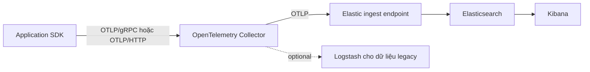
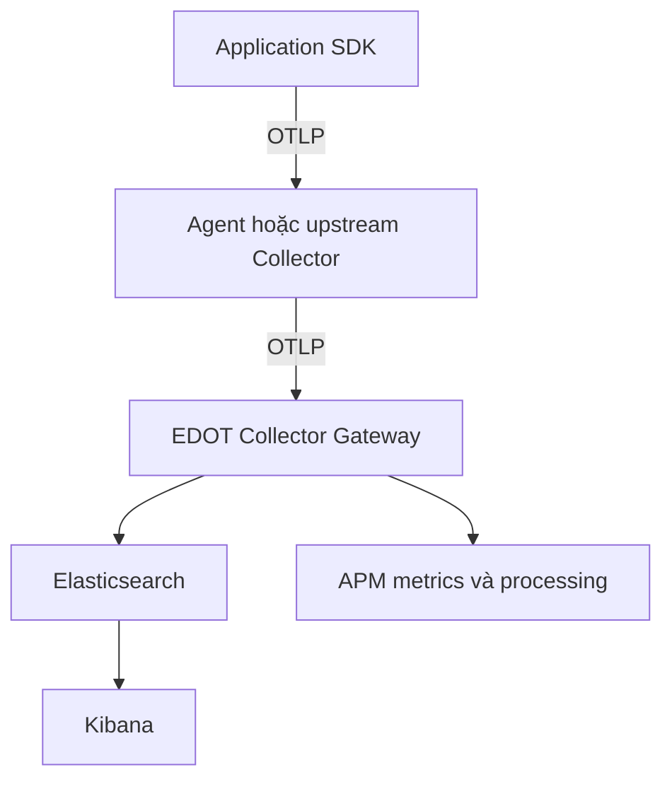
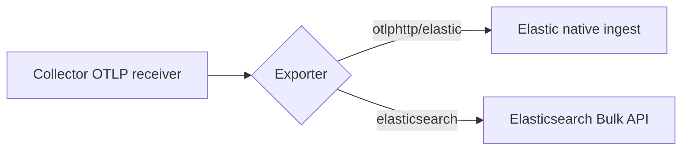

<Callout type="info" title="Phạm vi của bài">
  Trong bài này, “ELK” được dùng theo nghĩa rộng là Elastic Stack. Kiến trúc OpenTelemetry hiện đại thường thêm Elastic APM, Elastic Agent hoặc EDOT Collector; Logstash là thành phần tùy chọn, không phải bắt buộc trong mọi pipeline.
</Callout>

## Mục lục

- [Elastic Stack và OpenTelemetry](#elastic-stack-và-opentelemetry)
  - [ELK không phải protocol](#elk-không-phải-protocol)
  - [Các thành phần cần phân biệt](#các-thành-phần-cần-phân-biệt)
- [Kiến trúc ingest](#kiến-trúc-ingest)
  - [Đường khuyến nghị cho Elastic Cloud](#đường-khuyến-nghị-cho-elastic-cloud)
  - [Đường khuyến nghị cho self-managed](#đường-khuyến-nghị-cho-self-managed)
  - [Logstash đứng ở đâu](#logstash-đứng-ở-đâu)
- [Chọn cách gửi telemetry](#chọn-cách-gửi-telemetry)
  - [Gửi qua Managed OTLP Endpoint](#gửi-qua-managed-otlp-endpoint)
  - [Gửi qua Collector Gateway](#gửi-qua-collector-gateway)
  - [Elasticsearch exporter trực tiếp](#elasticsearch-exporter-trực-tiếp)
- [Schema và data stream](#schema-và-data-stream)
  - [OTel native và ECS](#otel-native-và-ecs)
  - [Resource attributes và data stream routing](#resource-attributes-và-data-stream-routing)
  - [Portability của query](#portability-của-query)
- [Lab gửi OTLP qua Collector](#lab-gửi-otlp-qua-collector)
  - [Cấu hình Collector](#cấu-hình-collector)
  - [Chạy canary telemetry](#chạy-canary-telemetry)
  - [Xác minh trong Kibana](#xác-minh-trong-kibana)
- [Tương quan traces metrics và logs](#tương-quan-traces-metrics-và-logs)
- [Failure modes](#failure-modes)
  - [Gửi tới sai endpoint](#gửi-tới-sai-endpoint)
  - [`401` hoặc `403`](#401-hoặc-403)
  - [`415` hoặc lỗi encoding](#415-hoặc-lỗi-encoding)
  - [Dữ liệu vào nhưng không thấy trong Kibana](#dữ-liệu-vào-nhưng-không-thấy-trong-kibana)
  - [Field bị conflict hoặc mapping explosion](#field-bị-conflict-hoặc-mapping-explosion)
  - [APM UI thiếu metric hoặc trải nghiệm khác](#apm-ui-thiếu-metric-hoặc-trải-nghiệm-khác)
  - [Exporter retry nhiều hoặc mất dữ liệu khi Collector dừng](#exporter-retry-nhiều-hoặc-mất-dữ-liệu-khi-collector-dừng)
- [Checklist production](#checklist-production)
- [Khi nào nên dùng Elastic Stack](#khi-nào-nên-dùng-elastic-stack)
- [Nguồn chính thức và bài liên quan](#nguồn-chính-thức-và-bài-liên-quan)

## Elastic Stack và OpenTelemetry

Elastic Stack có thể làm backend cho telemetry do OpenTelemetry tạo ra. OpenTelemetry thu thập và chuẩn hóa dữ liệu; Elastic lưu trữ, lập chỉ mục, truy vấn và hiển thị dữ liệu đó.

Ví dụ, một request đi qua hệ thống có thể tạo ra ba signal:

- **Trace** mô tả toàn bộ request và các span bên trong request.
- **Metric** đo số lượng request, latency hoặc mức sử dụng tài nguyên.
- **Log** ghi sự kiện chi tiết, chẳng hạn lỗi database.

OTLP là ranh giới ingest ưu tiên cho pipeline mới. Ứng dụng gửi OTLP tới Collector. Collector xử lý batching, retry, sampling hoặc enrichment trước khi chuyển dữ liệu tới Elastic.

### ELK không phải protocol

ELK là tên của một stack sản phẩm, không phải tên protocol. Trong mô hình này:

| Khái niệm | Vai trò | Ví dụ |
| --- | --- | --- |
| Protocol | Quy định payload và contract giao tiếp | OTLP, Zipkin v2 |
| Transport | Cách payload đi qua mạng | gRPC, HTTP |
| Collector | Nhận, xử lý và export telemetry | `otelcol-contrib`, EDOT Collector |
| Backend | Lưu trữ và truy vấn dữ liệu | Elasticsearch, Tempo, Jaeger |
| UI | Hiển thị và điều tra dữ liệu | Kibana |

Nói “gửi OTLP vào ELK” vẫn hiểu được ý định, nhưng chưa đủ để vận hành. Cần ghi rõ đích ingest là Managed OTLP Endpoint, APM Server, EDOT Gateway hay Elasticsearch API.

<Callout type="warn" title="Đừng gửi OTLP vào cổng Elasticsearch">
  Cổng Elasticsearch `9200` nhận Elasticsearch REST/Bulk API. Nó không tự động trở thành OTLP endpoint. Nếu ứng dụng gửi OTLP, hãy trỏ tới Managed OTLP Endpoint, APM Server hoặc Collector có OTLP receiver.
</Callout>

### Các thành phần cần phân biệt

**Elasticsearch** là kho dữ liệu và công cụ tìm kiếm. Nó lưu telemetry trong data stream hoặc index, lập chỉ mục field và thực hiện aggregation.

**Kibana** là UI để Discover, query, dashboard, alert và điều tra. Kibana không thay thế Elasticsearch và không phải là nơi Collector export telemetry.

**APM Server** là một lớp ingest của Elastic. Nó có thể nhận OTLP/gRPC và OTLP/HTTP, nhưng với triển khai mới Elastic khuyến nghị EDOT Collector hoặc Managed OTLP Endpoint thay vì gửi trực tiếp vào APM Server.

**Elastic Agent và EDOT Collector** là các distribution hoặc cách đóng gói Collector của Elastic. EDOT thêm component và cấu hình được Elastic kiểm thử cho Elastic Observability.

**Logstash** là pipeline xử lý dữ liệu tổng quát. Nó hữu ích khi hệ thống đã có input, filter hoặc output Logstash, nhưng không nên được thêm chỉ vì tên “ELK”. Collector thường phù hợp hơn cho telemetry OTLP.

## Kiến trúc ingest

Luồng cơ bản vẫn là:



Collector tạo ra một failure boundary (ranh giới mà tại đó có thể retry, queue hoặc drop). Vì vậy, một dashboard trong Kibana chỉ chứng minh dữ liệu đã được index và query được. Nó không chứng minh mọi span hoặc log đã đi qua pipeline.

### Đường khuyến nghị cho Elastic Cloud

Với Elastic Cloud Hosted hoặc Elastic Serverless, dùng **Managed OTLP Endpoint** khi môi trường hỗ trợ nó:

```text
SDK hoặc Collector
    → Managed OTLP Endpoint
    → Elastic ingestion
    → Elasticsearch data streams
    → Kibana
```

Managed endpoint nhận traces, metrics và logs qua OTLP. Elastic xử lý scaling và ingestion. Dữ liệu được lưu theo mô hình OTel native thay vì buộc phải chuyển ngay sang schema APM/ECS cổ điển.

Managed OTLP Endpoint không dành cho Elasticsearch self-managed, ECE hoặc ECK. Trong các môi trường đó, cần expose một OTLP endpoint bằng EDOT Collector Gateway hoặc dùng APM Server theo yêu cầu tương thích.

### Đường khuyến nghị cho self-managed

Với Elasticsearch self-managed, đặt EDOT Collector Gateway cạnh Elastic Stack:



Gateway tập trung batching, retry, enrichment và routing. Với APM functionality trên self-managed Elastic, EDOT Gateway có thể cần `elasticapm` processor và `elasticapm` connector để tạo dữ liệu mà UI APM mong đợi.

Đây là khác biệt quan trọng: “Collector nhận OTLP” và “Elastic UI có đầy đủ trải nghiệm APM” là hai điều kiện khác nhau.

### Logstash đứng ở đâu

Logstash phù hợp với các nguồn dữ liệu chưa dùng OpenTelemetry:

```text
syslog / file / legacy agent → Logstash → Elasticsearch
```

Collector phù hợp hơn với application telemetry:

```text
SDK → OTLP → Collector → Elastic OTLP ingest
```

Có thể vận hành cả hai nhánh song song. Không nên chuyển OTLP thành một format tùy ý qua Logstash nếu mục tiêu là giữ Resource attributes, trace context và semantic conventions.

<Callout type="idea" title="Quy tắc chọn nhanh">
  Dữ liệu mới có OTLP thì giữ OTLP càng lâu càng tốt. Chỉ đưa qua Logstash khi bạn thực sự cần filter hoặc output legacy mà Collector chưa đáp ứng.
</Callout>

## Chọn cách gửi telemetry

| Cách gửi | Khi dùng | Điểm cần chú ý |
| --- | --- | --- |
| Managed OTLP Endpoint | Elastic Cloud Hosted hoặc Serverless | Cần API key có quyền `event:write`; không dùng cho self-managed. |
| EDOT Collector Gateway | Self-managed, ECK, ECE hoặc cần gateway tập trung | Cần vận hành Collector và cấu hình Elastic-specific processing. |
| APM Server OTLP intake | Tương thích với topology APM hiện có | Logs intake qua APM Server có giới hạn; người dùng mới nên ưu tiên EDOT hoặc Managed OTLP. |
| `elasticsearch` exporter | Ghi trực tiếp vào Elasticsearch với mục đích generic hoặc gateway self-managed được Elastic hỗ trợ | Không nên dùng thay cho Elastic native OTLP ingest; stability khác nhau theo signal. |
| Logstash | Nguồn legacy và pipeline filter/output đã có | Không phải lựa chọn mặc định cho OTLP application telemetry. |

### Gửi qua Managed OTLP Endpoint

SDK có thể gửi thẳng tới Managed OTLP Endpoint nếu không cần Collector cục bộ:

```bash
export OTEL_EXPORTER_OTLP_ENDPOINT="https://<managed-otlp-endpoint>"
export OTEL_EXPORTER_OTLP_HEADERS="Authorization=ApiKey <api-key>"
```

Một ứng dụng production thường vẫn gửi tới Collector trước để có batching, tail sampling, secret isolation và fan-out. Khi đó, chỉ Collector giữ API key của Elastic.

API key của Managed OTLP Endpoint cần quyền `event:write` cho application `apm`. API key chỉ có index-level privilege thường không hoạt động với endpoint này.

### Gửi qua Collector Gateway

Collector nhận telemetry nội bộ bằng OTLP rồi export tiếp bằng OTLP. Cách này giữ application không phụ thuộc vào API key hoặc hostname của Elastic:

```yaml
exporters:
  otlphttp/elastic:
    endpoint: "${env:ELASTIC_OTLP_ENDPOINT}"
    headers:
      Authorization: "ApiKey ${env:ELASTIC_API_KEY}"
    sending_queue:
      enabled: true
    retry_on_failure:
      enabled: true

service:
  pipelines:
    traces:
      receivers: [otlp]
      processors: [memory_limiter, batch]
      exporters: [otlphttp/elastic]
    metrics:
      receivers: [otlp]
      processors: [memory_limiter, batch]
      exporters: [otlphttp/elastic]
    logs:
      receivers: [otlp]
      processors: [memory_limiter, batch]
      exporters: [otlphttp/elastic]
```

`endpoint` phải là base URL mà Elastic cấp. Không tự nối `/v1/traces`, `/v1/metrics` hoặc `/v1/logs`; exporter OTLP/HTTP tự tạo path theo signal.

Nếu dùng secret token thay vì API key, header có dạng:

```yaml
headers:
  Authorization: "Bearer ${env:ELASTIC_SECRET_TOKEN}"
```

TLS nên được bật mặc định khi Collector đi qua network không tin cậy. Không đặt `tls.insecure: true` trong production chỉ để vượt qua lỗi certificate.

### Elasticsearch exporter trực tiếp

`elasticsearch` exporter của `opentelemetry-collector-contrib` có thể gửi logs, traces, metrics và profiles tới Elasticsearch API. Đây là đường khác với OTLP exporter:



Ví dụ tối thiểu cho một Elasticsearch generic:

```yaml
exporters:
  elasticsearch:
    endpoint: "${env:ELASTICSEARCH_ENDPOINT}"
    api_key: "${env:ELASTICSEARCH_API_KEY}"

service:
  pipelines:
    traces:
      receivers: [otlp]
      processors: [batch]
      exporters: [elasticsearch]
    logs:
      receivers: [otlp]
      processors: [batch]
      exporters: [elasticsearch]
```

Exporter này dùng Bulk API và có các mapping mode. Mapping `otel` là hướng native được khuyến nghị trong exporter hiện tại; không dùng các option mapping cũ nếu phiên bản Collector đã đánh dấu chúng deprecated.

Tuy nhiên, Elastic phân biệt rõ `elasticsearch` exporter với đường ingest của Elastic Observability. Direct exporter có thể bypass processing, APM metrics và các asset mà Elastic UI cần. Với Elastic Observability, hãy dùng OTLP exporter tới Managed OTLP Endpoint hoặc EDOT Gateway. Chỉ chọn direct exporter sau khi PoC chứng minh schema, dashboard và retention đáp ứng yêu cầu.

## Schema và data stream

### OTel native và ECS

**Schema** là cách field được đặt tên và lưu kiểu dữ liệu. Elastic có nhiều schema, trong đó hai nhóm thường gặp là:

- **OTel native** giữ Resource attributes, scope và attributes gần với cấu trúc OpenTelemetry.
- **ECS/APM** dùng Elastic Common Schema và các data stream truyền thống của APM hoặc integration.

Hai schema có thể cùng chứa `service.name`, nhưng cách lưu custom attributes, span events và field nesting có thể khác nhau. Vì vậy, query hoặc dashboard cũ không nhất thiết hoạt động ngay với dữ liệu OTel native.

Ví dụ cùng một thông tin có thể xuất hiện như sau:

```text
OTel native:
resource.attributes.service.name = "checkout"
attributes.order.id = 4711

ECS/APM compatibility:
service.name = "checkout"
labels.order_id = "4711"
```

Không nên dùng processor để flatten toàn bộ attributes chỉ để làm query ngắn hơn. Flatten sớm có thể tạo mapping explosion (quá nhiều field hoặc kiểu field xung đột) và làm mất ngữ nghĩa gốc.

### Resource attributes và data stream routing

`service.name` là resource attribute quan trọng nhất để nhận diện service. Các field như `service.version`, `deployment.environment.name` và `cloud.region` giúp phân tích theo phiên bản, môi trường và vùng.

Elastic có thể dùng `data_stream.dataset` và `data_stream.namespace` để route dữ liệu vào dataset riêng. Ví dụ:

```yaml
processors:
  resource/elastic:
    attributes:
      - key: data_stream.dataset
        value: checkout
        action: upsert
      - key: data_stream.namespace
        value: production
        action: upsert
```

Chỉ set các thuộc tính routing khi bạn có naming convention rõ ràng. Một attribute được set ở SDK hoặc Collector có thể override routing mặc định của Managed OTLP Endpoint.

<Callout type="warn" title="Đừng tạo dataset từ user input">
  Không dùng URL, user ID hoặc order ID làm `data_stream.dataset`. Các giá trị có cardinality cao sẽ tạo quá nhiều data stream và làm tăng chi phí vận hành.
</Callout>

### Portability của query

OTLP giúp telemetry đi vào backend theo contract chung. Nó không làm cho query, dashboard hoặc alert của Kibana portable sang Grafana, Jaeger hoặc backend khác.

Khi thiết kế dashboard, hãy ghi lại:

- data view hoặc data stream pattern;
- field dùng để filter và aggregation;
- query KQL hoặc Elasticsearch DSL;
- mapping giữa field OTel native và field ECS;
- alert threshold và cách tính metric;
- cách export dashboard khi thay backend.

Nói ngắn gọn: **ingest portability không đồng nghĩa query portability**.

## Lab gửi OTLP qua Collector

Lab này dùng một Collector cục bộ và một Elastic Cloud Managed OTLP Endpoint. Bạn cần một endpoint Elastic hợp lệ và API key; không commit secret vào repository.

### Cấu hình Collector

Lưu thành `otelcol-elastic.yaml`:

```yaml
receivers:
  otlp:
    protocols:
      grpc:
        endpoint: 0.0.0.0:4317
      http:
        endpoint: 0.0.0.0:4318

processors:
  memory_limiter:
    check_interval: 1s
    limit_mib: 512
    spike_limit_mib: 128
  batch:
    send_batch_size: 1024
    timeout: 1s

exporters:
  debug:
    verbosity: basic
  otlphttp/elastic:
    endpoint: "${env:ELASTIC_OTLP_ENDPOINT}"
    headers:
      Authorization: "ApiKey ${env:ELASTIC_API_KEY}"
    sending_queue:
      enabled: true
    retry_on_failure:
      enabled: true

service:
  pipelines:
    traces:
      receivers: [otlp]
      processors: [memory_limiter, batch]
      exporters: [debug, otlphttp/elastic]
    metrics:
      receivers: [otlp]
      processors: [memory_limiter, batch]
      exporters: [debug, otlphttp/elastic]
    logs:
      receivers: [otlp]
      processors: [memory_limiter, batch]
      exporters: [debug, otlphttp/elastic]
```

Chạy với `otelcol-contrib` hoặc EDOT Collector tương ứng. Validate bằng chính binary sẽ chạy:

```bash
export ELASTIC_OTLP_ENDPOINT="https://<managed-otlp-endpoint>"
export ELASTIC_API_KEY="<encoded-api-key>"
otelcol-contrib validate --config=otelcol-elastic.yaml
otelcol-contrib --config=otelcol-elastic.yaml
```

Trong shell production, lấy API key từ secret manager thay vì `export` trong profile. `debug` exporter chỉ dùng để kiểm chứng lab; gỡ nó sau khi xác minh.

### Chạy canary telemetry

Ứng dụng hoặc `telemetrygen` có thể gửi canary tới Collector:

```bash
telemetrygen traces \
  --otlp-http \
  --otlp-insecure \
  --otlp-endpoint localhost:4318 \
  --service elastic-otel-canary \
  --traces 1
```

Gửi metrics và logs cũng qua cùng OTLP endpoint nếu bản `telemetrygen` đang dùng hỗ trợ hai signal:

```bash
telemetrygen metrics --otlp-http --otlp-insecure \
  --otlp-endpoint localhost:4318 \
  --service elastic-otel-canary --metrics 1

telemetrygen logs --otlp-http --otlp-insecure \
  --otlp-endpoint localhost:4318 \
  --service elastic-otel-canary --logs 1
```

Tên flag có thể thay đổi theo version của `telemetrygen`. Nếu lệnh không nhận flag, xem `telemetrygen <signal> --help` thay vì sửa endpoint một cách mù quáng.

### Xác minh trong Kibana

Xác minh theo thứ tự từ ngoài vào trong:

1. Collector log cho thấy receiver nhận request.
2. `debug` exporter in ra `service.name=elastic-otel-canary`.
3. Exporter không trả `401`, `403`, `413` hoặc lỗi TLS.
4. Kibana Discover tìm thấy document trong data view tương ứng.
5. Trace hiển thị đúng service và span; metric có timestamp và value; log có body/severity.
6. Nếu dùng APM UI hoặc OTel content pack, kiểm tra asset đã được cài và tương thích với schema ingest.

Trong Discover, thử filter theo `service.name` và khoảng thời gian rộng hơn vài phút. Đừng suy luận tên data stream cố định giữa các phiên bản hoặc deployment; hãy xem data view và field thực tế mà Elastic đã tạo.

## Tương quan traces metrics và logs

Correlation cần cả dữ liệu đúng lẫn field có quy ước chung:

- `service.name` phải nhất quán giữa các signal.
- Log trong context của span nên mang `trace_id` và `span_id`.
- Metric có exemplar có thể trỏ tới trace cụ thể.
- Resource attributes nên được thêm ở SDK hoặc Collector trước khi fan-out.

Một trace ID chỉ nối được logs với traces nếu log record thực sự chứa trace context. Chỉ đặt `service.name` không tạo ra liên kết trace.

Kibana có thể cung cấp trải nghiệm correlation khác nhau tùy schema, content pack và cách ingest. Hãy kiểm tra bằng một canary có cả span và log trong cùng request thay vì chỉ nhìn tên service.

## Failure modes

### Gửi tới sai endpoint

`https://elasticsearch:9200` là Elasticsearch API, không phải OTLP endpoint. Dấu hiệu thường gặp là `404`, `400` hoặc lỗi content type. Dùng Managed OTLP Endpoint, EDOT Gateway hoặc APM Server OTLP intake.

### `401` hoặc `403`

Kiểm tra:

- Header có đúng `Authorization: ApiKey <encoded-key>` hoặc `Bearer <secret-token>` không.
- API key có quyền `event:write` cho Managed OTLP Endpoint không.
- Secret có bị shell hoặc Kubernetes Secret cắt mất khoảng trắng không.
- Endpoint và API key có thuộc cùng deployment không.

### `415` hoặc lỗi encoding

Elastic OTLP intake hiện nhận protobuf cho OTLP/HTTP. Đừng gửi JSON OTLP tới endpoint chỉ vì HTTP có vẻ dễ debug hơn. Dùng SDK/exporter `http/protobuf` hoặc OTLP/gRPC.

### Dữ liệu vào nhưng không thấy trong Kibana

Có thể do sai data view, time range, tenant, dataset hoặc content pack. Kiểm tra document thực tế trước khi thay instrumentation. Nếu resource có `data_stream.dataset` hoặc `data_stream.namespace`, nó có thể được route khác với mặc định.

### Field bị conflict hoặc mapping explosion

Nguyên nhân thường là cùng một field nhận nhiều kiểu dữ liệu, hoặc attributes có cardinality cao bị biến thành field động. Chuẩn hóa semantic conventions, giới hạn attributes cần index và dùng processor để loại bỏ dữ liệu không cần query.

### APM UI thiếu metric hoặc trải nghiệm khác

OTel native data stream và classic APM/ECS data stream không giống nhau. Một số APM views, dashboards hoặc content packs cần schema tương ứng. Với self-managed APM, dùng EDOT Gateway và các component Elastic-specific theo tài liệu version đang triển khai.

### Exporter retry nhiều hoặc mất dữ liệu khi Collector dừng

`retry_on_failure` và `sending_queue` mặc định không tạo ra durable queue. Queue trong memory mất dữ liệu khi process bị kill. Nếu cần bảo vệ trước restart, đánh giá `file_storage` và persistent queue theo topology; đồng thời đặt batch, backpressure và retention phù hợp.

## Checklist production

- [ ] Đã xác định deployment là Elastic Cloud, Serverless, self-managed, ECE hay ECK.
- [ ] Đã chọn Managed OTLP Endpoint, EDOT Gateway hoặc APM Server theo topology.
- [ ] SDK không chứa credential của backend nếu có thể gửi qua Collector.
- [ ] OTLP dùng TLS và secret được quản lý ngoài file cấu hình.
- [ ] Có `memory_limiter`, `batch`, retry và queue phù hợp với signal.
- [ ] Đã xác định queue là in-memory hay durable và chấp nhận mất dữ liệu ở failure nào.
- [ ] `service.name`, version, environment và trace context được chuẩn hóa.
- [ ] Đã chọn OTel native hay ECS/APM schema trước khi tạo dashboard.
- [ ] Đã kiểm tra mapping, cardinality, data stream routing và retention.
- [ ] Đã có canary và kiểm chứng riêng traces, metrics, logs.
- [ ] Đã cài content pack hoặc data view tương thích với schema OTel.
- [ ] Đã lưu KQL, dashboard, alert và mapping field trong repository.
- [ ] Đã test PoC export sang backend thứ hai nếu portability là yêu cầu.

## Khi nào nên dùng Elastic Stack

Elastic Stack là lựa chọn hợp lý khi tổ chức cần một nền tảng tìm kiếm và điều tra thống nhất cho logs, traces và metrics, hoặc đã có năng lực vận hành Elasticsearch/Kibana.

Nó đặc biệt phù hợp khi:

- hệ thống cần tìm kiếm full-text trên logs và liên kết với trace;
- đội ngũ đã dùng Kibana, Elasticsearch data streams và Elastic Security;
- cần self-managed hoặc Elastic Cloud với chính sách dữ liệu riêng;
- muốn giữ instrumentation vendor-neutral bằng OTLP nhưng chấp nhận query/dashboard theo Elastic.

Cần đánh giá thêm khi:

- mục tiêu là query portability giữa nhiều backend;
- đội ngũ chưa có kinh nghiệm vận hành shard, mapping, lifecycle và cardinality;
- muốn backend chỉ dành cho traces hoặc metrics đơn giản;
- cần tail sampling hoặc processing nhưng chưa có Collector Gateway phù hợp.

Elastic-compatible ingest là một lợi thế, không phải cam kết rằng mọi dashboard hoặc alert sẽ chuyển sang backend khác mà không sửa đổi.

## Nguồn chính thức và bài liên quan

- [Use OpenTelemetry with Elastic APM](https://www.elastic.co/docs/solutions/observability/apm/use-opentelemetry-with-apm) — các lựa chọn tích hợp upstream OTel, EDOT, APM Server và Managed OTLP.
- [Contrib OpenTelemetry Collectors and language SDKs](https://www.elastic.co/docs/solutions/observability/apm/opentelemetry/upstream-opentelemetry-collectors-language-sdks) — cấu hình OTLP exporter và giới hạn của direct Elasticsearch exporter.
- [Managed OTLP Endpoint](https://www.elastic.co/docs/reference/opentelemetry/managed-inputs/managed-otlp-endpoint) — endpoint, API key, routing, data streams và limitations.
- [EDOT Collector deployment modes](https://www.elastic.co/docs/reference/edot-collector/modes) — Agent, Gateway và yêu cầu cho self-managed Elastic.
- [OTel data streams và classic APM](https://www.elastic.co/docs/reference/opentelemetry/compatibility/data-streams) — khác biệt giữa OTel native, ECS và APM mappings.
- [Elasticsearch exporter](https://github.com/open-telemetry/opentelemetry-collector-contrib/tree/main/exporter/elasticsearchexporter) — cấu hình generic exporter và trạng thái từng signal.
- [OTLP](https://opentelemetry.io/docs/specs/otlp/) — protocol, transport và export contract.

<Cards>
  <Card title="OTLP" href="/protocols-backends/otlp/" description="Hiểu data model và export contract của OpenTelemetry." />
  <Card title="OTLP/gRPC và OTLP/HTTP" href="/protocols-backends/otlp-grpc-http/" description="Chọn transport và cấu hình endpoint, headers, TLS." />
  <Card title="Grafana stack" href="/protocols-backends/grafana-stack/" description="So sánh một stack nhiều backend cho traces, metrics và logs." />
  <Card title="Vendor backends" href="/protocols-backends/vendor-backends/" description="Đánh giá ingest, query portability, cost và exit plan." />
</Cards>
