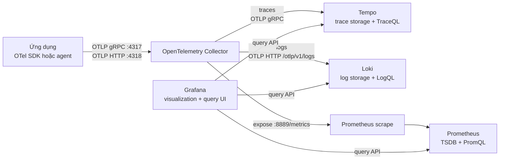
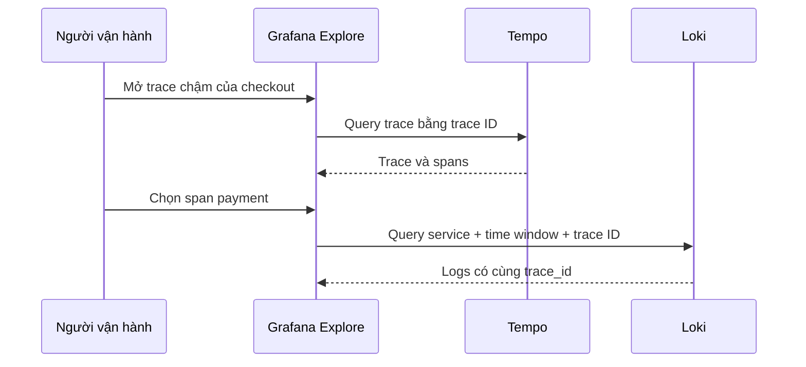

import { File, Files } from 'fumadocs-ui/components/files';

<Callout type="info" title="Grafana không phải kho lưu telemetry">
  Grafana là giao diện visualization và query. Tempo lưu và truy vấn traces,
  Prometheus lưu và truy vấn metrics, còn Loki lưu và truy vấn logs. Nếu ba
  backend dừng hoặc dữ liệu đã hết retention, dashboard Grafana không thể tự
  khôi phục telemetry.
</Callout>

## Mục lục

- [Vai trò của từng thành phần](#vai-trò-của-từng-thành-phần)
  - [Grafana](#grafana)
  - [Tempo](#tempo)
  - [Prometheus](#prometheus)
  - [Loki](#loki)
  - [OpenTelemetry Collector](#opentelemetry-collector)
- [Luồng traces metrics và logs](#luồng-traces-metrics-và-logs)
  - [Traces](#traces)
  - [Metrics](#metrics)
  - [Logs](#logs)
- [Correlation contract](#correlation-contract)
  - [Resource và service attributes nhất quán](#resource-và-service-attributes-nhất-quán)
  - [Trace ID nối traces với logs](#trace-id-nối-traces-với-logs)
  - [Exemplar nối metrics với traces](#exemplar-nối-metrics-với-traces)
- [Dựng local stack bằng Docker Compose](#dựng-local-stack-bằng-docker-compose)
  - [Cấu trúc file](#cấu-trúc-file)
  - [Docker Compose](#docker-compose)
  - [Collector](#collector)
  - [Tempo local](#tempo-local)
  - [Loki local](#loki-local)
  - [Prometheus local](#prometheus-local)
  - [Provision data sources cho Grafana](#provision-data-sources-cho-grafana)
- [Khởi động và tạo canary telemetry](#khởi-động-và-tạo-canary-telemetry)
  - [Validate và khởi động](#validate-và-khởi-động)
  - [Gửi ba signal bằng telemetrygen](#gửi-ba-signal-bằng-telemetrygen)
  - [Cấu hình một ứng dụng thật](#cấu-hình-một-ứng-dụng-thật)
- [Explore và xác minh từng signal](#explore-và-xác-minh-từng-signal)
  - [Xác minh metrics trong Prometheus](#xác-minh-metrics-trong-prometheus)
  - [Xác minh traces trong Tempo](#xác-minh-traces-trong-tempo)
  - [Xác minh logs trong Loki](#xác-minh-logs-trong-loki)
  - [Xác minh correlation](#xác-minh-correlation)
- [Failure modes thường gặp](#failure-modes-thường-gặp)
- [Production considerations](#production-considerations)
  - [Storage retention và tính sẵn sàng](#storage-retention-và-tính-sẵn-sàng)
  - [Bảo mật và multitenancy](#bảo-mật-và-multitenancy)
  - [Độ tin cậy chi phí và vận hành Collector](#độ-tin-cậy-chi-phí-và-vận-hành-collector)
- [Nguồn tham khảo chính thức](#nguồn-tham-khảo-chính-thức)
- [Tài liệu liên quan](#tài-liệu-liên-quan)

## Vai trò của từng thành phần

“Grafana stack” không phải một binary duy nhất. Đó là cách ghép nhiều thành phần
có data model và query language khác nhau.

### Grafana

Grafana kết nối đến **data sources**, tức các API query bên ngoài. Trong trang
này, ba data sources là Prometheus, Tempo và Loki.

Grafana cung cấp:

- Explore để query tương tác;
- dashboards và panels;
- alerting UI nếu được cấu hình với rule engine phù hợp;
- data links để nhảy giữa signal;
- authentication và authorization ở lớp UI.

Grafana không nhận OTLP thay cho Collector trong topology này. Nó cũng không lưu
các time series, trace blocks hoặc log chunks. Database nội bộ của Grafana lưu
users, dashboards, data source settings và metadata UI, không phải application
telemetry.

### Tempo

Tempo là trace backend. Nó ingest spans, nhóm spans theo trace ID, lưu trace
blocks và hỗ trợ query bằng **TraceQL**, ngôn ngữ truy vấn traces của Tempo.

Trong local stack, Tempo chạy monolithic, nghĩa là các vai trò ingest, storage và
query nằm trong một process. Dữ liệu nằm trên filesystem local. Cấu hình này phù
hợp để học, không phải mô hình HA production.

### Prometheus

Prometheus là metrics backend và time-series database. Nó scrape endpoint
Prometheus do Collector mở, lưu samples vào TSDB và query bằng PromQL.

Prometheus không lưu traces hay logs. Một metric exemplar có thể chứa trace ID để
Grafana mở trace tương ứng trong Tempo, nhưng exemplar không biến Prometheus
thành trace store.

### Loki

Loki là logs backend. Nó index một tập labels và lưu log content cùng structured
metadata. **Structured metadata** là metadata gắn với từng log entry nhưng không
nhất thiết tham gia index như label.

Loki có OTLP/HTTP ingest endpoint cho logs. Collector phải dùng `otlp_http`
exporter đến base path `/otlp`; exporter tự nối signal path `/v1/logs`.

### OpenTelemetry Collector

Collector là telemetry gateway giữa ứng dụng và các backends. Trong stack này,
nó:

1. nhận cả ba signal qua OTLP/gRPC `4317` hoặc OTLP/HTTP `4318`;
2. áp dụng `memory_limiter` và `batch`;
3. export traces bằng OTLP/gRPC đến Tempo;
4. export logs bằng OTLP/HTTP đến Loki;
5. expose metrics tại `:8889/metrics` để Prometheus scrape.

Collector không thay Tempo, Loki hoặc Prometheus làm kho lưu dài hạn. Queue và
WAL của exporter, nếu bật, chỉ bảo vệ delivery trong một khoảng giới hạn.

## Luồng traces metrics và logs



Mỗi mũi tên có protocol và ownership khác nhau. Đây là điểm cần giữ rõ khi
troubleshoot: Collector push traces/logs, nhưng Prometheus pull metrics.

### Traces

```text
Application span
  → OTLP receiver trong Collector
  → traces pipeline
  → otlp_grpc/tempo exporter
  → Tempo distributor
  → Tempo storage
  → Grafana Tempo data source
```

Tempo nhận OTLP trên mạng nội bộ Compose tại `tempo:4317`. Port HTTP `3200` là
API query/health cho Grafana và người vận hành; nó không phải OTLP/gRPC ingest
port.

### Metrics

```text
Application measurement
  → OTel SDK aggregation
  → OTLP receiver trong Collector
  → metrics pipeline
  → prometheus exporter mở collector:8889/metrics
  ← Prometheus scrape
  → Prometheus TSDB
  → Grafana Prometheus data source
```

`prometheus` exporter không gửi metrics đến `prometheus:9090`. Prometheus chủ
động gọi `GET http://collector:8889/metrics`. Xem [Prometheus và
OpenTelemetry](/protocols-backends/prometheus/) để hiểu temporality, naming và
Resource mapping chi tiết.

### Logs

```text
Application LogRecord
  → OTLP receiver trong Collector
  → logs pipeline
  → otlp_http/loki exporter
  → http://loki:3100/otlp/v1/logs
  → Loki chunks + index + structured metadata
  → Grafana Loki data source
```

Loki 3 bật structured metadata theo mặc định, nhưng local config vẫn khai báo
`allow_structured_metadata: true` để intent rõ ràng. OTLP Resource attribute
`service.name` được chuẩn hóa thành label `service_name` khi query Loki; dấu `.`
trong attribute key trở thành `_`.

<Callout type="warn" title="Đừng dùng Loki exporter cũ cho OTLP logs">
  Với Loki OTLP ingest hiện hành, dùng Collector `otlp_http` exporter. Base
  endpoint là `http://loki:3100/otlp`; không tự thêm `/v1/logs` nếu exporter đã
  quản lý signal path.
</Callout>

## Correlation contract

**Correlation** là khả năng đi từ một record ở signal này đến records liên quan ở
signal khác bằng khóa chung. Grafana chỉ tạo data links tốt khi telemetry và data
sources đã bảo toàn các khóa đó.

### Resource và service attributes nhất quán

Cùng một service instance phải dùng cùng Resource trên TracerProvider,
MeterProvider và LoggerProvider. Bộ tối thiểu thực dụng:

```text
service.namespace=shop
service.name=checkout
service.instance.id=checkout-pod-7f9c
service.version=2.4.1
deployment.environment.name=production
```

Vai trò của từng field:

| Resource attribute | Dùng để làm gì | Lưu ý |
| --- | --- | --- |
| `service.name` | Chọn cùng service trong metrics, traces và logs | Bắt buộc đặt rõ; tránh `unknown_service` |
| `service.namespace` | Phân biệt các hệ thống có service trùng tên | Prometheus `job` có thể thành `namespace/name` |
| `service.instance.id` | Phân biệt writers chạy đồng thời | Cardinality cao; Loki production thường nên để structured metadata thay vì index label |
| `service.version` | Khoanh vùng regression theo release | Dùng version artifact, không dùng timestamp tùy ý |
| `deployment.environment.name` | Tách local, staging và production | Dùng key hiện hành và giá trị hữu hạn |

Tên vật lý sau ingest khác nhau:

| Nghĩa OTel | Prometheus | Tempo TraceQL | Loki LogQL |
| --- | --- | --- | --- |
| Service name | `job` hoặc label được promote | `resource.service.name` | `service_name` |
| Environment | `deployment_environment_name` trên `target_info` hoặc series được promote | `resource.deployment.environment.name` | `deployment_environment_name` |
| Instance | `instance` | `resource.service.instance.id` | `service_instance_id` nếu được giữ |

Đây là mapping, không phải lý do để đổi Resource key trong ứng dụng. Ứng dụng vẫn
phát semantic convention chuẩn; adapter ingest và query dùng tên vật lý của từng
backend.

### Trace ID nối traces với logs

Một log được emit trong active span có thể mang top-level `TraceId` và `SpanId`.
Tempo dùng trace ID để lấy cả trace. Loki lưu trace fields từ OTLP dưới structured
metadata, cho phép query exact ID nếu mapping và retention còn dữ liệu.

Luồng điều tra:



Trace ID là bằng chứng trực tiếp cho cùng execution. `service.name` và time window
thu hẹp query, nhưng timestamp gần nhau không tự chứng minh hai records thuộc
cùng request.

### Exemplar nối metrics với traces

Một histogram hoặc counter measurement được record trong active sampled span có
thể tạo **exemplar**, tức sample đại diện chứa trace ID và span ID. Collector
Prometheus exporter trong bài bật OpenMetrics để bảo toàn exemplar; Prometheus
được bật exemplar storage; Grafana Prometheus data source biết trace ID sẽ mở ở
Tempo data source.

```text
PromQL latency panel
  → exemplar trace_id
  → Tempo trace
  → span gây chậm
  → Loki logs có cùng trace_id và span_id
```

Không phải mọi metric point đều có exemplar. Trace có thể unsampled, reservoir có
thể không chọn measurement, hoặc trace đã hết retention. Correlation UI phải xử
lý “không tìm thấy trace” thay vì coi link luôn tồn tại.

## Dựng local stack bằng Docker Compose

Stack dưới đây đủ để ingest, lưu và query ba signal trên một máy. Nó pin version
để kết quả tái lập được. Hãy tạo trong một thư mục tạm, không cần thêm file vào
repository này:

```bash
mkdir -p /tmp/otel-grafana-stack
cd /tmp/otel-grafana-stack
```

<Callout type="error" title="Chỉ dùng local">
  Stack bật anonymous Admin trong Grafana, không có TLS, không có
  authentication ở Collector/backends và dùng single-process local storage.
  Các port chỉ bind `127.0.0.1`; không expose cấu hình này ra Internet.
</Callout>

### Cấu trúc file

<Files>
  <File name="docker-compose.yaml" />
  <File name="otelcol.yaml" />
  <File name="tempo.yaml" />
  <File name="loki.yaml" />
  <File name="prometheus.yml" />
  <File name="grafana-datasources.yml" />
</Files>

### Docker Compose

Tạo `docker-compose.yaml`:

```yaml
services:
  collector:
    image: ghcr.io/open-telemetry/opentelemetry-collector-releases/opentelemetry-collector-contrib:0.157.0
    command: ["--config=/etc/otelcol-contrib/config.yaml"]
    volumes:
      - ./otelcol.yaml:/etc/otelcol-contrib/config.yaml:ro
    depends_on:
      - tempo
      - loki
    ports:
      - "127.0.0.1:4317:4317"
      - "127.0.0.1:4318:4318"
      - "127.0.0.1:8889:8889"

  tempo:
    image: grafana/tempo:3.0.2
    command: ["-config.file=/etc/tempo.yaml"]
    volumes:
      - ./tempo.yaml:/etc/tempo.yaml:ro
      - tempo-data:/var/tempo
    ports:
      - "127.0.0.1:3200:3200"

  loki:
    image: grafana/loki:3.7.4
    command: ["-config.file=/etc/loki/local-config.yaml"]
    volumes:
      - ./loki.yaml:/etc/loki/local-config.yaml:ro
      - loki-data:/loki
    ports:
      - "127.0.0.1:3100:3100"

  prometheus:
    image: prom/prometheus:v3.13.1
    command:
      - "--config.file=/etc/prometheus/prometheus.yml"
      - "--storage.tsdb.path=/prometheus"
      - "--enable-feature=exemplar-storage"
    volumes:
      - ./prometheus.yml:/etc/prometheus/prometheus.yml:ro
      - prometheus-data:/prometheus
    depends_on:
      - collector
    ports:
      - "127.0.0.1:9090:9090"

  grafana:
    image: grafana/grafana:13.1.1
    environment:
      GF_AUTH_ANONYMOUS_ENABLED: "true"
      GF_AUTH_ANONYMOUS_ORG_ROLE: Admin
      GF_AUTH_DISABLE_LOGIN_FORM: "true"
    volumes:
      - ./grafana-datasources.yml:/etc/grafana/provisioning/datasources/otel.yml:ro
      - grafana-data:/var/lib/grafana
    depends_on:
      - prometheus
      - tempo
      - loki
    ports:
      - "127.0.0.1:3000:3000"

  telemetrygen:
    image: ghcr.io/open-telemetry/opentelemetry-collector-contrib/telemetrygen:0.157.0
    profiles: ["tools"]
    depends_on:
      - collector

volumes:
  tempo-data:
  loki-data:
  prometheus-data:
  grafana-data:
```

Service `telemetrygen` nằm trong profile `tools`, nên `docker compose up -d`
không chạy nó liên tục. Ta chỉ gọi nó bằng `docker compose run --rm` để tạo
canary có giới hạn.

### Collector

Tạo `otelcol.yaml`:

```yaml
receivers:
  otlp:
    protocols:
      grpc:
        endpoint: 0.0.0.0:4317
      http:
        endpoint: 0.0.0.0:4318

processors:
  memory_limiter:
    check_interval: 1s
    limit_mib: 256
    spike_limit_mib: 64
  batch:
    timeout: 1s

exporters:
  otlp_grpc/tempo:
    endpoint: tempo:4317
    tls:
      insecure: true

  otlp_http/loki:
    endpoint: http://loki:3100/otlp

  prometheus:
    endpoint: 0.0.0.0:8889
    enable_open_metrics: true
    translation_strategy: UnderscoreEscapingWithSuffixes
    metric_expiration: 5m

service:
  pipelines:
    traces:
      receivers: [otlp]
      processors: [memory_limiter, batch]
      exporters: [otlp_grpc/tempo]
    metrics:
      receivers: [otlp]
      processors: [memory_limiter, batch]
      exporters: [prometheus]
    logs:
      receivers: [otlp]
      processors: [memory_limiter, batch]
      exporters: [otlp_http/loki]
```

`tls.insecure: true` chỉ áp dụng cho OTLP/gRPC nội bộ đến Tempo trong lab. Nó
không có nghĩa là Collector bỏ qua TLS ở mọi exporter. Production phải cấu hình
CA, server name, mTLS hoặc workload identity theo trust boundary.

### Tempo local

Tạo `tempo.yaml` theo monolithic mode hiện hành:

```yaml
stream_over_http_enabled: true

server:
  http_listen_port: 3200
  log_level: info

distributor:
  receivers:
    otlp:
      protocols:
        grpc:
          endpoint: 0.0.0.0:4317
        http:
          endpoint: 0.0.0.0:4318

storage:
  trace:
    backend: local
    wal:
      path: /var/tempo/wal
    local:
      path: /var/tempo/blocks

usage_report:
  reporting_enabled: false
```

Collector dùng DNS `tempo:4317`. Port `4317` không publish ra host vì ứng dụng
phải gửi qua Collector, không bypass gateway. `3200` được publish để bạn có thể
kiểm tra API; Grafana vẫn dùng URL nội bộ `http://tempo:3200`.

### Loki local

Tạo `loki.yaml`:

```yaml
auth_enabled: false

server:
  http_listen_port: 3100
  grpc_listen_port: 9096
  log_level: info

common:
  instance_addr: 127.0.0.1
  path_prefix: /loki
  storage:
    filesystem:
      chunks_directory: /loki/chunks
      rules_directory: /loki/rules
  replication_factor: 1
  ring:
    kvstore:
      store: inmemory

schema_config:
  configs:
    - from: 2024-01-01
      store: tsdb
      object_store: filesystem
      schema: v13
      index:
        prefix: index_
        period: 24h

limits_config:
  allow_structured_metadata: true

analytics:
  reporting_enabled: false
```

Schema v13 và structured metadata là yêu cầu phù hợp cho OTLP log mapping. Local
filesystem cùng in-memory ring không cung cấp replication hoặc multi-tenant
isolation.

### Prometheus local

Tạo `prometheus.yml`:

```yaml
global:
  scrape_interval: 5s
  evaluation_interval: 5s

scrape_configs:
  - job_name: otel-via-collector
    honor_labels: true
    static_configs:
      - targets: ["collector:8889"]
```

Prometheus scrape exporter endpoint của Collector. `honor_labels: true` giữ
`job` và `instance` mà exporter tạo từ Resource. Nếu bỏ tùy chọn này, Prometheus
mặc định dùng scrape job/target cho hai labels và đổi labels từ payload thành
`exported_job`/`exported_instance`. Vì vậy, query theo `job="shop/checkout"`
trong bài phụ thuộc chủ đích vào `honor_labels: true`.

### Provision data sources cho Grafana

Tạo `grafana-datasources.yml`:

```yaml
apiVersion: 1

prune: true

datasources:
  - name: Prometheus
    uid: prometheus
    type: prometheus
    access: proxy
    url: http://prometheus:9090
    isDefault: true
    editable: false
    jsonData:
      httpMethod: POST
      prometheusType: Prometheus
      prometheusVersion: 3.13.1
      exemplarTraceIdDestinations:
        - name: trace_id
          datasourceUid: tempo

  - name: Loki
    uid: loki
    type: loki
    access: proxy
    url: http://loki:3100
    editable: false

  - name: Tempo
    uid: tempo
    type: tempo
    access: proxy
    url: http://tempo:3200
    editable: false
    jsonData:
      httpMethod: GET
      streamingEnabled:
        search: true
        metrics: true
      tracesToLogsV2:
        datasourceUid: loki
        spanStartTimeShift: -1m
        spanEndTimeShift: 1m
        tags:
          - key: service.name
            value: service_name
        filterByTraceID: true
        filterBySpanID: true
```

Các URL là DNS nội bộ Compose vì Grafana server gọi backend theo `access: proxy`.
`http://localhost:9090` trong file provisioning sẽ trỏ vào container Grafana,
không phải container Prometheus.

`tracesToLogsV2` yêu cầu Loki thật sự có trace ID/span ID trên log records. Nếu
logging bridge không ghi context hoặc log được emit ngoài active span, data link
đúng cấu hình vẫn trả rỗng.

## Khởi động và tạo canary telemetry

### Validate và khởi động

Kiểm tra Compose cùng hai config có validator sẵn:

```bash
docker compose config
docker compose run --rm collector validate --config=/etc/otelcol-contrib/config.yaml
docker compose run --rm --entrypoint promtool prometheus check config /etc/prometheus/prometheus.yml
```

Tempo, Loki và Grafana validate lúc startup. Khởi động rồi xem trạng thái:

```bash
docker compose up -d
docker compose ps
docker compose logs --tail=100 collector tempo loki prometheus grafana
```

Kiểm tra HTTP endpoints:

```bash
curl --fail http://localhost:3200/ready
curl --fail http://localhost:3100/ready
curl --fail http://localhost:9090/-/ready
curl --fail http://localhost:3000/api/health
curl --fail http://localhost:8889/metrics >/dev/null
```

Một endpoint ready chỉ chứng minh process hoặc component tương ứng sẵn sàng. Nó
không chứng minh telemetry đã đi qua đủ pipeline và có thể query.

### Gửi ba signal bằng telemetrygen

`telemetrygen` là utility alpha của OpenTelemetry Collector Contrib dùng để tạo
dữ liệu test. Các lệnh sau gửi canary qua OTLP/gRPC nội bộ:

```bash
docker compose run --rm telemetrygen traces \
  --otlp-endpoint collector:4317 \
  --otlp-insecure \
  --service checkout \
  --otlp-attributes 'service.namespace="shop"' \
  --otlp-attributes 'deployment.environment.name="local"' \
  --duration 5s \
  --rate 2

docker compose run --rm telemetrygen metrics \
  --otlp-endpoint collector:4317 \
  --otlp-insecure \
  --service checkout \
  --otlp-attributes 'service.namespace="shop"' \
  --otlp-attributes 'deployment.environment.name="local"' \
  --duration 15s \
  --rate 2

docker compose run --rm telemetrygen logs \
  --otlp-endpoint collector:4317 \
  --otlp-insecure \
  --service checkout \
  --otlp-attributes 'service.namespace="shop"' \
  --otlp-attributes 'deployment.environment.name="local"' \
  --duration 5s \
  --rate 2
```

Metrics chạy lâu hơn một scrape interval để Prometheus có nhiều samples. Chờ
thêm khoảng 5–10 giây cho batch, scrape và index trước khi query.

<Callout type="warn" title="Canary ba signal chưa phải correlation test">
  Ba lệnh `telemetrygen` độc lập chứng minh từng pipeline, nhưng logs của lệnh
  thứ ba không thuộc traces của lệnh thứ nhất. Muốn test exact trace-to-log, ứng
  dụng phải emit log trong active span hoặc generator phải cố ý dùng cùng trace
  context.
</Callout>

### Cấu hình một ứng dụng thật

Với SDK hỗ trợ environment variables chuẩn, cấu hình cơ sở qua OTLP/HTTP:

```bash
export OTEL_EXPORTER_OTLP_ENDPOINT=http://localhost:4318
export OTEL_EXPORTER_OTLP_PROTOCOL=http/protobuf
export OTEL_SERVICE_NAME=checkout
export OTEL_RESOURCE_ATTRIBUTES='service.namespace=shop,service.version=2.4.1,deployment.environment.name=local'
```

`service.instance.id` nên được detector hoặc deployment platform đặt duy nhất
cho mỗi instance. Không hard-code cùng một instance ID cho nhiều replicas.

Cấu hình exporter không tự instrument code. Ứng dụng vẫn cần SDK hoặc
auto-instrumentation cho traces/metrics, và logging bridge cho OTLP logs. Để
correlate logs, logger phải emit trong active span và bridge phải chép
`TraceId`, `SpanId`, `TraceFlags` vào LogRecord.

Tạo một request test có route, latency hoặc lỗi biết trước. Ghi lại thời điểm và
trace ID nếu ứng dụng trả nó trong môi trường lab. Đây là fixture để kiểm chứng
không chỉ delivery mà cả semantics.

## Explore và xác minh từng signal

Mở Grafana tại [http://localhost:3000](http://localhost:3000), chọn **Explore**
rồi chọn data source tương ứng. Đặt time range bao gồm lúc chạy canary.

### Xác minh metrics trong Prometheus

Trước tiên kiểm tra scrape target tại
[http://localhost:9090/targets](http://localhost:9090/targets). Target
`collector:8889` phải là `UP`.

Trong Explore với data source Prometheus, bắt đầu rộng:

```text
{job="shop/checkout"}
```

Nếu chưa biết tên metric telemetrygen sau translation:

```text
count by (__name__) ({job="shop/checkout"})
```

Sau đó chọn một Counter và dùng `rate` trên nhiều samples:

```text
rate({__name__=~".*_total", job="shop/checkout"}[1m])
```

Selector rộng chỉ phù hợp cho lab. Production dashboard phải dùng metric name và
labels cụ thể.

Xác minh Resource metadata:

```text
target_info{job="shop/checkout"}
```

Nếu không thấy `job="shop/checkout"`, đọc raw exposition để biết exporter đã ánh
xạ Resource thế nào:

```bash
curl --silent http://localhost:8889/metrics | grep -E 'checkout|telemetrygen' | head
```

### Xác minh traces trong Tempo

Trong Explore, chọn Tempo và dùng TraceQL:

```text
{ resource.service.name = "checkout" }
```

Thu hẹp theo namespace và environment:

```text
{
  resource.service.namespace = "shop" &&
  resource.deployment.environment.name = "local"
}
```

Mở một trace rồi kiểm tra:

- trace có root span và parent-child relationship hợp lý;
- Resource `service.name`, namespace và environment đúng;
- duration cùng timestamps nằm trong time range;
- attributes route, status hoặc error đúng semantics;
- trace ID có 32 ký tự hex và span ID có 16 ký tự hex.

Có thể kiểm tra Tempo trực tiếp bằng trace ID qua API:

```bash
TRACE_ID='<32-ký-tự-hex>'
curl --fail "http://localhost:3200/api/traces/${TRACE_ID}"
```

TraceQL search có thể cần một khoảng ngắn để block hoặc live data sẵn sàng. Exact
trace-by-ID và search theo attributes là hai query path khác nhau; hãy test cả
hai.

### Xác minh logs trong Loki

Trong Explore, chọn Loki và query label đã chuẩn hóa:

```text
{service_name="checkout"}
```

Thu hẹp environment:

```text
{service_name="checkout", deployment_environment_name="local"}
```

Mở chi tiết một log entry và kiểm tra:

- log body không bị rỗng hoặc stringify ngoài dự kiến;
- timestamp là event time hợp lý, không chỉ ingest time;
- Resource và scope fields còn trong labels hoặc structured metadata;
- severity được bảo toàn;
- correlated log từ ứng dụng thật có `trace_id` và `span_id`.

Query exact trace ID trên correlated logs:

```text
{service_name="checkout"} | trace_id = "4bf92f3577b34da6a3ce929d0e0e4736"
```

Tên field vật lý có thể khác nếu bạn tùy biến Loki OTLP mapping. Inspect một log
thật trước rồi chuẩn hóa query contract; đừng đoán tên từ casing của OTLP JSON.

### Xác minh correlation

Dùng ứng dụng thật đã emit logs trong active span, không dùng ba canary độc lập.
Chạy workflow sau:

1. Trong Tempo, tìm trace theo `resource.service.name="checkout"` và mở một span
   có log dự kiến.
2. Sao chép trace ID và span ID.
3. Trong Loki, query `service_name`, exact `trace_id` và cùng time window. Thêm
   `span_id` để chỉ đúng operation.
4. Từ trace view, thử link **Logs for this span** do `tracesToLogsV2` cung cấp.
   Kết quả thủ công và data link phải tương đương.
5. Tạo một Histogram measurement trong active sampled span. Trong Prometheus
   panel, chọn exemplar và xác nhận Grafana mở đúng trace ID ở Tempo.
6. So Resource của metric, trace và log. `service.name`, namespace, version và
   environment phải cùng nghĩa.
7. Quay lại metric để đo phạm vi ảnh hưởng; một trace chỉ là ví dụ, không chứng
   minh toàn bộ service lỗi.

<Callout type="idea" title="Thứ tự debug correlation">
  Xác minh record tồn tại ở từng backend trước. Sau đó xác minh ID và Resource
  fields. Cuối cùng mới debug Grafana data links. Sửa UI trước khi dữ liệu đúng sẽ
  chỉ che failure ở pipeline.
</Callout>

## Failure modes thường gặp

| Triệu chứng | Boundary có thể lỗi | Cách xác minh | Cách xử lý |
| --- | --- | --- | --- |
| Grafana báo data source unreachable | Grafana → backend | `docker compose logs grafana`; curl backend từ container/network | Dùng DNS service như `tempo:3200`, không dùng `localhost` |
| Traces trống nhưng metrics có | Collector traces pipeline hoặc Tempo ingest | Collector exporter errors; Tempo logs; query exact trace ID | Kiểm tra `otlp_grpc/tempo`, port `4317` và TLS mode |
| Logs bị Loki reject | Collector → Loki | Collector logs có HTTP status/body; Loki logs | Dùng `otlp_http`, endpoint `/otlp`, schema v13 và structured metadata |
| Loki URL thành `/v1/logs` sai | Base endpoint thiếu `/otlp` hoặc tự nối path sai | Bật debug logs và xem request path | Đặt base `http://loki:3100/otlp`; để exporter nối `/v1/logs` |
| Prometheus target down | Prometheus → Collector exporter | Prometheus Targets; curl `collector:8889/metrics` | Sửa DNS/port và bảo đảm metrics pipeline kích hoạt exporter |
| `up=1` nhưng không có app metric | App chưa export, batch/collection chưa flush hoặc metric expired | Raw `/metrics`, Collector input logs và SDK diagnostics | Tạo traffic; chờ interval; gọi shutdown/flush đúng vòng đời |
| Trace search rỗng nhưng trace-by-ID có | Search index/live block chưa sẵn sàng hoặc query/time range sai | Query exact ID và nới time range | Chờ flush/index; sửa TraceQL và clock |
| Log không có trace ID | Logger emit ngoài active span hoặc bridge/parser làm mất context | So source LogRecord, Collector và Loki metadata | Cấu hình logging bridge; giữ active Context khi emit |
| Tempo-to-Loki link trả rỗng | Sai tag mapping, time shift hoặc log không có IDs | Chạy LogQL thủ công bằng exact IDs | Sửa `tracesToLogsV2`; đo ingest delay; nới window có chủ đích |
| Metric exemplar không mở trace | Exemplar thiếu ID, trace unsampled/hết retention hoặc UID data source sai | Inspect OpenMetrics exemplar và Tempo exact ID | Bật exemplar end-to-end; căn retention; sửa datasource UID |
| Service tên khác nhau giữa signal | Ba providers dùng Resource khác nhau | Group/query Resource ở cả ba backend | Tạo final Resource một lần và dùng chung |
| Loki cardinality tăng mạnh | Pod/instance/request ID bị index thành labels | Loki label cardinality và OTLP mapping | Chỉ index labels hữu hạn; để ID ở structured metadata |
| Prometheus series tăng mạnh | Copy mọi Resource/metric attribute vào labels | Active series, `target_info` và config diff | Allow-list dimensions; không dùng trace/user/order ID |
| Dữ liệu mất sau `docker compose down -v` | Named volumes đã bị xóa | Kiểm tra command history và volumes | Không dùng `-v` nếu cần giữ lab data; production dùng storage bền vững |
| Collector OOM hoặc refused data | Burst vượt memory/queue và backend chậm | Collector internal metrics và refused/exporter counters | Đặt memory limits, queue/WAL, scale và backpressure policy |
| Dữ liệu ở sai tenant | Thiếu hoặc sai tenant header/routing | Backend audit/logs và exporter headers | Chuẩn hóa tenant routing; không cho caller tùy ý chọn tenant |

## Production considerations

Local stack cố ý bỏ nhiều lớp bắt buộc của production. Đừng chỉ tăng replica count
của Compose rồi gọi đó là HA.

### Storage retention và tính sẵn sàng

**Tempo:**

- dùng object storage được hỗ trợ thay vì local filesystem cho trace blocks;
- chọn monolithic hoặc distributed mode theo tải và yêu cầu vận hành;
- thiết kế replication, compaction, WAL, query limits và retention;
- cân bằng trace sampling với khả năng điều tra và chi phí;
- theo dõi dropped spans, oversized traces và attribute truncation.

**Prometheus:**

- tính retention, disk, active series, ingestion rate và query load;
- dùng HA pairs cùng deduplication ở tầng phù hợp nếu cần;
- dùng remote storage khi retention/quy mô vượt một Prometheus đơn;
- quản lý recording rules, alerts và out-of-order policy như code;
- backup/ruler strategy phải khớp RPO và RTO, không chỉ backup dashboard.

**Loki:**

- dùng object storage, compactor và retention policy đã kiểm thử;
- giữ labels có cardinality thấp, đưa metadata chi tiết vào structured metadata;
- cấu hình ingestion/query limits để một tenant không làm cạn tài nguyên;
- thiết kế replication, index gateway/cache theo deployment mode;
- kiểm thử log deletion, legal hold và PII policy nếu có yêu cầu.

**Grafana:**

- backup database cấu hình, dashboards và provisioning source;
- chạy HA nếu UI là công cụ on-call trọng yếu;
- pin plugin/version và test data source schema khi nâng cấp;
- nhớ rằng backup Grafana không backup Tempo, Prometheus hoặc Loki data.

### Bảo mật và multitenancy

- Bật TLS hoặc mTLS trên OTLP ingress và backend connections.
- Dùng authenticator hoặc gateway được hỗ trợ; không expose Collector receiver mở
  ra Internet.
- Tách tenants bằng cơ chế backend chính thức và inject tenant header tại boundary
  tin cậy. Không tin tenant ID do client tùy ý gửi.
- Giới hạn token theo signal, tenant và operation ingest/query.
- Dùng network policy để ứng dụng chỉ reach Collector, Grafana chỉ reach query
  APIs và Collector chỉ reach ingest APIs cần thiết.
- Quản lý data source credentials bằng secret manager hoặc
  `secureJsonData`; không commit token vào provisioning YAML.
- Thiết kế Grafana RBAC/data source permissions. Quyền xem dashboard không mặc
  nhiên nên cho phép query mọi log chứa PII.
- Redact secrets và PII trước storage. Processor phía Collector là lớp bảo vệ bổ
  sung, không thay input validation và application policy.
- Tắt anonymous access và anonymous Admin ngoài local lab.

### Độ tin cậy chi phí và vận hành Collector

- Dùng `memory_limiter` sớm và `batch` gần cuối pipeline. Tuning từ tải đo được,
  không sao chép limit của lab.
- Bật sending queue, retry và persistent queue/WAL khi exporter hỗ trợ và loss
  budget yêu cầu. Queue hữu hạn cần alert trên fill ratio và dropped data.
- Chọn agent/gateway topology; tránh một gateway đơn thành single point of
  failure.
- Với stateful conversion như delta-to-cumulative, route cùng stream đến cùng
  logical owner hoặc dùng cơ chế state phù hợp.
- Áp dụng tail sampling chỉ khi hiểu trace completeness, latency và state cost.
  Head sampling ở SDK vẫn cần cho overload protection.
- Đặt cardinality budgets cho metrics, Loki labels và indexed trace attributes.
  Ba backend có cost model khác nhau.
- Căn retention để correlation không tạo dead link thường xuyên. Ví dụ exemplar
  metrics 30 ngày nhưng traces 24 giờ sẽ không mở được trace cũ.
- Quan sát Collector bằng internal metrics, logs và traces. Alert trên accepted,
  refused, dropped, queue, retries, exporter latency và backend throttling.
- Dùng canary ba signal và một correlation canary trong CI/staging. Health check
  riêng lẻ không đủ.
- Pin versions và distribution. Validate config, đọc migration notes và có
  rollback khi Tempo/Loki schema, Collector component hoặc Grafana data source
  thay đổi.

<Callout type="warn" title="Service graph không tự xuất hiện">
  Tempo service graph hoặc RED metrics cần metrics-generator hay một connector
  span-to-metrics được cấu hình, rồi phải ghi kết quả vào Prometheus-compatible
  storage. Chỉ lưu traces trong Tempo và thêm Prometheus data source chưa tạo ra
  service graph metrics.
</Callout>

## Nguồn tham khảo chính thức

- [OpenTelemetry Collector configuration](https://opentelemetry.io/docs/collector/configuration/) — receivers, processors, exporters và ba signal pipelines.
- [OTLP specification](https://opentelemetry.io/docs/specs/otlp/) — protocol, signal endpoints và delivery semantics.
- [OpenTelemetry Resource semantic conventions](https://opentelemetry.io/docs/specs/semconv/resource/) — service, deployment, container và Kubernetes attributes.
- [OpenTelemetry Logs Data Model](https://opentelemetry.io/docs/specs/otel/logs/data-model/) — Resource, `TraceId`, `SpanId`, timestamps và severity.
- [Grafana Tempo configuration](https://grafana.com/docs/tempo/latest/configuration/) — OTLP receivers, local/object storage, monolithic và distributed mode.
- [Tempo Docker Compose examples](https://github.com/grafana/tempo/tree/main/example/docker-compose) — cấu hình single-binary và provisioning được duy trì cùng Tempo.
- [Loki ingest OpenTelemetry logs](https://grafana.com/docs/loki/latest/send-data/otel/) — `otlphttp`, `/otlp`, structured metadata và Resource-to-label mapping.
- [Loki configuration](https://grafana.com/docs/loki/latest/configure/) — schema, storage, limits, multitenancy và OTLP mapping.
- [Prometheus configuration](https://prometheus.io/docs/prometheus/latest/configuration/configuration/) — scrape jobs, TSDB và server behavior.
- [Grafana data source provisioning](https://grafana.com/docs/grafana/latest/administration/provisioning/#data-sources) — provisioning YAML, proxy access và secret handling.
- [Grafana Tempo data source](https://grafana.com/docs/grafana/latest/datasources/tempo/) — TraceQL, traces-to-logs, service maps và node graph options.
- [OpenTelemetry telemetrygen](https://github.com/open-telemetry/opentelemetry-collector-contrib/tree/main/cmd/telemetrygen) — canary generator cho traces, metrics và logs.

Các tag trong lab là một bộ version đã pin tại thời điểm viết. Trước khi nâng,
đối chiếu tài liệu đúng version và release notes của từng component.

## Tài liệu liên quan

<Cards>
  <Card title="Signal correlation" href="/signals/correlation/" description="Thiết kế Resource, trace ID, exemplars và workflow điều tra xuyên signal." />
  <Card title="Prometheus" href="/protocols-backends/prometheus/" description="Hiểu pull, push, temporality, histogram, naming và cardinality." />
  <Card title="OTLP" href="/protocols-backends/otlp/" description="Hiểu protocol chung giữa ứng dụng, Collector và backends." />
  <Card title="Exemplars" href="/signals/exemplars/" description="Nối metric measurement với trace đại diện." />
  <Card title="Logs" href="/signals/logs/" description="Thiết kế LogRecord có timestamp, severity, Resource và trace context." />
  <Card title="Production readiness" href="/production/production-readiness/" description="Đánh giá security, reliability, cost, ownership và rollback trước production." />
</Cards>
