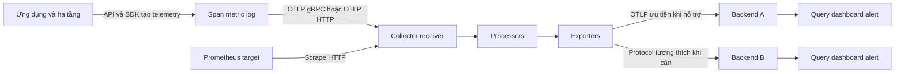

Một hệ thống quan sát được không kết thúc khi ứng dụng tạo ra span, metric hoặc
log. Dữ liệu còn phải được mã hóa, vận chuyển, xử lý, lưu trữ và truy vấn. Nhóm
bài này giải thích các ranh giới đó để bạn chọn protocol và backend mà không gắn
instrumentation vào một sản phẩm cụ thể.

<Callout type="info" title="Phạm vi của nhóm">
  OpenTelemetry chuẩn hóa cách tạo, mô tả, thu thập và xuất telemetry. Nó không
  phải backend lưu trữ hoặc giao diện truy vấn. Vì vậy, ingest bằng OTLP là một
  nền tảng tốt cho tính di động, nhưng không tự làm cho query, dashboard và alert
  portable giữa các backend.
</Callout>

## Mục lục

- [Mental model bốn lớp](#mental-model-bốn-lớp)
- [Bản đồ luồng telemetry](#bản-đồ-luồng-telemetry)
- [Điều kiện tiên quyết](#điều-kiện-tiên-quyết)
- [Kết quả học tập](#kết-quả-học-tập)
- [Bản đồ nội dung](#bản-đồ-nội-dung)
- [Lộ trình đọc đề xuất](#lộ-trình-đọc-đề-xuất)
- [Bài thực hành từ ứng dụng đến Collector](#bài-thực-hành-từ-ứng-dụng-đến-collector)
  - [Mục tiêu và cấu hình](#mục-tiêu-và-cấu-hình)
  - [Chạy và xác minh](#chạy-và-xác-minh)
  - [Thay debug bằng backend](#thay-debug-bằng-backend)
- [Checklist hiểu toàn nhóm](#checklist-hiểu-toàn-nhóm)
- [Sai lầm thường gặp](#sai-lầm-thường-gặp)
- [Nguồn chính thức](#nguồn-chính-thức)
- [Bài liên quan](#bài-liên-quan)

## Mental model bốn lớp

Bốn khái niệm sau thường xuất hiện cạnh nhau nhưng không đồng nghĩa.

| Lớp | Câu hỏi nó trả lời | Ví dụ | Không nên nhầm với |
| --- | --- | --- | --- |
| **Protocol** | Dữ liệu có hình dạng gì và hai đầu trao đổi theo quy tắc nào? | OTLP, Prometheus Remote Write, Zipkin API | Cổng mạng hoặc sản phẩm lưu trữ |
| **Transport** | Bytes đi qua kết nối nào? | gRPC trên HTTP/2, HTTP với Protobuf | Data model hoặc query language |
| **Collector** | Thành phần trung gian nhận, xử lý và xuất dữ liệu ra sao? | OpenTelemetry Collector chạy dạng agent hoặc gateway | Backend lưu trữ dài hạn |
| **Backend** | Dữ liệu được index, lưu, truy vấn, tương quan và hiển thị ở đâu? | Một hệ thống self-hosted hoặc dịch vụ managed | SDK hay Collector |

**Protocol** là hợp đồng trao đổi. OTLP, viết tắt của OpenTelemetry Protocol, định
nghĩa schema Protobuf cùng cơ chế export request/response cho telemetry.

**Transport** là phương tiện chở hợp đồng đó. Cùng OTLP có thể chạy qua gRPC hoặc
HTTP. Vì vậy, `OTLP/gRPC` và `OTLP/HTTP` dùng chung data model nhưng khác endpoint,
port mặc định, framing và cách biểu diễn lỗi.

**Collector** là proxy telemetry độc lập với vendor. Nó có thể nhận OTLP, scrape
metrics kiểu Prometheus, xử lý dữ liệu rồi fan-out — gửi một đầu vào đến nhiều
đích. Collector không bắt buộc trong mọi pipeline, nhưng tạo một ranh giới hữu
ích để ứng dụng không giữ credential hoặc API riêng của backend.

**Backend** chịu trách nhiệm ingest, storage và trải nghiệm phân tích. Một backend
có thể nhận OTLP trực tiếp hoặc chỉ nhận qua adapter/exporter. Việc nhận được OTLP
không chứng minh backend bảo toàn mọi signal, field, temporality, exemplar hoặc
quan hệ correlation.

<Callout type="idea" title="Câu hỏi chẩn đoán nhanh">
  Khi dữ liệu không xuất hiện, hãy hỏi theo thứ tự: ứng dụng có tạo telemetry
  không, exporter có mã hóa đúng protocol không, transport có đến được receiver
  không, Collector có drop hoặc route sai không, và backend có ingest vào đúng
  tenant không. Đừng bắt đầu bằng dashboard.
</Callout>

## Bản đồ luồng telemetry

Sơ đồ sau tách data plane — đường dữ liệu chạy — khỏi nơi con người truy vấn:



Đường phổ biến là `SDK → OTLP → Collector → OTLP → backend`. Đây không phải luật
bắt buộc. Prometheus thường dùng mô hình pull, nghĩa là hệ thống thu thập chủ động
scrape endpoint metrics. Jaeger và Zipkin vừa là tên hệ sinh thái/backend, vừa gắn
với các protocol tracing lịch sử. Hãy xác định rõ bạn đang nói về định dạng ingest
hay sản phẩm backend.

Một request thành công ở từng hop chỉ xác nhận hop đó đã chấp nhận request. Theo
OTLP, bảo đảm giao nhận end-to-end qua nhiều hop nằm ngoài phạm vi protocol. Queue,
retry, sampling, filtering, outage và retention vẫn có thể làm dữ liệu thiếu ở
backend.

## Điều kiện tiên quyết

Bạn nên hoàn thành hoặc nắm được các nội dung sau:

- [Kiến trúc OpenTelemetry](/fundamentals/architecture/): trách nhiệm của API,
  SDK, Collector và backend.
- [Tổng quan signals](/fundamentals/signals-overview/): traces, metrics và logs
  trả lời các loại câu hỏi khác nhau.
- [Telemetry pipeline](/fundamentals/telemetry-pipeline/): đường đi từ
  instrumentation tới export.
- [Tổng quan Collector](/collector/overview/): receiver, processor, exporter và
  topology agent/gateway.
- Kiến thức cơ bản về DNS, HTTP, TLS và container hoặc process local.

Bạn không cần cài một backend thương mại để bắt đầu. `debug` exporter của
Collector đủ để kiểm chứng ranh giới protocol và transport trong bài thực hành
bên dưới.

## Kết quả học tập

Sau khi hoàn thành nhóm bài, bạn có thể:

- phân biệt protocol, transport, Collector và backend trong một sơ đồ triển khai;
- giải thích vì sao OTLP thường là ranh giới ingest ưu tiên cho telemetry mới;
- chọn OTLP/gRPC hoặc OTLP/HTTP theo môi trường mạng thay vì theo cảm tính;
- nhận diện khi Prometheus, Jaeger hoặc Zipkin là protocol tương thích, backend,
  hoặc cả một hệ sinh thái;
- kiểm tra một signal có được bảo toàn qua chuyển đổi protocol hay không;
- xác minh traces, metrics và logs riêng biệt ở từng hop;
- đánh giá backend bằng bằng chứng PoC thay vì danh sách tính năng marketing;
- lập kế hoạch chuyển đổi backend mà không giả định query, dashboard và alert tự
  động portable.

## Bản đồ nội dung

Thứ tự dưới đây khớp với `meta.json` và sidebar của nhóm.

| Thứ tự | Bài | Câu hỏi chính | Nên đọc khi |
| --- | --- | --- | --- |
| 0 | **Protocols và backends** — trang này | Dữ liệu đi qua những lớp nào và nên học theo thứ tự nào? | Bạn cần mental model và bài lab đầu tiên. |
| 1 | [OTLP](/protocols-backends/otlp/) | OTLP mô tả và giao nhận telemetry như thế nào? | Bạn muốn một ingest contract chung cho traces, metrics và logs. |
| 2 | [OTLP gRPC và OTLP HTTP](/protocols-backends/otlp-grpc-http/) | Hai transport khác nhau ở endpoint, network, TLS và lỗi ra sao? | Collector chạy nhưng client không kết nối hoặc bạn phải đi qua proxy. |
| 3 | [Prometheus](/protocols-backends/prometheus/) | Pull, scrape, exposition và remote write ảnh hưởng metrics thế nào? | Hệ thống đang dùng Prometheus hoặc cần tích hợp metrics hiện có. |
| 4 | [Jaeger](/protocols-backends/jaeger/) | Gửi và truy vấn trace với Jaeger theo đường nào? | Bạn cần trace backend mã nguồn mở hoặc đang chuyển ingest cũ sang OTLP. |
| 5 | [Zipkin](/protocols-backends/zipkin/) | Tương thích Zipkin giữ và mất thông tin nào? | Bạn có instrumentation hoặc pipeline Zipkin cần duy trì trong giai đoạn chuyển đổi. |
| 6 | [Grafana stack](/protocols-backends/grafana-stack/) | Các thành phần metrics, traces, logs và visualization ghép với nhau ra sao? | Bạn muốn hiểu một stack nhiều backend theo từng signal. |
| 7 | [Elastic Stack (ELK)](/protocols-backends/elastic-stack/) | Kết nối OTLP với Elasticsearch, Kibana và các đường ingest của Elastic thế nào? | Bạn đang dùng ELK hoặc cần đánh giá Elastic làm backend. |
| 8 | [Vendor backends](/protocols-backends/vendor-backends/) | Đánh giá managed hay self-hosted bằng tiêu chí và PoC nào? | Bạn chuẩn bị chọn mới, gia hạn hoặc rời một backend. |

## Lộ trình đọc đề xuất

**Lượt một — xây nền tảng:** đọc trang này, [OTLP](/protocols-backends/otlp/) và
[OTLP gRPC và OTLP HTTP](/protocols-backends/otlp-grpc-http/). Sau lượt này, bạn
phải giải thích được cùng một OTLP payload đi qua hai transport khác nhau như thế
nào.

**Lượt hai — hiểu tương thích:** đọc [Prometheus](/protocols-backends/prometheus/),
[Jaeger](/protocols-backends/jaeger/) và [Zipkin](/protocols-backends/zipkin/).
Mỗi bài nên được đọc với một câu hỏi: chuyển đổi này có giữ nguyên data model và
ngữ nghĩa signal hay chỉ làm dữ liệu “đến được” đích?

**Lượt ba — ghép và chọn hệ thống:** đọc
[Grafana stack](/protocols-backends/grafana-stack/) để thấy một kiến trúc nhiều
thành phần, rồi đọc [Elastic Stack (ELK)](/protocols-backends/elastic-stack/) nếu hệ thống dùng
Elastic, sau đó dùng [Vendor backends](/protocols-backends/vendor-backends/) để lập
scorecard, PoC và exit plan.

<Callout type="warn" title="Không học bằng logo">
  Tên backend không cho biết transport đang dùng. Hãy luôn ghi đầy đủ theo mẫu
  `nguồn → protocol/transport → Collector component → protocol/transport → đích`.
  Ví dụ: `Node SDK → OTLP/HTTP → otlp receiver → otlp_grpc exporter → backend`.
</Callout>

## Bài thực hành từ ứng dụng đến Collector

### Mục tiêu và cấu hình

Bài lab ngắn này chứng minh ứng dụng có thể tạo telemetry, gửi qua OTLP và được
Collector nhận mà chưa cần backend. Collector bind loopback vì mẫu không cấu hình
TLS hoặc xác thực.

Lưu cấu hình sau thành `otelcol.yaml`. Distribution phải có `otlp` receiver,
`batch` processor và `debug` exporter.

```yaml
receivers:
  otlp:
    protocols:
      grpc:
        endpoint: 127.0.0.1:4317
      http:
        endpoint: 127.0.0.1:4318

processors:
  batch: {}

exporters:
  debug:
    verbosity: basic

service:
  pipelines:
    traces:
      receivers: [otlp]
      processors: [batch]
      exporters: [debug]
    metrics:
      receivers: [otlp]
      processors: [batch]
      exporters: [debug]
    logs:
      receivers: [otlp]
      processors: [batch]
      exporters: [debug]
```

Validate bằng đúng binary sẽ chạy:

```bash
otelcol validate --config=file:otelcol.yaml
otelcol --config=file:otelcol.yaml
```

Nếu distribution dùng tên binary khác, chẳng hạn `otelcol-contrib`, hãy thay tên
lệnh tương ứng. `validate` chỉ kiểm tra cấu hình tĩnh; nó không tạo telemetry hoặc
chứng minh data path hoạt động.

### Chạy và xác minh

Dùng ứng dụng đã instrument ở [First trace](/getting-started/first-trace/) hoặc
một ứng dụng lab hiện có. Nếu SDK của ngôn ngữ hỗ trợ các biến môi trường chuẩn,
cấu hình OTLP/HTTP như sau:

```bash
export OTEL_SERVICE_NAME=protocols-lab
export OTEL_EXPORTER_OTLP_ENDPOINT=http://127.0.0.1:4318
export OTEL_EXPORTER_OTLP_PROTOCOL=http/protobuf
```

Tạo một request có thể nhận diện, ví dụ `GET /protocol-lab?case=canary`. Sau đó
xác minh:

1. Ứng dụng không báo lỗi export hoặc endpoint.
2. Collector có request đi vào `otlp` receiver.
3. `debug` exporter in ra signal dự kiến với `service.name=protocols-lab`.
4. Trace chứa route hoặc operation dễ nhận diện; metric và log được kiểm tra riêng
   nếu ứng dụng có phát hai signal đó.
5. Không coi log “export thành công” của SDK là bằng chứng cuối cùng; evidence ở
   phía Collector mới xác nhận hop đầu đã hoàn tất.

Để thử OTLP/gRPC, đổi endpoint sang `http://127.0.0.1:4317` và protocol sang
`grpc` nếu SDK hỗ trợ. Giữ nguyên canary để so sánh. Nếu một transport thành công
và transport kia thất bại, hãy kiểm tra port, proxy, HTTP/2 và TLS trước khi nghi
ngờ instrumentation.

<Callout type="warn" title="debug không phải backend">
  `debug` exporter chỉ giúp nhìn payload tại Collector và có thể ghi dữ liệu nhạy
  cảm vào log. Không dùng verbosity cao trong production. Nó không cung cấp
  retention, query, dashboard, correlation hoặc alert.
</Callout>

### Thay debug bằng backend

Khi chọn backend, thay nhánh `debug` bằng exporter phù hợp. Ưu tiên OTLP nếu đích
hỗ trợ đúng signal và transport cần dùng. Giữ các bước xác minh theo từng hop:

```text
canary tại ứng dụng
  → receiver accepted
  → processor không drop
  → exporter không retry hoặc reject
  → backend ingest đúng tenant
  → query thấy đúng field và correlation
```

Đừng xóa `debug` rồi kết luận từ dashboard trống. Trong staging, có thể fan-out
tạm thời tới `debug` và backend để so payload; sau khi xác minh phải gỡ nhánh
`debug` nhằm tránh chi phí I/O và lộ dữ liệu.

## Checklist hiểu toàn nhóm

- [ ] Tôi chỉ ra được protocol và transport ở cả hai phía Collector.
- [ ] Tôi biết port `4317` thường dành cho OTLP/gRPC và `4318` cho OTLP/HTTP,
  nhưng vẫn kiểm tra endpoint cấu hình thực tế.
- [ ] Tôi không gọi Collector là database hoặc backend.
- [ ] Tôi xác minh traces, metrics và logs độc lập thay vì suy luận từ một signal.
- [ ] Tôi biết HTTP `200` hoặc gRPC success có thể chứa OTLP partial success và
  không đồng nghĩa toàn bộ dữ liệu đã được lưu để query.
- [ ] Tôi phân biệt Prometheus scrape với push/export metrics.
- [ ] Tôi kiểm tra phần dữ liệu mất khi chuyển qua Jaeger hoặc Zipkin compatibility.
- [ ] Tôi dùng Resource và semantic conventions nhất quán để giữ khả năng tương quan.
- [ ] Tôi coi ingest portability và query portability là hai bài toán khác nhau.
- [ ] Tôi có canary, tiêu chí chấp nhận và đường thoát trước khi chọn backend.

## Sai lầm thường gặp

| Sai lầm | Hậu quả | Cách sửa |
| --- | --- | --- |
| Gọi mọi kết nối là “OTLP” | Không thấy sai port, path hoặc transport | Ghi rõ `OTLP/gRPC` hay `OTLP/HTTP`. |
| Chọn backend trước khi định nghĩa telemetry contract | Schema và dashboard phụ thuộc mặc định của sản phẩm | Chuẩn hóa Resource, semantic attributes và signal trước. |
| Thấy request ingest thành công rồi dừng | Không phát hiện partial success, drop, sampling hoặc sai tenant | Query canary và so các field bắt buộc ở backend. |
| Dùng exporter riêng của vendor trong mọi ứng dụng | Credential và migration logic lan vào code | Đưa OTLP tới Collector khi kiến trúc cho phép. |
| Giả định đổi backend chỉ cần đổi endpoint | Query, dashboard, alert và correlation link bị vỡ | Lập PoC cùng exit plan bằng [framework đánh giá backend](/protocols-backends/vendor-backends/). |

## Nguồn chính thức

- [OpenTelemetry là gì](https://opentelemetry.io/docs/what-is-opentelemetry/) —
  phạm vi của OpenTelemetry và ranh giới với backend.
- [OTLP Specification](https://opentelemetry.io/docs/specs/otlp/) — encoding,
  transport, response, retry và giới hạn giao nhận nhiều hop.
- [Collector configuration](https://opentelemetry.io/docs/collector/configuration/) —
  receivers, processors, exporters, connectors và service pipelines.
- [OpenTelemetry semantic conventions](https://opentelemetry.io/docs/specs/semconv/) —
  tên và ý nghĩa chung giúp dữ liệu dễ tương quan và tiêu thụ hơn.
- [W3C Trace Context](https://www.w3.org/TR/trace-context/) — chuẩn truyền trace
  context qua ranh giới dịch vụ.

## Bài liên quan

<Cards>
  <Card title="Kiến trúc OpenTelemetry" href="/fundamentals/architecture/" description="Phân ranh giới API, SDK, Collector và backend." />
  <Card title="Cấu hình Collector" href="/collector/configuration/" description="Ghép receiver, processor và exporter thành pipeline hợp lệ." />
  <Card title="Service pipelines" href="/collector/pipelines/" description="Theo dõi signal, fan-out và failure boundary trong Collector." />
  <Card title="Signal correlation" href="/signals/correlation/" description="Giữ đường nối metrics, traces và logs qua Resource và IDs." />
  <Card title="Elastic Stack (ELK)" href="/protocols-backends/elastic-stack/" description="Kết nối OTLP với Elastic ingest, Elasticsearch và Kibana." />
  <Card title="Đánh giá vendor backends" href="/protocols-backends/vendor-backends/" description="Dùng scorecard, PoC và exit plan thay vì danh sách tính năng." />
</Cards>
