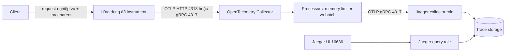
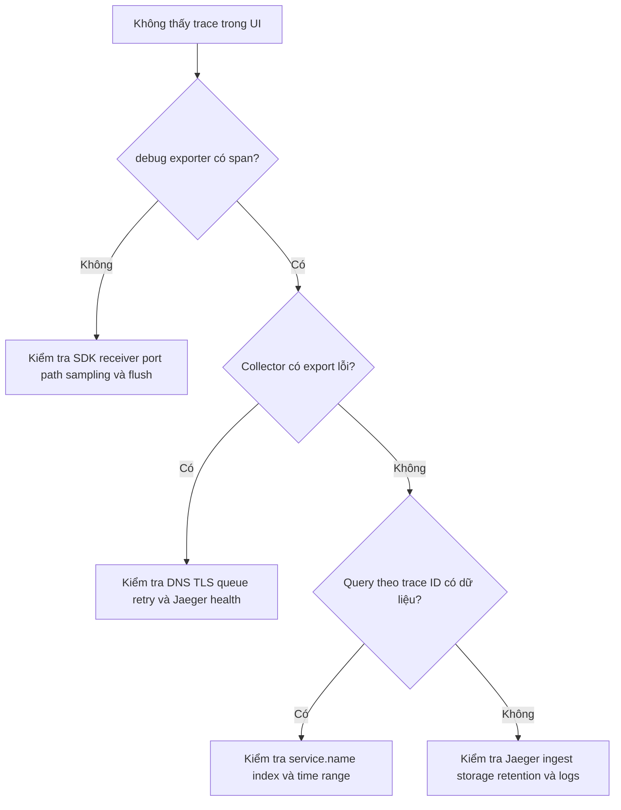

import { Step, Steps } from 'fumadocs-ui/components/steps';

Jaeger là một backend distributed tracing: nó nhận spans, lưu chúng và cung cấp
API cùng giao diện để tìm trace. Với hệ thống OpenTelemetry mới, đường ingest nên
là **OTLP** thay vì exporter hoặc protocol Jaeger cũ.

<Callout type="info" title="Đường đi được khuyến nghị">
  Giữ ứng dụng độc lập với backend bằng pipeline `OpenTelemetry SDK → OTLP →
  OpenTelemetry Collector → OTLP → Jaeger`. Jaeger hỗ trợ OTLP native trên cổng
  `4317` và `4318`; không cần cài Jaeger exporter cũ trong SDK hoặc Collector.
</Callout>

## Mục lục

- [Jaeger nằm ở đâu trong pipeline](#jaeger-nằm-ở-đâu-trong-pipeline)
  - [Các thành phần cần phân biệt](#các-thành-phần-cần-phân-biệt)
  - [OTLP là đường ingest khuyến nghị](#otlp-là-đường-ingest-khuyến-nghị)
- [Kiến trúc từ SDK đến Jaeger](#kiến-trúc-từ-sdk-đến-jaeger)
- [Lab có thể chạy bằng Docker Compose](#lab-có-thể-chạy-bằng-docker-compose)
  - [Tạo file Compose](#tạo-file-compose)
  - [Tạo cấu hình Collector](#tạo-cấu-hình-collector)
  - [Khởi động và kiểm tra health](#khởi-động-và-kiểm-tra-health)
- [Cấu hình SDK và gửi trace mẫu](#cấu-hình-sdk-và-gửi-trace-mẫu)
  - [Cấu hình ứng dụng thật](#cấu-hình-ứng-dụng-thật)
  - [Gửi OTLP JSON bằng curl](#gửi-otlp-json-bằng-curl)
- [Truy vấn và xác minh trong Jaeger UI](#truy-vấn-và-xác-minh-trong-jaeger-ui)
  - [Tìm theo service và operation](#tìm-theo-service-và-operation)
  - [Kiểm tra theo trace ID](#kiểm-tra-theo-trace-id)
- [Đọc attributes trong Jaeger](#đọc-attributes-trong-jaeger)
  - [Resource attributes và service identity](#resource-attributes-và-service-identity)
  - [Span attributes, events và status](#span-attributes-events-và-status)
- [Troubleshooting](#troubleshooting)
  - [Sai port, path hoặc protocol](#sai-port-path-hoặc-protocol)
  - [TLS và authentication](#tls-và-authentication)
  - [Sampling và missing spans](#sampling-và-missing-spans)
  - [Clock skew và thời gian truy vấn](#clock-skew-và-thời-gian-truy-vấn)
  - [Trace thiếu parent hoặc span chưa kết thúc](#trace-thiếu-parent-hoặc-span-chưa-kết-thúc)
- [Ghi chú production](#ghi-chú-production)
  - [Topology, storage và scale](#topology-storage-và-scale)
  - [Reliability, security và vận hành](#reliability-security-và-vận-hành)
- [Nguồn chính thức và bài liên quan](#nguồn-chính-thức-và-bài-liên-quan)

## Jaeger nằm ở đâu trong pipeline

Jaeger trả lời các câu hỏi như “request nào chậm?”, “span nào lỗi?” và “dịch vụ
nào nằm trên critical path?”. Nó không thay thế OpenTelemetry SDK hoặc Collector.
Jaeger hiện chỉ lưu **traces**; gửi metrics hay logs vào cùng endpoint OTLP không
biến Jaeger thành backend cho hai signal đó.

### Các thành phần cần phân biệt

| Thành phần | Trách nhiệm | Ví dụ trong bài |
| --- | --- | --- |
| **Instrumentation** | Tạo span quanh HTTP, database hoặc công việc nghiệp vụ | HTTP server tạo span `POST /checkout` |
| **OpenTelemetry SDK** | Gắn Resource, sampling, batching và export | `service.name=checkout-api`, OTLP/HTTP exporter |
| **OpenTelemetry Collector** | Nhận, xử lý, buffer và chuyển tiếp telemetry | `otlp` receiver, `batch` processor, `otlp_grpc` exporter |
| **Jaeger collector role** | Nhận spans và ghi vào trace storage | OTLP receiver của Jaeger trên `4317`/`4318` |
| **Trace storage** | Lưu spans và index dữ liệu cần tìm kiếm | Memory trong lab; external storage trong production |
| **Jaeger query role và UI** | Đọc storage, phục vụ API và giao diện | UI trên `16686` |

**Span** là một đơn vị công việc có thời điểm bắt đầu, kết thúc và metadata.
Nhiều spans có cùng `trace_id` tạo thành **trace**. Quan hệ `parent_span_id` ghép
chúng thành cây nhân quả thay vì chỉ là danh sách cùng ID.

Jaeger v2 là một distribution chuyên biệt xây trên framework OpenTelemetry
Collector. Nó có thể chạy nhiều **role** — vai trò triển khai — như `collector`,
`query`, `ingester` hoặc `all-in-one`. External OpenTelemetry Collector vẫn hữu
ích khi bạn cần một gateway chung cho traces, metrics, logs, enrichment, routing
hoặc tail sampling.

### OTLP là đường ingest khuyến nghị

Jaeger nhận OTLP ổn định ở hai transport:

| Đường ingest | Endpoint mặc định | Khi dùng |
| --- | --- | --- |
| OTLP/gRPC | `jaeger:4317` | Kết nối service-to-service hỗ trợ HTTP/2; Collector exporter trong lab |
| OTLP/HTTP | `http://jaeger:4318/v1/traces` | Môi trường ưu tiên HTTP hoặc cần gửi OTLP JSON/Protobuf |

Các API Jaeger Thrift, UDP và Jaeger Protobuf cũ được duy trì cho tương thích và
đã được đánh dấu deprecated trong tài liệu Jaeger. Chúng không phải lựa chọn cho
pipeline mới. Tương tự, tên backend “Jaeger” không yêu cầu ứng dụng dùng Jaeger
propagation header; W3C Trace Context vẫn là propagation mặc định phù hợp.

<Callout type="warn" title="Đừng nhầm ingest với propagation">
  OTLP chuyển spans đã ghi từ SDK đến Collector hoặc backend. Propagation chuyển
  `traceparent` qua request nghiệp vụ giữa hai service để service sau tạo đúng
  child span. Đổi exporter sang Jaeger không tự sửa một trace bị đứt do thiếu
  propagation.
</Callout>

## Kiến trúc từ SDK đến Jaeger



Mỗi mũi tên là một failure boundary riêng. HTTP success từ SDK tới Collector chỉ
chứng minh Collector đã nhận request đó. Collector vẫn có thể filter, hết queue,
không kết nối được Jaeger hoặc bị backend từ chối. Vì vậy, xác minh phải đi từ
ứng dụng đến receiver, exporter, storage rồi cuối cùng mới đến query UI.

Đặt Collector ở giữa đem lại ba lợi ích thực tế:

- ứng dụng chỉ biết OTLP endpoint, không giữ cấu hình riêng của Jaeger;
- processors có thể batch, redact, thêm Resource hoặc áp dụng sampling có chủ đích;
- cùng Collector có thể route metrics và logs tới backend khác mà không ép Jaeger
  nhận signal nó không lưu.

Collector không bắt buộc nếu SDK chỉ gửi traces và Jaeger là đích duy nhất. Tuy
nhiên, gửi thẳng vẫn nên dùng OTLP. Hãy thêm Collector khi cần một policy boundary
hoặc vận hành nhiều signal, không chỉ để tăng số hop.

## Lab có thể chạy bằng Docker Compose

Lab này chạy Jaeger v2 all-in-one với memory storage và một Collector độc lập.
Các version được pin để cấu hình có thể tái lập; hãy đọc release notes trước khi
nâng version.

<Callout type="warn" title="Chỉ dùng cho local">
  Memory storage mất dữ liệu khi Jaeger restart. Pipeline dùng plaintext, không
  có authentication và bind các cổng lên máy local. Không đưa topology này ra
  Internet hoặc gọi nó là cấu hình production.
</Callout>

### Tạo file Compose

Tạo thư mục trống, rồi lưu nội dung sau thành `docker-compose.yaml`:

```yaml
services:
  jaeger:
    image: cr.jaegertracing.io/jaegertracing/jaeger:2.20.0
    environment:
      JAEGER_LISTEN_HOST: 0.0.0.0
    ports:
      - "16686:16686" # UI và HTTP query API
      - "13133:13133" # healthcheckv2 /status

  collector:
    image: otel/opentelemetry-collector-contrib:0.157.0
    command:
      - "--config=/etc/otelcol-contrib/config.yaml"
    volumes:
      - ./collector-config.yaml:/etc/otelcol-contrib/config.yaml:ro
    depends_on:
      - jaeger
    ports:
      - "4317:4317" # SDK -> Collector bằng OTLP/gRPC
      - "4318:4318" # SDK -> Collector bằng OTLP/HTTP
```

Jaeger không cần publish cổng OTLP ra host trong topology này. Collector gọi
`jaeger:4317` qua network nội bộ của Compose. Việc chỉ publish endpoint của
Collector cũng làm ranh giới ingest dễ quan sát hơn.

### Tạo cấu hình Collector

Lưu file sau cạnh Compose dưới tên `collector-config.yaml`:

```yaml
receivers:
  otlp:
    protocols:
      grpc:
        endpoint: 0.0.0.0:4317
      http:
        endpoint: 0.0.0.0:4318

processors:
  memory_limiter:
    check_interval: 1s
    limit_mib: 256
  batch:
    send_batch_size: 512
    timeout: 1s

exporters:
  debug:
    verbosity: basic
  otlp_grpc/jaeger:
    endpoint: jaeger:4317
    tls:
      insecure: true
    sending_queue:
      enabled: true
      queue_size: 2048
    retry_on_failure:
      enabled: true
      initial_interval: 1s
      max_interval: 10s
      max_elapsed_time: 1m

service:
  pipelines:
    traces:
      receivers: [otlp]
      processors: [memory_limiter, batch]
      exporters: [debug, otlp_grpc/jaeger]
```

`otlp_grpc/jaeger` là một instance của OTLP/gRPC exporter. Phần sau dấu `/` chỉ
là tên định danh để logs và metrics dễ đọc; nó không chọn một Jaeger protocol
riêng. `tls.insecure: true` cho phép kết nối plaintext trong network local.

`debug` tạo một nhánh fan-out để chứng minh spans đã tới cuối pipeline. Gỡ nhánh
này sau lab vì log telemetry chi tiết có thể tốn I/O và làm lộ dữ liệu.

### Khởi động và kiểm tra health

<Steps>
<Step>

**1. Kiểm tra Compose đã render đúng**

```bash
docker compose config
```

Lệnh này phát hiện lỗi YAML và đường mount hiển nhiên. Validation cuối cùng vẫn
do đúng binary Collector thực hiện khi container khởi động.

</Step>
<Step>

**2. Khởi động hai service**

```bash
docker compose up -d
docker compose ps
```

`depends_on` chỉ quyết định thứ tự tạo container. Collector có thể log retry ngắn
trong lúc Jaeger chưa sẵn sàng.

</Step>
<Step>

**3. Kiểm tra Jaeger và Collector**

```bash
curl --fail http://localhost:13133/status
docker compose logs --tail=100 collector
docker compose logs --tail=100 jaeger
```

Health success cho biết process Jaeger đang phục vụ endpoint quản trị. Nó chưa
chứng minh một trace đã đi hết pipeline; bước xác minh dữ liệu nằm ở phần sau.

</Step>
</Steps>

Nếu Collector báo `unknown type: otlp_grpc`, hãy kiểm tra image/distribution và
version thực tế. Không đổi ngược sang Jaeger exporter cũ để né lỗi component.

## Cấu hình SDK và gửi trace mẫu

### Cấu hình ứng dụng thật

SDK cụ thể có thể khác về package và mức hỗ trợ environment variables. Với SDK
hỗ trợ cấu hình chuẩn, ứng dụng chạy trên host có thể gửi OTLP/HTTP như sau:

```bash
export OTEL_SERVICE_NAME=checkout-api
export OTEL_RESOURCE_ATTRIBUTES='service.version=1.4.0,deployment.environment.name=local'
export OTEL_EXPORTER_OTLP_ENDPOINT=http://localhost:4318
export OTEL_EXPORTER_OTLP_PROTOCOL=http/protobuf
export OTEL_TRACES_SAMPLER=parentbased_always_on
```

Nếu ứng dụng chạy trong cùng Compose network, endpoint là
`http://collector:4318`. Với OTLP/gRPC, dùng endpoint `http://localhost:4317` và
`OTEL_EXPORTER_OTLP_PROTOCOL=grpc` nếu SDK hỗ trợ.

`parentbased_always_on` phù hợp với lab vì giữ trace được bắt đầu local và tôn
trọng quyết định sampling của remote parent. Production cần policy theo lưu lượng,
chi phí và rủi ro dữ liệu; đừng sao chép sampler lab vào hệ thống tải lớn.

### Gửi OTLP JSON bằng curl

Ví dụ sau giả lập hai spans: server span `POST /checkout` và child client span
`POST payment`. Nó dùng `openssl` để tạo IDs mới và in `TRACE_ID` để bạn truy vấn.
OTLP JSON yêu cầu các trường integer 64-bit như timestamp được biểu diễn bằng
chuỗi.

```bash
trace_id="$(openssl rand -hex 16)"
root_span_id="$(openssl rand -hex 8)"
child_span_id="$(openssl rand -hex 8)"
now_ns=$(( $(date +%s) * 1000000000 ))
root_start=$(( now_ns - 1000000000 ))
child_start=$(( root_start + 200000000 ))
child_end=$(( child_start + 250000000 ))
root_end=$(( root_start + 800000000 ))

curl --fail-with-body --silent --show-error \
  -X POST \
  -H 'Content-Type: application/json' \
  --data-binary @- \
  http://localhost:4318/v1/traces <<JSON
{
  "resourceSpans": [{
    "resource": {
      "attributes": [
        {"key": "service.name", "value": {"stringValue": "checkout-api"}},
        {"key": "service.version", "value": {"stringValue": "1.4.0"}},
        {"key": "deployment.environment.name", "value": {"stringValue": "local"}}
      ]
    },
    "scopeSpans": [{
      "scope": {"name": "jaeger-page-demo", "version": "1.0.0"},
      "spans": [
        {
          "traceId": "${trace_id}",
          "spanId": "${root_span_id}",
          "name": "POST /checkout",
          "kind": "SPAN_KIND_SERVER",
          "startTimeUnixNano": "${root_start}",
          "endTimeUnixNano": "${root_end}",
          "attributes": [
            {"key": "http.request.method", "value": {"stringValue": "POST"}},
            {"key": "http.route", "value": {"stringValue": "/checkout"}},
            {"key": "http.response.status_code", "value": {"intValue": "200"}},
            {"key": "checkout.cart.items", "value": {"intValue": "3"}}
          ],
          "events": [{
            "timeUnixNano": "${child_end}",
            "name": "payment.authorized",
            "attributes": [
              {"key": "payment.provider", "value": {"stringValue": "sandbox"}}
            ]
          }],
          "status": {"code": "STATUS_CODE_OK"}
        },
        {
          "traceId": "${trace_id}",
          "spanId": "${child_span_id}",
          "parentSpanId": "${root_span_id}",
          "name": "POST payment",
          "kind": "SPAN_KIND_CLIENT",
          "startTimeUnixNano": "${child_start}",
          "endTimeUnixNano": "${child_end}",
          "attributes": [
            {"key": "server.address", "value": {"stringValue": "payments.local"}},
            {"key": "server.port", "value": {"intValue": "443"}}
          ],
          "status": {"code": "STATUS_CODE_OK"}
        }
      ]
    }]
  }]
}
JSON

export TRACE_ID="${trace_id}"
printf 'TRACE_ID=%s\n' "${TRACE_ID}"
```

Một response OTLP thành công xác nhận Collector đã nhận request. Processor `batch`
có thể chờ tối đa một giây trong cấu hình này trước khi export. Xem log Collector
để xác nhận nhánh `debug`, rồi chuyển sang UI để chứng minh backend đã lưu trace.

## Truy vấn và xác minh trong Jaeger UI

### Tìm theo service và operation

Mở [Jaeger UI](http://localhost:16686). Trên trang tìm trace:

1. chọn service `checkout-api`;
2. chọn operation `POST /checkout` nếu danh sách operation đã cập nhật;
3. giữ time range bao phủ vài phút gần nhất;
4. bấm **Find Traces** rồi mở kết quả mới nhất.

Trace hợp lệ phải có hai spans. `POST payment` phải nằm dưới
`POST /checkout`, cùng trace ID nhưng có span ID riêng. Timeline phải cho thấy
child span nằm trong khoảng thời gian của root span.

Trong trace detail, kiểm tra các bằng chứng cụ thể:

- service là `checkout-api`, không phải `unknown_service`;
- Resource có `service.version=1.4.0` và
  `deployment.environment.name=local`;
- root span có route `/checkout`, status code `200` và event
  `payment.authorized`;
- child span có parent đúng và peer `payments.local` nếu UI/backend suy ra được
  từ semantic attributes;
- thời lượng root khoảng `800 ms`, child khoảng `250 ms`.

### Kiểm tra theo trace ID

UI cho phép mở trace từ ID đã in. Bạn cũng có thể dùng HTTP endpoint mà chính
Jaeger UI hiện dùng để chẩn đoán local:

```bash
curl --fail --silent \
  "http://localhost:16686/api/traces/${TRACE_ID:?hãy chạy script gửi trace trước}" \
  | jq .
```

<Callout type="warn" title="HTTP API nội bộ không phải integration contract">
  Đường `/api/traces/{trace-id}` là internal JSON API và có thể thay đổi. Dùng
  `jaeger.api_v3.QueryService` trên gRPC `16685` hoặc HTTP `/api/v3/*` theo tài
  liệu Jaeger cho tích hợp có yêu cầu compatibility; chỉ dùng lệnh trên để debug
  stack local.
</Callout>

Nếu query theo ID có dữ liệu nhưng search theo service không có, ingestion đã
thành công. Hãy tập trung vào `service.name`, time range và index/search của
storage thay vì exporter.

## Đọc attributes trong Jaeger

Jaeger UI thường dùng từ **tags** cho metadata hiển thị và tìm kiếm. Trong
OpenTelemetry, cần phân biệt Resource, span attributes, instrumentation scope,
events và status vì chúng có lifecycle khác nhau dù UI có thể đặt gần nhau.

### Resource attributes và service identity

**Resource** mô tả entity tạo telemetry. `service.name` là định danh quan trọng
nhất để Jaeger nhóm và liệt kê service. Nên đặt thêm:

- `service.namespace` khi nhiều team có service trùng tên;
- `service.version` để so sánh release;
- `deployment.environment.name` để phân biệt local, staging và production;
- `service.instance.id` khi cần khoanh một replica cụ thể.

Giữ `service.name` ổn định và low-cardinality. Không thêm pod UID, tenant ID hoặc
version vào chính tên service. Các giá trị thay đổi theo instance nên nằm ở
attribute tương ứng.

Nếu không đặt `service.name`, SDK có thể tạo tên mặc định như
`unknown_service`. Jaeger vẫn có thể lưu span, nhưng tìm kiếm, dependency graph và
ownership trở nên khó dùng.

### Span attributes, events và status

**Span attributes** mô tả một operation. Ví dụ `http.route=/checkout` phù hợp để
group, còn URL chứa order ID động dễ làm tăng cardinality của index. Ưu tiên
[semantic conventions](/fundamentals/semantic-conventions/) thay vì tự tạo
`httpMethod`, `statusCode` hoặc `peerHost`.

**Event** là một mốc có timestamp bên trong span, ví dụ `payment.authorized` hoặc
exception. Event phù hợp với chi tiết xảy ra tại một thời điểm; nó không thay
thế child span cho một operation có duration riêng.

**Status** biểu diễn kết quả của span. HTTP `500` không tự động bảo đảm status
OpenTelemetry là `ERROR` nếu instrumentation không áp dụng semantic convention
đúng. Khi UI không tô lỗi như mong đợi, kiểm tra cả status object, exception event
và `http.response.status_code` trong payload thực tế.

<Callout type="warn" title="Tags có thể chứa dữ liệu nhạy cảm">
  Không ghi token, cookie, password, raw SQL chứa dữ liệu người dùng hoặc PII vào
  Resource, attributes hay events. Jaeger index và retention có thể nhân rộng
  phạm vi lộ dữ liệu. Redact tại SDK hoặc Collector trước khi export.
</Callout>

## Troubleshooting

Khi trace không xuất hiện, đi theo từng hop thay vì đổi nhiều cấu hình cùng lúc:



### Sai port, path hoặc protocol

| Triệu chứng | Nguyên nhân thường gặp | Cách xử lý |
| --- | --- | --- |
| HTTP `404` trên Collector hoặc Jaeger | Gửi OTLP/HTTP sai path | Dùng `/v1/traces`; base endpoint của SDK thường là `http://host:4318` |
| `connection refused` | Gọi nhầm host, port chưa publish hoặc process chưa listen | Kiểm tra từ đúng container/pod; `localhost` trong container là chính container đó |
| gRPC `UNAVAILABLE` hoặc HTTP/2 lỗi | Gửi gRPC vào `4318`, proxy không hỗ trợ gRPC hoặc backend chưa sẵn sàng | Ghép `grpc` với `4317`; kiểm tra proxy HTTP/2 và logs hai đầu |
| Parse error hoặc HTTP `400` | Payload không đúng OTLP JSON/Protobuf | So với OTLP schema; integer 64-bit trong JSON phải dùng chuỗi |
| Jaeger có process nhưng không có span | Jaeger chỉ được publish UI, Collector gọi sai DNS | Trong Compose dùng `jaeger:4317`, không dùng `localhost:4317` từ Collector |

Không coi số cổng là sự thật tuyệt đối. Cổng có thể được override. Luôn đối chiếu
receiver thực tế và transport exporter.

### TLS và authentication

Lab dùng plaintext. Ở production, lỗi `x509`, hostname mismatch hoặc handshake
thường nằm ở ranh giới Collector → Jaeger:

- `ca_file` phải tin CA ký certificate server;
- hostname trong endpoint phải khớp SAN của certificate;
- mTLS cần cả client certificate và private key;
- authentication extension hoặc proxy phải được bật ở cả nơi khai báo lẫn
  `service.extensions` nếu thiết kế dùng nó;
- không “sửa” lỗi bằng `insecure_skip_verify` lâu dài.

Kiểm tra kết nối từ chính pod Collector. Một lệnh thành công trên laptop không
chứng minh DNS, CA bundle hoặc network policy trong cluster đúng.

### Sampling và missing spans

Sampling có thể xảy ra ở SDK hoặc Collector. **Head sampling** quyết định sớm khi
span bắt đầu. **Tail sampling** chờ thấy nhiều spans của trace rồi mới quyết định
giữ. Jaeger không thể khôi phục span chưa từng được record hoặc đã bị drop trước
khi ingest.

Khi trace thiếu ngẫu nhiên:

1. kiểm tra `trace_flags` và sampler của root service;
2. xác nhận child service tôn trọng remote parent và dùng cùng propagation format;
3. tìm filter, transform hoặc tail-sampling policy trong mọi Collector hop;
4. kiểm tra `otelcol_exporter_enqueue_failed_*`, send-failed metrics, queue capacity
   và log retry theo version Collector;
5. kiểm tra span limits, memory limiter, backend storage errors và retention;
6. gọi `force_flush`/`shutdown` khi process ngắn hạn kết thúc.

Đừng đặt mọi sampler thành `always_on` trong production chỉ để chữa missing spans.
Đó có thể là biện pháp canary có thời hạn, nhưng cần quay lại policy volume và
privacy sau khi khoanh vùng lỗi.

### Clock skew và thời gian truy vấn

**Clock skew** là chênh lệch đồng hồ giữa các host. Nó có thể làm child span trông
như bắt đầu trước parent hoặc nằm ngoài timeline. Jaeger query có thuật toán điều
chỉnh clock skew và hiển thị warning khi áp dụng; đây là điều chỉnh lúc đọc, không
sửa timestamp gốc trong ứng dụng.

Cách xử lý đúng:

- đồng bộ NTP/chrony trên node và kiểm tra container dùng clock host;
- dùng timestamp do SDK/runtime tạo, không ghép timestamp từ nhiều nguồn;
- mở rộng time range khi clock lệch khiến trace nằm ngoài cửa sổ mặc định;
- đọc warning trong UI trước khi kết luận latency âm hoặc parent sai;
- với cấu hình Jaeger explicit, kiểm tra `jaeger_query.max_clock_skew_adjust`.

Đặt `max_clock_skew_adjust: 0s` tắt adjustment nhưng không sửa đồng hồ. Chỉ thay
đổi sau khi hiểu vì sao thuật toán đang làm trace khó đọc.

### Trace thiếu parent hoặc span chưa kết thúc

Nếu các service xuất hiện thành những trace riêng, lỗi thường ở propagation chứ
không phải Jaeger. Capture `traceparent` ở test path, xác nhận sender inject sau
khi client span active và receiver extract trước khi tạo server span. Không log
raw headers ở production.

Nếu span không xuất hiện cho tới khi process dừng hoặc luôn có duration sai:

- bảo đảm span được `end` đúng một lần trên success, error và cancellation;
- với process ngắn hạn, gọi SDK `force_flush` rồi `shutdown` có timeout;
- kiểm tra batch timeout ở cả SDK và Collector;
- không giữ active span vô hạn quanh thread pool hoặc background worker;
- dùng links thay cho parent khi công việc async thực sự không có quan hệ cây trực
  tiếp.

## Ghi chú production

### Topology, storage và scale

`all-in-one` với memory storage phù hợp cho local. Production nên chọn topology
và storage theo tải:

- tách `collector` role ghi dữ liệu khỏi `query` role đọc dữ liệu khi cần scale,
  policy mạng hoặc SLO khác nhau;
- dùng external storage được release Jaeger đang chạy hỗ trợ, với retention,
  replication, backup và schema lifecycle rõ ràng;
- scale collectors và query services ngang vì chúng stateless khi state nằm ở
  external storage;
- cân nhắc Kafka làm persistent buffer giữa ingest và storage khi cần hấp thụ
  outage dài hoặc spike; khi đó phải vận hành thêm ingester và broker;
- chạy dependency aggregation hoặc SPM components cần thiết thay vì giả định UI
  tự suy ra mọi service graph từ trace storage;
- benchmark cả write, search và trace-by-ID với cardinality giống production.

All-in-one dùng Badger có thể phù hợp với lượng dữ liệu khiêm tốn theo tài liệu
Jaeger, nhưng không scale ngang như external storage. Nói ngắn gọn: đừng chọn
storage chỉ vì lab khởi động nhanh.

### Reliability, security và vận hành

Checklist tối thiểu trước khi đưa Jaeger vào production:

- [ ] Pin version Jaeger, Collector và storage; đọc breaking changes cùng migration note.
- [ ] Bật TLS/mTLS hoặc authenticated gateway trên các trust boundary.
- [ ] Không expose ingest, query hoặc management port trực tiếp ra Internet.
- [ ] Tune sending queue, retry, timeout và persistent queue theo outage budget.
- [ ] Đặt memory limiter, CPU/memory requests, autoscaling signal và graceful shutdown.
- [ ] Định nghĩa sampling ownership; tránh hai tầng tail sampling không phối hợp.
- [ ] Monitor Collector accepted/refused/exported data cùng queue và retry metrics.
- [ ] Scrape Jaeger metrics, health, storage latency/error và query latency.
- [ ] Đặt retention, index strategy, cardinality budget và data-redaction policy.
- [ ] Test mất backend, restart Collector, rolling upgrade và storage restore.
- [ ] Tạo canary trace có `service.name`, parent-child, error và attribute bắt buộc.

Queue và retry thường cho delivery **at least once**, vì timeout có thể xảy ra sau
khi backend đã nhận nhưng trước khi Collector nhận ACK. Đừng giả định exactly-once.
Cũng không dùng in-memory queue như persistent broker; restart có thể làm mất
backlog.

## Nguồn chính thức và bài liên quan

Nguồn chính được dùng cho mental model, cổng và cấu hình trong bài:

- [Jaeger Architecture](https://www.jaegertracing.io/docs/latest/architecture/) —
  roles, all-in-one, direct storage, Kafka và vị trí của OpenTelemetry Collector.
- [Jaeger APIs](https://www.jaegertracing.io/docs/latest/apis/) — OTLP write APIs,
  cổng mặc định, query APIs và trạng thái legacy protocols.
- [Jaeger Getting Started](https://www.jaegertracing.io/docs/latest/getting-started/) —
  image, UI và cấu hình all-in-one chính thức.
- [Jaeger Configuration](https://www.jaegertracing.io/docs/latest/configuration/) —
  YAML v2, storage/query extensions và clock-skew adjustment.
- [OTLP exporter specification](https://opentelemetry.io/docs/specs/otel/protocol/exporter/) —
  endpoint, transport, TLS, timeout và retry.
- [OpenTelemetry Collector OTLP exporter](https://github.com/open-telemetry/opentelemetry-collector/tree/main/exporter/otlpexporter) —
  `otlp_grpc`, queue, retry và TLS client settings.

<Cards>
  <Card title="OTLP gRPC và OTLP HTTP" href="/protocols-backends/otlp-grpc-http/" description="Phân biệt transport, endpoint, path và TLS." />
  <Card title="Collector exporters" href="/collector/exporters/" description="Cấu hình queue, retry, fan-out và kiểm chứng egress." />
  <Card title="Sampling" href="/signals/sampling/" description="Hiểu head sampling, tail sampling và missing spans." />
  <Card title="Context propagation" href="/fundamentals/context-propagation/" description="Giữ parent-child relation qua service boundary." />
  <Card title="Local observability stack" href="/getting-started/local-stack/" description="Thực hành stack local tối thiểu với Jaeger." />
</Cards>
