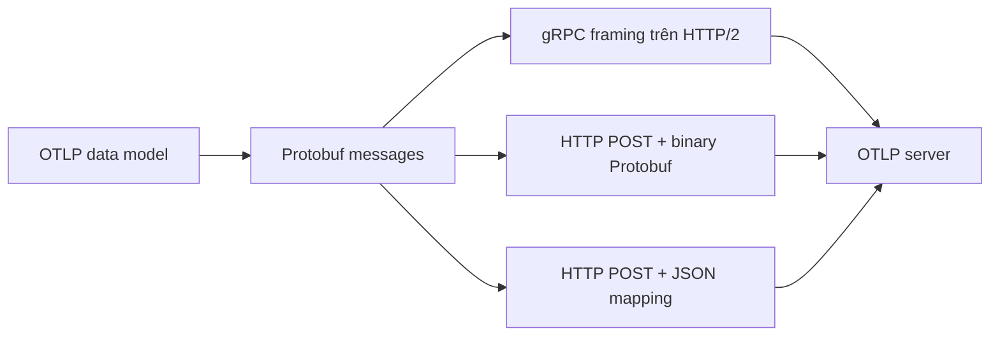

OTLP/gRPC và OTLP/HTTP mang cùng data model OTLP nhưng dùng cách đóng gói request
khác nhau. Trang này giúp chọn transport, cấu hình hai đầu khớp nhau và chẩn đoán
lỗi ở ranh giới mạng. Nếu chưa quen `ExportRequest`, Resource hoặc batch, hãy đọc
[OTLP](/protocols-backends/otlp/) trước; trang hiện tại vẫn tóm tắt đủ để dùng độc lập.

<Callout type="info" title="Một quyết định cấu hình, không phải hai protocol dữ liệu">
  `grpc`, `http/protobuf` và `http/json` là các lựa chọn transport/encoding của
  OTLP exporter. Chúng không biến span, metric hay log thành data model khác.
</Callout>

## Mục lục

- [Ranh giới giữa protocol và transport](#ranh-giới-giữa-protocol-và-transport)
  - [Giống nhau và khác nhau ở đâu?](#giống-nhau-và-khác-nhau-ở-đâu)
  - [Mental model của một Export call](#mental-model-của-một-export-call)
- [So sánh OTLP/gRPC và OTLP/HTTP](#so-sánh-otlpgrpc-và-otlphttp)
- [Endpoint, port và path theo signal](#endpoint-port-và-path-theo-signal)
  - [Port mặc định](#port-mặc-định)
  - [Endpoint chung và endpoint theo signal](#endpoint-chung-và-endpoint-theo-signal)
  - [Base path phía sau reverse proxy](#base-path-phía-sau-reverse-proxy)
- [Cấu hình OTLP/gRPC](#cấu-hình-otlpgrpc)
  - [SDK gửi qua gRPC bằng biến môi trường](#sdk-gửi-qua-grpc-bằng-biến-môi-trường)
  - [Collector export bằng gRPC](#collector-export-bằng-grpc)
- [Cấu hình OTLP/HTTP](#cấu-hình-otlphttp)
  - [SDK gửi qua HTTP bằng biến môi trường](#sdk-gửi-qua-http-bằng-biến-môi-trường)
  - [Collector export bằng HTTP](#collector-export-bằng-http)
- [Headers, compression và TLS](#headers-compression-và-tls)
  - [Authentication headers](#authentication-headers)
  - [Compression](#compression)
  - [TLS và mTLS](#tls-và-mtls)
- [Status, retry và backpressure](#status-retry-và-backpressure)
  - [gRPC status](#grpc-status)
  - [HTTP status](#http-status)
  - [Partial success và duplicate](#partial-success-và-duplicate)
- [Kiểm chứng transport](#kiểm-chứng-transport)
  - [Kiểm tra OTLP/HTTP bằng curl](#kiểm-tra-otlphttp-bằng-curl)
  - [Kiểm tra OTLP/gRPC bằng grpcurl](#kiểm-tra-otlpgrpc-bằng-grpcurl)
  - [Gửi canary có dữ liệu thật](#gửi-canary-có-dữ-liệu-thật)
- [Lỗi thường gặp](#lỗi-thường-gặp)
- [Checklist chọn transport](#checklist-chọn-transport)
- [Nguồn chính thức và bài liên quan](#nguồn-chính-thức-và-bài-liên-quan)

## Ranh giới giữa protocol và transport

OTLP định nghĩa Protobuf schema, `Export` request/response và hành vi khi lỗi.
Transport quyết định request đó đi trên gRPC hay HTTP. Hình sau giữ bốn lớp tách
biệt:



### Giống nhau và khác nhau ở đâu?

Cả hai transport dùng các message như `ExportTraceServiceRequest` và
`ExportTraceServiceResponse`. Chúng cũng cùng có full success, partial success,
lỗi retryable và lỗi permanent.

Điểm khác là lớp mạng:

- OTLP/gRPC gọi unary RPC `Export` trên service Protobuf của từng signal.
- OTLP/HTTP dùng `POST` tới URL path của từng signal.
- OTLP/gRPC dùng Protobuf nhị phân bên trong gRPC wire format.
- OTLP/HTTP có thể dùng Protobuf nhị phân hoặc Protobuf JSON mapping.
- gRPC thường dùng HTTP/2. OTLP/HTTP có thể dùng HTTP/1.1 hoặc HTTP/2.

**Unary RPC** là một lần client gửi một request và nhận một response, thay vì mở
stream records vô hạn. Client vẫn có thể chạy nhiều unary requests đồng thời để
tăng throughput.

### Mental model của một Export call

```text
records của một signal
  → tạo Export<Signal>ServiceRequest
  → serialize
  → thêm metadata/headers, compression và TLS
  → gửi qua gRPC method hoặc HTTP path
  → đọc transport status + Export<Signal>ServiceResponse
```

Transport thành công chưa đủ. Client còn phải đọc `partial_success` trong
response. Ngược lại, một lỗi transport chỉ nên retry khi OTLP phân loại lỗi đó
là tạm thời.

## So sánh OTLP/gRPC và OTLP/HTTP

| Tiêu chí | OTLP/gRPC | OTLP/HTTP |
| --- | --- | --- |
| Giá trị env `PROTOCOL` | `grpc` | `http/protobuf` hoặc tùy chọn `http/json` |
| Wire format phổ biến | Protobuf trong gRPC | Protobuf nhị phân trong HTTP body |
| HTTP version | gRPC thường yêu cầu HTTP/2 | HTTP/1.1 hoặc HTTP/2; implementation HTTP/2 nên fallback HTTP/1.1 nếu cần |
| Định tuyến signal | Protobuf service/method | URL path `/v1/traces`, `/v1/metrics`, `/v1/logs` |
| Port mặc định | `4317` | `4318` |
| Request | Unary `Export` RPC | HTTP `POST` |
| Success transport | gRPC `OK` | HTTP `200 OK` |
| Throttling hint | `RetryInfo` trong gRPC status details | Header `Retry-After` |
| Compression chuẩn | gRPC compression `gzip` hoặc không nén | `Content-Encoding: gzip` hoặc không nén |
| Hạ tầng trung gian | Cần proxy/load balancer hỗ trợ gRPC/HTTP/2 đúng cách | Thường đi qua proxy HTTP truyền thống dễ hơn |
| Debug ở mức HTTP | Cần tool hiểu gRPC và `.proto` | Dễ kiểm tra route/status/header bằng `curl`; payload vẫn là Protobuf nếu dùng `http/protobuf` |
| Trình duyệt | Không phải lựa chọn web thông thường | Có thể dùng với CORS nếu receiver cấu hình cho browser; không nên để credential ingest dài hạn ở frontend |

Không có transport thắng trong mọi hệ thống. gRPC thường phù hợp cho
service-to-service nơi HTTP/2 được hỗ trợ tốt. HTTP/Protobuf thường phù hợp khi
firewall, proxy hoặc platform serverless đã tối ưu cho HTTP request thông thường.
Đo latency, CPU, bandwidth và failure behavior trên topology thật trước khi đổi
transport chỉ vì benchmark tổng quát.

<Callout type="warn" title="JSON không phải mặc định an toàn để giả định">
  `http/json` là lựa chọn hợp lệ của specification nhưng SDK chỉ **có thể** hỗ
  trợ. `http/protobuf` có interoperability rộng hơn và payload gọn hơn. Chỉ chọn
  JSON sau khi xác nhận cả exporter lẫn receiver của phiên bản đang chạy.
</Callout>

## Endpoint, port và path theo signal

### Port mặc định

| Transport | Endpoint exporter mặc định theo specification | Listener convention | Path |
| --- | --- | --- | --- |
| OTLP/gRPC | `http://localhost:4317` | `localhost:4317` | Không dùng `/v1/...`; service method chọn signal. |
| OTLP/HTTP | `http://localhost:4318` | `localhost:4318` | Mặc định `/v1/traces`, `/v1/metrics`, `/v1/logs`. |

`4317` và `4318` là default, không phải luật bắt buộc. Backend managed thường
dùng `443`, còn reverse proxy có thể dùng host/path riêng. Luôn lấy endpoint từ
backend contract thay vì tự thay port theo thói quen.

Collector OTLP receiver hiện mặc định bind `localhost`, không phải mọi interface.
Ví dụ production nên ghi `endpoint` tường minh để tránh hành vi thay đổi theo
version hoặc network namespace.

### Endpoint chung và endpoint theo signal

Với OTLP/HTTP, hai loại biến endpoint có semantics khác nhau:

```bash
export OTEL_EXPORTER_OTLP_PROTOCOL=http/protobuf
export OTEL_EXPORTER_OTLP_ENDPOINT=http://collector:4318
```

Exporter dùng endpoint chung làm base URL và tạo:

```text
http://collector:4318/v1/traces
http://collector:4318/v1/metrics
http://collector:4318/v1/logs
```

Nhưng endpoint **theo signal được dùng nguyên trạng**:

```bash
export OTEL_EXPORTER_OTLP_TRACES_PROTOCOL=http/protobuf
export OTEL_EXPORTER_OTLP_TRACES_ENDPOINT=http://collector:4318/v1/traces
```

Cấu hình sai thường gặp sau gửi traces tới path `/`, không phải `/v1/traces`:

```bash
# Sai nếu receiver chỉ expose path mặc định /v1/traces
export OTEL_EXPORTER_OTLP_TRACES_ENDPOINT=http://collector:4318
```

Với OTLP/gRPC, cả endpoint chung và endpoint theo signal đều là gRPC target. Không
thêm `/v1/traces`, `/v1/metrics` hoặc `/v1/logs`; method Protobuf đã chọn signal.

<Callout type="error" title="Đừng sửa một lỗi HTTP bằng cách phá endpoint gRPC">
  Path `/v1/<signal>` chỉ thuộc OTLP/HTTP. Nếu gRPC trả `UNIMPLEMENTED`, hãy kiểm
  tra listener/proxy và service method; thêm path HTTP vào target gRPC không phải
  cách sửa portable.
</Callout>

### Base path phía sau reverse proxy

Endpoint chung OTLP/HTTP có thể chứa base path. Dùng dấu `/` cuối để intent rõ
ràng:

```bash
export OTEL_EXPORTER_OTLP_ENDPOINT=https://telemetry.example.com/otel/
export OTEL_EXPORTER_OTLP_PROTOCOL=http/protobuf
```

URL hiệu lực là:

```text
https://telemetry.example.com/otel/v1/traces
https://telemetry.example.com/otel/v1/metrics
https://telemetry.example.com/otel/v1/logs
```

Reverse proxy phải giữ `POST`, body, `Content-Type`, `Content-Encoding` và auth
headers. Nó cũng phải route đúng base path tới OTLP receiver. Test từng signal vì
một rule chỉ match `/v1/traces` có thể âm thầm bỏ metrics và logs.

## Cấu hình OTLP/gRPC

### SDK gửi qua gRPC bằng biến môi trường

Mẫu sau gửi cả ba signal qua gRPC có TLS tới gateway. Scheme `https` yêu cầu kết
nối secure và có precedence trên tùy chọn `INSECURE`:

```bash
export OTEL_SERVICE_NAME=checkout
export OTEL_TRACES_EXPORTER=otlp
export OTEL_METRICS_EXPORTER=otlp
export OTEL_LOGS_EXPORTER=otlp

export OTEL_EXPORTER_OTLP_PROTOCOL=grpc
export OTEL_EXPORTER_OTLP_ENDPOINT=https://otel-gateway.example.com:4317
export OTEL_EXPORTER_OTLP_HEADERS="x-api-key=${OTEL_API_KEY}"
export OTEL_EXPORTER_OTLP_CERTIFICATE=/var/run/secrets/otel/ca.pem
export OTEL_EXPORTER_OTLP_COMPRESSION=gzip
export OTEL_EXPORTER_OTLP_TIMEOUT=10000
```

`OTEL_EXPORTER_OTLP_TIMEOUT` dùng milliseconds và áp dụng cho mỗi batch export.
Mặc định chuẩn là `10000` ms. Mức hỗ trợ env vars vẫn phụ thuộc SDK; kiểm tra
[environment variable compliance matrix](https://opentelemetry.io/docs/languages/sdk-configuration/general/#environment-variable-support).

Cho local plaintext, dùng scheme `http` tường minh:

```bash
export OTEL_EXPORTER_OTLP_PROTOCOL=grpc
export OTEL_EXPORTER_OTLP_ENDPOINT=http://127.0.0.1:4317
```

Một số gRPC API programmatic dùng target `host:port` và cờ `insecure` riêng. Đừng
sao chép hình dạng endpoint của một ngôn ngữ sang ngôn ngữ khác mà không đọc API
của SDK đó.

### Collector export bằng gRPC

Mẫu gateway nhận OTLP/gRPC ở loopback, batch rồi gửi tới backend bằng TLS và
header. Các giá trị `${env:...}` được Collector lấy từ environment process:

```yaml
receivers:
  otlp:
    protocols:
      grpc:
        endpoint: 127.0.0.1:4317

processors:
  batch:
    timeout: 5s

exporters:
  otlp_grpc/backend:
    endpoint: "${env:OTLP_GRPC_BACKEND}"
    headers:
      authorization: "Bearer ${env:OTLP_TOKEN}"
    compression: gzip
    timeout: 10s
    tls:
      ca_file: /var/run/secrets/otel/ca.pem
    sending_queue:
      enabled: true
      queue_size: 1000
    retry_on_failure:
      enabled: true
      initial_interval: 5s
      max_interval: 30s
      max_elapsed_time: 5m

service:
  pipelines:
    traces:
      receivers: [otlp]
      processors: [batch]
      exporters: [otlp_grpc/backend]
    metrics:
      receivers: [otlp]
      processors: [batch]
      exporters: [otlp_grpc/backend]
    logs:
      receivers: [otlp]
      processors: [batch]
      exporters: [otlp_grpc/backend]
```

Chạy validation với secret giả và endpoint staging hợp lệ:

```bash
export OTLP_GRPC_BACKEND=backend.example.com:4317
export OTLP_TOKEN=redacted-for-validation
otelcol validate --config=file:./otelcol-grpc.yaml
```

Ví dụ dùng tên component hiện hành `otlp_grpc`. Các Collector cũ có thể dùng tên
`otlp`; OTLP/HTTP cũ thường dùng `otlphttp`. Hãy pin distribution và đối chiếu
tài liệu đúng version. Không đổi component name chỉ dựa vào một snippet mới.

## Cấu hình OTLP/HTTP

### SDK gửi qua HTTP bằng biến môi trường

Endpoint chung dưới đây tự thêm path cho traces, metrics và logs:

```bash
export OTEL_SERVICE_NAME=checkout
export OTEL_TRACES_EXPORTER=otlp
export OTEL_METRICS_EXPORTER=otlp
export OTEL_LOGS_EXPORTER=otlp

export OTEL_EXPORTER_OTLP_PROTOCOL=http/protobuf
export OTEL_EXPORTER_OTLP_ENDPOINT=https://otel-gateway.example.com/otel/
export OTEL_EXPORTER_OTLP_HEADERS="x-api-key=${OTEL_API_KEY}"
export OTEL_EXPORTER_OTLP_CERTIFICATE=/var/run/secrets/otel/ca.pem
export OTEL_EXPORTER_OTLP_COMPRESSION=gzip
export OTEL_EXPORTER_OTLP_TIMEOUT=10000
```

Nếu backend tách endpoint theo signal, ghi URL đầy đủ:

```bash
export OTEL_EXPORTER_OTLP_TRACES_ENDPOINT=https://traces.example.com/v1/traces
export OTEL_EXPORTER_OTLP_METRICS_ENDPOINT=https://metrics.example.com/v1/metrics
export OTEL_EXPORTER_OTLP_LOGS_ENDPOINT=https://logs.example.com/v1/logs
```

Option theo signal ghi đè option chung cùng loại. Đừng giả định headers chung và
headers theo signal được merge; nếu đặt biến theo signal, hãy cấu hình đầy đủ
headers cần thiết cho signal đó.

### Collector export bằng HTTP

Mẫu này nhận local OTLP/HTTP và gửi tiếp tới base URL backend. `otlp_http`
exporter tự thêm path mặc định theo signal:

```yaml
receivers:
  otlp:
    protocols:
      http:
        endpoint: 127.0.0.1:4318

processors:
  batch:
    timeout: 5s

exporters:
  otlp_http/backend:
    endpoint: "${env:OTLP_HTTP_BACKEND}"
    headers:
      x-api-key: "${env:OTLP_API_KEY}"
    encoding: proto
    compression: gzip
    timeout: 10s
    tls:
      ca_file: /var/run/secrets/otel/ca.pem
    sending_queue:
      enabled: true
      queue_size: 1000
    retry_on_failure:
      enabled: true
      initial_interval: 5s
      max_interval: 30s
      max_elapsed_time: 5m

service:
  pipelines:
    traces:
      receivers: [otlp]
      processors: [batch]
      exporters: [otlp_http/backend]
    metrics:
      receivers: [otlp]
      processors: [batch]
      exporters: [otlp_http/backend]
    logs:
      receivers: [otlp]
      processors: [batch]
      exporters: [otlp_http/backend]
```

```bash
export OTLP_HTTP_BACKEND=https://backend.example.com/otel/
export OTLP_API_KEY=redacted-for-validation
otelcol validate --config=file:./otelcol-http.yaml
```

`encoding: proto` tạo `Content-Type: application/x-protobuf`. Chỉ đổi thành
`json` khi backend công bố hỗ trợ OTLP JSON mapping. Tên `otlphttp` là alias đã
bị deprecate trên Collector hiện hành; dùng tên đúng với version đã pin.

## Headers, compression và TLS

### Authentication headers

OTLP không áp đặt một scheme authentication duy nhất. Backend có thể yêu cầu
`Authorization`, `x-api-key` hoặc header tenant riêng. Với SDK env vars, format
chuẩn là danh sách `key=value` phân cách bằng dấu phẩy:

```bash
export OTEL_EXPORTER_OTLP_HEADERS="x-api-key=${OTEL_API_KEY},x-tenant=shop"
```

Format này theo W3C Baggage. Dấu phẩy, dấu bằng, khoảng trắng và ký tự không hợp
lệ trong key/value phải được percent-encode theo format đó. Dấu chấm phẩy không
phải delimiter được hỗ trợ. Kiểm tra SDK cụ thể vì parser và diagnostics có thể
khác nhau.

Với Collector, `headers` là YAML mapping nên giá trị có khoảng trắng có thể viết
trực tiếp:

```yaml
headers:
  authorization: "Bearer ${env:OTLP_TOKEN}"
  x-tenant: shop
```

<Callout type="error" title="Không log credential để debug">
  Chỉ log hostname, tên header và fingerprint đã che. Không in toàn bộ env,
  effective config hoặc request headers chứa token. TLS mã hóa đường truyền
  nhưng không bảo vệ secret đã xuất hiện trong log hay support bundle.
</Callout>

Header phía exporter chỉ gắn metadata lên request outbound. Nó không tự bảo vệ
Collector receiver. Để xác thực inbound, cấu hình authenticator extension mà
distribution hỗ trợ, hoặc đặt Collector sau một proxy/gateway xác thực. Kết hợp
với network policy và rate limit; chỉ kiểm tra header tĩnh không chống được
credential bị lộ.

### Compression

Mọi OTLP server phải hỗ trợ `none` và `gzip` theo specification. Với OTLP/HTTP,
request gzip mang header `Content-Encoding: gzip`. Với gRPC, compression nằm
trong cơ chế gRPC.

```bash
export OTEL_EXPORTER_OTLP_COMPRESSION=gzip
```

Gzip giảm bandwidth nhưng dùng thêm CPU và request vẫn phải được kiểm tra giới
hạn kích thước **sau giải nén**. Đừng dùng compression để che batch quá lớn.
Benchmark với payload thật: spans ít attributes có thể tiết kiệm ít hơn logs
nhiều text lặp.

Specification không ép client dùng gzip làm default. Collector exporters hiện
hành có thể bật gzip mặc định, nhưng đó là hành vi implementation/version. Đặt
`gzip` hoặc `none` tường minh nếu kết quả vận hành cần ổn định qua upgrade.

### TLS và mTLS

**TLS** mã hóa kết nối và xác minh server. **mTLS (mutual TLS)** còn yêu cầu
client trình certificate để server xác minh hai chiều.

SDK dùng endpoint `https` và các file sau:

| Mục đích | Biến chung | Biến theo signal tương ứng |
| --- | --- | --- |
| CA xác minh server | `OTEL_EXPORTER_OTLP_CERTIFICATE` | `OTEL_EXPORTER_OTLP_TRACES_CERTIFICATE`, `...METRICS...`, `...LOGS...` |
| Client certificate cho mTLS | `OTEL_EXPORTER_OTLP_CLIENT_CERTIFICATE` | `OTEL_EXPORTER_OTLP_<SIGNAL>_CLIENT_CERTIFICATE` |
| Client private key | `OTEL_EXPORTER_OTLP_CLIENT_KEY` | `OTEL_EXPORTER_OTLP_<SIGNAL>_CLIENT_KEY` |

Ví dụ mTLS ở SDK:

```bash
export OTEL_EXPORTER_OTLP_ENDPOINT=https://otel-gateway.example.com:4317
export OTEL_EXPORTER_OTLP_CERTIFICATE=/var/run/secrets/otel/ca.pem
export OTEL_EXPORTER_OTLP_CLIENT_CERTIFICATE=/var/run/secrets/otel/client.pem
export OTEL_EXPORTER_OTLP_CLIENT_KEY=/var/run/secrets/otel/client-key.pem
```

Collector exporter là TLS client:

```yaml
tls:
  ca_file: /var/run/secrets/otel/ca.pem
  cert_file: /var/run/secrets/otel/client.pem
  key_file: /var/run/secrets/otel/client-key.pem
```

Collector receiver là TLS server; `client_ca_file` bật yêu cầu xác minh client
certificate:

```yaml
receivers:
  otlp:
    protocols:
      grpc:
        endpoint: 0.0.0.0:4317
        tls:
          cert_file: /var/run/secrets/otel/server.pem
          key_file: /var/run/secrets/otel/server-key.pem
          client_ca_file: /var/run/secrets/otel/client-ca.pem
      http:
        endpoint: 0.0.0.0:4318
        tls:
          cert_file: /var/run/secrets/otel/server.pem
          key_file: /var/run/secrets/otel/server-key.pem
          client_ca_file: /var/run/secrets/otel/client-ca.pem
```

Certificate server phải có SAN khớp hostname client dùng. `insecure: true` tắt
TLS hoàn toàn; `insecure_skip_verify: true` vẫn mã hóa nhưng bỏ xác minh server.
Không dùng hai tùy chọn này để chữa lỗi certificate trong production. Sửa CA,
SAN, clock hoặc certificate chain.

## Status, retry và backpressure

**Backpressure** là tín hiệu server yêu cầu client giảm tốc vì không theo kịp.
Client phải giới hạn queue và retry; nếu giữ vô hạn, outage downstream sẽ biến
thành lỗi memory ở application hoặc Collector.

### gRPC status

OTLP/gRPC dùng gRPC status code. Các nhóm quan trọng:

| Status | Retry? | Ghi chú |
| --- | --- | --- |
| `UNAVAILABLE`, `DEADLINE_EXCEEDED`, `CANCELLED`, `ABORTED`, `OUT_OF_RANGE`, `DATA_LOSS` | Có | Dùng exponential backoff; tôn trọng `RetryInfo` nếu có. |
| `RESOURCE_EXHAUSTED` | Chỉ khi có `RetryInfo` báo server có thể phục hồi | Không có hint thì coi là permanent, thường do request/limit. |
| `INVALID_ARGUMENT`, `UNAUTHENTICATED`, `PERMISSION_DENIED`, `UNIMPLEMENTED` | Không | Sửa payload, credential hoặc protocol/listener. |
| `UNKNOWN`, `NOT_FOUND`, `ALREADY_EXISTS`, `FAILED_PRECONDITION`, `INTERNAL` | Không theo OTLP retry table | Ghi diagnostic và drop batch thay vì retry vô hạn. |

Server quá tải nên trả `UNAVAILABLE` và có thể kèm `RetryInfo.retry_delay`.
Client vẫn cần exponential backoff với jitter nếu không có chỉ dẫn cụ thể.

### HTTP status

OTLP/HTTP chỉ định bốn status lỗi phải retry:

| HTTP status | Retry? | Hành động |
| --- | --- | --- |
| `429 Too Many Requests` | Có | Tôn trọng `Retry-After`; nếu thiếu thì backoff với jitter. |
| `502 Bad Gateway` | Có | Backoff; kiểm tra proxy/upstream. |
| `503 Service Unavailable` | Có | Tôn trọng `Retry-After` nếu có. |
| `504 Gateway Timeout` | Có | Backoff; kiểm tra timeout ở mọi hop. |
| Các `4xx`/`5xx` khác | Không theo OTLP retry table | Sửa request/config; không gửi lại cùng batch. |

Một vài permanent errors thường gặp:

- `400 Bad Request`: body không decode được hoặc dữ liệu không hợp lệ.
- `401`/`403`: thiếu credential, token sai hoặc thiếu quyền.
- `404`: route/path sai.
- `413 Content Too Large`: body sau giải nén vượt limit.

Nếu server ngắt kết nối mà không trả response, hoặc client không kết nối được,
client nên retry với exponential backoff và jitter. Kết nối HTTP nên được
keep-alive giữa các requests.

### Partial success và duplicate

Full success của OTLP/HTTP là `200 OK` với `Export<Signal>ServiceResponse`. Với
partial success, status vẫn là `200 OK`, nhưng response có rejected count và
`error_message`. gRPC tương tự: RPC thành công nhưng response có
`partial_success`. Client **không retry** request partial success.

Nếu kết nối mất trước response, client có thể gửi lại request mà server đã nhận.
Điều này tạo duplicate. OTLP ưu tiên khả năng giao nhận hơn exactly-once trong
trường hợp mơ hồ đó. Backend và truy vấn nên chịu được duplicate ở mức hợp lý,
còn operator phải theo dõi reconnect/retry storm.

## Kiểm chứng transport

### Kiểm tra OTLP/HTTP bằng curl

Một Protobuf message rỗng mã hóa thành body rỗng. OTLP server nên trả success cho
empty request. Vì vậy, lệnh sau kiểm tra DNS, route, TLS/auth và decoder cơ bản:

```bash
curl --fail-with-body --verbose \
  --request POST \
  --header 'Content-Type: application/x-protobuf' \
  --data-binary '' \
  http://127.0.0.1:4318/v1/traces
```

Kỳ vọng `HTTP/1.1 200` hoặc `HTTP/2 200` và `Content-Type:
application/x-protobuf`. Response full success rỗng có thể có body 0 byte vì
Protobuf không cần mã hóa field nào.

Với TLS và API key:

```bash
curl --fail-with-body --verbose \
  --cacert /var/run/secrets/otel/ca.pem \
  --header "x-api-key: ${OTEL_API_KEY}" \
  --header 'Content-Type: application/x-protobuf' \
  --data-binary '' \
  https://otel-gateway.example.com/v1/traces
```

<Callout type="warn" title="Empty request chỉ là transport probe">
  `200` ở đây không chứng minh một span thật đi qua processors và xuất hiện ở
  backend. Nó cũng không kiểm tra batching hay Resource. Luôn gửi canary có dữ
  liệu sau probe.
</Callout>

### Kiểm tra OTLP/gRPC bằng grpcurl

Collector OTLP receiver không bắt buộc bật server reflection. Vì vậy, cung cấp
file `.proto` từ repository `opentelemetry-proto` thay vì dựa vào lệnh `list`:

```bash
grpcurl -plaintext \
  -import-path ./opentelemetry-proto \
  -proto opentelemetry/proto/collector/trace/v1/trace_service.proto \
  -d '{}' \
  127.0.0.1:4317 \
  opentelemetry.proto.collector.trace.v1.TraceService/Export
```

Với TLS, thay `-plaintext` bằng `-cacert /path/to/ca.pem`. Thêm metadata bằng
`-H 'x-api-key: redacted'` khi cần. Lệnh gửi empty
`ExportTraceServiceRequest`; response `{}` cho biết service/method hoạt động,
không chứng minh backend đã ingest span.

### Gửi canary có dữ liệu thật

Dùng application đã instrument hoặc `telemetrygen` để tạo đúng records. Ví dụ
gRPC local:

```bash
telemetrygen traces --otlp-endpoint 127.0.0.1:4317 --otlp-insecure --traces 1
telemetrygen metrics --otlp-endpoint 127.0.0.1:4317 --otlp-insecure --metrics 1
telemetrygen logs --otlp-endpoint 127.0.0.1:4317 --otlp-insecure --logs 1
```

Sau đó:

1. Xác nhận Collector receiver nhận từng signal bằng telemetry nội bộ hoặc
   `debug` exporter tạm thời.
2. Kiểm tra exporter không có retry, auth hoặc TLS error.
3. Query backend theo `service.name`, trace ID hoặc tên metric/log canary.
4. Kiểm tra response partial success và rejected counters.
5. Gỡ tool/debug output khỏi production path sau khi hoàn tất.

Để so sánh transport công bằng, giữ nguyên records, batch size, compression,
network path và backend. Chỉ đổi transport; nếu đổi đồng thời queue hay TLS,
kết quả benchmark không còn trả lời transport nào tạo khác biệt.

## Lỗi thường gặp

| Triệu chứng | Nguyên nhân thường gặp | Cách xử lý |
| --- | --- | --- |
| HTTP `404` | Endpoint theo signal thiếu `/v1/<signal>` hoặc proxy strip base path | In URL hiệu lực đã redact và kiểm tra route từng signal. |
| HTTP `405` | Dùng `GET` thay vì `POST` | OTLP/HTTP export luôn dùng `POST`. |
| HTTP `400` | Sai `Content-Type`, JSON không theo Protobuf JSON mapping hoặc body hỏng | Dùng SDK exporter; kiểm tra `application/x-protobuf`/`application/json`. |
| HTTP `413` | Batch quá lớn sau giải nén | Giảm batch/request size; không chỉ tăng proxy limit. |
| gRPC `UNIMPLEMENTED` | Gửi vào HTTP listener, proxy không route gRPC method hoặc service không hỗ trợ signal | Kiểm tra port, HTTP/2 và full service method. |
| `unexpected HTTP status` hoặc framing error | Client gRPC đi qua proxy chỉ hỗ trợ HTTP/1.1 | Bật gRPC upstream/HTTP/2 hoặc dùng OTLP/HTTP. |
| TLS `unknown authority` | Thiếu/sai CA | Mount đúng CA chain; không bật skip verify trong production. |
| TLS hostname mismatch | SAN certificate không khớp endpoint | Dùng DNS name đúng hoặc cấp lại certificate. |
| gRPC `UNAUTHENTICATED` / HTTP `401` | Header thiếu hoặc token hết hạn | Kiểm tra secret injection mà không log token. |
| gRPC `PERMISSION_DENIED` / HTTP `403` | Credential có nhưng thiếu tenant/scope | Sửa quyền hoặc tenant header. |
| `RESOURCE_EXHAUSTED` / `429` | Server quá tải, quota hoặc request quá lớn | Chỉ retry theo hint; giảm batch/rate và tăng capacity có kiểm soát. |
| Traces được nhận, metrics/logs `404` | Proxy chỉ route path traces | Thêm route cho cả `/v1/metrics` và `/v1/logs`. |
| Config đúng nhưng env var bị bỏ qua | SDK không auto-configure hoặc option theo signal ghi đè option chung | Inspect final config và compliance của SDK. |
| HTTP `200` nhưng thiếu records | Partial success không được đọc | Theo dõi rejected count/error message trong response. |
| Dữ liệu trùng sau outage | Client retry request đã được server nhận nhưng chưa acknowledgement | Chấp nhận/dedupe phù hợp và theo dõi retry storm. |

## Checklist chọn transport

Chọn **OTLP/gRPC** khi phần lớn câu trả lời là “có”:

- [ ] SDK và backend hỗ trợ gRPC ổn định cho mọi signal cần dùng.
- [ ] Mọi proxy/load balancer trên đường đi hỗ trợ HTTP/2 và gRPC upstream.
- [ ] Team có tool và dashboard để đọc gRPC status/metadata.
- [ ] Kết nối service-to-service dài hạn hưởng lợi từ gRPC client đã được tối ưu.
- [ ] Network policy không chặn hoặc downgrade HTTP/2.

Chọn **OTLP/HTTP với Protobuf** khi phần lớn câu trả lời là “có”:

- [ ] Platform/proxy hỗ trợ HTTP request thông thường tốt hơn gRPC.
- [ ] Cần route theo path/host bằng hạ tầng HTTP hiện có.
- [ ] Serverless, edge hoặc egress policy làm gRPC khó vận hành.
- [ ] Team cần probe status/header/route bằng công cụ HTTP phổ biến.
- [ ] Backend công bố OTLP/HTTP là đường ingest được ưu tiên hoặc duy nhất.

Bất kể transport nào, chỉ đưa vào production khi:

- [ ] Protocol, endpoint hiệu lực, port và path đã được ghi rõ.
- [ ] TLS xác minh hostname; mTLS/auth headers được quản lý bằng secret runtime.
- [ ] Compression, timeout, queue và retry có giới hạn.
- [ ] Canary của traces, metrics và logs đều xuất hiện ở backend.
- [ ] Partial success, rejected data, queue saturation và retry được quan sát.
- [ ] Failure test đã bao phủ `401/403`, throttling, timeout và backend outage.

Nếu hai lựa chọn đều đáp ứng, ưu tiên transport đã được platform và backend hỗ
trợ tốt nhất. Sau đó benchmark trên payload thật. Khả năng vận hành khi lỗi quan
trọng hơn chênh lệch nhỏ trong microbenchmark.

## Nguồn chính thức và bài liên quan

Các endpoint, path, content type, status, compression, TLS và retry trong trang
dựa trên:

- [OTLP Specification](https://opentelemetry.io/docs/specs/otlp/)
- [OTLP Exporter Specification](https://opentelemetry.io/docs/specs/otel/protocol/exporter/)
- [OTLP Exporter Configuration](https://opentelemetry.io/docs/languages/sdk-configuration/otlp-exporter/)
- [Collector OTLP receiver](https://github.com/open-telemetry/opentelemetry-collector/tree/main/receiver/otlpreceiver)
- [Collector OTLP gRPC exporter](https://github.com/open-telemetry/opentelemetry-collector/tree/main/exporter/otlpexporter)
- [Collector OTLP HTTP exporter](https://github.com/open-telemetry/opentelemetry-collector/tree/main/exporter/otlphttpexporter)
- [Collector TLS configuration](https://github.com/open-telemetry/opentelemetry-collector/tree/main/config/configtls)

<Cards>
  <Card
    title="OTLP"
    href="/protocols-backends/otlp/"
    description="Hiểu data model, Export request, batching và delivery theo từng hop."
  />
  <Card
    title="Cấu hình SDK"
    href="/instrumentation/configuration/"
    description="Áp dụng endpoint, protocol, headers, timeout và compression theo signal."
  />
  <Card
    title="Cấu hình Collector"
    href="/collector/configuration/"
    description="Validate receivers, processors, exporters và environment substitution."
  />
  <Card
    title="Ports và protocols"
    href="/reference/ports-protocols/"
    description="Tra cứu listener và network boundary trong toàn hệ thống."
  />
</Cards>
