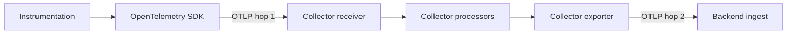
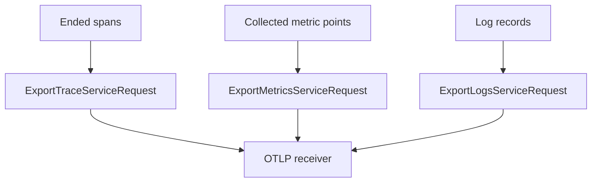
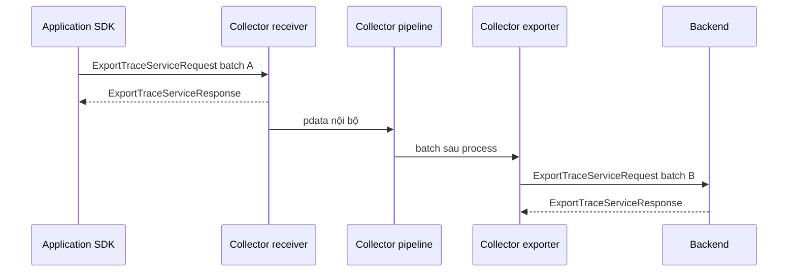

**OTLP (OpenTelemetry Protocol)** là protocol gốc của OpenTelemetry để chuyển
telemetry giữa SDK, Collector và backend. Trang này tập trung vào dữ liệu và
ngữ nghĩa giao nhận của OTLP. Trang kế tiếp đi sâu vào hai transport cụ thể là
[OTLP/gRPC và OTLP/HTTP](/protocols-backends/otlp-grpc-http/).

<Callout type="info" title="Phạm vi ổn định">
  OTLP hiện ổn định cho **traces, metrics và logs**. Profiles vẫn đang phát
  triển, vì vậy trang này chỉ dùng ba signal ổn định để tránh biến chi tiết thử
  nghiệm thành contract production.
</Callout>

## Mục lục

- [Mental model: OTLP giải quyết điều gì?](#mental-model-otlp-giải-quyết-điều-gì)
  - [Protocol không phải transport](#protocol-không-phải-transport)
  - [Client và server thay đổi theo từng hop](#client-và-server-thay-đổi-theo-từng-hop)
- [Data model của OTLP](#data-model-của-otlp)
  - [Resource, scope và record](#resource-scope-và-record)
  - [Một request chỉ chứa một signal](#một-request-chỉ-chứa-một-signal)
  - [Batch nằm ở đâu?](#batch-nằm-ở-đâu)
- [Đường đi từ SDK đến backend](#đường-đi-từ-sdk-đến-backend)
  - [Hop từ application đến Collector](#hop-từ-application-đến-collector)
  - [Hop từ Collector đến backend](#hop-từ-collector-đến-backend)
  - [Acknowledgement không phải xác nhận end-to-end](#acknowledgement-không-phải-xác-nhận-end-to-end)
- [Cấu hình local có thể chạy](#cấu-hình-local-có-thể-chạy)
  - [Collector nhận cả gRPC và HTTP](#collector-nhận-cả-grpc-và-http)
  - [SDK gửi bằng biến môi trường](#sdk-gửi-bằng-biến-môi-trường)
- [Success, partial success và retry](#success-partial-success-và-retry)
  - [Ba kết quả của một Export request](#ba-kết-quả-của-một-export-request)
  - [Retry có thể tạo dữ liệu trùng](#retry-có-thể-tạo-dữ-liệu-trùng)
- [Kiểm chứng end-to-end](#kiểm-chứng-end-to-end)
  - [Validate và kiểm tra listener](#validate-và-kiểm-tra-listener)
  - [Gửi canary cho từng signal](#gửi-canary-cho-từng-signal)
  - [Kiểm tra từng hop](#kiểm-tra-từng-hop)
- [Lỗi thường gặp](#lỗi-thường-gặp)
- [Nguyên tắc dùng OTLP trong production](#nguyên-tắc-dùng-otlp-trong-production)
- [Nguồn chính thức và bài liên quan](#nguồn-chính-thức-và-bài-liên-quan)

## Mental model: OTLP giải quyết điều gì?

OTLP định nghĩa cách một bên gửi **telemetry đã được cấu trúc** cho bên nhận.
Nó trả lời ba câu hỏi:

1. Dữ liệu traces, metrics và logs được biểu diễn bằng schema nào?
2. Dữ liệu đó được đặt vào request/response ra sao?
3. Client phải hiểu success, throttling và lỗi tạm thời như thế nào?

OTLP không định nghĩa cách backend lưu trữ, index hay hiển thị dữ liệu. Nó cũng
không tự tạo telemetry. Instrumentation và SDK làm việc đó trước khi exporter
mã hóa dữ liệu thành OTLP.

### Protocol không phải transport

**Protocol** là contract tổng thể về message và hành vi trao đổi. **Transport**
là cơ chế mang message qua mạng. OTLP hiện chuẩn hóa hai lựa chọn chính:

| Lớp | Ví dụ | Trách nhiệm |
| --- | --- | --- |
| Data model | `ResourceSpans`, `ResourceMetrics`, `ResourceLogs` | Giữ resource, instrumentation scope và records của signal. |
| Encoding | Protobuf nhị phân; JSON mapping cho OTLP/HTTP | Chuyển message có kiểu thành bytes hoặc JSON. |
| Protocol | `Export` request/response, partial success, retry semantics | Quy định cách client và server trao đổi một batch. |
| Transport | gRPC hoặc HTTP | Chuyển request qua kết nối mạng. |

Vì vậy, “dùng OTLP” chưa đủ để cấu hình kết nối. Hai đầu còn phải thống nhất
`grpc`, `http/protobuf` hoặc, nếu implementation hỗ trợ, `http/json`.

<Callout type="warn" title="Đừng suy ra transport từ chữ OTLP">
  Port `4317` thường dành cho OTLP/gRPC và `4318` thường dành cho OTLP/HTTP,
  nhưng port chỉ là convention mặc định. Protocol thực tế, TLS, path và listener
  của server mới quyết định kết nối có hoạt động hay không.
</Callout>

### Client và server thay đổi theo từng hop

Trong OTLP, **client** là bên gửi một `Export` request. **Server** là bên nhận và
trả response. Vai trò này áp dụng theo từng hop, không cố định cho cả hệ thống:



Ở hop 1, SDK là client và Collector receiver là server. Ở hop 2, Collector
exporter lại là client, còn backend là server. Mỗi hop có queue, timeout, retry
và acknowledgement riêng.

## Data model của OTLP

OTLP dùng [Protocol Buffers](https://protobuf.dev/) — ngôn ngữ định nghĩa message
có kiểu và cơ chế mã hóa tương thích tiến hóa schema. gRPC và HTTP dùng cùng
schema Protobuf. Điểm khác nằm ở framing, HTTP method/path và wire format của
transport.

### Resource, scope và record

Ba signal ổn định có cùng một khung phân cấp:

```text
Export<Signal>ServiceRequest
└── Resource<Signal>s[]
    ├── Resource
    └── Scope<Signal>s[]
        ├── InstrumentationScope
        └── signal records[]
```

- **Resource** là tập attributes mô tả entity phát telemetry, ví dụ
  `service.name=checkout` và `service.version=2.4.1`.
- **Instrumentation scope** nhận diện code instrumentation đã tạo dữ liệu,
  thường bằng tên và version của library hoặc module.
- **Signal record** là đơn vị dữ liệu cụ thể: `Span`, metric data point hoặc
  `LogRecord`.

Ví dụ trace được nhóm như sau:

```text
ExportTraceServiceRequest
└── ResourceSpans(service.name = "checkout")
    ├── ScopeSpans("io.opentelemetry.http")
    │   ├── Span("POST /checkout")
    │   └── Span("SELECT cart")
    └── ScopeSpans("shop.payment")
        └── Span("authorize payment")
```

Nhóm theo Resource và scope tránh lặp lại cùng metadata trên từng record. Một
Collector nhận dữ liệu từ nhiều services có thể forward nhiều nhóm Resource
trong cùng request.

| Signal | Request | Nhóm cấp Resource | Đơn vị bị đếm khi partial success |
| --- | --- | --- | --- |
| Traces | `ExportTraceServiceRequest` | `ResourceSpans` | `rejected_spans` |
| Metrics | `ExportMetricsServiceRequest` | `ResourceMetrics` | `rejected_data_points` |
| Logs | `ExportLogsServiceRequest` | `ResourceLogs` | `rejected_log_records` |

### Một request chỉ chứa một signal

Mỗi service `Export` có request/response riêng. Một request traces không chứa
metrics hoặc logs. Điều này giữ failure, retry và giới hạn batch độc lập cho
từng signal.

OTLP/gRPC gọi unary method `Export` trên service Protobuf tương ứng, ví dụ
`opentelemetry.proto.collector.trace.v1.TraceService/Export`. OTLP/HTTP gửi cùng
request message bằng `POST` tới path theo signal, ví dụ `/v1/traces`.



### Batch nằm ở đâu?

**Batch** là một nhóm records được xử lý hoặc gửi cùng nhau. Từ này xuất hiện ở
nhiều lớp, nhưng các lớp không phải cùng một queue:

1. SDK `BatchSpanProcessor` hoặc `BatchLogRecordProcessor` gom records trong
   process. Metrics thường được gom theo chu kỳ collection của metric reader.
2. Mỗi OTLP `Export<Signal>ServiceRequest` mang một batch của đúng một signal.
3. Collector `batch` processor có thể regroup dữ liệu sau khi nhận.
4. Sending queue của Collector exporter giữ các request đang chờ gửi và có thể
   có cơ chế batching riêng tùy phiên bản/configuration.

```text
SDK queue → OTLP request → Collector pipeline → exporter queue → OTLP request
```

Batch lớn giảm overhead trên mỗi record nhưng tăng memory, thời gian chờ và nguy
cơ vượt message/body limit của server. OTLP khuyến nghị implementation cho phép
giới hạn kích thước; server phải từ chối request quá lớn thay vì dùng memory
không giới hạn. Nói ngắn gọn: tune batch cùng queue và giới hạn receiver, không
chỉ tăng một con số ở SDK.

## Đường đi từ SDK đến backend

### Hop từ application đến Collector

Một flow traces điển hình diễn ra như sau:

1. Instrumentation tạo span qua OpenTelemetry API.
2. SDK gắn Resource, scope, attributes và sampling decision.
3. Span kết thúc và được đưa vào span processor.
4. OTLP exporter tạo `ExportTraceServiceRequest` rồi serialize.
5. Collector OTLP receiver decode request và đưa spans vào traces pipeline.

Metrics và logs đi qua provider/reader/processor riêng. Cấu hình traces thành
công không chứng minh hai signal còn lại đã có exporter hoặc pipeline.

### Hop từ Collector đến backend

Collector xử lý dữ liệu nội bộ, sau đó OTLP exporter tạo request mới. Request này
không nhất thiết có ranh giới batch giống request SDK đã gửi. Processor có thể
lọc records, thêm Resource attributes hoặc gom dữ liệu từ nhiều clients.



Collector không phải một đường ống byte trong suốt. Nó decode OTLP thành data
model nội bộ rồi exporter encode lại. Vì vậy, processor order, queue và exporter
cấu hình đều có thể thay đổi kết quả cuối.

### Acknowledgement không phải xác nhận end-to-end

Response của hop 1 chỉ cho biết Collector đã xử lý request theo contract của
receiver tại hop đó. Nó không cam kết backend cuối đã lưu và query được dữ liệu.
Collector có thể acknowledgement trước khi exporter của hop 2 thành công, tùy
queue và pipeline.

<Callout type="error" title="HTTP 200 chưa chứng minh backend có dữ liệu">
  Phải kiểm tra cả response body cho `partial_success`, telemetry nội bộ của
  Collector và dữ liệu canary tại backend. Health endpoint của Collector cũng
  chỉ phản ánh process/extension, không phải ingest end-to-end.
</Callout>

## Cấu hình local có thể chạy

### Collector nhận cả gRPC và HTTP

Lưu mẫu sau thành `otelcol.yaml`. Nó bind loopback, nhận ba signal qua cả hai
transport, batch rồi in bằng `debug` exporter:

```yaml
receivers:
  otlp:
    protocols:
      grpc:
        endpoint: 127.0.0.1:4317
      http:
        endpoint: 127.0.0.1:4318

processors:
  batch:
    timeout: 1s

exporters:
  debug:
    verbosity: detailed

service:
  pipelines:
    traces:
      receivers: [otlp]
      processors: [batch]
      exporters: [debug]
    metrics:
      receivers: [otlp]
      processors: [batch]
      exporters: [debug]
    logs:
      receivers: [otlp]
      processors: [batch]
      exporters: [debug]
```

Chạy bằng binary của distribution đang dùng:

```bash
otelcol validate --config=file:./otelcol.yaml
otelcol --config=file:./otelcol.yaml
```

Tên binary có thể là `otelcol-contrib`. Distribution phải chứa `otlp` receiver,
`batch` processor và `debug` exporter. Khi application và Collector ở hai
container khác nhau, `127.0.0.1` không còn đúng; bind địa chỉ phù hợp và thêm
network policy, TLS cùng authentication trước khi mở listener ra mạng.

### SDK gửi bằng biến môi trường

Mẫu này dùng OTLP/HTTP với Protobuf nhị phân. Endpoint chung là **base URL**, nên
exporter tự thêm path theo signal:

```bash
export OTEL_SERVICE_NAME=checkout
export OTEL_RESOURCE_ATTRIBUTES='service.namespace=shop,deployment.environment.name=local'
export OTEL_TRACES_EXPORTER=otlp
export OTEL_METRICS_EXPORTER=otlp
export OTEL_LOGS_EXPORTER=otlp
export OTEL_EXPORTER_OTLP_PROTOCOL=http/protobuf
export OTEL_EXPORTER_OTLP_ENDPOINT=http://127.0.0.1:4318
export OTEL_EXPORTER_OTLP_TIMEOUT=10000
```

Kết quả hiệu lực:

```text
traces  → http://127.0.0.1:4318/v1/traces
metrics → http://127.0.0.1:4318/v1/metrics
logs    → http://127.0.0.1:4318/v1/logs
```

Tên biến là chuẩn chung, nhưng auto-configuration và mức hỗ trợ logs/metrics
phụ thuộc ngôn ngữ, package và phiên bản SDK. Nếu code tự tạo exporter rồi
truyền options trực tiếp, đừng giả định constructor đó sẽ đọc mọi biến môi
trường. Xem cấu hình chi tiết tại [Cấu hình OpenTelemetry SDK](/instrumentation/configuration/).

## Success, partial success và retry

### Ba kết quả của một Export request

| Kết quả | Ý nghĩa | Client nên làm gì? |
| --- | --- | --- |
| Full success | Server chấp nhận request; `partial_success` không được đặt. | Xóa batch khỏi queue của hop hiện tại. |
| Partial success | Server chấp nhận một phần hoặc trả warning trong response thành công. | Ghi nhận rejected count/message; **không retry** request đó. |
| Failure | Cả request thất bại với gRPC status hoặc HTTP status. | Chỉ retry nếu status được OTLP phân loại là tạm thời. |

Partial success rất dễ bị bỏ sót vì transport vẫn thành công. Với HTTP, server
trả `200 OK`; với gRPC, RPC cũng hoàn thành thành công. Thông tin quan trọng nằm
trong trường `partial_success` của Protobuf response.

Ví dụ response traces về mặt logic:

```text
ExportTraceServiceResponse
└── partial_success
    ├── rejected_spans: 12
    └── error_message: "attribute value exceeded an ingest limit"
```

Client không retry toàn request partial success vì phần đã chấp nhận sẽ bị gửi
lại. Thay vào đó, exporter phải phát diagnostic để operator sửa nguyên nhân.

### Retry có thể tạo dữ liệu trùng

OTLP yêu cầu retry lỗi tạm thời với exponential backoff và jitter. **Jitter** là
độ lệch ngẫu nhiên thêm vào thời gian chờ để nhiều clients không retry cùng lúc.
Server có thể gửi `RetryInfo` trên gRPC hoặc `Retry-After` trên HTTP để báo khi
nên thử lại.

Khi kết nối đứt trước acknowledgement, client không biết server đã nhận batch
hay chưa. Gửi lại giúp giảm mất dữ liệu nhưng có thể tạo bản sao. OTLP chấp nhận
trade-off này; protocol không cung cấp exactly-once end-to-end.

Đồng thời, retry luôn bị giới hạn bởi queue, deadline và vòng đời process. Khi
queue đầy hoặc hết thời gian retry, dữ liệu vẫn có thể bị drop. Vì vậy, mô tả
thực tế là **giao nhận có acknowledgement và retry theo từng hop**, không phải
cam kết “không bao giờ mất dữ liệu”.

## Kiểm chứng end-to-end

### Validate và kiểm tra listener

Sau khi Collector khởi động, xác nhận đúng address đang listen:

```bash
ss -ltn | grep -E ':4317|:4318'
```

Nếu không thấy port, kiểm tra receiver có được tham chiếu trong
`service.pipelines` hay không. Validation chỉ chứng minh cấu hình parse được; nó
không chứng minh DNS, TLS, credential hoặc backend ingest.

### Gửi canary cho từng signal

`telemetrygen` là công cụ tạo telemetry của Collector Contrib. Với Collector
local ở trên, gửi một mẫu qua OTLP/gRPC:

```bash
telemetrygen traces --otlp-endpoint 127.0.0.1:4317 --otlp-insecure --traces 1
telemetrygen metrics --otlp-endpoint 127.0.0.1:4317 --otlp-insecure --metrics 1
telemetrygen logs --otlp-endpoint 127.0.0.1:4317 --otlp-insecure --logs 1
```

Pin version của `telemetrygen` trong CI vì công cụ này có stability alpha. Nếu
version đang dùng đổi flag, kiểm tra `telemetrygen <signal> --help`. Với
application thật, canary tốt hơn là một span có tên duy nhất, một counter tăng
một lần và một log record dễ tìm.

### Kiểm tra từng hop

1. Xem diagnostic của SDK để biết exporter đã tạo request hay chưa.
2. Xem output `debug` để chứng minh Collector receiver đã decode dữ liệu.
3. Thay hoặc fan-out sang exporter backend trong staging.
4. Theo dõi queue, retry, send failure và rejected data của Collector.
5. Query backend theo `service.name`, environment, trace ID hoặc tên canary.
6. Gỡ `debug` exporter sau khi kiểm chứng vì output có thể chứa dữ liệu nhạy cảm.

Nếu hop 1 thành công nhưng backend trống, đừng sửa instrumentation trước. Hãy
kiểm tra processors, exporter queue, auth/TLS ở hop 2 và tenant/time range của
backend.

## Lỗi thường gặp

| Triệu chứng | Nguyên nhân thường gặp | Cách xử lý |
| --- | --- | --- |
| `connection refused` | Sai host/port, receiver chưa chạy hoặc bind loopback trong container khác | Kiểm tra listener từ cùng network namespace với client. |
| `UNIMPLEMENTED` hoặc protocol error | Gửi OTLP/HTTP vào gRPC listener hoặc ngược lại | Đặt protocol rõ ràng và dùng đúng port/listener. |
| HTTP `404` | Thiếu `/v1/<signal>` khi dùng endpoint theo signal | Dùng endpoint chung hoặc thêm path đầy đủ. |
| Collector chạy nhưng không mở port | Receiver chỉ được khai báo, chưa gắn vào pipeline | Thêm receiver vào `service.pipelines.<signal>.receivers`. |
| Chỉ có traces | Metrics reader hoặc logs bridge/exporter chưa được cấu hình | Kiểm tra pipeline của từng signal độc lập. |
| Mất records khi traffic tăng | SDK/Collector queue đầy hoặc request quá lớn | Theo dõi dropped data; tune batch, queue và receiver limits cùng nhau. |
| Response thành công nhưng thiếu dữ liệu | Partial success bị bỏ qua hoặc processor đã filter | Đọc response diagnostics và kiểm tra từng processor. |
| Dữ liệu trùng | Retry sau khi mất acknowledgement | Thiết kế backend/query chịu được duplicate và theo dõi reconnect. |
| Dữ liệu cuối process bị mất | Batch chưa flush trước khi process thoát | Thêm graceful shutdown với `forceFlush`/`shutdown` và deadline. |
| Backend không nhóm đúng service | Thiếu hoặc sai `service.name` trong Resource | Đặt Resource ổn định và inspect payload tại Collector. |

## Nguyên tắc dùng OTLP trong production

- Dùng Collector làm ranh giới policy khi cần centralize credential, redaction,
  routing, batching và backend migration.
- Đặt `service.name` cùng Resource attributes trước khi export; OTLP chỉ vận
  chuyển identity đã có, không tự đoán business service.
- Chọn protocol/transport rõ ràng thay vì dựa vào default của SDK.
- Cấu hình timeout, queue và retry hữu hạn. Queue lớn không thay thế capacity
  planning hoặc durable storage.
- Theo dõi từng signal và từng hop. Một trace thành công không chứng minh logs và
  metrics thành công.
- Giới hạn request sau giải nén và bảo vệ receiver public bằng TLS,
  authentication, rate limit cùng network policy.
- Pin SDK, Collector distribution và backend version; kiểm thử tương thích OTLP
  khi nâng cấp.
- Chấp nhận khả năng duplicate khi retry và khả năng drop khi vượt giới hạn.

## Nguồn chính thức và bài liên quan

Các contract về message, port, response và retry trong trang dựa trên:

- [OTLP Specification](https://opentelemetry.io/docs/specs/otlp/)
- [OTLP Exporter Specification](https://opentelemetry.io/docs/specs/otel/protocol/exporter/)
- [OpenTelemetry Protocol Buffer definitions](https://github.com/open-telemetry/opentelemetry-proto)
- [Collector OTLP receiver](https://github.com/open-telemetry/opentelemetry-collector/tree/main/receiver/otlpreceiver)
- [Collector telemetrygen](https://github.com/open-telemetry/opentelemetry-collector-contrib/tree/main/cmd/telemetrygen)

<Cards>
  <Card
    title="OTLP/gRPC và OTLP/HTTP"
    href="/protocols-backends/otlp-grpc-http/"
    description="Chọn transport, cấu hình endpoint, TLS, headers và xử lý status."
  />
  <Card
    title="Telemetry pipeline"
    href="/fundamentals/telemetry-pipeline/"
    description="Theo dõi dữ liệu qua SDK, Collector processors và backend."
  />
  <Card
    title="Cấu hình Collector"
    href="/collector/configuration/"
    description="Validate component graph, environment substitution và secret."
  />
  <Card
    title="Cấu hình SDK"
    href="/instrumentation/configuration/"
    description="Cấu hình Resource, exporters, batching và lifecycle theo signal."
  />
</Cards>
