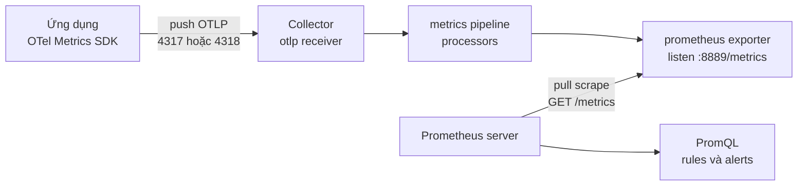
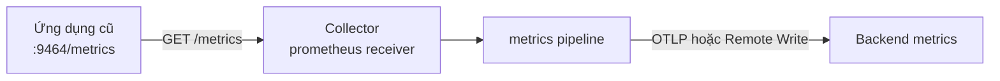
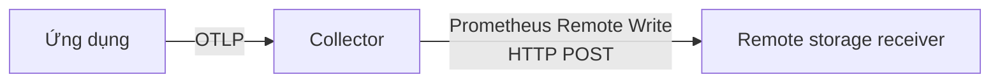

<Callout type="info" title="Mental model quan trọng nhất">
  Prometheus thường **pull** bằng cách scrape một HTTP endpoint. OpenTelemetry SDK
  thường **push** OTLP đến Collector. Hai cơ chế có thể nằm trong cùng một đường
  dữ liệu: ứng dụng push OTLP vào Collector, rồi Prometheus pull từ endpoint do
  `prometheus` exporter của Collector mở ra.
</Callout>

## Mục lục

- [Pull scrape và push qua OTLP](#pull-scrape-và-push-qua-otlp)
  - [Ứng dụng push OTLP rồi Prometheus pull](#ứng-dụng-push-otlp-rồi-prometheus-pull)
  - [Collector scrape một Prometheus target](#collector-scrape-một-prometheus-target)
  - [Push bằng Prometheus Remote Write](#push-bằng-prometheus-remote-write)
- [Chọn component theo hướng dữ liệu](#chọn-component-theo-hướng-dữ-liệu)
- [Temporality counter và reset](#temporality-counter-và-reset)
  - [Vì sao cumulative hợp với Prometheus](#vì-sao-cumulative-hợp-với-prometheus)
  - [Delta cần state chuyển đổi](#delta-cần-state-chuyển-đổi)
- [Histogram và exemplars](#histogram-và-exemplars)
  - [Explicit histogram](#explicit-histogram)
  - [Exponential và native histogram](#exponential-và-native-histogram)
- [Resource attributes labels và tên metric](#resource-attributes-labels-và-tên-metric)
  - [Resource thành job instance và target info](#resource-thành-job-instance-và-target-info)
  - [Chỉ quảng bá resource attributes cần truy vấn](#chỉ-quảng-bá-resource-attributes-cần-truy-vấn)
  - [Chuẩn hóa tên và suffix](#chuẩn-hóa-tên-và-suffix)
- [Cardinality và chi phí time series](#cardinality-và-chi-phí-time-series)
- [Thực hành OTLP vào Collector rồi Prometheus scrape](#thực-hành-otlp-vào-collector-rồi-prometheus-scrape)
  - [Tạo cấu hình Collector](#tạo-cấu-hình-collector)
  - [Tạo cấu hình Prometheus](#tạo-cấu-hình-prometheus)
  - [Chạy bằng Docker Compose](#chạy-bằng-docker-compose)
  - [Gửi một metric OTLP kiểm soát được](#gửi-một-metric-otlp-kiểm-soát-được)
  - [Xác minh bằng endpoint và PromQL](#xác-minh-bằng-endpoint-và-promql)
- [Cấu hình Prometheus receiver](#cấu-hình-prometheus-receiver)
- [Cấu hình Prometheus Remote Write](#cấu-hình-prometheus-remote-write)
- [Failure modes thường gặp](#failure-modes-thường-gặp)
- [Best practices cho production](#best-practices-cho-production)
- [Nguồn tham khảo chính thức](#nguồn-tham-khảo-chính-thức)
- [Tài liệu liên quan](#tài-liệu-liên-quan)

## Pull scrape và push qua OTLP

**Scrape** là một lần hệ thống thu thập gửi HTTP request đến endpoint metrics rồi
đọc snapshot hiện tại. Prometheus chủ động lên lịch các lần scrape, nên đây là mô
hình **pull**.

**Push** nghĩa là producer hoặc một thành phần trung gian chủ động gửi telemetry
đến receiver. OpenTelemetry SDK thường export theo chu kỳ bằng OTLP, tức
OpenTelemetry Protocol, đến Collector qua gRPC hoặc HTTP.

### Ứng dụng push OTLP rồi Prometheus pull

Đây là topology phổ biến khi ứng dụng dùng OpenTelemetry Metrics SDK:



`otlp` **receiver** là cửa vào của Collector. `prometheus` **exporter** là cửa ra
đặc biệt: thay vì gửi request đến Prometheus, nó mở một HTTP listener và chờ
Prometheus scrape.

<Callout type="error" title="Đừng đảo endpoint">
  `prometheus` exporter với `endpoint: 0.0.0.0:8889` làm Collector **listen** tại
  `:8889/metrics`. Prometheus phải scrape địa chỉ đó. Trường này không phải URL
  của Prometheus server và không được đặt thành `prometheus:9090`.
</Callout>

### Collector scrape một Prometheus target

`prometheus` **receiver** đi theo hướng ngược lại ở boundary đầu vào. Collector
trở thành scraper và pull metrics từ một ứng dụng hoặc exporter đã có endpoint
Prometheus.



Trong hình này, `static_configs.targets` thuộc receiver là **target cần scrape**.
Nó không phải endpoint mà receiver mở để target gửi dữ liệu vào. Receiver sử
dụng cấu trúc `scrape_configs` của Prometheus và hỗ trợ service discovery,
relabeling cùng phần lớn scrape configuration.

### Push bằng Prometheus Remote Write

**Prometheus Remote Write** là giao thức push các samples Prometheus đến một
remote-write-compatible backend. Collector có exporter
`prometheus_remote_write` cho Cortex, Grafana Mimir, Thanos Receive, Prometheus
đã bật remote-write receiver, hoặc backend tương thích khác.



Remote Write không mở endpoint để Prometheus scrape. Nó là HTTP client gửi batch
ra ngoài. Chỉ dùng hướng này khi backend cung cấp remote-write ingest endpoint
và bạn cần push. Nếu đang chạy một Prometheus server gần Collector, pull từ
`prometheus` exporter thường đơn giản hơn và giữ đúng mô hình vận hành của
Prometheus.

Prometheus hiện cũng có OTLP/HTTP receiver riêng khi bật cờ tương ứng. Đó là một
lựa chọn direct-ingest khác, không phải `prometheus` receiver của Collector và
không phải Remote Write. Trang này ưu tiên Collector làm gateway để minh họa rõ
các boundary.

## Chọn component theo hướng dữ liệu

| Component hoặc cơ chế | Ai mở listener | Ai khởi tạo request | Dữ liệu đi đâu | Khi nên dùng |
| --- | --- | --- | --- | --- |
| Collector `otlp` receiver | Collector, thường `4317` hoặc `4318` | SDK hoặc Collector upstream | Vào Collector | Ứng dụng OpenTelemetry push metrics |
| Collector `prometheus` exporter | Collector, ví dụ `8889/metrics` | Prometheus server | Từ Collector sang Prometheus qua scrape | Prometheus pull dữ liệu đã qua pipeline |
| Collector `prometheus` receiver | Ứng dụng/exporter target, ví dụ `9464/metrics` | Collector | Từ target vào Collector | Thu thập endpoint Prometheus hiện có |
| Collector `prometheus_remote_write` exporter | Backend remote write | Collector | Từ Collector đến remote storage | Backend yêu cầu push Remote Write |
| Prometheus OTLP receiver | Prometheus, path OTLP/HTTP | SDK hoặc Collector | Trực tiếp vào Prometheus TSDB | Muốn bỏ pull boundary và chấp nhận direct ingest |

Một pipeline có thể vừa dùng receiver vừa dùng exporter cùng tên loại. Ví dụ,
Collector A scrape legacy targets bằng `prometheus` receiver rồi Collector B mở
`prometheus` exporter cho Prometheus trung tâm scrape. Tên giống nhau không làm
hướng dữ liệu giống nhau; vị trí trong `receivers` hoặc `exporters` mới quyết
định vai trò.

## Temporality counter và reset

**Aggregation temporality** mô tả data point đại diện cho riêng interval gần nhất
hay toàn bộ thời gian từ lúc bắt đầu:

- **Cumulative** giữ tổng từ start time. Một Counter có thể lần lượt là `10`,
  `17`, `25`.
- **Delta** chỉ giữ thay đổi của interval. Cùng dữ liệu đó có thể là `10`, `7`,
  `8`.

Gauge là snapshot tại một thời điểm nên không có aggregation temporality.

### Vì sao cumulative hợp với Prometheus

Prometheus Counter là cumulative. Hàm `rate()` hoặc `increase()` lấy các sample
cumulative, tính chênh lệch theo thời gian và xử lý counter reset. Ví dụ:

```text
rate(http_server_request_duration_seconds_count[5m])
```

Nếu process restart và counter quay về `0`, Prometheus nhận diện mức giảm như một
reset thay vì request âm. Resource identity và scrape labels vẫn phải đủ ổn định
để không trộn nhiều writer vào cùng series.

Prometheus Histogram cổ điển cũng cumulative. Mỗi series `_bucket`, `_count` và
`_sum` tăng dần khi observations không âm. Vì vậy, đường xuất Prometheus an toàn
nhất là yêu cầu OpenTelemetry SDK xuất cumulative cho monotonic Sum và Histogram.
Đây cũng là temporality mặc định của OTLP Metrics exporter.

### Delta cần state chuyển đổi

Delta không thể được scrape trực tiếp như một counter snapshot. Một thành phần
phải cộng các delta liên tiếp thành cumulative và giữ state theo từng series.
Collector `prometheus` exporter có accumulator để phục vụ mô hình pull, nhưng
việc chuyển đổi vẫn có các hệ quả:

- Collector restart làm mất state cục bộ và tạo một chuỗi cumulative mới;
- delta đến sai thứ tự, bị mất hoặc đi qua nhiều replica không sticky có thể làm
  tổng sai;
- thay đổi bucket boundaries hoặc Resource giữa hai delta làm stream không còn
  align;
- state tăng theo cardinality và phải được hết hạn.

`prometheus_remote_write` exporter hiện bỏ các monotonic Sum, Histogram và
Summary không cumulative. Đừng giả định Remote Write sẽ tự cộng delta. Nếu nguồn
bắt buộc phát delta, hãy thiết kế một tầng delta-to-cumulative có state, route
mỗi stream đến cùng logical instance và kiểm thử restart trước khi dùng.

<Callout type="warn" title="Không đổi temporality mà không migration">
  Đổi cumulative sang delta là thay đổi semantics và state ownership. Hãy kiểm
  tra output thực tế tại Collector, hành vi khi restart và mọi recording rule;
  đừng chỉ thấy tên metric giống nhau rồi coi hai đường dữ liệu tương đương.
</Callout>

## Histogram và exemplars

Histogram gom các observations vào phân bố. Nó phù hợp cho latency, kích thước
payload hoặc thời gian chờ vì backend có thể tính rate, mean và quantile ước
lượng từ dữ liệu aggregate.

### Explicit histogram

OpenTelemetry explicit Histogram có `count`, `sum`, explicit bounds và số đếm
không cộng dồn theo từng bucket. Khi dịch sang Prometheus histogram cổ điển:

- mỗi boundary thành series `_bucket` với label `le`;
- bucket counts được cộng dồn đến từng `le`;
- tổng số observations thành `_count`;
- tổng giá trị thành `_sum` nếu có.

Ví dụ metric OTel `http.server.request.duration`, unit `s`, có thể xuất thành
family `http_server_request_duration_seconds` với các series
`_bucket`, `_count` và `_sum`. Truy vấn p95 theo route:

```text
histogram_quantile(
  0.95,
  sum by (le, http_route) (
    rate(http_server_request_duration_seconds_bucket[5m])
  )
)
```

`histogram_quantile` ước lượng trong bucket. Hãy đặt boundaries gần SLO thay vì
mong p95 chính xác hơn độ phân giải của buckets. Mọi histogram được cộng trong
cùng query phải có boundaries tương thích.

**Exemplar** là một measurement mẫu có thể mang `trace_id` và `span_id`. Với
Collector `prometheus` exporter, phải bật `enable_open_metrics: true` để xuất
exemplars. Exporter chỉ xuất exemplar cho histogram và monotonic Sum trong định
dạng OpenMetrics. Prometheus phía nhận cũng phải lưu exemplars. Exemplar là cầu
nối đến trace đại diện, không phải một label của toàn bộ time series.

### Exponential và native histogram

OpenTelemetry ExponentialHistogram dùng buckets theo lũy thừa cơ số 2. Prometheus
Native Histogram lưu một cấu trúc histogram trong một series thay vì nhiều
series `_bucket` cổ điển.

Collector `prometheus` exporter có thể chuyển ExponentialHistogram cumulative
sang Prometheus Native Histogram. Prometheus phải scrape bằng protobuf và chấp
nhận native histograms. Khả năng này phụ thuộc phiên bản, scrape protocol và
feature configuration của cả hai phía.

Đường fallback thực dụng là explicit Histogram. Chỉ bật native histogram sau
khi xác minh:

1. SDK thật sự phát ExponentialHistogram;
2. mọi processor giữ nguyên type và temporality;
3. exporter expose native histogram thay vì drop;
4. Prometheus scrape đúng protocol;
5. recording rules, dashboard và remote storage hiểu native histogram.

## Resource attributes labels và tên metric

OpenTelemetry tách **Resource attributes**, mô tả entity phát telemetry, khỏi
metric attributes trên từng data point. Prometheus dùng labels cho identity của
time series, nên quá trình chuyển đổi phải ánh xạ hai lớp này có chủ đích.

### Resource thành job instance và target info

Với Prometheus exporter hiện hành:

- `service.name` trở thành label `job`;
- nếu có `service.namespace`, `job` có dạng
  `<service.namespace>/<service.name>`;
- `service.instance.id` trở thành label `instance`;
- các Resource attributes còn lại được đặt trên metric `target_info` theo mặc
  định;
- instrumentation scope được biểu diễn bằng các labels `otel_scope_*` trừ khi
  cấu hình bỏ scope info.

Ví dụ Resource:

```text
service.namespace=shop
service.name=checkout
service.instance.id=checkout-7f9c
service.version=2.4.1
deployment.environment.name=production
```

sẽ cho các application series labels `job="shop/checkout"` và
`instance="checkout-7f9c"`. `service_version` cùng
`deployment_environment_name` có thể nằm trên `target_info`.

Có thể join một Resource attribute tại query time:

```text
rate(demo_requests_total[5m])
* on (job, instance) group_left(deployment_environment_name)
  target_info{deployment_environment_name="production"}
```

Join giữ series ứng dụng nhỏ hơn, nhưng query phức tạp và cần `job`/`instance`
khớp. Prometheus có hàm `info()` thử nghiệm ở một số phiên bản để làm dạng join
này thuận tiện hơn; không dùng nó trong rule production nếu chưa chấp nhận trạng
thái feature và pin version.

### Chỉ quảng bá resource attributes cần truy vấn

Tùy chọn sau chép **mọi** Resource attribute vào **mọi** metric series:

```yaml
exporters:
  prometheus:
    endpoint: 0.0.0.0:8889
    resource_to_telemetry_conversion:
      enabled: true
```

Cách này tiện cho lab nhưng có thể nhân cardinality mạnh. `process.command_args`,
container ID, pod UID hoặc instance ID thay đổi thường xuyên sẽ xuất hiện trên
mọi series.

Trong production, ưu tiên allow-list vài attributes cần filter hoặc group. Ví dụ
copy environment và service version bằng transform processor:

```yaml
processors:
  transform/prometheus_labels:
    error_mode: ignore
    metric_statements:
      - context: datapoint
        statements:
          - set(attributes["deployment_environment_name"], resource.attributes["deployment.environment.name"]) where resource.attributes["deployment.environment.name"] != nil
          - set(attributes["service_version"], resource.attributes["service.version"]) where resource.attributes["service.version"] != nil
```

Sau đó đặt processor trước exporter trong metrics pipeline. Tên label đích đã
được chọn ở dạng Prometheus để query dễ đọc. Luôn test collision nếu metric đã có
attribute cùng tên.

### Chuẩn hóa tên và suffix

Mặc định, Collector dùng chiến lược
`UnderscoreEscapingWithSuffixes`:

- dấu `.`, `-`, `/` và ký tự không tương thích cổ điển thường thành `_`;
- unit UCUM được đổi sang từ Prometheus, ví dụ `s` thành `_seconds`;
- monotonic Sum có suffix `_total`;
- các phần `_bucket`, `_count` và `_sum` được tạo cho classic histogram;
- attribute keys cũng được chuẩn hóa thành label names.

Ví dụ:

```text
OTel name: http.server.request.duration
OTel unit: s
Prometheus family: http_server_request_duration_seconds
```

Prometheus 3 hỗ trợ UTF-8 metric và label names. Collector exporter có các
`translation_strategy` như `NoUTF8EscapingWithSuffixes` và `NoTranslation`.
Tuy nhiên, đổi strategy có thể đổi toàn bộ dashboard, alert và recording rule.
Nó cũng có thể tạo name collision nếu bỏ suffix unit/type.

Nói ngắn gọn: giữ `UnderscoreEscapingWithSuffixes` khi ưu tiên tương thích. Chỉ
đổi strategy sau khi inventory tên hiện tại, kiểm tra content negotiation và có
migration query rõ ràng.

## Cardinality và chi phí time series

**Cardinality** là số tổ hợp labels khác nhau. Với classic histogram có `B`
boundaries, mỗi tổ hợp attributes thường tạo `B + 2` series cho `_bucket`,
`_count`, `_sum`; còn có thể thêm series metadata.

Ví dụ có 15 buckets, 20 routes, 5 methods, 6 status groups và 10 instances:

```text
(15 + 2) × 20 × 5 × 6 × 10 = 102.000 time series
```

Đây mới là một histogram. Vì vậy:

- dùng route template `/users/{id}`, không dùng raw path `/users/8347`;
- không dùng `trace_id`, `span_id`, request ID, user ID hoặc order ID làm metric
  label;
- nhóm error thành tập hữu hạn, không dùng error message tự do;
- chỉ copy Resource attributes thật sự dùng để filter hoặc aggregate;
- drop attributes không cần thiết bằng SDK View hoặc processor trước exporter;
- đo active series và churn, không chỉ đếm metric names;
- cân nhắc native histogram khi backend và query path đã hỗ trợ, vì classic
  buckets nhân số series.

<Callout type="warn" title="Trace ID thuộc exemplar hoặc trace">
  Đưa trace ID vào metric label tạo gần một series cho mỗi request. Nếu cần đi từ
  latency đến trace, dùng exemplar; nếu cần tìm một request cụ thể, query trace
  hoặc log.
</Callout>

## Thực hành OTLP vào Collector rồi Prometheus scrape

Bài lab tạo đúng topology: curl push một cumulative Counter bằng OTLP/HTTP đến
Collector; Collector expose Prometheus endpoint; Prometheus scrape endpoint đó.
Cấu hình chỉ dành cho local và không có TLS hay authentication.

Tạo một thư mục trống:

```bash
mkdir -p /tmp/otel-prometheus-lab
cd /tmp/otel-prometheus-lab
```

### Tạo cấu hình Collector

Tạo `otelcol.yaml`:

```yaml
receivers:
  otlp:
    protocols:
      grpc:
        endpoint: 0.0.0.0:4317
      http:
        endpoint: 0.0.0.0:4318

processors:
  batch:
    timeout: 1s

exporters:
  prometheus:
    endpoint: 0.0.0.0:8889
    enable_open_metrics: true
    translation_strategy: UnderscoreEscapingWithSuffixes
    metric_expiration: 5m

service:
  pipelines:
    metrics:
      receivers: [otlp]
      processors: [batch]
      exporters: [prometheus]
```

`4317` và `4318` là push receivers. `8889/metrics` là pull endpoint. Processor
`batch` không đổi temporality; nó chỉ gom data trước exporter.

### Tạo cấu hình Prometheus

Tạo `prometheus.yml`:

```yaml
global:
  scrape_interval: 5s
  evaluation_interval: 5s

scrape_configs:
  - job_name: otel-from-collector
    honor_labels: true
    static_configs:
      - targets: ["collector:8889"]
```

Tên `collector` là DNS service của Docker Compose. Không dùng `localhost:8889`
trong container Prometheus, vì `localhost` ở đó là chính container Prometheus.
`honor_labels: true` giữ `job` và `instance` mà exporter tạo từ OpenTelemetry
Resource. Nếu để mặc định `false`, Prometheus dùng scrape job/target cho hai
labels này và đổi labels từ payload thành `exported_job`/`exported_instance`.

### Chạy bằng Docker Compose

Tạo `docker-compose.yaml`:

```yaml
services:
  collector:
    image: ghcr.io/open-telemetry/opentelemetry-collector-releases/opentelemetry-collector-contrib:0.157.0
    command: ["--config=/etc/otelcol-contrib/config.yaml"]
    volumes:
      - ./otelcol.yaml:/etc/otelcol-contrib/config.yaml:ro
    ports:
      - "127.0.0.1:4317:4317"
      - "127.0.0.1:4318:4318"
      - "127.0.0.1:8889:8889"

  prometheus:
    image: prom/prometheus:v3.13.1
    command: ["--config.file=/etc/prometheus/prometheus.yml"]
    volumes:
      - ./prometheus.yml:/etc/prometheus/prometheus.yml:ro
    depends_on:
      - collector
    ports:
      - "127.0.0.1:9090:9090"
```

Các version là pin dùng để bài lab tái lập được. Khi nâng version, đọc release
notes và validate lại config:

```bash
docker compose run --rm collector validate --config=/etc/otelcol-contrib/config.yaml
docker compose run --rm --entrypoint promtool prometheus check config /etc/prometheus/prometheus.yml
docker compose up -d
docker compose ps
```

`depends_on` chỉ quyết định thứ tự tạo container. Prometheus sẽ đánh target down
trong vài giây nếu Collector chưa listen và tự thử lại ở scrape kế tiếp.

### Gửi một metric OTLP kiểm soát được

Lệnh sau gửi Counter cumulative `demo.requests=42` với route hữu hạn:

```bash
start_ns=$(( ($(date +%s) - 60) * 1000000000 ))
now_ns=$(( $(date +%s) * 1000000000 ))

curl --fail-with-body --silent --show-error \
  -X POST \
  -H 'Content-Type: application/json' \
  --data-binary @- \
  http://localhost:4318/v1/metrics <<JSON
{
  "resourceMetrics": [
    {
      "resource": {
        "attributes": [
          {"key": "service.namespace", "value": {"stringValue": "shop"}},
          {"key": "service.name", "value": {"stringValue": "checkout"}},
          {"key": "service.instance.id", "value": {"stringValue": "checkout-local-1"}},
          {"key": "deployment.environment.name", "value": {"stringValue": "local"}}
        ]
      },
      "scopeMetrics": [
        {
          "scope": {"name": "prometheus-lab", "version": "1.0.0"},
          "metrics": [
            {
              "name": "demo.requests",
              "description": "Number of completed demo requests.",
              "unit": "{request}",
              "sum": {
                "aggregationTemporality": "AGGREGATION_TEMPORALITY_CUMULATIVE",
                "isMonotonic": true,
                "dataPoints": [
                  {
                    "attributes": [
                      {"key": "http.route", "value": {"stringValue": "/checkout"}},
                      {"key": "http.request.method", "value": {"stringValue": "POST"}}
                    ],
                    "startTimeUnixNano": "${start_ns}",
                    "timeUnixNano": "${now_ns}",
                    "asInt": "42"
                  }
                ]
              }
            }
          ]
        }
      ]
    }
  ]
}
JSON
```

HTTP thành công chỉ chứng minh Collector nhận payload. Chờ tối đa một batch
interval cộng một scrape interval trước khi query Prometheus.

### Xác minh bằng endpoint và PromQL

Kiểm tra từng hop theo thứ tự:

```bash
# Collector đã dịch metric sang Prometheus exposition chưa?
curl --fail --silent http://localhost:8889/metrics | grep -E '^(# (HELP|TYPE) demo_|demo_)'

# Prometheus có scrape target thành công không?
curl --fail --silent --get \
  --data-urlencode 'query=up{job="otel-from-collector"}' \
  http://localhost:9090/api/v1/query

# Có series ứng dụng sau bước chuẩn hóa tên không?
curl --fail --silent --get \
  --data-urlencode 'query={__name__=~"demo_.*",job="shop/checkout"}' \
  http://localhost:9090/api/v1/query
```

Với translation strategy trong bài, metric thường có tên
`demo_requests_total`. Xác nhận bằng output thật thay vì hard-code giả định khi
thay exporter version hoặc strategy.

Một vài PromQL hữu ích:

```text
# Giá trị cumulative hiện tại
demo_requests_total{job="shop/checkout", instance="checkout-local-1"}

# Rate chỉ có ý nghĩa sau khi gửi nhiều điểm cumulative tăng dần
rate(demo_requests_total{job="shop/checkout"}[1m])

# Resource metadata chưa được copy lên mọi series
target_info{job="shop/checkout", deployment_environment_name="local"}

# Tìm scrape failures
up{job="otel-from-collector"} == 0
```

Một payload duy nhất chưa đủ để `rate()` có kết quả đáng tin. Hãy gửi lại các
điểm có cùng start time, timestamp tăng và cumulative value tăng, ví dụ `47`,
`55`. Trong ứng dụng thật, SDK quản lý timestamps và collection; không tự dựng
OTLP JSON trên hot path.

Dừng lab:

```bash
docker compose down -v
```

## Cấu hình Prometheus receiver

Ví dụ sau cho Collector scrape một ứng dụng legacy tại
`legacy-app:9464/metrics`, rồi gửi dữ liệu bằng OTLP/gRPC đến gateway. Đây là một
pipeline khác với lab phía trên:

```yaml
receivers:
  prometheus/legacy:
    config:
      scrape_configs:
        - job_name: legacy-checkout
          scrape_interval: 15s
          static_configs:
            - targets: ["legacy-app:9464"]
          metric_relabel_configs:
            - source_labels: [__name__]
              regex: "(http_.*|process_.*)"
              action: keep

processors:
  batch:

exporters:
  otlp_grpc/metrics_gateway:
    endpoint: metrics-gateway.internal:4317
    tls:
      ca_file: /var/run/secrets/ca.pem

service:
  pipelines:
    metrics:
      receivers: [prometheus/legacy]
      processors: [batch]
      exporters: [otlp_grpc/metrics_gateway]
```

Receiver tái sử dụng Prometheus scrape manager. Counter Prometheus được chuyển
thành OTLP monotonic cumulative Sum; classic Histogram được ghép từ
`_bucket`, `_count`, `_sum`; `target_info` có thể được dùng để tạo Resource.

Các lưu ý vận hành:

- nhiều Collector replicas có cùng scrape config sẽ scrape trùng target và tạo
  duplicate data;
- receiver chưa tự shard scrape khi scale ngang; dùng Target Allocator hoặc cơ
  chế phân chia target được kiểm chứng;
- `rule_files`, Alertmanager config, `remote_read` và `remote_write` không thuộc
  phạm vi receiver;
- escape `$` thành `$$` trong embedded Prometheus config nếu Collector có thể
  hiểu nó như environment substitution;
- target `legacy-app:9464` là nơi **ứng dụng listen**, không phải nơi Collector
  listen.

## Cấu hình Prometheus Remote Write

Mẫu production-oriented sau chỉ minh họa exporter. Endpoint, authentication và
TLS phải theo backend thật:

```yaml
exporters:
  prometheus_remote_write/metrics_backend:
    endpoint: https://metrics.example.com/api/v1/push
    headers:
      Authorization: "Bearer ${env:METRICS_TOKEN}"
    tls:
      ca_file: /var/run/secrets/metrics-ca.pem
    remote_write_queue:
      enabled: true
      queue_size: 10000
      num_consumers: 1
    wal:
      directory: /var/lib/otelcol/prw
    translation_strategy: UnderscoreEscapingWithSuffixes
    resource_to_telemetry_conversion:
      enabled: false
```

Gắn exporter vào metrics pipeline như bình thường. Trước khi tăng
`num_consumers`, xác minh backend chấp nhận out-of-order samples. Prometheus
vanilla có thể reject samples đến sai thứ tự nếu không cấu hình out-of-order
window.

Remote Write 2.0 và native histogram support vẫn phụ thuộc feature gate cùng khả
năng của receiver. Không bật `protobuf_message` mới chỉ vì version cao hơn; hãy
kiểm tra trạng thái component, interoperability và rollback path.

WAL, tức **write-ahead log**, ghi request chờ gửi xuống đĩa để chịu được process
restart tốt hơn queue chỉ trong memory. WAL không thay thế monitoring dung lượng,
retention, retry limit hoặc backup. Mount directory bền vững và alert trên lag,
retry, rejected samples cùng disk usage.

## Failure modes thường gặp

| Triệu chứng | Nguyên nhân thường gặp | Cách xác minh | Cách xử lý |
| --- | --- | --- | --- |
| Prometheus target `DOWN` | Sai host, port, DNS hoặc Collector chưa listen | Mở Prometheus Targets; curl `:8889/metrics` từ network namespace của Prometheus | Sửa target thành endpoint exporter và kiểm tra firewall |
| Collector báo `address already in use` | Hai component/process cùng bind `8889` | Kiểm tra listener và config instances | Dùng port riêng; chỉ một owner cho listener |
| Collector nhận OTLP nhưng `/metrics` trống | Metrics pipeline thiếu receiver/exporter hoặc batch chưa flush | Xem config effective và Collector logs | Tham chiếu đúng components trong `service.pipelines.metrics` |
| Scrape thành công nhưng không có app metric | `up=1` chỉ chứng minh endpoint sống; app chưa export hoặc metric expired | Curl raw exposition và debug OTLP input | Tạo traffic, chờ collection, kiểm tra SDK shutdown/flush |
| Query dùng tên OTel trả rỗng | Tên đã đổi dấu chấm, unit hoặc `_total` suffix | Liệt kê `__name__` hoặc đọc `/metrics` | Query tên sau translation; pin strategy |
| `rate()` có spike sau restart | State cumulative reset hoặc nhiều writer trộn cùng series | So `instance`, start time và restart timeline | Giữ instance identity đúng; tránh multiple writers |
| Remote Write drop histogram/counter | Input là delta thay vì cumulative | Xem temporality ở debug exporter và drop logs | Cấu hình cumulative hoặc thêm chuyển đổi có state đã kiểm thử |
| Histogram p95 vô lý | Sai unit, boundaries thưa hoặc query thiếu `le` | So OTLP bounds với `_bucket` và query | Ghi đúng unit; dùng `sum by (le, ...)`; chỉnh boundaries |
| Không thấy exemplar | Exporter chưa dùng OpenMetrics, trace unsampled hoặc Prometheus không lưu exemplar | Inspect OpenMetrics output và exemplar config | Bật support end-to-end; record trong active sampled context |
| Series tăng đột biến | Raw URL, ID hoặc mọi Resource attribute bị copy thành labels | Top labels/series và recent config diff | Allow-list dimensions; bỏ high-cardinality fields |
| Join `target_info` lỗi many-to-many | `job`/`instance` không unique hoặc metadata churn overlap | Query `count by (job,instance)` trên `target_info` | Sửa Resource identity; cân nhắc promote field cần thiết |
| Collector receiver scrape trùng | Nhiều replicas có cùng targets | So scrape timestamps và replica logs | Shard targets hoặc dùng Target Allocator |
| Out-of-order samples | Nhiều Remote Write workers/replicas gửi cùng series không có ordering | Backend logs và rejected sample metrics | Giảm consumers, route sticky hoặc cấu hình backend có chủ đích |

## Best practices cho production

- Chọn một owner cho mỗi scrape target. Scale Collector receiver cần sharding,
  không chỉ tăng replica count.
- Giữ OTLP metrics cumulative khi đích là Prometheus, trừ khi đã thiết kế rõ nơi
  sở hữu state delta-to-cumulative.
- Pin Collector, Prometheus và component distribution. Validate config và chạy
  canary query trước rollout.
- Dùng semantic conventions cho metric name, unit, Resource và attributes. Khi
  convention đổi, migration dashboard/rules phải đi cùng deployment.
- Giữ `service.name`, `service.namespace` và `service.instance.id` đúng. Instance
  ID phải phân biệt các writers chạy đồng thời nhưng ổn định trong vòng đời
  process.
- Giữ translation strategy ổn định. Inventory tên sau translation trước khi đổi
  UTF-8 hoặc bỏ suffix.
- Allow-list Resource attributes cần thiết thay vì bật conversion toàn bộ.
- Đặt cardinality budget theo metric family. Classic histogram phải tính cả số
  buckets.
- Dùng exemplars cho metric-to-trace correlation; không dùng trace ID làm label.
- Bảo vệ mọi listener bằng network policy, TLS và authentication phù hợp.
  Prometheus exposition endpoint thường không có auth tích hợp ở exporter.
- Theo dõi chính pipeline: receiver accepted/refused, exporter failures, queue,
  WAL lag, scrape duration, sample limit, active series và target health.
- Test backend outage, Collector restart, application restart, stale series,
  remote-write retry và disk full. Happy path không chứng minh dữ liệu vẫn đúng
  sau reset.
- Tách metric nội bộ của Collector khỏi application metrics bằng job/port và
  retention phù hợp. Đừng dùng `up=1` như bằng chứng duy nhất rằng application
  data đã đến TSDB.

<Callout type="idea" title="Checklist chọn hướng">
  Nếu Prometheus có thể reach Collector và bạn muốn pull semantics, dùng
  `prometheus` exporter rồi scrape nó. Nếu Collector cần scrape endpoint có sẵn,
  dùng `prometheus` receiver. Nếu remote backend chỉ nhận push, dùng
  `prometheus_remote_write`. Luôn vẽ mũi tên trước khi viết YAML.
</Callout>

## Nguồn tham khảo chính thức

- [OpenTelemetry Collector Prometheus exporter](https://github.com/open-telemetry/opentelemetry-collector-contrib/tree/main/exporter/prometheusexporter) — endpoint, OpenMetrics, translation strategy, native histogram và Resource mapping.
- [OpenTelemetry Collector Prometheus receiver](https://github.com/open-telemetry/opentelemetry-collector-contrib/tree/main/receiver/prometheusreceiver) — scrape configuration, limitations, native histogram và Resource conversion.
- [OpenTelemetry Collector Prometheus Remote Write exporter](https://github.com/open-telemetry/opentelemetry-collector-contrib/tree/main/exporter/prometheusremotewriteexporter) — cumulative requirement, queue, WAL và protocol options.
- [OpenTelemetry Prometheus và OpenMetrics compatibility](https://opentelemetry.io/docs/specs/otel/compatibility/prometheus_and_openmetrics/) — quy tắc chuyển metrics, attributes, histogram, exemplars và Resource.
- [OpenTelemetry Metrics Data Model](https://opentelemetry.io/docs/specs/otel/metrics/data-model/) — temporality, reset, stream identity và single-writer.
- [Prometheus dùng làm OpenTelemetry backend](https://prometheus.io/docs/guides/opentelemetry/) — OTLP receiver, Resource promotion, UTF-8 và delta-to-cumulative hiện hành.
- [Prometheus metric and label naming](https://prometheus.io/docs/practices/naming/) — conventions cho metric name, unit và `_total`.
- [Prometheus histograms](https://prometheus.io/docs/practices/histograms/) — buckets, `histogram_quantile`, aggregation và caveats.
- [Prometheus Remote Write specification](https://prometheus.io/docs/specs/remote_write_spec/) — wire protocol và receiver expectations.

Component status và feature gates có thể thay đổi giữa các release. Hãy đối chiếu
README đúng tag image đang chạy, không chỉ nhánh `main`.

## Tài liệu liên quan

<Cards>
  <Card title="Metrics" href="/signals/metrics/" description="Hiểu instruments, aggregation, temporality và histogram trong OpenTelemetry." />
  <Card title="Exemplars" href="/signals/exemplars/" description="Nối một measurement đại diện với trace và span." />
  <Card title="Collector receivers" href="/collector/receivers/" description="Phân biệt cửa vào, listener và cơ chế pull của Collector." />
  <Card title="Collector exporters" href="/collector/exporters/" description="Hiểu cửa ra, retry và hành vi exporter theo protocol." />
  <Card title="Cardinality" href="/production/cardinality/" description="Đặt budget và kiểm soát số lượng time series." />
  <Card title="Grafana stack" href="/protocols-backends/grafana-stack/" description="Đặt Prometheus cạnh Tempo, Loki và Grafana cho ba signal." />
</Cards>
