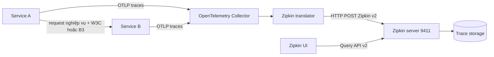

import { Step, Steps } from 'fumadocs-ui/components/steps';

Zipkin là một hệ thống distributed tracing đồng thời là tên của data model và
HTTP API ingest lịch sử. OpenTelemetry Collector có thể chuyển spans OTLP sang
Zipkin v2 để giữ một backend Zipkin hiện hữu. Đường này là một **compatibility
boundary** — ranh giới tương thích — chứ không phải phép chuyển đổi bảo toàn đầy
đủ OpenTelemetry.

<Callout type="warn" title="Không dùng direct Zipkin exporter cho thiết kế mới">
  Tài liệu transformation của OpenTelemetry đã đánh dấu Zipkin SDK exporter là
  deprecated và dự kiến loại khỏi specification vào tháng 12 năm 2026. Với hệ
  thống còn cần Zipkin, ưu tiên `OpenTelemetry SDK → OTLP → Collector → Zipkin
  exporter → Zipkin API v2`, hoặc đánh giá module OTLP của Zipkin. Cách này cô lập
  conversion khỏi application và tạo một điểm migration rõ ràng.
</Callout>

## Mục lục

- [Zipkin compatibility giải quyết bài toán gì](#zipkin-compatibility-giải-quyết-bài-toán-gì)
  - [Data model và API Zipkin v2](#data-model-và-api-zipkin-v2)
  - [Trace backend không phải backend đa signal](#trace-backend-không-phải-backend-đa-signal)
- [Pipeline OpenTelemetry đến Zipkin](#pipeline-opentelemetry-đến-zipkin)
- [Propagation khác export protocol](#propagation-khác-export-protocol)
  - [W3C Trace Context](#w3c-trace-context)
  - [B3 Single và B3 Multi](#b3-single-và-b3-multi)
  - [Chọn propagator trong migration](#chọn-propagator-trong-migration)
- [Chuyển đổi semantic và giới hạn](#chuyển-đổi-semantic-và-giới-hạn)
  - [Bảng ánh xạ chính](#bảng-ánh-xạ-chính)
  - [Những chỗ chuyển đổi bị lossy](#những-chỗ-chuyển-đổi-bị-lossy)
  - [Hệ quả khi truy vấn và round trip](#hệ-quả-khi-truy-vấn-và-round-trip)
- [Lab Collector đến Zipkin](#lab-collector-đến-zipkin)
  - [Tạo file Compose](#tạo-file-compose)
  - [Tạo cấu hình Collector](#tạo-cấu-hình-collector)
  - [Khởi động stack](#khởi-động-stack)
- [Gửi trace mẫu và xác minh](#gửi-trace-mẫu-và-xác-minh)
  - [Gửi OTLP JSON](#gửi-otlp-json)
  - [Xác minh bằng UI](#xác-minh-bằng-ui)
  - [Xác minh bằng Zipkin API](#xác-minh-bằng-zipkin-api)
- [Troubleshooting](#troubleshooting)
  - [Không có dữ liệu ở Zipkin](#không-có-dữ-liệu-ở-zipkin)
  - [Trace bị đứt giữa các service](#trace-bị-đứt-giữa-các-service)
  - [Tags và topology không như mong đợi](#tags-và-topology-không-như-mong-đợi)
  - [HTTP, TLS và queue](#http-tls-và-queue)
- [Khi nào nên dùng Zipkin compatibility](#khi-nào-nên-dùng-zipkin-compatibility)
- [Ghi chú production](#ghi-chú-production)
- [Nguồn chính thức và bài liên quan](#nguồn-chính-thức-và-bài-liên-quan)

## Zipkin compatibility giải quyết bài toán gì

Compatibility hữu ích khi application đang chuyển sang OpenTelemetry nhưng tổ
chức chưa thể thay backend Zipkin, storage, UI hoặc quy trình vận hành. Application
phát OTLP chuẩn; chỉ Collector chịu trách nhiệm chuyển sang model Zipkin. Khi bỏ
Zipkin, bạn thay exporter tại gateway thay vì sửa từng service.

Đừng dùng compatibility chỉ vì tên “Zipkin” quen thuộc. Nếu backend đích nhận
OTLP native và bạn không có contract Zipkin bắt buộc, OTLP end-to-end giữ semantic
OpenTelemetry tốt hơn và giảm một bước chuyển đổi.

### Data model và API Zipkin v2

Một **Zipkin span** là object mô tả góc nhìn của một host về operation. Các field
cốt lõi gồm:

| Field Zipkin | Ý nghĩa |
| --- | --- |
| `traceId` | ID 64 hoặc 128 bit dùng chung cho toàn trace |
| `id` và `parentId` | Span ID 64 bit và vị trí trong cây trace |
| `name` | Tên operation low-cardinality |
| `kind` | `CLIENT`, `SERVER`, `PRODUCER`, `CONSUMER` hoặc không đặt |
| `timestamp` và `duration` | Thời điểm bắt đầu và thời lượng, đơn vị microsecond |
| `localEndpoint` | Service, IP và port đã ghi span |
| `remoteEndpoint` | Peer của RPC hoặc messaging operation nếu biết |
| `annotations` | Các mốc `{timestamp, value}` bên trong span |
| `tags` | Map phẳng từ string sang string để hiển thị và tìm kiếm |

**Endpoint** trong Zipkin là network context, không phải URL ingest. Ví dụ
`localEndpoint.serviceName=checkout-api` cho biết service ghi span; còn
`http://zipkin:9411/api/v2/spans` là endpoint HTTP Collector dùng để gửi batch.

Zipkin v2 API quan trọng trong bài:

- `POST /api/v2/spans`: upload một danh sách spans bằng JSON hoặc Protobuf;
- `GET /api/v2/services`: liệt kê service names;
- `GET /api/v2/traces`: tìm traces theo service, span name, tags, duration và time;
- `GET /api/v2/trace/{traceId}`: lấy một trace cụ thể.

HTTP `202 Accepted` từ `POST /api/v2/spans` nghĩa là Zipkin đã chấp nhận request.
Nó không tạo bảo đảm exactly-once xuyên qua SDK, Collector, network và storage.

### Trace backend không phải backend đa signal

Zipkin data model và API trên dành cho **traces**. Zipkin exporter của Collector
cũng chỉ có stability cho trace signal. Metrics và logs phải đi qua pipeline và
backend khác.

```text
traces  ──► zipkin exporter ──► Zipkin
metrics ──► OTLP hoặc Prometheus exporter ──► metrics backend
logs    ──► OTLP exporter ──► log backend
```

Không thêm `metrics` hoặc `logs` pipeline vào `zipkin` exporter rồi mong Collector
tự đổi signal. Collector sẽ từ chối cấu hình không tương thích hoặc signal không
có đường xuất hợp lệ.

## Pipeline OpenTelemetry đến Zipkin



Sơ đồ có hai loại traffic độc lập:

1. `Service A → Service B` là **propagation** trong request nghiệp vụ. Header giúp
   B biết remote parent.
2. `Service → Collector → Zipkin` là **export** ngoài luồng request. Nó gửi spans
   đã hoàn tất tới nơi thu thập và lưu trữ.

Collector translator chuyển pdata — data model nội bộ của Collector — thành
Zipkin v2 span. Sau bước này, các field chỉ tồn tại trong OpenTelemetry có thể bị
làm phẳng, mã hóa vào string hoặc không còn là semantic field hạng nhất.

## Propagation khác export protocol

**Propagation format** trả lời “trace ID, parent span ID và sampling state đi qua
request nghiệp vụ như thế nào?”. **Export protocol** trả lời “batch spans đã ghi
được gửi đến collector/backend như thế nào?”. Hai lựa chọn không ràng buộc nhau.

| Propagation giữa services | Export đến Collector | Export từ Collector | Hợp lệ? |
| --- | --- | --- | --- |
| W3C `traceparent` | OTLP | Zipkin v2 | Có; đây là pipeline migration phổ biến |
| B3 Single | OTLP | OTLP | Có; backend không quyết định header application |
| B3 Multi | Zipkin API | Zipkin v2 | Có trong hệ thống legacy |
| W3C `traceparent` | OTLP | OTLP | Có; lựa chọn phù hợp cho greenfield |

<Callout type="idea" title="Quy tắc nhớ nhanh">
  Header trên request nghiệp vụ không phải payload export. Thấy `b3` không chứng
  minh spans được gửi bằng Zipkin API; thấy OTLP exporter cũng không chứng minh
  services đang propagate W3C đúng.
</Callout>

### W3C Trace Context

OpenTelemetry mặc định phổ biến dùng W3C Trace Context với `traceparent` và
`tracestate`, cộng W3C Baggage nếu bật `baggage`. Ví dụ:

```http
traceparent: 00-4bf92f3577b34da6a3ce929d0e0e4736-00f067aa0ba902b7-01
```

`traceparent` chứa version, trace ID 128 bit, parent ID 64 bit và trace flags.
Receiver extract header trước khi tạo server span. Server span dùng ID trong
header làm remote parent và tự tạo span ID mới.

Một cấu hình environment phổ biến là:

```bash
export OTEL_PROPAGATORS=tracecontext,baggage
```

Mức hỗ trợ environment variable và propagator package khác nhau theo ngôn ngữ.
Luôn kiểm tra SDK đang dùng và startup diagnostics; đừng suy ra cấu hình có hiệu
lực chỉ vì process không crash.

### B3 Single và B3 Multi

B3 là propagation specification của hệ sinh thái Zipkin. Nó có hai encoding HTTP:

**B3 Single** dùng một header `b3`:

```http
b3: 80f198ee56343ba864fe8b2a57d3eff7-e457b5a2e4d86bd1-1-05e3ac9a4f6e3b90
```

**B3 Multi** dùng nhiều header:

```http
X-B3-TraceId: 80f198ee56343ba864fe8b2a57d3eff7
X-B3-SpanId: e457b5a2e4d86bd1
X-B3-ParentSpanId: 05e3ac9a4f6e3b90
X-B3-Sampled: 1
```

B3 cho phép trace ID 64 hoặc 128 bit và span ID 64 bit. Sampling state có thể là
Defer, Deny, Accept hoặc Debug. Debug là trạng thái đặc thù B3; không nên giả định
nó round-trip chính xác qua W3C trace flags.

Trong environment specification của OpenTelemetry, tên thường gặp là `b3` cho
B3 Single và `b3multi` cho B3 Multi:

```bash
# Chỉ dùng khi runtime có B3 propagator và contract downstream yêu cầu.
export OTEL_PROPAGATORS=tracecontext,baggage,b3
```

Bật composite như trên có thể inject cả W3C và B3. Nó làm header lớn hơn và tạo
xung đột nếu hai format chứa IDs khác nhau. B3 specification quy định Single có
precedence trước Multi khi cả hai B3 encoding xuất hiện, nhưng precedence giữa
W3C và B3 phụ thuộc SDK/composite implementation. Phải integration-test runtime
thực tế.

### Chọn propagator trong migration

Dùng quy trình sau thay vì bật mọi format vô thời hạn:

<Steps>
<Step>

**1. Inventory từng boundary**

Ghi lại service, proxy, mesh, SDK version và format hiện đang inject/extract.
Capture headers trong test environment đã redact.

</Step>
<Step>

**2. Chọn canonical format**

Dùng W3C `tracecontext,baggage` cho traffic mới. Chỉ giữ B3 tại boundary có
consumer legacy chưa đọc W3C.

</Step>
<Step>

**3. Bật composite có thời hạn**

Test cả request chỉ có W3C, chỉ có B3 và có hai format xung đột. Ghi rõ precedence
mong đợi, owner và ngày gỡ B3.

</Step>
<Step>

**4. Đo rồi loại bỏ format cũ**

Theo dõi trace fragmentation và tỷ lệ request còn cần B3. Chuyển consumer trước,
sau đó ngừng inject B3 và cuối cùng ngừng extract nếu không còn traffic legacy.

</Step>
</Steps>

Propagation migration và backend migration có thể diễn ra độc lập. Bạn có thể
chuyển toàn bộ services sang W3C hôm nay nhưng tiếp tục export Zipkin v2 ở
Collector trong lúc backend chưa thay đổi.

## Chuyển đổi semantic và giới hạn

Phần này mô tả ý nghĩa cần kỳ vọng, không cam kết mọi version translator tạo
payload byte-for-byte giống nhau. OpenTelemetry Zipkin transformation specification
đã deprecated và còn các mục từng được đánh dấu TBD. Collector translator tiếp
tục có implementation riêng, feature gates và thay đổi theo semantic conventions.

### Bảng ánh xạ chính

| OpenTelemetry | Zipkin v2 | Điều cần nhớ |
| --- | --- | --- |
| `trace_id`, `span_id`, `parent_span_id` | `traceId`, `id`, `parentId` | OTel dùng trace ID 128 bit và span ID 64 bit, phù hợp Zipkin v2 |
| Span name | `name` | Giữ tên low-cardinality; Zipkin chuẩn hóa span name về lowercase |
| `CLIENT`, `SERVER`, `PRODUCER`, `CONSUMER` | `kind` tương ứng | `INTERNAL` không có kind tương ứng và thường được bỏ kind |
| Start và end timestamp nano | `timestamp` và `duration` microsecond | Duration được tính từ end trừ start; mất độ chính xác dưới microsecond |
| Resource `service.name` | `localEndpoint.serviceName` | Đây là field chính để Zipkin group và tìm service |
| Resource, scope và span attributes | Chủ yếu thành `tags` string | Phạm vi và kiểu dữ liệu có thể bị làm phẳng |
| Span events | `annotations` | Annotation chỉ có timestamp và value; event attributes phải được encode vào text |
| Span status | Các tags như `otel.status_code` và `error` | Không còn nguyên status object của OTel |
| Peer semantic attributes | `remoteEndpoint` khi translator suy ra được | Thiếu peer field có thể làm dependency graph không đầy đủ |
| TraceState và links | Không có field Zipkin tương đương đầy đủ | Collector có thể dùng tags opaque; consumer Zipkin khác không hiểu semantic đó |

`service.namespace` không được ghép tự động vào service name theo specification;
nó thường còn là tag. Nếu cần tên duy nhất, chuẩn hóa `service.name` ở Resource
trước conversion thay vì dựa vào UI ghép field.

### Những chỗ chuyển đổi bị lossy

**Lossy mapping** là chuyển đổi không thể tái tạo chính xác dữ liệu nguồn. Các
điểm quan trọng nhất của OTLP → Zipkin gồm:

1. **Kiểu attribute bị mất.** Zipkin tags là `string → string`. Integer `3`,
   boolean `true`, array và string có thể chỉ còn biểu diễn text. Query không còn
   chắc kiểu gốc.
2. **Ranh giới Resource, scope và span bị làm phẳng.** Một số Resource fields trở
   thành endpoint; nhiều field còn lại đi vào tags. Consumer chỉ nhìn Zipkin có
   thể không biết field ban đầu thuộc Resource hay span.
3. **Độ chính xác thời gian giảm.** OpenTelemetry timestamp dùng nanosecond;
   Zipkin v2 dùng microsecond nguyên. Operation cực ngắn và event sát nhau có thể
   cùng timestamp sau conversion.
4. **Event attributes không còn cấu trúc hạng nhất.** Collector hiện có thể serialize
   tên, attributes và dropped count vào annotation value. Zipkin UI xem nó như
   text; query theo từng event attribute không tương đương query OTel.
5. **Links không có model tương đương.** Collector hiện mã hóa links vào synthetic
   tags kiểu `otlp.link.N`. Đây là implementation detail để giữ thông tin đọc
   được, không biến link thành quan hệ trace native của Zipkin.
6. **TraceState không còn contract Zipkin hạng nhất.** Nó có thể tồn tại dưới dạng
   tag opaque, nhưng Zipkin query hoặc exporter khác không bắt buộc diễn giải.
7. **Status và error bị thu gọn.** Zipkin dựa nhiều vào `error` tag. Một mapping
   sai như gửi `error=false` vẫn có thể bị Zipkin hiểu là span lỗi theo convention.
8. **Shared-span semantics khác nhau.** Một số tracer Zipkin/Brave legacy có mô
   hình client và server cùng góp vào shared span. OpenTelemetry thường tạo client
   và server spans riêng. Trộn hai mô hình có thể làm cây hoặc dependency count
   khác mong đợi.
9. **Chỉ traces đi qua.** Metrics, logs, exemplars và correlation metadata ngoài
   span không có đích trong Zipkin exporter.

<Callout type="error" title="Round trip không phải phép đồng nhất">
  `OTLP → Zipkin → OTLP` không bảo đảm trả lại cùng Resource, scope, kiểu
  attribute, events, links, status hoặc timestamps ban đầu. Nếu một field là
  contract bắt buộc, hãy viết golden test qua đúng version Collector và backend,
  không chỉ kiểm tra “trace xuất hiện”.
</Callout>

### Hệ quả khi truy vấn và round trip

Ví dụ OTel source:

```json
{
  "resource": {"service.name": "checkout-api", "service.version": "1.4.0"},
  "span": {
    "name": "POST /checkout",
    "attributes": {
      "checkout.cart.items": 3,
      "checkout.expedited": true,
      "checkout.channels": ["web", "campaign"]
    }
  }
}
```

Sau conversion, Zipkin có thể biểu diễn tương đương về mặt hiển thị như:

```json
{
  "name": "post /checkout",
  "localEndpoint": {"serviceName": "checkout-api"},
  "tags": {
    "service.version": "1.4.0",
    "checkout.cart.items": "3",
    "checkout.expedited": "true",
    "checkout.channels": "[\"web\",\"campaign\"]"
  }
}
```

Ba giá trị trong `tags` đều là string. Vì vậy, query số học theo
`checkout.cart.items` hoặc phân biệt boolean với string không còn portable. Nói
ngắn gọn: thiết kế query theo model Zipkin sau conversion, nhưng giữ source schema
OpenTelemetry và test migration để không khóa application vào hạn chế đó.

## Lab Collector đến Zipkin

Lab dùng Zipkin memory storage và OpenTelemetry Collector Contrib. Collector nhận
OTLP từ host, chuyển traces sang Zipkin v2 JSON và gửi HTTP tới Zipkin.

<Callout type="warn" title="Lab không phải production">
  Zipkin memory storage không bền vững và không phù hợp tải thực tế. Kết nối trong
  Compose là plaintext, không có authentication. Chỉ dùng để quan sát conversion
  và API v2 trên máy local.
</Callout>

### Tạo file Compose

Lưu thành `docker-compose.yaml`:

```yaml
services:
  zipkin:
    image: openzipkin/zipkin:3.6.1
    ports:
      - "9411:9411"

  collector:
    image: otel/opentelemetry-collector-contrib:0.157.0
    command:
      - "--config=/etc/otelcol-contrib/config.yaml"
    volumes:
      - ./collector-config.yaml:/etc/otelcol-contrib/config.yaml:ro
    depends_on:
      - zipkin
    ports:
      - "4317:4317"
      - "4318:4318"
```

Zipkin phục vụ UI, ingest và query API trên cùng port `9411`. Application không
gửi vào port đó trong lab; nó chỉ biết Collector `4317` hoặc `4318`.

### Tạo cấu hình Collector

Lưu file cạnh Compose với tên `collector-config.yaml`:

```yaml
receivers:
  otlp:
    protocols:
      grpc:
        endpoint: 0.0.0.0:4317
      http:
        endpoint: 0.0.0.0:4318

processors:
  memory_limiter:
    check_interval: 1s
    limit_mib: 256
  batch:
    send_batch_size: 512
    timeout: 1s

exporters:
  debug:
    verbosity: basic
  zipkin:
    endpoint: http://zipkin:9411/api/v2/spans
    format: json
    default_service_name: unknown-service
    sending_queue:
      enabled: true
      queue_size: 2048
    retry_on_failure:
      enabled: true
      initial_interval: 1s
      max_interval: 10s
      max_elapsed_time: 1m

service:
  pipelines:
    traces:
      receivers: [otlp]
      processors: [memory_limiter, batch]
      exporters: [debug, zipkin]
```

`format: json` làm payload dễ inspect; exporter cũng hỗ trợ `proto`. Đổi format
không loại bỏ semantic conversion vì cả hai serialization vẫn dùng Zipkin v2
data model.

`default_service_name` chỉ là fallback khi Resource thiếu service identity. Đừng
dựa vào `unknown-service` trong production. Hãy bắt buộc `service.name` tại SDK
hoặc policy Collector để search và ownership ổn định.

### Khởi động stack

<Steps>
<Step>

**1. Render Compose**

```bash
docker compose config
```

</Step>
<Step>

**2. Khởi động containers**

```bash
docker compose up -d
docker compose ps
```

</Step>
<Step>

**3. Kiểm tra server và logs**

```bash
curl --fail http://localhost:9411/health
curl --fail http://localhost:9411/info
docker compose logs --tail=100 collector
docker compose logs --tail=100 zipkin
```

`/health` chứng minh Zipkin process sẵn sàng. Nó chưa chứng minh một span đã đi
qua translator và được storage chấp nhận.

</Step>
</Steps>

Nếu Collector báo `unknown type: zipkin`, distribution đang chạy không chứa
Zipkin exporter hoặc version/component ID không khớp. Kiểm tra components của
binary/image; không chuyển conversion vào từng SDK để né lỗi distribution.

## Gửi trace mẫu và xác minh

### Gửi OTLP JSON

Ví dụ này gửi một server span có Resource, typed attributes và event. Sau khi
conversion, bạn có thể so OTLP source với JSON Zipkin lấy từ query API.

```bash
trace_id="$(openssl rand -hex 16)"
span_id="$(openssl rand -hex 8)"
now_ns=$(( $(date +%s) * 1000000000 ))
start_ns=$(( now_ns - 500000000 ))
end_ns=$(( now_ns - 100000000 ))
event_ns=$(( start_ns + 250000000 ))

curl --fail-with-body --silent --show-error \
  -X POST \
  -H 'Content-Type: application/json' \
  --data-binary @- \
  http://localhost:4318/v1/traces <<JSON
{
  "resourceSpans": [{
    "resource": {
      "attributes": [
        {"key": "service.name", "value": {"stringValue": "zipkin-compat-demo"}},
        {"key": "service.version", "value": {"stringValue": "1.0.0"}},
        {"key": "deployment.environment.name", "value": {"stringValue": "local"}}
      ]
    },
    "scopeSpans": [{
      "scope": {"name": "zipkin-page-demo", "version": "1.0.0"},
      "spans": [{
        "traceId": "${trace_id}",
        "spanId": "${span_id}",
        "name": "POST /checkout",
        "kind": "SPAN_KIND_SERVER",
        "startTimeUnixNano": "${start_ns}",
        "endTimeUnixNano": "${end_ns}",
        "attributes": [
          {"key": "http.request.method", "value": {"stringValue": "POST"}},
          {"key": "http.route", "value": {"stringValue": "/checkout"}},
          {"key": "http.response.status_code", "value": {"intValue": "200"}},
          {"key": "checkout.cart.items", "value": {"intValue": "3"}},
          {"key": "checkout.expedited", "value": {"boolValue": true}},
          {"key": "checkout.channels", "value": {
            "arrayValue": {"values": [
              {"stringValue": "web"},
              {"stringValue": "campaign"}
            ]}
          }}
        ],
        "events": [{
          "timeUnixNano": "${event_ns}",
          "name": "cart.validated",
          "attributes": [
            {"key": "validation.rules", "value": {"intValue": "4"}}
          ]
        }],
        "status": {"code": "STATUS_CODE_OK"}
      }]
    }]
  }]
}
JSON

export TRACE_ID="${trace_id}"
printf 'TRACE_ID=%s\n' "${TRACE_ID}"
```

Collector receiver success mới là bằng chứng hop OTLP đầu tiên. Đợi batch flush
khoảng một giây, rồi kiểm tra `debug` exporter và Zipkin.

### Xác minh bằng UI

Mở [Zipkin UI](http://localhost:9411/zipkin/):

1. chọn service `zipkin-compat-demo`;
2. chọn span name `post /checkout` nếu cần; Zipkin chuẩn hóa tên operation về
   lowercase dù OTLP source dùng `POST /checkout`;
3. giữ lookback bao phủ vài phút gần nhất;
4. bấm **Run Query** rồi mở trace.

Kiểm tra duration khoảng `400 ms`, HTTP attributes, event/annotation
`cart.validated` và service version. Trong UI, typed values có thể nhìn giống dữ
liệu gốc dù thực tế chúng đã là Zipkin tag strings. API ở bước sau cho thấy model
đã lưu rõ hơn.

### Xác minh bằng Zipkin API

Liệt kê service:

```bash
curl --fail --silent http://localhost:9411/api/v2/services | jq .
```

Lấy trace theo ID:

```bash
curl --fail --silent \
  "http://localhost:9411/api/v2/trace/${TRACE_ID:?hãy gửi trace trước}" \
  | jq .
```

Tìm trace theo service qua API:

```bash
curl --fail --silent --get \
  --data-urlencode 'serviceName=zipkin-compat-demo' \
  --data-urlencode 'spanName=post /checkout' \
  --data-urlencode 'lookback=3600000' \
  --data-urlencode 'limit=10' \
  http://localhost:9411/api/v2/traces \
  | jq .
```

Trong JSON trả về, xác nhận:

- `traceId` bằng `$TRACE_ID` và `id` dài 16 hex;
- `localEndpoint.serviceName` là `zipkin-compat-demo`;
- `timestamp`, `duration` và annotation timestamp dùng microsecond;
- `checkout.cart.items`, `checkout.expedited` và `checkout.channels` nằm trong
  `tags` dưới dạng string;
- event trở thành một annotation với `value` chứa tên và dữ liệu đã serialize;
- status và instrumentation scope xuất hiện theo tags của translator version.

API verification quan trọng hơn việc chỉ nhìn screenshot. Nó cho biết field nào
thực sự được lưu và query contract nào consumer Zipkin nhận được.

## Troubleshooting

### Không có dữ liệu ở Zipkin

Đi theo thứ tự sau:

1. `curl /health` của Zipkin có thành công không?
2. OTLP request có thành công và `debug` exporter có thấy span không?
3. Collector có log retry, `404`, `415`, timeout hoặc DNS failure không?
4. Endpoint exporter có đúng tuyệt đối là `/api/v2/spans` không?
5. Zipkin có tăng collector messages/spans và storage có drop không?
6. Query time range có chứa timestamp của span không?
7. `service.name` có bị thiếu hoặc đổi thành fallback không?

| Triệu chứng | Nguyên nhân thường gặp | Cách xử lý |
| --- | --- | --- |
| Collector nhận span, Zipkin trống | Sai endpoint, backend chưa sẵn sàng hoặc storage lỗi | Kiểm tra exporter logs, Zipkin logs và `/api/v2/spans` |
| HTTP `404` | Dùng OTLP path `/v1/traces` ở phía Zipkin | Collector → Zipkin phải dùng `/api/v2/spans` |
| HTTP `415` hoặc decode error | `format` không khớp Content-Type/payload | Để exporter tạo request; chọn `json` hoặc `proto` được hỗ trợ |
| UI không có service | Thiếu `service.name` hoặc query lookback quá hẹp | Inspect Resource ở debug và gọi `/api/v2/services` |
| API theo ID có trace, search không có | Search/index bị tắt, chậm hoặc field service sai | Kiểm tra `SEARCH_ENABLED`, storage index và local endpoint |
| `unknown type: zipkin` | Collector distribution thiếu exporter | Dùng distribution có component hoặc build custom distribution |

Zipkin exporter gửi batch HTTP. Một response ingest thành công không chứng minh UI
index đã cập nhật tức thì; dùng trace-by-ID để tách lỗi write khỏi lỗi search.

### Trace bị đứt giữa các service

Nếu mỗi service tạo một trace riêng, đừng chỉnh Zipkin exporter trước. Exporter
chỉ chuyển spans đã record; nó không nối lại parent relation bị mất.

Kiểm tra bốn điểm:

- sender có inject `traceparent` hoặc B3 sau khi outgoing span active không;
- proxy/mesh có giữ header không;
- receiver có extract đúng format trước khi tạo server span không;
- khi có cả W3C và B3, hai format có cùng trace/parent IDs và precedence đã test
  không.

Nếu B3 sender gọi W3C-only receiver, dùng composite propagator tại boundary trong
thời gian migration. Không bật B3 ở Collector exporter để sửa propagation; exporter
không nằm trên request nghiệp vụ.

Sampling mismatch cũng có thể tạo trace rời rạc. B3 Debug, B3 Defer và W3C sampled
flag không có mapping một-một. Chọn sampler ownership, test quyết định qua từng hop
và không dùng trace headers làm authentication.

### Tags và topology không như mong đợi

Khi tag đổi kiểu hoặc không query được, so payload ở ba điểm:

```text
OTLP source → Collector debug/pdata → GET Zipkin /api/v2/trace/{traceId}
```

Một integer trở thành string là giới hạn model dự kiến, không phải lỗi JSON. Một
link thành synthetic tag cũng không tạo edge trong trace tree. Nếu business logic
phụ thuộc typed field hoặc link, Zipkin compatibility không phải contract phù hợp.

Dependency graph cần `CLIENT`/`PRODUCER` span cùng remote endpoint hoặc cặp spans
mà Zipkin có thể suy ra. Đặt semantic attributes peer/server đúng theo version
instrumentation. `service.name` phải nhất quán trên các spans cùng local service.
Với storage production, Zipkin có thể cần `zipkin-dependencies` job để tổng hợp
service links; UI trống không nhất thiết nghĩa traces không tồn tại.

Nếu event attributes xuất hiện trong annotation text, đó là conversion dự kiến.
Đừng tạo một tag cardinality cao cho từng event chỉ để làm UI dễ lọc; cân nhắc giữ
backend OTLP nếu event query có cấu trúc là yêu cầu.

### HTTP, TLS và queue

Zipkin exporter dùng HTTP client. Các lỗi thường gặp:

- DNS `zipkin` chỉ tồn tại trong Compose network; từ host phải dùng `localhost`;
- endpoint `https://...` yêu cầu CA và hostname certificate đúng;
- proxy có thể giới hạn body size và trả `413` khi batch quá lớn;
- `401`/`403` thường do reverse proxy hoặc gateway authentication, không do data
  model Zipkin;
- timeout có thể xảy ra sau khi backend đã nhận, sau đó retry gây duplicate;
- queue đầy làm Collector từ chối enqueue; retry không cứu record chưa vào queue.

Tune `send_batch_size`, queue, timeout và retry bằng load test. Giảm batch nếu
proxy giới hạn body, nhưng đừng giảm mù quáng tới mức tạo quá nhiều request. Với
outage cần chịu qua restart, dùng persistent queue và volume bền vững của
Collector; memory queue trong lab mất khi process dừng.

Theo dõi cả hai phía:

- Collector accepted/refused spans, send failed, enqueue failed và queue size;
- Zipkin `/metrics` hoặc `/prometheus`, đặc biệt messages/spans received và dropped;
- storage write latency/error, disk, index và query latency.

## Khi nào nên dùng Zipkin compatibility

| Tình huống | Quyết định |
| --- | --- |
| Đang migrate instrumentation sang OTel nhưng phải giữ Zipkin UI/storage | **Dùng** Collector Zipkin exporter làm boundary tạm thời |
| Vendor hoặc platform nội bộ chỉ nhận Zipkin v2 API | **Dùng có kiểm thử**, ghi rõ field bắt buộc và loss budget |
| Cần chạy song song backend cũ và mới trong migration | **Có thể dùng** fan-out Zipkin + OTLP, nhưng theo dõi partial failure riêng |
| Hệ thống greenfield và backend nhận OTLP native | **Không nên dùng** Zipkin conversion |
| Cần metrics, logs hoặc full-fidelity links, typed attributes và TraceState | **Không phù hợp**; chọn backend/đường OTLP bảo toàn signal |
| Chỉ bật B3 vì backend là Zipkin | **Không cần thiết**; propagation độc lập với export |
| Muốn direct Zipkin exporter trong mọi SDK mới | **Tránh**; exporter spec đã deprecated, đưa conversion vào Collector |

<Callout type="idea" title="Compatibility phải có ngày kết thúc">
  Ghi owner, trường semantic chấp nhận mất, golden tests, traffic còn phụ thuộc,
  rollback plan và tiêu chí gỡ exporter. Một adapter không có exit plan sẽ trở
  thành protocol mặc định ngoài ý muốn.
</Callout>

Một migration an toàn có thể fan-out cùng trace từ Collector tới Zipkin và backend
OTLP mới. Hai exporter có queue/retry độc lập; một bên thành công không rollback
bên còn lại. So trace count, parent tree, status, events và field bắt buộc trong
một cửa sổ canary trước khi chuyển query/dashboard.

## Ghi chú production

Zipkin image mặc định dùng memory storage để quickstart. Production cần:

- external storage được version Zipkin hỗ trợ, thường là Elasticsearch/OpenSearch
  hoặc Cassandra theo deployment và capacity plan;
- retention, shards/replicas, backup, restore và index lifecycle đã test;
- `zipkin-dependencies` hoặc cơ chế tương ứng để tạo dependency links khi storage
  yêu cầu;
- authentication/authorization và TLS tại gateway hoặc trust boundary phù hợp;
- network policy chặn public access trực tiếp tới ingest, query và management API;
- queue/retry có giới hạn ở Collector cùng persistent storage nếu outage budget
  yêu cầu;
- resource, batch size, payload limit và rate limit được load-test;
- pin version Collector/Zipkin và chạy golden conversion tests khi nâng cấp;
- theo dõi feature gates của Zipkin translator vì semantic convention cũ/mới có
  thể làm tag đổi tên hoặc xuất hiện đồng thời;
- data governance cho tags và annotations: redact secret, token, PII và payload
  nghiệp vụ trước conversion;
- dashboard riêng cho Collector export failures, Zipkin dropped spans, storage
  writes, query latency và JVM health;
- canary trace kiểm tra ID, parent, service, error, event, typed attribute và
  remote endpoint sau mỗi deploy.

Zipkin tags thường được index hoặc dùng để search tùy storage. Cardinality cao làm
tăng chi phí và giảm hiệu năng. Dùng route template, operation name ổn định và
allowlist business tags. Không đưa UUID động vào span name.

Nếu mục tiêu dài hạn là OpenTelemetry native, đánh giá module `zipkin-otel` của
Zipkin hoặc backend OTLP khác. Ngay cả khi Zipkin nhận OTLP qua module, vẫn phải
kiểm tra storage/query model có bảo toàn các field cần thiết; “nhận OTLP” không
tự động đồng nghĩa full-fidelity end-to-end.

## Nguồn chính thức và bài liên quan

Nguồn chính được dùng cho API, B3 và conversion trong bài:

- [Zipkin API v2](https://github.com/openzipkin/zipkin-api/blob/master/zipkin2-api.yaml) —
  schema span, ingest, query và đơn vị thời gian.
- [B3 Propagation Specification](https://github.com/openzipkin/b3-propagation) —
  B3 Single/Multi, IDs, sampling và precedence.
- [Zipkin Server](https://github.com/openzipkin/zipkin/tree/master/zipkin-server) —
  endpoints, storage, metrics và production configuration.
- [OpenTelemetry Collector Zipkin exporter](https://github.com/open-telemetry/opentelemetry-collector-contrib/tree/main/exporter/zipkinexporter) —
  endpoint, JSON/Protobuf, TLS, queue và retry.
- [OpenTelemetry to Zipkin transformation](https://opentelemetry.io/docs/specs/otel/trace/sdk_exporters/zipkin/) —
  trạng thái deprecated, mapping và giới hạn specification.
- [Collector Zipkin translator](https://github.com/open-telemetry/opentelemetry-collector-contrib/tree/main/pkg/translator/zipkin) —
  implementation và feature gates hiện hành.
- [OpenTelemetry propagators](https://opentelemetry.io/docs/specs/otel/configuration/sdk-environment-variables/#otel_propagators) —
  `tracecontext`, `baggage`, `b3` và `b3multi` trong cấu hình SDK.

<Cards>
  <Card title="Propagators" href="/instrumentation/propagators/" description="Cấu hình W3C, B3, composite propagator và migration an toàn." />
  <Card title="OTLP" href="/protocols-backends/otlp/" description="Hiểu data model và export contract ưu tiên của OpenTelemetry." />
  <Card title="Collector exporters" href="/collector/exporters/" description="Vận hành queue, retry, fan-out và partial failure." />
  <Card title="Semantic conventions" href="/fundamentals/semantic-conventions/" description="Giữ service identity và attributes nhất quán trước conversion." />
  <Card title="Jaeger" href="/protocols-backends/jaeger/" description="So sánh backend trace nhận OTLP native với Zipkin compatibility." />
</Cards>
