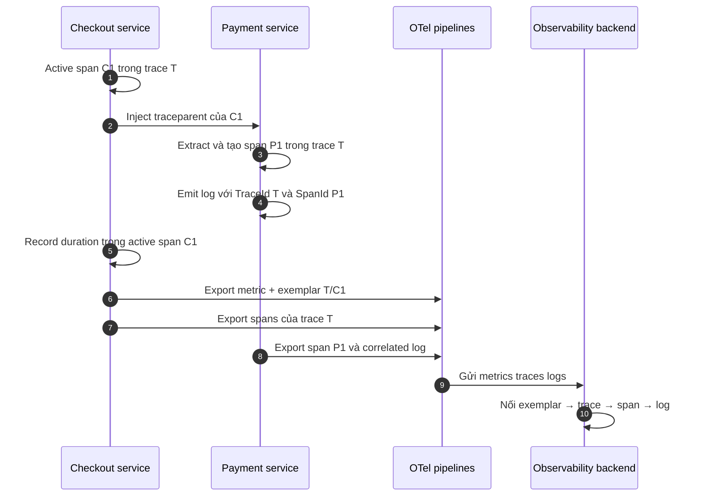
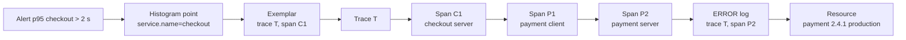

<Callout type="info" title="Mục tiêu của correlation">
  Correlation biến một alert tổng hợp thành đường đi có thể kiểm chứng tới request,
  span và log liên quan. Đường nối chính là `trace_id`/`span_id`, exemplar và
  Resource nhất quán; timestamp chỉ hỗ trợ thu hẹp khi đường nối trực tiếp không có.
</Callout>

## Mục lục

- [Correlation là gì](#correlation-là-gì)
  - [Correlation không phải context propagation](#correlation-không-phải-context-propagation)
- [Các khóa nối và vai trò của chúng](#các-khóa-nối-và-vai-trò-của-chúng)
  - [Logs sang trace bằng trace ID span ID và trace flags](#logs-sang-trace-bằng-trace-id-span-id-và-trace-flags)
  - [Metrics sang trace bằng exemplar](#metrics-sang-trace-bằng-exemplar)
  - [Resource attributes để giữ đúng phạm vi](#resource-attributes-để-giữ-đúng-phạm-vi)
  - [Semantic conventions để các field có cùng nghĩa](#semantic-conventions-để-các-field-có-cùng-nghĩa)
  - [Timestamps là khóa nối dự phòng](#timestamps-là-khóa-nối-dự-phòng)
- [Correlation ID nghiệp vụ](#correlation-id-nghiệp-vụ)
  - [Khi nào cần](#khi-nào-cần)
  - [Vì sao không thay thế trace ID](#vì-sao-không-thay-thế-trace-id)
- [Thiết kế correlation từ nơi sinh telemetry](#thiết-kế-correlation-từ-nơi-sinh-telemetry)
  - [Resource detection và merge nhất quán](#resource-detection-và-merge-nhất-quán)
  - [Baggage không tự trở thành attributes](#baggage-không-tự-trở-thành-attributes)
  - [Giữ cardinality và dữ liệu nhạy cảm trong kiểm soát](#giữ-cardinality-và-dữ-liệu-nhạy-cảm-trong-kiểm-soát)
- [Ví dụ checkout end-to-end](#ví-dụ-checkout-end-to-end)
  - [Bối cảnh và quan hệ nhân quả](#bối-cảnh-và-quan-hệ-nhân-quả)
  - [Bốn record cần nối](#bốn-record-cần-nối)
  - [Cách đọc chuỗi liên kết](#cách-đọc-chuỗi-liên-kết)
- [Workflow điều tra incident](#workflow-điều-tra-incident)
  - [Bước một xác nhận alert metric](#bước-một-xác-nhận-alert-metric)
  - [Bước hai mở exemplar và trace](#bước-hai-mở-exemplar-và-trace)
  - [Bước ba tìm span gây chậm hoặc lỗi](#bước-ba-tìm-span-gây-chậm-hoặc-lỗi)
  - [Bước bốn mở logs trong đúng context](#bước-bốn-mở-logs-trong-đúng-context)
  - [Bước năm kiểm chứng phạm vi ảnh hưởng](#bước-năm-kiểm-chứng-phạm-vi-ảnh-hưởng)
- [Thiết kế query và jump links không khóa vào vendor](#thiết-kế-query-và-jump-links-không-khóa-vào-vendor)
  - [Định nghĩa correlation contract](#định-nghĩa-correlation-contract)
  - [Tách link template khỏi instrumentation](#tách-link-template-khỏi-instrumentation)
  - [Thiết kế time window có chủ đích](#thiết-kế-time-window-có-chủ-đích)
- [Failure modes thường gặp](#failure-modes-thường-gặp)
- [Xác minh end-to-end](#xác-minh-end-to-end)
  - [Bài test dương và âm](#bài-test-dương-và-âm)
  - [Checklist sẵn sàng vận hành](#checklist-sẵn-sàng-vận-hành)
- [Takeaway](#takeaway)
- [Nguồn tham khảo chính thức](#nguồn-tham-khảo-chính-thức)
- [Bài liên quan](#bài-liên-quan)

## Correlation là gì

**Correlation** là khả năng chứng minh nhiều telemetry record nói về cùng một
execution, operation hoặc thực thể. Ví dụ, một exemplar trong histogram trỏ tới
trace `4bf92f...`; một log mang cùng trace ID và span ID nên có thể được đặt cạnh
span đã phát sinh log đó.

Correlation không có nghĩa là gom mọi signal vào một bảng. Metrics vẫn tối ưu
cho tổng hợp. Traces vẫn giữ quan hệ nhân quả. Logs vẫn giữ chi tiết sự kiện.
Correlation chỉ tạo các đường nối đáng tin cậy giữa ba góc nhìn.

| Câu hỏi | Signal bắt đầu | Đường nối tốt nhất |
| --- | --- | --- |
| Request chậm nào đại diện cho bucket trên 2 giây? | Metric histogram | Exemplar có `trace_id` và `span_id` |
| Log lỗi này thuộc request nào? | Log | `trace_id`, rồi thu hẹp bằng `span_id` |
| Deployment nào tạo ra nhóm lỗi? | Metric, trace hoặc log | Resource như `service.name`, `service.version`, `deployment.environment.name` |
| Hai record gần nhau có cùng request không? | Bất kỳ | ID trực tiếp; timestamp chỉ là bằng chứng phụ |

### Correlation không phải context propagation

Hai khái niệm liên quan nhưng giải quyết hai thời điểm khác nhau:

| Khái niệm | Xảy ra khi nào? | Làm gì? | Ví dụ |
| --- | --- | --- | --- |
| Context propagation | Khi request/message đang đi qua boundary | Inject và extract context để downstream tạo quan hệ đúng | Truyền W3C `traceparent` từ `checkout` sang `payment` |
| Correlation | Khi sinh, lưu hoặc truy vấn telemetry | Gắn và dùng các khóa chung để chuyển giữa signal | Dùng `trace_id` trên log để mở trace |

Propagation tạo ra nguyên liệu cho correlation. Nếu `payment` không extract
`traceparent`, nó có thể tạo trace ID mới. Backend không thể sửa quan hệ nhân quả
đã mất chỉ bằng cách so timestamp.

Ngược lại, propagation đúng chưa bảo đảm trải nghiệm correlation hoàn chỉnh. Log
bridge có thể không chép active SpanContext vào LogRecord. Metric pipeline cũng
có thể tắt exemplars. Khi đó trace vẫn liền mạch nhưng nút nhảy giữa signal bị
thiếu.



<Callout type="idea" title="Takeaway">
  Propagation giữ context đúng trong lúc chạy. Correlation dùng context và
  metadata đã ghi để điều tra sau đó. Phải kiểm thử cả hai lớp.
</Callout>

## Các khóa nối và vai trò của chúng

Không có một khóa duy nhất giải quyết mọi loại correlation. Hãy dùng ID trực tiếp
cho execution, Resource cho phạm vi nguồn phát và timestamp cho cửa sổ tìm kiếm.

| Khóa hoặc metadata | Nối gì? | Độ tin cậy | Không nên dùng để làm gì? |
| --- | --- | --- | --- |
| `trace_id` | Các span và logs của cùng trace; exemplar tới trace | Cao khi ID được giữ nguyên và dữ liệu còn retention | Nhận diện order lâu dài hoặc xác thực caller |
| `span_id` | Log/exemplar tới operation cụ thể trong trace | Cao khi đi cùng `trace_id` | Truy vấn toàn cục mà không có trace ID |
| `trace_flags` | Giải thích trạng thái context, đặc biệt sampled | Metadata hỗ trợ | Làm join key |
| Exemplar | Metric measurement đại diện tới trace/span | Cao nếu có ID và trace còn lưu | Đại diện thống kê cho mọi request |
| Resource attributes | Lọc đúng service, version, instance, environment | Cao nếu cấu hình nhất quán | Chứng minh hai record thuộc cùng request |
| Semantic attributes | Giữ tên, kiểu và ý nghĩa field thống nhất | Cao khi cùng convention version | Tự tạo quan hệ nhân quả |
| Timestamp | Thu hẹp dữ liệu theo thời gian | Thấp hơn ID do clock skew và ingest delay | Khẳng định hai record thuộc cùng execution |
| Business correlation ID | Nối các bước của giao dịch dài hạn | Tùy thiết kế nghiệp vụ | Thay parent-child graph của trace |

### Logs sang trace bằng trace ID span ID và trace flags

Trong OpenTelemetry Logs Data Model, `TraceId`, `SpanId` và `TraceFlags` là các
**top-level fields** tùy chọn. Chúng không phải Resource attributes. Logs SDK
phải lấy các field này từ Context được resolve khi emit LogRecord.

Nhiều backend chuẩn hóa tên thành `trace_id`, `span_id` và `trace_flags`; OTLP
JSON hoặc storage schema khác có thể dùng casing khác. Vì vậy, hãy phân biệt:

- **nghĩa chuẩn:** `TraceId`, `SpanId`, `TraceFlags` trong data model;
- **tên truy vấn chuẩn hóa của tổ chức:** ví dụ `trace_id`, `span_id`, `trace_flags`;
- **tên vật lý của backend:** được ánh xạ tại adapter ingest hoặc query.

`trace_id` dạng hex có 32 ký tự thường nhận diện cả trace. `span_id` dạng hex có
16 ký tự nhận diện operation cụ thể. Hãy giữ chúng dưới dạng chuỗi lowercase hex;
đừng parse thành số vì có thể mất số `0` ở đầu.

`trace_flags` giúp giải thích sampling. Ví dụ, sampled bit được đặt cho biết trace
được chọn để export theo quyết định truyền trong context. Field này không bảo
đảm trace vẫn còn trong backend: exporter có thể lỗi, Collector có thể drop hoặc
retention có thể hết.

```json
{
  "timestamp": "2026-03-15T10:05:12.482Z",
  "severity_text": "ERROR",
  "body": "payment gateway timeout",
  "trace_id": "4bf92f3577b34da6a3ce929d0e0e4736",
  "span_id": "2222222222222222",
  "trace_flags": "01",
  "resource": {
    "service.name": "payment",
    "deployment.environment.name": "production"
  }
}
```

Đây là **normalized query view** minh họa, không phải khẳng định về casing của
OTLP JSON. Khi validate pipeline, hãy xem payload thực tế và schema sau ingest.

### Metrics sang trace bằng exemplar

Metric data point là dữ liệu tổng hợp. Nó không mang một trace ID đại diện cho
toàn bộ bucket. **Exemplar** là một measurement mẫu được giữ cạnh data point để
cung cấp context cụ thể.

Một exemplar có thể chứa:

- giá trị measurement;
- thời điểm measurement được record;
- filtered attributes không còn trên metric point sau aggregation/View;
- `trace_id` và `span_id` tùy chọn của active span với synchronous instrument.

Ví dụ, histogram có bucket latency cao và exemplar sau:

```json
{
  "metric": "http.server.request.duration",
  "data_point_attributes": {
    "http.request.method": "POST",
    "http.route": "/checkout",
    "http.response.status_code": 504
  },
  "exemplar": {
    "value": 3.8,
    "time_unix_nano": "1773569112482000000",
    "trace_id": "4bf92f3577b34da6a3ce929d0e0e4736",
    "span_id": "00f067aa0ba902b7"
  }
}
```

Exemplar sampling không giữ mọi measurement. Theo Metrics SDK specification,
filter mặc định được khuyến nghị là `TraceBased`: measurement chỉ đủ điều kiện
khi được record trong context của sampled parent span. Reservoir vẫn có thể chọn
một tập con nhỏ hơn.

Do đó, link metric → trace có thể thiếu khi:

- measurement được record ngoài active span;
- trace không sampled;
- exemplar filter là `AlwaysOff`;
- reservoir không chọn measurement đó;
- exporter hoặc backend không giữ/hiển thị exemplar;
- trace đã hết retention dù exemplar còn tồn tại.

<Callout type="warn" title="Filtered attributes vẫn có thể rời process">
  Attribute bị loại khỏi metric stream bằng View vẫn có thể xuất hiện trong
  `filtered_attributes` của exemplar. Nếu mục tiêu là loại PII hoặc secret,
  chỉ cấu hình View là chưa đủ; phải loại dữ liệu trước khi record hoặc cấu hình
  exemplar filter/reservoir phù hợp.
</Callout>

### Resource attributes để giữ đúng phạm vi

**Resource** mô tả entity tạo telemetry. Cùng một process nên gắn cùng Resource
logic vào `TracerProvider`, `MeterProvider` và `LoggerProvider`.

Bộ tối thiểu hữu ích cho correlation thường gồm:

| Attribute | Vai trò | Quy tắc thực dụng |
| --- | --- | --- |
| `service.name` | Tên logic của service | Giữ giống nhau cho mọi instance horizontally scaled của cùng service |
| `service.namespace` | Nhóm các service thuộc cùng hệ thống | Dùng khi tên service có thể trùng giữa các hệ thống |
| `service.instance.id` | Phân biệt instance chạy đồng thời | Cùng process không nên sinh ba ID khác nhau cho ba signal provider |
| `service.version` | Phân biệt artifact/deployment version | Dùng đúng giá trị build hoặc release |
| `deployment.environment.name` | Tên deployment environment | Dùng key hiện hành; ưu tiên `development`, `test`, `staging`, `production` khi phù hợp |
| Hạ tầng như `k8s.*`, `cloud.*` | Khoanh vùng pod, cluster, region | Dùng detector và semantic conventions tương ứng |

`deployment.environment.name` là schema hiện hành. Key cũ
`deployment.environment` không nên được thêm vào instrumentation mới. Lưu ý,
environment không tham gia bộ nhận dạng duy nhất của service theo semantic
conventions. Trong query vận hành, bạn vẫn nên lọc environment để tránh trộn
production với staging.

“Resource nhất quán” không có nghĩa mọi service dùng cùng `service.name`.
`checkout` và `payment` phải có tên khác nhau. Nó có nghĩa metrics, traces và
logs do **cùng một service instance** phát ra phải đồng ý về tên, namespace,
version, instance và environment.

### Semantic conventions để các field có cùng nghĩa

Semantic conventions là vocabulary chung cho tên, kiểu và ý nghĩa của telemetry.
Ví dụ, dùng `http.route=/checkout` thay vì service A ghi `route`, service B ghi
`httpRoute` và dashboard phải đoán cả ba.

Correlation phụ thuộc conventions theo hai cách:

1. Query từ metric sang trace cần các chiều tương đương như route, method và
   status có cùng nghĩa.
2. Resource filters cần các field như `service.name` và
   `deployment.environment.name` không bị đổi tên giữa signal.

Pin phiên bản SDK, instrumentation và semantic conventions. Khi nâng version,
kiểm tra migration notes, Schema URL và chạy song song query cũ/mới nếu backend
cần giai đoạn chuyển tiếp.

Với field nghiệp vụ chưa có convention, dùng namespace của tổ chức hoặc ứng
dụng, ví dụ `com.acme.checkout.order_id`. Không tự chiếm namespace `otel.*` vì
namespace này được dành cho OpenTelemetry.

### Timestamps là khóa nối dự phòng

Timestamp trả lời “xảy ra khi nào”, không trả lời chắc chắn “thuộc request nào”.
Hai request cùng route có thể chạy trong cùng millisecond.

Các timestamp quan trọng gồm:

- span start/end time;
- exemplar `time_unix_nano`, là thời điểm measurement được record;
- log `Timestamp`, là lúc event xảy ra theo clock tại nguồn;
- log `ObservedTimestamp`, là lúc OpenTelemetry quan sát event.

**Clock skew** là độ lệch đồng hồ giữa các máy. Nó có thể làm child span trông như
bắt đầu trước parent hoặc log trông như xảy ra ngoài span. Queueing, batching và
network retry còn tạo **ingest delay**, tức dữ liệu đến backend muộn hơn lúc phát
sinh.

Biện pháp thực dụng:

- đồng bộ clock bằng hạ tầng time synchronization của môi trường;
- lưu cả `Timestamp` và `ObservedTimestamp` cho log khi có thể;
- ưu tiên parent-child IDs để đọc thứ tự nhân quả;
- mở rộng time window có chủ đích khi ID không đủ;
- theo dõi chênh lệch `ObservedTimestamp - Timestamp`, nhưng không xem nó là phép
  đo clock skew thuần túy vì còn chứa collection delay.

<Callout type="idea" title="Takeaway">
  Dùng timestamp để tìm ứng viên. Dùng ID và causal relationship để xác nhận.
</Callout>

## Correlation ID nghiệp vụ

**Correlation ID nghiệp vụ** là định danh do domain sở hữu, chẳng hạn order ID,
workflow ID hoặc batch ID. Nó tồn tại theo vòng đời nghiệp vụ, không theo vòng
đời của một trace.

### Khi nào cần

Business ID hữu ích khi một giao dịch:

- kéo dài lâu hơn retention của trace;
- qua nhiều job bất đồng bộ và chủ động bắt đầu trace mới;
- có retry hoặc callback tạo nhiều trace;
- cần được support team tìm từ dữ liệu nghiệp vụ đã biết;
- phải đối chiếu telemetry với audit record theo policy cho phép.

Ví dụ, order `ord_7F3A` có thể có trace tạo order, trace xử lý payment webhook và
trace gửi email sau đó. Attribute `com.acme.checkout.order_id=ord_7F3A` trên các
span/log được phép giúp tìm ba trace đó.

### Vì sao không thay thế trace ID

Business ID không mã hóa parent-child relationship. Nó cũng có thể được tái sử
dụng qua nhiều attempt. Nếu chỉ query bằng order ID, bạn nhận một tập record
liên quan nhưng chưa biết operation nào gọi operation nào.

| Thuộc tính | Trace ID | Business correlation ID |
| --- | --- | --- |
| Chủ sở hữu | Tracing system | Domain/application |
| Vòng đời | Một distributed trace | Một giao dịch hoặc workflow |
| Quan hệ parent-child | Có, qua span IDs | Không |
| Bị ảnh hưởng bởi trace sampling/retention | Có | Giá trị vẫn tồn tại ở hệ thống nghiệp vụ; telemetry chứa nó vẫn có retention riêng |
| Dùng làm idempotency/database key | Không | Có thể, nếu domain thiết kế như vậy |

Không trả business ID trực tiếp thành metric attribute. Order ID có cardinality
cao và có thể tạo một time series cho mỗi order. Hãy đặt nó có chọn lọc trên
traces/logs, với retention, access control và redaction rõ ràng.

## Thiết kế correlation từ nơi sinh telemetry

Correlation bền vững bắt đầu ở SDK và pipeline, không bắt đầu bằng một dashboard
đẹp. Cấu hình đúng Resource, active context và conventions trước khi xây link.

### Resource detection và merge nhất quán

Resource detectors đọc metadata từ process, host, container, Kubernetes hoặc
cloud. Kết quả từ nhiều detector phải được merge theo thứ tự rõ ràng.

Theo Resource SDK specification, khi merge `old` với `updating`:

- kết quả chứa attributes từ cả hai Resource;
- nếu trùng key, giá trị từ `updating` thắng, kể cả giá trị rỗng;
- hai Schema URL khác nhau và đều không rỗng tạo merge error với kết quả không
  được chuẩn hóa bởi spec.

Một mental model cấu hình là:

```text
default Resource
  → merge Resource do detectors phát hiện
  → merge Resource từ environment
  → merge Resource ứng dụng cấu hình rõ ràng
  = final Resource dùng lại cho traces, metrics và logs
```

Thứ tự tự động cụ thể phụ thuộc SDK. Specification yêu cầu Resource do user cung
cấp có ưu tiên cao hơn `OTEL_RESOURCE_ATTRIBUTES`. Riêng
`OTEL_SERVICE_NAME` có ưu tiên hơn `service.name` đặt trong
`OTEL_RESOURCE_ATTRIBUTES`.

Ví dụ cấu hình portable:

```bash
export OTEL_SERVICE_NAME=checkout
export OTEL_RESOURCE_ATTRIBUTES='service.namespace=shop,service.version=2.4.1,deployment.environment.name=production'
```

Sau detection và merge, nên tạo hoặc lấy **một final Resource** rồi dùng lại cho
các provider nếu SDK cho phép:

```text
resource = build_and_merge_resource_once()
tracer_provider = create_tracer_provider(resource)
meter_provider  = create_meter_provider(resource)
logger_provider = create_logger_provider(resource)
```

Nếu mỗi provider chạy detector riêng, một detector sinh ID ngẫu nhiên có thể tạo
ba `service.instance.id` khác nhau trong cùng process. Backend khi đó chia telemetry
thành ba nguồn giả.

### Baggage không tự trở thành attributes

**Baggage** là key-value nằm cạnh distributed Context và có thể được propagate
qua boundary. Baggage không tự động trở thành span, metric hoặc log attributes.
Instrumentation phải đọc từng key được phép và chép có chủ đích.

```text
baggage["tenant.tier"] = "premium"

# Chưa tạo ra telemetry attribute nào.
# Instrumentation phải allowlist rồi mới ghi:
span.set_attribute("com.acme.tenant.tier", "premium")
```

Không chép toàn bộ baggage vào mọi signal. Baggage có thể đến từ caller không
tin cậy và có thể bị forward tới third-party. Nó không có integrity guarantee.
Không đặt credential, token, secret hoặc PII vào baggage.

Nếu cần business ID ở downstream, ưu tiên truyền qua contract nghiệp vụ đã có
khi phù hợp. Chỉ dùng baggage khi cần context xuyên boundary, đã có allowlist,
giới hạn kích thước và policy xóa tại trust boundary.

### Giữ cardinality và dữ liệu nhạy cảm trong kiểm soát

**Cardinality** là số tổ hợp giá trị phân biệt. Correlation IDs gần như luôn có
cardinality cao.

| Vị trí | Business/request ID có phù hợp không? | Lý do |
| --- | --- | --- |
| Metric attributes | Thường không | Tạo nhiều time series và tăng chi phí aggregation/index |
| Exemplar filtered attributes | Chỉ khi đã đánh giá | Có thể lộ field đã bị View loại khỏi metric point |
| Span attributes | Có chọn lọc | Hữu ích cho tìm kiếm nhưng tăng index/storage |
| Log attributes | Có chọn lọc | Hữu ích cho support; cần access control và retention |
| Baggage | Rất hạn chế | Được propagate rộng và có thể vượt trust boundary |

PII là dữ liệu định danh cá nhân. Một order ID có thể trở thành PII nếu có thể
liên kết lại với khách hàng. Hãy phân loại dữ liệu theo ngữ cảnh thực tế, không
chỉ theo tên field.

## Ví dụ checkout end-to-end

### Bối cảnh và quan hệ nhân quả

Lúc `10:05:08.682Z`, `checkout` phiên bản `2.4.1` nhận `POST /checkout`. Nó gọi
`payment`; gateway thanh toán timeout sau khoảng 3,2 giây. Histogram checkout ghi
measurement `3.8 s` trong active server span.



### Bốn record cần nối

Ví dụ dưới đây dùng dạng normalized, rút gọn để làm rõ correlation. Đây không
phải OTLP JSON hoàn chỉnh.

**Một: metric point và exemplar từ `checkout`**

```json
{
  "metric": "http.server.request.duration",
  "unit": "s",
  "resource": {
    "service.namespace": "shop",
    "service.name": "checkout",
    "service.instance.id": "checkout-pod-7d9f",
    "service.version": "2.4.1",
    "deployment.environment.name": "production"
  },
  "attributes": {
    "http.request.method": "POST",
    "http.route": "/checkout",
    "http.response.status_code": 504
  },
  "exemplar": {
    "value": 3.8,
    "time_unix_nano": "1773569112482000000",
    "trace_id": "4bf92f3577b34da6a3ce929d0e0e4736",
    "span_id": "00f067aa0ba902b7"
  }
}
```

**Hai: checkout server span mà exemplar trỏ tới**

```json
{
  "trace_id": "4bf92f3577b34da6a3ce929d0e0e4736",
  "span_id": "00f067aa0ba902b7",
  "parent_span_id": null,
  "name": "POST /checkout",
  "start_time": "2026-03-15T10:05:08.682Z",
  "end_time": "2026-03-15T10:05:12.482Z",
  "status": "ERROR",
  "attributes": {
    "http.request.method": "POST",
    "http.route": "/checkout",
    "com.acme.checkout.order_id": "ord_7F3A"
  },
  "resource": {
    "service.namespace": "shop",
    "service.name": "checkout",
    "service.version": "2.4.1",
    "deployment.environment.name": "production"
  }
}
```

**Ba: payment server span trên critical path**

```json
{
  "trace_id": "4bf92f3577b34da6a3ce929d0e0e4736",
  "span_id": "2222222222222222",
  "parent_span_id": "1111111111111111",
  "name": "POST /charge",
  "start_time": "2026-03-15T10:05:09.101Z",
  "end_time": "2026-03-15T10:05:12.301Z",
  "status": "ERROR",
  "attributes": {
    "http.route": "/charge",
    "error.type": "gateway_timeout",
    "com.acme.checkout.order_id": "ord_7F3A"
  },
  "resource": {
    "service.namespace": "shop",
    "service.name": "payment",
    "service.instance.id": "payment-pod-84bc",
    "service.version": "2.4.1",
    "deployment.environment.name": "production"
  }
}
```

**Bốn: log phát sinh trong payment server span**

```json
{
  "timestamp": "2026-03-15T10:05:12.280Z",
  "observed_timestamp": "2026-03-15T10:05:12.286Z",
  "severity_text": "ERROR",
  "body": "payment gateway timeout",
  "trace_id": "4bf92f3577b34da6a3ce929d0e0e4736",
  "span_id": "2222222222222222",
  "trace_flags": "01",
  "attributes": {
    "error.type": "gateway_timeout",
    "retry.count": 2,
    "com.acme.checkout.order_id": "ord_7F3A"
  },
  "resource": {
    "service.namespace": "shop",
    "service.name": "payment",
    "service.instance.id": "payment-pod-84bc",
    "service.version": "2.4.1",
    "deployment.environment.name": "production"
  }
}
```

### Cách đọc chuỗi liên kết

1. Exemplar trỏ chính xác tới trace `4bf92f...` và checkout span `00f067...`.
2. Trace tree dẫn từ checkout span tới payment client span `111111...`, rồi
   payment server span `222222...`.
3. Log có cùng trace ID và payment span ID nên thuộc operation `POST /charge`.
4. Resource của payment span và log khớp nhau, nên có thể tin chúng đến từ cùng
   service version, instance và environment.
5. Business order ID giúp tìm các trace khác của `ord_7F3A`; nó không được dùng
   làm metric attribute.
6. Timestamp log nằm gần cuối payment span, nhưng IDs mới là bằng chứng chính.

Một trace chỉ là một trường hợp. Sau khi tìm thấy nguyên nhân khả dĩ, phải quay
lại metrics để đo phạm vi ảnh hưởng.

## Workflow điều tra incident

### Bước một xác nhận alert metric

Giữ nguyên metric name, aggregation, time range và filters của alert. Kiểm tra
unit, temporality và route template. Với ví dụ checkout, xác nhận:

```text
metric: http.server.request.duration
resource: service.name=checkout
filter: deployment.environment.name=production
attributes: http.request.method=POST, http.route=/checkout
window: 10:00Z..10:10Z
```

Nếu dashboard dùng field đã deprecated hoặc trộn `checkout` với
`unknown_service`, sửa phạm vi trước khi điều tra tiếp.

### Bước hai mở exemplar và trace

Chọn exemplar trong bucket hoặc vùng latency bất thường. Xác nhận exemplar có
value, timestamp và valid trace ID/span ID. Sau đó mở trace bằng exact trace ID.

Nếu trace không tồn tại, kiểm tra theo thứ tự:

1. trace ID có bị đổi casing, cắt số `0` đầu hoặc parse sai kiểu không;
2. trace có bị sampling loại hoặc exporter drop không;
3. metric và trace retention có khác nhau không;
4. exemplar và trace có đi tới hai tenant/project khác nhau không.

Không có exemplar thì tìm trace bằng resource, route, status, duration và time
window. Đây là fallback có thể trả nhiều ứng viên, không phải correlation chắc
chắn.

### Bước ba tìm span gây chậm hoặc lỗi

Trong trace, đọc parent-child graph và waterfall. Tìm span trên **critical path**,
tức chuỗi operation quyết định latency end-to-end.

Với checkout, payment server span dài 3,2 giây và có `error.type=gateway_timeout`.
Kiểm tra cả client/server spans để phân biệt xử lý server, network, proxy và
queueing. Không cộng hai duration chồng lấp.

### Bước bốn mở logs trong đúng context

Query logs bằng `trace_id`. Sau đó thêm `span_id` của operation cần xem. Giữ
Resource filter để tránh field collision hoặc dữ liệu từ tenant khác.

```text
find logs where
  trace_id = "4bf92f3577b34da6a3ce929d0e0e4736"
  and span_id = "2222222222222222"
  and service.name = "payment"
```

Nếu không có log, bỏ `span_id` tạm thời để phát hiện log chỉ có trace ID. Sau đó
kiểm tra logging bridge, active context lúc emit, parser và log filtering.

### Bước năm kiểm chứng phạm vi ảnh hưởng

Dùng giả thuyết từ trace/log quay lại dữ liệu tổng hợp. Ví dụ, nhóm error rate và
latency theo `service.version` hoặc region có cardinality kiểm soát. Không group
metric theo order ID.

Kết luận tốt có dạng: “Từ 10:02Z đến 10:14Z, payment `2.4.1` ở production có tỷ
lệ `gateway_timeout` tăng; trace đại diện cho thấy `POST /charge` chiếm 3,2 giây
trên critical path; correlated log xác nhận hai retry.”

Kết luận yếu có dạng: “Một trace chậm nên toàn bộ deployment chắc chắn lỗi.”

## Thiết kế query và jump links không khóa vào vendor

OpenTelemetry chuẩn hóa telemetry data model và OTLP. OpenTelemetry không chuẩn
hóa query language hoặc URL deep-link của backend. Vì vậy, tính portable đến từ
**correlation contract** và adapter, không đến từ một URL dùng được ở mọi nơi.

### Định nghĩa correlation contract

Tạo một contract logic độc lập với storage:

```yaml
correlation_contract:
  trace_id:
    type: lowercase_hex_string
    length: 32
    physical_fields: [TraceId, trace_id, traceId]
  span_id:
    type: lowercase_hex_string
    length: 16
    physical_fields: [SpanId, span_id, spanId]
  trace_flags:
    type: bitset
    physical_fields: [TraceFlags, trace_flags, flags]
  resource_filters:
    - service.namespace
    - service.name
    - service.instance.id
    - service.version
    - deployment.environment.name
  time:
    canonical_zone: UTC
    precision: nanoseconds_when_available
```

Danh sách `physical_fields` minh họa các schema có thể gặp; không phải yêu cầu
backend phải lưu tất cả alias. Tại ingest hoặc query adapter, ánh xạ một field vật
lý về một field logic. Test mapping bằng payload thật.

Các operation backend-neutral nên có dạng:

```text
get_trace(trace_id)
find_logs(trace_id, span_id?, resource_filters?, start_time, end_time)
find_traces(resource_filters, operation_filters, start_time, end_time)
find_related_telemetry(business_id, start_time, end_time)
```

Instrumentation chỉ phát OTLP và field chuẩn. Nó không cần biết backend đang dùng
query language nào.

### Tách link template khỏi instrumentation

Đặt link templates trong cấu hình UI, dashboard-as-code hoặc một correlation
gateway:

```yaml
jump_links:
  exemplar_to_trace: "/observe/trace?trace_id={trace_id}"
  span_to_logs: "/observe/logs?trace_id={trace_id}&span_id={span_id}&from={from}&to={to}"
  log_to_trace: "/observe/trace?trace_id={trace_id}&span_id={span_id}"
```

Correlation gateway có thể đổi route tới backend A hoặc B mà không sửa
instrumentation. Nó cũng là nơi:

- validate trace/span ID trước khi tạo query;
- URL-encode parameter;
- enforce tenant và access control;
- thêm Resource filters mặc định;
- chọn time window và backend theo signal retention;
- ngăn open redirect hoặc query injection.

Không ghi URL của vendor vào span/log attributes. Làm vậy vừa tăng payload vừa
khóa telemetry vào giao diện hiện tại.

### Thiết kế time window có chủ đích

Khi đi từ span sang logs, cửa sổ cơ sở là span start/end. Thêm buffer cho clock
skew và collection delay, ví dụ:

```text
from = span.start_time - 30s
to   = span.end_time   + 30s
```

`30s` chỉ là giá trị khởi đầu. Hãy đo phân phối ingest delay và clock offset để
đặt giá trị thực tế. Với async queue hoặc batch job, window có thể cần dài hơn
và business ID có thể hữu ích hơn một span window ngắn.

Khi exact `trace_id` hoạt động, time filter chủ yếu tối ưu query và chọn đúng
retention partition. Khi thiếu ID, time window trở thành điều kiện tìm ứng viên;
lúc đó phải kết hợp thêm service, route, status và business ID.

## Failure modes thường gặp

| Triệu chứng | Nguyên nhân thường gặp | Cách xác minh | Cách xử lý |
| --- | --- | --- | --- |
| Metrics ở `checkout`, traces ở `checkout-api` | `service.name` không khớp giữa providers hoặc deployment | Xem Resource của cả ba signal tại Collector/backend | Xây final Resource một lần; chuẩn hóa `OTEL_SERVICE_NAME` |
| Production và staging bị trộn | Dùng key cũ, thiếu hoặc sai `deployment.environment.name` | Group theo cả key cũ/mới và kiểm tra payload | Chuyển sang key hiện hành; dùng giá trị canonical khi phù hợp |
| Downstream tạo trace mới | Lost context tại HTTP/RPC/message boundary | Capture `traceparent` trước/sau boundary | Inject trước send, extract trước tạo server/consumer span |
| Log không có trace ID/span ID | Emit ngoài active context, logging bridge không hỗ trợ hoặc parser làm mất field | So log tại source, Collector và backend | Cấu hình bridge; truyền Context đúng; sửa parser mapping |
| Log có trace ID nhưng không có trace | Unsampled trace, export failure, khác tenant hoặc trace hết retention | Xem `trace_flags`, sampler, exporter errors và retention | Điều chỉnh sampling/retention; giữ đường fallback; không hứa link luôn tồn tại |
| Exemplar không có link | Measurement ngoài sampled span, filter/reservoir hoặc backend không hỗ trợ | Kiểm tra `OTEL_METRICS_EXEMPLAR_FILTER` và OTLP exemplar | Record trong active context; bật hỗ trợ phù hợp; test exporter/backend |
| Exemplar trỏ trace không tồn tại | Retention lệch hoặc trace bị drop sau SDK | So thời điểm, pipeline route và backend tenant | Căn retention; theo dõi export/drop; hiển thị lỗi link rõ ràng |
| Exact ID query trả rỗng | Field parsing/casing sai, ID bị parse thành số hoặc cắt leading zero | So raw OTLP với indexed field | Lưu ID dạng bytes/hex chuẩn; normalize lowercase; test parser |
| Log nằm ngoài span trên UI | Clock skew, source timestamp sai hoặc async logging | So `Timestamp`, `ObservedTimestamp`, span times và host clocks | Đồng bộ clock; nới window; ưu tiên causal IDs |
| Query time window bỏ lỡ dữ liệu | Window quá hẹp hoặc ingest delay lớn | Đo lateness theo signal | Tính buffer từ dữ liệu, không hard-code tùy tiện |
| Metric cardinality tăng đột biến | Đưa request/order/trace ID vào metric attributes | Kiểm tra số series theo instrument và recent schema change | Loại high-cardinality dimensions bằng View; giữ ID ở trace/log |
| PII xuất hiện trong exemplar | View bỏ attribute khỏi series nhưng exemplar giữ filtered attribute | Inspect OTLP exemplar `filtered_attributes` | Không record PII; hoặc tắt/tùy biến exemplar sampling |
| Cùng process có ba instance IDs | Providers chạy detector sinh ID riêng | So `service.instance.id` của metric/span/log | Tạo Resource một lần và dùng lại |
| Merge cho kết quả bất định | Hai Resource có Schema URL khác nhau và đều không rỗng | Log merge errors và inspect Schema URL | Đồng bộ convention/schema version trước khi merge |

<Callout type="error" title="Correlation không khôi phục dữ liệu đã mất">
  Backend không thể dựng lại span bị sampling/drop, log chưa ingest hoặc context
  chưa từng được propagate. Jump link tốt phải báo “không tìm thấy dữ liệu” thay
  vì ngụ ý rằng target chắc chắn tồn tại.
</Callout>

## Xác minh end-to-end

Đừng chỉ kiểm tra từng pipeline riêng. Bài test phải đi qua cùng đường mà on-call
sẽ dùng trong incident.

### Bài test dương và âm

Tạo một checkout request có latency/error dự đoán được trong môi trường kiểm
soát. Ghi lại business ID và thời gian gửi.

**Positive test:**

1. Xác nhận metric point có đúng Resource, route, unit và bucket.
2. Xác nhận ít nhất một exemplar test có value, timestamp và IDs hợp lệ.
3. Mở trace bằng exemplar `trace_id`.
4. Xác nhận exemplar `span_id` tồn tại trong trace.
5. Xác nhận payment spans giữ cùng trace ID và parent relationship đúng.
6. Query log bằng trace ID + payment span ID.
7. Xác nhận Resource của payment span và log khớp.
8. Quay lại metric để kiểm tra filter theo version/environment.

**Negative tests có kiểm soát:**

| Thay đổi test | Kỳ vọng | Điều được chứng minh |
| --- | --- | --- |
| Emit một log ngoài active span | Log thiếu trace fields hoặc không trỏ span test | Bridge không bịa context |
| Tạo trace unsampled | Trace có thể không có trong backend; link phải fail rõ | UI xử lý sampling gap đúng |
| Tắt exemplar filter | Metric vẫn có, exemplar biến mất | Metric không phụ thuộc exemplar để tồn tại |
| Làm mất propagation tại lab boundary | Downstream có trace ID mới | Test phát hiện lost context |
| Đổi `service.name` ở một signal trong lab | Resource-based query bỏ lỡ record | Data-quality check bắt mismatch |
| Dịch source clock trong môi trường giả lập | ID query vẫn nối được dù timeline lệch | Correlation không phụ thuộc timestamp tuyệt đối |

Không thực hiện negative test phá propagation hoặc clock trên production traffic.

### Checklist sẵn sàng vận hành

- [ ] `trace_id` được giữ dạng 32 ký tự lowercase hex; `span_id` là 16 ký tự lowercase hex.
- [ ] Logs emit trong active span có `TraceId`, `SpanId` và `TraceFlags` đúng.
- [ ] `span_id` trên log resolve tới một span thuộc cùng `trace_id` khi trace được giữ.
- [ ] Metric measurements cần correlation được record trong active Context.
- [ ] Exemplar pipeline bảo toàn value, timestamp, optional trace/span IDs và filtered attributes theo policy.
- [ ] Jump metric → exemplar → trace hoạt động với trace sampled còn retention.
- [ ] Jump span → logs dùng exact IDs, Resource filters và time buffer hợp lý.
- [ ] `service.name`, namespace, version, instance ID và environment khớp giữa ba signal của cùng process.
- [ ] Instrumentation mới dùng `deployment.environment.name`, không dùng key cũ.
- [ ] Resource merge order được ghi lại; merge errors và Schema URL conflicts được quan sát.
- [ ] Semantic convention versions được pin và có migration test.
- [ ] Business correlation ID chỉ xuất hiện ở nơi đã được phê duyệt; không làm metric dimension.
- [ ] Baggage có allowlist, size limit và trust-boundary policy; không chứa PII/secret.
- [ ] View loại attribute nhạy cảm đã được kiểm tra cả exemplar filtered attributes.
- [ ] Sampling và retention gaps hiển thị rõ, không tạo dead link im lặng.
- [ ] Timestamp/ObservedTimestamp, clock sync và ingest lateness có dashboard hoặc test phù hợp.
- [ ] Parser mapping được test từ raw OTLP tới indexed/query fields.
- [ ] Query/deep-link adapter có validation, URL encoding, tenant và access control.
- [ ] Cardinality của metrics và indexed trace/log fields nằm trong ngân sách.

## Takeaway

Correlation tốt có thứ tự ưu tiên rõ ràng:

1. Dùng `trace_id` để nhận diện execution và `span_id` để chỉ đúng operation.
2. Dùng exemplar để đi từ metric tổng hợp tới measurement và trace đại diện.
3. Dùng Resource nhất quán để giữ đúng service, instance, version và environment.
4. Dùng semantic conventions để query cùng một nghĩa trên mọi signal.
5. Dùng timestamp làm phạm vi tìm kiếm, không làm bằng chứng nhân quả.
6. Dùng business ID cho workflow dài hạn, nhưng không thay trace ID và không đưa
   vào metric dimensions.
7. Kiểm thử toàn bộ đường alert → exemplar → trace → span → log trước incident.

<Callout type="idea" title="Câu hỏi tự kiểm cuối cùng">
  Từ một alert thật, on-call có thể đến một log thuộc đúng span bằng các khóa đã
  ghi hay vẫn phải đoán bằng thời gian và text search? Nếu còn phải đoán, đường
  correlation chưa hoàn chỉnh.
</Callout>

## Nguồn tham khảo chính thức

- [OpenTelemetry — Context propagation](https://opentelemetry.io/docs/concepts/context-propagation/) — phân biệt Context và cơ chế inject/extract qua boundary.
- [OpenTelemetry Specification — Tracing API và SpanContext](https://opentelemetry.io/docs/specs/otel/trace/api/#spancontext) — `TraceId`, `SpanId`, `TraceFlags`, kích thước và representation.
- [OpenTelemetry Specification — Logs Data Model](https://opentelemetry.io/docs/specs/otel/logs/data-model/) — `Timestamp`, `ObservedTimestamp`, `TraceId`, `SpanId`, `TraceFlags` và Resource trên LogRecord.
- [OpenTelemetry Specification — Logs SDK](https://opentelemetry.io/docs/specs/otel/logs/sdk/) — lấy trace context fields từ Context khi emit.
- [OpenTelemetry Specification — Metrics SDK Exemplars](https://opentelemetry.io/docs/specs/otel/metrics/sdk/#exemplar) — filter, reservoir, trace/span IDs và filtered attributes.
- [OpenTelemetry Specification — Metrics Data Model](https://opentelemetry.io/docs/specs/otel/metrics/data-model/#exemplars) — cấu trúc exemplar và quan hệ với metric point.
- [OpenTelemetry Specification — Resource SDK](https://opentelemetry.io/docs/specs/otel/resource/sdk/) — Resource trên từng provider, detection, merge precedence và Schema URL conflicts.
- [OpenTelemetry Semantic Conventions — Service](https://opentelemetry.io/docs/specs/semconv/resource/#service) — `service.name`, namespace, version và instance identity.
- [OpenTelemetry Semantic Conventions — Deployment environment](https://opentelemetry.io/docs/specs/semconv/resource/deployment-environment/) — `deployment.environment.name` và well-known values hiện hành.
- [OpenTelemetry Specification — SDK environment variables](https://opentelemetry.io/docs/specs/otel/configuration/sdk-environment-variables/) — `OTEL_SERVICE_NAME`, `OTEL_RESOURCE_ATTRIBUTES` và `OTEL_METRICS_EXEMPLAR_FILTER`.
- [OpenTelemetry — Baggage](https://opentelemetry.io/docs/concepts/signals/baggage/) — baggage không tự trở thành attributes và rủi ro bảo mật.
- [W3C Trace Context](https://www.w3.org/TR/trace-context/) — định dạng và quy tắc truyền trace context chuẩn web.

## Bài liên quan

<Cards>
  <Card title="Tổng quan signals" href="/signals/" description="Chọn metrics, traces, logs và đường học phù hợp." />
  <Card title="Traces" href="/signals/traces/" description="Đọc trace tree, critical path và incomplete trace." />
  <Card title="Sampling" href="/signals/sampling/" description="Hiểu vì sao trace có ID nhưng không còn dữ liệu để mở." />
  <Card title="Metrics" href="/signals/metrics/" description="Hiểu metric points, aggregation và cardinality." />
  <Card title="Logs" href="/signals/logs/" description="Thiết kế structured logs có trace context và timestamp đúng." />
  <Card title="Exemplars" href="/signals/exemplars/" description="Nối metric measurement với trace hoặc span đại diện." />
  <Card title="Context propagation" href="/fundamentals/context-propagation/" description="Giữ trace context qua HTTP, RPC và message boundaries." />
  <Card title="Semantic conventions" href="/fundamentals/semantic-conventions/" description="Chuẩn hóa Resource và telemetry attributes." />
  <Card title="Mất context" href="/troubleshooting/context-loss/" description="Chẩn đoán trace bị tách giữa các service." />
  <Card title="Triage checklist" href="/troubleshooting/triage/" description="Thu thập evidence trước khi thay đổi pipeline." />
</Cards>
