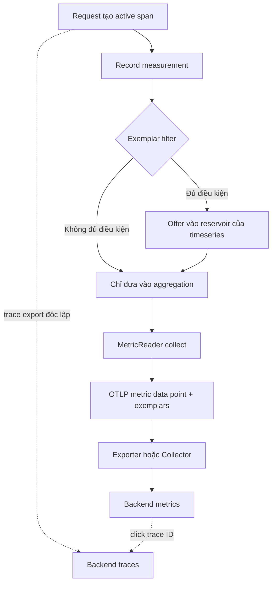

<Callout type="info" title="Mental model">
  Exemplar là một measurement mẫu được giữ lại bên cạnh metric đã aggregate. Nó
  mang value, timestamp, các filtered attributes và, khi có context phù hợp, trace
  ID cùng span ID. Với histogram latency, exemplar giúp trả lời câu hỏi “điểm
  latency bất thường này đến từ request nào?”. Exemplar không tạo trace mới và
  không đảm bảo trace tương ứng được sampling hoặc giữ lại ở backend.
</Callout>

## Mục lục

- [Exemplar là gì](#exemplar-là-gì)
  - [Metric aggregate và measurement mẫu](#metric-aggregate-và-measurement-mẫu)
  - [Các trường của exemplar](#các-trường-của-exemplar)
- [Exemplar nối metric với trace như thế nào](#exemplar-nối-metric-với-trace-như-thế-nào)
  - [Luồng measurement đến backend](#luồng-measurement-đến-backend)
  - [Use case histogram latency](#use-case-histogram-latency)
  - [Exemplar không phải trace sampling](#exemplar-không-phải-trace-sampling)
- [Filter và reservoir](#filter-và-reservoir)
  - [Exemplar filter](#exemplar-filter)
  - [Exemplar reservoir](#exemplar-reservoir)
  - [Filtered attributes và rủi ro dữ liệu](#filtered-attributes-và-rủi-ro-dữ-liệu)
- [Bật exemplar theo cách vendor-neutral](#bật-exemplar-theo-cách-vendor-neutral)
  - [Biến môi trường chuẩn](#biến-môi-trường-chuẩn)
  - [Cấu hình trong SDK](#cấu-hình-trong-sdk)
  - [Khác biệt giữa các ngôn ngữ](#khác-biệt-giữa-các-ngôn-ngữ)
- [Cardinality, chi phí và giới hạn](#cardinality-chi-phí-và-giới-hạn)
  - [Chi phí runtime và pipeline](#chi-phí-runtime-và-pipeline)
  - [Cardinality của metric không giống số exemplar](#cardinality-của-metric-không-giống-số-exemplar)
  - [Temporality và chuyển đổi aggregation](#temporality-và-chuyển-đổi-aggregation)
- [Backend support và cách xác minh](#backend-support-và-cách-xác-minh)
  - [Caveat về backend](#caveat-về-backend)
  - [Kiểm tra ở nguồn](#kiểm-tra-ở-nguồn)
  - [Kiểm tra qua OTLP và backend](#kiểm-tra-qua-otlp-và-backend)
- [Failure modes thường gặp](#failure-modes-thường-gặp)
- [Checklist vận hành](#checklist-vận-hành)
- [Tham khảo chính thức](#tham-khảo-chính-thức)
- [Bài liên quan](#bài-liên-quan)

## Exemplar là gì

**Exemplar** là một data point mẫu của dữ liệu metric đã được aggregate. Nó giữ
lại một measurement cụ thể để bổ sung context cho một con số tổng hợp.

Ví dụ, một `Histogram` có thể báo `p95 = 240 ms` cho hàng nghìn request. Histogram
không nói request nào tạo ra một observation khoảng `2.400 ms`. Exemplar có thể
giữ chính observation đó cùng trace ID và span ID của request.

### Metric aggregate và measurement mẫu

**Measurement** là giá trị được ghi qua Metrics API. Ví dụ, ứng dụng gọi
`request_duration.record(2400, attributes, context)` khi một request hoàn tất.

**Aggregation** là cách SDK gộp nhiều measurement thành metric data point. Với
histogram, SDK giữ count, sum và các bucket thay vì gửi từng measurement.

Exemplar không thay thế aggregation. Nó là một đường dẫn chọn lọc nằm cạnh
aggregation:

| Dữ liệu | Trả lời câu hỏi | Phạm vi |
| --- | --- | --- |
| Metric data point | Có bao nhiêu request, phân phối latency ra sao? | Nhiều measurement đã gộp |
| Exemplar | Measurement cụ thể nào minh họa điểm này? | Một số measurement được chọn |
| Trace/span | Request đó đã đi qua operation nào và chậm ở đâu? | Một execution cụ thể |

Một exemplar có thể hữu ích cho mọi metric. Nó không chỉ dành cho metric được
tạo từ span. Tuy nhiên, khả năng nhảy sang trace cần active span context và một
backend trace có dữ liệu tương ứng.

### Các trường của exemplar

Trong OTLP data model, exemplar nằm trong `exemplars` của metric data point. Các
trường cốt lõi là:

| Trường | Ý nghĩa |
| --- | --- |
| `filtered_attributes` | Attributes có trong measurement nhưng không được giữ trên metric data point liên kết. Đây là tập bổ sung, không phải bản sao bắt buộc của toàn bộ attributes. |
| `time_unix_nano` | Thời điểm measurement được ghi. Giá trị là Unix epoch tính bằng nanosecond. |
| `value` | Giá trị measurement. Trong OTLP wire model, giá trị được biểu diễn bằng `as_double` hoặc `as_int`. |
| `span_id` | Span ID của active span tại thời điểm ghi, nếu context có span hợp lệ. |
| `trace_id` | Trace ID của active span tại thời điểm ghi, nếu context có span hợp lệ. |

`trace_id` và `span_id` là các định danh binary trong OTLP. Backend thường hiển
thị chúng dưới dạng hex. Trace ID định danh toàn trace. Span ID định danh một
operation trong trace.

JSON dưới đây là **pseudocode gần với OTLP**, không phải schema JSON đầy đủ của
mọi exporter:

```json
{
  "metric": {
    "name": "http.server.request.duration",
    "histogram": {
      "data_points": [
        {
          "attributes": {
            "http.request.method": "GET",
            "http.response.status_code": 200
          },
          "start_time_unix_nano": 1710000000000000000,
          "time_unix_nano": 1710000060000000000,
          "count": 1200,
          "sum": 148500,
          "exemplars": [
            {
              "filtered_attributes": {
                "http.route": "/checkout/{id}"
              },
              "time_unix_nano": 1710000042123456789,
              "as_double": 2400.0,
              "trace_id": "4bf92f3577b34da6a3ce929d0e0e4736",
              "span_id": "00f067aa0ba902b7"
            }
          ]
        }
      ]
    }
  }
}
```

Trong ví dụ, `2400.0` dùng đơn vị do metric định nghĩa, chẳng hạn
milliseconds. `http.route` là filtered attribute nếu View chỉ giữ hai attribute
còn lại trên metric stream.

<Callout type="warn" title="View không tự redaction exemplar">
  Một attribute bị loại khỏi metric stream bởi View vẫn có thể xuất hiện trong
  `filtered_attributes` của exemplar. Nếu attribute chứa secret hoặc PII, hãy
  dùng `AlwaysOff` hoặc filter/reservoir tùy chỉnh phù hợp. Không xem việc giảm
  dimensions của metric là một cơ chế redaction.
</Callout>

## Exemplar nối metric với trace như thế nào

Exemplar tạo liên kết một chiều từ metric data point đến measurement cụ thể. Trace
context được đọc tại thời điểm gọi API ghi measurement. SDK không chờ đến lúc span
kết thúc mới tạo liên kết.

### Luồng measurement đến backend

Lifecycle điển hình có các bước sau:

1. Instrumentation nhận một request và tạo active span.
2. Ứng dụng đo latency rồi ghi measurement vào Histogram.
3. Exemplar filter quyết định measurement có **đủ điều kiện** hay không.
4. Nếu đủ điều kiện, exemplar reservoir có thể giữ hoặc thay thế sample đang có.
5. SDK aggregate toàn bộ measurement thành metric data point.
6. MetricReader collect data point và exemplar trong cùng khoảng thời gian.
7. Metric exporter gửi metric qua OTLP hoặc định dạng khác.
8. Collector có thể batch, filter, reaggregate hoặc chuyển tiếp dữ liệu.
9. Backend phải lưu và hiển thị exemplar để người dùng click sang trace.



Filter và reservoir nằm trong Metrics SDK. Trace exporter chạy một pipeline riêng.
Vì vậy, việc reservoir giữ exemplar không có nghĩa trace exporter đã gửi span.

### Use case histogram latency

Giả sử ứng dụng ghi duration của mọi request vào Histogram:

```text
request_duration.record(
  value=2400,
  attributes={"route": "/checkout/{id}", "status": 200},
  context=current_context,
)
```

Metric aggregate có thể cho thấy bucket `le=5000` tăng và p95 vượt ngưỡng. Reservoir
có thể giữ measurement `2400` cùng trace ID `T` và span ID `S`.

Người điều tra thực hiện hai bước:

1. Mở exemplar trên biểu đồ latency.
2. Dùng `trace_id=T` để mở trace và xem span nào tạo ra latency.

Trace có thể cho thấy request bị chậm do payment retry hoặc database lock. Metric
cho biết vấn đề phổ biến đến mức nào. Trace cho biết một execution đã xảy ra như
thế nào.

Exemplar không bảo đảm đại diện cho percentile cụ thể. Reservoir chọn sample theo
chính sách của SDK. Nếu cần tìm mọi request chậm hơn `2 s`, hãy dùng metric alert,
log hoặc tail-sampling policy bổ sung. Đừng coi một exemplar là bằng chứng duy nhất
rằng mọi request trong bucket đều chậm.

### Exemplar không phải trace sampling

Hai cơ chế có quan hệ nhưng giải quyết hai bài toán khác nhau:

| Cơ chế | Quyết định | Thời điểm | Có thể phục hồi quyết định kia không? |
| --- | --- | --- | --- |
| Trace sampling | Có record/export trace và spans hay không | Thường khi span bắt đầu hoặc ở Collector sau đó | Không. Exemplar không tạo lại trace đã bị drop. |
| Exemplar filter | Measurement có được offer cho reservoir hay không | Khi measurement được ghi | Không. Trace được giữ không buộc phải có exemplar. |
| Exemplar reservoir | Measurement đủ điều kiện nào được lưu làm exemplar | Trong lúc offer và collect | Không. Reservoir có thể thay sample hoặc không lưu gì. |

`TraceBased` thường chỉ cho measurement đi tiếp khi measurement nằm trong context
của sampled parent span. Đây là một điều kiện eligibility, không phải lệnh bật
sampling cho trace.

Các tình huống cần phân biệt:

- Không có active span: measurement vẫn có thể vào metric aggregate. Exemplar
  trace-based thường không được chọn. Với `AlwaysOn`, SDK có thể giữ exemplar
  nhưng không có trace/span ID để tạo liên kết.
- Có active span nhưng trace không sampled: `TraceBased` không chọn measurement.
- Có exemplar và trace ID nhưng trace không được export hoặc đã hết retention:
  liên kết tồn tại về mặt dữ liệu nhưng không mở được trace.
- Trace được giữ nhưng reservoir không chọn measurement: trace có trong backend
  nhưng metric chart không có exemplar trỏ tới trace đó.

<Callout type="info" title="Quy tắc thực dụng">
  Hãy dùng metrics để alert và đo phân phối. Hãy dùng exemplar để chọn một execution
  đáng mở. Hãy dùng trace sampling policy để quyết định trace nào được lưu. Ba quyết
  định này không thể thay thế lẫn nhau.
</Callout>

## Filter và reservoir

OpenTelemetry tách việc chọn exemplar thành hai lớp. Filter giới hạn measurement
được phép tham gia. Reservoir quyết định sample nào thực sự được giữ.

### Exemplar filter

OpenTelemetry Metrics SDK phải hỗ trợ ba filter dựng sẵn:

| Filter | Eligibility | Khi nên dùng |
| --- | --- | --- |
| `always_on` | Mọi measurement đều đủ điều kiện | Lab, kiểm thử pipeline hoặc traffic thấp. Reservoir vẫn giới hạn số exemplar. |
| `always_off` | Không measurement nào đủ điều kiện | Tắt toàn bộ overhead và tránh export filtered attributes. |
| `trace_based` | Measurement trong context của sampled parent span | Lựa chọn mặc định vendor-neutral để liên kết metric với trace đã được chọn. |

Tên trong API có thể viết `AlwaysOn`, `AlwaysOff`, `TraceBased`. Tên trong biến
môi trường chuẩn dùng chữ thường với dấu gạch dưới.

Filter không phải reservoir. `always_on` không có nghĩa mọi measurement sẽ xuất
hiện trong OTLP. Nó chỉ offer mọi measurement cho reservoir. Reservoir vẫn có thể
giữ một số lượng cố định hoặc chọn theo aggregation.

### Exemplar reservoir

**Reservoir** là bộ nhớ chọn lọc gắn với từng metric timeseries data point. Một
metric timeseries được xác định bởi metric name, resource, scope và tập defining
attributes. SDK tạo reservoir riêng cho mỗi timeseries đã biết.

Reservoir nhận measurement, value, attributes, context và timestamp. Nó có thể:

- giữ sample đầu tiên hoặc sample ngẫu nhiên;
- thay sample cũ bằng sample mới;
- giữ một sample phù hợp với bucket histogram;
- từ chối measurement dù filter đã cho phép;
- trả các exemplar đã tích lũy khi MetricReader collect.

Hai loại reservoir mặc định được specification nêu là:

| Loại | Vai trò |
| --- | --- |
| `SimpleFixedSizeExemplarReservoir` | Giữ số lượng exemplar cố định bằng reservoir sampling có trọng số đồng đều theo số measurement đã thấy. |
| `AlignedHistogramBucketExemplarReservoir` | Căn exemplar với bucket của explicit bucket histogram. |

Mặc định được khuyến nghị hiện hành là:

- Explicit bucket histogram có hơn một bucket dùng reservoir căn theo bucket.
- Base-2 exponential histogram dùng fixed-size reservoir với kích thước
  `min(max_buckets, 20)`.
- Các aggregation còn lại dùng fixed-size reservoir.

Đây là default của SDK specification. Kích thước và đặc tính thống kê cụ thể có
thể khác theo implementation và có thể thay đổi trong minor release. Không nên
viết dashboard phụ thuộc vào việc reservoir luôn chọn cùng một measurement.

Pseudocode minh họa thứ tự xử lý:

```text
on_record(measurement, context):
    aggregation.add(measurement.value, measurement.attributes)

    if exemplar_filter.should_sample(measurement, context) == false:
        return

    ts = series_for(measurement.attributes)
    exemplar = {
        value: measurement.value,
        time: measurement.timestamp,
        filtered_attributes: attributes_not_kept_by(ts),
        trace_id: context.active_span.trace_id,
        span_id: context.active_span.span_id,
    }
    ts.exemplar_reservoir.offer(exemplar)

on_collect():
    point = aggregation.collect()
    point.exemplars = reservoir.collect()
    return point
```

Pseudocode không phải API của một ngôn ngữ cụ thể. Nó nhấn mạnh rằng aggregation
vẫn nhận measurement ngay cả khi filter loại measurement khỏi exemplar.

### Filtered attributes và rủi ro dữ liệu

Metric data point thường giữ một allow-list attribute để kiểm soát metric
cardinality. Exemplar có thể giữ các attribute còn lại của measurement dưới
`filtered_attributes`.

Ví dụ:

```text
Measurement attributes:
  route       = /checkout/{id}
  tenant      = acme
  order_id    = 8f1...

Metric View giữ:
  route

Exemplar có thể giữ:
  tenant, order_id
```

Cơ chế này hữu ích khi cần biết sample cụ thể thuộc tenant nào mà không muốn đưa
`tenant` vào mọi metric timeseries. Nó cũng có thể làm lộ dữ liệu nhạy cảm trên
một đường dẫn mà người vận hành không ngờ tới.

Trước khi bật exemplar, hãy:

- allow-list attributes được phép xuất hiện trong measurement;
- loại secret, token, cookie, body và PII ngay tại instrumentation hoặc filter;
- giới hạn độ dài và số lượng filtered attributes theo SDK;
- kiểm tra quyền truy cập của người có thể xem metric backend;
- xác nhận Collector processor không vô tình giữ dữ liệu đã định redaction.

Nếu chính sách là “không được export attribute này ở bất kỳ đâu”, không dùng View
đơn độc. Dùng `AlwaysOff` hoặc custom filter/reservoir đã được kiểm thử.

## Bật exemplar theo cách vendor-neutral

Cấu hình portable nên có hai phần: filter trong Metrics SDK và pipeline trace có
propagation đúng. Exemplar không thể tạo liên kết hữu ích nếu ứng dụng không có
active span hoặc trace backend không nhận trace.

### Biến môi trường chuẩn

Specification hiện hành định nghĩa biến:

```bash
export OTEL_METRICS_EXEMPLAR_FILTER=trace_based
```

Các giá trị chuẩn là:

| Giá trị | Tương đương |
| --- | --- |
| `always_on` | `AlwaysOn` |
| `always_off` | `AlwaysOff` |
| `trace_based` | `TraceBased` |

Specification cho phép implementation hỗ trợ biến môi trường. Nó không bắt buộc
mọi ngôn ngữ phải đọc biến này. Nếu implementation đọc biến, giá trị enum nên
được xử lý không phân biệt hoa thường và giá trị không hợp lệ nên tạo warning rồi
bỏ qua cấu hình.

Không có biến môi trường OpenTelemetry chuẩn tương đương cho kích thước hoặc loại
`ExemplarReservoir`. Hãy dùng API của SDK, View hoặc cấu hình riêng của
implementation cho phần đó.

Để tắt exemplar một cách rõ ràng:

```bash
export OTEL_METRICS_EXEMPLAR_FILTER=always_off
```

Để bật mọi measurement vào eligibility trong môi trường lab:

```bash
export OTEL_METRICS_EXEMPLAR_FILTER=always_on
```

`always_on` có thể làm tăng payload và đưa filtered attributes vào pipeline. Không
bật nó trên toàn bộ production traffic chỉ để “chắc chắn có exemplar”.

<Callout type="warn" title="Biến môi trường không phải hợp đồng support tuyệt đối">
  OpenTelemetry có tên biến và giá trị chuẩn, nhưng từng SDK quyết định mức hỗ trợ
  environment configuration. Kiểm tra compliance matrix và tài liệu đúng phiên
  bản SDK. Nếu cần hành vi chắc chắn, dùng programmatic configuration rồi xác minh
  effective configuration trong log hoặc test.
</Callout>

### Cấu hình trong SDK

Cách vendor-neutral về mặt ý tưởng là:

```text
meter_provider = MeterProvider(
    exemplar_filter = TraceBased,
    metric_reader = PeriodicExportingMetricReader(otlp_metric_exporter),
    views = [
        View(
            instrument = "http.server.request.duration",
            aggregation = ExplicitBucketHistogram,
            attribute_keys = ["http.request.method", "http.response.status_code"]
        )
    ]
)
```

Khi chọn `TraceBased`, hãy đồng thời cấu hình:

- TracerProvider có sampler phù hợp với mục tiêu giữ trace.
- Propagator inject và extract `traceparent` ở mọi service boundary.
- Metric exporter gửi OTLP data point có `exemplars`.
- Trace exporter gửi spans tới cùng hệ thống hoặc hệ thống có liên kết.
- Graceful shutdown gọi `ForceFlush` hoặc `Shutdown` để không mất batch cuối.

Nếu muốn custom reservoir, chọn reservoir theo aggregation. Histogram latency
thường hưởng lợi từ reservoir hiểu bucket boundaries. Đừng dùng một reservoir
không giới hạn cho mọi timeseries.

### Khác biệt giữa các ngôn ngữ

Bảng dưới đây mô tả điểm khác nhau cần kiểm tra ở các SDK chính. API và mức hỗ trợ
có thể thay đổi theo phiên bản.

| Ngôn ngữ | Cấu hình đã được tài liệu hoặc source chính thức xác nhận | Điểm cần kiểm tra |
| --- | --- | --- |
| Java | Zero-code autoconfigure dùng `otel.metrics.exemplar.filter`, tương đương environment `OTEL_METRICS_EXEMPLAR_FILTER`. Giá trị gồm `ALWAYS_OFF`, `ALWAYS_ON`, `TRACE_BASED`. | System property có precedence nếu đồng thời đặt property và environment. Reservoir tùy API/version. |
| .NET | Metrics builder có `SetExemplarFilter(ExemplarFilterType.TraceBased)`. Tài liệu .NET minh họa Prometheus, Jaeger và Grafana. | Ví dụ chính thức tập trung vào programmatic API. Đừng suy ra environment filter đã được hỗ trợ nếu chưa kiểm tra package/version. |
| Python | `MeterProvider` nhận `exemplar_filter`; source SDK đọc `OTEL_METRICS_EXEMPLAR_FILTER` với `trace_based`, `always_on`, `always_off`. | Asynchronous instruments không có Context để trace-based filter dùng. Kiểm tra tên class private/public theo version. |
| Go | `metric.WithExemplarFilter` nhận filter trong package `sdk/metric/exemplar`; source SDK cũng đọc biến môi trường chuẩn. | `TraceBasedFilter` không tạo exemplar có trace context cho asynchronous instruments vì callback không nhận Context. Reservoir selector là API riêng. |

Tóm lại, cùng một giá trị `trace_based` không đảm bảo cùng một tên hàm. Pin phiên
bản SDK và chạy một smoke test trên từng ngôn ngữ trong topology đa ngôn ngữ.

## Cardinality, chi phí và giới hạn

Exemplar được thiết kế để giảm chi phí so với gửi mọi measurement, nhưng không
miễn phí. Cần xem chi phí ở cả process, network, Collector và backend.

### Chi phí runtime và pipeline

Chi phí có thể phát sinh từ:

- đọc active context và trace/span ID ở mỗi lần ghi;
- tạo hoặc sao chép attributes cho measurement đủ điều kiện;
- state của reservoir cho từng timeseries;
- CPU để chạy reservoir sampling;
- bytes OTLP bổ sung cho exemplar và filtered attributes;
- memory và queue trong MetricReader, Collector và exporter;
- storage, indexing và liên kết trace ở backend;
- thao tác truy vấn hoặc hiển thị exemplar trong giao diện.

`AlwaysOff` phải tránh overhead exemplar sampling theo SDK specification. Với
traffic lớn, filter `TraceBased` thường giảm số measurement được offer, nhưng
không loại bỏ hoàn toàn chi phí đọc context nếu SDK phải đánh giá filter.

### Cardinality của metric không giống số exemplar

**Metric cardinality** là số timeseries khác nhau do tập attributes của metric tạo
ra. **Exemplar count** là số sample nằm trong các data point của những timeseries
đó.

Exemplar không tự tạo một metric timeseries mới. Tuy nhiên, nó vẫn có thể làm tăng
chi phí vì:

- mỗi timeseries có reservoir riêng;
- nhiều timeseries đồng nghĩa nhiều reservoir state;
- filtered attributes có thể có giá trị cardinality cao;
- backend có thể index trace ID, span ID hoặc exemplar labels;
- một metric với `user.id` đã tạo quá nhiều timeseries trước khi exemplar được
  xét.

Thiết kế metric với attributes bounded như `http.route` và status code. Không đưa
URL đầy đủ, order ID hoặc user ID vào defining attributes chỉ để tìm trace. Dùng
filtered attributes có kiểm soát nếu thật sự cần context của sample.

### Temporality và chuyển đổi aggregation

Exemplar gắn với metric data point và nên nằm trong khoảng thời gian mà point đó
đại diện. Với Sum hoặc Histogram, `start_time_unix_nano` và `time_unix_nano` mô tả
cửa sổ aggregation. Exemplar có timestamp measurement riêng.

Một pipeline có thể dùng delta hoặc cumulative temporality:

- Delta point thường đại diện một khoảng không chồng lấp với lần export trước.
- Cumulative point tiếp tục từ một start time cố định.
- SDK phải collect exemplar phù hợp với point và implementation có thể reset
  reservoir khi collect delta.
- Collector hoặc backend có thể reaggregate, đổi temporality hoặc đổi bucket.

Khi chuyển đổi, không được giả định exemplar cũ luôn có thể chuyển nguyên vẹn.
Một processor có thể drop exemplar khi merge data point, đổi aggregation hoặc
không biết cách giữ quan hệ timestamp. Backend cũng có thể chỉ hỗ trợ exemplar ở
một temporality hoặc một metric type.

Nói ngắn gọn: nếu exemplar biến mất sau khi đổi `delta` sang `cumulative`, kiểm tra
cả SDK, Collector processor, exporter và backend. Đừng chỉ kiểm tra code ghi
measurement.

## Backend support và cách xác minh

OTLP có trường exemplar trong NumberDataPoint, HistogramDataPoint và các metric
point phù hợp. Tuy nhiên, “OTLP nhận được exemplar” và “UI cho click sang trace”
là hai điều kiện khác nhau.

### Caveat về backend

Backend cần hỗ trợ đủ các bước sau:

1. Receiver không drop `exemplars` khi nhận OTLP.
2. Storage lưu value, timestamp, filtered attributes và trace/span IDs phù hợp.
3. Query API trả exemplar cùng metric series.
4. UI render exemplar hoặc cho phép cấu hình liên kết tới trace backend.
5. Trace backend có trace tương ứng và người dùng có quyền đọc nó.

Prometheus là ví dụ có caveat rõ ràng. Tài liệu OpenTelemetry .NET yêu cầu bật
exemplar storage bằng `--enable-feature=exemplar-storage` và cấu hình Grafana để
liên kết label `trace_id` tới Jaeger. Đây là yêu cầu của stack đó, không phải
cấu hình vendor-neutral áp dụng cho mọi backend.

Một backend có thể hiển thị metric chính xác nhưng drop exemplar. Một Collector
có thể export trace thành công nhưng exporter metrics không serialize exemplar.
Một UI có thể nhận `trace_id` nhưng không biết URL hoặc datasource của trace.

### Kiểm tra ở nguồn

Bắt đầu với một test có dữ liệu dễ nhận biết:

```text
1. Bật ConsoleMetricExporter hoặc OTLP tới Collector debug exporter.
2. Tạo một active span tên "exemplar-smoke-test".
3. Trong span, record Histogram value = 2400 với route cố định.
4. Gọi ForceFlush hoặc chờ một chu kỳ export.
5. Tìm metric data point có trường exemplars.
6. Đối chiếu value, timestamp, trace_id và span_id với active span.
```

Pseudocode:

```text
with tracer.start_as_current_span("exemplar-smoke-test") as span:
    duration_ms.record(2400, {"route": "/exemplar-test"})
    expected_trace_id = span.context.trace_id
    expected_span_id = span.context.span_id

flush_metrics_and_traces()
assert exported_metric.histogram.data_points[*].exemplars contains:
    value == 2400
    trace_id == expected_trace_id
    span_id == expected_span_id
```

Nếu test không có `trace_id`, ghi lại các giá trị sau:

- filter thực tế sau khi environment và code cùng cấu hình;
- active span có phải current span không;
- span context có valid ID không;
- sampled flag có đúng yêu cầu của `TraceBased` không;
- metric reader đã collect sau thời điểm record chưa;
- reservoir có thể chọn sample value đó không.

### Kiểm tra qua OTLP và backend

Dùng một Collector debug pipeline trong môi trường kiểm soát:

```yaml
receivers:
  otlp:
    protocols:
      grpc:
      http:

exporters:
  debug:
    verbosity: detailed

service:
  pipelines:
    metrics:
      receivers: [otlp]
      exporters: [debug]
```

Schema cấu hình receiver có thể cần endpoint cụ thể theo bản Collector. Output
debug không phải contract ổn định, nhưng cần tìm:

- metric name và metric type;
- data point attributes;
- data point start/end timestamp;
- `exemplars`;
- exemplar `time_unix_nano`, value, `trace_id`, `span_id` và
  `filtered_attributes`.

Sau đó kiểm tra backend theo hai lớp:

- Query metric và xác nhận exemplar xuất hiện tại timestamp/value mong đợi.
- Mở liên kết trace và xác nhận trace ID có trace, span ID có span tương ứng.

Chạy thêm các negative test:

| Test | Kỳ vọng |
| --- | --- |
| Record ngoài active span với `TraceBased` | Metric vẫn tăng; exemplar trace-based thường không xuất hiện. |
| Active span không sampled với `TraceBased` | Không có exemplar được chọn từ measurement đó. |
| `AlwaysOff` | Không có exemplar và không có overhead sampling đáng kể. |
| Reservoir đầy | Một số measurement bị bỏ; metric aggregate vẫn đúng. |
| Backend tắt exemplar storage | Metric vẫn có; UI không hiện exemplar. |
| Trace exporter bị drop | Exemplar có thể còn trace ID nhưng click không mở được trace. |

Không kiểm tra bằng một request duy nhất để kết luận reservoir hoặc sampling xác
suất. Một request chỉ kiểm tra wiring. Hãy tạo đủ traffic để kiểm tra tỷ lệ và
độ ổn định của pipeline.

## Failure modes thường gặp

| Triệu chứng | Nguyên nhân khả dĩ | Cách xác minh và xử lý |
| --- | --- | --- |
| Metric có nhưng không có exemplar | Filter `AlwaysOff`, filter không được SDK đọc, reservoir không chọn sample hoặc metric exporter drop field | In log effective config; dùng Console/OTLP debug exporter; thử `AlwaysOn` trong lab. |
| Không có `trace_id` hoặc `span_id` | Không có active span, Context không current, span context invalid hoặc measurement đến từ async callback | Kiểm tra Context tại đúng lệnh record; synchronous instrument cần active span; async instrument không có Context theo API. |
| `TraceBased` không tạo exemplar | Trace không sampled hoặc parent context không hợp lệ | Kiểm tra sampled flag và sampler. Đừng đổi Metrics filter để sửa propagation. |
| Có exemplar nhưng click không mở trace | Trace chưa export, backend trace drop, hết retention, sai datasource hoặc không có quyền | Tìm trace ID trực tiếp trong trace backend; kiểm tra retention và liên kết UI. |
| Exemplar xuất hiện sau khi View drop attribute | Đây là hành vi được spec cho phép qua `filtered_attributes` | Redact trước measurement hoặc dùng `AlwaysOff`/custom filter/reservoir. |
| Exemplar biến mất sau Collector | Processor reaggregate, temporality conversion, filter hoặc exporter không giữ exemplar | So sánh output tại SDK, receiver và exporter. Kiểm tra processor docs đúng version. |
| Exemplar timestamp nằm ngoài metric window | Clock skew, timestamp measurement sai, late data hoặc conversion sai | Đối chiếu `time_unix_nano` với start/end của point và clock của process. |
| Histogram không dẫn tới latency spike cụ thể | Reservoir không căn theo bucket, sample bị thay thế hoặc backend không hiển thị bucket exemplar | Kiểm tra reservoir mặc định/custom và backend query. Exemplar không phải guarantee percentile. |
| CPU hoặc memory tăng sau khi bật | `AlwaysOn`, quá nhiều timeseries, reservoir lớn, filtered attributes lớn hoặc export batch tăng | Giảm filter scope, giới hạn attributes, chọn reservoir bounded, đo SDK/Collector/backend. |
| Trace có nhưng metric không có link | Reservoir không chọn measurement hoặc metric exporter drop exemplar | Trace sampling và exemplar selection là quyết định độc lập. Kiểm tra cả hai pipeline. |
| Chỉ một số ngôn ngữ đọc environment | SDK support matrix khác nhau hoặc precedence của code/property khác nhau | Pin version; kiểm tra tài liệu/source SDK; ưu tiên programmatic config khi cần portable behavior. |

<Callout type="warn" title="Không chữa lỗi bằng AlwaysOn trên production">
  `AlwaysOn` giúp phân biệt lỗi wiring với lỗi sampling trong lab. Nó không sửa active
  Context, trace retention, backend support hoặc exporter serialization. Hãy trả
  filter về policy đã chọn sau smoke test và theo dõi payload, memory cùng chi phí.
</Callout>

## Checklist vận hành

- [ ] Metric là aggregation và exemplar chỉ là measurement mẫu bên cạnh aggregation.
- [ ] Đã chọn `TraceBased`, `AlwaysOn` hoặc `AlwaysOff` có chủ đích.
- [ ] Đã biết SDK ngôn ngữ đang dùng có đọc `OTEL_METRICS_EXEMPLAR_FILTER` không.
- [ ] Có active span tại lệnh record nếu cần trace/span ID.
- [ ] Trace context được propagate và sampler giữ trace theo mục tiêu.
- [ ] Không dùng trace sampling để suy ra metric error rate hoặc percentile.
- [ ] Đã kiểm soát filtered attributes, secret, PII và high-cardinality values.
- [ ] Reservoir có giới hạn và phù hợp với aggregation, đặc biệt histogram.
- [ ] Collector/exporter không drop exemplar khi batch hoặc convert temporality.
- [ ] Backend lưu exemplar và có trace datasource/link đúng.
- [ ] Đã kiểm tra cả OTLP payload lẫn UI backend.
- [ ] Đã chạy negative test cho no span, unsampled trace, `AlwaysOff` và backend drop.
- [ ] Đã gọi `ForceFlush`/`Shutdown` trong test và graceful shutdown production.

## Tham khảo chính thức

- [OpenTelemetry Metrics Data Model — Exemplars](https://opentelemetry.io/docs/specs/otel/metrics/data-model/#exemplars)
- [OpenTelemetry Metrics SDK — Exemplar, Filter và Reservoir](https://opentelemetry.io/docs/specs/otel/metrics/sdk/#exemplar)
- [OpenTelemetry SDK Environment Variables — `OTEL_METRICS_EXEMPLAR_FILTER`](https://opentelemetry.io/docs/specs/otel/configuration/sdk-environment-variables/#exemplar)
- [OpenTelemetry Metrics API — Measurement và Context](https://opentelemetry.io/docs/specs/otel/metrics/api/)
- [OpenTelemetry Protocol — Metrics protobuf](https://github.com/open-telemetry/opentelemetry-proto/blob/main/opentelemetry/proto/metrics/v1/metrics.proto)
- [OpenTelemetry .NET — Using exemplars](https://opentelemetry.io/docs/languages/dotnet/metrics/exemplars/)
- [OpenTelemetry SDK configuration — Environment-variable compliance](https://opentelemetry.io/docs/languages/sdk-configuration/)
- [OpenTelemetry Concepts — Metrics](https://opentelemetry.io/docs/concepts/signals/metrics/)

## Bài liên quan

<Cards>
  <Card title="Metrics" href="/signals/metrics/" description="Metric instruments, data points, temporality và aggregation." />
  <Card title="Traces" href="/signals/traces/" description="Trace, span, context propagation và cách đọc một distributed trace." />
  <Card title="Signal correlation" href="/signals/correlation/" description="Correlation ID, trace ID và resource để nối các telemetry signals." />
  <Card title="Trace sampling" href="/signals/sampling/" description="Head sampling, tail sampling và giới hạn của sampled traces." />
</Cards>
