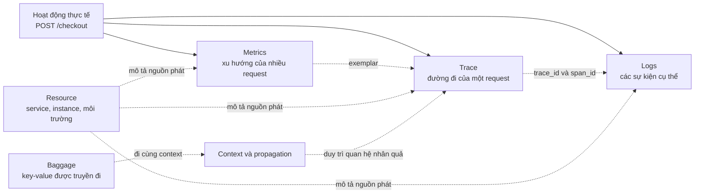
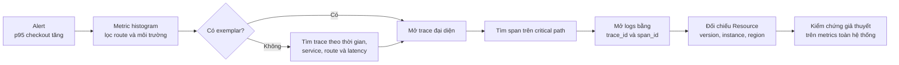

<Callout type="info" title="Bắt đầu từ câu hỏi, không bắt đầu từ công cụ">
  Metrics cho biết vấn đề có phổ biến hay không. Traces cho biết một request đã đi qua đâu. Logs cho biết sự kiện cụ thể đã xảy ra tại một thời điểm. Series này giúp bạn chọn đúng signal rồi nối các góc nhìn đó thành một cuộc điều tra hoàn chỉnh.
</Callout>

## Mục lục

- [Mental model: ba góc nhìn trên cùng một hệ thống](#mental-model-ba-góc-nhìn-trên-cùng-một-hệ-thống)
  - [Metrics nhìn vào tập hợp](#metrics-nhìn-vào-tập-hợp)
  - [Traces nhìn vào một hành trình](#traces-nhìn-vào-một-hành-trình)
  - [Logs nhìn vào từng sự kiện](#logs-nhìn-vào-từng-sự-kiện)
  - [Các signal bổ sung cho nhau](#các-signal-bổ-sung-cho-nhau)
- [Signal không phải resource, context hay baggage](#signal-không-phải-resource-context-hay-baggage)
  - [Resource mô tả nguồn phát](#resource-mô-tả-nguồn-phát)
  - [Context giữ trạng thái của luồng thực thi](#context-giữ-trạng-thái-của-luồng-thực-thi)
  - [Baggage mang dữ liệu tùy chọn qua boundary](#baggage-mang-dữ-liệu-tùy-chọn-qua-boundary)
  - [Attributes mô tả dữ liệu đã ghi](#attributes-mô-tả-dữ-liệu-đã-ghi)
- [Chọn signal theo câu hỏi](#chọn-signal-theo-câu-hỏi)
  - [Quy tắc chọn nhanh](#quy-tắc-chọn-nhanh)
- [Lộ trình học đề xuất](#lộ-trình-học-đề-xuất)
  - [Chặng 1: hiểu đường đi của request](#chặng-1-hiểu-đường-đi-của-request)
  - [Chặng 2: kiểm soát lượng trace](#chặng-2-kiểm-soát-lượng-trace)
  - [Chặng 3: quan sát xu hướng và sự kiện](#chặng-3-quan-sát-xu-hướng-và-sự-kiện)
  - [Chặng 4: nối các signal](#chặng-4-nối-các-signal)
- [Scenario điều tra: từ metric đến nguyên nhân](#scenario-điều-tra-từ-metric-đến-nguyên-nhân)
  - [Bối cảnh](#bối-cảnh)
  - [Bước 1: phát hiện bằng metric](#bước-1-phát-hiện-bằng-metric)
  - [Bước 2: đi từ exemplar sang trace](#bước-2-đi-từ-exemplar-sang-trace)
  - [Bước 3: tìm span bất thường](#bước-3-tìm-span-bất-thường)
  - [Bước 4: mở log trong đúng context](#bước-4-mở-log-trong-đúng-context)
  - [Bước 5: xác nhận phạm vi bằng resource](#bước-5-xác-nhận-phạm-vi-bằng-resource)
  - [Nếu chuỗi liên kết bị đứt](#nếu-chuỗi-liên-kết-bị-đứt)
- [Profiles đang ở đâu trong bức tranh](#profiles-đang-ở-đâu-trong-bức-tranh)
- [Checklist trước khi instrument](#checklist-trước-khi-instrument)
- [Tài liệu tham khảo chính thức](#tài-liệu-tham-khảo-chính-thức)
- [Đi tiếp trong series](#đi-tiếp-trong-series)

## Mental model: ba góc nhìn trên cùng một hệ thống

Một thao tác `POST /checkout` có thể đồng thời tạo ra metric, trace và log. Ba signal không phải ba bản sao của thao tác đó. Mỗi signal giữ một loại thông tin và phục vụ một kiểu truy vấn khác nhau.

### Metrics nhìn vào tập hợp

**Metric** là phép đo số được ghi nhận khi ứng dụng chạy. Backend thường tổng hợp các phép đo thành chuỗi thời gian để hiển thị xu hướng, tính tỷ lệ và tạo cảnh báo.

Ví dụ, histogram `http.server.request.duration` có thể trả lời: “p95 latency của route `/checkout` trong 15 phút qua là bao nhiêu?”. Nó không tự kể request nào đã gọi những service nào.

Hãy bắt đầu bằng metrics khi câu hỏi có các từ như “bao nhiêu”, “tỷ lệ”, “xu hướng”, “hiện tại” hoặc “trong một khoảng thời gian”.

### Traces nhìn vào một hành trình

**Trace** mô tả đường đi của một operation logic, chẳng hạn một request, qua các process và service. Trace được tạo từ các **span**. Mỗi span đại diện cho một đơn vị công việc có thời điểm bắt đầu và kết thúc.

Ví dụ, một trace checkout có thể chứa span HTTP ở frontend, span gọi payment service và span truy vấn database. Quan hệ parent-child cùng `trace_id` giúp backend dựng lại đường đi và critical path, tức chuỗi công việc quyết định tổng latency.

Hãy bắt đầu bằng traces khi câu hỏi là “request này đi qua đâu?”, “dependency nào chậm?” hoặc “lỗi phát sinh ở operation nào?”.

### Logs nhìn vào từng sự kiện

**Log record** là bản ghi có timestamp về một sự kiện. Log có thể chứa body, severity, attributes, resource và các trường trace context như `TraceId` hoặc `SpanId`.

Ví dụ, payment service có thể ghi một log `ERROR` với mã lỗi `gateway_timeout`. Log giải thích chi tiết sự kiện, nhưng nếu thiếu trace context thì bạn khó biết nó thuộc request checkout nào.

Hãy bắt đầu bằng logs khi bạn đã có một sự kiện cụ thể, một exception hoặc một thông điệp cần đọc nguyên văn.

### Các signal bổ sung cho nhau

| Góc nhìn | Đơn vị thường xem | Điểm mạnh | Điều không tự trả lời tốt |
| --- | --- | --- | --- |
| Metrics | Data point, metric stream, time series | Tổng hợp rẻ, dashboard, alert và SLO | Đường đi chi tiết của một request |
| Traces | Trace và span | Quan hệ nhân quả, dependency và latency từng operation | Xu hướng toàn hệ thống nếu không tổng hợp thêm |
| Logs | Log record | Chi tiết sự kiện, exception và dữ liệu chẩn đoán | Cấu trúc end-to-end nếu thiếu correlation |

Không có signal “tốt nhất” cho mọi câu hỏi. Một hệ thống quan sát được tốt thường dùng metrics để phát hiện, traces để khoanh vùng và logs để đọc chi tiết.

## Signal không phải resource, context hay baggage

Trong series này, **telemetry signal** chỉ dữ liệu quan sát được mà pipeline thu thập và backend truy vấn, chủ yếu là traces, metrics và logs. Tài liệu kiến trúc OpenTelemetry cũng xếp **Baggage** vào nhóm signal. Tuy nhiên, Baggage khác ba nhóm trên vì nó không có OTLP hay pipeline Collector riêng và không phải một telemetry record được export độc lập.

Resource, Context, Baggage và attributes giúp mô tả hoặc liên kết telemetry. Chúng không thay thế traces, metrics hay logs.

| Khái niệm | Nó mô tả hoặc mang gì? | Vòng đời điển hình | Ví dụ |
| --- | --- | --- | --- |
| Signal | Hoạt động hoặc phép đo của hệ thống | Theo operation, sự kiện hoặc chu kỳ đo | trace checkout, request duration, error log |
| Resource | Thực thể tạo ra hoặc được quan sát bởi telemetry | Thường gắn với provider trong suốt vòng đời process | `service.name=payment`, `service.version=2.4.1` |
| Context | Trạng thái gắn với luồng thực thi hiện tại | Theo request hoặc execution unit | active span và SpanContext hiện tại |
| Baggage | Key-value tùy chọn được truyền qua process boundary | Đi cùng distributed context | `tenant.tier=premium` |
| Attributes | Metadata gắn trực tiếp vào resource hoặc telemetry record | Theo đối tượng được mô tả | `http.request.method=POST` trên span |

### Resource mô tả nguồn phát

**Resource** là biểu diễn bất biến của thực thể mà telemetry được tạo cho nó. Ví dụ, resource có thể nhận diện service, process, container, Kubernetes Pod và môi trường triển khai.

Cùng một `trace_id` trả lời “các span nào thuộc request này?”. Cùng một `service.name` trả lời “telemetry này đến từ service nào?”. Hai khóa phục vụ hai chiều điều tra khác nhau.

Resource thường được gắn vào `TracerProvider`, `MeterProvider` hoặc `LoggerProvider`. Sau đó, spans, metrics hoặc log records do provider tạo ra cùng mang resource đó.

### Context giữ trạng thái của luồng thực thi

**Context** là cơ chế mang các giá trị theo phạm vi thực thi qua API boundary và giữa các execution unit có liên quan. **Context propagation** là quá trình inject context vào carrier rồi extract nó ở phía nhận. Carrier có thể là HTTP headers hoặc message metadata.

Ví dụ, frontend inject W3C `traceparent` vào request gọi payment service. Payment service extract header này để tạo span mới trong cùng trace và đặt span phía frontend làm parent.

Context không phải một bản ghi được lưu để truy vấn. Nó là nền tảng giúp tạo quan hệ đúng khi telemetry đang được sinh ra.

### Baggage mang dữ liệu tùy chọn qua boundary

**Baggage** là kho key-value nằm cạnh distributed context. Nó giúp một giá trị có ở đầu request tiếp tục khả dụng cho downstream service.

Ví dụ, frontend có thể truyền `tenant.tier=premium` để payment service dùng khi tạo telemetry. Giá trị Baggage không tự động trở thành span attribute, metric attribute hay log attribute. Instrumentation phải đọc và chép nó vào telemetry một cách có chủ đích.

<Callout type="warn" title="Baggage đi xa hơn bạn nghĩ">
  Baggage có thể được truyền tới downstream ngoài phạm vi tin cậy. Không đặt credential, API key, token hoặc dữ liệu định danh cá nhân vào Baggage. Dữ liệu nhận từ bên ngoài cũng không nên được tin cậy nếu chưa kiểm tra.
</Callout>

### Attributes mô tả dữ liệu đã ghi

**Attribute** là cặp key-value mô tả một đối tượng telemetry hoặc resource. Vị trí của attribute quyết định ý nghĩa của nó.

Ví dụ, `service.name=checkout` thuộc Resource vì nó mô tả nguồn phát ổn định. `http.request.method=POST` thuộc span hoặc metric data point vì nó mô tả operation hoặc phép đo cụ thể.

Với metrics, mỗi tổ hợp attribute có thể tạo một time series riêng. Không dùng giá trị có cardinality cao, tức có quá nhiều giá trị phân biệt, như `user.id` hoặc URL thô làm metric attribute nếu không có thiết kế và giới hạn rõ ràng.

## Chọn signal theo câu hỏi

Đừng instrument một signal chỉ vì backend hỗ trợ nó. Hãy viết câu hỏi vận hành trước, rồi chọn dữ liệu có độ phân giải phù hợp.

| Câu hỏi cần trả lời | Bắt đầu với | Sau đó chuyển sang | Lý do |
| --- | --- | --- | --- |
| Error rate có vượt SLO không? | Metrics | Exemplar hoặc trace | Metric đo tỷ lệ; trace cho request đại diện |
| Vì sao một request checkout mất 4 giây? | Traces | Span và logs | Trace cho critical path; log cho chi tiết tại span lỗi |
| Exception `payment timeout` thuộc request nào? | Logs | Trace qua `trace_id` | Log có exception; trace cho toàn bộ request context |
| Queue backlog tăng từ lúc nào và ở đâu? | Metrics | Producer/consumer spans | Metric cho xu hướng; trace cho luồng message |
| Deployment mới có làm latency tăng không? | Metrics + Resource | Traces theo `service.version` | Resource chia dữ liệu theo phiên bản; trace chỉ ra operation chậm |
| Có nên giảm chi phí lưu trace không? | Traces và lưu lượng hiện tại | Sampling | Phải hiểu dữ liệu cần giữ trước khi quyết định bỏ bớt |

### Quy tắc chọn nhanh

1. Nếu cần **đếm hoặc so sánh theo thời gian**, bắt đầu với metrics.
2. Nếu cần **đường đi và quan hệ nhân quả**, bắt đầu với traces.
3. Nếu cần **nội dung của một sự kiện**, bắt đầu với logs.
4. Nếu cần đi từ số liệu tổng hợp tới một request đại diện, dùng **exemplar** khi SDK và backend hỗ trợ.
5. Nếu cần nối các góc nhìn, giữ **resource attributes** nhất quán và bảo toàn **trace context**.

<Callout type="idea" title="Một câu hỏi có thể cần nhiều signal">
  “Vì sao checkout chậm sau lần deploy 2.4.1?” cần metric để xác nhận xu hướng, Resource để lọc đúng phiên bản, trace để tìm span chậm và log để đọc lỗi cụ thể. Việc chọn signal là chọn điểm bắt đầu, không phải loại bỏ các signal còn lại.
</Callout>

## Lộ trình học đề xuất

Các trang trong series đi từ cấu trúc của một request đến cách liên kết nhiều signal. Bạn có thể đọc tuần tự theo sidebar hoặc chọn chặng phù hợp với mục tiêu hiện tại.

### Chặng 1: hiểu đường đi của request

1. [Traces](/signals/traces/) xây mental model về trace, quan hệ parent-child và vòng đời trace.
2. [Spans](/signals/spans/) đi sâu vào span kind, timing, status, events, links và attributes.

Sau chặng này, bạn nên đọc được waterfall của một trace và giải thích vì sao một span thuộc critical path.

### Chặng 2: kiểm soát lượng trace

3. [Sampling](/signals/sampling/) giải thích head sampling, tail sampling và đánh đổi giữa độ phủ dữ liệu với chi phí.

Học sampling sau traces giúp bạn hiểu chính xác dữ liệu nào có thể bị loại. Một trace không được giữ lại cũng có thể làm mất đường đi từ exemplar hoặc log sang trace trong backend.

### Chặng 3: quan sát xu hướng và sự kiện

4. [Metrics](/signals/metrics/) trình bày instruments, data points, temporality và aggregation.
5. [Logs](/signals/logs/) trình bày structured logs, severity, timestamp và trace context fields.

Sau chặng này, bạn nên chọn được instrument cho request count, latency và giá trị hiện tại. Bạn cũng nên phân biệt log body với các field có cấu trúc dùng để lọc.

### Chặng 4: nối các signal

6. [Exemplars](/signals/exemplars/) nối một phép đo metric đại diện với trace hoặc span liên quan.
7. [Signal correlation](/signals/correlation/) hệ thống hóa `trace_id`, `span_id`, resource và correlation workflow.

Đây là chặng biến ba kho dữ liệu riêng thành một quy trình điều tra. Kết quả cần đạt là đi từ alert tới đúng request mà không phải đoán thủ công bằng timestamp.

## Scenario điều tra: từ metric đến nguyên nhân

### Bối cảnh

Lúc 10:05, alert báo p95 của `POST /checkout` vượt 2 giây trong môi trường production. Hệ thống gồm frontend, checkout service, payment service và database.

Mục tiêu không phải đọc toàn bộ log trong khoảng thời gian đó. Mục tiêu là thu hẹp từ một nhóm request bất thường xuống operation và sự kiện gây chậm.

### Bước 1: phát hiện bằng metric

Mở histogram request duration và giữ cùng phạm vi với alert. Ví dụ, lọc `deployment.environment.name=production` và route `/checkout`.

Metric xác nhận ba điều: sự cố bắt đầu lúc nào, ảnh hưởng bao nhiêu request và có tập trung ở một service hoặc phiên bản hay không. Metric chưa cho biết request cụ thể nào tạo ra phần đuôi latency.

### Bước 2: đi từ exemplar sang trace

**Exemplar** là một phép đo mẫu được giữ cùng metric data point. Khi phép đo được ghi trong active trace context, exemplar có thể mang `trace_id` và `span_id` để trỏ tới trace đại diện.

Chọn exemplar nằm trong bucket latency cao, chẳng hạn một phép đo 3,8 giây. Nếu backend hỗ trợ liên kết này và trace còn được lưu, bạn có thể mở trace tương ứng trực tiếp từ biểu đồ.

Exemplar không có nghĩa là mọi phép đo đều có một trace để mở. Chính sách exemplar, sampling, SDK, Collector và backend đều có thể ảnh hưởng đến liên kết.

### Bước 3: tìm span bất thường

Trong trace đại diện, so sánh thời lượng các span trên critical path. Giả sử span client gọi `POST /charge` mất 3,2 giây, còn các span khác dưới 200 ms.

Mở span này và kiểm tra tên operation, kind, status, events và attributes. Nếu payment service có server span tương ứng, quan hệ client-server giúp xác định thời gian nằm trên network hay trong xử lý phía server.

### Bước 4: mở log trong đúng context

Dùng `trace_id` để lấy mọi log thuộc request. Sau đó dùng `span_id` của payment span để thu hẹp vào operation đang điều tra.

Giả sử log tại span đó có `SeverityText=ERROR`, body `gateway timeout` và attribute `retry.count=2`. Log cung cấp chi tiết sự kiện mà thời lượng span một mình không thể hiện đầy đủ.

`TraceId` và `SpanId` là các field tùy chọn trong OpenTelemetry Log Data Model. Hãy xác minh logging bridge hoặc SDK thực sự chèn chúng từ active context.

### Bước 5: xác nhận phạm vi bằng resource

Kiểm tra resource của trace và log. Giả sử lỗi chỉ xuất hiện với `service.name=payment`, `service.version=2.4.1` và `cloud.region=ap-southeast-1`.

Quay lại metric và nhóm theo các chiều có cardinality được kiểm soát, chẳng hạn version hoặc region. Nếu latency chỉ tăng ở phiên bản 2.4.1, bạn có bằng chứng để rollback hoặc tiếp tục kiểm tra thay đổi của phiên bản đó.

Cuộc điều tra kết thúc khi giả thuyết từ một trace được kiểm chứng trên tập request rộng hơn. Một trace đại diện cho trường hợp cụ thể; nó không tự chứng minh mức độ phổ biến.

### Nếu chuỗi liên kết bị đứt

| Điểm đứt | Biểu hiện | Kiểm tra đầu tiên |
| --- | --- | --- |
| Metric không có exemplar | Biểu đồ không có liên kết tới trace | Exemplar support và cấu hình SDK/backend |
| Exemplar có ID nhưng trace không tồn tại | Link trả về rỗng | Trace sampling, retention và route export |
| Trace bị chia thành nhiều đoạn | Span downstream thành root mới | Inject/extract context tại HTTP hoặc message boundary |
| Log không có `trace_id` | Không thể mở log từ trace | Logging bridge và active context lúc emit log |
| Dữ liệu không lọc được theo service | Resource thiếu hoặc không nhất quán | `service.name` và resource detectors |

<Callout type="warn" title="Correlation không sửa được dữ liệu chưa được thu thập">
  ID đúng chỉ tạo đường nối. Nếu trace đã bị sampling loại bỏ, log không được ingest hoặc resource đặt sai, backend không thể dựng lại phần dữ liệu còn thiếu. Hãy kiểm thử correlation end-to-end trước khi dựa vào nó trong incident thật.
</Callout>

## Profiles đang ở đâu trong bức tranh

**Profile** ghi lại resource usage ở mức code, chẳng hạn function nào tiêu thụ CPU. Nó bổ sung câu trả lời “thời gian hoặc tài nguyên bị tiêu ở dòng code nào?” sau khi metrics và traces đã khoanh vùng service hoặc operation.

Profiles vẫn là signal đang phát triển. [Profiles specification](https://opentelemetry.io/docs/specs/otel/profiles/) hiện ở mức **Alpha**, nên không nên giả định mọi SDK, Collector distribution và backend đã hỗ trợ giống nhau.

Series hiện tại chưa có bài riêng về Profiles. Khi cần dùng, hãy kiểm tra trạng thái của specification, ngôn ngữ SDK, Collector component và backend tại thời điểm triển khai.

## Checklist trước khi instrument

- [ ] Viết câu hỏi vận hành mà telemetry phải trả lời.
- [ ] Chọn signal có độ phân giải phù hợp làm điểm bắt đầu.
- [ ] Đặt `service.name` và các resource attributes cần thiết một cách nhất quán.
- [ ] Bảo toàn context qua HTTP, RPC và message boundaries.
- [ ] Dùng semantic conventions cho tên phổ biến khi có thể.
- [ ] Kiểm soát cardinality của metric attributes và dữ liệu nhạy cảm trong logs.
- [ ] Không tự động sao chép toàn bộ Baggage vào telemetry.
- [ ] Xác minh log records có `trace_id` và `span_id` khi emit trong active span.
- [ ] Kiểm thử đường đi metric → exemplar → trace → span/log trên backend thực tế.
- [ ] Đánh giá sampling, retention và chi phí sau khi xác định dữ liệu cần giữ.

## Tài liệu tham khảo chính thức

- [OpenTelemetry Signals](https://opentelemetry.io/docs/concepts/signals/) — danh mục signal và trạng thái phát triển của Events, Profiles.
- [Traces](https://opentelemetry.io/docs/concepts/signals/traces/), [Metrics](https://opentelemetry.io/docs/concepts/signals/metrics/) và [Logs](https://opentelemetry.io/docs/concepts/signals/logs/) — định nghĩa và thành phần của ba góc nhìn chính.
- [Context propagation](https://opentelemetry.io/docs/concepts/context-propagation/) và [Context specification](https://opentelemetry.io/docs/specs/otel/context/) — context, propagation và correlation qua service boundary.
- [Resources](https://opentelemetry.io/docs/concepts/resources/) và [Resource SDK specification](https://opentelemetry.io/docs/specs/otel/resource/sdk/) — thực thể tạo telemetry và cách resource gắn với provider.
- [Baggage](https://opentelemetry.io/docs/concepts/signals/baggage/) — cách truyền key-value và các lưu ý bảo mật.
- [Metrics Data Model](https://opentelemetry.io/docs/specs/otel/metrics/data-model/) và [Logs Data Model](https://opentelemetry.io/docs/specs/otel/logs/data-model/) — cấu trúc dữ liệu, exemplars và trace context fields.
- [Sampling](https://opentelemetry.io/docs/concepts/sampling/) và [Specification Status](https://opentelemetry.io/docs/specs/status/) — chiến lược sampling và mức trưởng thành của từng signal.

## Đi tiếp trong series

<Cards>
  <Card title="Traces" href="/signals/traces/" description="Hiểu trace, quan hệ parent-child và vòng đời của một request." />
  <Card title="Spans" href="/signals/spans/" description="Đi sâu vào kind, status, events, links, attributes và timing." />
  <Card title="Sampling" href="/signals/sampling/" description="Cân bằng độ phủ trace với lưu lượng và chi phí." />
  <Card title="Metrics" href="/signals/metrics/" description="Học instruments, data points, temporality và aggregation." />
  <Card title="Logs" href="/signals/logs/" description="Thiết kế structured logs và liên kết log với trace." />
  <Card title="Exemplars" href="/signals/exemplars/" description="Đi từ metric data point tới trace hoặc span đại diện." />
  <Card title="Signal correlation" href="/signals/correlation/" description="Kết hợp trace ID, span ID và resource trong điều tra sự cố." />
</Cards>
