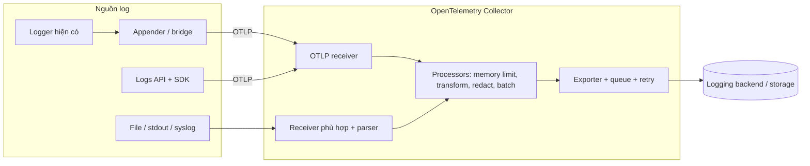
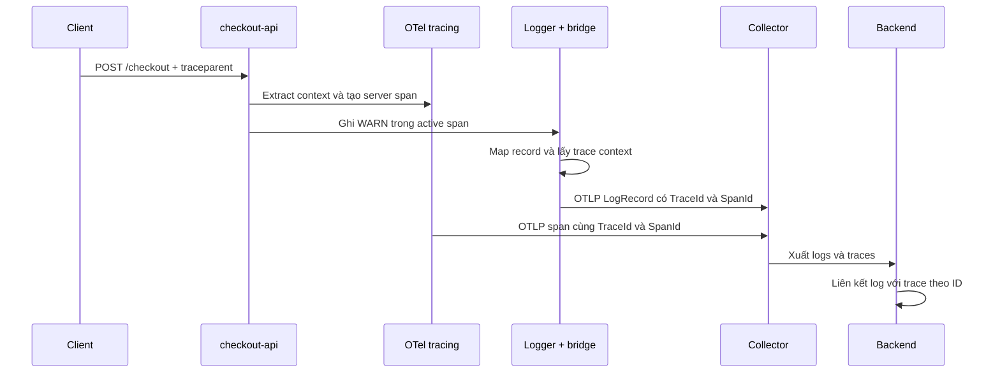

<Callout type="info" title="OpenTelemetry chuẩn hóa và vận chuyển log, không lưu trữ log">
  OpenTelemetry cung cấp mô hình dữ liệu, API, SDK, bridge và Collector để tạo,
  thu nhận, xử lý và xuất log. Nó không thay thế logging backend, công cụ tìm
  kiếm, retention hay storage. Ứng dụng cũng không nhất thiết phải thay toàn bộ
  logger hiện có: một appender, handler hoặc bridge phù hợp thường có thể chuyển
  log sang mô hình OpenTelemetry và thêm trace context.
</Callout>

## Mục lục

- [Logs trong OpenTelemetry giải quyết gì](#logs-trong-opentelemetry-giải-quyết-gì)
  - [Ranh giới trách nhiệm](#ranh-giới-trách-nhiệm)
- [Mô hình LogRecord](#mô-hình-logrecord)
  - [Timestamp và ObservedTimestamp](#timestamp-và-observedtimestamp)
  - [SeverityText và SeverityNumber](#severitytext-và-severitynumber)
  - [Body và attributes có cấu trúc](#body-và-attributes-có-cấu-trúc)
  - [Resource và InstrumentationScope](#resource-và-instrumentationscope)
  - [Các trường trace correlation](#các-trường-trace-correlation)
- [Một log có cấu trúc hoàn chỉnh](#một-log-có-cấu-trúc-hoàn-chỉnh)
  - [Bản ghi nguồn từ ứng dụng](#bản-ghi-nguồn-từ-ứng-dụng)
  - [Cách đọc theo mô hình OpenTelemetry](#cách-đọc-theo-mô-hình-opentelemetry)
- [Hai cách đưa log vào OpenTelemetry](#hai-cách-đưa-log-vào-opentelemetry)
  - [Phát log qua Logs API và SDK](#phát-log-qua-logs-api-và-sdk)
  - [Bridge logger hiện có](#bridge-logger-hiện-có)
  - [Thu nhận log bên ngoài ứng dụng](#thu-nhận-log-bên-ngoài-ứng-dụng)
- [Pipeline logs trong Collector](#pipeline-logs-trong-collector)
  - [Luồng xử lý khái niệm](#luồng-xử-lý-khái-niệm)
  - [Cấu hình YAML minh họa](#cấu-hình-yaml-minh-họa)
- [Correlation với trace](#correlation-với-trace)
  - [Khi context hoạt động đúng](#khi-context-hoạt-động-đúng)
  - [Khi log chạy bất đồng bộ](#khi-log-chạy-bất-đồng-bộ)
  - [TraceFlags và sampling](#traceflags-và-sampling)
- [Exceptions](#exceptions)
- [Các lỗi ingestion phổ biến](#các-lỗi-ingestion-phổ-biến)
  - [Multiline và stack trace](#multiline-và-stack-trace)
  - [Time skew và thứ tự](#time-skew-và-thứ-tự)
  - [Duplicate logs](#duplicate-logs)
  - [Mất log và backpressure](#mất-log-và-backpressure)
- [Chi phí bảo mật và chất lượng schema](#chi-phí-bảo-mật-và-chất-lượng-schema)
  - [Cardinality và kích thước](#cardinality-và-kích-thước)
  - [PII và secrets](#pii-và-secrets)
- [Cách xác minh end to end](#cách-xác-minh-end-to-end)
  - [Kiểm tra schema](#kiểm-tra-schema)
  - [Kiểm tra correlation](#kiểm-tra-correlation)
  - [Kiểm tra resilience](#kiểm-tra-resilience)
- [Checklist best practices](#checklist-best-practices)
- [Tài liệu liên quan](#tài-liệu-liên-quan)
- [Tham khảo chính thức](#tham-khảo-chính-thức)

## Logs trong OpenTelemetry giải quyết gì

Một **log record** là bản ghi về một sự kiện đã xảy ra. Ví dụ, service
`checkout-api` có thể ghi rằng thanh toán bị từ chối, kèm mã lỗi, nhà cung cấp
thanh toán và trace ID của request. Log hữu ích vì giữ được chi tiết cụ thể mà
metric tổng hợp thường không có.

Vấn đề là mỗi logger và nguồn hệ thống có thể dùng tên trường, kiểu dữ liệu và
cách biểu diễn severity khác nhau. OpenTelemetry đưa các nguồn đó về một
**LogRecord data model** chung. Dữ liệu sau đó có thể được vận chuyển bằng OTLP
(OpenTelemetry Protocol), xử lý trong Collector và xuất đến backend đã chọn.

### Ranh giới trách nhiệm

| Thành phần | Trách nhiệm | Không nên kỳ vọng |
| --- | --- | --- |
| Logger của ứng dụng | Tạo message và structured fields tại call site | Tự cung cấp kho lưu trữ tập trung |
| OTel Logs API và SDK | Tạo LogRecord, gắn context, xử lý theo batch và gọi exporter | Cung cấp giao diện tìm kiếm log dài hạn |
| Appender, handler hoặc bridge | Ánh xạ bản ghi của logger hiện có sang LogRecord | Khôi phục context đã mất sau khi log được ghi ra file |
| Collector | Nhận, parse, biến đổi, lọc, batch và xuất log | Là logging database hoặc cam kết không mất dữ liệu trong mọi lỗi |
| Logging backend | Lưu trữ, index, truy vấn, cảnh báo và retention | Tự sửa schema hoặc dữ liệu nhạy cảm đã ingest sai |

<Callout type="idea" title="Lộ trình áp dụng ít xáo trộn">
  Nếu ứng dụng đã dùng Log4j, `java.util.logging`, Python `logging`, Zap,
  `Microsoft.Extensions.Logging` hoặc framework tương tự, hãy kiểm tra bridge
  hoặc appender của OTel cho ngôn ngữ đó trước. Giữ API logging quen thuộc tại
  call site thường rẻ và ít rủi ro hơn một đợt thay logger toàn hệ thống.
</Callout>

## Mô hình LogRecord

Mô hình logic của OpenTelemetry có các trường top-level mang ý nghĩa cố định và
các collection mở rộng. **Top-level** nghĩa là trường chuẩn nằm trực tiếp trên
LogRecord, không phải custom attribute.

| Trường | Ý nghĩa | Ví dụ |
| --- | --- | --- |
| `Timestamp` | Thời điểm sự kiện xảy ra theo đồng hồ của nguồn | `2026-03-12T09:15:31.482Z` |
| `ObservedTimestamp` | Thời điểm OTel quan sát được sự kiện | `2026-03-12T09:15:31.497Z` |
| `SeverityText` | Chuỗi level gốc của nguồn | `WARNING`, `error` |
| `SeverityNumber` | Severity đã chuẩn hóa để so sánh | `13`, `17` |
| `Body` | Nội dung chính, có thể là string, scalar, array hoặc map | `"Payment declined"` hoặc một object |
| `Attributes` | Metadata thay đổi theo từng lần xảy ra sự kiện | `payment.provider`, `error.code` |
| `Resource` | Thực thể đã tạo ra log | `service.name`, `service.version` |
| `InstrumentationScope` | Module, thư viện instrumentation hoặc logger đã phát log | tên và version của scope |
| `TraceId`, `SpanId`, `TraceFlags` | Context dùng để liên kết log với trace và span | ID và sampled flag |
| `EventName` | Tên ổn định nhận diện loại event | `payment.authorization.failed` |

Các trường đều có thể không xuất hiện tùy nguồn. Ví dụ, một dòng log cũ không
chứa timestamp nguồn vẫn có thể được Collector gắn `ObservedTimestamp` khi thu
nhận.

### Timestamp và ObservedTimestamp

Hai timestamp trả lời hai câu hỏi khác nhau:

- `Timestamp`: **sự kiện thực sự xảy ra lúc nào theo nguồn?**
- `ObservedTimestamp`: **hệ thống OpenTelemetry nhìn thấy sự kiện lúc nào?**

Giả sử ứng dụng ghi sự kiện lúc `09:15:31.482`, nhưng agent đọc file lúc
`09:15:33.010`. `Timestamp` nên giữ thời gian từ dòng log. `ObservedTimestamp`
phản ánh thời điểm agent quan sát bản ghi. Nếu nguồn không có timestamp đáng tin,
chỉ `ObservedTimestamp` vẫn tốt hơn việc tự bịa thời gian xảy ra.

Khi đích chỉ hỗ trợ một timestamp, đặc tả khuyến nghị dùng `Timestamp` nếu có;
nếu không thì dùng `ObservedTimestamp`. Hiệu `ObservedTimestamp - Timestamp` có
thể gợi ý độ trễ thu nhận. Tuy nhiên, nó **không tự động là latency chính xác** vì
hai giá trị có thể đến từ hai đồng hồ lệch nhau.

### SeverityText và SeverityNumber

`SeverityText` bảo toàn chuỗi gốc. Ví dụ, nguồn có thể dùng `WARN`, `Warning` hoặc
`NOTICE`. `SeverityNumber` chuẩn hóa mức độ để backend lọc và so sánh nhất quán.

| Khoảng `SeverityNumber` | Tên khoảng | Ý nghĩa |
| --- | --- | --- |
| `0` | `UNSPECIFIED` | Không xác định severity |
| `1–4` | `TRACE` | Debug rất chi tiết |
| `5–8` | `DEBUG` | Thông tin debug |
| `9–12` | `INFO` | Sự kiện mang tính thông tin |
| `13–16` | `WARN` | Cảnh báo, chưa nhất thiết là lỗi |
| `17–20` | `ERROR` | Tình huống lỗi |
| `21–24` | `FATAL` | Lỗi nghiêm trọng như crash hoặc shutdown |

Nếu nguồn chỉ có một level trong một khoảng, giá trị đầu khoảng là ánh xạ được
khuyến nghị: `DEBUG → 5`, `INFO → 9`, `WARN → 13`, `ERROR → 17` và `FATAL → 21`.
Nguồn có nhiều level cùng nhóm có thể dùng các số còn lại theo độ nghiêm trọng.
Vì vậy, mapping phải dựa trên **ngữ nghĩa của logger nguồn**, không dựa trên thứ
tự tên level do người vận hành đoán.

<Callout type="warn" title="Không ghi đè level gốc bằng level chuẩn hóa">
  Hãy giữ `SeverityText="NOTICE"` nếu nguồn phát `NOTICE`, đồng thời ánh xạ sang
  `SeverityNumber` phù hợp. Khi lọc theo ngưỡng, dùng `SeverityNumber`. Khi điều
  tra mapping, hiển thị cả hai trường.
</Callout>

### Body và attributes có cấu trúc

`Body` là payload chính của log. Nó có kiểu **AnyValue**, tức có thể chứa string,
số, boolean, bytes, array hoặc map lồng nhau. Vì vậy, structured log không bắt
buộc phải ép toàn bộ object thành một chuỗi JSON.

`Attributes` là metadata của **lần xảy ra cụ thể**. Ví dụ:

```json
{
  "body": "Payment authorization failed",
  "attributes": {
    "payment.provider": "acme-pay",
    "payment.attempt": 2,
    "error.code": "CARD_DECLINED",
    "app.feature_flag": "new-risk-engine"
  }
}
```

Một file chứa JSON chưa chắc đã là structured logging tốt. **Structured** còn
đòi hỏi schema đủ ổn định: cùng một key nên giữ cùng kiểu và ngữ nghĩa qua các
service/version. Nếu `payment.attempt` lúc là số, lúc là chuỗi và lúc lại là một
object, downstream vẫn phải xử lý một schema bán cấu trúc.

Quy tắc thực dụng:

- Đặt message hoặc payload chính vào `Body`.
- Đặt fields cần lọc, nhóm hoặc giải thích lần xảy ra vào `Attributes`.
- Không lặp cùng một giá trị ở cả body string và attributes nếu không có lý do.
- Dùng semantic conventions hiện hành khi domain đã có key chuẩn.
- Giữ kiểu dữ liệu gốc; đừng stringify mọi số và boolean.

### Resource và InstrumentationScope

**Resource** mô tả thực thể sinh ra telemetry. Nhiều log từ cùng một service
instance thường chia sẻ resource:

```json
{
  "service.name": "checkout-api",
  "service.version": "2.8.1",
  "service.instance.id": "checkout-7f8d9c-kr2pq",
  "deployment.environment.name": "production",
  "cloud.region": "asia-southeast1"
}
```

Không đưa `order.id` hoặc `request.id` vào Resource vì chúng đổi theo từng sự
kiện. Những giá trị đó, nếu thực sự cần và được policy cho phép, thuộc về
`Attributes`.

**InstrumentationScope** nhận diện code đã phát log. Scope thường có tên, version
và có thể có schema URL hoặc scope attributes. Với logging bridge, logger name
của framework nguồn thường là ứng viên phù hợp cho scope name. Scope
`com.example.checkout.PaymentService` không thay thế `service.name`; hai trường
trả lời hai câu hỏi khác nhau.

### Các trường trace correlation

Log phát trong lúc một span đang active có thể mang:

- `TraceId`: nhận diện toàn bộ distributed trace;
- `SpanId`: nhận diện operation cụ thể trong trace;
- `TraceFlags`: các cờ W3C Trace Context, trong đó sampled flag cho biết quyết
  định sampling của trace context.

Ở dạng text phổ biến, trace ID hợp lệ có 32 ký tự hex và span ID có 16 ký tự hex.
Trong data model và OTLP, cách biểu diễn vật lý phụ thuộc encoding. Không tự nối,
cắt hoặc đổi ID sang một custom field nếu bridge có thể đặt chúng vào các trường
top-level chuẩn.

## Một log có cấu trúc hoàn chỉnh

### Bản ghi nguồn từ ứng dụng

Ứng dụng có thể tiếp tục ghi bằng logger quen thuộc. Pseudocode sau cho thấy
message gần call site và structured fields đi cùng lỗi:

```text
with active_span("POST /checkout"):
    result = payment.authorize(order)

    if result.declined:
        app_logger.warn(
            "Payment authorization failed",
            payment_provider = "acme-pay",
            payment_attempt = 2,
            error_code = "CARD_DECLINED",
            order_total = 1250000,
            currency = "VND"
        )
```

Bridge có thể lấy active context, map level và chuyển bản ghi sang Logs SDK.

### Cách đọc theo mô hình OpenTelemetry

Ví dụ sau là **góc nhìn logic để học mô hình**, không phải cam kết về JSON wire
format của một exporter cụ thể:

```json
{
  "Timestamp": "2026-03-12T09:15:31.482Z",
  "ObservedTimestamp": "2026-03-12T09:15:31.497Z",
  "SeverityText": "WARN",
  "SeverityNumber": 13,
  "Body": "Payment authorization failed",
  "EventName": "payment.authorization.failed",
  "Attributes": {
    "payment.provider": "acme-pay",
    "payment.attempt": 2,
    "error.code": "CARD_DECLINED",
    "order.total": 1250000,
    "order.currency": "VND"
  },
  "Resource": {
    "service.name": "checkout-api",
    "service.version": "2.8.1",
    "deployment.environment.name": "production"
  },
  "InstrumentationScope": {
    "name": "com.example.checkout.PaymentService",
    "version": "2.8.1"
  },
  "TraceId": "4bf92f3577b34da6a3ce929d0e0e4736",
  "SpanId": "00f067aa0ba902b7",
  "TraceFlags": 1
}
```

`EventName` là tên ổn định của loại event. Theo data model, LogRecord có
`EventName` khác rỗng là một **Event**. Không phải mọi log tự do đều cần trường
này. Chỉ đặt event name khi có schema đủ ổn định để consumer nhận diện loại sự
kiện.

## Hai cách đưa log vào OpenTelemetry

Có hai nhóm cách tiếp cận. Chọn theo quyền kiểm soát source code, khả năng của
ngôn ngữ và yêu cầu correlation.

### Phát log qua Logs API và SDK

Logs API có `LoggerProvider`, `Logger` và thao tác emit LogRecord. SDK triển khai
pipeline in-process, thường gồm processor và exporter. Pseudocode khái niệm:

```text
provider = create_logger_provider(
    resource = {"service.name": "checkout-api"},
    processor = batch_processor(otlp_log_exporter)
)

otel_logger = provider.get_logger(
    name = "com.example.checkout.payment",
    version = "2.8.1"
)

otel_logger.emit(
    context = current_context,
    timestamp = now,
    severity_text = "WARN",
    severity_number = 13,
    body = "Payment authorization failed",
    attributes = {"error.code": "CARD_DECLINED"},
    event_name = "payment.authorization.failed"
)
```

API có thể được gọi trực tiếp khi language SDK cung cấp trải nghiệm phù hợp hoặc
khi instrumentation cần phát event chuẩn. Tuy nhiên, Logs API cũng được thiết kế
để tác giả logging library xây bridge. Với code ứng dụng thông thường, bridge
của logger hiện có thường dễ áp dụng hơn.

Processor dạng batch giảm số lần export nhưng dùng queue hữu hạn. Ứng dụng cần
flush/shutdown SDK theo lifecycle của runtime. Không gọi force flush trên từng
request; việc đó dễ biến logging thành đường blocking và làm giảm throughput.

### Bridge logger hiện có

Bridge, appender hoặc handler nhận record từ framework logging rồi:

1. giữ nguyên timestamp, message, level và structured fields nguồn;
2. map level sang `SeverityText` và `SeverityNumber`;
3. lấy active context hoặc context được truyền tường minh;
4. emit LogRecord vào OTel Logs SDK;
5. để processor và exporter gửi record ra Collector hoặc đích khác.

Cách này cho phép giữ nguyên call như `logger.warn(...)`. Kiểm tra tài liệu SDK
của ngôn ngữ vì khả năng tự động gắn context, API cấu hình và lifecycle khác
nhau giữa các implementation.

### Thu nhận log bên ngoài ứng dụng

Collector có thể nhận log từ OTLP, file, stdout của container, syslog, journald
hoặc các nguồn khác tùy distribution. Cách này phù hợp với ứng dụng cũ, phần mềm
bên thứ ba và system logs.

Điểm đánh đổi quan trọng là context. Sau khi một dòng text đã được ghi ra file,
Collector không còn truy cập được active span trong process đã tạo dòng đó. Muốn
correlation, source phải serialize trace ID/span ID vào log, hoặc bridge phải
gắn chúng trước khi record rời process. Collector chỉ có thể parse dữ liệu đang
có; nó không thể suy ra chắc chắn một trace ID đã mất.

## Pipeline logs trong Collector

### Luồng xử lý khái niệm



Một logs pipeline có dạng `receivers → processors → exporters`:

- **Receiver** nhận dữ liệu. Ví dụ, OTLP receiver nhận LogRecord đã có cấu trúc;
  file log receiver tail file và có thể chạy parser.
- **Processor** biến đổi theo thứ tự cấu hình. Nó có thể thêm resource, bỏ field
  nhạy cảm, lọc noise hoặc batch.
- **Exporter** gửi dữ liệu đến backend hay tầng Collector tiếp theo.

Collector không tự bật component chỉ vì component đã được khai báo. Component
phải được tham chiếu trong `service.pipelines.logs`.

### Cấu hình YAML minh họa

Cấu hình sau minh họa hai nguồn cùng đi vào một logs pipeline. Tên component và
option cụ thể có thể khác theo Collector distribution và version; luôn đối
chiếu README của component thực tế đang cài.

```yaml
receivers:
  otlp:
    protocols:
      grpc:
        endpoint: 0.0.0.0:4317
      http:
        endpoint: 0.0.0.0:4318

  filelog/app:
    include: [/var/log/checkout/*.json]
    start_at: end
    operators:
      - type: json_parser
        parse_from: body
    resource:
      service.name: checkout-api
      deployment.environment.name: production

processors:
  memory_limiter:
    check_interval: 1s
    limit_mib: 512
    spike_limit_mib: 128
  batch: {}

exporters:
  debug:
    verbosity: detailed
  otlphttp/backend:
    endpoint: https://telemetry.example.com

service:
  pipelines:
    logs:
      receivers: [otlp, filelog/app]
      processors: [memory_limiter, batch]
      exporters: [debug, otlphttp/backend]
```

`debug` exporter hữu ích khi xác minh nhưng nó tạo thêm một bản output. Sau khi
kiểm tra, hãy bỏ nó nếu không muốn log Collector chứa bản sao payload. Trước khi
chạy, kiểm tra component có trong distribution và validate cấu hình:

```bash
otelcol components
otelcol validate --config=otel-collector.yaml
```

<Callout type="warn" title="Không copy nguyên cấu hình minh họa vào production">
  Endpoint cần TLS và authentication phù hợp. Production còn cần sizing,
  sending queue, retry, persistent storage theo yêu cầu mất dữ liệu, cùng policy
  redaction. Cấu hình chính xác phải dựa trên version của Collector và exporter
  đang triển khai.
</Callout>

## Correlation với trace

Correlation là việc dùng trường chung để đi từ log sang trace hoặc ngược lại.
Với OpenTelemetry, cặp liên kết chính là `TraceId` và `SpanId`; resource giúp
thu hẹp service và instance.

### Khi context hoạt động đúng



Khi SDK emit LogRecord với current context, trace context fields có thể được lấy
từ span đã resolve. Một kiểm tra đúng phải thấy:

- log và trace có cùng `TraceId`;
- `SpanId` của log là span active tại call site;
- resource tối thiểu có `service.name` nhất quán;
- timestamp của log nằm hợp lý trong hoặc gần thời gian span tương ứng.

Correlation không có nghĩa mọi log phải có trace ID. Log startup, background
maintenance hoặc system log có thể hợp lệ dù không nằm trong một trace.

### Khi log chạy bất đồng bộ

Một số logger đặt record vào queue rồi appender xử lý trên thread khác. Nếu
bridge chỉ đọc **current context của thread consumer**, span ở call site có thể
đã kết thúc hoặc consumer có context khác. Kết quả là thiếu ID hoặc gắn nhầm ID.

Giải pháp là capture context tại call site, hoặc dùng cơ chế context/MDC mà bridge
hỗ trợ để mang context đi cùng record. Với ngôn ngữ yêu cầu explicit context,
wrapper hoặc logger call phải truyền context tường minh. Đừng tự dùng một biến
global chứa “trace hiện tại”; nhiều request đồng thời sẽ ghi đè lẫn nhau.

### TraceFlags và sampling

`TraceFlags` có thể chứa sampled flag. Giá trị sampled cho biết quyết định
sampling của trace context, không phải bằng chứng backend đã nhận và lưu trace.
Log vẫn có thể được thu nhận khi trace không sampled, tùy cấu hình logging. Khi
đó UI có trace ID nhưng không tìm thấy trace tương ứng là điều có thể xảy ra.

Nếu áp dụng trace-based filtering cho logs, hãy đánh giá cẩn thận: chỉ giữ log
của sampled traces có thể làm mất error log quan trọng từ trace không sampled.
Một policy phổ biến hơn là luôn giữ log severity cao, rồi sampling hoặc lọc nhóm
log ít giá trị theo rule độc lập.

## Exceptions

Exception nên được ghi dưới dạng structured attributes thay vì chỉ nối stack
trace vào message:

```json
{
  "EventName": "payment.authorization.exception",
  "SeverityNumber": 13,
  "Body": "Payment provider request failed",
  "Attributes": {
    "exception.type": "java.net.SocketTimeoutException",
    "exception.message": "Read timed out",
    "exception.stacktrace": "java.net.SocketTimeoutException: Read timed out\n  at ...",
    "payment.provider": "acme-pay"
  }
}
```

Các key exception chuẩn gồm:

| Attribute | Cách dùng |
| --- | --- |
| `exception.type` | Kiểu động của exception, ưu tiên tên đầy đủ khi ngôn ngữ có khái niệm đó |
| `exception.message` | Message của exception; có thể chứa dữ liệu nhạy cảm |
| `exception.stacktrace` | Stack trace ở representation tự nhiên của runtime |

Nếu Logs API của ngôn ngữ cho phép truyền exception object, ưu tiên cơ chế đó để
SDK áp dụng conventions thay vì tự tách field. Attributes do ứng dụng cung cấp
cần được kiểm tra để không vô tình che hoặc xung đột với dữ liệu exception.

Severity phản ánh **tác động dự kiến**, không chỉ phản ánh việc có exception.
Timeout đã được xử lý và retry thành công không nên mặc định là `FATAL`. Lỗi
không được xử lý thường phù hợp với `ERROR`; exception dự kiến được code xử lý
có thể là `WARN` hoặc thấp hơn tùy ảnh hưởng. Chỉ dùng `FATAL` cho tình huống
thường dẫn đến dừng ứng dụng hoặc hệ thống.

<Callout type="warn" title="Tránh ghi cùng một exception nhiều lần">
  Framework, auto-instrumentation, logger và code ứng dụng có thể cùng ghi một
  exception. Kiểm tra log event, span event và handler toàn cục trước khi thêm
  một lệnh log nữa. Chọn một nơi sở hữu record chính; các tầng khác chỉ bổ sung
  context khi cần.
</Callout>

## Các lỗi ingestion phổ biến

### Multiline và stack trace

Stack trace thường kéo dài nhiều dòng. Nếu receiver coi mỗi newline là một
record, một exception có thể biến thành hàng chục log không có timestamp,
severity hay trace ID.

Với file log receiver, cấu hình multiline cần một quy tắc nhận diện đầu hoặc cuối
record. Ví dụ sau coi dòng bắt đầu bằng timestamp ISO là record mới:

```yaml
receivers:
  filelog/app:
    include: [/var/log/checkout/app.log]
    multiline:
      line_start_pattern: '^\d{4}-\d{2}-\d{2}T\d{2}:\d{2}:\d{2}'
```

Test parser bằng ít nhất ba trường hợp: một log một dòng, một exception nhiều
dòng và hai exception liên tiếp. Regex quá rộng sẽ tách stack trace. Regex quá
hẹp sẽ gộp nhiều sự kiện độc lập. Đồng thời đặt giới hạn kích thước record và
hiểu hành vi split/truncate của receiver để một stack trace bất thường không
chiếm hết memory.

Structured JSON một record trên một dòng thường dễ vận hành hơn multiline text.
Nếu vẫn cần stack trace, đặt nó thành chuỗi có newline escaped trong field
`exception.stacktrace`.

### Time skew và thứ tự

Các service, node và Collector có đồng hồ riêng. Network delay, buffer, batch và
retry còn làm thứ tự đến khác thứ tự xảy ra. Vì vậy, không kết luận causal order
chỉ từ thứ tự ingest.

Dấu hiệu time skew gồm:

- `Timestamp` nằm ngoài khoảng span một cách vô lý;
- `ObservedTimestamp` sớm hơn `Timestamp`;
- log của downstream xuất hiện trước upstream dù trace chỉ ra quan hệ ngược lại;
- nhiều record trên cùng host lệch một lượng gần cố định.

Cách xử lý là đồng bộ clock bằng dịch vụ thời gian phù hợp, parse timezone rõ
ràng và giữ cả hai timestamp. Đối với quan hệ nhân quả, ưu tiên trace parent-child
và protocol context hơn suy đoán từ vài millisecond chênh lệch.

### Duplicate logs

Các nguyên nhân duplicate thường gặp:

- appender gửi OTLP trong khi Collector đồng thời tail stdout chứa cùng record;
- hai agent cùng đọc một shared file;
- file offset bị mất hoặc cấu hình rotation làm đọc lại dữ liệu;
- retry xảy ra sau một acknowledgement không rõ ràng;
- exporter fan-out gửi cùng record vào hai route rồi hai route hội tụ tại một
  backend;
- exception được ghi ở nhiều tầng.

LogRecord data model không có một trường ID bắt buộc chung cho mọi log. Nếu một
nhóm event nghiệp vụ thực sự cần deduplication, có thể thêm event ID ổn định và
thiết kế rule tại backend. Không thêm UUID ngẫu nhiên cho mọi debug log chỉ vì
“phòng khi cần”; nó tăng kích thước và cardinality của index.

Với file tailing, lưu offset vào persistent storage khi cần sống qua restart và
test đúng chiến lược rotation. Không chạy hai đường ingest cho cùng nguồn trừ
khi đó là migration có đo đếm, thời hạn và dedup plan rõ ràng.

### Mất log và backpressure

**Backpressure** là áp lực ngược khi downstream xử lý chậm hơn tốc độ log đến.
Queue hữu hạn bảo vệ memory nhưng khi đầy, hệ thống phải block, từ chối hoặc drop
dữ liệu theo hành vi của component.

Log có thể mất tại nhiều điểm:

| Điểm | Tình huống mất dữ liệu | Biện pháp |
| --- | --- | --- |
| Logger hoặc SDK | Async queue đầy, process crash trước flush | Giới hạn volume, cấu hình queue, shutdown đúng lifecycle |
| File receiver | Restart làm mất offset, rotation sai, record quá lớn | Persistent offset, test rotation, đặt size policy |
| Collector | Memory limiter từ chối, queue đầy, process crash | Sizing, scale, sending queue, persistent storage khi cần |
| Export | Backend lỗi quá thời hạn retry hoặc trả invalid data | Retry có giới hạn, alert, dead-letter strategy nếu hệ thống hỗ trợ |
| Backend | Quota, rate limit, schema rejection hoặc retention | Theo dõi ingest status và quota từ backend |

Sending queue trong memory không bảo vệ dữ liệu khi Collector crash. Persistent
queue dùng storage extension có thể giảm rủi ro đó, nhưng vẫn không bảo vệ trước
hết disk, disk hỏng hoặc retry hết hạn. Nếu yêu cầu durability rất cao, cân nhắc
một message queue bền vững giữa các tầng và chấp nhận chi phí vận hành tăng.

Theo dõi internal metrics của Collector, đặc biệt:

- `otelcol_receiver_accepted_log_records` và
  `otelcol_receiver_refused_log_records`;
- `otelcol_exporter_queue_size` và `otelcol_exporter_queue_capacity`;
- `otelcol_exporter_enqueue_failed_log_records`;
- `otelcol_exporter_send_failed_log_records` và
  `otelcol_exporter_sent_log_records`.

Tên hiển thị có thể có suffix khác khi đi qua Prometheus exporter. Hãy kiểm tra
version và endpoint metrics thực tế thay vì hard-code dashboard từ một phiên bản
khác.

## Chi phí bảo mật và chất lượng schema

### Cardinality và kích thước

**Cardinality** là số lượng giá trị khác nhau của một field. Với logs, field có
cardinality cao không tạo time series theo đúng nghĩa của metrics, nhưng vẫn có
thể làm index lớn, query chậm và tăng chi phí lưu trữ.

Các field thường không giới hạn gồm URL đầy đủ, raw SQL, UUID, email, stack trace
và user-agent. Không phải field nào cũng phải bỏ. `TraceId` có cardinality cao
nhưng cần thiết cho correlation và có vị trí top-level rõ ràng. Với custom
attributes, hãy hỏi:

1. Field này dùng cho query hoặc routing nào?
2. Backend có index field hay chỉ lưu payload?
3. Có thể dùng route template thay URL chứa ID không?
4. Có retention hoặc sampling riêng cho debug log không?
5. Giá trị và record tối đa là bao nhiêu byte?

Giữ schema allowlist, thống nhất kiểu và đặt giới hạn attribute count, value
length, body size. Tránh log một object request/response nguyên khối nếu chỉ cần
status code, route template và error code.

### PII và secrets

**PII** là dữ liệu có thể nhận diện cá nhân. Log body, attributes,
`exception.message` và stack trace đều có thể chứa PII hoặc secrets.

Không ghi:

- password, private key, access token, refresh token hoặc session cookie;
- toàn bộ `Authorization` header;
- request/response body chưa qua allowlist;
- thông tin thanh toán đầy đủ;
- baggage hoặc headers từ bên ngoài một cách mù quáng.

Redact tại source là lớp bảo vệ tốt nhất vì dữ liệu bí mật chưa rời process.
Collector processor có thể là lớp phòng thủ thứ hai. Áp dụng access control,
encryption, audit và retention ở backend. Hashing không tự động biến PII thành dữ
liệu vô hại; hash ổn định vẫn có thể liên kết một người qua nhiều sự kiện.

<Callout type="error" title="Trace context không phải thông tin xác thực">
  `TraceId`, `SpanId` và `traceparent` chỉ phục vụ correlation. Chúng không chứng
  minh caller là ai và không cấp quyền truy cập. Không dùng trace ID làm session
  token, authorization decision hoặc secret.
</Callout>

## Cách xác minh end to end

Xác minh theo một record có marker biết trước thay vì chỉ nhìn thấy “có vài log”.
Ví dụ, gửi request test mang `test.run_id=logs-e2e-001`, rồi kiểm tra từng bước.
Không dùng marker này cho traffic production lâu dài nếu nó tạo index không cần
thiết.

### Kiểm tra schema

1. Validate Collector config và kiểm tra component có trong distribution.
2. Tạm dùng `debug` exporter ở môi trường test.
3. Phát một log cho từng level quan trọng và một structured exception.
4. Kiểm tra `Body`, kiểu của attributes, resource và instrumentation scope.
5. So sánh `SeverityText` nguồn với `SeverityNumber` đã map.
6. Kiểm tra `Timestamp`, `ObservedTimestamp`, timezone và độ lệch hợp lý.
7. Chạy negative test chứa fake token để chắc chắn policy redact hoạt động.
8. Với file logs, test multiline, rotation, restart và record vượt size limit.

Ví dụ tiêu chí chấp nhận có thể viết thành pseudocode:

```text
record = query_one(test_run_id = "logs-e2e-001")

assert record.resource["service.name"] == "checkout-api"
assert record.severity_text == "WARN"
assert record.severity_number == 13
assert type(record.attributes["payment.attempt"]) == integer
assert "fake-secret" not in serialize(record)
assert record.observed_timestamp is present
```

### Kiểm tra correlation

1. Gửi request có tracing được bật và bảo đảm trace được sampled trong bài test.
2. Emit một log bên trong server span active.
3. Emit một log ngoài mọi span để tạo đối chứng.
4. Query log trong backend theo marker.
5. Assert log thứ nhất có cùng trace ID và span ID với span tại call site.
6. Assert click-through hoặc query ngược từ trace trả về đúng record.
7. Log đối chứng không có trace ID là hợp lệ; nếu nó mang ID cũ, context đã bị
   rò giữa các request.
8. Lặp lại với async task để phát hiện mất context qua thread hoặc scheduler.

Nếu trace ID có trên log nhưng không tìm thấy trace, kiểm tra sampling, exporter,
retention, tenant/project và time range trước khi kết luận correlation injection
hỏng.

### Kiểm tra resilience

Trong môi trường test chịu lỗi:

1. Ghi lại các counter accepted, refused, sent và failed ban đầu.
2. Tạm dừng backend hoặc chặn network đến exporter.
3. Phát một lượng log biết trước, không chứa dữ liệu thật.
4. Quan sát queue size, retry và memory; xác nhận ứng dụng không bị block ngoài
   policy.
5. Mở lại backend và kiểm tra queue drain.
6. Đếm record thiếu và duplicate theo test event ID.
7. Nếu dùng persistent queue hoặc file offset, restart Collector rồi lặp lại.
8. Tạo alert cho refused, enqueue failed, send failed kéo dài và queue gần đầy.

Chênh lệch counter trong một thời điểm không luôn đồng nghĩa mất log vì batch và
retry còn đang chạy. Chỉ kết luận sau khi queue đã drain hoặc test vượt timeout
đã định nghĩa.

## Checklist best practices

- Dùng structured fields với schema, kiểu và ngữ nghĩa ổn định.
- Giữ message ngắn, rõ; đưa metadata queryable vào attributes.
- Đặt thông tin service/instance ổn định ở Resource, không ở từng event field.
- Dùng InstrumentationScope để nhận diện emitter, không thay cho
  `service.name`.
- Giữ cả `SeverityText` gốc và `SeverityNumber` đã chuẩn hóa.
- Giữ `Timestamp` nguồn và gắn `ObservedTimestamp`; đồng bộ clock giữa node.
- Dùng bridge/appender của logger hiện có khi phù hợp; không rewrite chỉ để “có
  OTel”.
- Capture trace context tại đúng call site, nhất là logger bất đồng bộ.
- Không kỳ vọng Collector khôi phục trace ID chưa từng được ghi ra.
- Chuẩn hóa exception attributes và tránh ghi cùng exception ở nhiều tầng.
- Test multiline, rotation, restart, queue full, backend outage và shutdown.
- Đặt budget cho log volume, record size, attribute count và retention.
- Redact secrets/PII càng sớm càng tốt và kiểm thử redaction.
- Theo dõi chính Collector; queue và retry không phải cam kết zero loss.
- Xác minh cả missing logs lẫn duplicate logs trong failure test.

## Tài liệu liên quan

<Cards>
  <Card title="Signal correlation" href="/signals/correlation/" description="Dùng trace ID, span ID và resource để nối các tín hiệu." />
  <Card title="Traces" href="/signals/traces/" description="Hiểu trace, span và quan hệ parent-child trước khi correlation." />
  <Card title="Lab: logs và traces" href="/labs/logs-traces/" description="Thực hành liên kết log với trace trong một request." />
</Cards>

## Tham khảo chính thức

- [OpenTelemetry Logs](https://opentelemetry.io/docs/concepts/signals/logs/)
- [Logs Data Model](https://opentelemetry.io/docs/specs/otel/logs/data-model/)
- [Logs API](https://opentelemetry.io/docs/specs/otel/logs/api/)
- [Logs SDK](https://opentelemetry.io/docs/specs/otel/logs/sdk/)
- [Logs supplementary guidelines](https://opentelemetry.io/docs/specs/otel/logs/supplementary-guidelines/)
- [Semantic conventions for exceptions in logs](https://opentelemetry.io/docs/specs/semconv/exceptions/exceptions-logs/)
- [Collector configuration](https://opentelemetry.io/docs/collector/configuration/)
- [Collector resiliency](https://opentelemetry.io/docs/collector/resiliency/)
- [Collector internal telemetry](https://opentelemetry.io/docs/collector/internal-telemetry/)
- [File Log Receiver](https://github.com/open-telemetry/opentelemetry-collector-contrib/tree/main/receiver/filelogreceiver)
