<Callout type="info" title="Metrics trả lời câu hỏi tổng hợp">
  Metrics cho biết hệ thống đã xử lý bao nhiêu request, đang có bao nhiêu tác vụ,
  hoặc phân bố latency ra sao. OpenTelemetry không export từng phép đo thô theo
  mặc định. SDK gom các phép đo thành data point theo thời gian để giảm chi phí
  và phục vụ dashboard, alert, SLO.
</Callout>

## Mục lục

- [Mental model từ phép đo đến time series](#mental-model-từ-phép-đo-đến-time-series)
  - [Instrument không phải là một giá trị metric](#instrument-không-phải-là-một-giá-trị-metric)
  - [Luồng dữ liệu](#luồng-dữ-liệu)
- [Định danh và metadata](#định-danh-và-metadata)
  - [Name, unit và description](#name-unit-và-description)
  - [Resource và instrumentation scope](#resource-và-instrumentation-scope)
- [Các loại instrument](#các-loại-instrument)
  - [Synchronous instruments](#synchronous-instruments)
  - [Asynchronous instruments](#asynchronous-instruments)
  - [Cách chọn instrument](#cách-chọn-instrument)
- [Attributes, series và cardinality](#attributes-series-và-cardinality)
- [Aggregation và metric data point](#aggregation-và-metric-data-point)
  - [Sum và last value](#sum-và-last-value)
  - [Explicit bucket histogram](#explicit-bucket-histogram)
  - [Base2 exponential histogram](#base2-exponential-histogram)
  - [Percentile không phải là số đo chính xác](#percentile-không-phải-là-số-đo-chính-xác)
- [Temporality và thời gian](#temporality-và-thời-gian)
  - [Cumulative và delta](#cumulative-và-delta)
  - [Timestamp, reset và gap](#timestamp-reset-và-gap)
- [Ví dụ HTTP request metrics](#ví-dụ-http-request-metrics)
  - [Ghi phép đo](#ghi-phép-đo)
  - [Đọc data point đã aggregate](#đọc-data-point-đã-aggregate)
- [Xác minh đường export](#xác-minh-đường-export)
  - [Dùng Collector debug exporter](#dùng-collector-debug-exporter)
  - [Checklist kiểm tra](#checklist-kiểm-tra)
- [Failure modes thường gặp](#failure-modes-thường-gặp)
- [Best practices](#best-practices)
- [Tài liệu tham khảo chính thức](#tài-liệu-tham-khảo-chính-thức)
- [Tài liệu liên quan](#tài-liệu-liên-quan)

## Mental model từ phép đo đến time series

Một **measurement** là một giá trị số cùng tập attributes được báo qua Metrics
API. Ví dụ, khi một HTTP request kết thúc, ứng dụng ghi duration `0.125` với
`http.request.method=GET` và `http.route=/users/{id}`.

Một **aggregation** là phép gom nhiều measurements. Ví dụ, histogram giữ
`count`, `sum` và số lượng quan sát trong từng bucket thay vì gửi mọi duration.
Kết quả được xuất dưới dạng **metric data point** cho một khoảng thời gian.

Một **metric stream** là dòng data point có cùng định danh và cùng semantics.
Trong stream đó, mỗi tập attributes khác nhau tạo một series riêng. Backend
thường gọi series này là **time series**: chuỗi các cặp thời gian–giá trị có cùng
metric name và dimensions.

### Instrument không phải là một giá trị metric

**Instrument** là đối tượng trong code dùng để báo measurements. Nó định nghĩa
ý định của phép đo qua `name`, loại instrument, `unit` và `description`.
Instrument không phải là counter hiện đang hiển thị trên dashboard.

Ví dụ:

```text
Histogram instrument: http.server.request.duration
  ├─ record(0.050, {method=GET, route=/users/{id}})
  ├─ record(0.120, {method=GET, route=/users/{id}})
  └─ record(0.900, {method=POST, route=/checkout})
```

SDK có thể áp dụng một hoặc nhiều **View** lên instrument. View là cấu hình chọn
instrument rồi đổi aggregation, lọc attributes, đổi tên stream hoặc bỏ stream.
Vì vậy, một instrument có thể tạo nhiều metric streams. Ngược lại, các
instrument giống hệt nhau trong cùng Meter phải được SDK aggregate chung.

<Callout type="warn" title="Đừng nhầm API event với OTLP data point">
  `counter.add(1)` tạo một measurement ở API. OTLP exporter thường không gửi
  riêng event đó. Nó gửi một Sum data point đã aggregate cùng các measurement
  khác trong collection interval.
</Callout>

### Luồng dữ liệu

```mermaid
flowchart LR
  A["Application code"] -->|"add / record / observe"| B["Instrument"]
  B --> C["Measurements<br/>value + attributes"]
  C --> D["SDK Views<br/>filter attributes"]
  D --> E["Aggregation<br/>sum / last value / histogram"]
  E --> F["Metric streams<br/>Resource + Scope + identity"]
  F --> G["Data points<br/>attributes + timestamps + value"]
  G --> H["MetricReader / Exporter"]
  H --> I["Collector"]
  I --> J["Backend<br/>time series, dashboard, alert"]
```



`MeterProvider` sở hữu cấu hình SDK, Resource, MetricReader, exporter và Views.
`MeterProvider` tạo `Meter`. `Meter` đại diện cho instrumentation scope và tạo
các instruments. MetricReader quyết định lúc collection diễn ra; exporter đưa
data đã aggregate đến Collector hoặc backend.

## Định danh và metadata

Định danh đúng giúp backend không trộn hai đại lượng khác nghĩa. Nó cũng giúp
tránh tình trạng cùng tên nhưng khác unit hoặc temporality.

### Name, unit và description

| Trường | Ý nghĩa | Khuyến nghị |
| --- | --- | --- |
| `name` | Tên instrument và tên stream mặc định | Theo semantic conventions; ổn định; không chứa giá trị động |
| `unit` | Đơn vị của giá trị | Dùng UCUM, phân biệt hoa thường; duration dùng `s`, byte dùng `By` |
| `description` | Câu mô tả dành cho người đọc | Nêu đại lượng được đo, không lặp lại tên |
| `kind` | Ý định như Counter hay Histogram | Chọn theo cách tạo ra và cách cộng đại lượng |

Tên instrument là chuỗi ASCII không phân biệt hoa thường, dài tối đa 255 ký tự.
Ký tự đầu phải là chữ cái. Các ký tự sau có thể gồm chữ, số, `_`, `.`, `-` và
`/`. Trong thực tế, hãy theo tên chuẩn của semantic conventions thay vì tận
dụng toàn bộ cú pháp cho phép.

Unit là metadata, không phải phép chuyển đổi. Nếu instrument khai báo `s` nhưng
code ghi `125` với ý nghĩa milliseconds, SDK không tự đổi thành `0.125`. Data sẽ
sai 1.000 lần dù schema vẫn hợp lệ.

Một số unit thường gặp:

- `s`: giây;
- `By`: byte;
- `1`: đại lượng không thứ nguyên, ví dụ utilization từ 0 đến 1;
- `{request}`: số request, dùng annotation số ít trong ngoặc nhọn.

Không gắn unit vào tên như `request_duration_ms` khi unit đã có trong metadata.
Giữ unit ổn định sau khi dashboard và alert bắt đầu sử dụng metric.

### Resource và instrumentation scope

**Resource** mô tả entity tạo telemetry. Ví dụ:

```json
{
  "service.name": "checkout-service",
  "service.version": "2026.03.0",
  "service.instance.id": "pod-7f9c",
  "deployment.environment.name": "production"
}
```

**Instrumentation scope** mô tả code tạo instrument. Scope thường có tên thư
viện hoặc module, version và có thể có schema URL. Ví dụ:
`com.example.checkout.http`, version `2.4.1`.

Trong OTLP, một Metric được nhóm theo Resource, instrumentation scope và metric
name. Data point type, unit, temporality và monotonicity cũng tham gia vào
semantics hoặc định danh stream. `description` không phải trường định danh trong
data model.

Tập attributes trên từng data point xác định các series bên trong Metric đó.
Hai process không được vô tình ghi cùng một stream như thể chúng là một writer.
Hãy đặt Resource đủ rõ, đặc biệt là `service.name` và thông tin instance khi
backend cần phân biệt writer.

## Các loại instrument

Hai từ **synchronous** và **asynchronous** nói về lúc SDK nhận phép đo. Chúng
không nói function của ứng dụng có dùng `async/await` hay không.

- Synchronous: code gọi instrument ngay trên đường xử lý event.
- Asynchronous: SDK gọi callback khi collection diễn ra và callback quan sát
  trạng thái hiện tại.

Tài liệu cũ có thể chỉ nhắc `ObservableGauge`, hoặc dùng các tên lịch sử như
“Observer”. Metrics API hiện hành có cả synchronous `Gauge` và asynchronous
`ObservableGauge`; trang này dùng tên hiện hành và chỉ giữ “Asynchronous” khi
nói về loại instrument trong specification.

### Synchronous instruments

| Instrument | API operation | Giá trị đầu vào | Aggregation mặc định | Ví dụ |
| --- | --- | --- | --- | --- |
| `Counter` | `add(delta)` | Delta không âm | Sum monotonic | Request hoàn tất, byte nhận được |
| `UpDownCounter` | `add(delta)` | Delta dương, âm hoặc 0 | Sum non-monotonic | Active requests, item thêm/bớt |
| `Histogram` | `record(value)` | Từng quan sát có ý nghĩa thống kê | Explicit bucket histogram | Duration, payload size |
| `Gauge` | `record(value)` | Giá trị tuyệt đối hiện tại khi thay đổi | Last value | Mức ồn được phát qua change event |

**Monotonic** nghĩa là tổng tích lũy danh nghĩa không giảm. `Counter` chỉ nhận
increment không âm, nên Sum output có cờ monotonic. `UpDownCounter` có thể giảm,
nên Sum output là non-monotonic.

`Gauge` đồng bộ phù hợp khi nguồn phát ra change event và code biết giá trị mới
ngay lúc thay đổi. Nếu trong một collection interval gọi `record` nhiều lần,
aggregation mặc định chỉ giữ giá trị cuối. Dùng Histogram nếu phân bố của tất
cả giá trị trong interval mới là điều cần biết.

### Asynchronous instruments

Specification dùng các khái niệm **Asynchronous Counter**, **Asynchronous
UpDownCounter** và **Asynchronous Gauge**. API theo ngôn ngữ được khuyến nghị
đặt tên là `ObservableCounter`, `ObservableUpDownCounter` và
`ObservableGauge`. “Observable” ở đây không liên quan đến observer pattern.

| Instrument thường thấy trong API | Callback báo gì? | Semantics | Ví dụ |
| --- | --- | --- | --- |
| `ObservableCounter` | Giá trị tuyệt đối hiện tại | Additive, monotonic | CPU time, page faults từ OS |
| `ObservableUpDownCounter` | Giá trị tuyệt đối hiện tại | Additive, có thể tăng hoặc giảm | Heap size, queue size đọc từ accessor |
| `ObservableGauge` | Giá trị tuyệt đối hiện tại | Non-additive | Nhiệt độ phòng, fan speed |

Điểm khác biệt quan trọng là `Counter.add(5)` báo **delta 5**, còn callback của
`ObservableCounter` báo **tổng tuyệt đối**, ví dụ `1050`. SDK hoặc downstream có
thể lấy hiệu giữa các lần quan sát để tạo delta hay rate.

Callback được gọi theo nhu cầu của từng MetricReader. Callback cần:

- chạy nhanh và không chờ vô hạn;
- an toàn khi được gọi lại hoặc gọi đồng thời theo yêu cầu của SDK;
- nên tránh tạo hơn một observation cho cùng tập attributes trong một lần callback;
- chỉ đọc trạng thái, không gây side effect nghiệp vụ;
- hủy đăng ký khi owner kết thúc vòng đời, nếu API hỗ trợ đăng ký động.

Các observations từ cùng một callback được xem như xảy ra tại cùng một thời
điểm. Asynchronous measurements không gắn với active Context, nên không thể lấy
trace context tại thời điểm callback như synchronous measurements.

<Callout type="info" title="Không có ObservableHistogram trong Metrics API">
  Histogram nhận từng quan sát đồng bộ để SDK tạo phân bố. Nếu hệ thống nguồn chỉ
  cung cấp histogram đã aggregate, hãy dùng bridge, receiver hoặc API phù hợp với
  định dạng nguồn thay vì mô phỏng bằng ObservableGauge.
</Callout>

### Cách chọn instrument

Đi theo thứ tự sau:

1. **Đang đếm thay đổi?** Dùng `Counter` nếu mọi delta không âm. Dùng
   `UpDownCounter` nếu delta có thể âm.
2. **Đang ghi từng giá trị và cần thống kê phân bố?** Dùng `Histogram`.
3. **Đang đọc một giá trị tuyệt đối từ accessor lúc collection?** Chọn
   Observable instrument.
4. **Giá trị tuyệt đối có cộng được giữa các entity không?** Nếu không, dùng
   `ObservableGauge`. Nếu có và monotonic, dùng `ObservableCounter`. Nếu có
   nhưng tăng giảm, dùng `ObservableUpDownCounter`.
5. **Nguồn phát change event thay vì có accessor?** Dùng synchronous `Gauge`
   cho giá trị non-additive hiện tại.

| Câu hỏi | Lựa chọn đúng | Lựa chọn dễ gây sai |
| --- | --- | --- |
| Có bao nhiêu request đã hoàn tất? | Counter hoặc `count` của request-duration Histogram | Gauge |
| Hiện có bao nhiêu request đang xử lý? | UpDownCounter | Counter |
| Request latency phân bố thế nào? | Histogram | Gauge của average |
| OS báo tổng page faults hiện tại? | ObservableCounter | Gọi Counter với tổng tuyệt đối mỗi lần |
| Nhiệt độ hiện tại của từng phòng? | ObservableGauge | ObservableUpDownCounter |
| Tổng heap hiện tại của các process? | ObservableUpDownCounter | ObservableGauge nếu cần giữ semantics cộng được |

Semantic conventions có thể cho phép synchronous instrument hoặc asynchronous
equivalent trong một số trường hợp. Hãy ưu tiên loại phù hợp với cách nguồn dữ
liệu được cung cấp và kiểm tra hỗ trợ của SDK ngôn ngữ đang dùng.

## Attributes, series và cardinality

Attributes là dimensions dùng để lọc và group. Với metric
`http.server.request.duration`, hai tập sau là hai series khác nhau:

```text
{http.request.method=GET, http.route=/users/{id}, http.response.status_code=200}
{http.request.method=GET, http.route=/users/{id}, http.response.status_code=500}
```

**Cardinality** là số tổ hợp attributes khác nhau. Nếu có 5 method, 20 route,
10 status/error values và 3 protocol versions, cardinality lý thuyết có thể là
`5 × 20 × 10 × 3 = 3.000` series chỉ cho một metric.

Không dùng các giá trị gần như duy nhất làm metric attributes:

- `user.id`, `session.id`, `request.id` hoặc trace ID;
- URL path thô như `/users/8f3a...`;
- SQL statement hoặc error message tự do;
- timestamp, UUID, email hoặc token;
- hostname do client tùy ý gửi nếu không chuẩn hóa.

Dùng route template `/users/{id}` thay cho URL path. Dùng nhóm lỗi ổn định thay
cho message. Chi tiết từng request thuộc trace hoặc log, không thuộc metric
series.

View có thể allow-list attributes trước aggregation. SDK specification cũng
định nghĩa giới hạn cardinality mặc định `2000` khi View và MetricReader không
đặt giá trị khác. Khi vượt giới hạn, SDK gom các tổ hợp mới vào data point:

```text
{otel.metric.overflow=true}
```

Tổng toàn cục vẫn được giữ, nhưng attributes gốc của các tổ hợp bị gộp sẽ mất.
Với cumulative synchronous aggregation, các series đã tồn tại trước khi chạm
giới hạn vẫn được export riêng; những tổ hợp mới không tạo được aggregator sẽ đi
vào overflow point. Vì vậy, query group hoặc filter theo một attribute có thể
undercount sau overflow. Hãy alert trên `otel.metric.overflow=true` và sửa schema;
đừng coi overflow là cơ chế kiểm soát chi phí chính.

Giới hạn aggregation của SDK không áp dụng cho Resource attributes hoặc
instrumentation scope attributes. Tuy nhiên, backend vẫn có thể tạo thêm time
series cho từng Resource khác nhau. Không chuyển measurement attribute lên
Resource chỉ để né giới hạn.

<Callout type="warn" title="UpDownCounter cần attributes đối xứng">
  Lệnh `add(+1)` và `add(-1)` cho cùng một đối tượng phải dùng đúng cùng tập giá
  trị attributes. Nếu tăng `{method=GET}` nhưng giảm `{method=GET,status=200}`,
  hai phép đo đi vào hai series khác nhau và active count không trở về 0.
</Callout>

Thiết kế và ngân sách cardinality production được trình bày riêng tại
[Cardinality](/production/cardinality/). Trang này chỉ tập trung vào ảnh hưởng
của attributes lên metric stream.

## Aggregation và metric data point

SDK chọn aggregation mặc định theo instrument. View có thể thay đổi lựa chọn
này, lọc attributes hoặc Drop instrument. Các aggregation chuẩn gồm Drop,
Default, Sum, Last Value và Explicit Bucket Histogram. SDK cũng nên hỗ trợ Base2
Exponential Bucket Histogram.

| Instrument | Aggregation mặc định | OTLP point kind thường thấy |
| --- | --- | --- |
| Counter, ObservableCounter | Sum | Sum monotonic |
| UpDownCounter, ObservableUpDownCounter | Sum | Sum non-monotonic |
| Gauge, ObservableGauge | Last Value | Gauge |
| Histogram | Explicit Bucket Histogram | Histogram |

Aggregation diễn ra riêng cho mỗi tập attributes còn lại sau View. Một data
point chứa attributes, timestamp hoặc time window và payload phụ thuộc point
kind.

### Sum và last value

**Sum** cộng các measurements trong interval. Sum có:

- numeric value;
- cờ monotonic;
- aggregation temporality `DELTA` hoặc `CUMULATIVE`;
- khoảng thời gian `(start, end]`;
- attributes và có thể có exemplars.

**Last Value** giữ measurement cuối và timestamp của measurement đó. OTLP
biểu diễn kết quả bằng Gauge data point. Gauge không có aggregation temporality
vì nó là mẫu tại một thời điểm, không phải tổng trên một cửa sổ.

Một non-monotonic Sum từ UpDownCounter vẫn có tính **additive**. Ví dụ, số active
request của ba instance có thể cộng để ra tổng active request. Một Gauge nhiệt
độ không có đảm bảo đó; cộng nhiệt độ ba phòng thường không có nghĩa.

### Explicit bucket histogram

Explicit bucket histogram dùng danh sách ranh giới cố định. Với boundaries:

```text
[0.1, 0.25, 0.5, 1.0]
```

các bucket OTLP là:

```text
(-∞, 0.1], (0.1, 0.25], (0.25, 0.5], (0.5, 1.0], (1.0, +∞)
```

Cận trên là inclusive; cận dưới là exclusive. Số bucket counts luôn bằng số
boundaries cộng một. Một số backend hiển thị bucket theo format khác, chẳng hạn
cumulative bucket counts, nên hãy kiểm tra quy tắc chuyển đổi của exporter.

Histogram data point chứa:

- `count` của toàn bộ population;
- `sum` của các giá trị;
- `bucket_counts` và `explicit_bounds` nếu bật buckets;
- `min` và `max` nếu SDK thu thập;
- temporality, time window, attributes và exemplars.

Chọn boundaries theo câu hỏi vận hành. Nếu SLO là 95% request dưới `300 ms`, cần
boundary gần `0.3 s`. Bucket mặc định không biết SLO hay phân bố riêng của hệ
thống.

Semantic conventions hiện khuyến nghị `http.server.request.duration` dùng unit
`s` và advisory boundaries:

```text
[0.005, 0.01, 0.025, 0.05, 0.075, 0.1, 0.25, 0.5,
 0.75, 1, 2.5, 5, 7.5, 10]
```

Advisory là gợi ý từ instrument. View cấu hình explicit boundaries có quyền ưu
tiên hơn. SDK hoặc version cụ thể có thể có giới hạn hỗ trợ, vì vậy luôn kiểm
tra output thực tế.

### Base2 exponential histogram

Base2 exponential histogram tự đặt bucket theo lũy thừa cơ số 2. Tham số
`scale` điều khiển độ phân giải; scale lớn hơn cho bucket hẹp hơn. Aggregator có
thể giảm scale để giữ số bucket trong `MaxSize` khi dải giá trị mở rộng.

Loại này hữu ích khi dữ liệu có dynamic range lớn, chẳng hạn latency từ
microseconds đến nhiều giây. Sai số tương đối giữa các vùng nhất quán hơn so với
một danh sách boundaries thưa. Các histogram có scale khác nhau có thể được
hạ độ phân giải để merge mà không phải ước lượng lại ranh giới; data model gọi
tính chất này là **perfect subsetting**.

Không có “ExponentialHistogram instrument”. Code vẫn tạo `Histogram`. View hoặc
default aggregation của `MetricReader` có thể chọn Base2 Exponential Bucket
Histogram, và OTLP output dùng `ExponentialHistogram` point kind. Với OTLP,
aggregation mặc định của `Histogram` vẫn là Explicit Bucket Histogram; chỉ đổi
khi cấu hình và SDK hỗ trợ.

<Callout type="info" title="Kiểm tra backend trước khi đổi aggregation">
  OTLP ExponentialHistogram là stable trong data model, nhưng đường ingest,
  exporter và backend phải cùng hỗ trợ. Nếu một chặng hạ cấp hoặc bỏ dữ liệu,
  explicit buckets tương thích hơn có thể là lựa chọn thực tế.
</Callout>

### Percentile không phải là số đo chính xác

Histogram không lưu từng giá trị thô. Backend ước lượng percentile từ bucket
counts. Với explicit histogram, sai số phụ thuộc vào độ rộng bucket chứa
quantile. Nếu p99 nằm trong bucket `(0.5, 1.0]`, dữ liệu bucket không cho biết p99
chính xác ở đâu trong khoảng đó.

Hệ quả thực tế:

- đặt boundaries dày hơn quanh SLO và vùng cần alert;
- dùng cùng boundaries trước khi cộng explicit histograms;
- coi `sum / count` là mean, không phải median hay p95;
- không lấy trung bình p95 của nhiều instance;
- không giả định `max` của cumulative histogram phản ánh interval gần nhất;
- nhớ rằng exemplars chỉ là mẫu liên kết, không phải toàn bộ phân bố.

OTLP `Summary` tồn tại để tương thích với hệ thống cũ nhưng không được khuyến
nghị cho ứng dụng mới. Quantile đã tính sẵn thường không merge được chính xác
qua instance hoặc time window. Hãy ưu tiên Histogram rồi để backend tính
quantile phù hợp với query.

## Temporality và thời gian

**Aggregation temporality** cho biết data point có bao gồm measurements từ các
interval trước hay không. Nó áp dụng cho Sum, Histogram và
ExponentialHistogram. Nó không áp dụng cho Gauge.

### Cumulative và delta

Giả sử Counter nhận các increment `5`, `3`, `0` trong ba collection intervals:

| Collection | Delta point | Cumulative point |
| --- | --- | --- |
| `(T0, T1]` | `5`, start `T0`, end `T1` | `5`, start `T0`, end `T1` |
| `(T1, T2]` | `3`, start `T1`, end `T2` | `8`, start `T0`, end `T2` |
| `(T2, T3]` | `0`, start `T2`, end `T3` | `8`, start `T0`, end `T3` |

- **Cumulative** lặp lại start time và chứa toàn bộ giá trị từ start:
  `(T0,T1]`, `(T0,T2]`, `(T0,T3]`.
- **Delta** tiến start time theo từng interval:
  `(T0,T1]`, `(T1,T2]`, `(T2,T3]`.

Cumulative chịu được một lần scrape hoặc export bị lỡ tốt hơn cho rate: điểm
sau vẫn chứa increment qua khoảng trống. Đổi lại, producer hoặc processor phải
giữ state theo series lâu hơn.

Delta cho phép producer quên state của synchronous Counter và Histogram sau
collection. Nó phù hợp với temporal reaggregation và chuyển chi phí cardinality
ra downstream. Nhưng mất một delta point có thể làm mất contribution của
interval đó nếu transport không retry thành công.

OTLP Metrics exporter mặc định ưu tiên cumulative. Biến chuẩn
`OTEL_EXPORTER_OTLP_METRICS_TEMPORALITY_PREFERENCE` có thể nhận `cumulative`,
`delta` hoặc `lowmemory`, nếu SDK hỗ trợ cấu hình exporter chuẩn này. Đừng viết
query dựa trên giả định; kiểm tra `AggregationTemporality` ở output.

<Callout type="warn" title="API input và export temporality là hai lớp khác nhau">
  Synchronous Counter nhận delta qua `add`. ObservableCounter callback lại báo
  tổng tuyệt đối. MetricReader có thể xuất một trong hai nguồn thành cumulative
  hoặc delta tùy cấu hình và state chuyển đổi.
</Callout>

### Timestamp, reset và gap

`TimeUnixNano` là timestamp bắt buộc của data point. Với Sum và Histogram, nó là
cận cuối của interval. `StartTimeUnixNano` là cận đầu và được khuyến nghị mạnh
để consumer hiểu restart, rate và chuỗi quan sát liên tục. Khoảng `(start, end]`
không gồm start nhưng gồm end.

Với Gauge, `TimeUnixNano` là lúc giá trị được lấy mẫu. `StartTimeUnixNano` có thể
có nhưng Gauge vẫn không trở thành một tổng theo interval. Mọi observation do
một asynchronous callback tạo trong cùng lần gọi phải có cùng timestamp.

Một **reset** bắt đầu chuỗi quan sát mới:

- start mới nhỏ hơn end biểu diễn reset thật tại thời điểm đã biết;
- start bằng end biểu diễn tiếp tục ở thời điểm bắt đầu chưa biết;
- cumulative points trong cùng chuỗi phải giữ cùng start;
- delta point sau phải bắt đầu tại end của point trước.

Nếu cumulative monotonic Sum giảm nhưng start không đổi, hãy nghi ngờ integer
overflow, hai writer ghi cùng series, lỗi SDK hoặc dữ liệu đến sai thứ tự. Không
mặc định diễn giải mức giảm đó là “request âm”. Nếu process restart đúng cách,
start time hoặc Resource identity phải giúp consumer nhận ra chuỗi mới.

Một **gap** là khoảng thời gian không được point nào bao phủ. Cờ `No Recorded
Value` cho biết data point không có measurement được ghi trong khoảng tương ứng;
nó không tự động đồng nghĩa với staleness marker. Backend hoặc bước chuyển đổi có
thể dùng cơ chế riêng để biểu diễn series đã stale.

Mất một cumulative point không nhất thiết mất tổng cuối cùng, nhưng làm giảm độ
phân giải trong khoảng gap. Mất delta point làm mất chính interval đó. Khi
chuyển delta sang cumulative, Collector phải giữ state và mọi delta của một
stream phải đến cùng logical destination theo đúng thứ tự.

## Ví dụ HTTP request metrics

Ví dụ dùng hai metric chuẩn trong HTTP semantic conventions:

| Metric | Instrument | Unit | Mục đích |
| --- | --- | --- | --- |
| `http.server.request.duration` | Histogram | `s` | Phân bố duration của request đã hoàn tất |
| `http.server.active_requests` | UpDownCounter | `{request}` | Số request đang được xử lý; hiện là opt-in |

Histogram `count` đã cho biết số request có duration được ghi. Không cần tạo
thêm request Counter chỉ để đếm cùng tập event, trừ khi metric nghiệp vụ có
semantics khác.

Nếu framework hoặc OpenTelemetry auto-instrumentation đã phát các metric này,
không instrument thủ công lần hai. Hai nguồn sẽ double count hoặc tạo stream
xung đột.

### Ghi phép đo

Pseudocode sau cố ý dùng tên method khái quát và **không phải TypeScript có thể
chạy trực tiếp**. API builder chính xác khác nhau giữa Go, Java, .NET, JavaScript
và Python.

```text
const meter = meterProvider.getMeter(
  "com.example.checkout.http",
  "2.4.1",
);

const requestDuration = meter.createHistogram(
  "http.server.request.duration",
  {
    unit: "s",
    description: "Duration of HTTP server requests.",
    explicitBucketBoundaries: [
      0.005, 0.01, 0.025, 0.05, 0.075, 0.1, 0.25,
      0.5, 0.75, 1, 2.5, 5, 7.5, 10,
    ],
  },
);

const activeRequests = meter.createUpDownCounter(
  "http.server.active_requests",
  {
    unit: "{request}",
    description: "Number of active HTTP server requests.",
  },
);

async function handle(request: Request): Promise<Response> {
  const started = monotonicClock.now();

  // Chỉ dùng attributes đã biết và có thể lặp lại y hệt lúc decrement.
  const activeAttrs = {
    "http.request.method": normalizeKnownMethod(request.method),
    "url.scheme": request.url.scheme,
  };

  activeRequests.add(1, activeAttrs);

  let response: Response | undefined;
  let failure: unknown;

  try {
    response = await router.dispatch(request);
    return response;
  } catch (error) {
    failure = error;
    throw error;
  } finally {
    activeRequests.add(-1, activeAttrs);

    const durationSeconds = monotonicClock.elapsedSeconds(started);
    const durationAttrs = {
      ...activeAttrs,
      // Chỉ thêm route template nếu router thật sự cung cấp nó.
      ...optional("http.route", router.matchedTemplate()),
      ...optional("http.response.status_code", response?.status),
      ...optional("error.type", lowCardinalityErrorType(failure, response)),
    };

    requestDuration.record(durationSeconds, durationAttrs);
  }
}
```

Các điểm cần chú ý:

- đo elapsed time bằng monotonic clock để tránh wall clock nhảy;
- chuyển duration sang giây trước khi `record`;
- luôn decrement trong `finally`;
- dùng đúng `activeAttrs` cho cả tăng và giảm;
- chỉ ghi `http.route` khi framework có route template;
- không thay route bằng raw URL path;
- `error.type` phải có giá trị dự đoán được và cardinality thấp;
- duration nên khớp duration của HTTP server span nếu cả hai cùng được phát.

### Đọc data point đã aggregate

Ba request duration `0.05`, `0.12` và `0.25` giây có cùng attributes sẽ không
nhất thiết tạo ba OTLP records. Với boundaries rút gọn
`[0.1, 0.25, 0.5, 1.0]`, một cumulative Histogram data point có thể được diễn
giải như sau:

```json
{
  "resource": {
    "service.name": "checkout-service",
    "service.instance.id": "pod-7f9c"
  },
  "scope": {
    "name": "com.example.checkout.http",
    "version": "2.4.1"
  },
  "metric": {
    "name": "http.server.request.duration",
    "unit": "s",
    "type": "Histogram",
    "aggregationTemporality": "CUMULATIVE",
    "dataPoints": [
      {
        "attributes": {
          "http.request.method": "GET",
          "url.scheme": "https",
          "http.route": "/users/{id}",
          "http.response.status_code": 200
        },
        "startTimeUnixNano": "1772323200000000000",
        "timeUnixNano": "1772323260000000000",
        "count": 3,
        "sum": 0.42,
        "explicitBounds": [0.1, 0.25, 0.5, 1.0],
        "bucketCounts": [1, 2, 0, 0, 0],
        "min": 0.05,
        "max": 0.25
      }
    ]
  }
}
```

Đây là JSON minh họa, không phải JSON mapping bắt buộc của mọi exporter. Điều
bất biến cần đọc là: `count=3`, `sum=0.42`, một giá trị ở bucket đến `0.1`, hai
giá trị trong `(0.1,0.25]`, và tổng bucket counts bằng `count`.

Measurement đồng bộ có thể mang active Context. Nếu exemplar sampling được bật,
một số measurement có thể tạo exemplar chứa `trace_id` và `span_id`. Xem
[Exemplars](/signals/exemplars/) và [Signal correlation](/signals/correlation/)
để đi từ điểm latency bất thường sang trace đại diện; không đưa trace ID vào
metric attributes.

## Xác minh đường export

Đừng dừng ở việc code không throw exception. Metrics SDK thường xử lý lỗi
export ngoài hot path, nên ứng dụng vẫn chạy khi endpoint sai hoặc backend từ
chối data.

### Dùng Collector debug exporter

Cấu hình tối thiểu cho môi trường phát triển:

```yaml
receivers:
  otlp:
    protocols:
      grpc:
        endpoint: localhost:4317
      http:
        endpoint: localhost:4318

exporters:
  debug:
    verbosity: detailed

service:
  pipelines:
    metrics:
      receivers: [otlp]
      exporters: [debug]
```

Cho SDK gửi OTLP đến endpoint tương ứng. Sau đó phát một lượng traffic biết
trước, chờ ít nhất một collection interval hoặc gọi `ForceFlush` nếu SDK hỗ
trợ. Khi tắt process ngắn hạn, gọi `Shutdown` để exporter có cơ hội flush.

`debug` exporter chỉ nên dùng để chẩn đoán. Output chi tiết có thể lớn và có thể
chứa attributes không nên ghi vào production logs.

### Checklist kiểm tra

1. **Pipeline:** Collector có nhận metric không? Receiver, pipeline và exporter
   đã được khai báo rồi tham chiếu trong `service` chưa?
2. **Resource:** `service.name`, environment và instance có đúng không?
3. **Scope:** tên và version của Meter có giúp xác định instrumentation không?
4. **Identity:** name, unit, point kind, monotonicity và temporality có đúng ý
   nghĩa không?
5. **Attributes:** route đã được chuẩn hóa chưa? Có ID, raw path hoặc message tự
   do không?
6. **Counter:** delta ghi vào có không âm không? Cumulative value có giảm mà
   start time không đổi không?
7. **UpDownCounter:** cùng traffic đã biết thì active count có trở về baseline
   không?
8. **Histogram:** `sum(bucketCounts) == count`; `count` và `sum` có khớp traffic
   thử; boundaries có đúng unit không?
9. **Time:** start/end có hợp lệ; delta intervals có nối tiếp; cumulative points
   có giữ start không?
10. **Cardinality:** có data point `otel.metric.overflow=true` hoặc số series
    tăng ngoài dự kiến không?
11. **Delivery:** SDK và Collector có log timeout, retry, queue full, rejected
    data hoặc authentication error không?
12. **Backend:** query một series cụ thể và so sánh với debug output trước khi
    tin dashboard hay alert.

## Failure modes thường gặp

| Failure mode | Triệu chứng | Nguyên nhân | Cách sửa |
| --- | --- | --- | --- |
| Dùng Counter cho current value | Tổng chỉ tăng dù queue đã giảm | Ghi snapshot vào Counter | Dùng ObservableUpDownCounter hoặc UpDownCounter theo delta |
| Ghi số âm vào Counter | Điểm bị bỏ, warning hoặc Sum sai | Vi phạm monotonic input | Dùng UpDownCounter hoặc sửa phép tính delta |
| Dùng Gauge cho mọi latency | Chỉ thấy request cuối interval | Last Value bỏ các quan sát trước | Dùng Histogram |
| Sai unit | p95 cao hoặc thấp 1.000 lần | Khai báo `s` nhưng ghi milliseconds | Chuyển giá trị trước `record` và test invariant |
| Bucket không phủ SLO | p95/p99 nhảy theo khoảng rất rộng | Boundaries quá thưa | Đặt boundary quanh SLO hoặc thử exponential histogram |
| Attributes tăng/giảm khác nhau | Active count âm hoặc không về 0 | Hai operation vào hai series | Giữ cùng một immutable attribute set |
| Raw URL hoặc ID làm attribute | RAM, chi phí và series tăng mạnh | Cardinality không bị chặn từ schema | Dùng route template, View allow-list và budget |
| Overflow làm alert undercount | Tổng đúng nhưng group theo status thiếu | Attributes bị gộp vào overflow point | Alert overflow, giảm cardinality, sửa query tạm thời |
| Callback observable chậm | Collection timeout, metric biến mất | Callback làm I/O chậm hoặc lock lâu | Cache snapshot; callback chỉ đọc nhanh |
| Callback báo trùng attributes | Giá trị không xác định hoặc View cộng sai | Nhiều observation cùng series trong một callback | Gộp trước rồi observe một lần |
| Cumulative bị hiểu là delta | Rate hoặc tổng tăng bất thường | Query bỏ qua temporality | Kiểm tra OTLP metadata và dùng hàm backend phù hợp |
| Reset bị tính như traffic âm | Spike hoặc dip sau restart | Bỏ qua start time và Resource | Giữ timestamps, nhận diện reset, tránh multiple writers |
| Hai writer cùng stream | Cumulative nhảy qua lại, interval overlap | Resource identity không đủ duy nhất | Sửa Resource hoặc route mọi delta qua một logical writer |
| Metric không xuất hiện khi process ngắn | Không đủ collection interval | Thiếu ForceFlush hoặc Shutdown | Flush trong test và shutdown đúng vòng đời |
| Double instrumentation | Count gần gấp đôi | Auto và manual instrumentation cùng phát | Chọn một owner, tắt hoặc lọc nguồn còn lại |
| Cùng name nhưng khác unit/kind | SDK warning hoặc backend reject | Duplicate instrument conflict | Đổi tên hoặc thống nhất schema; dùng View có chủ đích |

## Best practices

- Bắt đầu từ câu hỏi vận hành, rồi chọn instrument. Đừng bắt đầu từ loại chart.
- Dùng semantic conventions hiện hành cho metric name, attributes, unit và
  description. Pin version và đọc migration notes khi convention đổi.
- Tạo instrument một lần, không tạo lại trên mỗi request.
- Ghi measurements trên hot path bằng thao tác nhỏ. Không build attributes đắt
  tiền nếu instrument bị disable và SDK có API `Enabled`.
- Giữ schema attributes hữu hạn và có tài liệu. Estimate tích Descartes trước
  khi production rollout.
- Dùng View để allow-list attributes, chọn aggregation, đổi boundaries hoặc Drop
  metric không cần thiết.
- Chọn explicit boundaries theo SLO. Chỉ dùng exponential histogram sau khi xác
  minh toàn bộ đường ingest.
- Theo dõi `otel.metric.overflow=true`, export failures, queue và memory của SDK
  lẫn Collector.
- Giữ Resource ổn định trong vòng đời process và đủ phân biệt logical writer.
- Không đổi name, unit, kind hoặc temporality mà không migration dashboard,
  alert và recording rules.
- Test restart, gap, retry, process shutdown và backend outage. Happy path không
  kiểm chứng được semantics của counter.
- Đối chiếu một traffic fixture biết trước tại ba điểm: SDK/debug exporter,
  Collector và backend query.
- Dùng exemplars để liên kết một số measurement với trace. Không dùng
  high-cardinality trace ID làm metric attribute.
- Xem metrics là dữ liệu aggregate. Dùng trace và log cho chi tiết từng request.

<Callout type="idea" title="Một quy tắc kiểm tra nhanh">
  Với mọi metric, hãy trả lời được bốn câu: “đang ghi delta hay absolute?”, “các
  giá trị có cộng được không?”, “tập attributes tối đa là bao nhiêu?”, và “data
  point đại diện cho thời điểm hay khoảng thời gian nào?”. Nếu chưa trả lời
  được, instrument hoặc schema chưa sẵn sàng cho production.
</Callout>

## Tài liệu tham khảo chính thức

- [OpenTelemetry Metrics concepts](https://opentelemetry.io/docs/concepts/signals/metrics/) — MeterProvider, Meter, instruments, aggregation, Views và cardinality.
- [Metrics API specification](https://opentelemetry.io/docs/specs/otel/metrics/api/) — contract hiện hành của synchronous và asynchronous instruments, measurements và metadata.
- [Metrics SDK specification](https://opentelemetry.io/docs/specs/otel/metrics/sdk/) — Views, aggregation mặc định, cardinality limit, start timestamps và collection.
- [Metrics Data Model](https://opentelemetry.io/docs/specs/otel/metrics/data-model/) — metric streams, point kinds, temporality, timestamps, reset, gap và single-writer.
- [Metrics supplementary guidelines](https://opentelemetry.io/docs/specs/otel/metrics/supplementary-guidelines/) — cách chọn instrument, additive property và các ví dụ temporality.
- [General metrics semantic conventions](https://opentelemetry.io/docs/specs/semconv/general/metrics/) — unit, instrument type và UpDownCounter attributes.
- [HTTP metrics semantic conventions](https://opentelemetry.io/docs/specs/semconv/http/http-metrics/) — tên, unit, attributes và boundaries cho HTTP metrics.
- [OTLP Metrics Exporter specification](https://opentelemetry.io/docs/specs/otel/metrics/sdk_exporters/otlp/) — temporality preference và default histogram aggregation.
- [Collector configuration](https://opentelemetry.io/docs/collector/configuration/) — OTLP receiver, debug exporter và metrics pipeline.

Các trang specification có thể ghi trạng thái Stable, Development hoặc Mixed ở
từng mục. Hãy kiểm tra status và version SDK đang triển khai trước khi phụ thuộc
vào option mới.

## Tài liệu liên quan

<Cards>
  <Card title="Tổng quan signals" href="/fundamentals/signals-overview/" description="Đặt metrics cạnh traces, logs, baggage và profiles." />
  <Card title="Semantic conventions" href="/fundamentals/semantic-conventions/" description="Dùng tên, unit và attributes nhất quán giữa các service." />
  <Card title="Exemplars" href="/signals/exemplars/" description="Liên kết metric data point với trace hoặc span đại diện." />
  <Card title="Signal correlation" href="/signals/correlation/" description="Điều tra từ metric tổng hợp sang trace và log chi tiết." />
  <Card title="Production cardinality" href="/production/cardinality/" description="Thiết kế budget và kiểm soát số lượng time series." />
</Cards>
