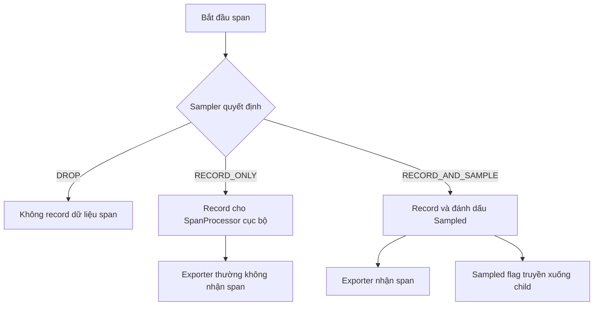
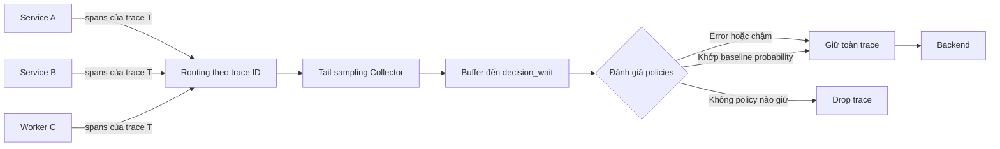

<Callout type="info" title="Ý tưởng cốt lõi">
  Sampling chọn một phần trace để xử lý và lưu trữ. Head sampling quyết định sớm,
  ít tốn tài nguyên; tail sampling đợi thêm span để giữ có chủ đích các trace lỗi,
  chậm hoặc hiếm. Mọi chiến lược đều đánh đổi dữ liệu lấy chi phí, vì vậy phải đo
  tỷ lệ thực tế và kiểm tra trace có còn đầy đủ hay không.
</Callout>

## Mục lục

- [Sampling giải quyết vấn đề gì](#sampling-giải-quyết-vấn-đề-gì)
  - [Ví dụ về lưu lượng và ngân sách](#ví-dụ-về-lưu-lượng-và-ngân-sách)
- [Sampling quyết định điều gì](#sampling-quyết-định-điều-gì)
  - [Ba quyết định của Sampler](#ba-quyết-định-của-sampler)
  - [Recorded và sampled không đồng nghĩa](#recorded-và-sampled-không-đồng-nghĩa)
  - [Sampled flag được truyền sang service sau](#sampled-flag-được-truyền-sang-service-sau)
- [Head sampling](#head-sampling)
  - [Hành vi ParentBased](#hành-vi-parentbased)
  - [Probability sampling và tính nhất quán](#probability-sampling-và-tính-nhất-quán)
  - [Cấu hình SDK bằng biến môi trường](#cấu-hình-sdk-bằng-biến-môi-trường)
- [Tail sampling](#tail-sampling)
  - [Vì sao tail sampler cần nhìn toàn trace](#vì-sao-tail-sampler-cần-nhìn-toàn-trace)
  - [Cấu hình Collector](#cấu-hình-collector)
  - [Độ trễ bộ nhớ và late spans](#độ-trễ-bộ-nhớ-và-late-spans)
  - [Mở rộng nhiều Collector](#mở-rộng-nhiều-collector)
- [So sánh head sampling và tail sampling](#so-sánh-head-sampling-và-tail-sampling)
- [Thiết kế chiến lược sampling](#thiết-kế-chiến-lược-sampling)
  - [Chọn tỷ lệ ban đầu](#chọn-tỷ-lệ-ban-đầu)
  - [Giữ error và trace hiếm mà không làm sai thống kê](#giữ-error-và-trace-hiếm-mà-không-làm-sai-thống-kê)
  - [Sampling không thay thế metrics](#sampling-không-thay-thế-metrics)
  - [Kiểm soát chi phí và dữ liệu nhạy cảm](#kiểm-soát-chi-phí-và-dữ-liệu-nhạy-cảm)
- [Cách kiểm chứng](#cách-kiểm-chứng)
  - [Kiểm tra head sampling](#kiểm-tra-head-sampling)
  - [Kiểm tra tail sampling](#kiểm-tra-tail-sampling)
  - [Triển khai an toàn](#triển-khai-an-toàn)
- [Failure modes thường gặp](#failure-modes-thường-gặp)
- [Checklist vận hành](#checklist-vận-hành)
- [Trang liên quan](#trang-liên-quan)
- [Tham khảo chính thức](#tham-khảo-chính-thức)

## Sampling giải quyết vấn đề gì

Một request có thể tạo span ở API gateway, nhiều service, database và message
queue. Khi lưu lượng tăng, số span làm tăng CPU của SDK, băng thông OTLP, bộ nhớ
Collector, dung lượng backend và chi phí truy vấn. Sampling giảm lượng trace đi
đến các bước sau bằng cách chỉ giữ một tập con.

Mục tiêu không đơn thuần là “drop 95% dữ liệu”. Mẫu cần trả lời được câu hỏi vận
hành đã chọn, chẳng hạn:

- Luồng request bình thường đi qua những service nào?
- Trace nào có lỗi hoặc latency cao?
- Một deployment mới có tạo ra hành vi hiếm không?
- Backend và Collector có nằm trong ngân sách ingest hay không?

Sampling xác suất đồng đều có thể tạo một mẫu đại diện cho traffic phổ biến.
Ngược lại, policy “giữ mọi error” cố ý làm mẫu thiên lệch về lỗi để phục vụ debug.
Hai loại dữ liệu này có mục đích khác nhau và không nên được diễn giải giống nhau.

### Ví dụ về lưu lượng và ngân sách

Giả sử hệ thống nhận `20.000` trace mới mỗi giây và mỗi trace có trung bình `12`
span:

```text
20.000 trace/s × 12 span/trace = 240.000 span/s
240.000 span/s × 5%            =  12.000 span/s kỳ vọng được giữ
```

Head sampling xác suất `5%` làm giảm khoảng `95%` số span gửi đi, nếu kích thước
trace được giữ tương tự phần còn lại. Đây là kỳ vọng thống kê, không phải quota
cứng: trong một cửa sổ ngắn, kết quả có thể cao hoặc thấp hơn `5%`.

Nếu chỉ có `10` trace lỗi mỗi phút và sampling đồng đều `1%`, số trace lỗi được
giữ kỳ vọng chỉ là `0,1` mỗi phút. Xác suất không thấy trace lỗi nào trong một
phút là `0,99^10 ≈ 90,4%`. Vì vậy, một tỷ lệ tốt cho traffic phổ biến vẫn có thể
rất kém cho sự kiện hiếm.

<Callout type="idea" title="Takeaway">
  Chọn sampling theo câu hỏi cần trả lời và ngân sách, không chỉ theo tổng request.
  Traffic phổ biến phù hợp với xác suất; lỗi và trường hợp hiếm thường cần policy riêng.
</Callout>

## Sampling quyết định điều gì

Trong SDK, `Sampler` được gọi khi một span bắt đầu. Lúc này sampler chỉ có context
cha, trace ID, tên và kind của span, các attribute ban đầu và links ban đầu. Nó
không thể biết latency cuối cùng, status được đặt sau đó hay event sẽ xuất hiện
trong tương lai.



### Ba quyết định của Sampler

Theo Trace SDK specification, `SamplingResult` có đúng ba loại decision:

| Decision | `IsRecording` | `Sampled` flag | SpanProcessor nhận? | SpanExporter nhận? |
| --- | --- | --- | --- | --- |
| `DROP` | `false` | `false` | Không | Không |
| `RECORD_ONLY` | `true` | `false` | Có | Theo spec, exporter không nên nhận |
| `RECORD_AND_SAMPLE` | `true` | `true` | Có | Có |

- **Recording** nghĩa là span đang giữ attributes, events và status trong bộ nhớ
  để processor có thể xử lý.
- **Sampled** nghĩa là span được chọn để export và cờ quyết định này có thể được
  truyền sang span con.
- Tổ hợp `IsRecording=false` nhưng `Sampled=true` bị cấm vì có thể tạo lỗ hổng
  trong distributed trace.

`RECORD_ONLY` hữu ích khi processor cục bộ cần quan sát span mà không gửi span đó
đến trace backend. Tuy nhiên, đừng giả định `RECORD_ONLY` sẽ đưa dữ liệu tới tail
sampler bên ngoài process: SpanExporter theo spec không nên nhận span chưa được
đánh dấu sampled.

### Recorded và sampled không đồng nghĩa

Instrumentation nên dùng `IsRecording()` để tránh tính attribute đắt đỏ khi span
không record. Code ứng dụng không nên đọc sampled flag để thay đổi business logic.
Một request không được sample vẫn phải được xử lý giống hệt request được sample.

Giá trị recording của span con được quyết định độc lập khi span con bắt đầu.
Trong cấu hình `ParentBased` mặc định, sampled flag của parent thường dẫn đến cùng
quyết định ở child. Điều đó giữ trace đầy đủ, nhưng đây là hành vi của sampler chứ
không phải hệ quả trực tiếp của `IsRecording` trên parent.

### Sampled flag được truyền sang service sau

Với W3C Trace Context, bit sampled nằm trong `trace-flags` của `traceparent`:

```text
00-4bf92f3577b34da6a3ce929d0e0e4736-00f067aa0ba902b7-01
                                                       └─ 01: sampled
```

Propagator inject flag này vào request; service nhận extract nó vào remote parent
context. `ParentBased` có thể dùng flag đó để quyết định cho server span và các
child span tiếp theo. Nếu propagation bị mất hoặc mỗi service dùng sampler không
tương thích, một trace có thể chỉ còn vài span rời rạc.

Sampled flag là tín hiệu thu thập, không phải bằng chứng caller đáng tin cậy. Một
client bên ngoài có thể tự gửi `traceparent` với flag sampled. Ở trust boundary,
hãy cân nhắc bắt đầu trace mới hoặc cấu hình nhánh `remoteParentSampled` phù hợp
thay vì cho traffic công khai ép hệ thống record mọi span. Không tự sửa chuỗi
`traceparent`; hãy dùng propagator và API của SDK.

## Head sampling

**Head sampling** quyết định sớm, thường tại thời điểm SDK tạo root span. Vì chưa
thấy phần “đuôi” của trace, nó không thể đảm bảo giữ mọi trace mà một child span
sau đó báo lỗi hoặc trace cuối cùng vượt ngưỡng latency.

Head sampling có ba lợi thế chính:

- giảm CPU, allocation và băng thông gần nguồn;
- không cần giữ state của toàn trace trong Collector;
- dễ dự đoán và dễ vận hành khi dùng một tỷ lệ xác suất ổn định.

Điểm yếu là bias theo thông tin có sẵn lúc bắt đầu. Một sampler dựa trên
`http.route` chỉ hoạt động nếu route được truyền như attribute ngay khi tạo span,
không phải được thêm sau đó.

### Hành vi ParentBased

`ParentBased` là một decorator: nó chọn sampler con dựa trên việc parent có tồn
tại, là local hay remote, và có sampled flag hay không.

| Parent | Nhánh được gọi theo spec | Mặc định |
| --- | --- | --- |
| Không có parent | `root` | Bắt buộc cấu hình; mặc định toàn SDK là `AlwaysOn` |
| Remote, sampled | `remoteParentSampled` | `AlwaysOn` |
| Remote, không sampled | `remoteParentNotSampled` | `AlwaysOff` |
| Local, sampled | `localParentSampled` | `AlwaysOn` |
| Local, không sampled | `localParentNotSampled` | `AlwaysOff` |

Ví dụ, `ParentBased(root=TraceIdRatioBased(0.05))` chọn khoảng `5%` root trace.
Các child mặc định làm theo sampled flag của parent. Toàn bộ cây vì thế thường
được giữ hoặc bỏ cùng nhau.

<Callout type="warn" title="Không cấu hình tỷ lệ độc lập ở mọi service">
  Nếu mỗi service chạy một ratio sampler độc lập cho child span, quyết định có
  thể khác parent và tạo broken trace. Cách an toàn phổ biến là chỉ lấy mẫu xác
  suất ở root, rồi dùng `ParentBased` cho child.
</Callout>

### Probability sampling và tính nhất quán

Probability sampling chọn trace theo một xác suất `p`. “Consistent” nghĩa là các
participant dùng cùng randomness và threshold để không đưa ra quyết định mâu
thuẫn; với cơ chế mới, quyết định có dạng `R >= T`. OpenTelemetry có thể truyền
randomness và rejection threshold qua phần `ot` của `tracestate` bằng các sub-key
`rv` và `th`.

Trạng thái specification hiện hành cần được hiểu rõ:

- Tài liệu **TraceState Probability Sampling** đang ở trạng thái **Development**.
- `ProbabilitySampler`, `CompositeSampler` và các composable sampler trong Trace
  SDK specification cũng đang ở trạng thái **Development**.
- `TraceIdRatioBased` có API và cấu hình stable, nhưng đã được đánh dấu deprecated
  để chuyển sang `ProbabilitySampler`. Spec yêu cầu chưa loại bỏ hoặc đổi hành vi
  cũ trước ngày 1 tháng 1 năm 2027.
- Thuật toán chính xác của `TraceIdRatioBased` trước đây không được chuẩn hóa đủ để
  đảm bảo tương thích giữa mọi ngôn ngữ hoặc mọi phiên bản SDK. Spec khuyến nghị
  chỉ dùng nó cho root span bên trong `ParentBased` trong giai đoạn chuyển đổi.
- Hỗ trợ W3C Trace Context Level 2, random flag và sampler mới khác nhau theo SDK.
  Không nên giả định toàn bộ hệ thống đã hỗ trợ chỉ vì một service hỗ trợ.

Nói ngắn gọn: cấu hình portable hiện tại vẫn thường dùng
`parentbased_traceidratio`. Hãy pin phiên bản SDK, kiểm tra support matrix và test
trace đa ngôn ngữ trước khi dựa vào `rv`, `th` hoặc adjusted count. Đừng gọi một
pipeline là “consistent probability sampling end-to-end” nếu chưa kiểm chứng mọi
SDK và Collector trong đường đi.

### Cấu hình SDK bằng biến môi trường

Ví dụ vendor-neutral sau dùng biến môi trường chuẩn của OpenTelemetry SDK để lấy
mẫu `5%` root trace và cho child làm theo parent:

```bash
export OTEL_TRACES_SAMPLER=parentbased_traceidratio
export OTEL_TRACES_SAMPLER_ARG=0.05
```

Giá trị ratio nằm trong khoảng `0` đến `1`; `0.05` nghĩa là xác suất `5%`.
Mặc định chuẩn của SDK configuration là `parentbased_always_on`, nhưng mức hỗ trợ
biến môi trường vẫn khác nhau giữa các ngôn ngữ. Hãy kiểm tra tài liệu của SDK
đang dùng và log description của sampler khi process khởi động.

Khi cần tail sampling ở Collector và muốn Collector nhìn thấy mọi span, cấu hình
thường dùng ở SDK là:

```bash
export OTEL_TRACES_SAMPLER=parentbased_always_on
```

Cấu hình này đẩy chi phí network và Collector lên trước khi tail sampler drop dữ
liệu. Nếu upstream SDK đã `DROP` một trace, Collector không thể khôi phục trace đó.
Kết hợp head sampling trước tail sampling chỉ nên làm khi chấp nhận rằng tail
policy không còn nhìn thấy error hoặc rare trace đã bị head sampler loại.

## Tail sampling

**Tail sampling** trì hoãn quyết định cho đến khi đã nhận tất cả hoặc phần lớn
span của một trace. Nó có thể giữ trace nếu bất kỳ span nào có status `ERROR`, nếu
thời lượng trace vượt ngưỡng, hoặc nếu một attribute quan trọng xuất hiện ở một
service downstream.

### Vì sao tail sampler cần nhìn toàn trace



Nếu span của trace `T` bị chia cho hai Collector, mỗi instance chỉ thấy một phần
sự thật. Instance thứ nhất có thể không thấy error ở Service B; instance thứ hai
có thể không thấy root span và tính duration sai. Vì vậy, mọi span cùng trace ID
phải đến cùng một tail-sampling Collector.

“Nhìn toàn trace” trong thực tế là cố gắng thu thập đủ span trước deadline. Hệ
thống phân tán không có tín hiệu hoàn tất tuyệt đối cho mọi trace; `decision_wait`
là một cửa sổ chờ. Span đến sau cửa sổ vẫn là late span.

### Cấu hình Collector

Ví dụ sau cần bản phân phối Collector có component `tail_sampling`, như
`otelcol-contrib`. Nó giữ mọi trace có span status `ERROR`, giữ trace có duration
từ `2.000 ms`, rồi lấy mẫu xác suất `5%` cho traffic còn lại:

```yaml
receivers:
  otlp:
    protocols:
      grpc:
        endpoint: 0.0.0.0:4317
      http:
        endpoint: 0.0.0.0:4318

processors:
  tail_sampling:
    decision_wait: 30s
    num_traces: 100000
    expected_new_traces_per_sec: 2000
    decision_cache:
      sampled_cache_size: 1000000
      non_sampled_cache_size: 1000000
    policies:
      - name: keep-errors
        type: status_code
        status_code:
          status_codes: [ERROR]
      - name: keep-slow-traces
        type: latency
        latency:
          threshold_ms: 2000
      - name: baseline-five-percent
        type: probabilistic
        probabilistic:
          sampling_percentage: 5
  batch: {}

exporters:
  otlp:
    endpoint: telemetry-backend.example:4317
    tls:
      insecure: false

service:
  pipelines:
    traces:
      receivers: [otlp]
      processors: [tail_sampling, batch]
      exporters: [otlp]
```

`latency` ở đây là khoảng từ start time sớm nhất đến end time muộn nhất trong các
span đã tích lũy, không phải tổng duration của từng span. Policy `status_code`
chỉ thấy lỗi nếu instrumentation thực sự đặt span status thành `ERROR`; đừng giả
định mọi HTTP `5xx` tự động có status đúng trong mọi instrumentation.

Các top-level policy không phải danh sách firewall “rule đầu tiên thắng”. Theo
flow hiện hành, một quyết định sample có thể giữ trace, trong khi một `drop`
policy có thể loại trace dù policy khác muốn giữ. `composite` có
`policy_order` riêng, còn `sample_on_first_match` thay đổi thời điểm chốt quyết
định. Vì vậy, thêm policy mới phải đi kèm test cho tổ hợp match, không chỉ test
từng policy riêng lẻ.

<Callout type="warn" title="Kiểm tra phiên bản Collector">
  `tail_sampling` là processor thuộc Collector Contrib và trace support hiện ở
  mức beta. Schema, feature gate và metrics có thể thay đổi giữa các bản phát
  hành. Pin image version và chạy kiểm tra cấu hình của đúng binary trước khi deploy.
</Callout>

### Độ trễ bộ nhớ và late spans

Tail sampler đổi chi phí lưu backend thành chi phí stateful ở Collector:

- `decision_wait` dài hơn cho trace chậm nhiều cơ hội hoàn tất hơn, nhưng tăng
  latency trước export và số trace phải giữ đồng thời.
- `num_traces` quá nhỏ làm trace cũ bị loại trước khi đến lúc quyết định.
- Trace có nhiều span hoặc attribute lớn tiêu thụ bộ nhớ nhiều hơn trace nhỏ; chỉ
  đếm trace chưa đủ để sizing heap.
- Burst traffic làm số trace đang chờ tăng nhanh dù traffic trung bình vẫn thấp.
- Late span không còn ảnh hưởng quyết định đã chốt. Decision cache giúp áp lại
  quyết định cũ, nhưng không biến late span thành dữ liệu đã có lúc đánh giá.

Một ước lượng khởi đầu cho số trace đồng thời là:

```text
new traces/s × decision_wait
= 2.000 × 30
= 60.000 trace đang chờ
```

`num_traces: 100000` trong ví dụ tạo headroom khoảng `1,67×` cho con số đó. Đây
chỉ là điểm xuất phát. Hãy đo burst, số span mỗi trace, kích thước span và RSS của
Collector. Tăng `decision_wait` mà không tăng capacity có thể làm nhiều trace bị
evict sớm hơn.

Theo dõi ít nhất các internal metrics của processor:

- `otelcol_processor_tail_sampling_sampling_trace_dropped_too_early`;
- `otelcol_processor_tail_sampling_sampling_trace_removal_age`;
- `otelcol_processor_tail_sampling_sampling_decision_timer_latency`;
- `otelcol_processor_tail_sampling_sampling_late_span_age`;
- `otelcol_processor_tail_sampling_global_count_traces_sampled`.

Tên và availability của metric phụ thuộc phiên bản component. Đối chiếu
`documentation.md` đi cùng đúng bản Collector đã pin.

### Mở rộng nhiều Collector

Round-robin theo batch không tạo **stickiness** — tính bám dính của một trace vào
một instance. Mô hình phổ biến dùng hai lớp:

```text
Ứng dụng
   │ OTLP
   ▼
Gateway Collector: consistent routing theo trace ID
   │
   ├──────────────► Tail Collector 1 ──┐
   ├──────────────► Tail Collector 2 ──┼──► Backend
   └──────────────► Tail Collector N ──┘
```

Collector Contrib có `load_balancing` exporter. Với traces, `routing_key:
traceID` đưa cùng trace ID về cùng backend trong danh sách đang biết:

```yaml
exporters:
  load_balancing:
    routing_key: traceID
    protocol:
      otlp:
        tls:
          insecure: false
    resolver:
      dns:
        hostname: tail-sampling-collectors.observability.svc.cluster.local
        port: 4317
        interval: 5s
```

Mọi gateway router phải nhìn thấy cùng danh sách endpoint. Khi scale up, scale
down hoặc DNS chưa hội tụ, consistent-hash ring thay đổi và một trace đang chạy
có thể bị route sang instance khác. Vì thế cần rollout có kiểm soát, retry/queue
phù hợp và theo dõi broken trace trong lúc topology thay đổi. Tách lớp routing và
lớp tail sampling cũng giúp cô lập failure tốt hơn so với ghép cả hai vai trò vào
một pool.

## So sánh head sampling và tail sampling

| Tiêu chí | Head sampling | Tail sampling |
| --- | --- | --- |
| Thời điểm quyết định | Khi span bắt đầu, thường ở root | Sau khi nhận phần lớn hoặc toàn trace |
| Thông tin dùng được | Parent context, trace ID, tên, kind, initial attributes, initial links | Status, attributes và timing của nhiều span đã đến |
| Giữ mọi trace lỗi | Không thể đảm bảo nếu lỗi xuất hiện sau quyết định | Có thể, nếu span lỗi đến trước quyết định và đặt status/attribute đúng |
| Chi phí gần ứng dụng | Thấp hơn vì drop sớm | Thường cao hơn vì SDK phải export dữ liệu tới sampler |
| State trong Collector | Không cần tập hợp toàn trace | Cần buffer theo trace ID |
| Latency tới backend | Thấp | Tăng theo thời gian chờ trong mô hình trace-complete |
| Scale ngang | Đơn giản hơn | Cần routing sticky theo trace ID |
| Nguy cơ chính | Bỏ lỡ lỗi hoặc trace hiếm | Memory pressure, late spans, split routing và policy phức tạp |
| Trường hợp phù hợp | Baseline đại diện, tải rất lớn, vận hành đơn giản | Debug lỗi, chậm hoặc hiếm với ngân sách lưu trữ có hạn |

Không nhất thiết phải chọn duy nhất một loại. Một số hệ thống head-sample trước để
bảo vệ pipeline rồi tail-sample phần còn lại. Đổi lại, tail sampler chỉ có thể
chọn trong tập con đã sống sót. Takeaway: nếu yêu cầu là “giữ mọi error”, không
được head-drop dữ liệu trước nơi đánh giá error.

## Thiết kế chiến lược sampling

### Chọn tỷ lệ ban đầu

Bắt đầu từ constraint đo được thay vì chọn `1%` theo thói quen:

1. Đo traces/s, spans/trace, byte/span và traffic theo từng service hoặc route.
2. Xác định giới hạn spans/s hoặc bytes/s của Collector và backend.
3. Dành ngân sách riêng cho error, latency cao và use case điều tra bảo mật.
4. Dùng phần ngân sách còn lại làm baseline probability cho traffic bình thường.
5. Chạy shadow hoặc canary, đo tỷ lệ sample thực tế rồi điều chỉnh.

Ví dụ backend cho phép `15.000 span/s`. Error và slow policies dùng khoảng `3.000
span/s`, còn lại `12.000 span/s`. Nếu baseline bình thường tạo `240.000 span/s`,
tỷ lệ khởi đầu là:

```text
12.000 / 240.000 = 0,05 = 5%
```

Đây không phải guarantee vì trace có kích thước khác nhau và số error thay đổi.
Nếu cần trần cứng, kết hợp capacity protection phù hợp và quyết định rõ hệ thống
sẽ fail-open hay fail-closed khi quá tải. Một rate limit theo số span cũng có thể
ưu tiên sai trace lớn; hãy đo theo cả span và byte.

### Giữ error và trace hiếm mà không làm sai thống kê

Tail policy giữ mọi error làm tập trace hữu ích hơn cho debug nhưng tạo
**selection bias** — xác suất xuất hiện trong mẫu phụ thuộc vào kết quả của
request. Vì vậy:

- Không lấy `error traces / all sampled traces` làm error rate của production.
- Giữ một baseline xác suất độc lập cho traffic bình thường để quan sát topology
  và regression phổ biến.
- Tách nhãn hoặc ghi lại policy đã giữ trace nếu component/backend hỗ trợ, nhờ đó
  analyst biết mẫu đến từ policy nào.
- Test route ít traffic, tenant quan trọng và deployment canary riêng; một tỷ lệ
  chung có thể bỏ lỡ toàn bộ nhóm nhỏ.
- Nếu dùng adjusted count, chỉ ngoại suy khi sampling probability được truyền và
  đánh dấu là reliable end-to-end. Policy giữ error có điều kiện thường không
  cung cấp mẫu đồng đều để ngoại suy đơn giản.

Nói ngắn gọn: mẫu tối ưu cho điều tra không nhất thiết là mẫu hợp lệ cho thống kê.
Dùng trace để xem “vì sao”; dùng metric phù hợp để đo “bao nhiêu”.

### Sampling không thay thế metrics

Metrics được aggregate theo thời gian và phù hợp cho request count, error rate,
latency histogram, SLI và alert. Trace sampling không bảo đảm giữ đúng tổng số
request hoặc đúng phân phối của một nhóm hiếm.

Metrics native từ Metrics SDK có pipeline và sampling semantics riêng; trace bị
drop không đồng nghĩa metric phải bị drop. Nếu tạo metrics từ spans, hãy đặt
span-to-metrics trước nơi drop cần thiết hoặc dùng cơ chế probability/adjusted
count đã được implementation hỗ trợ và kiểm chứng. `RECORD_ONLY` có thể cho
processor trong SDK thấy span, nhưng exporter bên ngoài thường không nhận span đó.

<Callout type="idea" title="Quy tắc thực dụng">
  Alert và SLO dựa trên metrics. Dùng exemplars hoặc trace ID để nhảy từ điểm dữ
  liệu bất thường sang trace. Dùng sampled traces để phân tích đường đi chi tiết.
</Callout>

### Kiểm soát chi phí và dữ liệu nhạy cảm

Sampling giảm lượng dữ liệu lưu, nhưng không tự redaction. Một sampled trace vẫn
có thể chứa token, PII hoặc payload nhạy cảm. Hãy loại dữ liệu cấm trước khi
export và trước khi attribute đó được policy sử dụng.

Các attribute như `app.force_sample=true` là một cost-control boundary. Nếu user
bên ngoài có thể điều khiển chúng, attacker có thể ép giữ traffic lớn. Chỉ cho
phép trusted instrumentation đặt override, giới hạn kích thước trace và theo dõi
cardinality. Tail sampler cũng là mục tiêu resource exhaustion: trace kéo dài,
nhiều span hoặc span quá lớn có thể chiếm buffer cho đến deadline.

## Cách kiểm chứng

### Kiểm tra head sampling

Tạo traffic có số lượng biết trước và kiểm tra theo ba lớp:

1. **Propagation:** capture request ở boundary và xác nhận `traceparent` giữ cùng
   trace ID; sampled flag của child phù hợp parent.
2. **Completeness:** trace được giữ phải có root và các child dự kiến. Đếm orphan
   span và trace thiếu service.
3. **Tỷ lệ:** với `n=10.000` root trace và `p=5%`, kỳ vọng là `500`. Độ lệch chuẩn
   nhị thức xấp xỉ `sqrt(10000 × 0,05 × 0,95) ≈ 21,8`; khoảng `456–544` là một
   kiểm tra 95% gần đúng, không phải SLO cứng.

Chạy lại test qua mọi cặp ngôn ngữ SDK trong hệ thống. Cùng cấu hình tên gọi
không đủ để chứng minh thuật toán legacy tương thích.

### Kiểm tra tail sampling

Tạo các trace tổng hợp có kết quả dự đoán được:

| Ca kiểm thử | Dữ liệu tạo ra | Kỳ vọng |
| --- | --- | --- |
| Error | Một child span có status `ERROR` | Toàn trace được giữ |
| Slow | Start sớm nhất và end muộn nhất cách nhau hơn `2 s` | Toàn trace được giữ |
| Normal | Không error, dưới `2 s` | Khoảng `5%` được giữ trên tập lớn |
| Late span | Gửi child sau `decision_wait` | Metric late span tăng; quyết định cũ không bị viết lại |
| Split routing | Gửi cùng trace ID qua nhiều gateway | Tất cả span vẫn tới cùng tail Collector |
| Pressure | Burst vượt sizing dự kiến | Không tăng drop-too-early ngoài ngưỡng đã đặt |

Đồng thời kiểm tra log evaluation error, RSS/heap, queue, export failures và
internal metrics. Backend “có trace” chưa chứng minh policy đúng: cần xác nhận cả
trace đáng lẽ giữ lẫn trace đáng lẽ drop.

### Triển khai an toàn

- Pin phiên bản SDK và Collector; validate cấu hình bằng đúng binary sẽ deploy.
- Canary một phần traffic, so sánh ingest cost và độ đầy đủ của trace với control.
- Giữ dashboard metrics độc lập trước khi thay đổi sampling.
- Rollout router và tail-sampler pool sao cho danh sách backend hội tụ ổn định.
- Chờ ít nhất `decision_wait` cộng thời gian retry trước khi kết luận sau thay đổi.
- Chuẩn bị rollback về sampler và policy cũ; không đổi ratio, policy và topology
  cùng lúc nếu muốn xác định nguyên nhân.

## Failure modes thường gặp

| Triệu chứng | Nguyên nhân thường gặp | Cách xử lý |
| --- | --- | --- |
| Trace thiếu ngẫu nhiên một service | Context propagation đứt hoặc service dùng sampler child độc lập | Kiểm tra `traceparent`; dùng `ParentBased`; test từng boundary |
| Tail sampler không thấy error | SDK đã head-drop trace, span lỗi đến muộn hoặc status không phải `ERROR` | Export đủ dữ liệu tới tail sampler; tăng wait có kiểm soát; sửa instrumentation |
| Hai nửa trace có quyết định khác nhau | Load balancing theo batch hoặc hash ring thay đổi | Route theo trace ID; đồng bộ endpoint list; theo dõi lúc scale |
| Memory Collector tăng cao | `decision_wait`, trace rate, span count hoặc span size lớn | Sizing lại `num_traces`; giảm wait nếu chấp nhận late spans; giới hạn trace bất thường |
| `dropped_too_early` tăng | Buffer chứa nhiều trace hơn `num_traces` hoặc decision quá chậm | Tăng capacity; giảm input; tối ưu policy và downstream exporter |
| Late span tạo broken trace | Quyết định bị evict khỏi cache hoặc span đến sau deadline | Tăng decision cache hoặc wait dựa trên histogram lateness; sửa queue upstream |
| Error rate từ traces cao bất thường | Policy giữ 100% error nhưng chỉ giữ ít normal trace | Không tính rate từ mẫu thiên lệch; dùng metrics |
| Thêm drop policy làm mất trace quan trọng | Hiểu policy list như first-match hoặc không test tổ hợp | Test truth table; nhớ drop có thể thắng sample; xem `sample_on_first_match` |
| Tỷ lệ thực tế khác cấu hình | Cửa sổ quá nhỏ, trace size khác nhau, nhiều policy cùng match | Đo root trace ở cửa sổ đủ lớn; tách theo policy và byte/span |
| Public traffic làm tăng chi phí | Tin sampled flag hoặc force-sample attribute không tin cậy | Áp trust-boundary policy; allowlist override; rate và size limit |
| Tail sampler restart làm mất trace đang chờ | State mặc định nằm trong memory | Rollout có drain; hiểu shutdown behavior; đánh giá storage extension theo phiên bản |

<Callout type="warn" title="Broken trace không chỉ là vấn đề hiển thị">
  Trace thiếu span có thể làm latency tổng, critical path và kết luận về service
  gây lỗi bị sai. Theo dõi completeness như một data-quality SLI, không chỉ nhìn
  số trace đã ingest.
</Callout>

## Checklist vận hành

- [ ] Xác định câu hỏi nào dùng metrics và câu hỏi nào dùng sampled traces.
- [ ] Biết root sampler, child behavior và default sampler của mọi service.
- [ ] Kiểm tra sampled flag qua HTTP, RPC và message queue boundaries.
- [ ] Không head-drop trước tail sampler nếu yêu cầu giữ mọi error.
- [ ] Tính `trace rate × decision_wait` và thêm headroom cho burst.
- [ ] Route toàn bộ span cùng trace ID đến cùng tail Collector.
- [ ] Test policy combinations, đặc biệt `drop`, `composite` và first-match.
- [ ] Theo dõi late spans, early eviction, decision latency, memory và tỷ lệ giữ.
- [ ] Không suy error rate trực tiếp từ tập trace được ưu tiên theo error.
- [ ] Redact dữ liệu nhạy cảm và bảo vệ force-sample controls.
- [ ] Pin version, canary và có kế hoạch rollback.

## Trang liên quan

<Cards>
  <Card title="Traces" href="/signals/traces/" description="Mental model về trace và quan hệ parent-child." />
  <Card title="Spans" href="/signals/spans/" description="Status, attributes, events và timing dùng trong sampling policy." />
  <Card title="Context propagation" href="/fundamentals/context-propagation/" description="Cách trace ID và sampled flag đi qua service boundaries." />
  <Card title="Collector processors" href="/collector/processors/" description="Vị trí và vai trò của processor trong telemetry pipeline." />
</Cards>

## Tham khảo chính thức

- [OpenTelemetry Docs — Sampling](https://opentelemetry.io/docs/concepts/sampling/)
- [OpenTelemetry Specification — Trace SDK Sampling](https://opentelemetry.io/docs/specs/otel/trace/sdk/#sampling)
- [OpenTelemetry Specification — Trace API và `IsRecording`](https://opentelemetry.io/docs/specs/otel/trace/api/#isrecording)
- [OpenTelemetry Specification — TraceState Probability Sampling](https://opentelemetry.io/docs/specs/otel/trace/tracestate-probability-sampling/)
- [OpenTelemetry SDK Configuration — `OTEL_TRACES_SAMPLER`](https://opentelemetry.io/docs/languages/sdk-configuration/general/#otel_traces_sampler)
- [OpenTelemetry Collector Contrib — Tail Sampling Processor](https://github.com/open-telemetry/opentelemetry-collector-contrib/tree/main/processor/tailsamplingprocessor)
- [OpenTelemetry Collector Contrib — Load Balancing Exporter](https://github.com/open-telemetry/opentelemetry-collector-contrib/tree/main/exporter/loadbalancingexporter)
- [W3C Trace Context Level 2 — Sampled flag](https://www.w3.org/TR/trace-context-2/#sampled-flag)
