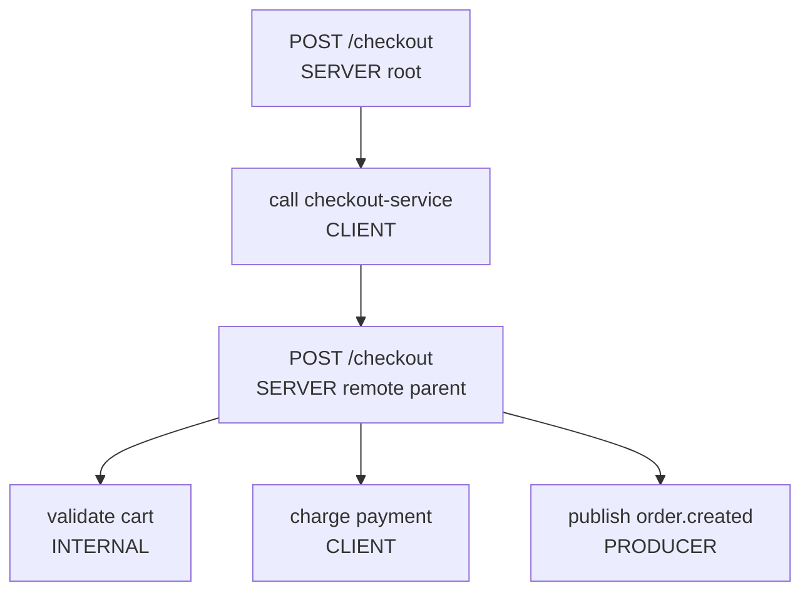
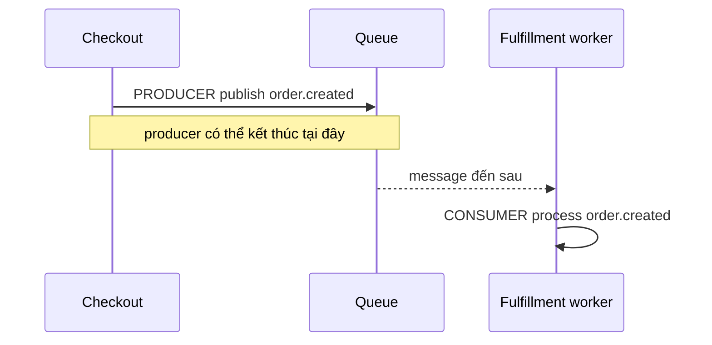
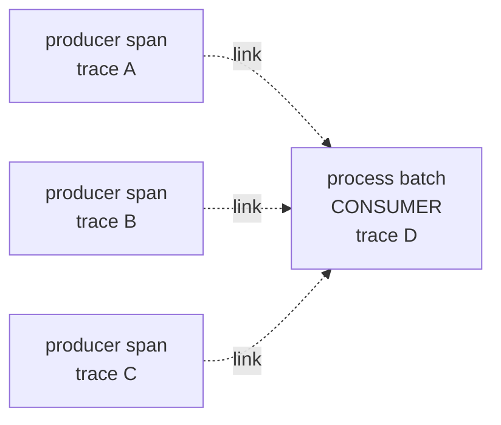
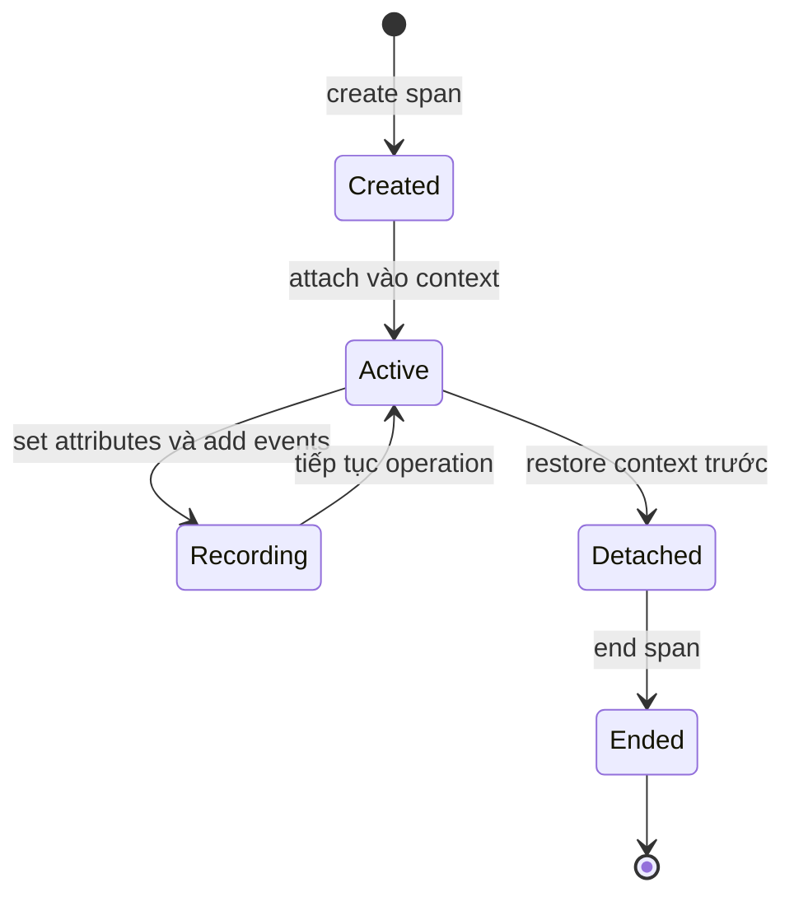
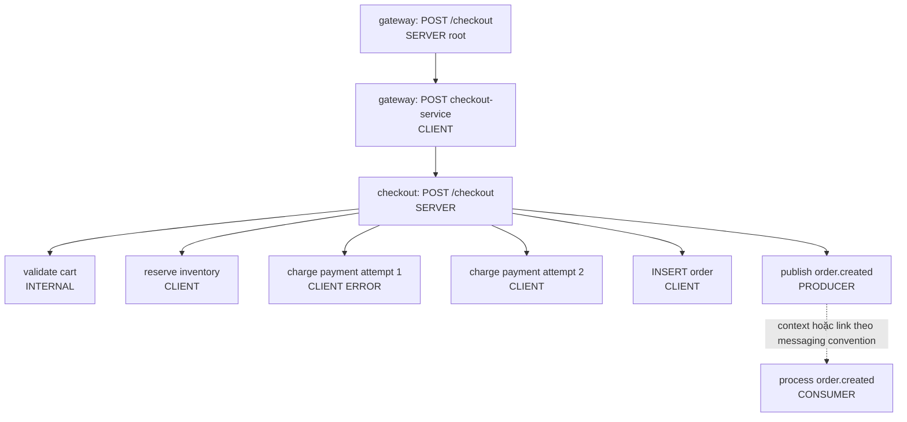

<Callout type="info" title="Mental model">
  **Span là bản ghi của một operation có điểm bắt đầu và kết thúc.** Trace là
  toàn bộ đường đi; span là từng bước có ý nghĩa trên đường đi đó. Hãy tạo span
  để trả lời câu hỏi về latency, lỗi hoặc dependency, không phải để sao chép mọi
  function call của ứng dụng.
</Callout>

## Mục lục

- [Span là một operation](#span-là-một-operation)
  - [Span khác trace như thế nào](#span-khác-trace-như-thế-nào)
  - [Một span chứa những gì](#một-span-chứa-những-gì)
- [SpanContext giữ định danh cho propagation](#spancontext-giữ-định-danh-cho-propagation)
  - [Năm thành phần cần biết](#năm-thành-phần-cần-biết)
  - [Local context và remote context](#local-context-và-remote-context)
- [Tên thời gian và quan hệ cha con](#tên-thời-gian-và-quan-hệ-cha-con)
  - [Name start end và duration](#name-start-end-và-duration)
  - [Root span và child span](#root-span-và-child-span)
- [Năm loại SpanKind](#năm-loại-spankind)
  - [INTERNAL](#internal)
  - [SERVER và CLIENT](#server-và-client)
  - [PRODUCER và CONSUMER](#producer-và-consumer)
- [Attributes và semantic conventions](#attributes-và-semantic-conventions)
  - [Đặt attributes ở đâu và khi nào](#đặt-attributes-ở-đâu-và-khi-nào)
  - [Kiểm soát cardinality và dữ liệu nhạy cảm](#kiểm-soát-cardinality-và-dữ-liệu-nhạy-cảm)
- [Events ghi lại thời điểm đáng chú ý](#events-ghi-lại-thời-điểm-đáng-chú-ý)
- [Links biểu diễn quan hệ ngoài cây](#links-biểu-diễn-quan-hệ-ngoài-cây)
  - [Queue và batch processing](#queue-và-batch-processing)
  - [Chọn event child span hay link](#chọn-event-child-span-hay-link)
- [Status và exception](#status-và-exception)
  - [UNSET OK và ERROR](#unset-ok-và-error)
  - [Ghi exception đúng cách](#ghi-exception-đúng-cách)
- [Ba lớp metadata không nên trộn lẫn](#ba-lớp-metadata-không-nên-trộn-lẫn)
  - [Resource](#resource)
  - [Instrumentation scope](#instrumentation-scope)
  - [Span attributes](#span-attributes)
- [Lifecycle của một span](#lifecycle-của-một-span)
  - [Create](#create)
  - [Activate](#activate)
  - [Record](#record)
  - [End](#end)
  - [Mẫu instrumentation an toàn](#mẫu-instrumentation-an-toàn)
- [Ví dụ checkout từ đầu đến cuối](#ví-dụ-checkout-từ-đầu-đến-cuối)
  - [Cây operation](#cây-operation)
  - [Đọc từng span](#đọc-từng-span)
  - [Dữ liệu của checkout server span](#dữ-liệu-của-checkout-server-span)
  - [Retry payment và kết quả cuối](#retry-payment-và-kết-quả-cuối)
- [Quy tắc đặt tên và best practices](#quy-tắc-đặt-tên-và-best-practices)
  - [Tên ổn định theo lớp operation](#tên-ổn-định-theo-lớp-operation)
  - [Chỉ tạo span có giá trị quan sát](#chỉ-tạo-span-có-giá-trị-quan-sát)
- [Failure modes thường gặp](#failure-modes-thường-gặp)
- [Checklist xác minh](#checklist-xác-minh)
  - [Kiểm tra cấu trúc span](#kiểm-tra-cấu-trúc-span)
  - [Kiểm tra dữ liệu và pipeline](#kiểm-tra-dữ-liệu-và-pipeline)
- [Nguồn tham khảo chính thức](#nguồn-tham-khảo-chính-thức)
- [Bài liên quan](#bài-liên-quan)

## Span là một operation

Trong OpenTelemetry, **span đại diện cho một operation đơn lẻ trong trace**.
Operation là một công việc có ranh giới rõ ràng, ví dụ:

- nhận và xử lý `POST /checkout`;
- gọi `payment-service`;
- chạy truy vấn ghi order;
- publish message `order.created`;
- xử lý một batch messages từ queue;
- thực hiện bước nghiệp vụ `validate cart`.

Một span tốt cho biết operation nào đã diễn ra, bắt đầu và kết thúc lúc nào, nằm
ở đâu trong causal path, kết quả ra sao và có metadata nào cần để điều tra.
**Causal path** là chuỗi quan hệ nhân quả: operation B xảy ra vì operation A đã
gọi, tạo hoặc lên lịch cho B.

Một function call rất ngắn như `formatCurrency()` thường không cần span. Ngược
lại, một lời gọi database hoặc một bước giữ lock có thể đáng có span vì nó giải
thích latency và failure.

### Span khác trace như thế nào

| Khái niệm | Phạm vi | Ví dụ trong checkout |
| --- | --- | --- |
| Span | Một operation | Một lần gọi `payment-service` |
| Trace | Tập các span có cùng trace ID, mô tả đường đi end-to-end | Toàn bộ request từ gateway đến database và queue |
| SpanContext | Phần định danh và trace state cần truyền qua boundary | Trace ID, span ID, flags và tracestate của outgoing call |

Trang [Traces](/signals/traces/) giải thích cách backend ghép nhiều span thành
cây và cách đọc critical path. Trang này tập trung vào cấu tạo và lifecycle của
**một span**.

### Một span chứa những gì

Một span thường có các trường sau:

| Thành phần | Câu hỏi nó trả lời |
| --- | --- |
| Name | Operation này thuộc lớp công việc nào? |
| SpanContext | Span và trace này được định danh thế nào? |
| Parent | Operation trực tiếp nào dẫn đến operation này? |
| SpanKind | Đây là công việc nội bộ, request vào, call ra hay deferred work? |
| Start và end timestamp | Operation bắt đầu, kết thúc lúc nào? |
| Attributes | Metadata ổn định của operation là gì? |
| Events | Những thời điểm đáng chú ý nào xảy ra trong operation? |
| Links | Operation còn liên quan nhân quả tới context nào ngoài parent? |
| Status | Kết quả đã được đánh dấu UNSET, OK hay ERROR? |

Duration thường được backend tính bằng `end_time - start_time`. Nó mô tả thời
gian trôi qua của operation, không phải luôn là CPU time và cũng không phải tổng
duration của các child spans.

## SpanContext giữ định danh cho propagation

**SpanContext** là phần bất biến của span được dùng để định danh và propagation.
Nó không chứa name, attributes, events hay status. Khi một request đi qua HTTP,
RPC hoặc messaging boundary, propagator serialize phần context cần thiết vào
carrier rồi phía nhận extract nó.

Chi tiết về `traceparent`, inject và extract nằm tại
[Context propagation](/fundamentals/context-propagation/). Ở đây chỉ cần nắm
những field ảnh hưởng trực tiếp đến span.

### Năm thành phần cần biết

| Thành phần | Ý nghĩa | Điều cần nhớ |
| --- | --- | --- |
| Trace ID | Định danh toàn bộ trace | 16 byte; dạng hex có 32 ký tự; không được toàn số `0` |
| Span ID | Định danh span hiện tại | 8 byte; dạng hex có 16 ký tự; không được toàn số `0` |
| Trace flags | Các cờ chung của trace | Có cờ `sampled`; specification hiện hành còn định nghĩa cờ `random` |
| Tracestate | Danh sách key-value dành cho trạng thái theo tracing system | Để SDK và propagator xử lý; không dùng như business metadata |
| Remote | Boolean cho biết context có được nhận từ process khác hay không | Context do propagator extract có `IsRemote = true` |

Ví dụ rút gọn:

```text
SpanContext
├── trace_id:    4bf92f3577b34da6a3ce929d0e0e4736
├── span_id:     00f067aa0ba902b7
├── trace_flags: sampled
├── tracestate:  vendorname=opaque-value
└── remote:      true
```

`sampled` là tín hiệu cho biết span được chọn để export theo quyết định sampling.
Nó không có nghĩa là mọi span mong đợi chắc chắn đã đến backend. Export failure,
Collector filtering hoặc backend limits vẫn có thể làm trace thiếu. Xem
[Sampling](/signals/sampling/) để hiểu head sampling, tail sampling và tính nhất
quán theo parent.

<Callout type="warn" title="Trace context không phải dữ liệu xác thực">
  Trace ID, span ID và `tracestate` giúp correlation, không chứng minh caller đã
  đăng nhập hoặc được cấp quyền. Hãy coi context extract từ network là input
  không tin cậy và áp dụng policy tại trust boundary.
</Callout>

### Local context và remote context

Giả sử gateway có client span `G2` rồi gọi checkout service:

```text
Gateway process                         Checkout process

G2 SpanContext
span_id = aaaaaaaaaaaaaaaa
remote  = false
        │
        │ inject vào HTTP carrier
        ▼
extracted parent SpanContext
span_id = aaaaaaaaaaaaaaaa
remote  = true
        │
        └── tạo checkout SERVER span C1
            span_id = bbbbbbbbbbbbbbbb
            remote  = false
```

`remote` mô tả **context cha đã được nhận từ nơi khác**, không nói span hiện tại
đang chạy trên remote machine. Sau khi checkout service tạo C1, SpanContext của
C1 là local (`remote = false`). Khi C1 được inject sang service tiếp theo, phía
nhận lại extract nó thành remote parent.

SpanContext là immutable. Nếu cần thay đổi `tracestate` khi propagate hoặc
export, thành phần tương ứng tạo một bản sao hợp lệ thay vì sửa context đang gắn
với span.

## Tên thời gian và quan hệ cha con

### Name start end và duration

**Name** nên mô tả lớp operation ổn định, dễ nhóm và dễ đọc. Với HTTP server,
`POST /checkout` là tên tốt. `POST /checkout?cart_id=8f27...` là tên xấu vì mỗi
cart có thể tạo một giá trị khác.

**Start timestamp** tương ứng với lúc operation thực sự bắt đầu. **End timestamp**
tương ứng với lúc operation hoàn tất. Nếu code chỉ phát hiện operation sau khi
nó đã bắt đầu, nhiều SDK cho phép truyền start timestamp trong quá khứ. Không tự
truyền timestamp khi API được gọi đúng lúc bắt đầu; hãy để SDK lấy thời gian hiện
tại.

```text
start_time                  event                     end_time
    │                          │                          │
    ▼                          ▼                          ▼
    [ nhận request ─ parse ─ validate ─ gọi DB ─ gửi response ]
    <--------------------- duration --------------------->
```

Với request-response, span nên bao phủ toàn bộ công việc mà operation tuyên bố đo:
nhận và parse request, middleware liên quan, business logic, tạo response và gửi
response. Nếu kết thúc server span trước khi response được gửi, duration không
còn trả lời đúng câu hỏi về server-side request latency.

### Root span và child span

Mỗi span có **không hoặc một parent trực tiếp** và có thể có nhiều children.

- **Root span** không có parent. SDK tạo trace ID mới cho root span.
- **Child span** dùng cùng trace ID với parent và có span ID mới.
- Parent có thể local hoặc remote.
- Các child có cùng parent là siblings.



Parent-child mô tả quan hệ nhân quả, không bắt buộc mọi khoảng thời gian phải
lồng tuyệt đối. Trong async code, parent có thể kết thúc trước child. Gọi `End`
trên parent cũng **không tự động end children**.

<Callout type="info" title="Span đầu tiên trong giao diện chưa chắc là root thật">
  Backend có thể không nhận được upstream parent do sampling, retention, quyền
  truy cập hoặc export failure. Hãy kiểm tra `parent_span_id`; đừng chỉ dựa vào
  vị trí trên cùng của waterfall.
</Callout>

## Năm loại SpanKind

`SpanKind` cho backend biết operation nằm ở phía nào của một boundary và kiểu
giao tiếp là request-response hay deferred execution. Nếu không chỉ định, kind
mặc định là `INTERNAL`.

| SpanKind | Hướng | Kiểu giao tiếp | Ví dụ |
| --- | --- | --- | --- |
| `INTERNAL` | Không biểu diễn remote boundary | Nội bộ | Validate cart, tính discount |
| `SERVER` | Incoming | Request-response | Nhận HTTP `POST /checkout` |
| `CLIENT` | Outgoing | Request-response | Gọi HTTP payment hoặc database |
| `PRODUCER` | Outgoing hoặc scheduling | Deferred | Publish `order.created` |
| `CONSUMER` | Incoming hoặc processing | Deferred | Xử lý message `order.created` |

Kind không thay thế attributes và không tự tạo propagation. Một span có
`CLIENT` kind nhưng không inject context vẫn có thể làm trace bị đứt.

### INTERNAL

`INTERNAL` đại diện cho operation bên trong ứng dụng, không trực tiếp mô tả việc
nhận hoặc gửi remote request. Ví dụ:

- `validate cart`;
- `calculate discount`;
- một middleware có latency đáng điều tra;
- một bước của thuật toán chạy trong cùng process.

Đừng dùng `INTERNAL` cho mọi function. Chỉ tạo nó khi operation có duration,
failure hoặc business meaning cần quan sát riêng.

### SERVER và CLIENT

`SERVER` bao phủ việc xử lý incoming remote request trong mô hình
request-response. `CLIENT` bao phủ outgoing remote call mà caller chờ kết quả.

```text
checkout-service                           payment-service

CLIENT "POST /charges" ── context ───────► SERVER "POST /charges"
       caller chờ response                  xử lý request phía nhận
```

Một logical remote call có thể có cả client span và server span. Hai duration
này chồng lấp phần lớn thời gian. Chênh lệch có thể gồm network, proxy, queueing
hoặc clock skew, vì vậy không cộng chúng như hai bước tuần tự.

Database client call thường dùng `CLIENT`, dù bạn không instrument database
server. Nếu database driver bên trong dùng HTTP và cả hai lớp đều được
instrument, có thể xuất hiện nested client spans hợp lệ cho logical database
operation và HTTP transport.

### PRODUCER và CONSUMER

`PRODUCER` mô tả việc khởi tạo hoặc lên lịch deferred work. Producer thường kết
thúc trước consumer và không chờ consumer trả kết quả. `CONSUMER` mô tả việc xử
lý công việc đó.



`async/await` không quyết định kind. Một HTTP call dùng `await` vẫn là
request-response nên outgoing span là `CLIENT`. Một message được xử lý vài
milliseconds sau trong cùng process vẫn có thể là deferred work nên dùng
`PRODUCER` và `CONSUMER` theo semantic convention phù hợp.

Mỗi span nên có một mục đích. Không dùng cùng server span để đại diện luôn cho
outgoing payment call. Hãy tạo client span mới trước khi inject context của
outgoing call.

## Attributes và semantic conventions

Attributes là các cặp key-value mô tả operation. Ví dụ checkout server span có
thể mang:

```json
{
  "http.request.method": "POST",
  "http.route": "/checkout",
  "http.response.status_code": 201,
  "checkout.item_count": 3,
  "error.type": "timeout"
}
```

Các tên trên chỉ nên được dùng khi đúng với version semantic conventions của
SDK và instrumentation trong dự án. OpenTelemetry có conventions riêng cho
HTTP, database, RPC, messaging, exceptions và nhiều domain khác.

Thay vì tự đặt `httpMethod`, `statusCode` hoặc `db_type`, hãy ưu tiên field chuẩn.
Cách chọn convention, theo dõi stability và migration được trình bày tại
[Semantic conventions](/fundamentals/semantic-conventions/).

### Đặt attributes ở đâu và khi nào

Đặt attributes quan trọng đã biết **ngay lúc tạo span**. Head sampler chỉ có thể
xem name, kind, initial attributes và initial links có sẵn tại thời điểm quyết
định. Attribute thêm sau không thay đổi quyết định sampling đã xảy ra.

Attributes phù hợp khi:

- giá trị mô tả toàn operation;
- timestamp riêng của giá trị không quan trọng;
- giá trị giúp filter, group hoặc điều tra span;
- kiểu và ý nghĩa của key ổn định.

Nếu cùng key được set nhiều lần, giá trị mới thường ghi đè giá trị cũ. Đừng dùng
cách này để lưu lịch sử thay đổi. Khi từng thời điểm thay đổi có ý nghĩa, hãy
dùng events.

SDK áp dụng limits cho số lượng và độ dài attributes. Specification khuyến nghị
mặc định tối đa 128 attributes trên một record và không giới hạn độ dài value,
nhưng SDK, Collector hoặc backend có thể cấu hình khác. Dữ liệu vượt limit có
thể bị discard hoặc truncate.

### Kiểm soát cardinality và dữ liệu nhạy cảm

**Cardinality** là số lượng giá trị khác nhau của một field. `http.route` thường
có cardinality thấp. `user.id`, `order.id`, request ID và URL đầy đủ thường có
cardinality cao.

Cardinality cao trên trace attributes có thể làm index lớn, query và aggregation
đắt hơn. Cardinality cao trong **span name** còn chia cùng một operation thành
vô số nhóm khó đọc. Với metrics, ảnh hưởng tới số time series còn trực tiếp hơn.

| Dữ liệu | Cách làm nên chọn | Cách nên tránh |
| --- | --- | --- |
| HTTP endpoint | Name `POST /orders/{order_id}` và attribute route template | Name `POST /orders/981742` |
| Lỗi | `error.type = "timeout"` khi convention yêu cầu | Dùng nguyên stack trace làm attribute để group |
| Order ID | Chỉ ghi khi có use case, policy và retention rõ ràng | Luôn ghi mọi ID vào mọi span |
| Request body | Ghi field đã allowlist và redact nếu thật sự cần | Ghi toàn body, token hoặc thông tin thẻ |
| SQL | Operation hoặc statement đã sanitize theo convention | Ghi SQL có dữ liệu người dùng hoặc secret |

<Callout type="warn" title="Semantic convention không thay thế data governance">
  Một key chuẩn vẫn có thể chứa PII hoặc secret. Không ghi password, access
  token, cookie, API key, dữ liệu thẻ hoặc baggage chưa allowlist vào span.
</Callout>

## Events ghi lại thời điểm đáng chú ý

**Span event** là một annotation có tên, timestamp và zero hoặc nhiều attributes.
Event phù hợp với một **điểm thời gian** đáng chú ý bên trong operation.

Ví dụ checkout span kéo dài 180 ms có thể có:

```text
0 ms      span start: POST /checkout
12 ms     event "cart.validated"       item_count=3
98 ms     event "payment.retry"        attempt=2 reason="timeout"
171 ms    event "order.persisted"      storage="orders-db"
180 ms    span end
```

Dùng event khi timestamp của sự việc có giá trị điều tra. Ví dụ:

- retry được lên lịch;
- cache miss xảy ra;
- state chuyển sang `payment_authorized`;
- exception được throw hoặc caught;
- response bắt đầu được stream.

Nếu chỉ cần nói `checkout.item_count = 3` cho toàn operation, dùng span attribute.
Nếu cần biết **lúc nào** cart được validate, dùng event `cart.validated` kèm
`item_count = 3`.

Event không có duration riêng. Nếu cần biết `validate cart` mất bao lâu, hãy tạo
child span thay vì hai events `validation.started` và `validation.finished`, trừ
khi chi phí tạo span không phù hợp và bạn chủ động chấp nhận cách mô hình đó.

Events có count limit và attribute limit riêng. Một event cho từng item của cart
lớn hoặc từng vòng lặp có thể nhanh chóng chạm limit. Hãy aggregate hoặc chỉ ghi
những state transition có giá trị.

## Links biểu diễn quan hệ ngoài cây

Mỗi span chỉ có tối đa một parent. **Link** cho phép span tham chiếu thêm tới một
hoặc nhiều SpanContext trong cùng trace hoặc trace khác. Mỗi link có thể có
attributes mô tả quan hệ.

Links không biến span được link thành parent và không làm hai trace dùng chung
trace ID. Chúng bổ sung causal relationship khi cây một-parent không đủ biểu
diễn.

Đặt links đã biết ngay lúc tạo span để sampler có thể xem chúng. Links thêm sau
khi span đã bắt đầu có thể vẫn được record, nhưng không thể ảnh hưởng head
sampling decision đã hoàn tất.

### Queue và batch processing

Giả sử worker nhận một batch gồm ba messages. Mỗi message được publish từ một
trace khác nhau:



Chọn producer P1 làm parent sẽ làm P2 và P3 biến mất khỏi mô hình nhân quả. Một
cách biểu diễn phù hợp là tạo consumer span cho batch rồi thêm ba links tới ba
message creation contexts. Link attributes có thể cho biết message position
hoặc loại quan hệ, nếu semantic convention cho messaging cho phép.

Nếu cần trace từng message riêng, specification khuyến nghị tạo một producer
span cho từng message. Khi xử lý từng message, hãy làm theo messaging semantic
conventions của phiên bản đang dùng để chọn parent hay link. Với deferred job
kéo dài rất lâu, hệ thống cũng có thể chủ động bắt đầu trace mới rồi dùng link
tới trace đã enqueue job.

<Callout type="idea" title="Links cần backend hỗ trợ hiển thị và truy vấn">
  OpenTelemetry có thể export links nhưng trải nghiệm điều hướng khác nhau giữa
  các backend. Hãy kiểm tra dữ liệu OTLP hoặc Collector output, không chỉ dựa vào
  việc UI có vẽ mũi tên hay không.
</Callout>

### Chọn event child span hay link

| Câu hỏi | Event | Child span | Link |
| --- | --- | --- | --- |
| Có duration riêng không? | Không | Có | Link không tạo duration; target span có thể có |
| Có một parent trực tiếp không? | Thuộc span hiện tại | Có | Không thay parent |
| Dùng cho một thời điểm đáng chú ý? | Có | Thường không | Không |
| Dùng cho sub-operation cần đo latency hoặc lỗi? | Không phù hợp nếu cần duration | Có | Chỉ khi liên hệ tới operation khác |
| Dùng cho nhiều nguồn nhân quả? | Không | Một child vẫn chỉ có một parent | Có |
| Ví dụ checkout | `payment.retry` | `charge payment` | Batch consumer link tới từng producer context |

Quy tắc thực dụng:

1. Nếu cần đo một khoảng thời gian độc lập, dùng child span.
2. Nếu cần đánh dấu một thời điểm trong operation hiện tại, dùng event.
3. Nếu cần liên hệ với operation không phải parent trực tiếp, dùng link.

## Status và exception

Status là kết luận có chủ đích về kết quả operation. Nó không thay thế HTTP
status code, gRPC status, exception event hoặc error attributes. Protocol result
được ghi bằng attributes theo semantic conventions; span status được suy ra hoặc
đặt theo quy tắc của convention đó.

### UNSET OK và ERROR

| Status | Ý nghĩa | Cách dùng |
| --- | --- | --- |
| `UNSET` | Chưa đặt status rõ ràng; đây là mặc định | Giữ nguyên cho phần lớn operation không lỗi theo convention |
| `OK` | Developer hoặc operator xác nhận operation thành công | Chỉ đặt khi cần kết luận thành công rõ ràng |
| `ERROR` | Operation có lỗi theo semantic convention hoặc convention của instrumentation | Có thể kèm description ổn định và dự đoán được |

Instrumentation libraries thường **không cần đặt `OK`** cho mọi thành công.
`UNSET` không có nghĩa là telemetry bị thiếu; nó cho phép backend diễn giải kết
quả từ protocol attributes và conventions. `OK` là kết luận cuối rõ ràng và có
thể làm công cụ phân tích bỏ qua lỗi mà nó lẽ ra suy ra.

Chỉ dùng status description với `ERROR`. Không nhét stack trace, payload hoặc
error message biến thiên mạnh vào description. Hãy dùng exception event và các
field chuẩn cho chi tiết lỗi.

Ví dụ payment attempt đầu timeout:

```text
name:        POST /charges
kind:        CLIENT
status:      ERROR
status desc: timeout
attributes:  error.type="timeout", retry.attempt=1
```

Payment attempt thứ hai thành công thường có thể giữ `UNSET`, tùy quy tắc của
instrumentation. Checkout root cuối cùng cũng có thể giữ `UNSET` nếu trả `201`
và HTTP semantic convention không yêu cầu status khác.

### Ghi exception đúng cách

`RecordException` là biến thể chuyên biệt của `AddEvent`. Nó ghi exception dưới
dạng event theo exception semantic conventions, thường gồm type, message và
stack trace khi SDK hỗ trợ.

Điểm dễ nhầm: **record exception không tự động đảm bảo status chuyển thành
`ERROR`**. Nếu exception làm operation thất bại, instrumentation phải đặt status
theo semantic convention tương ứng. Nếu exception đã được xử lý và operation
vẫn thành công, không nhất thiết đánh dấu parent span lỗi.

```text
try:
    charge()
catch err:
    paymentSpan.recordException(err)
    paymentSpan.setStatus(ERROR, "payment timeout")
    retry()
```

Trong ví dụ này, span của attempt lỗi là `ERROR`. Parent checkout có thể vẫn
thành công sau retry. Điều đó không mâu thuẫn: status mô tả kết quả của từng
operation, không phải tự động lan từ child lên toàn bộ tổ tiên.

<Callout type="warn" title="Đừng đánh dấu toàn trace ERROR một cách máy móc">
  Child lỗi đã được retry thành công vẫn là dữ liệu quan trọng. Giữ child đó là
  `ERROR`, nhưng đặt status của parent theo kết quả mà caller thực sự nhận và
  theo semantic convention của operation cha.
</Callout>

## Ba lớp metadata không nên trộn lẫn

Một exported span được đọc cùng **Resource**, **InstrumentationScope** và
attributes riêng của span. Ba lớp trả lời ba câu hỏi khác nhau.

| Lớp | Câu hỏi | Ví dụ |
| --- | --- | --- |
| Resource | Entity nào phát telemetry? | `service.name`, version, environment, host, container |
| Instrumentation scope | Code instrumentation nào tạo telemetry? | Tên package instrumentation, version, schema URL |
| Span attributes | Operation cụ thể này có đặc điểm gì? | HTTP route, status code, database operation, item count |

### Resource

Resource mô tả entity phát telemetry và được gắn logic với nhiều spans, metrics
và logs. Ví dụ:

```json
{
  "service.name": "checkout-service",
  "service.version": "2026.03.0",
  "deployment.environment.name": "production"
}
```

Không copy `service.name` vào từng span attribute custom. Cấu hình nó ở Resource
để mọi telemetry từ cùng entity nhất quán và backend nhận diện service đúng.

### Instrumentation scope

Instrumentation scope nhận diện thành phần đã tạo span. Khi lấy một `Tracer`,
code thường cung cấp tên scope và có thể cung cấp version, schema URL hoặc scope
attributes.

```text
scope.name    = com.example.checkout.instrumentation
scope.version = 2.4.1
```

Scope không phải tên service. Hai instrumentation libraries trong cùng
`checkout-service` dùng cùng Resource nhưng có scope khác nhau. Scope rất hữu
ích khi tìm duplicate spans do auto-instrumentation và manual instrumentation
cùng instrument một boundary.

### Span attributes

Span attributes chỉ mô tả execution hiện tại:

```json
{
  "http.request.method": "POST",
  "http.route": "/checkout",
  "http.response.status_code": 201,
  "checkout.item_count": 3
}
```

Không đặt metadata triển khai ổn định như `service.version` lên từng span nếu nó
thuộc Resource. Không dùng scope attributes để lưu cart ID hoặc response code.
Đặt đúng lớp giúp query nhất quán và giảm dữ liệu lặp.

## Lifecycle của một span

Lifecycle thực dụng gồm **create → activate → record → end**. Activate là bước
riêng và có thể không cần trong một số API, nhưng phải hiểu rõ để child spans và
logs nhận đúng context.



Sơ đồ mô tả thứ tự an toàn phổ biến. SDK có thể cho phép record trước hoặc không
activate span. Tên API cụ thể khác nhau giữa Java, Go, Python, JavaScript và
.NET.

### Create

Lấy `Tracer` từ `TracerProvider`, sau đó tạo span với:

- name bắt buộc;
- parent context hoặc tùy chọn tạo root;
- SpanKind;
- initial attributes;
- initial links;
- start timestamp tùy chọn khi logical start đã xảy ra.

Tạo span **không mặc định làm span đó active** theo Trace API specification.
Đây là nguyên nhân phổ biến khiến child span vô tình gắn vào parent cũ.

Nếu tạo root, SDK sinh trace ID mới. Nếu parent context hợp lệ, child giữ trace
ID của parent, sinh span ID mới và kế thừa tracestate theo mặc định.

### Activate

Đưa span vào current context để instrumentation bên trong operation nhìn thấy nó
là active span. Khi tạo child mà không truyền parent rõ ràng, SDK thường dùng
active span trong current context làm parent.

Activation phải đi cùng detach hoặc restore context trước. Context API của ngôn
ngữ có thể dùng scope, context manager, callback hoặc `with` block.

```text
previous context
    └── attach span C1
          ├── child spans dùng C1 làm parent
          └── logs có thể correlate với C1
    └── detach và restore previous context
```

Async scheduler, thread pool hoặc callback library có thể làm mất active context.
Hãy test propagation qua từng async boundary thay vì giả định framework luôn giữ
context.

### Record

Trong lúc operation chạy, instrumentation có thể:

- set hoặc update attributes;
- add events;
- add links nếu API và SDK hỗ trợ;
- record exception;
- set status;
- update name khi final route chỉ được biết sau lúc tạo span.

Kiểm tra `IsRecording` trước khi tính giá trị rất đắt, ví dụ serialize một object
lớn để tạo event. `IsRecording = false` nghĩa dữ liệu attributes, events và
status sẽ bị bỏ ngay. Nó không nên được dùng làm điều kiện cho business logic.

### End

`End` ghi end timestamp và báo operation đã hoàn tất. Sau `End`, các thay đổi
name, attributes, events và status phải bị bỏ qua. Gọi `End` lần nữa cũng nên bị
bỏ qua.

Hai chi tiết quan trọng:

- `End` không tự detach span khỏi active context;
- `End` không tự end child spans.

Vì vậy, lifecycle context và lifecycle span phải được đóng đúng bằng API
idiomatic. Quên end có thể giữ tài nguyên, khiến span không được export hoặc tạo
một duration kéo dài sai. Process dừng quá nhanh cũng có thể làm batch chưa được
flush; dùng shutdown hook và graceful shutdown theo SDK.

### Mẫu instrumentation an toàn

Đây là pseudocode trung lập ngôn ngữ. Tên method thực tế phụ thuộc SDK:

```text
span = tracer.startSpan(
  name = "checkout.process",
  parent = currentContext,
  kind = INTERNAL,
  attributes = {
    "checkout.item_count": cart.itemCount
  }
)

scope = context.activate(span)
try:
    span.addEvent("cart.validated")
    processCheckout()
catch err:
    span.recordException(err)
    span.setStatus(ERROR, "checkout failed")
    throw err
finally:
    scope.close()  // restore context trước
    span.end()     // luôn end operation
```

Một số SDK cung cấp context manager tự activate, restore và end. Hãy ưu tiên
idiom chính thức của SDK để xử lý exception và cancellation đúng.

## Ví dụ checkout từ đầu đến cuối

Giả sử người dùng gọi `POST /checkout`. Gateway gọi checkout service. Checkout
validate cart, giữ tồn kho, charge payment, ghi order và publish
`order.created`. Fulfillment worker xử lý message sau đó.

### Cây operation



Cây này cố ý tách mỗi boundary theo purpose. Checkout server span không thay thế
client spans gọi inventory, payment hay database. Producer không thay consumer.

### Đọc từng span

| Span | Kind | Parent | Điều nó đo |
| --- | --- | --- | --- |
| Gateway `POST /checkout` | `SERVER` | Không có nếu request vào không mang valid parent | Latency gateway nhận từ client |
| Gateway gọi checkout | `CLIENT` | Gateway server | Outgoing request-response call |
| Checkout `POST /checkout` | `SERVER` | Remote parent là gateway client | Xử lý request tại checkout service |
| `validate cart` | `INTERNAL` | Checkout server | Bước nghiệp vụ nội bộ cần đo |
| `reserve inventory` | `CLIENT` | Checkout server | Remote inventory call |
| Mỗi `charge payment` | `CLIENT` | Checkout server | Một attempt riêng biệt |
| `INSERT order` | `CLIENT` | Checkout server | Database call |
| `publish order.created` | `PRODUCER` | Checkout server | Enqueue deferred work |
| `process order.created` | `CONSUMER` | Parent hoặc link theo topology và convention | Xử lý message sau đó |

Tất cả synchronous spans từ gateway đến producer có thể dùng cùng trace ID nếu
propagation đúng. Consumer có thể tiếp tục trace cũ hoặc bắt đầu trace mới có
link, tùy topology, thời gian trì hoãn và messaging semantic conventions.

### Dữ liệu của checkout server span

Output dưới đây là mô hình dễ đọc, không phải OTLP JSON chính xác:

```json
{
  "name": "POST /checkout",
  "context": {
    "trace_id": "4bf92f3577b34da6a3ce929d0e0e4736",
    "span_id": "b7ad6b7169203331",
    "trace_flags": "sampled",
    "tracestate": "vendorname=opaque-value",
    "remote": false
  },
  "parent_span_id": "00f067aa0ba902b7",
  "kind": "SERVER",
  "start_time": "2026-03-20T10:15:30.100Z",
  "end_time": "2026-03-20T10:15:30.282Z",
  "duration_ms": 182,
  "status": "UNSET",
  "attributes": {
    "http.request.method": "POST",
    "http.route": "/checkout",
    "http.response.status_code": 201,
    "checkout.item_count": 3
  },
  "events": [
    {
      "name": "payment.retry",
      "timestamp": "2026-03-20T10:15:30.198Z",
      "attributes": {
        "retry.attempt": 2,
        "error.type": "timeout"
      }
    }
  ],
  "resource": {
    "service.name": "checkout-service",
    "service.version": "2026.03.0"
  },
  "instrumentation_scope": {
    "name": "com.example.checkout.instrumentation",
    "version": "2.4.1"
  }
}
```

`parent_span_id` trỏ tới gateway client span. Context cha đã extract là remote,
nhưng SpanContext của checkout server span mới tạo là local nên `remote` của
span hiện tại là `false`.

Status `UNSET` là hợp lý khi request cuối cùng thành công và convention không yêu
cầu đặt `OK`. HTTP response code vẫn nằm trong attribute chuẩn để backend diễn
giải.

### Retry payment và kết quả cuối

Attempt đầu timeout nên có span riêng:

```text
name="POST /charges" kind=CLIENT status=ERROR
attributes: retry.attempt=1, error.type="timeout"
events: exception hoặc timeout event theo instrumentation
```

Attempt thứ hai thành công:

```text
name="POST /charges" kind=CLIENT status=UNSET
attributes: retry.attempt=2, http.response.status_code=200
```

Checkout server trả `201`, vì vậy nó không cần bị đánh `ERROR`. Event
`payment.retry` trên checkout span giúp thấy quyết định retry tại một thời điểm.
Hai payment client spans cung cấp duration và kết quả riêng của từng attempt.

Nếu chỉ ghi một event `payment.timeout` mà không có client span, bạn mất duration
của attempt. Nếu dùng link giữa hai attempts, bạn mô hình sai vì attempt thứ hai
là sub-operation trực tiếp của cùng checkout operation, không phải một causal
source ngoài cây.

## Quy tắc đặt tên và best practices

### Tên ổn định theo lớp operation

Specification yêu cầu name là chuỗi ngắn gọn đại diện cho một **lớp spans có ý
nghĩa thống kê**, không phải từng instance.

| Tên | Đánh giá | Lý do |
| --- | --- | --- |
| `get` | Quá chung | Không biết resource hoặc operation nào |
| `GET /orders/981742` | Quá cụ thể | Order ID làm cardinality tăng |
| `GET /orders/{order_id}` | Tốt | Route template ổn định và dễ group |
| `checkout.validate_cart` | Tốt cho operation custom | Có namespace và business meaning rõ |
| `process` | Quá chung | Không phân biệt được workload |
| `orders.process order.created` | Tốt nếu khớp messaging convention | Cho biết system hoặc destination và operation |

Một số instrumentations bắt đầu span trước khi framework resolve route. Khi biết
route cuối, có thể update name theo semantic convention. Lưu ý sampler đã quyết
định từ lúc tạo span nên tên cập nhật sau không thay đổi quyết định đó.

Không tự phát minh quy tắc name cho HTTP, RPC, database hoặc messaging nếu
semantic convention tương ứng đã quy định. Pin version dependency và migration
query đồng bộ khi convention thay đổi.

### Chỉ tạo span có giá trị quan sát

- Tạo span cho remote boundary, database call, queue operation và business step
  có latency hoặc failure cần điều tra.
- Không trace mọi getter, formatter hoặc loop iteration.
- Tách retry attempts thành các spans khi cần duration và kết quả từng attempt.
- Dùng event cho state transition tức thời.
- Dùng link cho nhiều causal sources hoặc quan hệ qua trace khác.
- Đặt initial attributes và links trước sampling decision khi có thể.
- Dùng `try/finally`, scope hoặc context manager để end span.
- Extract context trước khi tạo `SERVER` hoặc `CONSUMER` span.
- Tạo outgoing `CLIENT` hoặc `PRODUCER` span trước khi inject context.
- Không dùng telemetry IDs làm business ID, idempotency key hoặc security token.
- Theo dõi dropped attributes, events, links và exporter failures.

Một span tốt không phải span có nhiều metadata nhất. Nó là span có ranh giới,
tên và quan hệ đủ chính xác để trả lời câu hỏi vận hành với overhead chấp nhận
được.

## Failure modes thường gặp

| Triệu chứng | Nguyên nhân thường gặp | Cách xác minh và sửa |
| --- | --- | --- |
| Span không xuất hiện | Quên `End`, non-recording span, sampling hoặc export failure | Kiểm tra `IsRecording`, sampled flag, shutdown và exporter logs |
| Span có duration rất dài | End quá muộn hoặc quên end ở exception path | Bọc operation bằng `try/finally` hoặc context manager |
| Child gắn sai parent | Tạo span nhưng không activate, hoặc async context bị mất | Log trace/span IDs tại boundary và test active context |
| Mỗi service tạo root mới | Không inject hoặc extract context | Capture carrier và so sánh `traceparent` tại từng hop |
| Duplicate HTTP hoặc DB spans | Auto và manual instrumentation cùng ghi một boundary | So sánh name, kind, scope, timestamps rồi bỏ lớp trùng |
| Kind luôn `INTERNAL` | Không truyền kind hoặc instrumentation sai boundary | Đối chiếu năm kinds và semantic convention của domain |
| Span name có hàng triệu giá trị | Dùng URL, user ID hoặc order ID trong name | Chuyển sang route template; giữ ID ở attribute chỉ khi được phép |
| Exception có event nhưng UI không đánh lỗi | `RecordException` không tự set status | Đặt `ERROR` theo semantic convention khi operation thật sự thất bại |
| Mọi span đều `OK` | Instrumentation đánh dấu success quá mức | Giữ `UNSET` cho success thông thường; chỉ dùng `OK` có chủ đích |
| Parent bị `ERROR` dù retry thành công | Lan status từ child lên parent máy móc | Đặt status theo kết quả từng operation và kết quả caller nhận |
| Batch consumer chỉ liên hệ một message | Chọn một producer làm parent và bỏ các nguồn khác | Thêm links tới từng message context theo messaging convention |
| Links có trong payload nhưng UI không hiện | Backend không render hoặc không index links | Kiểm tra Collector `debug` exporter hoặc OTLP data |
| Attributes hoặc events biến mất | Vượt SDK span limits hoặc Collector filter | Kiểm tra dropped counts, limits và processor config |
| Resource và span metadata lẫn lộn | Ghi `service.name` như custom span attribute | Chuyển identity của entity sang Resource |
| End span nhưng logs sau đó vẫn correlate sai | `End` không detach active context | Restore context riêng trước hoặc sau end theo idiom của SDK |
| Timeline child vượt parent | Async work, end boundary sai hoặc clock skew | Xác minh execution model và đồng bộ clock trước khi kết luận |

<Callout type="error" title="Không sửa trace đứt bằng cách ghép timestamp">
  Hai spans gần nhau về thời gian và có cùng order ID chưa chứng minh chúng có
  quan hệ parent-child. Sửa propagation để giữ trace ID và parent context đúng;
  dùng link khi mô hình cố ý tách trace.
</Callout>

## Checklist xác minh

Dùng backend hoặc tạm bật Collector `debug` exporter trong môi trường kiểm soát.
Output chi tiết có thể chứa dữ liệu nhạy cảm, vì vậy không để verbosity cao lâu
dài trong production.

### Kiểm tra cấu trúc span

- [ ] Span name ổn định và không chứa user ID, order ID hoặc URL động.
- [ ] SpanKind đúng một trong năm loại và đúng purpose của operation.
- [ ] Trace ID hợp lệ, có 32 ký tự hex và không toàn số `0`.
- [ ] Span ID hợp lệ, có 16 ký tự hex và không toàn số `0`.
- [ ] Root không có parent; mỗi non-root có parent context mong đợi.
- [ ] Child giữ cùng trace ID với parent và có span ID mới.
- [ ] Context extract từ remote boundary có `IsRemote = true` trước khi tạo child.
- [ ] Span hiện tại sau khi tạo có local SpanContext.
- [ ] Start và end timestamps bao phủ đúng operation; duration không âm.
- [ ] Client và server spans cùng remote call không bị hiểu là hai bước tuần tự.
- [ ] Producer và consumer phản ánh deferred execution, không dựa vào cú pháp
  `async/await`.
- [ ] Batch consumer có links tới đủ causal message contexts khi mô hình yêu cầu.

### Kiểm tra dữ liệu và pipeline

- [ ] Resource có `service.name` đúng và nhất quán.
- [ ] Instrumentation scope chỉ đúng package hoặc module đã tạo span.
- [ ] Span attributes dùng semantic conventions đúng version.
- [ ] Initial attributes và links cần cho sampler được đặt lúc tạo span.
- [ ] Không có secret, token, cookie, PII hoặc payload chưa redact.
- [ ] Events chỉ ghi các thời điểm có ý nghĩa và không vượt count limit.
- [ ] Sub-operation cần duration được mô hình bằng child span, không chỉ event.
- [ ] Exception thất bại operation có event và status `ERROR` khi convention yêu
  cầu.
- [ ] Operation thành công thông thường không bị buộc thành `OK` nếu không cần.
- [ ] Mọi recording span đều được end trên success, error và cancellation path.
- [ ] Active context được detach hoặc restore; `End` không bị nhầm là detach.
- [ ] Không có duplicate spans từ auto và manual instrumentation.
- [ ] Dropped attribute, event và link counts nằm trong dự kiến.
- [ ] SDK exporter và Collector không báo queue overflow, retry hoặc drop.
- [ ] Sampling policy giải thích được việc span có hoặc không đến backend.

Khi một mục thất bại, hãy kiểm tra từ application ra ngoài: lifecycle và active
context → inject/extract → SDK processor/exporter → Collector → backend. Cách này
nhanh hơn việc chỉ sửa dashboard khi dữ liệu gốc đã sai.

## Nguồn tham khảo chính thức

- [OpenTelemetry Specification — Tracing API](https://opentelemetry.io/docs/specs/otel/trace/api/)
- [OpenTelemetry Specification — Tracing SDK](https://opentelemetry.io/docs/specs/otel/trace/sdk/)
- [OpenTelemetry Specification — Common concepts và attribute limits](https://opentelemetry.io/docs/specs/otel/common/)
- [OpenTelemetry Docs — Traces và spans](https://opentelemetry.io/docs/concepts/signals/traces/)
- [OpenTelemetry Semantic Conventions — Traces](https://opentelemetry.io/docs/specs/semconv/general/trace/)
- [OpenTelemetry Semantic Conventions — Exceptions](https://opentelemetry.io/docs/specs/semconv/exceptions/exceptions-spans/)
- [OpenTelemetry Semantic Conventions — Messaging](https://opentelemetry.io/docs/specs/semconv/messaging/messaging-spans/)
- [W3C Trace Context](https://www.w3.org/TR/trace-context/)

## Bài liên quan

<Cards>
  <Card title="Traces" href="/signals/traces/" description="Đọc cây span, critical path, incomplete trace và broken trace." />
  <Card title="Sampling" href="/signals/sampling/" description="Hiểu sampled flag, head sampling, tail sampling và quyết định giữ dữ liệu." />
  <Card title="Context propagation" href="/fundamentals/context-propagation/" description="Truyền trace context đúng qua HTTP, RPC và messaging boundary." />
  <Card title="Semantic conventions" href="/fundamentals/semantic-conventions/" description="Chọn tên và attributes chuẩn cho HTTP, database, messaging và resource." />
</Cards>
