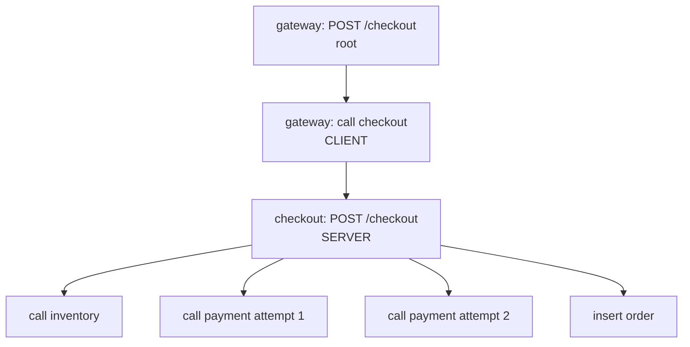
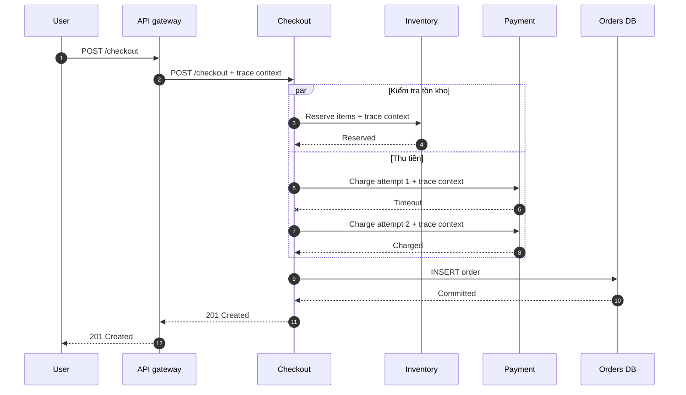
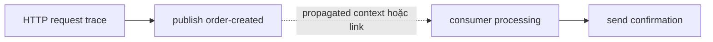

<Callout type="info" title="Mental model">
  Trace không phải một object lớn được truyền từ service này sang service khác.
  Mỗi service tạo và export các span riêng. Trace context giữ các span cùng
  `trace_id`, còn backend ghép chúng lại thành đường đi end-to-end.
</Callout>

## Mục lục

- [Trace là gì](#trace-là-gì)
  - [Trace span và operation](#trace-span-và-operation)
  - [Trace ID và distributed trace](#trace-id-và-distributed-trace)
- [Quan hệ parent child và causal path](#quan-hệ-parent-child-và-causal-path)
  - [Cây parent child](#cây-parent-child)
  - [Root span và remote parent](#root-span-và-remote-parent)
  - [Khi cây không đủ dùng span links](#khi-cây-không-đủ-dùng-span-links)
- [Lifecycle của request qua nhiều service](#lifecycle-của-request-qua-nhiều-service)
  - [Request đồng bộ](#request-đồng-bộ)
  - [Công việc bất đồng bộ](#công-việc-bất-đồng-bộ)
- [Context propagation giữ trace liền mạch](#context-propagation-giữ-trace-liền-mạch)
  - [Thông tin đi qua boundary](#thông-tin-đi-qua-boundary)
  - [Khi propagation sai](#khi-propagation-sai)
- [Cách đọc một trace](#cách-đọc-một-trace)
  - [Xác định phạm vi quan sát](#xác-định-phạm-vi-quan-sát)
  - [Tìm critical path và latency](#tìm-critical-path-và-latency)
  - [Khoanh vùng error](#khoanh-vùng-error)
  - [Nhận diện retry và fan out](#nhận-diện-retry-và-fan-out)
- [Incomplete trace và broken trace](#incomplete-trace-và-broken-trace)
  - [Incomplete trace](#incomplete-trace)
  - [Broken trace](#broken-trace)
  - [Nguyên nhân và cách xác minh](#nguyên-nhân-và-cách-xác-minh)
- [Limits và best practices](#limits-và-best-practices)
  - [Limits trong SDK và pipeline](#limits-trong-sdk-và-pipeline)
  - [Best practices khi thiết kế trace](#best-practices-khi-thiết-kế-trace)
  - [Bảo mật và cardinality](#bảo-mật-và-cardinality)
- [Xác minh dữ liệu bằng ví dụ thực tế](#xác-minh-dữ-liệu-bằng-ví-dụ-thực-tế)
  - [Kịch bản checkout](#kịch-bản-checkout)
  - [Quan sát bằng Collector debug exporter](#quan-sát-bằng-collector-debug-exporter)
  - [Kiểm tra các invariant](#kiểm-tra-các-invariant)
  - [Diễn giải kết quả](#diễn-giải-kết-quả)
- [Checklist điều tra nhanh](#checklist-điều-tra-nhanh)
- [Nguồn tham khảo chính thức](#nguồn-tham-khảo-chính-thức)
- [Bài liên quan](#bài-liên-quan)

## Trace là gì

**Trace** là bản ghi đường đi của một operation từ đầu đến cuối. Operation có thể là một HTTP request, một lần xử lý message, một scheduled job hoặc một giao dịch nghiệp vụ.

Ví dụ, người dùng gửi `POST /checkout`. Request đi qua API gateway, checkout service, inventory service, payment service và database. Trace giúp trả lời:

- Request đã đi qua những service nào?
- Thứ tự nhân quả giữa các operation là gì?
- Nhánh nào quyết định latency cuối cùng?
- Lỗi xuất hiện ở đâu?
- Hệ thống đã retry hay fan-out bao nhiêu lần?

Trace mô tả **một execution cụ thể**. Metric như p95 latency mô tả nhiều executions đã được tổng hợp. Log thường mô tả một sự kiện cụ thể nhưng không tự tạo ra cây quan hệ end-to-end.

### Trace span và operation

**Span** là đơn vị cấu thành trace. Mỗi span đại diện cho một operation có điểm bắt đầu và kết thúc.

Một trace thường chứa:

- một span cho request vào service;
- các span cho lời gọi HTTP, RPC, database hoặc queue;
- một số span cho bước nghiệp vụ đáng quan sát;
- quan hệ giữa các span để backend dựng lại causal path.

**Causal path** là đường đi nhân quả. Nếu operation B chỉ xảy ra vì operation A đã gọi hoặc lên lịch cho nó, B có quan hệ nhân quả với A.

Trang này tập trung vào trace ở cấp end-to-end. Kind, status, attributes, events, links và timing của từng span được trình bày tại [Spans](/signals/spans/).

<Callout type="idea" title="Không trace mọi function call">
  Một function chỉ đáng có span riêng khi operation đó hữu ích cho việc điều tra
  latency, lỗi hoặc dependency. Quá nhiều span làm tăng overhead và che khuất
  các operation quan trọng.
</Callout>

### Trace ID và distributed trace

Mọi span trong cùng một trace mang cùng **trace ID**. Trace ID là định danh của toàn bộ trace.

Theo OpenTelemetry Trace API, trace ID hợp lệ dài 16 byte. Dạng hex của nó có 32 ký tự và không được toàn số `0`.

```text
4bf92f3577b34da6a3ce929d0e0e4736
```

Mỗi span còn có một **span ID** riêng. Parent của span con được tham chiếu bằng span ID, không phải bằng tên service hoặc timestamp.

```text
trace_id       = 4bf92f3577b34da6a3ce929d0e0e4736
span_id        = 00f067aa0ba902b7
parent_span_id = a3ce929d0e0e4736
```

**Distributed trace** là trace có các span được tạo ở nhiều process, service, host hoặc môi trường thực thi. Các span vẫn dùng cùng trace ID vì context được truyền qua network boundary.

Trace ID hỗ trợ correlation. Nó không nên được dùng làm business ID, idempotency key, khóa database hay bằng chứng xác thực.

<Callout type="warn" title="Trace ID không phải request ID nghiệp vụ">
  Trace có thể bị sampling hoặc hết retention. Một business transaction cũng có
  thể sinh nhiều trace qua các bước bất đồng bộ. Hãy giữ order ID hoặc request ID
  nghiệp vụ riêng, rồi liên kết nó với telemetry theo policy phù hợp.
</Callout>

## Quan hệ parent child và causal path

### Cây parent child

Mỗi span có tối đa một parent trực tiếp. Một span có thể có nhiều child.

Quan hệ này tạo thành cây parent-child:



Cây thể hiện quan hệ nhân quả, không chỉ thể hiện các khoảng thời gian lồng nhau. Parent có thể kết thúc trước child trong một số mô hình bất đồng bộ. OpenTelemetry không tự động kết thúc child khi parent kết thúc.

Vì vậy, đừng kết luận dữ liệu sai chỉ vì thanh thời gian của child vượt ra ngoài parent. Trước tiên hãy kiểm tra mô hình async và độ lệch đồng hồ giữa các máy.

| Thuật ngữ | Ý nghĩa |
| --- | --- |
| Parent | Operation trực tiếp tạo, gọi hoặc bao quanh operation hiện tại |
| Child | Operation có một parent trực tiếp |
| Sibling | Các span có cùng parent |
| Ancestor | Parent, parent của parent và các cấp phía trên |
| Descendant | Child và các cấp phía dưới |
| Causal path | Chuỗi operation liên quan bởi parent-child hoặc link |

Tên span không quyết định quan hệ. Backend dựng cây từ `trace_id`, `span_id` và `parent_span_id`.

### Root span và remote parent

**Root span** là span không có parent. Khi SDK tạo root span, nó tạo trace ID mới.

Trong mô hình trace hoàn chỉnh, root là tổ tiên chung của mọi span khác. Root thường đại diện cho điểm bắt đầu được quan sát, chẳng hạn request vào gateway hoặc một scheduled job.

**Remote parent** là parent được tạo trong process khác. Service nhận context từ HTTP header hoặc message metadata rồi tạo span con của parent đó.

```text
Process gateway                     Process checkout

span_id = 1111111111111111
        │
        │ inject context qua HTTP
        ▼
remote parent = 1111111111111111 → span_id = 2222222222222222
```

Span ở `checkout` không phải root. Parent của nó là remote, dù parent span không tồn tại trong memory của process `checkout`.

Một server span tại điểm vào hệ thống chỉ là root khi không có valid parent context. Nếu public request mang valid `traceparent`, server span có thể là child của một remote parent mà hệ thống của bạn không thu thập.

<Callout type="info" title="Span đầu tiên nhìn thấy chưa chắc là root">
  Backend có thể chỉ nhận phần giữa của trace. Span trên cùng trong giao diện có
  thể vẫn có `parent_span_id` trỏ đến một span bị thiếu hoặc nằm ngoài phạm vi
  dữ liệu của bạn.
</Callout>

### Khi cây không đủ dùng span links

Một parent duy nhất không biểu diễn tốt mọi quan hệ.

Ví dụ, một consumer xử lý batch gồm 100 messages từ nhiều producer. Chọn một message làm parent sẽ làm mất quan hệ với 99 messages còn lại.

**Span link** liên kết span hiện tại với một hoặc nhiều `SpanContext` khác. Link có thể trỏ tới span trong cùng trace hoặc trace khác.

Các trường hợp thường cần cân nhắc link:

- batch consumer phụ thuộc vào nhiều messages;
- công việc bất đồng bộ bắt đầu sau khi trace gốc đã kết thúc;
- một operation được kích hoạt bởi nhiều nguồn;
- muốn giữ trace mới độc lập nhưng vẫn thể hiện quan hệ nhân quả.

Parent-child vẫn là lựa chọn tự nhiên cho lời gọi đồng bộ có một nguồn. Link bổ sung quan hệ khi cây một-parent không đủ.

Cách tạo và gắn thuộc tính cho link thuộc phạm vi [Spans](/signals/spans/).

## Lifecycle của request qua nhiều service

Trace không được export như một khối nguyên tử. Khi một recording span kết thúc, SDK chuyển dữ liệu của nó cho `SpanProcessor`. Span đủ điều kiện theo sampling decision có thể được exporter gửi đi bất đồng bộ.

Backend có thể nhận child trước parent. Backend cũng có thể nhận spans từ các service ở những batch khác nhau. Sau đó backend nhóm chúng theo trace ID và dựng quan hệ bằng span ID.

Lifecycle điển hình gồm:

1. Service đầu tiên nhận request và tạo root hoặc server span có remote parent.
2. Instrumentation tạo child span trước lời gọi downstream.
3. Propagator inject context của span hiện tại vào carrier.
4. Service downstream extract context và tạo span có remote parent.
5. Mỗi operation kết thúc span của nó.
6. Span processor và exporter gửi span tới Collector hoặc backend.
7. Backend ghép các span thành trace có thể truy vấn.

### Request đồng bộ

Kịch bản checkout có hai nhánh chạy song song. Payment bị timeout lần đầu và thành công khi retry.



Trước mỗi lời gọi remote, phía gửi inject context vào carrier. Phía nhận extract context đó. Instrumentation ở cả hai phía có thể tạo một client span và một server span cho cùng lời gọi.

Client và server spans của cùng request thường chồng lấp phần lớn thời gian. Không cộng duration của chúng như hai công việc tuần tự.

### Công việc bất đồng bộ

Với queue, producer có thể kết thúc trước khi consumer bắt đầu. Thời gian chờ trong queue là một phần quan trọng của latency nhưng không nhất thiết nằm trong duration của consumer.



Cách biểu diễn parent hoặc link phụ thuộc topology, semantic conventions và mục tiêu truy vấn. Quan hệ nhân quả cần được ghi rõ và context cần đi trong message metadata.

Một trace kéo dài qua job bất đồng bộ có thể rất dài. Nhiều hệ thống chủ động bắt đầu trace mới cho bước deferred rồi dùng link để liên hệ trace trước đó.

## Context propagation giữ trace liền mạch

**Context propagation** là cơ chế truyền trạng thái của operation hiện tại qua process hoặc network boundary. Đây là điều làm distributed tracing hoạt động.

Phần này chỉ cung cấp mental model cần để đọc trace. Cấu trúc `traceparent`, inject, extract, baggage và trust boundary được giải thích đầy đủ tại [Context propagation](/fundamentals/context-propagation/).

### Thông tin đi qua boundary

Với W3C Trace Context, phía gửi thường inject `traceparent` và có thể inject `tracestate` vào carrier. Carrier có thể là HTTP headers, RPC metadata hoặc message headers.

Header `traceparent` chứa:

- version;
- trace ID;
- parent ID, tức span ID của phía gửi;
- trace flags, trong đó có sampled flag.

Phía nhận thực hiện theo thứ tự:

1. Extract và validate context từ carrier.
2. Đặt context đã extract làm parent context.
3. Tạo span cho operation nhận request hoặc message.

Trace ID được giữ nguyên. Span ID mới được tạo cho span phía nhận. Parent được đánh dấu là remote trong context đã extract.

<Callout type="warn" title="Context không phải cơ chế bảo mật">
  `traceparent` hợp lệ không chứng minh caller đã được xác thực hoặc được cấp
  quyền. Hãy xem propagation headers là input từ bên ngoài và áp dụng policy tại
  trust boundary.
</Callout>

### Khi propagation sai

Nếu service downstream không extract context, span mới thường trở thành root và nhận trace ID mới. Một request nghiệp vụ lúc này xuất hiện thành nhiều trace rời rạc.

Nếu service extract sau khi tạo server span, server span có thể gắn sai parent. Nếu auto-instrumentation và code thủ công cùng tạo span cho một boundary, trace có thể xuất hiện duplicate spans.

Nếu proxy xóa header hoặc producer không copy metadata vào message, mối quan hệ sẽ đứt tại boundary đó.

Nói ngắn gọn: kiểm tra propagation ở từng boundary thay vì chỉ nhìn service đầu và service cuối.

## Cách đọc một trace

Giao diện backend thường hiển thị trace dưới dạng cây và waterfall. Cây cho biết quan hệ. Waterfall cho biết thời điểm bắt đầu, duration và mức độ chồng lấp.

Đọc trace hiệu quả cần kết hợp cả hai góc nhìn.

### Xác định phạm vi quan sát

Trước tiên, hãy trả lời:

- Trace bắt đầu và kết thúc ở đâu trong phạm vi telemetry hiện có?
- Span trên cùng thật sự không có parent hay chỉ thiếu parent?
- Những service nào đã được instrument?
- Time range và retention có bao phủ toàn bộ request không?
- Trace có được sampling nhất quán không?

Sau đó kiểm tra `service.name`, operation name và route. Các trường này giúp phân biệt dependency thật với span nội bộ có tên gần giống.

Root duration thường gần latency end-to-end trong phạm vi root đo được. Nó không nhất thiết bằng latency người dùng nhìn thấy nếu browser, CDN hoặc upstream proxy nằm ngoài trace.

### Tìm critical path và latency

**Critical path** là chuỗi công việc quyết định thời điểm operation hoàn tất. Rút ngắn span nằm ngoài critical path có thể không làm giảm latency end-to-end.

Với fan-out song song, nhánh chậm nhất mà parent phải chờ thường nằm trên critical path. Tổng duration của các sibling có thể lớn hơn duration của parent vì chúng chạy đồng thời.

```text
checkout total     [--------------------------] 180 ms
inventory          [------]                     40 ms
payment attempt 1  [------------]               80 ms
payment attempt 2               [------]         45 ms
insert order                       [---]          20 ms
```

Không tính `40 + 80 + 45 + 20 = 185 ms` rồi kết luận trace sai. Inventory chồng lấp với payment. Critical path đi qua payment attempt 1, payment attempt 2 và insert order.

Cách tìm critical path:

1. Bắt đầu từ span đại diện cho latency người dùng quan tâm.
2. Tìm child kết thúc muộn nhất hoặc chặn parent lâu nhất.
3. Lặp lại trên nhánh đó cho đến dependency cuối.
4. Kiểm tra khoảng trống không có child span.
5. Kiểm tra operation chồng lấp trước khi cộng duration.

Khoảng trống trong parent có thể là application code, lock contention, scheduling, serialization hoặc công việc chưa được instrument. Một số backend gọi phần này là **self time**.

Self time không phải lúc nào cũng bằng `parent duration - tổng child duration`. Các child có thể chồng lấp. Cách đúng phải trừ hợp của các khoảng thời gian child.

<Callout type="idea" title="Đừng cộng client và server latency hai lần">
  Client span và server span của cùng remote call đo hai góc nhìn chồng lấp. Phần
  chênh lệch có thể gồm network, proxy, queueing hoặc clock skew.
</Callout>

### Khoanh vùng error

Một trace thành công vẫn có thể chứa span lỗi. Retry có thể phục hồi lỗi ở dependency và root cuối cùng trả `201`.

Đọc error từ ngoài vào trong:

1. Kiểm tra kết quả caller nhận được.
2. Tìm span đầu tiên có status lỗi hoặc exception liên quan.
3. Kiểm tra lỗi đã được xử lý, retry hay lan truyền lên parent.
4. So sánh mã lỗi ở client và server của cùng remote call.
5. Mở logs bằng trace ID và span ID nếu cần chi tiết.

Không nên suy luận chỉ từ màu đỏ trong UI. Quy tắc map protocol result sang span status phụ thuộc semantic conventions và instrumentation.

Việc ghi exception event cũng không tự động đảm bảo status được đặt thành `ERROR`. Chi tiết nằm tại [Spans](/signals/spans/).

### Nhận diện retry và fan out

**Retry** thường xuất hiện thành nhiều outgoing spans cùng operation dưới một parent. Các lần gọi xảy ra tuần tự hoặc có khoảng backoff giữa chúng.

Dấu hiệu thường gặp:

- cùng dependency và operation lặp lại;
- lần trước timeout hoặc lỗi;
- lần sau thành công;
- root latency tăng dù kết quả cuối cùng thành công.

Nếu instrumentation cung cấp attempt number hoặc retry reason, hãy dùng chúng. Đừng giả định mọi span lặp lại đều là retry. Chúng cũng có thể là pagination, polling hoặc N+1 calls.

**Fan-out** là một operation tạo nhiều child chạy song song. Fan-out hợp lệ có thể là truy vấn nhiều shard. Fan-out bất thường có thể là N+1 query hoặc số dependency tăng theo kích thước input.

Khi thấy fan-out, hãy kiểm tra số child, mức đồng thời, nhánh chậm nhất, connection pool, lỗi một phần và cơ chế cancel.

## Incomplete trace và broken trace

`Incomplete trace` và `broken trace` là thuật ngữ vận hành phổ biến. Chúng không phải hai kiểu dữ liệu riêng trong OpenTelemetry.

### Incomplete trace

**Incomplete trace** là trace vẫn có một trace ID nhưng thiếu một hoặc nhiều span được kỳ vọng.

```text
trace_id = T

gateway span ──► [checkout span bị thiếu] ──► payment span
```

Payment span có thể mang `parent_span_id` không tồn tại trong backend. Nguyên nhân có thể là sampling, export failure, process crash, exporter queue overflow, Collector drop hoặc retention.

Một parent bị thiếu không luôn là lỗi. Parent có thể thuộc upstream ngoài phạm vi thu thập. Nó cũng có thể không được quyền hiển thị cho tenant hiện tại.

### Broken trace

**Broken trace** thường chỉ causal flow bị tách thành nhiều trace ID vì context không được truyền hoặc không được dùng đúng.

```text
gateway: trace_id = T1
checkout: trace_id = T2
payment: trace_id = T2
```

Boundary giữa gateway và checkout là điểm cần kiểm tra đầu tiên. Header có thể bị xóa, propagator không tương thích hoặc server span được tạo trước khi extract.

| Dấu hiệu | Incomplete trace | Broken trace |
| --- | --- | --- |
| Trace ID | Các span thấy được vẫn cùng ID | Một request xuất hiện với nhiều ID |
| Parent ID | Có thể trỏ tới span bị thiếu | Chuỗi parent thường bắt đầu lại ở root mới |
| Điểm kiểm tra đầu tiên | SDK, exporter, Collector, backend | Inject, carrier, proxy, extract |
| Có thể ghép chắc chắn bằng timestamp không | Không | Không |

Timestamp, route và business ID có thể giúp điều tra. Chúng không thay thế parent context và không chứng minh hai trace thuộc cùng execution.

### Nguyên nhân và cách xác minh

| Triệu chứng | Nguyên nhân khả dĩ | Cách xác minh |
| --- | --- | --- |
| Thiếu root nhưng có child | Root chưa export, bị drop, hết retention hoặc nằm ngoài trust boundary | Kiểm tra `parent_span_id`, upstream và pipeline của root |
| Mỗi service là một root | Mất propagation | Capture carrier tại từng hop và so sánh `traceparent` |
| Thiếu span cuối request | Process thoát trước batch flush hoặc span chưa end | Kiểm tra shutdown hook, SDK log và exporter queue |
| Thiếu ngẫu nhiên khi tải cao | Queue đầy, backpressure, memory limiter hoặc backend throttle | Kiểm tra Collector internal telemetry và exporter errors |
| Parent đúng nhưng timeline lạ | Clock skew hoặc công việc async | So sánh clock và mô hình execution |
| Chỉ mất trace chậm hoặc lỗi | Sampling policy không giữ nhóm cần điều tra | Kiểm tra policy tại SDK và Collector |
| Trace quá lớn bị cắt | Fan-out, retry storm hoặc backend limit | Kiểm tra span count, dropped counts và ingest limits |
| Duplicate span ở một boundary | Auto-instrumentation và manual instrumentation cùng ghi | So sánh scope, kind, name và timestamp |

<Callout type="warn" title="Span đến không theo thứ tự là bình thường">
  Child có thể được export trước parent. Đừng kết luận trace bị hỏng chỉ từ thứ
  tự log của Collector. Hãy chờ hết batching window rồi kiểm tra IDs và parent
  relationship.
</Callout>

## Limits và best practices

### Limits trong SDK và pipeline

Telemetry có giới hạn để tránh một request bất thường làm cạn memory.

OpenTelemetry SDK specification định nghĩa các span limits có thể cấu hình. Chúng thường gồm số attributes, events, links và số attributes trên mỗi event hoặc link.

Theo specification hiện hành, các mặc định được khuyến nghị gồm:

| Giới hạn | Mặc định theo specification |
| --- | ---: |
| Attributes trên một record | 128 |
| Events trên một span | 128 |
| Links trên một span | 128 |
| Attributes trên một event | 128 |
| Attributes trên một link | 128 |
| Độ dài attribute value | Không giới hạn mặc định |

SDK có thể discard phần tử vượt count limit hoặc truncate value theo cấu hình. Exported span có dropped counts để exporter báo số phần tử đã bị loại khi implementation hỗ trợ.

Hãy kiểm tra tài liệu của ngôn ngữ và phiên bản SDK đang dùng. Tên option và mức hỗ trợ environment variable có thể khác nhau.

Pipeline còn có các giới hạn khác:

- batch và exporter queue dùng memory hữu hạn;
- Collector có thể áp dụng `memory_limiter`, filter hoặc sampling;
- OTLP receiver và proxy có giới hạn payload;
- backend có giới hạn span count, trace size, ingest rate và retention;
- quyền truy cập có thể làm người xem chỉ thấy một phần trace.

Sampling là một nguồn chủ động làm giảm dữ liệu. Head sampling, tail sampling và tính nhất quán giữa service được trình bày tại [Sampling](/signals/sampling/).

### Best practices khi thiết kế trace

- Tạo span cho operation có ý nghĩa vận hành.
- Giữ tên span ổn định giữa các executions.
- Dùng route template như `POST /users/{id}` thay vì URL chứa ID thật.
- Tạo span mới trước khi inject context cho outgoing remote call.
- Extract context trước khi tạo server hoặc consumer span.
- End mọi recording span, kể cả khi code throw hoặc bị cancel.
- Dùng `try/finally`, context manager hoặc scope idiomatic của SDK.
- Cấu hình graceful shutdown để flush batch trước khi process dừng.
- Giữ sampling decision nhất quán theo parent khi topology yêu cầu trace liền mạch.
- Dùng links khi có nhiều nguồn nhân quả hoặc khi cố ý bắt đầu trace mới.
- Test propagation cho từng HTTP, RPC và messaging boundary.
- Theo dõi dropped spans, exporter failures và Collector queue saturation.

Một trace tốt không phải trace có nhiều span nhất. Trace tốt là trace trả lời được câu hỏi vận hành với overhead chấp nhận được.

### Bảo mật và cardinality

Trace có thể đi qua nhiều service và ranh giới tin cậy. Dữ liệu trên span có thể được lưu lâu và được nhiều nhóm truy cập.

Không ghi các dữ liệu sau nếu chưa có policy rõ ràng:

- access token, cookie hoặc API key;
- password và credential;
- request hoặc response body chứa PII;
- full SQL statement có dữ liệu người dùng;
- baggage nhận từ bên ngoài mà chưa allowlist.

**Cardinality** là số lượng giá trị khác nhau của một field. User ID, order ID và URL đầy đủ có cardinality cao.

Không đặt giá trị cardinality cao vào tên span. Việc đặt chúng vào attribute cũng cần retention, access control và cost policy phù hợp.

Giới hạn kỹ thuật không thay thế data governance. Một value nằm dưới length limit vẫn có thể là secret.

## Xác minh dữ liệu bằng ví dụ thực tế

Bài kiểm tra cần chứng minh bốn điều:

1. Span thực sự được tạo ở từng service.
2. Trace ID được giữ nguyên qua boundary.
3. Span ID và parent span ID tạo đúng cây.
4. Timeline giải thích được latency, error và retry.

### Kịch bản checkout

Giả sử local environment có bốn service đã được instrument:

```text
client → gateway → checkout → inventory
                          └→ payment
```

Gửi đúng một request trong khoảng thời gian dễ nhận biết:

```bash
curl --fail-with-body \
  -X POST http://localhost:8080/checkout \
  -H 'content-type: application/json' \
  -d '{"sku":"OTEL-BOOK","quantity":1}'
```

Nếu endpoint khác, hãy thay URL và payload. Không tự thêm `traceparent` trong lần kiểm tra đầu tiên. Hãy để service đầu tạo root để backend nhận trace hoàn chỉnh trong phạm vi lab.

Ghi lại thời điểm gửi, HTTP status và service entry. Chúng giúp tìm trace nếu ứng dụng chưa trả trace ID trong response.

### Quan sát bằng Collector debug exporter

Trong local environment, có thể tạm thêm `debug` exporter vào traces pipeline:

```yaml
exporters:
  debug:
    verbosity: detailed

service:
  pipelines:
    traces:
      receivers: [otlp]
      processors: [batch]
      exporters: [debug]
```

Tên receiver và processors phải khớp cấu hình Collector hiện có. Không dùng `detailed` lâu dài trong production vì output lớn và có thể chứa dữ liệu nhạy cảm.

Khởi động lại Collector, gửi một request và lưu output. Định dạng log phụ thuộc phiên bản Collector, nhưng cần tìm các trường tương đương:

- trace ID;
- span ID;
- parent span ID;
- service name và span name;
- start time và end time;
- status;
- dropped attribute, event hoặc link counts nếu có.

Output rút gọn dưới đây chỉ minh họa dữ liệu cần đối chiếu. Nó không phải OTLP/JSON chuẩn:

```text
service=gateway  name="POST /checkout"       trace=T span=G1 parent=∅  duration=182ms status=UNSET
service=gateway  name="call checkout"        trace=T span=G2 parent=G1 duration=156ms status=UNSET
service=checkout name="POST /checkout"       trace=T span=C1 parent=G2 duration=149ms status=UNSET
service=checkout name="reserve inventory"    trace=T span=C2 parent=C1 duration=43ms  status=UNSET
service=checkout name="charge attempt 1"     trace=T span=C3 parent=C1 duration=80ms  status=ERROR
service=checkout name="charge attempt 2"     trace=T span=C4 parent=C1 duration=41ms  status=UNSET
service=checkout name="insert order"         trace=T span=C5 parent=C1 duration=22ms  status=UNSET
```

Backend có thể hiển thị thêm server spans của inventory và payment. Khi cả client và server được instrument, server span dùng cùng trace ID và tham chiếu client span phía gọi làm remote parent.

### Kiểm tra các invariant

**Invariant** là điều kiện phải luôn đúng nếu mô hình và pipeline hoạt động như dự kiến. Checklist dưới đây giả định bài test thu thập một trace hoàn chỉnh trong cùng phạm vi quan sát.

- [ ] Mọi span của request dùng cùng trace ID `T`.
- [ ] Mỗi span có span ID riêng và hợp lệ.
- [ ] Root span không có parent trong lần test không inject context.
- [ ] Trong dataset hoàn chỉnh của bài test, mỗi non-root `parent_span_id` khớp một `span_id` đã biết.
- [ ] Server span downstream là child của context được inject từ phía gọi.
- [ ] `service.name` phân biệt đúng các service.
- [ ] Start và end time tạo duration không âm.
- [ ] Các nhánh song song chồng lấp trên waterfall.
- [ ] Lần payment đầu có dấu hiệu timeout hoặc error.
- [ ] Lần retry có metadata đủ để phân biệt nếu instrumentation cung cấp.
- [ ] Root hoàn tất với kết quả khớp HTTP response.
- [ ] Không có dropped counts ngoài dự kiến.

Kiểm tra parent relationship bằng map đơn giản:

```text
spanById = map tất cả span theo span_id

for mỗi span không phải root:
    assert span.trace_id == root.trace_id
    assert spanById có khóa span.parent_span_id
```

Nếu assert parent thất bại, chưa vội kết luận propagation hỏng. Parent có thể nằm ngoài phạm vi quan sát, đã hết retention hoặc bị mất trong pipeline. Hãy tìm span cùng trace ID ở Collector logs, backend khác, tenant khác hoặc time range rộng hơn.

### Diễn giải kết quả

Với output mẫu:

- `G1` là root vì không có parent.
- `G2` là child local của `G1` và đại diện outgoing call.
- `C1` giữ trace `T` và có remote parent `G2`.
- `C2`, `C3`, `C4` và `C5` là children của checkout operation.
- `C3` lỗi nhưng request cuối cùng thành công nhờ `C4`.
- Critical path đi qua hai payment attempts rồi tới `C5`.
- Inventory không quyết định latency nếu hoàn tất trước nhánh payment.

Trong môi trường lab, có thể làm negative test bằng cách tạm tắt propagation tại đúng một boundary. Kết quả mong đợi là downstream tạo trace ID khác hoặc root mới.

Bật lại propagation và xác nhận cây trở về một trace ID. Bài test này chứng minh instrumentation hoạt động thay vì chỉ chứng minh backend đang hiển thị dữ liệu cũ.

<Callout type="error" title="Chỉ negative test trong môi trường kiểm soát">
  Không tắt propagation trên production traffic. Thay đổi này làm giảm khả năng
  điều tra sự cố và có thể ảnh hưởng sampling policy phụ thuộc parent.
</Callout>

## Checklist điều tra nhanh

Khi trace trông sai, kiểm tra theo thứ tự:

1. **Đúng request:** time range, route, status và service có khớp không?
2. **Đúng trace ID:** các service có cùng trace ID không?
3. **Đúng parent:** mỗi parent span ID có resolve được không?
4. **Đúng boundary:** context đã inject và extract ở HTTP, RPC hoặc queue chưa?
5. **Đủ dữ liệu:** SDK, exporter, Collector hoặc backend có drop span không?
6. **Đúng timeline:** có fan-out, retry, async work hoặc clock skew không?
7. **Đúng sampling:** policy có giữ trace nhất quán không?
8. **Đúng diễn giải:** có cộng duration chồng lấp hoặc đếm client/server hai lần không?

Nếu trace ID đổi tại một boundary, ưu tiên kiểm tra propagation. Nếu trace ID giữ nguyên nhưng parent bị thiếu, ưu tiên kiểm tra pipeline và sampling.

## Nguồn tham khảo chính thức

- [OpenTelemetry Docs — Traces](https://opentelemetry.io/docs/concepts/signals/traces/)
- [OpenTelemetry Specification — Tracing API](https://opentelemetry.io/docs/specs/otel/trace/api/)
- [OpenTelemetry Specification — Tracing SDK và Span Limits](https://opentelemetry.io/docs/specs/otel/trace/sdk/#span-limits)
- [OpenTelemetry Specification — Attribute Limits](https://opentelemetry.io/docs/specs/otel/common/#attribute-limits)
- [OpenTelemetry Semantic Conventions — Traces](https://opentelemetry.io/docs/specs/semconv/general/trace/)
- [OpenTelemetry Collector — Configuration](https://opentelemetry.io/docs/collector/configuration/)
- [W3C Trace Context](https://www.w3.org/TR/trace-context/)

## Bài liên quan

<Cards>
  <Card title="Spans" href="/signals/spans/" description="Tìm hiểu kind, status, attributes, events, links và timing của từng span." />
  <Card title="Context propagation" href="/fundamentals/context-propagation/" description="Hiểu cách inject và extract trace context qua HTTP, RPC và messaging." />
  <Card title="Sampling" href="/signals/sampling/" description="Chọn chiến lược sampling mà không làm trace bị đứt ngoài ý muốn." />
  <Card title="Tổng quan signals" href="/fundamentals/signals-overview/" description="So sánh traces với metrics, logs và các cơ chế correlation." />
</Cards>
